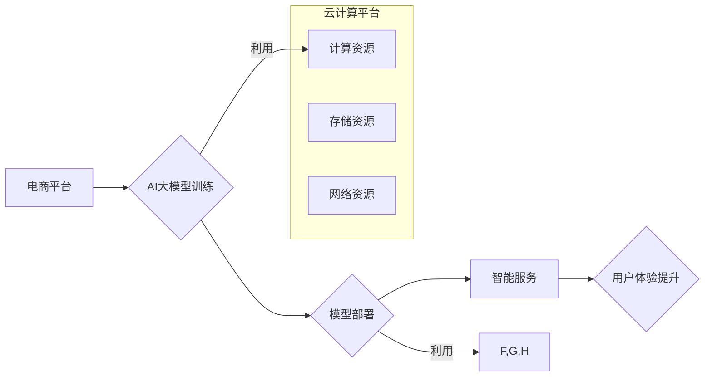

                 

## 电商平台中的AI大模型与云计算结合

> 关键词：AI大模型、云计算、电商平台、推荐系统、个性化服务、自然语言处理、机器学习、深度学习

## 1. 背景介绍

电子商务平台作为当今数字经济的重要组成部分，其发展离不开对用户体验的不断提升。随着数据量的激增和计算能力的提升，人工智能（AI）技术逐渐成为电商平台发展的新引擎。其中，AI大模型凭借其强大的学习能力和泛化能力，在电商平台的各个环节展现出巨大的潜力，例如商品推荐、个性化服务、智能客服等。

然而，AI大模型的训练和部署需要海量计算资源和存储空间，这对于传统电商平台来说是一个巨大的挑战。云计算技术的出现为解决这一难题提供了完美的解决方案。云计算平台提供弹性、可扩展的计算资源和存储服务，使得电商平台能够灵活地部署和利用AI大模型，从而实现更智能化、更高效的运营。

## 2. 核心概念与联系

### 2.1 AI大模型

AI大模型是指在海量数据上训练的具有强大泛化能力的深度学习模型。其特点包括：

* **规模庞大:** 参数数量巨大，通常包含数十亿甚至数千亿个参数。
* **学习能力强:** 可以学习复杂的模式和关系，并进行多任务学习。
* **泛化能力强:** 在未见过的任务和数据上也能表现出良好的性能。

常见的AI大模型包括GPT-3、BERT、LaMDA等。

### 2.2 云计算

云计算是一种按需提供的计算资源、存储资源和网络资源的服务模式。其特点包括：

* **弹性:** 可以根据需要动态地增加或减少资源。
* **可扩展性:** 可以轻松地扩展资源规模，满足不断增长的需求。
* **按需付费:** 只为使用的资源付费，降低了成本。

常见的云计算平台包括AWS、Azure、Google Cloud等。

### 2.3 AI大模型与云计算的结合

AI大模型的训练和部署需要海量计算资源和存储空间，而云计算平台能够提供这些资源，两者结合可以实现以下优势：

* **降低成本:** 利用云计算平台的按需付费模式，避免了购买和维护昂贵硬件的成本。
* **提高效率:** 云计算平台提供强大的计算能力和存储服务，可以加速AI大模型的训练和部署。
* **增强灵活性:** 云计算平台的弹性资源可以满足电商平台对AI大模型资源的需求变化。

**Mermaid 流程图**



## 3. 核心算法原理 & 具体操作步骤

### 3.1 算法原理概述

在电商平台中，AI大模型通常用于推荐系统、个性化服务、智能客服等领域。其中，推荐系统是利用用户行为数据和商品信息，预测用户对商品的兴趣，并推荐相关的商品。常用的推荐算法包括：

* **协同过滤:** 基于用户的相似度或商品的相似度进行推荐。
* **内容过滤:** 基于商品的特征和用户偏好进行推荐。
* **深度学习:** 利用深度神经网络学习用户和商品之间的复杂关系，进行推荐。

### 3.2 算法步骤详解

以深度学习推荐算法为例，其具体操作步骤如下：

1. **数据收集和预处理:** 收集用户行为数据（例如浏览记录、购买记录、评分等）和商品信息（例如商品类别、价格、描述等），并进行清洗、转换和特征工程。
2. **模型构建:** 选择合适的深度学习模型，例如多层感知机（MLP）、卷积神经网络（CNN）或循环神经网络（RNN）。
3. **模型训练:** 利用训练数据训练模型，调整模型参数，使模型能够准确预测用户对商品的兴趣。
4. **模型评估:** 利用测试数据评估模型的性能，例如准确率、召回率、F1-score等。
5. **模型部署:** 将训练好的模型部署到电商平台，并实时进行推荐。

### 3.3 算法优缺点

**优点:**

* 能够学习复杂的模式和关系，提高推荐准确率。
* 可以进行多任务学习，例如同时进行商品推荐和用户画像。
* 具有较强的泛化能力，可以应用于不同的电商平台和场景。

**缺点:**

* 训练数据量大，需要大量的计算资源和时间。
* 模型参数复杂，需要专业的技术人员进行调优。
* 对数据质量要求高，数据不准确或不完整会影响模型性能。

### 3.4 算法应用领域

深度学习推荐算法在电商平台的应用领域非常广泛，例如：

* **商品推荐:** 推荐用户可能感兴趣的商品。
* **个性化服务:** 根据用户的兴趣和偏好，提供个性化的商品推荐、促销活动和服务。
* **智能客服:** 利用自然语言处理技术，实现智能客服，自动回答用户问题。
* **搜索引擎优化:** 根据用户的搜索行为，优化商品的搜索排名。

## 4. 数学模型和公式 & 详细讲解 & 举例说明

### 4.1 数学模型构建

深度学习推荐算法通常基于神经网络模型，其数学模型可以表示为：

$$
y = f(W_1x_1 + W_2x_2 + ... + W_nx_n + b)
$$

其中：

* $y$ 是模型的输出，表示对商品的兴趣预测值。
* $x_1, x_2, ..., x_n$ 是输入特征，例如用户的历史购买记录、商品的类别、价格等。
* $W_1, W_2, ..., W_n$ 是模型参数，表示特征的权重。
* $b$ 是偏置项。
* $f$ 是激活函数，例如ReLU、Sigmoid等。

### 4.2 公式推导过程

模型参数的学习过程是通过反向传播算法进行的。反向传播算法的核心思想是利用梯度下降法，不断调整模型参数，使得模型输出与真实值之间的误差最小化。

具体推导过程如下：

1. 计算模型输出与真实值的误差，即损失函数。
2. 计算损失函数对模型参数的梯度。
3. 根据梯度更新模型参数，例如使用Adam优化器。
4. 重复步骤1-3，直到模型性能达到预期的水平。

### 4.3 案例分析与讲解

假设我们有一个电商平台，想要推荐用户可能感兴趣的书籍。我们可以使用深度学习推荐算法，将用户的历史购买记录、书籍的类别、价格等信息作为输入特征，并训练一个神经网络模型。

模型训练完成后，我们可以将用户的历史购买记录作为输入，预测用户对不同书籍的兴趣。然后，根据预测结果，推荐用户可能感兴趣的书籍。

## 5. 项目实践：代码实例和详细解释说明

### 5.1 开发环境搭建

为了实现AI大模型在电商平台的应用，我们需要搭建一个合适的开发环境。常用的开发环境包括：

* **本地开发环境:** 使用自己的电脑进行开发，需要安装相应的软件和库，例如Python、TensorFlow、PyTorch等。
* **云平台开发环境:** 利用云计算平台提供的开发工具和服务，例如AWS SageMaker、Azure Machine Learning、Google Cloud AI Platform等。

### 5.2 源代码详细实现

以下是一个使用Python和TensorFlow实现深度学习推荐算法的简单代码示例：

```python
import tensorflow as tf

# 定义模型
model = tf.keras.Sequential([
    tf.keras.layers.Dense(64, activation='relu', input_shape=(10,)),
    tf.keras.layers.Dense(32, activation='relu'),
    tf.keras.layers.Dense(1, activation='sigmoid')
])

# 编译模型
model.compile(optimizer='adam', loss='binary_crossentropy', metrics=['accuracy'])

# 训练模型
model.fit(x_train, y_train, epochs=10)

# 评估模型
loss, accuracy = model.evaluate(x_test, y_test)
print('Loss:', loss)
print('Accuracy:', accuracy)
```

### 5.3 代码解读与分析

这段代码定义了一个简单的深度学习模型，用于预测用户对商品的兴趣。

* `tf.keras.Sequential` 创建了一个顺序模型，即层级连接的模型。
* `tf.keras.layers.Dense` 定义了一个全连接层，每个神经元都连接到上一层的每个神经元。
* `activation='relu'` 设置了ReLU激活函数，用于引入非线性。
* `input_shape=(10,)` 设置了输入特征的维度，这里假设输入特征有10个。
* `optimizer='adam'` 设置了Adam优化器，用于更新模型参数。
* `loss='binary_crossentropy'` 设置了二分类交叉熵损失函数，用于计算模型输出与真实值的误差。
* `metrics=['accuracy']` 设置了准确率作为评估指标。

### 5.4 运行结果展示

训练完成后，我们可以使用`model.evaluate()`方法评估模型的性能，并打印出损失值和准确率。

## 6. 实际应用场景

### 6.1 商品推荐

AI大模型可以根据用户的历史购买记录、浏览记录、评分等信息，预测用户对商品的兴趣，并推荐相关的商品。例如，当用户浏览了一款运动鞋时，AI大模型可以推荐其他用户购买过该款运动鞋的用户也购买过的商品，例如运动袜、运动服等。

### 6.2 个性化服务

AI大模型可以根据用户的兴趣和偏好，提供个性化的商品推荐、促销活动和服务。例如，电商平台可以根据用户的购物历史和浏览记录，推荐他们可能感兴趣的商品类别、品牌和价格范围。

### 6.3 智能客服

AI大模型可以利用自然语言处理技术，实现智能客服，自动回答用户问题，例如商品信息、订单状态、退换货政策等。

### 6.4 未来应用展望

随着AI技术的不断发展，AI大模型在电商平台的应用场景将会更加广泛，例如：

* **个性化营销:** 根据用户的兴趣和行为，进行精准的营销推广。
* **智能库存管理:** 利用AI大模型预测商品需求，优化库存管理。
* **欺诈检测:** 利用AI大模型识别和预防欺诈行为。

## 7. 工具和资源推荐

### 7.1 学习资源推荐

* **书籍:**
    * 《深度学习》 by Ian Goodfellow, Yoshua Bengio, Aaron Courville
    * 《机器学习》 by Tom Mitchell
* **在线课程:**
    * Coursera: 深度学习 Specialization
    * Udacity: AI Programming with Python Nanodegree
* **博客和网站:**
    * TensorFlow Blog: https://blog.tensorflow.org/
    * PyTorch Blog: https://pytorch.org/blog/

### 7.2 开发工具推荐

* **TensorFlow:** https://www.tensorflow.org/
* **PyTorch:** https://pytorch.org/
* **Keras:** https://keras.io/

### 7.3 相关论文推荐

* **Attention Is All You Need:** https://arxiv.org/abs/1706.03762
* **BERT: Pre-training of Deep Bidirectional Transformers for Language Understanding:** https://arxiv.org/abs/1810.04805

## 8. 总结：未来发展趋势与挑战

### 8.1 研究成果总结

AI大模型在电商平台的应用取得了显著的成果，例如提高了推荐准确率、个性化服务水平和智能客服效率。

### 8.2 未来发展趋势

未来，AI大模型在电商平台的应用将会更加深入和广泛，例如：

* **模型规模更大:** 训练更庞大的模型，学习更复杂的模式和关系。
* **多模态融合:** 将文本、图像、音频等多种模态数据融合，实现更全面的用户理解。
* **边缘计算:** 将AI模型部署到边缘设备，实现更低延迟和更高效率的应用。

### 8.3 面临的挑战

AI大模型在电商平台的应用也面临一些挑战，例如：

* **数据隐私:** 如何保护用户数据隐私，是AI大模型应用的一个重要问题。
* **模型解释性:** AI模型的决策过程往往难以解释，这可能会导致用户对模型结果的信任度降低。
* **公平性:** AI模型可能会存在偏见，导致不公平的结果，需要进行公平性评估和调优。

### 8.4 研究展望

未来，我们需要继续研究如何解决AI大模型在电商平台应用中的挑战，例如：

* 开发更隐私保护的AI模型和算法。
* 研究AI模型的解释性，提高用户对模型结果的理解和信任。
* 构建公平的AI模型，避免模型偏见导致的不公平结果。


## 9. 附录：常见问题与解答

### 9.1 如何选择合适的AI大模型？

选择合适的AI大模型需要根据具体的应用场景和数据特点进行考虑。例如，对于商品推荐场景，可以考虑使用协同过滤、内容过滤或深度学习推荐算法。

### 9.2 如何训练AI大模型？

训练AI大模型需要准备充足的数据，并选择合适的模型架构和训练参数。可以使用云计算平台提供的训练服务，或者在本地搭建训练环境。

### 9.3 如何部署AI大模型？

部署AI大模型可以利用云计算平台提供的服务，例如AWS SageMaker、Azure Machine Learning、Google Cloud AI Platform等。也可以将模型部署到边缘设备，实现更低延迟和更高效率的应用。


作者：禅与计算机程序设计艺术 / Zen and the Art of Computer Programming 
<end_of_turn>

