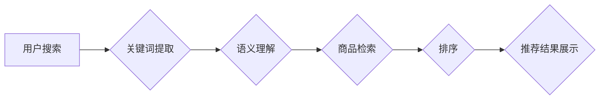

                 

## 电商平台搜索推荐系统的AI 大模型应用：提高系统性能、效率、准确率

> 关键词：电商平台、搜索推荐系统、AI 大模型、自然语言处理、深度学习、推荐算法、个性化推荐、用户体验

## 1. 背景介绍

在当今数字经济时代，电商平台作为重要的商业模式，其搜索推荐系统扮演着至关重要的角色。搜索推荐系统旨在根据用户的搜索行为、浏览历史、购买记录等信息，精准推荐用户感兴趣的商品，从而提升用户体验、提高转化率，最终促进平台的商业发展。

传统电商平台搜索推荐系统主要依赖于基于规则的算法和传统的机器学习方法，例如协同过滤、基于内容的推荐等。然而，随着用户行为数据的爆炸式增长和推荐需求的不断提升，传统方法面临着以下挑战：

* **数据稀疏性:** 用户行为数据往往存在稀疏性，难以捕捉用户细粒度的兴趣偏好。
* **冷启动问题:** 新用户和新商品难以获得有效的推荐，导致用户体验下降。
* **推荐结果单一:** 传统方法难以提供多样化的推荐结果，用户体验缺乏新鲜感。
* **个性化程度不足:** 推荐结果缺乏针对性，难以满足不同用户个性化的需求。

为了解决这些挑战，近年来，人工智能大模型技术在电商平台搜索推荐系统中得到了广泛应用。AI 大模型，例如Transformer、BERT等，凭借其强大的语义理解能力和泛化能力，能够更好地捕捉用户需求和商品特征，从而提供更精准、个性化、多样化的推荐结果。

## 2. 核心概念与联系

### 2.1  AI 大模型

AI 大模型是指在海量数据上训练的深度学习模型，拥有强大的泛化能力和语义理解能力。常见的AI 大模型包括：

* **Transformer:**  一种基于注意力机制的序列模型，能够捕捉长距离依赖关系，在自然语言处理任务中取得了突破性进展。
* **BERT:**  一种基于Transformer的预训练语言模型，能够理解上下文信息，在文本分类、问答等任务中表现出色。

### 2.2  搜索推荐系统

电商平台搜索推荐系统旨在根据用户的搜索行为、浏览历史、购买记录等信息，精准推荐用户感兴趣的商品。其核心功能包括：

* **搜索:**  根据用户输入的关键词，检索相关商品。
* **排序:**  对检索结果进行排序，将最相关的商品排在前面。
* **推荐:**  根据用户的兴趣偏好，推荐用户可能感兴趣的商品。

### 2.3  AI 大模型在搜索推荐系统中的应用

AI 大模型能够在电商平台搜索推荐系统中发挥重要作用，例如：

* **搜索结果提升:**  利用AI 大模型对用户搜索词进行语义理解，提升搜索结果的准确性和相关性。
* **个性化推荐:**  根据用户的历史行为数据，利用AI 大模型构建用户画像，提供个性化的商品推荐。
* **新商品推荐:**  利用AI 大模型对新商品进行特征提取，预测其潜在的受欢迎程度，推荐给合适的用户。

**Mermaid 流程图**



## 3. 核心算法原理 & 具体操作步骤

### 3.1  算法原理概述

在电商平台搜索推荐系统中，AI 大模型通常用于以下几个关键环节：

* **关键词提取:**  利用自然语言处理技术，从用户的搜索词中提取出关键信息，例如商品类别、品牌、属性等。
* **语义理解:**  利用AI 大模型对用户的搜索词进行语义理解，捕捉用户的真实需求，例如用户想要购买什么样的商品、什么样的功能、什么样的价格范围等。
* **商品特征提取:**  利用AI 大模型对商品信息进行特征提取，例如商品标题、描述、图片等，构建商品的语义表示。
* **推荐模型训练:**  利用用户的历史行为数据和商品特征，训练推荐模型，例如协同过滤、内容推荐、深度学习推荐等。

### 3.2  算法步骤详解

**关键词提取:**

1.  **分词:** 将用户的搜索词进行分词，将句子拆分成一个个独立的词语。
2.  **词性标注:**  对每个词语进行词性标注，例如名词、动词、形容词等。
3.  **关键词筛选:**  根据词语的词性、频率、重要度等因素，筛选出关键词。

**语义理解:**

1.  **词向量化:** 将关键词转化为向量表示，例如Word2Vec、GloVe等词嵌入模型。
2.  **句子编码:**  利用Transformer等模型对用户的搜索词进行句子编码，获得句子的语义表示。
3.  **意图识别:**  根据句子的语义表示，识别用户的搜索意图，例如查询商品信息、比较商品价格、购买商品等。

**商品特征提取:**

1.  **文本预处理:** 对商品标题、描述等文本进行预处理，例如去除停用词、分词等。
2.  **文本编码:**  利用Transformer等模型对商品文本进行编码，获得商品的语义表示。
3.  **特征融合:**  将商品的文本特征、图片特征、属性特征等进行融合，构建商品的综合特征表示。

**推荐模型训练:**

1.  **数据预处理:**  对用户行为数据和商品特征进行预处理，例如数据清洗、特征工程等。
2.  **模型选择:**  选择合适的推荐模型，例如协同过滤、内容推荐、深度学习推荐等。
3.  **模型训练:**  利用训练数据训练推荐模型，优化模型参数。
4.  **模型评估:**  利用测试数据评估模型性能，例如准确率、召回率、NDCG等。

### 3.3  算法优缺点

**优点:**

* **精准度提升:** AI 大模型能够更好地理解用户的需求和商品特征，提升推荐结果的精准度。
* **个性化程度增强:** AI 大模型能够根据用户的历史行为数据构建用户画像，提供更个性化的推荐结果。
* **多样性提升:** AI 大模型能够探索更丰富的商品组合，提供更多样化的推荐结果。

**缺点:**

* **训练成本高:** AI 大模型的训练需要大量的计算资源和数据，训练成本较高。
* **解释性差:** AI 大模型的决策过程较为复杂，难以解释其推荐结果背后的逻辑。
* **数据依赖性强:** AI 大模型的性能依赖于训练数据的质量，数据质量差会导致模型性能下降。

### 3.4  算法应用领域

AI 大模型在电商平台搜索推荐系统之外，还广泛应用于其他领域，例如：

* **搜索引擎:**  提升搜索结果的准确性和相关性。
* **内容推荐:**  推荐用户可能感兴趣的文章、视频、音乐等内容。
* **广告推荐:**  推荐用户可能感兴趣的广告。
* **客户服务:**  提供智能客服，自动解答用户问题。

## 4. 数学模型和公式 & 详细讲解 & 举例说明

### 4.1  数学模型构建

在电商平台搜索推荐系统中，常用的数学模型包括：

* **协同过滤模型:**  基于用户的历史行为数据，预测用户对商品的评分或购买意愿。
* **内容推荐模型:**  基于商品的特征信息，推荐与用户兴趣相符的商品。
* **深度学习推荐模型:**  利用深度神经网络，学习用户和商品之间的复杂关系，进行推荐。

### 4.2  公式推导过程

**协同过滤模型:**

协同过滤模型的核心思想是，用户对相似商品的评分或购买行为相似，因此可以预测用户对未购买的商品的兴趣。

**用户-商品评分矩阵:**

假设有 $m$ 个用户和 $n$ 个商品，用户-商品评分矩阵 $R$ 为 $m \times n$ 矩阵，其中 $R_{ui}$ 表示用户 $u$ 对商品 $i$ 的评分。

**相似度计算:**

可以使用余弦相似度、皮尔逊相关系数等方法计算用户之间的相似度或商品之间的相似度。

**预测评分:**

可以使用以下公式预测用户 $u$ 对商品 $i$ 的评分:

$$
\hat{R}_{ui} = \frac{\sum_{v \in N(u)} \frac{R_{uv} \cdot sim(u, v)}{ \sum_{w \in N(u)} sim(u, w)}}{\sum_{v \in N(u)} \frac{sim(u, v)}{ \sum_{w \in N(u)} sim(u, w)}}
$$

其中，$N(u)$ 表示与用户 $u$ 相似的用户集合，$sim(u, v)$ 表示用户 $u$ 和用户 $v$ 的相似度。

**内容推荐模型:**

内容推荐模型基于商品的特征信息，推荐与用户兴趣相符的商品。

**商品特征向量:**

将商品的特征信息转化为向量表示，例如商品标题、描述、图片等。

**用户兴趣向量:**

根据用户的历史行为数据，构建用户的兴趣向量。

**相似度计算:**

可以使用余弦相似度等方法计算商品特征向量和用户兴趣向量的相似度。

**推荐商品:**

推荐与用户兴趣向量相似度最高的商品。

### 4.3  案例分析与讲解

**案例:**

假设一个电商平台要推荐用户购买手机。

**关键词提取:** 用户搜索“性价比高的手机”。

**语义理解:**  AI 大模型识别出用户的搜索意图是寻找性价比高的手机。

**商品特征提取:**  AI 大模型提取出手机的品牌、型号、价格、配置等特征信息。

**推荐模型训练:**  利用用户的历史行为数据和商品特征信息，训练协同过滤模型或内容推荐模型。

**推荐结果:**  模型根据用户的搜索意图和商品特征信息，推荐出性价比高的手机。

## 5. 项目实践：代码实例和详细解释说明

### 5.1  开发环境搭建

*   操作系统: Ubuntu 20.04
*   Python 版本: 3.8
*   深度学习框架: TensorFlow 2.0

### 5.2  源代码详细实现

```python
# 导入必要的库
import tensorflow as tf

# 定义模型结构
class RecommenderModel(tf.keras.Model):
    def __init__(self, embedding_dim, num_users, num_items):
        super(RecommenderModel, self).__init__()
        self.user_embedding = tf.keras.layers.Embedding(num_users, embedding_dim)
        self.item_embedding = tf.keras.layers.Embedding(num_items, embedding_dim)
        self.dense = tf.keras.layers.Dense(1, activation='sigmoid')

    def call(self, user_ids, item_ids):
        user_embeddings = self.user_embedding(user_ids)
        item_embeddings = self.item_embedding(item_ids)
        combined_embeddings = user_embeddings * item_embeddings
        predictions = self.dense(combined_embeddings)
        return predictions

# 训练模型
model = RecommenderModel(embedding_dim=64, num_users=1000, num_items=10000)
model.compile(optimizer='adam', loss='binary_crossentropy', metrics=['accuracy'])
model.fit(x=[user_ids, item_ids], y=ratings, epochs=10)

```

### 5.3  代码解读与分析

*   **模型结构:**  该代码实现了一个简单的基于深度学习的推荐模型。模型包含用户嵌入层、商品嵌入层和全连接层。
*   **用户嵌入层和商品嵌入层:**  将用户 ID 和商品 ID 映射到低维向量空间，捕捉用户和商品之间的语义关系。
*   **全连接层:**  对用户和商品的嵌入向量进行组合，并输出预测评分。
*   **训练过程:**  使用 Adam 优化器、二元交叉熵损失函数和准确率作为评估指标，训练模型。

### 5.4  运行结果展示

训练完成后，可以使用模型预测用户对商品的评分，并根据预测结果进行推荐。

## 6. 实际应用场景

### 6.1  电商平台搜索推荐系统

AI 大模型在电商平台搜索推荐系统中应用广泛，例如：

*   **个性化商品推荐:**  根据用户的浏览历史、购买记录等信息，推荐用户可能感兴趣的商品。
*   **搜索结果排序:**  根据用户的搜索词和历史行为数据，对搜索结果进行排序，提升搜索结果的精准度。
*   **新商品推荐:**  利用AI 大模型对新商品进行特征提取，预测其潜在的受欢迎程度，推荐给合适的用户。

### 6.2  内容推荐系统

AI 大模型也可以应用于内容推荐系统，例如：

*   **新闻推荐:**  根据用户的阅读历史和兴趣偏好，推荐用户可能感兴趣的新闻文章。
*   **视频推荐:**  根据用户的观看历史和兴趣偏好，推荐用户可能感兴趣的视频。
*   **音乐推荐:**  根据用户的听歌历史和兴趣偏好，推荐用户可能感兴趣的音乐。

### 6.3  广告推荐系统

AI 大模型在广告推荐系统中可以帮助提高广告的精准度和效率，例如：

*   **精准广告投放:**  根据用户的兴趣偏好和行为数据，精准投放广告，提高广告点击率和转化率。
*   **个性化广告内容:**  根据用户的兴趣偏好，定制个性化的广告内容，提升用户体验。

### 6.4  未来应用展望

随着AI 大模型技术的不断发展，其在电商平台搜索推荐系统中的应用场景将会更加广泛，例如：

*   **多模态推荐:**  结合文本、图片、视频等多模态数据，提供更丰富的推荐结果。
*   **实时推荐:**  利用实时数据流，提供更精准、更及时地推荐结果。
*   **个性化服务:**  根据用户的个性化需求，提供定制化的商品推荐、服务推荐等。

## 7. 工具和资源推荐

### 7.1  学习资源推荐

*   **书籍:**
    *   《深度学习》
    *   《自然语言处理》
    *   《推荐系统》
*   **在线课程:**
    *   Coursera: 深度学习
    *   Udacity: 自然语言处理
    *   edX: 推荐系统
*   **博客:**
    *   机器之心
    *   AI 算法
    *   深度学习

### 7.2  开发工具推荐

*   **深度学习框架:**
    *   TensorFlow
    *   PyTorch
    *   Keras
*   **数据处理工具:**
    *   Pandas
    *   NumPy
*   **可视化工具:**
    *   Matplotlib
    *   Seaborn

### 7.3  相关论文推荐

*   BERT: Pre-training of Deep Bidirectional Transformers for Language Understanding
*   Attention Is All You Need
*   Collaborative Filtering for Recommender Systems

## 8. 总结：未来发展趋势与挑战

### 8.1  研究成果总结

AI 大模型在电商平台搜索推荐系统中的应用取得了显著的成果，例如：

*   推荐结果的精准度和个性化程度显著提升。
*   用户体验得到明显改善，转化率提高。
*   新商品推荐效果显著。

### 8.2  未来发展趋势

*   **多模态推荐:**  结合文本、图片、视频等多模态数据，提供更丰富的推荐结果。
*   **实时推荐:**  利用实时数据流，提供更精准、更及时地推荐结果。
*   **个性化服务:**  根据用户的个性化需求，提供定制化的商品推荐、服务推荐等。
*   **可解释性增强:**  提高AI 大模型的透明度和可解释性，帮助用户理解推荐结果背后的逻辑。

### 8.3  面临的挑战

*   **数据质量:**  AI 大模型的性能依赖于训练数据的质量，数据质量差会导致模型性能下降。
*   **计算资源:**  训练大型AI 大模型需要大量的计算资源，成本较高。
*   **模型解释性:**  AI 大模型的决策过程较为复杂，难以解释其推荐结果背后的逻辑。

### 8.4  研究展望

未来，AI 大模型在电商平台搜索推荐系统中的应用将会更加广泛，并朝着更智能、更个性化、更可解释的方向发展。

## 9. 附录：常见问题与解答

### 9.1  常见问题

*   **AI 大模型的训练成本高吗？**

是的，训练大型AI 大模型需要大量的计算资源和数据，成本较高。

*   **AI 大模型的解释性差吗？**

是的，AI 大模型的决策过程较为复杂，难以解释其推荐结果背后的逻辑。

*   **AI 大模型的应用场景有哪些？**

AI 大模型的应用场景非常广泛，例如搜索推荐系统、内容推荐系统、广告推荐系统等。

### 9.2  解答

*   **AI 大模型的训练成本可以通过使用云计算平台、模型压缩技术等方法降低。**
*   **研究人员正在探索提高AI 大模型解释性的方法，例如可解释AI。**
*   **AI 大模型的应用场景还在不断扩展，未来将会更加广泛。**

作者：禅与计算机程序设计艺术 / Zen and the Art of Computer Programming


<end_of_turn>


