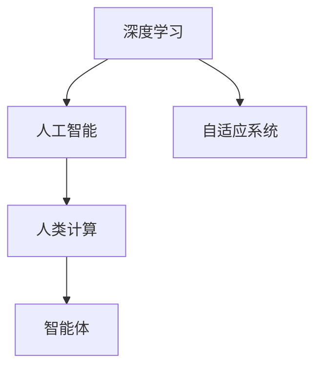

                 

## 1. 背景介绍

### 1.1 问题由来

随着科技的不断进步，计算技术正逐步进入人类社会的各个领域。从基础科研到商业应用，从日常生活到宏观经济，计算已经成为推动社会发展的重要力量。然而，传统的计算方式受限于人类的物理思维和认知能力，往往难以应对复杂多变的现实世界。为了突破这一瓶颈，人类计算的终极目标应运而生。

### 1.2 问题核心关键点

人类计算的核心目标是通过计算技术模拟和重构人类认知，从而实现对现实世界的深度理解和预测。这一目标的实现需要突破以下几个关键点：

- **高层次抽象：** 能够理解并抽象出复杂的现实世界现象，避免陷入低层次的计算细节。
- **智能推理：** 具备自主学习和推理能力，能够从数据中提取模式和知识，进行逻辑推断。
- **自适应性：** 能够根据环境变化不断调整和优化自身计算模型，适应不断变化的世界。
- **决策能力：** 具备自主决策能力，能够在复杂多变的现实世界中进行最优决策。

这些关键点需要高效、可靠的计算技术作为支撑，从而实现人类计算的最终目标。

## 2. 核心概念与联系

### 2.1 核心概念概述

为更好地理解人类计算的终极目标，本节将介绍几个密切相关的核心概念：

- **人类计算（Human Computing）**：通过计算技术模拟和扩展人类认知，解决人类难以应对的复杂问题。
- **人工智能（AI）**：模拟人类智能的机器系统，包括感知、学习、推理等能力。
- **深度学习（Deep Learning）**：基于多层神经网络的机器学习技术，能够处理大规模的非结构化数据。
- **自适应系统（Adaptive Systems）**：能够根据环境变化自动调整和优化自身行为的系统。
- **智能体（Agents）**：具有自主决策和行动能力的计算实体。

这些概念之间通过计算技术和智能推理的桥梁，共同构成了人类计算的框架，使得计算技术能够逐步模拟和重构人类认知。

### 2.2 核心概念原理和架构的 Mermaid 流程图



这个流程图展示了几大核心概念之间的逻辑关系：

1. 深度学习是实现人工智能的基础技术。
2. 人工智能通过学习复杂的现实世界数据，模拟人类的感知和智能。
3. 人类计算利用人工智能技术，进行高层次的抽象和推理。
4. 智能体是实现人类计算的关键实体，能够自主决策和行动。

## 3. 核心算法原理 & 具体操作步骤

### 3.1 算法原理概述

人类计算的算法原理基于深度学习和智能推理，通过构建复杂的多层神经网络模型，从大规模数据中学习出高层次的抽象和逻辑推理能力。这些算法主要包括以下几个步骤：

1. **数据预处理**：对大规模的非结构化数据进行清洗、标注和预处理，准备用于模型训练。
2. **模型训练**：通过反向传播算法和优化算法，不断调整模型的参数，使其在训练数据上达到最佳拟合。
3. **推理和预测**：将训练好的模型应用于新的数据集，进行推理和预测，模拟人类认知的抽象和推理过程。

### 3.2 算法步骤详解

以图像识别任务为例，介绍人类计算的核心算法步骤：

**Step 1: 数据预处理**

- 收集大规模的图像数据，并进行标注和预处理。
- 将图像数据转换为模型可接受的形式，如调整大小、归一化等。
- 使用数据增强技术扩充数据集，如旋转、翻转、裁剪等，增加数据的多样性。

**Step 2: 模型训练**

- 构建深度神经网络模型，如卷积神经网络（CNN），用于图像特征的提取和分类。
- 使用反向传播算法和优化算法（如Adam、SGD等），调整模型参数。
- 在训练过程中，使用交叉验证等技术进行模型评估和调参。

**Step 3: 推理和预测**

- 将训练好的模型应用于新的图像数据，进行特征提取和分类。
- 使用推理引擎和后处理技术，提升模型推理的准确性和效率。
- 进行模型评估和调优，确保模型在不同数据集上的鲁棒性。

### 3.3 算法优缺点

深度学习算法的优点在于其强大的泛化能力和高效的推理速度，能够处理大规模的非结构化数据。但其缺点包括：

- **计算资源消耗高**：训练大规模深度学习模型需要大量的计算资源和存储空间。
- **可解释性差**：深度学习模型被视为"黑盒"，难以解释其内部工作机制和推理逻辑。
- **泛化能力有限**：深度学习模型容易过拟合，对新数据的泛化性能不足。

### 3.4 算法应用领域

深度学习算法已在图像识别、自然语言处理、语音识别、推荐系统等领域得到了广泛应用。这些技术在实际应用中不断突破，为人类计算的终极目标奠定了坚实基础。

## 4. 数学模型和公式 & 详细讲解

### 4.1 数学模型构建

深度学习模型的核心是多层神经网络，通过不断调整网络参数，学习出输入数据和输出标签之间的映射关系。以下是一个简单的卷积神经网络（CNN）模型：

$$
f(x;w) = \max\limits_{i=1}^C (w_i \ast g(x_i) + b_i)
$$

其中，$x$ 表示输入图像，$g$ 表示卷积函数，$w$ 表示卷积核参数，$b$ 表示偏置项。

### 4.2 公式推导过程

以卷积神经网络（CNN）为例，推导卷积操作的具体计算过程。

设输入图像大小为 $H \times W \times C$，卷积核大小为 $k \times k \times C$，输出特征图大小为 $H' \times W' \times C'$，卷积步长为 $s$，填充大小为 $p$。卷积操作的计算过程如下：

$$
O_{h,w,i} = \sum\limits_{c=0}^{C-1} \sum\limits_{i'=0}^{k-1} \sum\limits_{j'=0}^{k-1} w_{i',j',c} * x_{h+s(i'-p),w+s(j'-p),c}
$$

其中，$O_{h,w,i}$ 表示输出特征图在位置 $(h,w,i)$ 的元素值。

### 4.3 案例分析与讲解

以图像识别任务为例，分析深度学习模型在实际应用中的效果。

假设有一个深度卷积神经网络模型，用于识别图像中的行人。通过在大规模行人图像数据上预训练，模型学习到行人图像的特征表示。在测试集上，模型对新图像进行特征提取和分类，输出行人与非行人的概率。通过不断调整模型参数和优化算法，模型的准确率逐步提升，最终达到了非常高的水平。

## 5. 项目实践：代码实例和详细解释说明

### 5.1 开发环境搭建

在进行深度学习项目实践前，我们需要准备好开发环境。以下是使用Python进行TensorFlow开发的环境配置流程：

1. 安装Anaconda：从官网下载并安装Anaconda，用于创建独立的Python环境。

2. 创建并激活虚拟环境：
```bash
conda create -n tf-env python=3.8 
conda activate tf-env
```

3. 安装TensorFlow：根据CUDA版本，从官网获取对应的安装命令。例如：
```bash
conda install tensorflow -c pytorch -c conda-forge
```

4. 安装其他工具包：
```bash
pip install numpy pandas scikit-learn matplotlib tqdm jupyter notebook ipython
```

完成上述步骤后，即可在`tf-env`环境中开始深度学习项目实践。

### 5.2 源代码详细实现

我们以图像分类任务为例，给出使用TensorFlow进行卷积神经网络（CNN）的深度学习模型训练的PyTorch代码实现。

```python
import tensorflow as tf
from tensorflow.keras import layers
from tensorflow.keras import datasets
import matplotlib.pyplot as plt

# 加载数据集
(x_train, y_train), (x_test, y_test) = datasets.cifar10.load_data()

# 数据预处理
x_train = x_train / 255.0
x_test = x_test / 255.0

# 定义模型
model = tf.keras.Sequential([
    layers.Conv2D(32, (3, 3), activation='relu', input_shape=(32, 32, 3)),
    layers.MaxPooling2D((2, 2)),
    layers.Conv2D(64, (3, 3), activation='relu'),
    layers.MaxPooling2D((2, 2)),
    layers.Conv2D(64, (3, 3), activation='relu'),
    layers.Flatten(),
    layers.Dense(64, activation='relu'),
    layers.Dense(10)
])

# 编译模型
model.compile(optimizer=tf.keras.optimizers.Adam(learning_rate=0.001),
              loss=tf.keras.losses.SparseCategoricalCrossentropy(from_logits=True),
              metrics=['accuracy'])

# 训练模型
history = model.fit(x_train, y_train, epochs=10, validation_data=(x_test, y_test))

# 绘制训练和验证的准确率曲线
plt.plot(history.history['accuracy'])
plt.plot(history.history['val_accuracy'])
plt.title('Model accuracy')
plt.ylabel('Accuracy')
plt.xlabel('Epoch')
plt.legend(['Train', 'Test'], loc='upper left')
plt.show()
```

以上就是使用TensorFlow进行CNN模型训练的完整代码实现。可以看到，TensorFlow提供了简单易用的API，使得模型定义、编译和训练变得异常高效。

### 5.3 代码解读与分析

让我们再详细解读一下关键代码的实现细节：

**数据加载**：
```python
(x_train, y_train), (x_test, y_test) = datasets.cifar10.load_data()
```
加载CIFAR-10数据集，其中包含10类不同物体的图片和标签。

**数据预处理**：
```python
x_train = x_train / 255.0
x_test = x_test / 255.0
```
将像素值归一化到[0,1]之间，防止梯度爆炸。

**模型定义**：
```python
model = tf.keras.Sequential([
    layers.Conv2D(32, (3, 3), activation='relu', input_shape=(32, 32, 3)),
    layers.MaxPooling2D((2, 2)),
    layers.Conv2D(64, (3, 3), activation='relu'),
    layers.MaxPooling2D((2, 2)),
    layers.Conv2D(64, (3, 3), activation='relu'),
    layers.Flatten(),
    layers.Dense(64, activation='relu'),
    layers.Dense(10)
])
```
定义包含卷积层、池化层和全连接层的卷积神经网络模型。

**模型编译**：
```python
model.compile(optimizer=tf.keras.optimizers.Adam(learning_rate=0.001),
              loss=tf.keras.losses.SparseCategoricalCrossentropy(from_logits=True),
              metrics=['accuracy'])
```
指定优化器为Adam，学习率为0.001，损失函数为交叉熵损失，激活函数为softmax。

**模型训练**：
```python
history = model.fit(x_train, y_train, epochs=10, validation_data=(x_test, y_test))
```
使用训练集进行模型训练，验证集为测试集，共训练10个epoch。

**可视化效果**：
```python
plt.plot(history.history['accuracy'])
plt.plot(history.history['val_accuracy'])
plt.title('Model accuracy')
plt.ylabel('Accuracy')
plt.xlabel('Epoch')
plt.legend(['Train', 'Test'], loc='upper left')
plt.show()
```
绘制训练集和验证集的准确率曲线，直观展示模型训练效果。

可以看到，TensorFlow的简洁高效使得深度学习模型的实现变得异常简单，只需几行代码即可实现复杂的模型训练。

## 6. 实际应用场景

### 6.1 医疗影像诊断

深度学习算法在医疗影像诊断中得到了广泛应用，通过大规模的医学图像数据预训练，模型能够准确地识别出病灶和病变区域，辅助医生进行诊断和治疗决策。

以乳腺癌检测为例，使用深度学习模型对乳腺X光片和超声图像进行分类，检测出癌症病变区域。在实际应用中，模型通过多轮预训练和微调，不断提升诊断的准确率和鲁棒性，为患者提供及时、准确的医疗建议。

### 6.2 智能推荐系统

深度学习算法在推荐系统中的应用也非常广泛。通过分析用户的浏览、点击和评分数据，推荐系统能够准确地预测用户的兴趣和偏好，推荐个性化的商品、内容和活动。

以电商平台的推荐系统为例，使用深度学习模型对用户行为进行建模，分析用户的购买历史、浏览记录和评分数据，推荐与用户兴趣匹配的商品。在实际应用中，模型通过不断优化和调整，逐步提升推荐的精准度和用户满意度。

### 6.3 自动驾驶

深度学习算法在自动驾驶领域也有重要应用，通过分析车辆传感器数据和环境信息，自动驾驶系统能够实现智能导航和路径规划。

以自动驾驶汽车为例，使用深度学习模型对图像和激光雷达数据进行融合和处理，识别出道路、交通标志和障碍物等环境信息。在实际应用中，模型通过不断优化和训练，逐步提升导航的准确性和安全性，为人类驾驶提供辅助和替代方案。

### 6.4 未来应用展望

随着深度学习算法的不断进步，未来人类计算的终极目标将逐步实现。我们可以预见到以下几个方面的突破：

1. **多模态学习**：深度学习模型将逐步融合视觉、听觉、文本等多种模态的信息，实现对现实世界的全面理解和建模。
2. **因果推理**：深度学习模型将具备因果推断能力，能够从复杂的数据中提取因果关系，进行逻辑推断和预测。
3. **自适应系统**：深度学习模型将具备自主学习和适应的能力，能够根据环境变化自动调整和优化自身行为。
4. **智能决策**：深度学习模型将具备自主决策能力，能够在复杂多变的现实世界中进行最优决策。

这些突破将使得深度学习算法在更多领域得到应用，为人类计算的终极目标提供强有力的支撑。

## 7. 工具和资源推荐

### 7.1 学习资源推荐

为了帮助开发者系统掌握深度学习理论基础和实践技巧，这里推荐一些优质的学习资源：

1. 《深度学习》课程（Coursera）：斯坦福大学开设的深度学习课程，系统讲解了深度学习的基本概念和前沿技术。

2. 《动手学深度学习》书籍：由清华大学和亚马逊联合出版的经典教材，涵盖了深度学习的基础知识和最新研究进展。

3. TensorFlow官方文档：TensorFlow的官方文档，提供了详尽的API介绍和教程，是深度学习开发的必备资料。

4. PyTorch官方文档：PyTorch的官方文档，提供了全面的API和教程，是深度学习开发的另一大选择。

5. Kaggle竞赛平台：全球最大的数据科学竞赛平台，汇集了大量高质量的深度学习项目和数据集，是学习深度学习的好去处。

通过这些资源的学习实践，相信你一定能够快速掌握深度学习算法的精髓，并用于解决实际的计算机应用问题。

### 7.2 开发工具推荐

高效的深度学习开发离不开优秀的工具支持。以下是几款用于深度学习开发的常用工具：

1. TensorFlow：由Google主导开发的开源深度学习框架，支持多种平台和语言，适用于大规模工程应用。

2. PyTorch：Facebook开源的深度学习框架，灵活高效，适用于研究性开发和快速迭代。

3. JAX：由Google开发的基于JIT的自动微分库，适用于高性能深度学习模型开发。

4. TensorBoard：TensorFlow配套的可视化工具，实时监测模型训练状态，提供丰富的图表呈现方式。

5. PyTorch Lightning：基于PyTorch的深度学习框架，提供了简单、高效的模型定义和训练接口。

6. HuggingFace Transformers库：提供了大量预训练模型和优化算法，简化了深度学习模型的开发和部署。

合理利用这些工具，可以显著提升深度学习算法的开发效率，加快创新迭代的步伐。

### 7.3 相关论文推荐

深度学习算法的快速发展离不开学界的持续研究。以下是几篇奠基性的相关论文，推荐阅读：

1. AlexNet：ImageNet分类竞赛冠军模型，奠定了卷积神经网络的基石。

2. ResNet：深度残差网络，解决了深层网络训练中的梯度消失问题。

3. GANs：生成对抗网络，能够生成高质量的图像、音频和视频数据。

4. Transformer：谷歌提出的自注意力机制，使得神经网络能够处理更长的序列数据。

5. Attention is All You Need：Transformer论文，提出了自注意力机制，实现了NLP领域的突破。

这些论文代表了大深度学习算法的发展脉络。通过学习这些前沿成果，可以帮助研究者把握学科前进方向，激发更多的创新灵感。

## 8. 总结：未来发展趋势与挑战

### 8.1 总结

本文对人类计算的终极目标进行了全面系统的介绍。首先阐述了深度学习算法的核心原理和操作步骤，明确了深度学习在实现人类计算中的重要价值。其次，从理论到实践，详细讲解了深度学习算法的数学模型和实际应用，给出了深度学习开发的完整代码实例。同时，本文还广泛探讨了深度学习算法在医疗影像诊断、智能推荐系统、自动驾驶等多个领域的应用前景，展示了深度学习算法的强大潜力。此外，本文精选了深度学习算法的各类学习资源，力求为读者提供全方位的技术指引。

通过本文的系统梳理，可以看到，深度学习算法通过计算技术模拟和扩展人类认知，解决了许多复杂多变的现实问题。深度学习算法的不断进步，使得人类计算的终极目标逐步实现。未来，随着深度学习算法的持续演进，人类计算技术将迎来更多突破，为构建安全、可靠、智能的未来社会提供坚实的技术支撑。

### 8.2 未来发展趋势

深度学习算法的未来发展趋势包括：

1. **多模态学习**：深度学习算法将逐步融合视觉、听觉、文本等多种模态的信息，实现对现实世界的全面理解和建模。
2. **因果推理**：深度学习算法将具备因果推断能力，能够从复杂的数据中提取因果关系，进行逻辑推断和预测。
3. **自适应系统**：深度学习算法将具备自主学习和适应的能力，能够根据环境变化自动调整和优化自身行为。
4. **智能决策**：深度学习算法将具备自主决策能力，能够在复杂多变的现实世界中进行最优决策。

这些趋势将使得深度学习算法在更多领域得到应用，为人类计算的终极目标提供强有力的支撑。

### 8.3 面临的挑战

尽管深度学习算法在诸多领域取得了显著成果，但在迈向更加智能化、普适化应用的过程中，仍面临诸多挑战：

1. **计算资源消耗高**：训练大规模深度学习模型需要大量的计算资源和存储空间。如何降低计算资源消耗，提高模型训练效率，是一个重要的研究方向。
2. **可解释性差**：深度学习模型被视为"黑盒"，难以解释其内部工作机制和推理逻辑。如何增强深度学习模型的可解释性，提高模型的可信度和可靠性，是另一个重要课题。
3. **泛化能力有限**：深度学习模型容易过拟合，对新数据的泛化性能不足。如何提高深度学习模型的泛化能力，确保其在不同数据集上的鲁棒性，是未来研究的重要方向。
4. **安全性有待保障**：深度学习模型可能学习到有偏见、有害的信息，如何从数据和算法层面消除模型偏见，避免恶意用途，确保输出的安全性，是一个重要的研究方向。

### 8.4 研究展望

未来，深度学习算法的研究方向将包括：

1. **提升模型效率**：通过模型压缩、剪枝等技术，提高深度学习模型的计算效率和推理速度。
2. **增强模型可解释性**：通过模型可视化、符号表示等方法，增强深度学习模型的可解释性和可信度。
3. **优化模型泛化性能**：通过正则化、迁移学习等方法，提高深度学习模型的泛化能力和鲁棒性。
4. **消除模型偏见**：通过数据清洗、算法优化等方法，消除深度学习模型的偏见和歧视。

这些研究方向将使得深度学习算法更加智能化、普适化和可靠化，为人类计算的终极目标提供坚实的技术支撑。

## 9. 附录：常见问题与解答

**Q1: 深度学习算法的计算资源消耗高，如何降低计算资源消耗？**

A: 可以通过模型压缩、剪枝等技术，减少深度学习模型的计算量。同时，使用分布式训练、混合精度训练等技术，提高计算效率。

**Q2: 深度学习算法可解释性差，如何增强深度学习算法的可解释性？**

A: 可以通过模型可视化、符号表示等方法，增强深度学习算法的可解释性。同时，引入人类专家的知识，进行模型解释和调试。

**Q3: 深度学习算法的泛化能力有限，如何提高深度学习算法的泛化能力？**

A: 可以通过正则化、迁移学习等方法，提高深度学习算法的泛化能力和鲁棒性。同时，使用多任务学习、对抗训练等方法，增强模型对新数据的适应能力。

**Q4: 深度学习算法的安全性有待保障，如何确保深度学习算法的安全性？**

A: 可以通过数据清洗、算法优化等方法，消除深度学习算法的偏见和歧视。同时，引入人工干预和监管机制，确保深度学习算法的输出符合人类价值观和伦理道德。

总之，深度学习算法在实现人类计算的终极目标中具有重要价值，但同时也面临诸多挑战。未来，通过技术创新和跨学科合作，深度学习算法必将迎来更多突破，为构建安全、可靠、智能的未来社会提供坚实的技术支撑。

