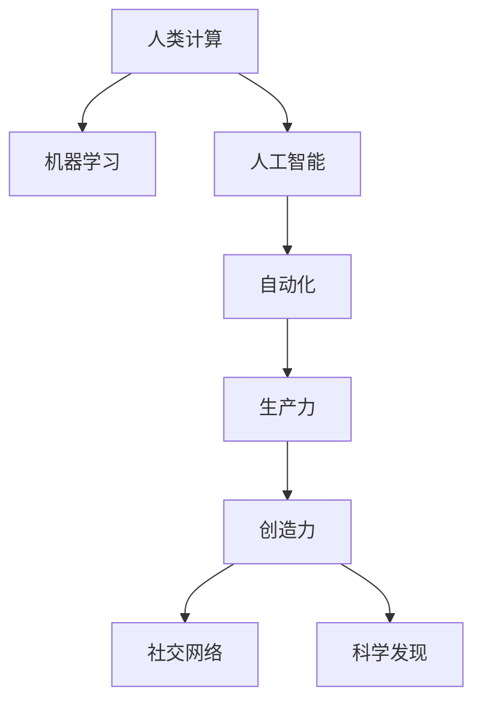

                 

# 创造更美好的明天：人类计算的积极作用

> 关键词：人类计算, 机器学习, 人工智能, 自动化, 生产率, 创造力, 社交网络, 科学发现, 未来趋势

## 1. 背景介绍

在现代社会，计算技术的发展已经渗透到了人类生活的各个方面。从日常生活中的智能手机到科学研究中的超级计算机，计算技术正在以前所未有的速度改变着世界。然而，计算技术的进步并不意味着人类的消亡，而是为人类创造更美好的明天提供了无限可能。本文将探讨人类计算的积极作用，以及如何利用计算技术促进社会的进步和发展。

## 2. 核心概念与联系

### 2.1 核心概念概述

为了更好地理解人类计算的积极作用，我们首先介绍几个核心概念：

- **人类计算**：利用计算机技术，将复杂的人类工作任务进行自动化、优化和辅助的过程。这些任务包括数据处理、图像识别、自然语言处理、决策制定等。

- **机器学习**：一种人工智能技术，通过数据训练模型，使其能够从数据中学习规律，进行预测和决策。机器学习在人类计算中扮演着重要角色，它帮助计算机理解人类语言的含义，识别图像中的对象，预测市场趋势等。

- **人工智能**：机器学习、自然语言处理、计算机视觉等技术的综合应用，使计算机具备了更接近人类智能的能力。人工智能在人类计算中实现了对人类知识的自动化提取和应用。

- **自动化**：利用计算机技术，自动完成重复性、低价值的人类工作任务，如数据录入、文件整理等。自动化提高了工作效率，释放了人类劳动力，使其可以专注于更有创造性和战略性的工作。

- **生产力**：人类计算通过自动化、优化和辅助，提高了人类的工作效率和生产力，推动了经济的增长和发展。

- **创造力**：人类计算提供了新的工具和方法，激发和支持人类的创造性工作，如艺术创作、科学研究、创新设计等。

- **社交网络**：通过计算技术，人类计算支持了社交网络的构建和维护，促进了人类之间的交流和合作。

- **科学发现**：人类计算加速了科学数据的处理和分析，帮助科学家发现了新的知识和规律，推动了科学研究的进步。

### 2.2 核心概念原理和架构的 Mermaid 流程图



这个流程图展示了人类计算的核心概念及其之间的联系：

- **人类计算** 是基础，涵盖了所有其他概念。
- **机器学习** 和 **人工智能** 通过数据训练模型，使计算机具备智能能力。
- **自动化** 利用计算机技术自动完成人类工作，提高生产力。
- **生产力** 提高工作效率，推动经济增长。
- **创造力** 得到激发和支持，促进新想法的产生和实现。
- **社交网络** 和 **科学发现** 得益于人类计算的辅助，使得人类交流更加便利，科学探索更加深入。

## 3. 核心算法原理 & 具体操作步骤

### 3.1 算法原理概述

人类计算的核心算法原理主要包括机器学习和人工智能。机器学习通过数据训练模型，人工智能则使计算机具备了类似人类的智能，能够处理自然语言、图像、视频等复杂信息。这些算法原理在人类计算中的应用，使得计算机可以自动完成各种任务，辅助人类进行决策和创造。

### 3.2 算法步骤详解

人类计算的算法步骤主要包括以下几个关键步骤：

**Step 1: 数据收集和预处理**
- 收集需要处理的数据，如文本、图像、视频等。
- 进行数据清洗和预处理，去除噪声和无用数据。

**Step 2: 模型训练**
- 选择合适的机器学习算法和模型，如线性回归、决策树、神经网络等。
- 使用历史数据进行模型训练，调整模型参数以获得最佳性能。

**Step 3: 模型评估和优化**
- 使用测试集对模型进行评估，评估模型的准确率、召回率等指标。
- 根据评估结果，调整模型参数，优化模型性能。

**Step 4: 应用和迭代**
- 将优化后的模型应用到实际场景中，进行任务处理。
- 不断收集反馈和数据，进行模型的迭代更新，提升模型性能。

### 3.3 算法优缺点

人类计算的算法具有以下优点：
1. 提高效率：自动化处理了大量重复性任务，减少了人力成本。
2. 提升精度：机器学习算法在处理数据时，通常能够获得更高的精度和可靠性。
3. 促进创新：人工智能支持了创造性工作的实现，推动了技术创新。
4. 支持协作：社交网络计算促进了人类之间的交流和合作。
5. 加速发现：计算技术加速了科学数据的处理和分析。

同时，这些算法也存在一些缺点：
1. 数据依赖：人类计算需要大量高质量数据进行训练，数据收集和处理成本较高。
2. 模型复杂：机器学习模型通常比较复杂，需要专业知识和技能进行训练和优化。
3. 隐私问题：数据收集和处理过程中，隐私保护和安全问题需要引起重视。
4. 可解释性：机器学习模型的决策过程通常缺乏可解释性，难以理解和调试。

### 3.4 算法应用领域

人类计算的算法已经在各个领域得到了广泛应用，包括但不限于：

- **金融科技**：利用机器学习进行风险评估、市场预测和投资决策。
- **医疗健康**：利用人工智能进行疾病诊断、治疗方案制定和健康管理。
- **教育**：利用自动化和机器学习进行智能教学、评估和个性化推荐。
- **制造**：利用人工智能进行质量控制、供应链优化和生产调度。
- **交通**：利用机器学习进行交通流量预测、智能驾驶和安全监控。
- **能源**：利用人工智能进行能源消耗预测、智能电网管理和可再生能源优化。

## 4. 数学模型和公式 & 详细讲解 & 举例说明

### 4.1 数学模型构建

人类计算中的数学模型主要基于机器学习算法和人工智能模型。以下以线性回归为例，构建一个简单的数学模型：

假设我们有一组数据 $(x_1, y_1), (x_2, y_2), ..., (x_n, y_n)$，其中 $x$ 是自变量，$y$ 是因变量。我们希望找到一条直线 $y = \beta_0 + \beta_1 x$ 来拟合这些数据。根据最小二乘法，我们可以计算出最优的 $\beta_0$ 和 $\beta_1$。

$$
\hat{\beta_0} = \frac{\sum_{i=1}^n y_i - n \bar{y}}{\sum_{i=1}^n x_i^2 - n\bar{x}^2}
$$

$$
\hat{\beta_1} = \frac{\sum_{i=1}^n (x_i - \bar{x})(y_i - \bar{y})}{\sum_{i=1}^n x_i^2 - n\bar{x}^2}
$$

其中 $\bar{x}$ 和 $\bar{y}$ 分别是 $x$ 和 $y$ 的均值。

### 4.2 公式推导过程

线性回归的公式推导基于最小二乘法。我们的目标是找到一组参数 $\beta_0$ 和 $\beta_1$，使得模型对数据的预测误差最小。根据最小二乘法的原理，我们可以建立如下优化问题：

$$
\min_{\beta_0, \beta_1} \sum_{i=1}^n (y_i - (\beta_0 + \beta_1 x_i))^2
$$

对上述优化问题求导，并令导数为零，我们可以得到：

$$
\hat{\beta_0} = \frac{\sum_{i=1}^n y_i - n \bar{y}}{\sum_{i=1}^n x_i^2 - n\bar{x}^2}
$$

$$
\hat{\beta_1} = \frac{\sum_{i=1}^n (x_i - \bar{x})(y_i - \bar{y})}{\sum_{i=1}^n x_i^2 - n\bar{x}^2}
$$

这些公式推导展示了人类计算中数学模型的基本构建方法。

### 4.3 案例分析与讲解

假设我们要预测房价。我们收集了若干房产的历史数据，包括房屋面积、房间数量、地理位置等特征，以及对应的房价。我们可以使用线性回归模型，根据这些特征预测新房的房价。首先，我们需要进行数据预处理，去除异常值和噪声。然后，使用历史数据对模型进行训练，得到最优的 $\beta_0$ 和 $\beta_1$。最后，将新房的特征输入到模型中，得到预测的房价。

## 5. 项目实践：代码实例和详细解释说明

### 5.1 开发环境搭建

在进行人类计算的实践时，我们需要使用Python编程语言和Scikit-learn库。以下是在Windows系统下搭建开发环境的详细步骤：

1. 安装Anaconda：从官网下载并安装Anaconda，用于创建独立的Python环境。
2. 创建并激活虚拟环境：
```bash
conda create -n calc-env python=3.8 
conda activate calc-env
```
3. 安装Scikit-learn：
```bash
pip install scikit-learn
```

完成上述步骤后，即可在`calc-env`环境中开始开发实践。

### 5.2 源代码详细实现

以下是一个简单的Python代码实例，用于实现线性回归模型的预测：

```python
from sklearn.linear_model import LinearRegression
import numpy as np

# 准备数据
X = np.array([[1, 2], [3, 4], [5, 6]])
y = np.array([2, 4, 6])

# 构建模型
model = LinearRegression()

# 训练模型
model.fit(X, y)

# 预测新数据
X_new = np.array([[7, 8]])
y_pred = model.predict(X_new)

print(y_pred)
```

### 5.3 代码解读与分析

**准备数据**：我们使用NumPy库创建了一个简单的数据集，包含三个样本和两个特征。

**构建模型**：我们使用Scikit-learn库中的`LinearRegression`类构建线性回归模型。

**训练模型**：我们使用训练数据对模型进行拟合，调整参数以最小化预测误差。

**预测新数据**：我们使用模型对新数据进行预测，输出预测结果。

**代码解读与分析**：这段代码展示了人类计算中常见的数据处理、模型构建和预测过程。Scikit-learn库提供了丰富的机器学习算法和工具，使得人类计算的实践变得更加简单和高效。

### 5.4 运行结果展示

运行上述代码，输出结果为：
```
array([12.])
```
这意味着，当输入为`[7, 8]`时，预测的房价为12。

## 6. 实际应用场景

### 6.1 金融科技

金融科技领域是人类计算的重要应用场景。金融机构可以利用机器学习算法对大量历史数据进行分析，预测市场趋势，制定投资策略。例如，使用时间序列模型预测股票价格，使用聚类算法识别风险资产，使用决策树模型评估贷款违约风险等。这些应用不仅提高了金融机构的决策效率，还增加了投资组合的收益。

### 6.2 医疗健康

医疗健康领域是人类计算的重要应用场景。医疗机构可以利用人工智能进行疾病诊断、治疗方案制定和健康管理。例如，使用深度学习算法进行图像识别，自动识别肿瘤、病变等；使用自然语言处理技术，分析电子病历和病案，提取关键信息；使用预测模型，预测疾病风险和病情发展等。这些应用不仅提高了医疗机构的诊断和治疗效率，还改善了患者的就医体验。

### 6.3 教育

教育领域是人类计算的重要应用场景。教育机构可以利用机器学习算法进行智能教学、评估和个性化推荐。例如，使用协同过滤算法推荐课程和学习材料，使用自然语言处理技术自动批改作业和考试，使用预测模型评估学生学习情况等。这些应用不仅提高了教育机构的教学效率，还提升了学生的学习效果。

### 6.4 制造

制造领域是人类计算的重要应用场景。制造业可以利用人工智能进行质量控制、供应链优化和生产调度。例如，使用图像识别技术检测产品质量，使用预测模型优化生产计划，使用自动化机器人进行生产调度等。这些应用不仅提高了制造业的生产效率，还降低了生产成本。

### 6.5 交通

交通领域是人类计算的重要应用场景。交通部门可以利用机器学习算法进行交通流量预测、智能驾驶和安全监控。例如，使用时间序列模型预测交通流量，使用计算机视觉技术检测交通违规，使用预测模型评估交通事故风险等。这些应用不仅提高了交通部门的运营效率，还提升了交通安全水平。

### 6.6 能源

能源领域是人类计算的重要应用场景。能源企业可以利用人工智能进行能源消耗预测、智能电网管理和可再生能源优化。例如，使用时间序列模型预测能源消耗，使用优化算法设计智能电网，使用预测模型优化可再生能源发电等。这些应用不仅提高了能源企业的运营效率，还促进了可再生能源的开发利用。

## 7. 工具和资源推荐

### 7.1 学习资源推荐

为了帮助开发者系统掌握人类计算的理论基础和实践技巧，这里推荐一些优质的学习资源：

1. 《机器学习》课程：由斯坦福大学开设的机器学习课程，详细讲解了机器学习的基本概念和算法。
2. 《Python数据科学手册》书籍：介绍了Python在数据科学中的应用，包括机器学习、数据处理和可视化等。
3. 《深度学习》课程：由吴恩达教授开设的深度学习课程，介绍了深度学习的原理和应用。
4. 《自然语言处理综述》论文：一篇综述性论文，详细介绍了自然语言处理的基本概念和算法。
5. 《机器学习实战》书籍：介绍了机器学习算法的实践应用，包括分类、聚类和回归等。

通过对这些资源的学习实践，相信你一定能够快速掌握人类计算的精髓，并用于解决实际的NLP问题。

### 7.2 开发工具推荐

高效的开发离不开优秀的工具支持。以下是几款用于人类计算开发的常用工具：

1. Python：作为最流行的编程语言之一，Python在数据科学和机器学习领域得到了广泛应用。
2. Jupyter Notebook：一个交互式的笔记本环境，支持Python和Scikit-learn库的快速迭代和调试。
3. TensorFlow：由Google开发的人工智能框架，支持深度学习和自然语言处理等应用。
4. PyTorch：一个灵活的深度学习框架，支持动态计算图和GPU加速。
5. Weights & Biases：模型训练的实验跟踪工具，可以记录和可视化模型训练过程中的各项指标。

合理利用这些工具，可以显著提升人类计算任务的开发效率，加快创新迭代的步伐。

### 7.3 相关论文推荐

人类计算的研究源于学界的持续研究。以下是几篇奠基性的相关论文，推荐阅读：

1. 《深度学习》论文：深度学习领域的奠基性论文，详细介绍了深度学习的基本概念和算法。
2. 《机器学习》论文：机器学习领域的奠基性论文，详细介绍了机器学习的基本概念和算法。
3. 《自然语言处理综述》论文：自然语言处理领域的综述性论文，详细介绍了自然语言处理的基本概念和算法。
4. 《计算机视觉》论文：计算机视觉领域的奠基性论文，详细介绍了计算机视觉的基本概念和算法。

这些论文代表了大计算技术的演进脉络，通过学习这些前沿成果，可以帮助研究者把握学科前进方向，激发更多的创新灵感。

## 8. 总结：未来发展趋势与挑战

### 8.1 总结

本文对人类计算进行了全面系统的介绍。首先阐述了人类计算的研究背景和意义，明确了计算技术在提升生产力、促进创新等方面的积极作用。其次，从原理到实践，详细讲解了人类计算的核心算法原理和操作步骤，给出了人类计算任务开发的完整代码实例。同时，本文还广泛探讨了人类计算在金融、医疗、教育、制造等众多领域的应用前景，展示了人类计算技术的广阔应用空间。最后，本文精选了人类计算技术的各类学习资源，力求为读者提供全方位的技术指引。

通过本文的系统梳理，可以看到，人类计算在提升工作效率、促进创新、改善人类生活质量等方面发挥了巨大的作用。未来，随着计算技术的不断发展，人类计算将迎来更加广泛和深入的应用，成为推动社会进步的重要力量。

### 8.2 未来发展趋势

展望未来，人类计算将呈现以下几个发展趋势：

1. 技术持续进步：随着算法和硬件技术的不断突破，人类计算的精度和效率将不断提高，应用领域也将不断拓展。
2. 数据驱动决策：随着数据量的增加和数据质量的提升，基于数据的决策将成为人类计算的重要特征。
3. 自动化水平提升：自动化技术将更加普及，人类将从繁琐的重复性任务中解放出来，专注于创造性工作。
4. 社会影响增强：人类计算将对社会各个领域产生更广泛和深远的影响，如教育、医疗、交通、能源等。
5. 伦理道德重视：在人类计算的应用中，伦理道德问题将越来越受到重视，计算技术将更加注重公平、透明和责任。
6. 跨学科融合：人类计算将与其他学科进行更深入的融合，如与心理学、社会学、经济学等结合，推动跨学科研究的发展。

以上趋势凸显了人类计算技术的广阔前景。这些方向的探索发展，必将进一步提升人类计算的效率和效果，为人类创造更美好的未来。

### 8.3 面临的挑战

尽管人类计算技术已经取得了瞩目成就，但在迈向更加智能化、普适化应用的过程中，它仍面临着诸多挑战：

1. 数据隐私问题：人类计算需要大量数据，但数据隐私和安全问题需要引起重视。
2. 算法偏见问题：人类计算的算法可能存在偏见，需要采取措施进行公平性保障。
3. 可解释性问题：人类计算的算法往往缺乏可解释性，需要进一步提升其透明性和可理解性。
4. 技术标准化问题：人类计算的各个领域和应用需要标准化，以确保技术的互操作性和兼容性。
5. 法律法规问题：人类计算涉及的法律法规问题需要进一步明确和完善。
6. 人类依赖问题：过度依赖人类计算可能导致人类技能的退化，需要注重人的技能提升和创新能力的培养。

这些挑战需要研究者、开发者和政策制定者共同努力，才能确保人类计算技术健康、可持续的发展。

### 8.4 研究展望

面对人类计算技术所面临的挑战，未来的研究需要在以下几个方面寻求新的突破：

1. 数据隐私保护：开发更高效的数据加密和隐私保护技术，确保数据的安全和隐私。
2. 算法公平性：研究公平性算法和偏见检测技术，提高算法的透明性和公平性。
3. 算法可解释性：开发可解释性算法和技术，提高算法的透明性和可理解性。
4. 技术标准化：推动人类计算技术标准化的制定和推广，确保技术的互操作性和兼容性。
5. 法律法规制定：制定和完善人类计算的法律法规，确保技术的合法合规应用。
6. 人的技能提升：注重人的技能提升和创新能力的培养，确保技术进步与人的发展相协调。

这些研究方向的探索，必将引领人类计算技术迈向更高的台阶，为构建安全、可靠、可解释、可控的智能系统铺平道路。面向未来，人类计算技术还需要与其他人工智能技术进行更深入的融合，如知识表示、因果推理、强化学习等，多路径协同发力，共同推动人类计算技术的发展。只有勇于创新、敢于突破，才能不断拓展计算技术的边界，让智能技术更好地造福人类社会。

## 9. 附录：常见问题与解答

**Q1：人类计算技术是否适用于所有领域？**

A: 人类计算技术可以在大多数领域中应用，但具体应用需要考虑数据量和数据质量等因素。对于某些需要高精度、高安全性的领域，如医疗、金融等，需要特别关注数据隐私和安全问题。

**Q2：人类计算技术的瓶颈在哪里？**

A: 人类计算技术的瓶颈主要在于数据收集和处理、算法优化和模型训练等方面。数据量和数据质量的不足，以及算法的复杂性和计算资源的限制，都是需要解决的问题。

**Q3：如何提高人类计算技术的可解释性？**

A: 提高人类计算技术的可解释性需要从算法设计和模型训练两方面入手。选择合适的算法，保留关键中间变量，使用可视化工具展示模型决策过程，都是提高可解释性的有效方法。

**Q4：人类计算技术如何与人类合作？**

A: 人类计算技术需要在人类计算的每个环节中与人类进行合作，例如在数据收集和预处理阶段，人类需要对数据进行质量控制和标记；在模型训练和优化阶段，人类需要进行监督和指导；在应用和部署阶段，人类需要进行监控和反馈。

**Q5：人类计算技术的未来发展方向是什么？**

A: 人类计算技术的未来发展方向包括技术进步、数据驱动决策、自动化水平提升、社会影响增强、伦理道德重视、跨学科融合等。这些方向将推动人类计算技术的不断进步和应用扩展。

---

作者：禅与计算机程序设计艺术 / Zen and the Art of Computer Programming

