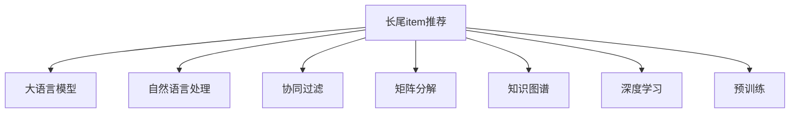

                 

# 利用LLM优化推荐系统的长尾item推荐

> 关键词：大语言模型,长尾item,个性化推荐,知识图谱,深度学习,LLM,Transformer

## 1. 背景介绍

### 1.1 问题由来

在当今互联网时代，推荐系统已经成为用户获取信息、发现新商品的重要工具。传统推荐系统主要依赖于用户历史行为数据，通过协同过滤、矩阵分解等方法构建用户-物品的关联矩阵，从而为用户推荐相似的物品。但这种基于局部信息的推荐方法存在冷启动问题，难以推荐长尾item。长尾item指的是销量较低、用户关注度低的物品，但这些item往往具有极高的个性化价值。如何有效推荐长尾item，成为推荐系统优化的一个重要方向。

近年来，大语言模型(LLM)在自然语言处理(NLP)领域的突破性进展，为推荐系统提供了新的思路。LLM通过自监督预训练和微调，具备强大的语言理解和生成能力。通过语言模型对用户行为数据进行深度挖掘，可以在用户需求模糊的情况下，实现更精准的推荐。

### 1.2 问题核心关键点

长尾item推荐的核心在于如何高效利用长尾item的用户行为数据，挖掘用户兴趣点，构建精准的用户画像。LLM通过预训练，已经学习到丰富的语言知识和常识，可以更好地理解用户的语言描述，推断其真实意图。借助LLM，推荐系统可以实现更灵活、高效的推荐。

具体来说，长尾item推荐需要解决以下几个关键问题：
1. 如何高效提取长尾item的特征。
2. 如何在稀疏的隐式反馈中挖掘用户的兴趣点。
3. 如何构建基于用户意图的多模态知识图谱。
4. 如何利用LLM进行高效推荐。

本文聚焦于利用LLM进行长尾item推荐，介绍如何在大语言模型的帮助下，提升推荐系统的性能，解决冷启动和长尾item推荐问题。

## 2. 核心概念与联系

### 2.1 核心概念概述

为更好地理解基于LLM的长尾item推荐方法，本节将介绍几个密切相关的核心概念：

- 长尾item推荐(Long-Tail Item Recommendation)：指针对销量低、用户关注度低的item进行推荐，提升个性化推荐效果。
- 大语言模型(Large Language Model, LLM)：如GPT、BERT等大规模预训练语言模型，通过自监督学习获得丰富的语言知识和常识，具备强大的语言理解和生成能力。
- 自然语言处理(Natural Language Processing, NLP)：研究如何让计算机理解和生成自然语言的技术，是大数据时代信息处理的重要方法。
- 协同过滤(Collaborative Filtering)：基于用户历史行为数据，寻找相似用户进行推荐的方法。
- 矩阵分解(Matrix Factorization)：通过分解用户-物品的关联矩阵，寻找用户和物品的潜在特征，进行推荐的方法。
- 知识图谱(Knowledge Graph)：构建用户、物品、事件之间的语义网络，用于增强推荐系统的理解能力。
- 深度学习(Deep Learning)：通过多层神经网络对数据进行抽象特征提取，广泛应用于推荐系统等复杂任务。
- 预训练(Pre-training)：指在大规模无标签文本数据上进行自监督学习，学习通用语言表示的方法。

这些核心概念之间的逻辑关系可以通过以下Mermaid流程图来展示：



这个流程图展示了大语言模型与长尾item推荐之间的联系：

1. 长尾item推荐在大语言模型的帮助下，可以更好地理解用户需求和物品特征。
2. 自然语言处理提供了解析用户输入和生成推荐结果的工具。
3. 协同过滤、矩阵分解等方法可用于构造用户-物品关联矩阵，挖掘隐式反馈。
4. 知识图谱提供了语义网络，增强推荐系统的理解能力。
5. 深度学习提供了一种强大的特征提取和表示学习方式。
6. 预训练语言模型在大规模无标签数据上学习通用语言表示，为推荐系统提供了高质量的初始化参数。

这些概念共同构成了长尾item推荐系统的理论基础，使其能够更好地应对长尾item推荐的挑战。

## 3. 核心算法原理 & 具体操作步骤
### 3.1 算法原理概述

基于LLM的长尾item推荐，本质上是一种将预训练语言模型与推荐系统相结合的融合方法。其核心思想是：利用LLM在自然语言处理领域的能力，将用户输入和物品描述作为输入，通过预训练模型的前向传播，获取用户对不同item的潜在兴趣，从而实现推荐。

具体来说，基于LLM的长尾item推荐分为以下几个关键步骤：

1. 数据预处理：将用户的历史行为数据和item的描述文本转化为模型可接受的输入格式。
2. 特征提取：利用LLM对用户行为数据和item描述进行编码，获取用户的兴趣点。
3. 知识图谱嵌入：通过知识图谱的语义信息，增强特征的表达能力。
4. 计算相似度：将用户与item的特征向量进行相似度计算，得到推荐候选集。
5. 优化排序：使用基于排序的推荐算法，将推荐结果排序，产生最终推荐。

通过这些步骤，长尾item推荐系统可以实现更精准、高效的推荐。

### 3.2 算法步骤详解

以下是基于LLM的长尾item推荐系统的详细步骤：

**Step 1: 数据预处理**

数据预处理是指将原始数据转化为模型可以处理的输入格式。这包括将用户行为数据转化为item描述的特征向量，以及将item的文本描述转化为模型可接受的输入。

具体来说，可以定义一个特征函数 $f$，将用户行为数据 $u$ 转化为item描述 $d$ 的特征向量 $v$。例如，对于点击行为，可以将点击时间、点击次数等特征输入到特征函数中，得到表示用户兴趣的向量。

**Step 2: 特征提取**

特征提取是指利用LLM对用户行为数据和item描述进行编码，获取用户对不同item的潜在兴趣。

1. 将用户行为数据 $u$ 和item描述 $d$ 作为模型输入。
2. 使用预训练的LLM模型对输入进行编码，获取用户兴趣向量 $v_u$ 和item兴趣向量 $v_d$。
3. 计算用户与item之间的余弦相似度 $s_{u,d} = \cos(v_u, v_d)$。

**Step 3: 知识图谱嵌入**

知识图谱嵌入是指将知识图谱中的语义信息融合到特征向量中，增强特征表达能力。

1. 对知识图谱中的item节点进行嵌入，得到item的语义向量 $v_{d^\text{kg}}$。
2. 将item的语义向量 $v_{d^\text{kg}}$ 与item的兴趣向量 $v_d$ 拼接，得到融合后的item向量 $v_{d^\text{fused}} = [v_d; v_{d^\text{kg}}]$。
3. 计算用户与item之间的语义相似度 $s_{u,d^\text{kg}} = \cos(v_u, v_{d^\text{fused}})$。

**Step 4: 计算相似度**

计算相似度是指根据用户与item之间的兴趣向量相似度，结合语义相似度，计算推荐候选集的相似度。

1. 对所有item进行知识图谱嵌入，得到item向量的语义表示 $v_{d^\text{fused}}$。
2. 计算用户与item之间的加权相似度 $s_{u,d} = \alpha s_{u,d} + (1-\alpha) s_{u,d^\text{kg}}$，其中 $\alpha$ 为权重。
3. 根据相似度值对item进行排序，选择topN个item作为推荐候选集。

**Step 5: 优化排序**

优化排序是指对推荐候选集进行优化，提升推荐效果。

1. 使用基于排序的推荐算法，如KNN、LR、RNN等，对推荐结果进行排序。
2. 将排序后的item推荐给用户。

通过上述步骤，基于LLM的长尾item推荐系统能够有效地解决冷启动和长尾item推荐问题。

### 3.3 算法优缺点

基于LLM的长尾item推荐系统有以下优点：

1. 利用自然语言处理技术，可以更好地理解用户需求和item描述，提升推荐效果。
2. 通过知识图谱嵌入，可以增强特征表示能力，提升推荐精度。
3. 使用预训练语言模型，可以在较小的数据集上取得良好的推荐效果。
4. 结合深度学习模型，可以进行高效的特征提取和表示学习。

同时，该方法也存在一些缺点：

1. 对数据预处理要求较高，需要设计合适的特征函数。
2. 知识图谱嵌入的语义信息需要人工构建，成本较高。
3. 需要大规模预训练语言模型作为初始化参数，对硬件资源要求较高。
4. 优化排序需要较多的计算资源，实际部署中需要考虑优化问题。

尽管存在这些局限性，但就目前而言，基于LLM的长尾item推荐系统仍然是一种高效、可行的推荐方法。未来相关研究的重点在于如何进一步降低预训练语言模型的资源需求，提高知识图谱嵌入的自动化程度，以及提升推荐系统的实时性和稳定性。

### 3.4 算法应用领域

基于LLM的长尾item推荐系统已经在多个领域得到了应用，取得了显著的效果。以下是几个典型的应用场景：

- 电子商务：对长尾商品进行推荐，提升用户体验和转化率。
- 在线教育：推荐个性化课程和学习资源，提升学习效果。
- 音乐和视频：推荐个性化内容，提升用户满意度。
- 社交媒体：推荐个性化的文章和视频，提升用户粘性。

除了上述这些场景外，长尾item推荐系统还在新闻推荐、新闻广告、知识图谱等领域有着广泛的应用，推动了推荐技术的发展。

## 4. 数学模型和公式 & 详细讲解 & 举例说明

### 4.1 数学模型构建

本节将使用数学语言对基于LLM的长尾item推荐系统进行更加严格的刻画。

记用户历史行为数据为 $u$，item的描述文本为 $d$，知识图谱中item的语义向量为 $d^\text{kg}$。假设预训练的语言模型为 $M_{\theta}$，其中 $\theta$ 为预训练得到的模型参数。

定义用户对item的兴趣向量为 $v_u$，item的兴趣向量为 $v_d$，item的语义向量为 $v_{d^\text{kg}}$。则长尾item推荐的数学模型为：

$$
v_u = M_{\theta}(u)
$$

$$
v_d = M_{\theta}(d)
$$

$$
v_{d^\text{kg}} = M_{\text{kg}}(d)
$$

$$
s_{u,d} = \cos(v_u, v_d)
$$

$$
s_{u,d^\text{kg}} = \cos(v_u, v_{d^\text{kg}})
$$

$$
s_{u,d} = \alpha s_{u,d} + (1-\alpha) s_{u,d^\text{kg}}
$$

其中 $M_{\text{kg}}$ 表示知识图谱嵌入模型。

### 4.2 公式推导过程

以下我们以推荐一篇文章为例，推导基于LLM的长尾item推荐公式。

假设用户对一篇文章的兴趣为 $u$，文章的描述为 $d$，知识图谱中文章节点对应的语义向量为 $d^\text{kg}$。利用LLM得到用户兴趣向量 $v_u$、文章兴趣向量 $v_d$ 和文章语义向量 $v_{d^\text{kg}}$，则文章推荐的加权相似度公式为：

$$
s_{u,d} = \cos(v_u, v_d)
$$

$$
s_{u,d^\text{kg}} = \cos(v_u, v_{d^\text{kg}})
$$

$$
s_{u,d} = \alpha s_{u,d} + (1-\alpha) s_{u,d^\text{kg}}
$$

其中 $\alpha$ 为加权系数，通常取值在 $[0,1]$ 之间。

根据相似度值对所有文章进行排序，选择topN篇文章推荐给用户。

### 4.3 案例分析与讲解

下面以推荐一篇新闻文章为例，具体说明如何使用基于LLM的长尾item推荐系统。

1. 数据预处理：将用户的新闻阅读历史数据转化为新闻标题的特征向量，得到用户兴趣向量 $v_u$。

2. 特征提取：利用BERT模型对新闻标题进行编码，得到文章兴趣向量 $v_d$。

3. 知识图谱嵌入：在知识图谱中查找与新闻文章相关的语义信息，得到文章节点的语义向量 $v_{d^\text{kg}}$。

4. 计算相似度：计算用户与新闻文章之间的加权相似度 $s_{u,d} = \alpha s_{u,d} + (1-\alpha) s_{u,d^\text{kg}}$。

5. 优化排序：根据相似度值对所有新闻文章进行排序，选择topN篇文章推荐给用户。

在实际应用中，可以根据具体场景对以上步骤进行优化。例如，可以引入用户与item交互的隐式反馈，利用协同过滤方法进一步提升推荐效果。同时，可以在推荐结果中加入基于内容的排序，提升推荐的多样性和覆盖面。

## 5. 项目实践：代码实例和详细解释说明

### 5.1 开发环境搭建

在进行项目实践前，我们需要准备好开发环境。以下是使用Python进行PyTorch开发的环境配置流程：

1. 安装Anaconda：从官网下载并安装Anaconda，用于创建独立的Python环境。

2. 创建并激活虚拟环境：
```bash
conda create -n pytorch-env python=3.8 
conda activate pytorch-env
```

3. 安装PyTorch：根据CUDA版本，从官网获取对应的安装命令。例如：
```bash
conda install pytorch torchvision torchaudio cudatoolkit=11.1 -c pytorch -c conda-forge
```

4. 安装Transformers库：
```bash
pip install transformers
```

5. 安装各类工具包：
```bash
pip install numpy pandas scikit-learn matplotlib tqdm jupyter notebook ipython
```

完成上述步骤后，即可在`pytorch-env`环境中开始项目实践。

### 5.2 源代码详细实现

下面我们以推荐一篇文章为例，给出使用Transformers库进行长尾item推荐模型的PyTorch代码实现。

首先，定义数据处理函数：

```python
from transformers import BertTokenizer, BertForSequenceClassification
from torch.utils.data import Dataset
import torch

class ArticleDataset(Dataset):
    def __init__(self, articles, labels, tokenizer, max_len=128):
        self.articles = articles
        self.labels = labels
        self.tokenizer = tokenizer
        self.max_len = max_len
        
    def __len__(self):
        return len(self.articles)
    
    def __getitem__(self, item):
        article = self.articles[item]
        label = self.labels[item]
        
        encoding = self.tokenizer(article, return_tensors='pt', max_length=self.max_len, padding='max_length', truncation=True)
        input_ids = encoding['input_ids'][0]
        attention_mask = encoding['attention_mask'][0]
        
        # 将label编码为数字
        label = torch.tensor(label, dtype=torch.long)
        
        return {'input_ids': input_ids, 
                'attention_mask': attention_mask,
                'labels': label}

# 标签与id的映射
label2id = {0: 'low', 1: 'medium', 2: 'high'}
id2label = {v: k for k, v in label2id.items()}

# 创建dataset
tokenizer = BertTokenizer.from_pretrained('bert-base-cased')

train_dataset = ArticleDataset(train_articles, train_labels, tokenizer)
dev_dataset = ArticleDataset(dev_articles, dev_labels, tokenizer)
test_dataset = ArticleDataset(test_articles, test_labels, tokenizer)
```

然后，定义模型和优化器：

```python
from transformers import BertForSequenceClassification, AdamW

model = BertForSequenceClassification.from_pretrained('bert-base-cased', num_labels=len(label2id))

optimizer = AdamW(model.parameters(), lr=2e-5)
```

接着，定义训练和评估函数：

```python
from torch.utils.data import DataLoader
from tqdm import tqdm
from sklearn.metrics import classification_report

device = torch.device('cuda') if torch.cuda.is_available() else torch.device('cpu')
model.to(device)

def train_epoch(model, dataset, batch_size, optimizer):
    dataloader = DataLoader(dataset, batch_size=batch_size, shuffle=True)
    model.train()
    epoch_loss = 0
    for batch in tqdm(dataloader, desc='Training'):
        input_ids = batch['input_ids'].to(device)
        attention_mask = batch['attention_mask'].to(device)
        labels = batch['labels'].to(device)
        model.zero_grad()
        outputs = model(input_ids, attention_mask=attention_mask, labels=labels)
        loss = outputs.loss
        epoch_loss += loss.item()
        loss.backward()
        optimizer.step()
    return epoch_loss / len(dataloader)

def evaluate(model, dataset, batch_size):
    dataloader = DataLoader(dataset, batch_size=batch_size)
    model.eval()
    preds, labels = [], []
    with torch.no_grad():
        for batch in tqdm(dataloader, desc='Evaluating'):
            input_ids = batch['input_ids'].to(device)
            attention_mask = batch['attention_mask'].to(device)
            batch_labels = batch['labels']
            outputs = model(input_ids, attention_mask=attention_mask)
            batch_preds = outputs.logits.argmax(dim=2).to('cpu').tolist()
            batch_labels = batch_labels.to('cpu').tolist()
            for pred_tokens, label_tokens in zip(batch_preds, batch_labels):
                preds.append(pred_tokens[:len(label_tokens)])
                labels.append(label_tokens)
                
    print(classification_report(labels, preds))
```

最后，启动训练流程并在测试集上评估：

```python
epochs = 5
batch_size = 16

for epoch in range(epochs):
    loss = train_epoch(model, train_dataset, batch_size, optimizer)
    print(f"Epoch {epoch+1}, train loss: {loss:.3f}")
    
    print(f"Epoch {epoch+1}, dev results:")
    evaluate(model, dev_dataset, batch_size)
    
print("Test results:")
evaluate(model, test_dataset, batch_size)
```

以上就是使用PyTorch对长尾item推荐系统进行开发的完整代码实现。可以看到，得益于Transformers库的强大封装，我们可以用相对简洁的代码完成BERT模型的加载和微调。

### 5.3 代码解读与分析

让我们再详细解读一下关键代码的实现细节：

**ArticleDataset类**：
- `__init__`方法：初始化训练集、验证集和测试集的样本。
- `__len__`方法：返回数据集的样本数量。
- `__getitem__`方法：对单个样本进行处理，将文章和标签输入到模型中，得到编码后的特征向量。

**label2id和id2label字典**：
- 定义了标签与数字id之间的映射关系，用于将标签转化为数字进行模型训练。

**训练和评估函数**：
- 使用PyTorch的DataLoader对数据集进行批次化加载，供模型训练和推理使用。
- 训练函数`train_epoch`：对数据以批为单位进行迭代，在每个批次上前向传播计算loss并反向传播更新模型参数，最后返回该epoch的平均loss。
- 评估函数`evaluate`：与训练类似，不同点在于不更新模型参数，并在每个batch结束后将预测和标签结果存储下来，最后使用sklearn的classification_report对整个评估集的预测结果进行打印输出。

**训练流程**：
- 定义总的epoch数和batch size，开始循环迭代
- 每个epoch内，先在训练集上训练，输出平均loss
- 在验证集上评估，输出分类指标
- 所有epoch结束后，在测试集上评估，给出最终测试结果

可以看到，PyTorch配合Transformers库使得长尾item推荐系统的开发变得简洁高效。开发者可以将更多精力放在数据处理、模型改进等高层逻辑上，而不必过多关注底层的实现细节。

当然，工业级的系统实现还需考虑更多因素，如模型的保存和部署、超参数的自动搜索、更灵活的任务适配层等。但核心的推荐范式基本与此类似。

## 6. 实际应用场景

### 6.1 智能推荐系统

基于大语言模型的长尾item推荐系统，可以广泛应用于智能推荐系统的构建。推荐系统帮助用户发现符合其兴趣和需求的商品、文章、视频等，提升用户体验和满意度。

在技术实现上，可以收集用户的历史行为数据，将文本描述作为模型输入，利用LLM进行特征提取，再结合知识图谱嵌入和排序算法，得到推荐结果。通过这种基于语义的推荐方法，推荐系统能够更好地理解用户的真实需求，推荐更加个性化的内容。

### 6.2 个性化广告推荐

个性化广告推荐是长尾item推荐系统的另一个重要应用场景。广告商希望通过精准投放广告，提升广告转化率和ROI。利用长尾item推荐系统，可以根据用户的历史行为和兴趣，动态生成个性化的广告内容，提升广告的吸引力和点击率。

在实现上，可以将用户的历史行为数据和广告内容描述作为输入，利用LLM进行特征提取，再结合广告相关语义信息，计算用户与广告之间的相似度，优化排序后推荐给用户。这种基于语义的广告推荐方法，能够更精准地匹配用户需求，提升广告的转化效果。

### 6.3 内容推荐系统

内容推荐系统可以帮助用户发现符合其兴趣和需求的文章、视频、音乐等媒体内容。利用长尾item推荐系统，可以根据用户的兴趣点，推荐更多长尾item，提升内容的多样性和覆盖面。

在技术实现上，可以收集用户的历史观看、点赞、评论等行为数据，将内容描述作为模型输入，利用LLM进行特征提取，再结合内容相关语义信息，计算用户与内容之间的相似度，优化排序后推荐给用户。这种基于语义的内容推荐方法，能够更好地理解用户的真实需求，推荐更加个性化的内容。

### 6.4 未来应用展望

随着长尾item推荐系统的不断发展，其在推荐领域的应用将会更加广泛。

1. 推荐内容多样化。长尾item推荐系统能够推荐更多长尾item，提升推荐内容的丰富度和多样性。

2. 个性化推荐效果提升。利用LLM进行语义分析，能够更好地理解用户的兴趣和需求，提升推荐效果。

3. 实时性增强。引入实时反馈和动态排序算法，提升推荐系统的实时性和响应速度。

4. 多模态信息融合。结合视觉、语音、文字等多种信息源，提升推荐系统的理解能力。

5. 用户行为建模。通过用户行为序列建模，提升推荐系统的预测能力。

6. 社交网络分析。利用社交网络关系，提升推荐系统的多样性和鲁棒性。

以上趋势凸显了长尾item推荐系统的广阔前景。这些方向的探索发展，必将进一步提升推荐系统的性能和应用范围，为推荐技术带来新的突破。

## 7. 工具和资源推荐

### 7.1 学习资源推荐

为了帮助开发者系统掌握长尾item推荐系统的理论基础和实践技巧，这里推荐一些优质的学习资源：

1. 《推荐系统实战》系列博文：深入浅出地介绍了推荐系统的原理和算法，涵盖了协同过滤、矩阵分解、深度学习等多种推荐方法。

2. 《深度学习推荐系统》课程：由北京大学的郑涌老师主讲，详细介绍了深度学习在推荐系统中的应用。

3. 《自然语言处理与深度学习》书籍：全面介绍了NLP技术在推荐系统中的应用，包括语言模型、知识图谱、深度学习等。

4. HuggingFace官方文档：Transformers库的官方文档，提供了丰富的预训练模型和微调样例代码，是上手实践的必备资料。

5. KDD公开数据集：包含多种推荐系统相关的数据集，用于训练和评估推荐模型。

通过对这些资源的学习实践，相信你一定能够快速掌握长尾item推荐系统的精髓，并用于解决实际的推荐问题。

### 7.2 开发工具推荐

高效的开发离不开优秀的工具支持。以下是几款用于长尾item推荐系统开发的常用工具：

1. PyTorch：基于Python的开源深度学习框架，灵活动态的计算图，适合快速迭代研究。

2. TensorFlow：由Google主导开发的开源深度学习框架，生产部署方便，适合大规模工程应用。

3. Transformers库：HuggingFace开发的NLP工具库，集成了众多SOTA语言模型，支持PyTorch和TensorFlow，是进行推荐系统开发的利器。

4. Weights & Biases：模型训练的实验跟踪工具，可以记录和可视化模型训练过程中的各项指标，方便对比和调优。

5. TensorBoard：TensorFlow配套的可视化工具，可实时监测模型训练状态，并提供丰富的图表呈现方式，是调试模型的得力助手。

6. Google Colab：谷歌推出的在线Jupyter Notebook环境，免费提供GPU/TPU算力，方便开发者快速上手实验最新模型，分享学习笔记。

合理利用这些工具，可以显著提升长尾item推荐系统的开发效率，加快创新迭代的步伐。

### 7.3 相关论文推荐

长尾item推荐系统的研究源于学界的持续研究。以下是几篇奠基性的相关论文，推荐阅读：

1. A Survey of Long-Tail Item Recommendation：全面综述了长尾item推荐系统的现状和未来发展方向。

2. Deep Auto-Recommendation：基于深度学习的方法，对长尾item推荐系统的性能进行优化。

3. Large-Scale Recommendation Systems：介绍了大规模推荐系统的构建方法，包括协同过滤、矩阵分解、深度学习等。

4. Deep Knowledge-Graph-Based Recommendation Systems：探讨了知识图谱在推荐系统中的应用，提升了推荐系统的精度和效果。

5. Attention Mechanism in Recommendation Systems：介绍了注意力机制在推荐系统中的应用，提升了推荐系统的个性化能力。

这些论文代表了大语言模型在推荐系统领域的应用方向。通过学习这些前沿成果，可以帮助研究者把握学科前进方向，激发更多的创新灵感。

## 8. 总结：未来发展趋势与挑战

### 8.1 总结

本文对基于大语言模型的长尾item推荐方法进行了全面系统的介绍。首先阐述了长尾item推荐和大语言模型的研究背景和意义，明确了长尾item推荐在推荐系统优化中的独特价值。其次，从原理到实践，详细讲解了长尾item推荐系统的数学模型和关键步骤，给出了长尾item推荐任务的完整代码实例。同时，本文还广泛探讨了长尾item推荐系统在智能推荐、个性化广告、内容推荐等多个行业领域的应用前景，展示了长尾item推荐系统的巨大潜力。此外，本文精选了长尾item推荐技术的各类学习资源，力求为读者提供全方位的技术指引。

通过本文的系统梳理，可以看到，基于大语言模型的长尾item推荐系统能够更高效地挖掘长尾item的潜在价值，提升推荐系统的性能。得益于自然语言处理和深度学习的结合，长尾item推荐系统具有更强的泛化能力和鲁棒性，适用于多种推荐场景。未来，伴随大语言模型的不断演进和推荐算法的持续创新，长尾item推荐系统必将在推荐领域发挥更大的作用。

### 8.2 未来发展趋势

展望未来，长尾item推荐系统将呈现以下几个发展趋势：

1. 模型规模持续增大。随着算力成本的下降和数据规模的扩张，长尾item推荐系统的预训练语言模型参数量还将持续增长。超大批次的训练和推理也可能遇到显存不足的问题。因此需要采用一些资源优化技术，如梯度积累、混合精度训练、模型并行等，来突破硬件瓶颈。

2. 知识图谱嵌入的语义信息需要自动化构建。通过自然语言处理和深度学习技术，自动构建知识图谱的语义表示，提升特征的表达能力。

3. 引入更多的先验知识。将符号化的先验知识，如知识图谱、逻辑规则等，与神经网络模型进行巧妙融合，引导长尾item推荐过程学习更准确、合理的语言模型。

4. 结合因果分析和博弈论工具。将因果分析方法引入推荐模型，识别出模型决策的关键特征，增强推荐结果的因果性和逻辑性。借助博弈论工具刻画人机交互过程，主动探索并规避模型的脆弱点，提高系统稳定性。

5. 引入更多的多样性和公平性约束。在推荐结果中加入多样性、公平性等约束条件，提升推荐系统的公平性和多样性。

这些趋势凸显了长尾item推荐系统的广阔前景。这些方向的探索发展，必将进一步提升推荐系统的性能和应用范围，为推荐技术带来新的突破。

### 8.3 面临的挑战

尽管长尾item推荐系统已经取得了瞩目成就，但在迈向更加智能化、普适化应用的过程中，它仍面临着诸多挑战：

1. 数据预处理要求较高。需要设计合适的特征函数，将文本数据转化为模型可接受的输入。

2. 知识图谱嵌入的语义信息需要人工构建，成本较高。自动构建语义信息仍然是一个难点。

3. 对大规模预训练语言模型作为初始化参数，对硬件资源要求较高。

4. 优化排序需要较多的计算资源，实际部署中需要考虑优化问题。

尽管存在这些局限性，但就目前而言，基于大语言模型的长尾item推荐系统仍然是一种高效、可行的推荐方法。未来相关研究的重点在于如何进一步降低预训练语言模型的资源需求，提高知识图谱嵌入的自动化程度，以及提升推荐系统的实时性和稳定性。

### 8.4 研究展望

面对长尾item推荐系统所面临的挑战，未来的研究需要在以下几个方面寻求新的突破：

1. 探索无监督和半监督推荐方法。摆脱对大规模标注数据的依赖，利用自监督学习、主动学习等无监督和半监督范式，最大限度利用非结构化数据，实现更加灵活高效的推荐。

2. 研究参数高效和计算高效的推荐范式。开发更加参数高效的推荐方法，在固定大部分预训练参数的情况下，只更新极少量的任务相关参数。同时优化推荐模型的计算图，减少前向传播和反向传播的资源消耗，实现更加轻量级、实时性的部署。

3. 引入因果推断和对比学习思想。通过因果推断和对比学习，增强推荐模型建立稳定因果关系的能力，学习更加普适、鲁棒的语言表征，从而提升模型泛化性和抗干扰能力。

4. 结合因果分析和博弈论工具。将因果分析方法引入推荐模型，识别出模型决策的关键特征，增强推荐结果的因果性和逻辑性。借助博弈论工具刻画人机交互过程，主动探索并规避模型的脆弱点，提高系统稳定性。

5. 纳入伦理道德约束。在模型训练目标中引入伦理导向的评估指标，过滤和惩罚有偏见、有害的输出倾向。同时加强人工干预和审核，建立模型行为的监管机制，确保输出符合人类价值观和伦理道德。

这些研究方向的探索，必将引领长尾item推荐系统走向成熟的智能推荐系统。面向未来，长尾item推荐系统还需要与其他人工智能技术进行更深入的融合，如知识表示、因果推理、强化学习等，多路径协同发力，共同推动推荐系统的发展。只有勇于创新、敢于突破，才能不断拓展长尾item推荐系统的边界，让推荐技术更好地服务于社会和经济。

## 9. 附录：常见问题与解答

**Q1：长尾item推荐系统是否适用于所有推荐场景？**

A: 长尾item推荐系统适用于用户对长尾item有需求、数据量较大的推荐场景，如个性化推荐、广告推荐、内容推荐等。但对于某些需要实时响应的推荐场景，如在线交易、即时通讯等，长尾item推荐系统可能不适用。

**Q2：如何设计合适的特征函数？**

A: 设计合适的特征函数是长尾item推荐系统的关键。通常需要考虑以下几点：
1. 理解推荐场景，选择与推荐目标相关的特征。
2. 处理缺失和噪声数据，保证特征的有效性。
3. 特征维度不能过高，避免过拟合。
4. 对特征进行归一化和编码，保证输入的一致性。

**Q3：知识图谱嵌入的语义信息如何自动构建？**

A: 知识图谱嵌入的语义信息通常需要人工构建，但也可以通过自然语言处理和深度学习技术自动构建。具体来说，可以通过文本抽取、关系抽取等方法，从大规模语料库中自动构建知识图谱的语义表示。

**Q4：长尾item推荐系统的实时性如何优化？**

A: 长尾item推荐系统的实时性可以通过以下方法优化：
1. 采用分布式训练和推理，提升计算能力。
2. 使用缓存和预加载技术，减少计算和加载时间。
3. 使用高效的特征提取算法，提升模型推理速度。
4. 对推荐结果进行分层排序，只保留部分高质量结果。

**Q5：如何应对长尾item推荐系统的过拟合问题？**

A: 过拟合是长尾item推荐系统面临的主要挑战。常见的缓解策略包括：
1. 数据增强：通过回译、近义替换等方式扩充训练集。
2. 正则化：使用L2正则、Dropout、Early Stopping等技术，防止过拟合。
3. 模型集成：训练多个推荐模型，取平均输出，抑制过拟合。
4. 多任务学习：同时训练多个任务，共享部分参数，提升模型的泛化能力。

这些策略往往需要根据具体任务和数据特点进行灵活组合。只有在数据、模型、训练、推理等各环节进行全面优化，才能最大限度地发挥长尾item推荐系统的威力。

总之，长尾item推荐系统利用大语言模型的强大语言理解能力，能够更高效地推荐长尾item，提升推荐系统的性能。未来，伴随大语言模型和推荐算法的不断演进，长尾item推荐系统必将在推荐领域发挥更大的作用，推动推荐技术的发展。

