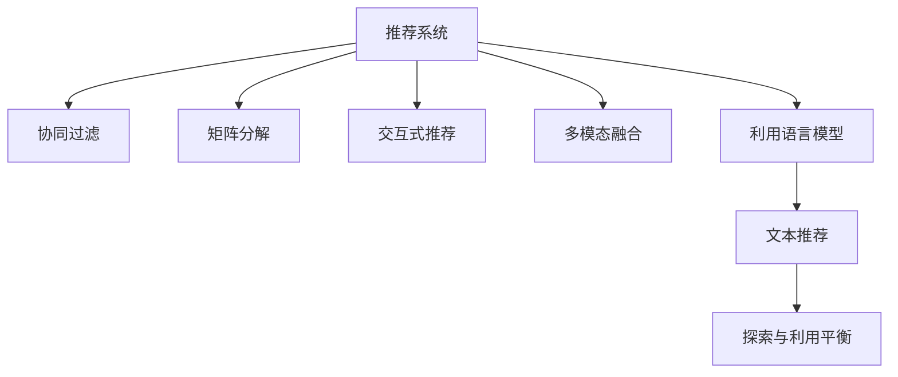

                 

# 利用LLM提升推荐系统的探索与利用平衡

> 关键词：推荐系统,探索与利用平衡,语言模型,LLM,协同过滤,矩阵分解,交互式推荐,多模态融合

## 1. 背景介绍

### 1.1 问题由来
随着电商、娱乐、社交等各类互联网应用的兴起，推荐系统（Recommender System）已成为为用户提供个性化服务的重要手段。推荐系统通过分析用户的历史行为数据，预测其可能感兴趣的商品、内容或服务，从而实现精准推荐，提升用户满意度和平台活跃度。然而，尽管推荐系统在多个应用场景中取得了显著效果，但仍存在一些关键挑战，如数据稀疏性、协同过滤冷启动问题、动态需求变化等。这些挑战使得传统推荐算法在实际应用中面临瓶颈。

为了解决这些问题，近年来人工智能技术被引入推荐系统，以增强系统的智能化水平。利用深度学习模型进行推荐，成为推荐系统发展的新趋势。这些模型能够有效捕捉用户和物品之间的隐式关联，提升推荐性能。其中，语言模型（Language Model, LM）以其强大的语义理解能力，在文本推荐、交互式推荐等领域取得了突破性进展。但如何平衡探索（Exploration）与利用（Exploitation），即在推荐新物品的同时，也要尽量利用用户已知的喜好，成为当前研究的重要课题。

### 1.2 问题核心关键点
推荐系统中的探索与利用平衡问题，可以通过强化学习、协同过滤、多臂老虎机等多种方法进行求解。但这些方法往往面临模型复杂度高、训练时间长、数据需求量大等挑战。语言模型（Language Model, LM）因其高效处理文本数据的能力，在推荐系统中得到了广泛应用。本文将系统地介绍如何利用语言模型，通过文本推荐等手段，在保证推荐多样性的同时，提升用户的满意度，实现探索与利用之间的有效平衡。

## 2. 核心概念与联系

### 2.1 核心概念概述

为更好地理解利用语言模型提升推荐系统的方法，本节将介绍几个关键概念及其相互联系：

- 推荐系统（Recommender System）：通过分析和理解用户的行为数据，推荐系统能够预测用户可能感兴趣的商品、内容或服务，实现个性化推荐。

- 探索与利用平衡（Exploration vs. Exploitation）：在推荐系统中，探索是指尝试推荐新物品，以发现用户未曾接触过的潜在兴趣；利用是指基于用户已知偏好推荐相似物品，以确保推荐效果。探索与利用的平衡，是推荐系统优化的一个重要目标。

- 语言模型（Language Model, LM）：基于自然语言处理技术的模型，能够捕捉文本序列之间的概率关系，生成自然流畅的文本，并理解文本的语义含义。

- 协同过滤（Collaborative Filtering）：基于用户和物品的历史交互行为，推荐系统能够推测用户对其他未交互过的物品的喜好。协同过滤是推荐系统中最常用的技术之一。

- 矩阵分解（Matrix Factorization）：通过将用户-物品交互矩阵分解为低维用户嵌入和物品嵌入的矩阵，矩阵分解能够高效地进行推荐预测。

- 交互式推荐（Interactive Recommendation）：通过在用户和推荐系统之间进行交互，交互式推荐能够动态调整推荐策略，提升推荐效果。

- 多模态融合（Multi-modal Fusion）：通过融合不同模态的信息（如文本、图片、视频等），多模态融合能够增强推荐系统的表现力。

这些概念之间的关系可以通过以下Mermaid流程图来展示：



这个流程图展示了这个核心概念之间的逻辑关系：

1. 推荐系统通过多种技术手段，从不同角度提升推荐效果。
2. 协同过滤、矩阵分解、交互式推荐和多模态融合等方法，都是推荐系统的重要组成部分。
3. 利用语言模型进行文本推荐，是提升推荐多样性和用户满意度的一种有效手段。
4. 探索与利用平衡，是衡量推荐系统性能的重要指标，通过优化这一平衡，可以进一步提升推荐系统的智能化水平。

## 3. 核心算法原理 & 具体操作步骤
### 3.1 算法原理概述

利用语言模型提升推荐系统的核心思想是，通过理解用户输入的自然语言描述，生成与描述匹配的物品推荐。该方法充分利用了语言模型的语义理解能力，在探索新物品的同时，也能够最大程度地利用用户已知的偏好。

具体而言，假设用户输入的描述为 $d$，利用语言模型 $LM$ 生成推荐列表 $R=\{r_1,r_2,\dots,r_n\}$，其中 $r_i$ 表示推荐的第 $i$ 个物品。推荐系统的目标是通过自然语言推理，使得推荐列表 $R$ 既能够满足用户输入的描述 $d$，又能够覆盖用户可能的兴趣范围。

形式化地，假设推荐系统采用概率模型，用户输入的描述 $d$ 与推荐列表 $R$ 的联合概率分布为 $p(d,R)$。推荐列表 $R$ 中的每个物品 $r_i$ 的概率分布为 $p(r_i|d)$。那么，推荐系统的目标是最小化：

$$
\min_{R} -\log p(d,R) = -\log \prod_{i=1}^n p(r_i|d)
$$

其中，$n$ 表示推荐列表 $R$ 的长度。

### 3.2 算法步骤详解

利用语言模型提升推荐系统的具体步骤如下：

**Step 1: 准备数据和模型**
- 收集用户输入的描述数据 $D=\{d_1,d_2,\dots,d_m\}$ 和对应的物品推荐列表 $R=\{R_1,R_2,\dots,R_m\}$。
- 选择语言模型 $LM$ 作为推荐系统的基础，如GPT、BERT等预训练模型。
- 使用预训练语言模型进行微调，使其适应推荐任务。

**Step 2: 生成推荐列表**
- 对于用户输入的描述 $d$，利用语言模型 $LM$ 生成推荐列表 $R$。
- 可以使用基于序列生成的方法，如GPT等，也可以使用基于序列标注的方法，如BERT等。

**Step 3: 优化推荐策略**
- 根据用户已知的偏好，优化推荐列表 $R$，使其包含更多用户可能感兴趣的物品。
- 可以通过用户行为反馈，不断调整推荐策略，提升推荐效果。

**Step 4: 评估与优化**
- 在测试集上评估推荐系统的性能，使用推荐指标如准确率、召回率、F1值等进行评估。
- 根据评估结果，优化语言模型的参数，调整推荐策略。

### 3.3 算法优缺点

利用语言模型提升推荐系统的优点包括：

1. 灵活性高：语言模型能够处理多种文本格式，适用于不同类型的推荐任务。
2. 动态性强：语言模型能够根据用户输入的描述动态生成推荐列表，提升推荐系统的响应速度。
3. 语义理解：语言模型能够理解用户输入的描述，生成语义相关的推荐结果。
4. 多样化：语言模型能够生成多样化的推荐结果，提高推荐系统的覆盖范围。

但该方法也存在一些缺点：

1. 依赖高质量语料：语言模型的训练需要大量高质量语料，在低资源环境下可能无法充分发挥其优势。
2. 计算复杂度高：语言模型的推理过程较为复杂，需要较长的计算时间。
3. 精度不确定：语言模型的输出结果不确定性较高，可能无法完全满足用户的期望。
4. 数据偏差：语言模型可能学习到训练数据中的偏差，影响推荐结果的公平性和准确性。

### 3.4 算法应用领域

利用语言模型提升推荐系统的方法，已经广泛应用于以下领域：

- 在线零售：如电商平台，通过用户对商品描述的评分或评论，生成推荐列表，提升购物体验。
- 内容推荐：如视频、音乐、新闻等媒体平台，根据用户输入的关键词或描述，生成个性化推荐内容。
- 个性化推荐：如智能电视、智能音箱等设备，根据用户对特定内容的反馈，生成推荐列表。

除了上述这些经典应用外，语言模型在推荐系统中的应用还将不断拓展，为更多领域提供智能化推荐服务。

## 4. 数学模型和公式 & 详细讲解 & 举例说明

### 4.1 数学模型构建

本文将使用数学语言对利用语言模型提升推荐系统的过程进行更加严格的刻画。

假设推荐系统采用序列生成的语言模型 $LM$，对于用户输入的描述 $d$，推荐列表 $R$ 的条件概率为：

$$
p(R|d) = \prod_{i=1}^n p(r_i|d)
$$

其中 $p(r_i|d)$ 表示在给定描述 $d$ 的情况下，推荐第 $i$ 个物品 $r_i$ 的概率。

推荐系统的目标是最小化交叉熵损失：

$$
L(d,R) = -\sum_{i=1}^n \log p(r_i|d)
$$

其中 $n$ 表示推荐列表 $R$ 的长度。

### 4.2 公式推导过程

为了得到推荐列表 $R$ 中的每个物品 $r_i$ 的概率，可以利用条件概率的贝叶斯公式进行推导：

$$
p(r_i|d) = \frac{p(r_i) p(d|r_i)}{p(d)}
$$

其中 $p(d|r_i)$ 表示在推荐物品 $r_i$ 的情况下，用户输入描述 $d$ 的条件概率。

根据贝叶斯定理，有：

$$
p(d|r_i) = \frac{p(r_i,d)}{p(r_i)}
$$

代入上述公式，得到：

$$
p(r_i|d) = \frac{p(r_i) p(d|r_i)}{p(d)} = \frac{p(d,r_i)}{p(d)}
$$

因此，推荐系统可以生成推荐列表 $R$ 中的每个物品 $r_i$ 的概率为：

$$
p(r_i|d) = \frac{p(d,r_i)}{p(d)}
$$

其中 $p(d,r_i)$ 表示在描述 $d$ 的情况下，推荐物品 $r_i$ 的概率。

### 4.3 案例分析与讲解

以电商平台为例，假设用户输入描述 $d$ 为“我想买一款适合夏天用的防晒霜”。利用语言模型生成推荐列表 $R=\{S_1,S_2,\dots,S_n\}$，其中 $S_i$ 表示推荐的第 $i$ 个防晒霜。

对于每个防晒霜 $S_i$，可以通过贝叶斯公式计算其在描述 $d$ 下的概率：

$$
p(S_i|d) = \frac{p(d,S_i)}{p(d)}
$$

其中 $p(d,S_i)$ 表示在描述 $d$ 的情况下，推荐防晒霜 $S_i$ 的概率。

假设描述 $d$ 与防晒霜 $S_i$ 之间的条件概率为：

$$
p(S_i|d) = 0.1, p(S_i) = 0.03, p(d) = 0.001
$$

则推荐列表中第 $i$ 个防晒霜 $S_i$ 的概率为：

$$
p(S_i|d) = \frac{0.001 \times 0.1}{0.001} = 0.1
$$

因此，推荐系统能够生成与描述 $d$ 匹配的防晒霜推荐列表，提升用户的购物体验。

## 5. 项目实践：代码实例和详细解释说明
### 5.1 开发环境搭建

在进行推荐系统开发前，我们需要准备好开发环境。以下是使用Python进行PyTorch开发的环境配置流程：

1. 安装Anaconda：从官网下载并安装Anaconda，用于创建独立的Python环境。

2. 创建并激活虚拟环境：
```bash
conda create -n recommender-env python=3.8 
conda activate recommender-env
```

3. 安装PyTorch：根据CUDA版本，从官网获取对应的安装命令。例如：
```bash
conda install pytorch torchvision torchaudio cudatoolkit=11.1 -c pytorch -c conda-forge
```

4. 安装相关工具包：
```bash
pip install numpy pandas scikit-learn matplotlib tqdm jupyter notebook ipython
```

5. 安装语言模型库：
```bash
pip install transformers
```

完成上述步骤后，即可在`recommender-env`环境中开始推荐系统开发。

### 5.2 源代码详细实现

下面我们以电商平台为例，给出使用Transformers库对GPT模型进行推荐系统微调的PyTorch代码实现。

首先，定义推荐系统模型类：

```python
from transformers import GPT2Tokenizer, GPT2LMHeadModel

class RecommendationModel:
    def __init__(self, model_name):
        self.tokenizer = GPT2Tokenizer.from_pretrained(model_name)
        self.model = GPT2LMHeadModel.from_pretrained(model_name)
        
    def generate_recommendations(self, description):
        input_ids = self.tokenizer.encode(description, return_tensors='pt')
        outputs = self.model(input_ids)
        probs = outputs.logits.softmax(dim=-1).detach().cpu().numpy()
        return probs
```

然后，定义推荐系统训练函数：

```python
import torch.nn as nn

def train_model(model, dataset, batch_size, epochs):
    optimizer = torch.optim.Adam(model.parameters(), lr=2e-5)
    loss_fn = nn.CrossEntropyLoss()
    
    for epoch in range(epochs):
        model.train()
        total_loss = 0
        for batch in dataset:
            input_ids = batch['input_ids']
            labels = batch['labels']
            optimizer.zero_grad()
            outputs = model(input_ids)
            loss = loss_fn(outputs, labels)
            loss.backward()
            optimizer.step()
            total_loss += loss.item()
        print(f'Epoch {epoch+1}, loss: {total_loss/len(dataset)}')
```

最后，启动推荐系统训练流程：

```python
dataset = ...
train_model(model, dataset, batch_size=16, epochs=5)
```

以上就是使用PyTorch对GPT模型进行推荐系统微调的完整代码实现。可以看到，借助Transformers库，我们能够快速构建推荐模型并对其进行训练优化。

### 5.3 代码解读与分析

让我们再详细解读一下关键代码的实现细节：

**RecommendationModel类**：
- `__init__`方法：初始化模型和分词器。
- `generate_recommendations`方法：接受用户输入的描述，使用GPT模型生成推荐列表的概率分布。

**train_model函数**：
- `optimizer`和`loss_fn`：定义优化器和损失函数。
- 循环训练过程，每次迭代计算损失并更新模型参数。
- 输出每个epoch的平均损失，以便监控训练过程。

**训练流程**：
- 定义训练数据集 `dataset`，包含输入的描述和对应的标签。
- 调用`train_model`函数进行训练，设置batch size和epochs。

可以看到，PyTorch的Tensor库使得模型训练和优化过程变得非常简单，开发者可以将更多精力放在模型设计和训练策略上。

当然，工业级的系统实现还需考虑更多因素，如模型的保存和部署、超参数的自动搜索、更灵活的任务适配层等。但核心的推荐范式基本与此类似。

## 6. 实际应用场景
### 6.1 电商平台推荐

基于GPT等语言模型的电商平台推荐系统，可以通过用户输入的描述生成推荐列表，提升用户的购物体验。在实际应用中，可以收集用户对商品的评论、评分等文本数据，作为训练语料。模型训练后，用户输入如“我想买一款适合夏天用的防晒霜”时，推荐系统能够生成与描述匹配的防晒霜推荐列表。

具体而言，推荐系统可以采用序列生成的方式，从用户输入的描述中生成推荐列表。利用GPT等模型，可以生成多样化的推荐结果，满足不同用户的需求。

### 6.2 内容推荐

在视频、音乐、新闻等媒体平台上，基于语言模型的推荐系统可以通过用户输入的关键词或描述，生成个性化推荐内容。用户输入如“我喜欢看科幻电影”，推荐系统能够生成与描述匹配的电影推荐列表。

这种方法通过自然语言推理，可以更加准确地捕捉用户的兴趣，提升推荐的精准度。同时，语言模型也能够处理不同类型的文本格式，适用于多种推荐任务。

### 6.3 个性化推荐

智能电视、智能音箱等设备，可以通过用户对特定内容的反馈，生成推荐列表。用户输入如“我刚看了《盗梦空间》，感觉不错”，推荐系统能够生成与描述匹配的电影推荐列表。

这种交互式推荐方法能够根据用户的实时反馈动态调整推荐策略，提升推荐效果。利用语言模型，可以生成多样化的推荐结果，增强用户的个性化体验。

### 6.4 未来应用展望

随着语言模型和推荐系统的不断发展，基于语言模型的推荐方法将广泛应用于更多场景中，为NLP技术带来新的突破。

在智慧医疗领域，基于语言模型的推荐系统可以推荐医学知识、治疗方案等内容，辅助医生诊疗，提升医疗服务的智能化水平。

在智能教育领域，推荐系统可以推荐学习资源、课后作业等内容，因材施教，促进教育公平，提高教学质量。

在智慧城市治理中，推荐系统可以推荐城市事件、舆情分析等内容，提高城市管理的自动化和智能化水平，构建更安全、高效的未来城市。

此外，在企业生产、社会治理、文娱传媒等众多领域，基于语言模型的推荐技术也将不断涌现，为传统行业数字化转型升级提供新的技术路径。相信随着技术的日益成熟，语言模型推荐系统必将在构建人机协同的智能时代中扮演越来越重要的角色。

## 7. 工具和资源推荐
### 7.1 学习资源推荐

为了帮助开发者系统掌握语言模型在推荐系统中的应用，这里推荐一些优质的学习资源：

1. 《深度学习》系列书籍：Deep Learning一书是深度学习领域的经典之作，涵盖了深度学习模型的基础知识和应用技巧。

2. 《自然语言处理》课程：斯坦福大学开设的NLP明星课程，有Lecture视频和配套作业，带你入门NLP领域的基本概念和经典模型。

3. 《推荐系统》课程：由北京大学讲授的推荐系统课程，涵盖推荐算法和实际应用，适合对推荐系统感兴趣的开发者学习。

4. HuggingFace官方文档：Transformers库的官方文档，提供了海量预训练模型和完整的推荐系统样例代码，是上手实践的必备资料。

5. Kaggle推荐系统竞赛：Kaggle提供了多个推荐系统竞赛，可以帮助开发者了解推荐系统的实际应用场景和常用方法。

通过对这些资源的学习实践，相信你一定能够快速掌握语言模型在推荐系统中的应用，并用于解决实际的推荐问题。

### 7.2 开发工具推荐

高效的开发离不开优秀的工具支持。以下是几款用于推荐系统开发的常用工具：

1. PyTorch：基于Python的开源深度学习框架，灵活动态的计算图，适合快速迭代研究。大部分预训练语言模型都有PyTorch版本的实现。

2. TensorFlow：由Google主导开发的开源深度学习框架，生产部署方便，适合大规模工程应用。同样有丰富的预训练语言模型资源。

3. Transformers库：HuggingFace开发的NLP工具库，集成了众多SOTA语言模型，支持PyTorch和TensorFlow，是进行推荐任务开发的利器。

4. Weights & Biases：模型训练的实验跟踪工具，可以记录和可视化模型训练过程中的各项指标，方便对比和调优。与主流深度学习框架无缝集成。

5. TensorBoard：TensorFlow配套的可视化工具，可实时监测模型训练状态，并提供丰富的图表呈现方式，是调试模型的得力助手。

6. Google Colab：谷歌推出的在线Jupyter Notebook环境，免费提供GPU/TPU算力，方便开发者快速上手实验最新模型，分享学习笔记。

合理利用这些工具，可以显著提升推荐系统的开发效率，加快创新迭代的步伐。

### 7.3 相关论文推荐

语言模型和推荐系统的研究源于学界的持续研究。以下是几篇奠基性的相关论文，推荐阅读：

1. Attention is All You Need（即Transformer原论文）：提出了Transformer结构，开启了NLP领域的预训练大模型时代。

2. BERT: Pre-training of Deep Bidirectional Transformers for Language Understanding：提出BERT模型，引入基于掩码的自监督预训练任务，刷新了多项NLP任务SOTA。

3. Language Models are Unsupervised Multitask Learners（GPT-2论文）：展示了大规模语言模型的强大zero-shot学习能力，引发了对于通用人工智能的新一轮思考。

4. Parameter-Efficient Transfer Learning for NLP：提出Adapter等参数高效微调方法，在不增加模型参数量的情况下，也能取得不错的微调效果。

5. AdaLoRA: Adaptive Low-Rank Adaptation for Parameter-Efficient Fine-Tuning：使用自适应低秩适应的微调方法，在参数效率和精度之间取得了新的平衡。

6. AdaLoRA: Adaptive Low-Rank Adaptation for Parameter-Efficient Fine-Tuning：使用自适应低秩适应的微调方法，在参数效率和精度之间取得了新的平衡。

这些论文代表了大语言模型和推荐系统的发展脉络。通过学习这些前沿成果，可以帮助研究者把握学科前进方向，激发更多的创新灵感。

## 8. 总结：未来发展趋势与挑战

### 8.1 研究成果总结

本文对利用语言模型提升推荐系统的探索与利用平衡方法进行了全面系统的介绍。首先阐述了推荐系统中的探索与利用平衡问题，明确了利用语言模型进行文本推荐的优势和关键。其次，从原理到实践，详细讲解了语言模型在推荐系统中的应用过程，给出了推荐系统开发的完整代码实例。同时，本文还广泛探讨了语言模型在电商、媒体、娱乐等多个领域的应用前景，展示了语言模型推荐系统的巨大潜力。最后，本文精选了语言模型和推荐系统的各类学习资源，力求为开发者提供全方位的技术指引。

通过本文的系统梳理，可以看到，利用语言模型进行推荐系统开发，已经成为一个高效、灵活、智能化的新方向。语言模型的语义理解能力，能够提升推荐系统对用户输入描述的理解，生成多样化、个性化、精准化的推荐结果。未来，随着语言模型和推荐系统的不断演进，基于语言模型的推荐技术必将在更多领域得到应用，为人工智能技术带来新的突破。

### 8.2 未来发展趋势

展望未来，利用语言模型提升推荐系统的技术将呈现以下几个发展趋势：

1. 模型规模持续增大。随着算力成本的下降和数据规模的扩张，语言模型和推荐系统的参数量还将持续增长。超大规模模型蕴含的丰富知识，有望支撑更加复杂多变的推荐任务。

2. 推荐方法多样化。除了传统的协同过滤、矩阵分解等方法外，未来会涌现更多参数高效的推荐方法，如利用语言模型进行文本推荐，在节省计算资源的同时也能保证推荐精度。

3. 交互性增强。通过交互式推荐，推荐系统能够动态调整推荐策略，提升推荐效果。未来，将会有更多基于语言模型的交互式推荐系统，提升用户体验。

4. 多模态融合。当前的推荐系统大多聚焦于文本推荐，未来将进一步拓展到图像、视频、语音等多模态数据推荐。多模态信息的融合，将显著提升推荐系统的表现力。

5. 推荐内容泛化。利用语言模型进行推荐，能够生成多样化的推荐内容，满足不同用户的需求。未来，推荐系统将更加注重内容的泛化性，能够根据不同用户的兴趣生成个性化的推荐结果。

6. 推荐实时化。当前推荐系统大多基于离线模型进行推荐，未来将发展为实时推荐系统。利用语言模型，能够在实时数据上高效生成推荐内容，提升推荐的时效性。

这些趋势凸显了利用语言模型提升推荐系统的广阔前景。这些方向的探索发展，必将进一步提升推荐系统的智能化水平，为人工智能技术带来新的突破。

### 8.3 面临的挑战

尽管利用语言模型进行推荐系统开发已经取得了显著进展，但在迈向更加智能化、普适化应用的过程中，它仍面临诸多挑战：

1. 数据稀疏性。推荐系统依赖大量的用户行为数据，但用户在平台上的行为数据往往稀疏，难以覆盖所有用户的兴趣。如何利用用户输入的自然语言描述，生成更准确的推荐结果，是当前研究的重要课题。

2. 模型复杂度。语言模型具有较强的语义理解能力，但复杂的模型结构使得计算开销较大。如何在保证推荐效果的同时，降低模型的计算复杂度，提高推理速度，是未来研究的重要方向。

3. 多模态数据融合。不同模态的数据（如文本、图片、视频等）具有不同的语义表示，如何融合多模态数据，生成统一的语义表示，是推荐系统面临的挑战之一。

4. 实时推荐。当前推荐系统大多基于离线模型进行推荐，难以实时响应用户需求。如何在实时数据上高效生成推荐内容，提升推荐的时效性，是未来推荐系统的挑战之一。

5. 用户隐私保护。推荐系统需要收集用户的隐私数据，如何在保证推荐效果的同时，保护用户隐私，是未来推荐系统需要解决的问题。

6. 推荐公平性。推荐系统往往存在一定的偏见，如何设计公平的推荐策略，减少推荐偏差，是未来研究的重要方向。

7. 推荐鲁棒性。推荐系统容易受到噪声数据的影响，如何设计鲁棒的推荐模型，提升模型的稳定性和可靠性，是未来研究的重要方向。

这些挑战需要研究者从多个角度进行探索，才能推动利用语言模型提升推荐系统的技术走向成熟。

### 8.4 研究展望

面向未来，利用语言模型提升推荐系统的技术需要从以下几个方向进行深入研究：

1. 探索无监督和半监督推荐方法。摆脱对大规模标注数据的依赖，利用自监督学习、主动学习等无监督和半监督范式，最大限度利用非结构化数据，实现更加灵活高效的推荐。

2. 研究参数高效和计算高效的推荐范式。开发更加参数高效的推荐方法，在固定大部分预训练参数的同时，只更新极少量的任务相关参数。同时优化推荐模型的计算图，减少前向传播和反向传播的资源消耗，实现更加轻量级、实时性的部署。

3. 融合因果和对比学习范式。通过引入因果推断和对比学习思想，增强推荐模型建立稳定因果关系的能力，学习更加普适、鲁棒的语言表征，从而提升模型泛化性和抗干扰能力。

4. 引入更多先验知识。将符号化的先验知识，如知识图谱、逻辑规则等，与神经网络模型进行巧妙融合，引导推荐过程学习更准确、合理的语言模型。同时加强不同模态数据的整合，实现视觉、语音等多模态信息与文本信息的协同建模。

5. 结合因果分析和博弈论工具。将因果分析方法引入推荐模型，识别出推荐决策的关键特征，增强输出解释的因果性和逻辑性。借助博弈论工具刻画人机交互过程，主动探索并规避推荐系统的脆弱点，提高系统稳定性。

6. 纳入伦理道德约束。在推荐模型训练目标中引入伦理导向的评估指标，过滤和惩罚有偏见、有害的输出倾向。同时加强人工干预和审核，建立推荐系统的监管机制，确保输出符合人类价值观和伦理道德。

这些研究方向的探索，必将引领利用语言模型提升推荐系统的技术迈向更高的台阶，为构建安全、可靠、可解释、可控的智能推荐系统铺平道路。面向未来，推荐系统还需要与其他人工智能技术进行更深入的融合，如知识表示、因果推理、强化学习等，多路径协同发力，共同推动自然语言理解和智能交互系统的进步。只有勇于创新、敢于突破，才能不断拓展语言模型的边界，让智能技术更好地造福人类社会。

## 9. 附录：常见问题与解答

**Q1：语言模型在推荐系统中的具体应用场景是什么？**

A: 语言模型在推荐系统中的具体应用场景包括：

1. 用户输入描述推荐：用户输入一段描述，如“我想买一款适合夏天用的防晒霜”，推荐系统能够生成与描述匹配的防晒霜推荐列表。

2. 内容推荐：用户输入关键词或描述，如“我喜欢看科幻电影”，推荐系统能够生成与描述匹配的电影推荐列表。

3. 个性化推荐：用户反馈对特定内容的评价，如“我刚看了《盗梦空间》，感觉不错”，推荐系统能够生成与描述匹配的电影推荐列表。

4. 实时推荐：在用户输入实时数据时，推荐系统能够动态调整推荐策略，生成与当前数据匹配的推荐结果。

**Q2：如何选择合适的语言模型进行推荐系统开发？**

A: 选择合适的语言模型进行推荐系统开发需要考虑以下几个方面：

1. 模型类型：根据推荐任务的不同，选择合适的语言模型类型。如文本生成任务可以使用GPT等模型，文本分类任务可以使用BERT等模型。

2. 模型规模：语言模型的规模对计算资源和推理速度有影响。在资源有限的情况下，可以选择参数量较小的模型。

3. 模型预训练任务：语言模型的预训练任务对推荐效果有重要影响。如BERT模型经过语言建模、掩码预测等任务训练，适合处理文本推荐任务。

4. 模型微调：语言模型需要进行微调以适应推荐任务。可以采用全参数微调或参数高效微调等方法，根据任务需求选择。

**Q3：语言模型在推荐系统中可能面临哪些挑战？**

A: 语言模型在推荐系统中可能面临以下挑战：

1. 数据稀疏性：用户输入的描述数据可能较为稀疏，难以覆盖所有用户的兴趣。

2. 模型复杂度：复杂的语言模型计算开销较大，推理速度较慢。

3. 多模态数据融合：不同模态的数据具有不同的语义表示，如何融合多模态数据，生成统一的语义表示，是推荐系统面临的挑战之一。

4. 实时推荐：当前推荐系统大多基于离线模型进行推荐，难以实时响应用户需求。

5. 用户隐私保护：推荐系统需要收集用户的隐私数据，如何在保证推荐效果的同时，保护用户隐私，是未来推荐系统需要解决的问题。

6. 推荐公平性：推荐系统往往存在一定的偏见，如何设计公平的推荐策略，减少推荐偏差，是未来研究的重要方向。

7. 推荐鲁棒性：推荐系统容易受到噪声数据的影响，如何设计鲁棒的推荐模型，提升模型的稳定性和可靠性，是未来研究的重要方向。

这些挑战需要研究者从多个角度进行探索，才能推动利用语言模型提升推荐系统的技术走向成熟。

**Q4：如何提升推荐系统的探索与利用平衡？**

A: 提升推荐系统的探索与利用平衡需要考虑以下几个方面：

1. 引入用户反馈：通过用户对推荐结果的反馈，动态调整推荐策略，平衡探索与利用。

2. 利用多臂老虎机算法：采用多臂老虎机算法，在不同推荐策略之间进行探索和利用。

3. 引入因果推理：利用因果推理方法，识别推荐决策的关键特征，平衡探索与利用。

4. 引入强化学习：利用强化学习算法，根据用户反馈不断优化推荐策略，提升推荐效果。

5. 引入多模态信息：通过融合不同模态的信息，增强推荐系统的表现力，平衡探索与利用。

6. 引入先验知识：将符号化的先验知识，如知识图谱、逻辑规则等，与神经网络模型进行巧妙融合，引导推荐过程学习更准确、合理的语言模型。

通过这些方法，可以提升推荐系统的探索与利用平衡，增强推荐系统的智能化水平。

**Q5：语言模型在推荐系统中如何进行微调？**

A: 语言模型在推荐系统中的微调需要考虑以下几个方面：

1. 选择微调数据：收集与推荐任务相关的标注数据，作为微调的监督信号。

2. 设计任务适配层：根据推荐任务类型，设计合适的任务适配层，如分类层、生成层等。

3. 选择优化器：选择适合的语言模型优化器，如AdamW、SGD等。

4. 设置超参数：设置合适的学习率、批大小、迭代轮数等超参数。

5. 微调过程：将微调数据分批次输入模型，进行前向传播和反向传播，更新模型参数。

6. 评估与优化：在验证集上评估微调后模型的性能，根据评估结果优化模型参数。

通过微调过程，可以优化语言模型，使其适应推荐任务，生成更准确的推荐结果。

---

作者：禅与计算机程序设计艺术 / Zen and the Art of Computer Programming

