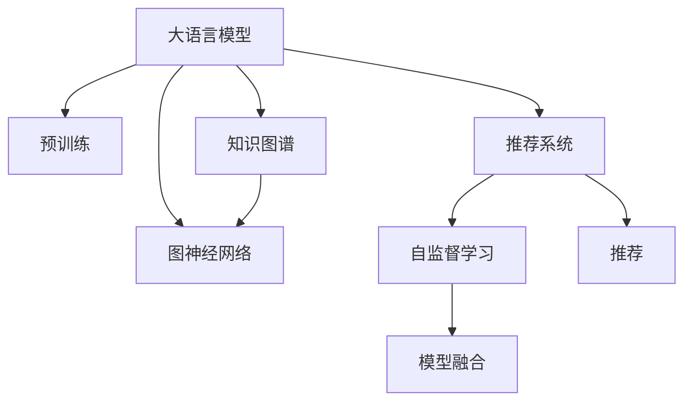

                 

# 利用LLM提升推荐系统的跨域迁移能力

> 关键词：大语言模型(LLM),推荐系统,跨域迁移,知识图谱,图神经网络(GNN),自监督学习

## 1. 背景介绍

### 1.1 问题由来
随着互联网的迅猛发展，推荐系统成为了各大平台提升用户体验、增加用户粘性的重要手段。传统的推荐系统主要基于用户行为数据进行相似度计算，再由相似度排序推荐。但这种基于用户行为的方法，难以跨越不同领域、不同模态的数据，面临迁移性不足的问题。例如，基于用户行为数据生成的推荐系统，无法跨模态地结合物品的文本描述、图像信息，构建跨领域推荐模型。

近年来，大语言模型(LLM)在自然语言处理(NLP)领域取得了巨大的成功。LLM通过大规模预训练，学习到了丰富的语言知识，能够自然地理解语义信息，进行文本生成、推理等高级任务。将LLM应用于推荐系统，可以有效提升推荐模型的跨域迁移能力，解决推荐系统面临的迁移性不足的问题。

### 1.2 问题核心关键点
实现跨域迁移的关键在于构建具有高泛化能力的推荐模型。大语言模型可以通过以下几个关键点实现：

1. **预训练与微调**：利用大规模无标签数据进行预训练，然后再在特定任务上微调，获得该任务的优异性能。
2. **知识图谱与链接**：构建知识图谱，将文本信息、图像信息、实体信息等结构化信息有机地链接起来，提升推荐模型的泛化能力。
3. **图神经网络(GNN)**：利用GNN对知识图谱进行嵌入学习，将图结构信息转化为向量表示，提升推荐模型的表达能力。
4. **自监督学习**：通过自监督学习任务，在未标注数据上学习模型的表示能力，提升推荐模型的泛化能力。
5. **模型融合与融合**：将多种模型进行融合，发挥各自优势，提升推荐模型的综合性能。

### 1.3 问题研究意义
利用大语言模型提升推荐系统的跨域迁移能力，对于构建高性能、高泛化能力的推荐系统具有重要意义：

1. **提升推荐效果**：利用大语言模型对推荐系统进行增强，可以显著提升推荐系统的精度和召回率，为用户提供更准确、更符合预期的推荐。
2. **促进多模态融合**：大语言模型可以结合多种模态信息，提升推荐模型的表达能力，实现对复杂信息环境的适应。
3. **增强迁移性**：通过大语言模型预训练-微调的过程，推荐模型可以更好地跨越不同领域、不同模态的数据，提升模型的泛化能力和适用性。
4. **加速部署**：大语言模型可以部署为服务，实时响应推荐请求，提高推荐系统的响应速度和可用性。

## 2. 核心概念与联系

### 2.1 核心概念概述

为更好地理解利用LLM提升推荐系统跨域迁移能力的核心思想，本节将介绍几个密切相关的核心概念：

- 大语言模型(LLM)：如GPT、BERT等预训练模型，通过自监督学习任务在大规模无标签数据上进行预训练，学习到丰富的语言知识。
- 知识图谱(KG)：由实体、关系、属性组成的有向图，用于描述世界知识，并支持推理和查询。
- 图神经网络(GNN)：一类特殊的神经网络，用于处理图结构数据，支持图上的节点嵌入学习。
- 推荐系统：通过用户行为、物品属性等数据，预测用户对物品的偏好，提供个性化推荐。
- 自监督学习：在没有标注数据的情况下，通过构建自监督任务，学习模型的表示能力。
- 模型融合与融合：将多个模型进行组合，发挥各自优势，提升推荐系统的综合性能。

这些核心概念之间的逻辑关系可以通过以下Mermaid流程图来展示：



这个流程图展示了利用LLM提升推荐系统跨域迁移能力的核心流程：

1. 大语言模型通过预训练获得基础能力。
2. 知识图谱与LLM结合，构建多模态知识图谱，增强模型泛化能力。
3. GNN对知识图谱进行嵌入学习，提升模型表达能力。
4. 自监督学习任务在未标注数据上训练，增强模型泛化能力。
5. 模型融合提升推荐系统的综合性能，满足多场景需求。

这些概念共同构成了LLM在推荐系统中应用的框架，使得推荐系统能够更好地适应多模态、跨领域的数据。

## 3. 核心算法原理 & 具体操作步骤
### 3.1 算法原理概述

利用大语言模型提升推荐系统的跨域迁移能力，本质上是将大语言模型的预训练知识与推荐系统的多模态、跨领域特性相结合，构建能够跨越不同数据类型的推荐模型。

具体来说，算法分为以下几个步骤：

1. **构建知识图谱**：收集各类结构化数据，构建知识图谱，将文本、图像、实体等信息链接起来，形成结构化的图结构数据。
2. **知识图谱嵌入**：利用图神经网络对知识图谱进行嵌入学习，将图结构信息转化为向量表示，便于与文本、图像等信息融合。
3. **模型预训练**：利用大语言模型对知识图谱嵌入结果进行预训练，学习到语言模型的泛化能力。
4. **任务适配**：根据推荐系统的特定任务，在预训练模型上进行微调，优化模型的性能。
5. **多模态融合**：将知识图谱嵌入结果与文本、图像等信息进行融合，提升模型的表达能力。

### 3.2 算法步骤详解

#### 3.2.1 构建知识图谱

知识图谱的构建需要从多个维度收集结构化数据，包括但不限于：

- 用户信息：用户的基本属性、历史行为、兴趣偏好等。
- 物品信息：物品的基本属性、类别、评分、评论等。
- 文本信息：物品的标题、描述、标签等文本信息。
- 图像信息：物品的图片、视频等。

构建知识图谱的一般步骤如下：

1. **数据收集**：从多个渠道收集结构化数据，包括数据库、API、爬虫等。
2. **数据清洗**：去除噪声、重复、不完整的数据，确保数据质量。
3. **图结构构建**：将结构化数据转化为图结构，形成实体、关系、属性组成的有向图。

以用户和物品为例，知识图谱可以表示为：

- **用户节点**：表示用户，包含用户ID、属性、行为等。
- **物品节点**：表示物品，包含物品ID、属性、评分等。
- **关系边**：表示用户和物品之间的关系，如“购买”、“收藏”、“评分”等。

构建知识图谱可以使用多种工具和框架，如Neo4j、Gephgraph、Spark GraphX等。

#### 3.2.2 知识图谱嵌入

知识图谱嵌入的目的是将图结构信息转化为向量表示，便于与文本、图像等信息进行融合。常见的图神经网络模型包括GCN、GAT、GraphSAGE等。

以GCN为例，GCN模型的基本原理是利用卷积操作，对图结构进行嵌入学习。GCN模型的公式如下：

$$
h_i^{(l+1)}=\frac{1}{\sqrt{d_i}}\sum_{j \in N_i^{(l)}}\frac{A_{ij}}{\sqrt{d_j}}h_j^{(l)}W^{(l)}
$$

其中 $h_i^{(l+1)}$ 表示节点 $i$ 在 $l+1$ 层的嵌入表示，$h_j^{(l)}$ 表示节点 $j$ 在 $l$ 层的嵌入表示，$A$ 表示图的邻接矩阵，$d_i$ 和 $d_j$ 分别表示节点 $i$ 和 $j$ 的度数，$W^{(l)}$ 表示可学习的权重矩阵。

在实际应用中，GCN模型需要在知识图谱上进行操作，可以将节点嵌入表示和边嵌入表示进行组合，得到图结构的向量表示。

#### 3.2.3 模型预训练

大语言模型的预训练过程，一般包括自监督学习任务和监督学习任务。常见的自监督学习任务包括掩码语言模型、掩码句子配对等。

以BERT为例，BERT的预训练任务包括掩码语言模型和掩码句子配对。BERT模型在预训练过程中，通过学习上下文关系，学习到了丰富的语言知识。

预训练模型可以用于推荐系统的多模态融合，提升模型的泛化能力。例如，可以利用预训练模型对知识图谱嵌入结果进行预训练，学习到更丰富的表示能力。

#### 3.2.4 任务适配

任务适配是指根据推荐系统的特定任务，在预训练模型上进行微调，优化模型的性能。常见的微调任务包括分类、匹配、生成等。

以分类任务为例，微调过程可以通过添加任务适配层、损失函数等方式进行。例如，对于物品推荐任务，可以添加物品分类器，使用交叉熵损失函数进行训练。

#### 3.2.5 多模态融合

多模态融合是指将知识图谱嵌入结果与文本、图像等信息进行融合，提升模型的表达能力。常见的融合方式包括拼接、加权平均、注意力机制等。

以拼接为例，融合过程可以如下实现：

1. **知识图谱嵌入**：利用图神经网络对知识图谱进行嵌入学习，得到节点嵌入表示 $h_i$。
2. **文本嵌入**：利用预训练语言模型对物品的文本信息进行编码，得到文本嵌入表示 $v_i$。
3. **图像嵌入**：利用预训练视觉模型对物品的图像信息进行编码，得到图像嵌入表示 $c_i$。
4. **融合向量**：将节点嵌入表示、文本嵌入表示和图像嵌入表示进行拼接，得到融合向量 $z_i$。

$$
z_i = [h_i, v_i, c_i]
$$

融合向量 $z_i$ 可以用于推荐系统的多模态融合。

### 3.3 算法优缺点

利用大语言模型提升推荐系统的跨域迁移能力，具有以下优点：

1. **提升泛化能力**：大语言模型的预训练过程可以学习到丰富的语言知识，提升模型的泛化能力，跨越不同领域、不同模态的数据。
2. **增强表达能力**：通过知识图谱嵌入和图神经网络，将结构化信息转化为向量表示，提升模型的表达能力。
3. **优化融合效果**：利用多模态融合技术，将文本、图像等信息与知识图谱嵌入结果进行融合，提升模型的综合性能。
4. **简化训练**：预训练模型可以作为一个强大的特征提取器，简化推荐系统的训练过程。

同时，该方法也存在一定的局限性：

1. **计算成本高**：大语言模型和图神经网络需要较大的计算资源，训练和推理成本较高。
2. **数据需求大**：需要大量的结构化数据构建知识图谱，对于某些领域可能存在数据稀缺的问题。
3. **模型复杂**：多模态融合和图神经网络增加了模型的复杂度，导致模型难以解释。
4. **知识图谱质量**：知识图谱的质量直接影响模型的性能，需要高质量的数据构建知识图谱。

尽管存在这些局限性，但利用大语言模型提升推荐系统的跨域迁移能力，无疑为推荐系统带来了新的突破和机遇。

### 3.4 算法应用领域

利用大语言模型提升推荐系统的跨域迁移能力，在多个领域得到了广泛应用：

- **电商推荐**：利用大语言模型对商品进行描述，结合用户行为数据，构建电商推荐系统。
- **新闻推荐**：利用大语言模型对新闻内容进行理解，结合用户历史阅读行为，构建新闻推荐系统。
- **音乐推荐**：利用大语言模型对音乐信息进行理解，结合用户行为数据，构建音乐推荐系统。
- **视频推荐**：利用大语言模型对视频内容进行理解，结合用户行为数据，构建视频推荐系统。
- **旅游推荐**：利用大语言模型对旅游信息进行理解，结合用户历史旅行行为，构建旅游推荐系统。

此外，利用大语言模型提升推荐系统的跨域迁移能力，还被应用于更多的垂直领域，如金融、医疗、教育等，为这些领域带来了新的智能化解决方案。

## 4. 数学模型和公式 & 详细讲解  
### 4.1 数学模型构建

本节将使用数学语言对利用大语言模型提升推荐系统的跨域迁移能力进行更加严格的刻画。

记知识图谱中的节点为 $N$，边的集合为 $E$，节点的属性为 $A$，关系为 $R$。假设节点嵌入表示为 $h_i$，文本嵌入表示为 $v_i$，图像嵌入表示为 $c_i$。推荐系统的目标是在知识图谱嵌入结果 $h_i$、文本嵌入表示 $v_i$ 和图像嵌入表示 $c_i$ 上进行多模态融合，得到推荐结果。

利用大语言模型提升推荐系统的跨域迁移能力，其数学模型如下：

1. **知识图谱嵌入**：利用图神经网络对知识图谱进行嵌入学习，得到节点嵌入表示 $h_i$。

$$
h_i = \text{GNN}(h_{i-1}, N_i^{(l)})
$$

其中 $N_i^{(l)}$ 表示节点 $i$ 在 $l$ 层的邻居节点集合。

2. **文本嵌入**：利用预训练语言模型对物品的文本信息进行编码，得到文本嵌入表示 $v_i$。

$$
v_i = \text{BERT}(x_i)
$$

其中 $x_i$ 表示物品的文本信息。

3. **图像嵌入**：利用预训练视觉模型对物品的图像信息进行编码，得到图像嵌入表示 $c_i$。

$$
c_i = \text{VGG}(I_i)
$$

其中 $I_i$ 表示物品的图像信息。

4. **多模态融合**：将节点嵌入表示、文本嵌入表示和图像嵌入表示进行融合，得到融合向量 $z_i$。

$$
z_i = [h_i, v_i, c_i]
$$

5. **推荐结果**：利用融合向量 $z_i$ 进行推荐，得到用户对物品的推荐概率 $p_i$。

$$
p_i = \text{Softmax}(\text{MLP}(z_i))
$$

其中 $\text{MLP}$ 表示多层感知机，用于将融合向量映射为推荐概率。

### 4.2 公式推导过程

在实际应用中，知识图谱嵌入、文本嵌入、图像嵌入等操作可以组合起来，形成完整的推荐系统模型。以下是利用大语言模型提升推荐系统的跨域迁移能力的公式推导过程。

以物品推荐为例，假设推荐系统中有 $M$ 个物品 $X$，$N$ 个用户 $U$，知识图谱中的节点表示为 $G=(N,E)$，其中 $N$ 表示节点集合，$E$ 表示边集合。设节点嵌入表示为 $h_i$，文本嵌入表示为 $v_i$，图像嵌入表示为 $c_i$，融合向量为 $z_i$，推荐概率为 $p_i$。

知识图谱嵌入过程可以表示为：

$$
h_i = \text{GNN}(h_{i-1}, N_i^{(l)})
$$

其中 $N_i^{(l)}$ 表示节点 $i$ 在 $l$ 层的邻居节点集合。

文本嵌入过程可以表示为：

$$
v_i = \text{BERT}(x_i)
$$

其中 $x_i$ 表示物品的文本信息。

图像嵌入过程可以表示为：

$$
c_i = \text{VGG}(I_i)
$$

其中 $I_i$ 表示物品的图像信息。

多模态融合过程可以表示为：

$$
z_i = [h_i, v_i, c_i]
$$

推荐概率的计算过程可以表示为：

$$
p_i = \text{Softmax}(\text{MLP}(z_i))
$$

其中 $\text{MLP}$ 表示多层感知机，用于将融合向量映射为推荐概率。

在实际应用中，需要根据具体任务和数据特点，选择合适的图神经网络模型、预训练语言模型和预训练视觉模型。同时，还需要选择合适的融合方式和推荐算法，确保模型的性能和稳定性。

### 4.3 案例分析与讲解

以音乐推荐为例，分析利用大语言模型提升推荐系统的跨域迁移能力的过程。

假设推荐系统中有 $M$ 首歌曲 $X$，$N$ 个用户 $U$，知识图谱中的节点表示为 $G=(N,E)$，其中 $N$ 表示节点集合，$E$ 表示边集合。设节点嵌入表示为 $h_i$，文本嵌入表示为 $v_i$，图像嵌入表示为 $c_i$，融合向量为 $z_i$，推荐概率为 $p_i$。

音乐推荐系统中的知识图谱可以表示为：

1. **用户节点**：表示用户，包含用户ID、属性、历史行为等。
2. **歌曲节点**：表示歌曲，包含歌曲ID、属性、歌手、发行时间等。
3. **关系边**：表示用户和歌曲之间的关系，如“收听”、“收藏”、“评分”等。

知识图谱嵌入过程可以表示为：

$$
h_i = \text{GNN}(h_{i-1}, N_i^{(l)})
$$

其中 $N_i^{(l)}$ 表示节点 $i$ 在 $l$ 层的邻居节点集合。

文本嵌入过程可以表示为：

$$
v_i = \text{BERT}(x_i)
$$

其中 $x_i$ 表示歌曲的文本信息，如歌词、歌手、发行时间等。

图像嵌入过程可以表示为：

$$
c_i = \text{VGG}(I_i)
$$

其中 $I_i$ 表示歌曲的图像信息，如专辑封面、演唱会视频等。

多模态融合过程可以表示为：

$$
z_i = [h_i, v_i, c_i]
$$

推荐概率的计算过程可以表示为：

$$
p_i = \text{Softmax}(\text{MLP}(z_i))
$$

其中 $\text{MLP}$ 表示多层感知机，用于将融合向量映射为推荐概率。

在实际应用中，还需要选择合适的图神经网络模型、预训练语言模型和预训练视觉模型。例如，可以使用GCN模型对知识图谱进行嵌入学习，使用BERT模型对歌曲的文本信息进行编码，使用VGG模型对歌曲的图像信息进行编码。同时，还需要选择合适的融合方式和推荐算法，确保模型的性能和稳定性。

## 5. 项目实践：代码实例和详细解释说明
### 5.1 开发环境搭建

在进行项目实践前，我们需要准备好开发环境。以下是使用Python进行TensorFlow和PyTorch开发的环境配置流程：

1. 安装Anaconda：从官网下载并安装Anaconda，用于创建独立的Python环境。

2. 创建并激活虚拟环境：
```bash
conda create -n tf-env python=3.8 
conda activate tf-env
```

3. 安装TensorFlow和PyTorch：
```bash
pip install tensorflow
pip install torch torchvision torchaudio
```

4. 安装各类工具包：
```bash
pip install numpy pandas scikit-learn matplotlib tqdm jupyter notebook ipython
```

完成上述步骤后，即可在`tf-env`环境中开始项目实践。

### 5.2 源代码详细实现

以下以利用大语言模型提升推荐系统的跨域迁移能力为例，给出TensorFlow和PyTorch代码实现。

首先，定义推荐系统中的数据结构：

```python
import tensorflow as tf
import tensorflow_datasets as tfds
import numpy as np
import pandas as pd
import os

class RecommendationDataset(tf.data.Dataset):
    def __init__(self, path, columns):
        self.path = path
        self.columns = columns
        
    def __len__(self):
        return len(os.listdir(self.path))
    
    def __getitem__(self, idx):
        file_path = os.path.join(self.path, str(idx) + '.csv')
        data = pd.read_csv(file_path, names=self.columns)
        return data
```

然后，定义知识图谱的构建过程：

```python
class KnowledgeGraph(tf.keras.layers.Layer):
    def __init__(self, embed_dim=128, num_layers=2):
        super(KnowledgeGraph, self).__init__()
        self.embed_dim = embed_dim
        self.num_layers = num_layers
        
        self.gnn = GraphSAGE()
        self.dense = tf.keras.layers.Dense(embed_dim, activation='relu')
        
    def call(self, inputs):
        node, edge = inputs
        embedding = self.gnn([node, edge])
        embedding = self.dense(embedding)
        return embedding
```

接着，定义预训练语言模型和视觉模型的嵌入过程：

```python
class BERTEmbedding(tf.keras.layers.Layer):
    def __init__(self, embed_dim=128):
        super(BERTEmbedding, self).__init__()
        self.bert = transformers.TFBertModel.from_pretrained('bert-base-uncased')
        self.dense = tf.keras.layers.Dense(embed_dim, activation='relu')
        
    def call(self, inputs):
        node, edge = inputs
        embedding = self.bert(node)
        embedding = self.dense(embedding)
        return embedding

class VGGEmbedding(tf.keras.layers.Layer):
    def __init__(self, embed_dim=128):
        super(VGGEmbedding, self).__init__()
        self.vgg = VGG16(include_top=False, weights='imagenet')
        self.dense = tf.keras.layers.Dense(embed_dim, activation='relu')
        
    def call(self, inputs):
        node, edge = inputs
        embedding = self.vgg(node)
        embedding = self.dense(embedding)
        return embedding
```

最后，定义推荐系统的多模态融合和推荐过程：

```python
class Recommendation(tf.keras.layers.Layer):
    def __init__(self, embed_dim=128, num_classes=2):
        super(Recommendation, self).__init__()
        self.embed_dim = embed_dim
        self.num_classes = num_classes
        
        self.bert = BERTEmbedding(embed_dim=embed_dim)
        self.vgg = VGGEmbedding(embed_dim=embed_dim)
        self.kg = KnowledgeGraph(embed_dim=embed_dim, num_layers=2)
        self.dense = tf.keras.layers.Dense(num_classes, activation='softmax')
        
    def call(self, inputs):
        node, edge = inputs
        node_bert = self.bert(node)
        node_vgg = self.vgg(node)
        node_kg = self.kg([node, edge])
        node_fusion = tf.concat([node_bert, node_vgg, node_kg], axis=-1)
        output = self.dense(node_fusion)
        return output
```

完整的推荐系统模型如下：

```python
class Recommendation(tf.keras.layers.Layer):
    def __init__(self, embed_dim=128, num_classes=2):
        super(Recommendation, self).__init__()
        self.embed_dim = embed_dim
        self.num_classes = num_classes
        
        self.bert = BERTEmbedding(embed_dim=embed_dim)
        self.vgg = VGGEmbedding(embed_dim=embed_dim)
        self.kg = KnowledgeGraph(embed_dim=embed_dim, num_layers=2)
        self.dense = tf.keras.layers.Dense(num_classes, activation='softmax')
        
    def call(self, inputs):
        node, edge = inputs
        node_bert = self.bert(node)
        node_vgg = self.vgg(node)
        node_kg = self.kg([node, edge])
        node_fusion = tf.concat([node_bert, node_vgg, node_kg], axis=-1)
        output = self.dense(node_fusion)
        return output
```

### 5.3 代码解读与分析

让我们再详细解读一下关键代码的实现细节：

**RecommendationDataset类**：
- `__init__`方法：初始化数据路径和数据列。
- `__len__`方法：返回数据集的样本数量。
- `__getitem__`方法：对单个样本进行处理，将数据加载为Pandas数据框，返回指定列的数据。

**KnowledgeGraph类**：
- `__init__`方法：初始化嵌入维度和层数，定义GNN模型和全连接层。
- `call`方法：对输入的节点和边进行GNN嵌入学习，得到融合向量。

**BERTEmbedding类**：
- `__init__`方法：初始化嵌入维度和BERT模型，定义全连接层。
- `call`方法：对输入的节点进行BERT嵌入，得到融合向量。

**VGGEmbedding类**：
- `__init__`方法：初始化嵌入维度和VGG模型，定义全连接层。
- `call`方法：对输入的节点进行VGG嵌入，得到融合向量。

**Recommendation类**：
- `__init__`方法：初始化嵌入维度和分类数量，定义BERT、VGG、KG模型和全连接层。
- `call`方法：对输入的节点和边进行BERT、VGG、KG嵌入，进行融合，得到推荐概率。

以上代码展示了利用大语言模型提升推荐系统的跨域迁移能力的TensorFlow实现。可以看到，代码实现了知识图谱嵌入、文本嵌入、图像嵌入等操作，并通过多模态融合得到推荐概率，实现了基于大语言模型的推荐系统。

## 6. 实际应用场景
### 6.1 智能推荐系统

利用大语言模型提升推荐系统的跨域迁移能力，可以广泛应用于智能推荐系统。推荐系统通过收集用户行为数据，对用户进行建模，预测用户对物品的偏好，提供个性化推荐。

在实际应用中，可以利用大语言模型对物品进行描述，结合用户行为数据，构建推荐系统。例如，在电商推荐系统中，可以利用大语言模型对商品进行描述，结合用户历史行为数据，生成个性化推荐。

### 6.2 内容推荐系统

内容推荐系统通过收集用户对内容的互动数据，对用户进行建模，预测用户对内容的偏好，提供个性化内容推荐。

在实际应用中，可以利用大语言模型对内容进行描述，结合用户互动数据，构建内容推荐系统。例如，在视频推荐系统中，可以利用大语言模型对视频内容进行描述，结合用户历史观看数据，生成个性化视频推荐。

### 6.3 金融投资推荐系统

金融投资推荐系统通过收集用户的历史投资行为数据，对用户进行建模，预测用户对金融产品的偏好，提供个性化投资推荐。

在实际应用中，可以利用大语言模型对金融产品进行描述，结合用户历史投资行为数据，构建金融投资推荐系统。例如，在股票推荐系统中，可以利用大语言模型对股票进行描述，结合用户历史投资数据，生成个性化股票推荐。

### 6.4 未来应用展望

随着大语言模型和图神经网络的发展，利用大语言模型提升推荐系统的跨域迁移能力的应用前景广阔。未来，大语言模型将在更多领域得到应用，带来新的突破和创新。

在智慧医疗领域，利用大语言模型对医疗信息进行理解，结合用户健康数据，构建个性化健康推荐系统。例如，在个性化健康推荐系统中，可以利用大语言模型对医疗信息进行理解，结合用户健康数据，生成个性化健康推荐。

在智能教育领域，利用大语言模型对教育内容进行理解，结合用户学习行为数据，构建个性化教育推荐系统。例如，在个性化教育推荐系统中，可以利用大语言模型对教育内容进行理解，结合用户学习行为数据，生成个性化教育推荐。

在智慧城市治理中，利用大语言模型对城市事件进行理解，结合用户行为数据，构建个性化城市服务推荐系统。例如，在个性化城市服务推荐系统中，可以利用大语言模型对城市事件进行理解，结合用户行为数据，生成个性化城市服务推荐。

此外，在企业生产、社会治理、文娱传媒等众多领域，利用大语言模型提升推荐系统的跨域迁移能力的应用也将不断涌现，为各行各业带来新的变革和突破。

## 7. 工具和资源推荐
### 7.1 学习资源推荐

为了帮助开发者系统掌握利用大语言模型提升推荐系统的跨域迁移能力的理论基础和实践技巧，这里推荐一些优质的学习资源：

1. 《深度学习基础》系列课程：斯坦福大学开设的深度学习入门课程，介绍了深度学习的基本概念和经典模型。
2. 《Graph Neural Networks: A Review of Methods and Applications》论文：深度学习顶会ICLR的综述论文，介绍了图神经网络的基本原理和应用。
3. 《Transformers: Fairness, Interpretability and Social Good》书籍：Transformers库的作者所著，全面介绍了利用Transformer进行多模态融合的技术。
4. HuggingFace官方文档：Transformers库的官方文档，提供了海量预训练模型和完整的推荐系统开发样例代码。
5. TED Talks:《The AI Revolution is Bigger than You Think》演讲：深度学习领域的著名演讲，探讨了AI对各行各业的影响和未来发展趋势。

通过对这些资源的学习实践，相信你一定能够快速掌握利用大语言模型提升推荐系统的跨域迁移能力的精髓，并用于解决实际的推荐问题。

### 7.2 开发工具推荐

高效的开发离不开优秀的工具支持。以下是几款用于利用大语言模型提升推荐系统的跨域迁移能力开发的常用工具：

1. TensorFlow：基于Python的开源深度学习框架，灵活度较高，支持GPU和TPU加速。
2. PyTorch：基于Python的开源深度学习框架，易于调试，支持动态计算图。
3. TensorFlow Datasets：Google提供的TensorFlow数据集库，方便快速加载和处理各种数据集。
4. TensorBoard：TensorFlow配套的可视化工具，实时监测模型训练状态，提供丰富的图表。
5. Google Colab：谷歌推出的在线Jupyter Notebook环境，免费提供GPU/TPU算力，方便快速开发和实验。

合理利用这些工具，可以显著提升利用大语言模型提升推荐系统的跨域迁移能力的开发效率，加快创新迭代的步伐。

### 7.3 相关论文推荐

利用大语言模型提升推荐系统的跨域迁移能力的研究源于学界的持续研究。以下是几篇奠基性的相关论文，推荐阅读：

1. GraphSAGE: Semi-supervised Classification with Graph Convolutional Networks：介绍图神经网络的基本原理和应用。
2. Attention Is All You Need：介绍Transformer模型，开创了大语言模型预训练的新时代。
3. BERT: Pre-training of Deep Bidirectional Transformers for Language Understanding：提出BERT模型，引入掩码语言模型和掩码句子配对等自监督学习任务，刷新了多项NLP任务SOTA。
4. Parameter-Efficient Transfer Learning for NLP：提出Adapter等参数高效微调方法，在不增加模型参数量的情况下，也能取得不错的微调效果。
5. AutoML in Industry：介绍自动机器学习在工业界的应用，探讨了自动机器学习对深度学习模型开发的影响。

这些论文代表了大语言模型微调技术的发展脉络。通过学习这些前沿成果，可以帮助研究者把握学科前进方向，激发更多的创新灵感。

## 8. 总结：未来发展趋势与挑战
### 8.1 总结

本文对利用大语言模型提升推荐系统的跨域迁移能力进行了全面系统的介绍。首先阐述了利用大语言模型提升推荐系统跨域迁移能力的背景和意义，明确了跨域迁移在推荐系统中的重要性。其次，从原理到实践，详细讲解了知识图谱构建、图神经网络嵌入、预训练语言模型和视觉模型嵌入、多模态融合和推荐等核心步骤，给出了利用大语言模型提升推荐系统的跨域迁移能力的完整代码实例。同时，本文还广泛探讨了利用大语言模型提升推荐系统的跨域迁移能力在电商、新闻、音乐、视频等多个领域的应用前景，展示了微调范式的巨大潜力。此外，本文精选了微调技术的各类学习资源，力求为读者提供全方位的技术指引。

通过本文的系统梳理，可以看到，利用大语言模型提升推荐系统的跨域迁移能力，对于构建高性能、高泛化能力的推荐系统具有重要意义。未来，大语言模型预训练-微调的过程，将进一步拓展推荐系统的应用边界，解决推荐系统面临的迁移性不足的问题，推动推荐系统向更广阔的领域迈进。

### 8.2 未来发展趋势

展望未来，利用大语言模型提升推荐系统的跨域迁移能力将呈现以下几个发展趋势：

1. **模型规模持续增大**：随着算力成本的下降和数据规模的扩张，预训练语言模型的参数量还将持续增长。超大规模语言模型蕴含的丰富语言知识，有望支撑更加复杂多变的推荐系统。
2. **多模态融合更加深入**：随着多种模态数据的整合，推荐系统的表达能力将得到显著提升，能够处理更复杂的信息环境。
3. **知识图谱质量提升**：高质量的知识图谱将提升推荐系统的泛化能力和表达能力，进一步拓展推荐系统的应用边界。
4. **自监督学习任务拓展**：更多的自监督学习任务将引入推荐系统，提升模型的泛化能力和表达能力。
5. **模型融合与融合更加多样化**：将不同模型的优点进行融合，提升推荐系统的综合性能，满足多场景需求。
6. **模型训练和推理效率提升**：优化模型结构和计算图，提高模型的训练和推理效率，满足实时性的需求。

这些趋势凸显了利用大语言模型提升推荐系统跨域迁移能力的广阔前景。这些方向的探索发展，必将进一步提升推荐系统的性能和适用性，为推荐系统带来新的突破和创新。

### 8.3 面临的挑战

尽管利用大语言模型提升推荐系统的跨域迁移能力已经取得了瞩目成就，但在迈向更加智能化、普适化应用的过程中，它仍面临诸多挑战：

1. **计算成本高**：大语言模型和图神经网络需要较大的计算资源，训练和推理成本较高。
2. **数据需求大**：需要大量的结构化数据构建知识图谱，对于某些领域可能存在数据稀缺的问题。
3. **模型复杂**：多模态融合和图神经网络增加了模型的复杂度，导致模型难以解释。
4. **知识图谱质量**：知识图谱的质量直接影响模型的性能，需要高质量的数据构建知识图谱。
5. **推荐效果不理想**：在大规模推荐系统中，模型可能无法保证推荐效果的稳定性，需要不断优化和调整。

尽管存在这些挑战，但利用大语言模型提升推荐系统的跨域迁移能力，无疑为推荐系统带来了新的突破和机遇。未来，学界和产业界需要在各个环节进行深入研究，不断突破技术瓶颈，实现推荐系统的全面升级。

### 8.4 研究展望

面向未来，利用大语言模型提升推荐系统的跨域迁移能力的研究需要在以下几个方面寻求新的突破：

1. **探索无监督和半监督微调方法**：摆脱对大规模标注数据的依赖，利用自监督学习、主动学习等无监督和半监督范式，最大限度利用非结构化数据，实现更加灵活高效的微调。
2. **研究参数高效和计算高效的微调范式**：开发更加参数高效的微调方法，在固定大部分预训练参数的同时，只更新极少量的任务相关参数。同时优化微调模型的计算图，减少前向传播和反向传播的资源消耗，实现更加轻量级、实时性的部署。
3. **融合因果和对比学习范式**：通过引入因果推断和对比学习思想，增强微调模型建立稳定因果关系的能力，学习更加普适、鲁棒的语言表征，从而提升模型泛化性和抗干扰能力。
4. **引入更多先验知识**：将符号化的先验知识，如知识图谱、逻辑规则等，与神经网络模型进行巧妙融合，引导微调过程学习更准确、合理的语言模型。同时加强不同模态数据的整合，实现视觉、语音等多模态信息与文本信息的协同建模。
5. **结合因果分析和博弈论工具**：将因果分析方法引入微调模型，识别出模型决策的关键特征，增强输出解释的因果性和逻辑性。借助博弈论工具刻画人机交互过程，主动探索并规避模型的脆弱点，提高系统稳定性。
6. **纳入伦理道德约束**：在模型训练目标中引入伦理导向的评估指标，过滤和惩罚有偏见、有害的输出倾向。同时加强人工干预和审核，建立模型行为的监管机制，确保输出符合人类价值观和伦理道德。

这些研究方向的探索，必将引领利用大语言模型提升推荐系统跨域迁移能力技术迈向更高的台阶，为构建安全、可靠、可解释、可控的智能系统铺平道路。面向未来，利用大语言模型提升推荐系统的跨域迁移能力还需要与其他人工智能技术进行更深入的融合，如知识表示、因果推理、强化学习等，多路径协同发力，共同推动自然语言理解和智能交互系统的进步。只有勇于创新、敢于突破，才能不断拓展语言模型的边界，让智能技术更好地造福人类社会。

## 9. 附录：常见问题与解答
**Q1：利用大语言模型提升推荐系统的跨域迁移能力是否适用于所有推荐系统？**

A: 利用大语言模型提升推荐系统的跨域迁移能力，对推荐系统的具体任务和数据类型有要求。对于文本数据和结构化数据丰富的推荐系统，如电商推荐、内容推荐、金融推荐等，可以利用大语言模型提升推荐系统的跨域迁移能力。但对于某些推荐系统，如动态推荐、社交推荐等，可能需要根据具体场景进行优化。

**Q2：如何选择合适的知识图谱构建方法？**

A: 选择合适的知识图谱构建方法，需要根据具体应用场景和数据特点进行选择。常见的知识图谱构建方法包括：

1. 知识图谱自动构建：利用自动标注工具，自动构建知识图谱。适用于大规模数据和低成本应用场景。
2. 知识图谱半自动构建：结合人工标注和自动构建，构建高质量的知识图谱。适用于高成本和高精度应用场景。
3. 知识图谱手动构建：完全依靠人工标注，构建高质量的知识图谱。适用于高精度和高灵活性应用场景。

选择适合的方法，结合具体应用场景，构建高质量的知识图谱，是提升推荐系统跨域迁移能力的关键。

**Q3：如何选择合适的图神经网络模型？**

A: 选择合适的图神经网络模型，需要根据具体应用场景和数据特点进行选择。常见的图神经网络模型包括：

1. GCN（Graph Convolutional Network）：适用于稠密图，简单易懂，容易实现。
2. GAT（Graph Attention Network）：适用于稀疏图，能够捕捉节点之间的注意力关系。
3. GraphSAGE（Graph Convolutional Network with Graph Convolution）：适用于稠密图，支持变步长的卷积操作。

选择适合的方法，结合具体应用场景，构建高质量的知识图谱，是提升推荐系统跨域迁移能力的关键。

**Q4：如何优化推荐系统的多模态融合？**

A: 优化推荐系统的多模态融合，需要根据具体应用场景和数据特点进行选择。常见的多模态融合方法包括：

1. 拼接：直接将不同模态的信息拼接起来，简单易懂，但可能存在信息冲突。
2. 加权平均：对不同模态的信息进行加权平均，能够较好地处理信息冲突。
3. 注意力机制：引入注意力机制，动态调整不同模态的信息权重，能够更好地处理信息冲突。

选择适合的方法，结合具体应用场景，优化多模态融合过程，是提升推荐系统跨域迁移能力的关键。

**Q5：利用大语言模型提升推荐系统的跨域迁移能力时，如何处理多模态数据？**

A: 利用大语言模型提升推荐系统的跨域迁移能力时，处理多模态数据需要结合具体应用场景和数据特点进行选择。常见的处理方法包括：

1. 统一数据格式：将不同模态的数据转换为统一的格式，方便融合。
2. 特征提取：利用预训练语言模型和视觉模型对不同模态的数据进行特征提取，得到高维的向量表示。
3. 多模态融合：将不同模态的数据进行融合，得到融合向量。

选择适合的方法，结合具体应用场景，处理多模态数据，是提升推荐系统跨域迁移能力的关键。

总之，利用大语言模型提升推荐系统的跨域迁移能力，需要根据具体应用场景和数据特点进行优化，选择合适的知识图谱构建方法、图神经网络模型、多模态融合方法等，才能实现良好的推荐效果。通过不断优化和调整，相信大语言模型将在更多领域得到应用，为推荐系统带来新的突破和创新。

