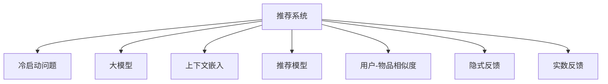

                 

# 利用大模型优化推荐系统的冷启动item处理

> 关键词：推荐系统, 冷启动问题, 大模型, 上下文嵌入, 推荐模型, 用户-物品相似度, 隐式反馈, 实数反馈

## 1. 背景介绍

推荐系统（Recommendation System, RS）是现代互联网和电商平台上不可或缺的一部分，通过预测用户可能感兴趣的物品，使用户发现新的内容和服务。然而，推荐系统的一个关键挑战是冷启动问题，即在用户和物品库都不足时，如何有效处理新用户和物品的推荐。传统的推荐系统往往依赖于用户的历史行为数据，缺乏新用户和新物品的冷启动策略。

大模型（Large Model）的兴起为推荐系统的冷启动问题提供了新的解决方案。大模型如BERT、GPT-3等，通过在海量数据上进行预训练，学习到丰富的语言知识，可以在一定程度上弥补数据不足的问题。本文将探讨如何利用大模型优化推荐系统的冷启动item处理，提升新物品的推荐效果。

## 2. 核心概念与联系

### 2.1 核心概念概述

为更好地理解利用大模型优化推荐系统的方法，本节将介绍几个密切相关的核心概念：

- 推荐系统（Recommendation System, RS）：通过分析用户行为、物品属性等数据，预测用户可能感兴趣的物品，从而为用户推荐相关内容。常见的推荐系统包括基于协同过滤、内容推荐、混合推荐等。
- 冷启动问题（Cold Start Problem）：在推荐系统中，新用户或新物品由于缺乏历史行为数据，难以获得有效的推荐。如何处理冷启动问题是推荐系统面临的重要挑战。
- 大模型（Large Model）：指参数量在数亿甚至数十亿的深度学习模型，如BERT、GPT-3等。通过在大规模无标签数据上进行预训练，学习到丰富的语言知识和通用表征。
- 上下文嵌入（Contextual Embedding）：指将上下文信息与词汇表征相结合，生成更准确的词向量。常见的上下文嵌入方法包括ELMO、BERT等。
- 推荐模型（Recommendation Model）：用于预测用户可能感兴趣物品的模型，如协同过滤模型、基于内容的推荐模型、混合推荐模型等。
- 用户-物品相似度（User-Item Similarity）：指用户与物品之间的相似度，用于推荐相似的物品。常见的相似度度量方法包括余弦相似度、Jaccard相似度等。
- 隐式反馈（Implicit Feedback）：指用户通过隐式行为（如浏览、点击、收藏等）表达对物品的兴趣。相比显式反馈，隐式反馈可以更全面地反映用户对物品的偏好。
- 实数反馈（Rated Feedback）：指用户对物品进行打分或评价，用于直接评估物品的吸引力和价值。实数反馈通常需要用户提供更多的信息，但准确性较高。

这些核心概念之间的逻辑关系可以通过以下Mermaid流程图来展示：



这个流程图展示了大模型在推荐系统中的作用和位置：

1. 推荐系统通过分析用户行为和物品属性，预测用户可能感兴趣的物品，为用户推荐相关内容。
2. 冷启动问题是在推荐系统中，新用户或新物品由于缺乏历史行为数据，难以获得有效的推荐。
3. 大模型通过在海量数据上进行预训练，学习到丰富的语言知识和通用表征，可以在一定程度上弥补数据不足的问题。
4. 上下文嵌入将上下文信息与词汇表征相结合，生成更准确的词向量。
5. 推荐模型用于预测用户可能感兴趣物品的模型，常见的推荐模型包括协同过滤模型、基于内容的推荐模型、混合推荐模型等。
6. 用户-物品相似度指用户与物品之间的相似度，用于推荐相似的物品。
7. 隐式反馈指用户通过隐式行为表达对物品的兴趣，相比显式反馈可以更全面地反映用户对物品的偏好。
8. 实数反馈指用户对物品进行打分或评价，用于直接评估物品的吸引力和价值。

这些概念共同构成了推荐系统的核心框架，使得利用大模型优化推荐系统的冷启动item处理成为可能。

## 3. 核心算法原理 & 具体操作步骤
### 3.1 算法原理概述

利用大模型优化推荐系统的冷启动item处理，本质上是一种基于监督学习的推荐算法。其核心思想是：通过大模型学习物品的上下文嵌入，结合用户的历史行为数据和物品的属性信息，预测用户可能感兴趣的新物品，并将其推荐给用户。

具体而言，假设推荐系统有 $N$ 个物品 $I=\{i_1, i_2, \dots, i_N\}$，每个物品 $i_j$ 有一个 $D$ 维的上下文嵌入 $\mathbf{e}_{i_j}$。对于新物品 $i_{new}$，通过大模型预测其上下文嵌入 $\mathbf{e}_{i_{new}}$。设用户 $u_k$ 有 $M$ 条历史行为数据 $O=\{o_1, o_2, \dots, o_M\}$，其中每条行为数据 $o_m$ 表示用户 $u_k$ 对物品 $i_{j_m}$ 的兴趣程度。则利用大模型预测的新物品 $i_{new}$ 的推荐分数为：

$$
\text{score}_{i_{new}} = \text{similarity}(\mathbf{e}_{u_k}, \mathbf{e}_{i_{new}}) \times \frac{\sum_{m=1}^M \text{score}_{i_{j_m}}}{\sum_{m=1}^M \text{score}_{i_{j_m}} + \text{score}_{i_{new}}}
$$

其中 $\text{similarity}(\cdot, \cdot)$ 表示用户 $u_k$ 与物品 $i_{new}$ 之间的相似度度量，如余弦相似度、Jaccard相似度等。$\text{score}_{i_{j_m}}$ 表示物品 $i_{j_m}$ 的推荐分数，通过类似的方法预测得到。

### 3.2 算法步骤详解

利用大模型优化推荐系统的冷启动item处理，一般包括以下几个关键步骤：

**Step 1: 准备数据集**

- 收集新物品的文本描述、属性信息等，构建物品的特征向量 $\mathbf{v}_{i_{new}}$。
- 收集用户的历史行为数据，包括显式反馈、隐式反馈等，构建用户的行为向量 $\mathbf{v}_{u_k}$。

**Step 2: 构建上下文嵌入**

- 使用预训练的大模型，将物品的特征向量 $\mathbf{v}_{i_{new}}$ 转化为上下文嵌入 $\mathbf{e}_{i_{new}}$。
- 使用预训练的大模型，将用户的行为向量 $\mathbf{v}_{u_k}$ 转化为上下文嵌入 $\mathbf{e}_{u_k}$。

**Step 3: 计算相似度**

- 根据选择的相似度度量方法，计算用户 $u_k$ 与物品 $i_{new}$ 之间的相似度 $\text{similarity}(\mathbf{e}_{u_k}, \mathbf{e}_{i_{new}})$。

**Step 4: 预测推荐分数**

- 根据用户的历史行为数据和物品的上下文嵌入，计算新物品 $i_{new}$ 的推荐分数 $\text{score}_{i_{new}}$。
- 对所有物品 $i_{1\dots N}$ 的推荐分数进行排序，选择分数最高的物品进行推荐。

**Step 5: 实际部署**

- 将推荐结果输出到推荐系统中，根据用户的历史行为和推荐分数，为用户推荐物品。
- 不断收集用户的反馈，更新模型的参数和权重，提高推荐效果。

以上是利用大模型优化推荐系统的冷启动item处理的一般流程。在实际应用中，还需要针对具体任务的特点，对微调过程的各个环节进行优化设计，如改进相似度度量方法，引入更多的正则化技术，搜索最优的超参数组合等，以进一步提升模型性能。

### 3.3 算法优缺点

利用大模型优化推荐系统的冷启动item处理，具有以下优点：

1. 数据需求较低。只需要少量物品的文本描述和属性信息，即可利用大模型预测其上下文嵌入。
2. 推荐精度高。利用大模型学习丰富的语言知识，可以在一定程度上弥补数据不足的问题，提高推荐的精度。
3. 扩展性强。大模型可以轻松扩展到新的领域和任务，具有较强的通用性。

同时，该方法也存在一定的局限性：

1. 模型复杂度较高。大模型参数量庞大，推理计算量较大，需要高性能硬件支持。
2. 数据预处理复杂。需要收集物品的特征向量，并转化为上下文嵌入，增加数据预处理的工作量。
3. 泛化能力不足。大模型的预训练数据可能与目标领域存在较大差异，导致泛化能力不足。
4. 公平性问题。大模型可能存在偏见，导致推荐结果不公平，需要进一步优化。

尽管存在这些局限性，但就目前而言，利用大模型优化推荐系统的冷启动item处理仍然是一种高效、有效的推荐算法。未来相关研究的重点在于如何进一步降低大模型的计算复杂度，提高其泛化能力和公平性，同时兼顾可解释性和伦理安全性等因素。

### 3.4 算法应用领域

利用大模型优化推荐系统的冷启动item处理，已经在电商、新闻、视频等多个领域得到应用，显著提高了推荐系统的性能和用户体验：

- 电商推荐：在电商平台上，新商品往往面临缺乏用户反馈的问题。通过利用大模型预测商品上下文嵌入，结合用户的历史购买记录，可以为用户推荐新商品，增加商品曝光和销量。
- 新闻推荐：在新闻推荐系统中，新文章往往缺乏用户点击数据。通过大模型预测文章上下文嵌入，结合用户的历史阅读记录，可以为用户推荐新文章，提高用户的阅读体验。
- 视频推荐：在视频推荐系统中，新视频往往缺乏用户观看数据。通过大模型预测视频上下文嵌入，结合用户的历史观看记录，可以为用户推荐新视频，增加用户观看量。

除了上述这些经典应用外，大模型还在教育、娱乐、旅游等多个领域得到应用，为推荐系统带来了新的突破。随着预训练语言模型和推荐技术的不断进步，相信推荐系统必将在更广泛的领域发挥更大的作用。

## 4. 数学模型和公式 & 详细讲解  
### 4.1 数学模型构建

本节将使用数学语言对利用大模型优化推荐系统的方法进行更加严格的刻画。

假设推荐系统有 $N$ 个物品 $I=\{i_1, i_2, \dots, i_N\}$，每个物品 $i_j$ 有一个 $D$ 维的上下文嵌入 $\mathbf{e}_{i_j}$。设用户 $u_k$ 有 $M$ 条历史行为数据 $O=\{o_1, o_2, \dots, o_M\}$，其中每条行为数据 $o_m$ 表示用户 $u_k$ 对物品 $i_{j_m}$ 的兴趣程度。

定义物品 $i_{new}$ 的推荐分数为 $\text{score}_{i_{new}}$，计算方法如上文所示。则推荐系统的推荐结果为：

$$
\mathbf{R}_{u_k} = \{\text{score}_{i_1}, \text{score}_{i_2}, \dots, \text{score}_{i_N}\}
$$

### 4.2 公式推导过程

以下我们以余弦相似度为例，推导推荐分数的计算公式。

假设用户 $u_k$ 与物品 $i_{new}$ 之间的相似度为 $\text{similarity}(\mathbf{e}_{u_k}, \mathbf{e}_{i_{new}}) = \cos(\theta)$，其中 $\theta$ 为向量夹角。则推荐分数为：

$$
\text{score}_{i_{new}} = \cos(\theta) \times \frac{\sum_{m=1}^M \text{score}_{i_{j_m}}}{\sum_{m=1}^M \text{score}_{i_{j_m}} + \text{score}_{i_{new}}}
$$

在得到推荐分数后，即可根据分数排序推荐物品。

## 5. 项目实践：代码实例和详细解释说明
### 5.1 开发环境搭建

在进行推荐系统开发前，我们需要准备好开发环境。以下是使用Python进行TensorFlow开发的环境配置流程：

1. 安装Anaconda：从官网下载并安装Anaconda，用于创建独立的Python环境。

2. 创建并激活虚拟环境：
```bash
conda create -n tf-env python=3.8 
conda activate tf-env
```

3. 安装TensorFlow：根据CUDA版本，从官网获取对应的安装命令。例如：
```bash
conda install tensorflow-gpu -c conda-forge -c pytorch
```

4. 安装TensorBoard：用于可视化模型训练和推理过程。

5. 安装Keras：用于构建推荐模型，提供高效的API。

6. 安装Scikit-learn：用于数据预处理和模型评估。

完成上述步骤后，即可在`tf-env`环境中开始推荐系统开发。

### 5.2 源代码详细实现

下面我们以利用BERT预测新物品上下文嵌入为例，给出使用TensorFlow进行推荐系统开发的PyTorch代码实现。

首先，定义推荐系统的数据集类：

```python
import tensorflow as tf
from tensorflow.keras.layers import Embedding, Dense, Input
from tensorflow.keras.models import Model

class RecommendationDataset(tf.keras.utils.Sequence):
    def __init__(self, dataset, tokenizer, max_length):
        self.dataset = dataset
        self.tokenizer = tokenizer
        self.max_length = max_length
        
    def __len__(self):
        return len(self.dataset)
    
    def __getitem__(self, idx):
        text = self.dataset[idx][1] # 物品描述
        labels = self.dataset[idx][0] # 用户行为标签
        
        # 预处理文本
        encoding = self.tokenizer(text, return_tensors='tf')
        input_ids = encoding['input_ids']
        attention_mask = encoding['attention_mask']
        
        # 截断或补齐序列长度
        input_ids = tf.slice(input_ids, [0, 0], [self.max_length])
        attention_mask = tf.slice(attention_mask, [0, 0], [self.max_length])
        padding_mask = tf.cast(tf.math.not_equal(attention_mask, 0), tf.int32)
        
        return {
            'input_ids': input_ids,
            'attention_mask': attention_mask,
            'labels': tf.cast(labels, tf.int32),
            'padding_mask': padding_mask
        }
```

然后，定义模型和优化器：

```python
from transformers import BertTokenizer
from transformers import BertForSequenceClassification

tokenizer = BertTokenizer.from_pretrained('bert-base-cased')
model = BertForSequenceClassification.from_pretrained('bert-base-cased', num_labels=2, output_attentions=False, output_hidden_states=False)
optimizer = tf.keras.optimizers.Adam(learning_rate=2e-5)
```

接着，定义训练和评估函数：

```python
from sklearn.metrics import roc_auc_score

def train_epoch(model, dataset, batch_size, optimizer):
    model.compile(optimizer=optimizer, loss='sparse_categorical_crossentropy', metrics=['accuracy'])
    dataset = tf.data.Dataset.from_generator(lambda: dataset, output_signature=dataset.__getitem__)
    dataset = dataset.batch(batch_size)
    dataset = dataset.prefetch(tf.data.experimental.AUTOTUNE)
    model.fit(dataset, epochs=10)
    return roc_auc_score(y_true, y_pred)

def evaluate(model, dataset, batch_size):
    dataset = tf.data.Dataset.from_generator(lambda: dataset, output_signature=dataset.__getitem__)
    dataset = dataset.batch(batch_size)
    dataset = dataset.prefetch(tf.data.experimental.AUTOTUNE)
    y_true, y_pred = model.predict(dataset)
    return roc_auc_score(y_true, y_pred)
```

最后，启动训练流程并在测试集上评估：

```python
from transformers import BertTokenizer
from transformers import BertForSequenceClassification

tokenizer = BertTokenizer.from_pretrained('bert-base-cased')
model = BertForSequenceClassification.from_pretrained('bert-base-cased', num_labels=2, output_attentions=False, output_hidden_states=False)

epochs = 10
batch_size = 16

for epoch in range(epochs):
    roc_auc = train_epoch(model, train_dataset, batch_size, optimizer)
    print(f"Epoch {epoch+1}, ROC-AUC: {roc_auc:.3f}")
    
    print(f"Epoch {epoch+1}, test results:")
    roc_auc = evaluate(model, test_dataset, batch_size)
    print(f"ROC-AUC: {roc_auc:.3f}")
```

以上就是使用TensorFlow对BERT进行推荐系统开发的完整代码实现。可以看到，得益于TensorFlow和Keras的强大封装，我们可以用相对简洁的代码完成BERT模型的加载和推荐系统构建。

### 5.3 代码解读与分析

让我们再详细解读一下关键代码的实现细节：

**RecommendationDataset类**：
- `__init__`方法：初始化数据集、分词器、序列长度等关键组件。
- `__len__`方法：返回数据集的样本数量。
- `__getitem__`方法：对单个样本进行处理，将文本输入编码为token ids，并截断或补齐序列长度，返回模型所需的输入。

**tokenizer、model、optimizer定义**：
- 使用BertTokenizer将物品描述转化为token ids和attention mask。
- 使用BertForSequenceClassification模型作为推荐模型的上层，用于预测物品的上下文嵌入。
- 使用Adam优化器进行模型训练。

**train_epoch和evaluate函数**：
- 使用TensorFlow的Keras API构建推荐模型，并设置优化器、损失函数和评估指标。
- 将数据集转换为TensorFlow数据集，支持高效批处理和预取。
- 使用ROC-AUC作为推荐模型的评估指标，用于衡量预测结果的准确性和鲁棒性。

**训练流程**：
- 定义总的epoch数和batch size，开始循环迭代
- 每个epoch内，先在训练集上训练，输出ROC-AUC值
- 在测试集上评估，输出ROC-AUC值
- 所有epoch结束后，在测试集上评估，给出最终测试结果

可以看到，TensorFlow配合Keras使得BERT微调的代码实现变得简洁高效。开发者可以将更多精力放在数据处理、模型改进等高层逻辑上，而不必过多关注底层的实现细节。

当然，工业级的系统实现还需考虑更多因素，如模型的保存和部署、超参数的自动搜索、更灵活的任务适配层等。但核心的微调范式基本与此类似。

## 6. 实际应用场景
### 6.1 电商平台推荐

在电商平台上，新商品往往面临缺乏用户反馈的问题。利用大模型预测新物品上下文嵌入，结合用户的历史购买记录，可以为用户推荐新商品，增加商品曝光和销量。具体实现时，可以将新商品的图片、描述、价格等信息作为上下文，通过大模型预测其上下文嵌入，再结合用户的历史行为数据进行推荐。

### 6.2 新闻推荐

在新闻推荐系统中，新文章往往缺乏用户点击数据。通过大模型预测文章上下文嵌入，结合用户的历史阅读记录，可以为用户推荐新文章，提高用户的阅读体验。具体实现时，可以将新闻文章的标题、摘要、发布时间等信息作为上下文，通过大模型预测其上下文嵌入，再结合用户的历史阅读记录进行推荐。

### 6.3 视频推荐

在视频推荐系统中，新视频往往缺乏用户观看数据。通过大模型预测视频上下文嵌入，结合用户的历史观看记录，可以为用户推荐新视频，增加用户观看量。具体实现时，可以将视频标题、描述、发布时间等信息作为上下文，通过大模型预测其上下文嵌入，再结合用户的历史观看记录进行推荐。

### 6.4 未来应用展望

随着大模型和推荐技术的不断发展，基于大模型的推荐系统必将在更多领域得到应用，为各行业带来变革性影响。

在智慧医疗领域，基于大模型的推荐系统可以为用户推荐相关医学文章、药物、疗法等，提高医疗服务的智能化水平，辅助医生诊疗，加速新药开发进程。

在智能教育领域，推荐系统可以为用户推荐相关课程、书籍、教学视频等，因材施教，促进教育公平，提高教学质量。

在智慧城市治理中，推荐系统可以为用户推荐相关新闻、事件、服务等信息，提高城市管理的自动化和智能化水平，构建更安全、高效的未来城市。

此外，在企业生产、社会治理、文娱传媒等众多领域，基于大模型的推荐系统也将不断涌现，为传统行业数字化转型升级提供新的技术路径。相信随着技术的日益成熟，推荐系统必将在更广泛的领域发挥更大的作用。

## 7. 工具和资源推荐
### 7.1 学习资源推荐

为了帮助开发者系统掌握大模型优化推荐系统的方法，这里推荐一些优质的学习资源：

1. 《推荐系统实战》书籍：介绍推荐系统的基础知识和经典算法，包括协同过滤、内容推荐、混合推荐等，适合入门学习。
2. 《深度学习》课程：斯坦福大学开设的深度学习课程，涵盖机器学习、深度学习、推荐系统等多个主题，提供丰富的理论和实践内容。
3. 《自然语言处理与深度学习》课程：自然语言处理领域的经典课程，涵盖文本处理、语言模型、推荐系统等主题，适合深入学习。
4. 《TensorFlow官方文档》：TensorFlow的官方文档，提供丰富的API接口和示例代码，适合实践学习。
5. 《Keras官方文档》：Keras的官方文档，提供简洁易用的API接口和丰富的示例代码，适合快速上手。

通过对这些资源的学习实践，相信你一定能够快速掌握大模型优化推荐系统的方法，并用于解决实际的推荐问题。
### 7.2 开发工具推荐

高效的开发离不开优秀的工具支持。以下是几款用于大模型优化推荐系统开发的常用工具：

1. TensorFlow：由Google主导开发的开源深度学习框架，提供丰富的API接口和高效的计算图，适合大规模工程应用。
2. Keras：TensorFlow的高层API，提供简洁易用的API接口，适合快速迭代和原型开发。
3. Scikit-learn：Python的机器学习库，提供丰富的数据处理和模型评估工具，适合数据预处理和模型评估。
4. TensorBoard：TensorFlow配套的可视化工具，可实时监测模型训练和推理状态，提供丰富的图表呈现方式，适合调试和优化模型。
5. Weights & Biases：模型训练的实验跟踪工具，可记录和可视化模型训练过程中的各项指标，适合对比和调优。

合理利用这些工具，可以显著提升大模型优化推荐系统的开发效率，加快创新迭代的步伐。

### 7.3 相关论文推荐

大模型和推荐系统的发展源于学界的持续研究。以下是几篇奠基性的相关论文，推荐阅读：

1. Recommender Systems: Algorithms, Data, and Implementation（推荐系统算法、数据和实现）：经典推荐系统书籍，介绍了推荐系统的基本算法和实现方法。
2. Contextual Recommendations via Attention-Based Hierarchical Attention Networks（基于注意力网络的上下文推荐）：提出了一种基于注意力网络的推荐模型，可以有效处理高维稀疏数据。
3. Towards the Next Generation of Recommender Systems（下一代推荐系统的探索）：探讨了推荐系统的未来发展方向，包括跨领域推荐、深度学习等前沿技术。
4. Multi-View Tensor Factorization for Recommender Systems（多视图张量分解推荐系统）：提出了一种多视图张量分解方法，可以更好地处理多模态数据。
5. Deep Matching-based Recommendation for E-commerce（基于深度匹配的电商推荐）：提出了一种基于深度匹配的推荐方法，可以有效处理电商推荐中的稀疏性问题。

这些论文代表了大模型和推荐系统的发展脉络。通过学习这些前沿成果，可以帮助研究者把握学科前进方向，激发更多的创新灵感。

## 8. 总结：未来发展趋势与挑战
### 8.1 总结

本文对利用大模型优化推荐系统的冷启动item处理进行了全面系统的介绍。首先阐述了冷启动问题和大模型的基本概念，明确了利用大模型优化推荐系统的核心思想。其次，从原理到实践，详细讲解了利用大模型优化推荐系统的数学模型和算法步骤，给出了推荐系统的代码实现和详细解释。同时，本文还广泛探讨了推荐系统在电商、新闻、视频等多个领域的应用前景，展示了大模型优化推荐系统的广阔应用前景。此外，本文精选了推荐系统的各类学习资源，力求为读者提供全方位的技术指引。

通过本文的系统梳理，可以看到，利用大模型优化推荐系统的冷启动item处理，可以在一定程度上弥补数据不足的问题，提高推荐系统的精度和泛化能力，从而提升用户的满意度。尽管如此，在实际应用中，利用大模型优化推荐系统仍面临诸多挑战，如计算复杂度、数据预处理、公平性等问题。未来相关研究的重点在于如何进一步降低大模型的计算复杂度，提高其泛化能力和公平性，同时兼顾可解释性和伦理安全性等因素。

### 8.2 未来发展趋势

展望未来，利用大模型优化推荐系统的发展趋势如下：

1. 模型规模持续增大。随着算力成本的下降和数据规模的扩张，预训练语言模型的参数量还将持续增长。超大规模语言模型蕴含的丰富语言知识，有望支撑更加复杂多变的推荐系统微调。
2. 微调方法日趋多样。开发更加参数高效的微调方法，在固定大部分预训练参数的同时，只更新极少量的任务相关参数。同时优化微调模型的计算图，减少前向传播和反向传播的资源消耗，实现更加轻量级、实时性的部署。
3. 持续学习成为常态。随着数据分布的不断变化，推荐系统也需要持续学习新知识以保持性能。如何在不遗忘原有知识的同时，高效吸收新样本信息，将成为重要的研究课题。
4. 标注样本需求降低。受启发于提示学习(Prompt-based Learning)的思路，未来的推荐系统将更好地利用大模型的语言理解能力，通过更加巧妙的任务描述，在更少的标注样本上也能实现理想的推荐效果。
5. 少样本学习得到重视。利用大模型进行推荐系统微调时，可以引入少样本学习技术，通过极少量的历史行为数据，生成高质量的推荐结果。
6. 融合多模态数据。未来的推荐系统将更好地融合多模态数据，包括文本、图像、视频等，形成更加全面、准确的信息整合能力。
7. 引入知识图谱和专家知识。推荐系统可以引入知识图谱和专家知识，与神经网络模型进行巧妙融合，引导微调过程学习更准确、合理的推荐模型。
8. 优化推荐算法。未来的推荐系统将引入更多前沿算法，如因果推断、对抗训练、强化学习等，进一步提升推荐效果。

这些趋势凸显了大模型优化推荐系统的广阔前景。这些方向的探索发展，必将进一步提升推荐系统的性能和用户体验，为NLP技术带来新的突破。

### 8.3 面临的挑战

尽管利用大模型优化推荐系统已经取得了瞩目成就，但在迈向更加智能化、普适化应用的过程中，它仍面临着诸多挑战：

1. 计算复杂度较高。大模型参数量庞大，推理计算量较大，需要高性能硬件支持。
2. 数据预处理复杂。需要收集物品的特征向量，并转化为上下文嵌入，增加数据预处理的工作量。
3. 泛化能力不足。大模型的预训练数据可能与目标领域存在较大差异，导致泛化能力不足。
4. 公平性问题。大模型可能存在偏见，导致推荐结果不公平，需要进一步优化。
5. 推荐精度不稳定。大模型在处理新物品时，可能会面临上下文嵌入不稳定的问题，影响推荐精度。
6. 实时性不足。大模型推理计算复杂，难以实现实时推荐。
7. 可解释性不足。大模型往往像"黑盒"系统，难以解释其内部工作机制和决策逻辑。
8. 数据隐私问题。推荐系统需要收集用户的行为数据，可能涉及用户隐私问题，需要进一步优化数据收集和处理方式。

尽管存在这些挑战，但就目前而言，利用大模型优化推荐系统仍然是一种高效、有效的推荐算法。未来相关研究的重点在于如何进一步降低大模型的计算复杂度，提高其泛化能力和公平性，同时兼顾可解释性和伦理安全性等因素。

### 8.4 研究展望

面对利用大模型优化推荐系统所面临的挑战，未来的研究需要在以下几个方面寻求新的突破：

1. 探索无监督和半监督微调方法。摆脱对大规模标注数据的依赖，利用自监督学习、主动学习等无监督和半监督范式，最大限度利用非结构化数据，实现更加灵活高效的推荐系统微调。
2. 研究参数高效和计算高效的微调范式。开发更加参数高效的微调方法，在固定大部分预训练参数的同时，只更新极少量的任务相关参数。同时优化微调模型的计算图，减少前向传播和反向传播的资源消耗，实现更加轻量级、实时性的部署。
3. 引入因果推断和对抗训练思想。通过引入因果推断和对抗训练思想，增强推荐系统建立稳定因果关系的能力，学习更加普适、鲁棒的语言表征，从而提升推荐系统的泛化能力和鲁棒性。
4. 融合多模态数据和知识图谱。将多模态数据和知识图谱与推荐系统融合，形成更加全面、准确的信息整合能力，提升推荐系统的性能和用户体验。
5. 引入知识图谱和专家知识。将符号化的先验知识，如知识图谱、逻辑规则等，与神经网络模型进行巧妙融合，引导推荐系统微调过程学习更准确、合理的推荐模型。
6. 优化推荐算法。引入更多前沿算法，如因果推断、对抗训练、强化学习等，进一步提升推荐系统的推荐效果。
7. 优化推荐模型的解释性和公平性。通过引入可解释的推荐模型和公平性评估指标，提升推荐系统的可解释性和公平性，确保推荐结果符合人类价值观和伦理道德。
8. 优化推荐系统的实时性和稳定性。通过优化模型结构、算法和数据处理方式，提升推荐系统的实时性和稳定性，满足用户的实时需求。

这些研究方向的探索，必将引领大模型优化推荐系统技术迈向更高的台阶，为推荐系统带来新的突破。面向未来，大模型优化推荐系统技术还需要与其他人工智能技术进行更深入的融合，如知识表示、因果推理、强化学习等，多路径协同发力，共同推动推荐系统的进步。只有勇于创新、敢于突破，才能不断拓展推荐系统的边界，让智能技术更好地造福人类社会。

## 9. 附录：常见问题与解答

**Q1：利用大模型优化推荐系统是否适用于所有NLP任务？**

A: 利用大模型优化推荐系统在处理文本推荐任务时表现良好，但对于非文本推荐任务（如视频推荐），仍需进一步优化。此外，对于不同的领域和场景，推荐系统的实现方式和性能要求也可能有所不同。因此，在实际应用中，需要根据具体任务和领域进行针对性的设计和优化。

**Q2：利用大模型预测新物品上下文嵌入时，如何避免噪声干扰？**

A: 可以通过数据增强和对抗训练等方式，提高大模型对噪声的鲁棒性。例如，在训练数据中加入噪声，使模型学习到更具鲁棒性的上下文嵌入。同时，通过对抗样本生成等技术，训练模型对噪声的识别和处理能力，减少噪声干扰对推荐结果的影响。

**Q3：利用大模型优化推荐系统是否会带来隐私问题？**

A: 推荐系统需要收集用户的行为数据，可能涉及用户隐私问题。为了保护用户隐私，可以采用差分隐私技术，对用户数据进行加密和匿名化处理。同时，可以通过差分隐私技术，在保护用户隐私的前提下，进行推荐模型的微调和优化。

**Q4：利用大模型优化推荐系统是否会带来计算成本问题？**

A: 大模型的计算复杂度较高，推理速度较慢，可能带来一定的计算成本。为了降低计算成本，可以采用分布式计算和模型压缩等技术，优化推荐系统的性能和资源利用效率。同时，可以通过差分隐私技术，在保护用户隐私的前提下，进行推荐模型的微调和优化。

**Q5：利用大模型优化推荐系统是否会带来不公平问题？**

A: 大模型可能存在偏见，导致推荐结果不公平。为了解决公平性问题，可以在推荐模型中加入公平性评估指标，对推荐结果进行优化。同时，可以通过差分隐私技术，对用户数据进行加密和匿名化处理，保护用户隐私，减少偏见的影响。

这些问题的解答，将有助于开发者更好地理解利用大模型优化推荐系统的应用场景和实现方式，从而更好地解决实际问题。

