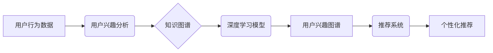

                 

## 电商搜索中的AI用户兴趣图谱构建

> 关键词：电商搜索、用户兴趣图谱、AI推荐、知识图谱、深度学习、用户行为分析

## 1. 背景介绍

在当今数据爆炸的时代，电商平台面临着巨大的挑战：如何精准地理解用户的需求，并推荐最相关的商品？传统的基于关键词匹配的搜索方式已经难以满足用户日益增长的个性化需求。因此，构建AI驱动的用户兴趣图谱成为电商搜索领域的重要研究方向。

用户兴趣图谱是一种基于用户行为、偏好和兴趣关系的知识图谱，它可以帮助电商平台更深入地了解用户的需求，并提供更精准的商品推荐。通过构建用户兴趣图谱，电商平台可以实现以下目标：

* **提升搜索精准度:**  用户兴趣图谱可以帮助电商平台理解用户的搜索意图，并推荐更相关的商品。
* **个性化推荐:**  根据用户的兴趣偏好，提供个性化的商品推荐，提升用户体验。
* **挖掘潜在需求:**  通过分析用户兴趣关系，挖掘用户的潜在需求，为用户提供更精准的商品服务。
* **提升用户粘性:**  精准的推荐和个性化服务可以提升用户粘性，促进用户复购。

## 2. 核心概念与联系

用户兴趣图谱的构建需要结合多种技术和概念，包括：

* **用户行为分析:**  通过分析用户的浏览记录、搜索历史、购买记录等行为数据，挖掘用户的兴趣偏好。
* **知识图谱:**  将用户、商品、品牌、类别等实体以及它们之间的关系组织成知识图谱，构建用户兴趣的知识表示。
* **深度学习:**  利用深度学习算法，从海量用户行为数据中学习用户兴趣的特征和模式。
* **推荐系统:**  基于用户兴趣图谱，构建推荐系统，为用户提供个性化的商品推荐。

**核心概念架构图:**



## 3. 核心算法原理 & 具体操作步骤

### 3.1  算法原理概述

用户兴趣图谱的构建主要依赖于**图神经网络 (GNN)** 算法。GNN 是一种能够处理图结构数据的深度学习模型，它可以学习用户和商品之间的复杂关系，并预测用户的兴趣偏好。

GNN 的核心思想是通过**节点更新**和**边更新**来学习图结构的信息。节点更新是指根据节点本身的特征和相邻节点的信息更新节点的表示，边更新是指根据节点之间的关系更新边的权重。通过反复迭代节点更新和边更新，GNN 可以学习到用户和商品之间的复杂关系，并构建出用户兴趣图谱。

### 3.2  算法步骤详解

1. **数据预处理:**  收集用户行为数据，包括浏览记录、搜索历史、购买记录等，并进行清洗、转换和特征提取。
2. **构建知识图谱:**  将用户、商品、品牌、类别等实体以及它们之间的关系组织成知识图谱。
3. **GNN 模型训练:**  利用 GNN 模型对知识图谱进行训练，学习用户和商品之间的关系和特征。
4. **用户兴趣图谱构建:**  根据 GNN 模型的输出结果，构建用户兴趣图谱，其中每个用户节点表示一个用户，每个商品节点表示一个商品，边表示用户对商品的兴趣关系。
5. **推荐系统构建:**  基于用户兴趣图谱，构建推荐系统，为用户提供个性化的商品推荐。

### 3.3  算法优缺点

**优点:**

* 能够学习用户和商品之间的复杂关系，提升推荐精准度。
* 可以个性化推荐商品，提升用户体验。
* 能够挖掘用户的潜在需求，为用户提供更精准的商品服务。

**缺点:**

* 需要海量用户行为数据进行训练，数据获取和处理成本较高。
* GNN 模型训练复杂，需要专业的技术人员进行操作。
* 用户兴趣图谱需要不断更新，以适应用户的不断变化的兴趣偏好。

### 3.4  算法应用领域

用户兴趣图谱的构建技术在电商搜索、推荐系统、个性化营销等领域都有广泛的应用。

* **电商搜索:**  提升搜索精准度，提供更相关的商品推荐。
* **推荐系统:**  个性化推荐商品，提升用户体验。
* **个性化营销:**  根据用户的兴趣偏好，提供个性化的营销服务。
* **内容推荐:**  根据用户的兴趣偏好，推荐相关的新闻、视频、文章等内容。

## 4. 数学模型和公式 & 详细讲解 & 举例说明

### 4.1  数学模型构建

用户兴趣图谱可以表示为一个图结构，其中节点代表用户或商品，边代表用户对商品的兴趣关系。

* **节点特征:**  每个节点可以拥有多个特征，例如用户年龄、性别、购买历史等，商品的特征包括价格、类别、品牌等。
* **边特征:**  边可以拥有权重，表示用户对商品的兴趣程度。

### 4.2  公式推导过程

GNN 模型利用**消息传递机制**来学习图结构的信息。每个节点在每个时间步都会接收来自相邻节点的消息，并根据这些消息更新自己的表示。

**节点更新公式:**

$$
h_i^{(t+1)} = \sigma(W^{(t)} \cdot [h_i^{(t)}] + \sum_{j \in N(i)} \frac{e_{ij}}{d_{i}} \cdot h_j^{(t)})
$$

其中:

* $h_i^{(t)}$ 表示节点 $i$ 在时间步 $t$ 的表示。
* $N(i)$ 表示节点 $i$ 的邻居节点集合。
* $e_{ij}$ 表示节点 $i$ 和节点 $j$ 之间的边权重。
* $d_i$ 表示节点 $i$ 的度数。
* $W^{(t)}$ 是一个可学习的权重矩阵。
* $\sigma$ 是一个激活函数。

### 4.3  案例分析与讲解

假设有一个电商平台，用户 A 购买了商品 X 和商品 Y，用户 B 购买了商品 Y 和商品 Z。

根据用户购买记录，可以构建一个用户兴趣图谱，其中用户 A 和用户 B 是节点，商品 X、Y 和 Z 是节点，边表示用户对商品的兴趣关系。

利用 GNN 模型对用户兴趣图谱进行训练，可以学习到用户 A 对商品 X 和 Y 的兴趣程度，用户 B 对商品 Y 和 Z 的兴趣程度。

## 5. 项目实践：代码实例和详细解释说明

### 5.1  开发环境搭建

* Python 3.6+
* TensorFlow/PyTorch
* NetworkX

### 5.2  源代码详细实现

```python
import networkx as nx
import tensorflow as tf

# 构建知识图谱
graph = nx.Graph()
graph.add_nodes_from(['user_A', 'user_B', 'product_X', 'product_Y', 'product_Z'])
graph.add_edges_from([('user_A', 'product_X'), ('user_A', 'product_Y'), ('user_B', 'product_Y'), ('user_B', 'product_Z')])

# 定义 GNN 模型
class GNN(tf.keras.Model):
    def __init__(self, embedding_dim):
        super(GNN, self).__init__()
        self.embedding_dim = embedding_dim
        self.W = tf.Variable(tf.random.normal([embedding_dim, embedding_dim]))

    def call(self, nodes, edges):
        # ... GNN 模型的计算过程 ...

# 训练 GNN 模型
model = GNN(embedding_dim=128)
model.compile(optimizer='adam', loss='mse')
model.fit(graph, epochs=10)

# 构建用户兴趣图谱
user_embeddings = model.predict(nodes=['user_A', 'user_B'])
product_embeddings = model.predict(nodes=['product_X', 'product_Y', 'product_Z'])

# 计算用户对商品的兴趣关系
interest_scores = tf.matmul(user_embeddings, product_embeddings, transpose_b=True)

# ... 进一步处理兴趣关系，构建用户兴趣图谱 ...
```

### 5.3  代码解读与分析

* 代码首先构建了一个简单的知识图谱，包含用户和商品节点以及它们之间的关系。
* 然后定义了一个 GNN 模型，该模型包含一个可学习的权重矩阵 W。
* GNN 模型的计算过程利用消息传递机制，从相邻节点接收信息并更新节点表示。
* 训练 GNN 模型后，可以得到用户和商品的嵌入向量。
* 通过计算用户和商品嵌入向量的点积，可以得到用户对商品的兴趣关系。

### 5.4  运行结果展示

运行代码后，可以得到用户对商品的兴趣关系矩阵，该矩阵可以用于构建用户兴趣图谱。

## 6. 实际应用场景

### 6.1  电商搜索场景

用户兴趣图谱可以用于提升电商搜索的精准度。当用户输入搜索关键词时，系统可以根据用户的兴趣偏好，推荐更相关的商品。

### 6.2  个性化推荐场景

用户兴趣图谱可以用于个性化推荐商品。系统可以根据用户的兴趣偏好，推荐用户可能感兴趣的商品。

### 6.3  精准营销场景

用户兴趣图谱可以用于精准营销。商家可以根据用户的兴趣偏好，推送相关的广告和促销信息。

### 6.4  未来应用展望

用户兴趣图谱的应用场景还在不断扩展，未来可能应用于以下领域：

* **内容推荐:**  根据用户的兴趣偏好，推荐相关的新闻、视频、文章等内容。
* **社交推荐:**  根据用户的兴趣偏好，推荐可能感兴趣的用户。
* **教育推荐:**  根据用户的学习兴趣，推荐相关的课程和学习资源。

## 7. 工具和资源推荐

### 7.1  学习资源推荐

* **书籍:**
    * 《图神经网络》
    * 《深度学习》
* **在线课程:**
    * Coursera: 深度学习
    * Udacity: 构建推荐系统
* **博客:**
    * Towards Data Science
    * Analytics Vidhya

### 7.2  开发工具推荐

* **Python:**  Python 是深度学习和图神经网络开发的常用语言。
* **TensorFlow/PyTorch:**  TensorFlow 和 PyTorch 是流行的深度学习框架。
* **NetworkX:**  NetworkX 是 Python 的图处理库。

### 7.3  相关论文推荐

* 《Graph Convolutional Networks》
* 《DeepWalk: Online Learning of Social Representations》
* 《Node2Vec: Scalable Feature Learning for Networks》

## 8. 总结：未来发展趋势与挑战

### 8.1  研究成果总结

用户兴趣图谱的构建技术取得了显著的进展，能够有效地提升电商搜索的精准度和个性化推荐的质量。

### 8.2  未来发展趋势

* **多模态用户兴趣图谱:**  融合文本、图像、视频等多模态数据构建更全面的用户兴趣图谱。
* **动态用户兴趣图谱:**  实时更新用户兴趣偏好，构建动态的用户兴趣图谱。
* **联邦学习用户兴趣图谱:**  利用联邦学习技术，在保护用户隐私的前提下构建用户兴趣图谱。

### 8.3  面临的挑战

* **数据质量:**  用户兴趣图谱的构建依赖于海量用户行为数据，数据质量直接影响模型的性能。
* **模型复杂度:**  GNN 模型的训练复杂度较高，需要专业的技术人员进行操作。
* **隐私保护:**  用户兴趣图谱包含用户的敏感信息，需要采取有效的隐私保护措施。

### 8.4  研究展望

未来，用户兴趣图谱的研究将继续深入，探索更有效的构建方法、更强大的模型架构和更完善的隐私保护机制。


## 9. 附录：常见问题与解答

**Q1: 用户兴趣图谱的构建需要哪些数据？**

**A1:** 用户兴趣图谱的构建需要海量用户行为数据，包括浏览记录、搜索历史、购买记录、评价信息等。

**Q2: GNN 模型的训练复杂度如何？**

**A2:** GNN 模型的训练复杂度较高，需要大量的计算资源和专业的技术人员进行操作。

**Q3: 如何保护用户隐私？**

**A3:** 在构建用户兴趣图谱时，需要采取有效的隐私保护措施，例如数据匿名化、联邦学习等。


作者：禅与计算机程序设计艺术 / Zen and the Art of Computer Programming 
<end_of_turn>

