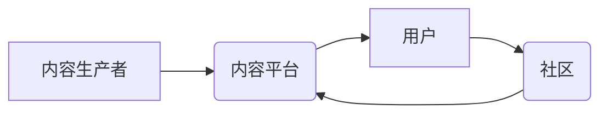

                 

## 知识付费创业中的内容生态系统构建

> 关键词：知识付费、内容生态系统、内容运营、用户增长、社区建设、数据驱动、技术架构

### 1. 背景介绍

知识付费行业近年来发展迅速，从线上课程、付费文章到直播带货等多种形式蓬勃发展。 然而，单纯依靠优质内容难以获得长久发展，构建一个完善的内容生态系统至关重要。内容生态系统是指围绕知识付费内容，形成一个包含内容生产、内容分发、用户互动、社区运营等多环节的闭环系统，通过协同作用，实现内容价值最大化。

### 2. 核心概念与联系

**2.1 内容生态系统架构**

内容生态系统是一个复杂而动态的系统，其核心在于内容的生产、传播、消费和反馈的循环。



**2.2 核心概念原理**

* **内容生产者:** 包括专家学者、行业从业者、创作者等，他们负责创作优质的知识付费内容。
* **内容平台:** 提供内容发布、分发、交易等服务，连接内容生产者和用户。
* **用户:** 购买和消费知识付费内容，并参与互动和反馈。
* **社区:** 为用户提供交流学习、分享经验的平台，促进内容传播和用户粘性。

**2.3 联系分析**

内容生态系统各环节相互关联，形成一个良性循环。内容生产者通过平台发布内容，吸引用户购买和消费。用户在消费过程中产生反馈，为内容生产者提供改进方向。社区为用户提供交流学习的平台，促进内容传播和用户粘性。平台通过数据分析，优化内容推荐和用户运营，提升用户体验和平台活跃度。

### 3. 核心算法原理 & 具体操作步骤

**3.1 算法原理概述**

内容推荐算法是内容生态系统中至关重要的环节，其目的是根据用户的兴趣和行为，推荐他们可能感兴趣的内容。常见的推荐算法包括：

* **基于协同过滤:** 根据用户的历史行为和相似用户对内容的评价，推荐相关内容。
* **基于内容的推荐:** 根据内容的主题、标签、关键词等特征，推荐与用户兴趣相符的内容。
* **混合推荐:** 结合协同过滤和内容过滤，提高推荐效果。

**3.2 算法步骤详解**

以基于协同过滤的推荐算法为例，其具体步骤如下：

1. **数据收集:** 收集用户对内容的评分、浏览记录、购买记录等行为数据。
2. **用户相似度计算:** 使用余弦相似度等算法计算用户之间的相似度。
3. **推荐内容生成:** 根据用户与其他相似用户的评分记录，预测用户对未评分内容的评分，并推荐评分较高的内容。

**3.3 算法优缺点**

* **优点:** 能够推荐用户可能未曾接触过的，但与其兴趣相符的内容。
* **缺点:** 需要大量的用户行为数据，且容易出现冷启动问题，即对于新用户或新内容难以进行推荐。

**3.4 算法应用领域**

内容推荐算法广泛应用于电商平台、视频网站、音乐平台等，帮助平台推荐相关商品、视频、音乐等，提升用户体验和转化率。

### 4. 数学模型和公式 & 详细讲解 & 举例说明

**4.1 数学模型构建**

基于协同过滤的推荐算法可以构建如下数学模型：

$$
r_{ui} = \frac{\sum_{j=1}^{N} s_{uj} \cdot r_{uj}}{\sum_{j=1}^{N} s_{uj}^2}
$$

其中：

* $r_{ui}$: 用户 $u$ 对物品 $i$ 的评分预测值。
* $r_{uj}$: 用户 $u$ 对物品 $j$ 的真实评分。
* $s_{uj}$: 用户 $u$ 与用户 $v$ 的相似度。
* $N$: 用户 $u$ 与其他用户之间的相似度数量。

**4.2 公式推导过程**

该公式基于以下假设：

* 用户对物品的评分具有某种规律性。
* 用户之间的评分偏好存在相似性。

公式通过计算用户 $u$ 与其他相似用户的评分平均值，并根据相似度进行加权，预测用户 $u$ 对物品 $i$ 的评分。

**4.3 案例分析与讲解**

假设用户 $A$ 和用户 $B$ 对电影 $X$ 和电影 $Y$ 的评分如下：

* 用户 $A$: 电影 $X$ 评分 5 分，电影 $Y$ 评分 3 分。
* 用户 $B$: 电影 $X$ 评分 4 分，电影 $Y$ 评分 2 分。

如果用户 $A$ 和用户 $B$ 的相似度为 0.8，则可以使用上述公式预测用户 $A$ 对电影 $Z$ 的评分。

### 5. 项目实践：代码实例和详细解释说明

**5.1 开发环境搭建**

* Python 3.x
* Pandas
* Scikit-learn

**5.2 源代码详细实现**

```python
import pandas as pd
from sklearn.metrics.pairwise import cosine_similarity

# 数据加载
data = pd.read_csv('ratings.csv')

# 用户-物品评分矩阵
user_item_matrix = data.pivot_table(index='user_id', columns='item_id', values='rating')

# 计算用户相似度
user_similarity = cosine_similarity(user_item_matrix)

# 推荐算法
def recommend_items(user_id, top_n=5):
    # 获取用户相似用户
    similar_users = user_similarity[user_id].argsort()[:-top_n-1:-1]

    # 计算推荐物品
    recommended_items = []
    for similar_user in similar_users:
        # 获取相似用户评分的物品
        similar_user_ratings = user_item_matrix.loc[similar_user].dropna()
        # 获取用户未评分的物品
        user_unrated_items = user_item_matrix.loc[user_id].index[user_item_matrix.loc[user_id].isnull()]
        # 推荐未评分的物品
        for item in user_unrated_items:
            if item in similar_user_ratings.index:
                recommended_items.append(item)
    # 去重并排序
    recommended_items = list(set(recommended_items))
    return recommended_items

# 示例推荐
user_id = 1
recommendations = recommend_items(user_id)
print(f'用户 {user_id} 的推荐物品: {recommendations}')
```

**5.3 代码解读与分析**

该代码实现了一个基于协同过滤的推荐算法。首先，加载用户评分数据，构建用户-物品评分矩阵。然后，使用余弦相似度计算用户之间的相似度。最后，根据用户相似度，推荐用户可能感兴趣的物品。

**5.4 运行结果展示**

运行代码后，将输出用户 1 的推荐物品列表。

### 6. 实际应用场景

**6.1 在线教育平台**

知识付费平台可以利用内容推荐算法，推荐用户可能感兴趣的课程，提升用户学习体验和课程转化率。

**6.2 知识社区**

知识社区可以利用内容推荐算法，推荐用户可能感兴趣的文章、讨论话题和专家，促进用户参与和社区活跃度。

**6.3 个人知识库**

个人知识库可以利用内容推荐算法，推荐用户可能感兴趣的书籍、论文和网站，帮助用户高效学习和积累知识。

**6.4 未来应用展望**

随着人工智能技术的不断发展，内容推荐算法将更加智能化、个性化，能够更精准地推荐用户感兴趣的内容，提升用户体验和内容价值。

### 7. 工具和资源推荐

**7.1 学习资源推荐**

* **书籍:** 《推荐系统实践》
* **课程:** Coursera 上的《推荐系统》课程
* **博客:** 推荐系统相关的博客文章

**7.2 开发工具推荐**

* **Python:** 广泛应用于推荐系统开发
* **Scikit-learn:** 提供多种推荐算法实现
* **TensorFlow/PyTorch:** 用于深度学习推荐算法

**7.3 相关论文推荐**

* 《Collaborative Filtering for Implicit Feedback Datasets》
* 《Matrix Factorization Techniques for Recommender Systems》

### 8. 总结：未来发展趋势与挑战

**8.1 研究成果总结**

知识付费创业中的内容生态系统构建是一个重要的研究方向，其核心在于内容推荐算法的优化和完善。

**8.2 未来发展趋势**

未来，内容推荐算法将更加智能化、个性化，并结合更多数据和技术，例如：

* **深度学习:** 利用深度学习算法，挖掘用户行为数据中的更深层特征，提升推荐效果。
* **多模态推荐:** 结合文本、图像、视频等多模态数据，提供更丰富的推荐内容。
* **个性化推荐:** 根据用户的个性化需求，提供更加精准的推荐内容。

**8.3 面临的挑战**

* **数据稀疏性:** 知识付费内容的用户行为数据往往稀疏，难以训练有效的推荐算法。
* **冷启动问题:** 对于新用户或新内容，难以进行推荐。
* **用户隐私保护:** 内容推荐算法需要处理大量用户数据，如何保护用户隐私是一个重要的挑战。

**8.4 研究展望**

未来，需要进一步研究解决数据稀疏性、冷启动问题和用户隐私保护等挑战，并探索更智能、更个性化的推荐算法，为知识付费创业提供更有效的技术支持。

### 9. 附录：常见问题与解答

* **Q: 如何解决数据稀疏性问题？**

A: 可以使用矩阵分解、协同过滤等算法，以及利用用户画像、内容标签等辅助信息，提升推荐效果。

* **Q: 如何解决冷启动问题？**

A: 可以利用用户注册信息、浏览历史等数据进行初始化推荐，并结合内容相似度、用户兴趣等因素进行推荐。

* **Q: 如何保护用户隐私？**

A: 可以采用数据匿名化、差分隐私等技术，保护用户隐私信息。


作者：禅与计算机程序设计艺术 / Zen and the Art of Computer Programming 
<end_of_turn>

