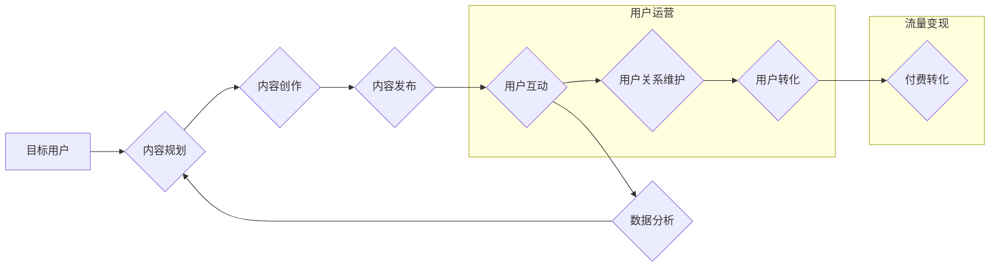

                 

## 知识付费创业中的内容营销矩阵搭建

> 关键词：知识付费、内容营销、矩阵搭建、用户运营、流量变现、数据分析

## 1. 背景介绍

知识付费行业近年来蓬勃发展，从在线课程、付费咨询到会员体系，各种模式层出不穷。然而，在竞争日益激烈的市场环境下，单纯依靠优质内容难以获得持续的成功。如何有效地将内容转化为流量，并最终实现商业化，成为知识付费创业者面临的重大挑战。

内容营销作为一种以用户为中心的营销策略，在知识付费行业中发挥着越来越重要的作用。它强调通过提供有价值、引人入胜的内容来吸引目标用户，建立信任关系，最终促成付费转化。

然而，内容营销并非一蹴而就，需要精心策划和执行。知识付费创业者需要构建一个完整的营销矩阵，将不同类型的营销活动有机结合，才能实现内容营销的最佳效果。

## 2. 核心概念与联系

### 2.1 内容营销

内容营销是指通过创建和分享有价值、相关且一致的内容来吸引和留住目标受众，并最终促成付费转化。

### 2.2 营销矩阵

营销矩阵是指将各种营销活动按照不同的维度进行分类和组合，形成一个完整的营销体系。

### 2.3 知识付费

知识付费是指通过付费的方式获取知识、技能或服务的商业模式。

**内容营销矩阵搭建流程图**



## 3. 核心算法原理 & 具体操作步骤

### 3.1 算法原理概述

内容营销矩阵搭建的核心算法原理在于用户画像、内容策略和数据分析。

* **用户画像:** 通过收集用户数据，构建用户画像，了解用户的兴趣、需求、行为习惯等，为内容创作和营销活动提供参考。
* **内容策略:** 根据用户画像，制定内容策略，确定内容主题、形式、风格等，确保内容能够吸引目标用户。
* **数据分析:** 通过数据分析工具，跟踪内容的传播效果、用户互动情况、转化率等，不断优化内容策略和营销活动。

### 3.2 算法步骤详解

1. **用户调研:** 收集用户数据，包括用户 demographics、兴趣爱好、行为习惯、购买偏好等。可以使用问卷调查、用户访谈、数据分析工具等方法进行调研。
2. **用户画像构建:** 将收集到的用户数据进行分析和整合，构建用户画像，将用户分为不同的群体，例如年龄、性别、职业、兴趣爱好等。
3. **内容主题确定:** 根据用户画像，确定内容主题，选择与用户兴趣相关、能够解决用户痛点的内容。
4. **内容形式选择:** 根据用户习惯和平台特点，选择合适的內容形式，例如文章、视频、音频、图片、直播等。
5. **内容创作:** 根据内容主题和形式，创作高质量、有价值的内容，确保内容原创、实用、引人入胜。
6. **内容发布:** 将内容发布到不同的平台，例如网站、博客、社交媒体、视频网站等，扩大内容的传播范围。
7. **用户互动:** 鼓励用户互动，例如评论、点赞、分享等，建立用户与内容的连接，提高用户粘性。
8. **数据分析:** 使用数据分析工具，跟踪内容的传播效果、用户互动情况、转化率等，分析数据，优化内容策略和营销活动。

### 3.3 算法优缺点

**优点:**

* **精准化:** 通过用户画像，可以精准地定位目标用户，提高内容的针对性。
* **个性化:** 可以根据用户画像，定制个性化的内容，提升用户体验。
* **数据驱动:** 通过数据分析，可以不断优化内容策略和营销活动，提高转化率。

**缺点:**

* **数据依赖:** 需要依赖大量的用户数据，数据收集和分析需要投入时间和资源。
* **算法复杂:** 用户画像构建和内容策略制定需要一定的算法和数据分析能力。
* **动态变化:** 用户需求和市场环境不断变化，需要不断更新用户画像和内容策略。

### 3.4 算法应用领域

* **知识付费平台:** 构建用户画像，推荐个性化课程和内容。
* **电商平台:** 针对不同用户群体，推荐个性化商品和服务。
* **社交媒体平台:** 根据用户兴趣，推荐相关内容和广告。
* **教育机构:** 了解学生需求，制定个性化教学方案。

## 4. 数学模型和公式 & 详细讲解 & 举例说明

### 4.1 数学模型构建

用户画像构建可以利用机器学习算法，例如 K-means 聚类算法，将用户数据进行分类，构建用户画像。

**K-means 聚类算法**

K-means 是一种无监督学习算法，用于将数据点划分为 K 个簇。

**算法步骤:**

1. 随机选择 K 个数据点作为初始聚类中心。
2. 将每个数据点分配到距离其最近的聚类中心所属的簇。
3. 计算每个簇的中心点。
4. 将每个数据点重新分配到距离其最近的聚类中心所属的簇。
5. 重复步骤 3 和 4，直到聚类中心不再变化。

**公式:**

* **距离公式:**  $d(x, c) = \sqrt{\sum_{i=1}^{n}(x_i - c_i)^2}$

其中，$x$ 是数据点，$c$ 是聚类中心，$n$ 是数据点的维度。

### 4.2 公式推导过程

K-means 算法的目标是找到 K 个聚类中心，使得每个数据点到其所属聚类中心的距离最小。

**目标函数:**

$J = \sum_{i=1}^{K} \sum_{x \in C_i} d(x, c_i)^2$

其中，$J$ 是目标函数，$K$ 是聚类数，$C_i$ 是第 i 个簇，$x$ 是数据点，$c_i$ 是第 i 个簇的中心点。

**算法迭代过程:**

通过迭代更新聚类中心和数据点分配，不断降低目标函数值，直到达到收敛条件。

### 4.3 案例分析与讲解

假设我们有 10 个用户数据，需要将其分为 2 个簇。

我们可以使用 K-means 算法进行聚类，得到两个簇的中心点和每个用户所属的簇。

通过分析簇的特征，我们可以构建用户画像，例如：

* **簇 1:** 年龄较年轻，兴趣爱好偏向科技、游戏。
* **簇 2:** 年龄较老，兴趣爱好偏向财经、理财。

## 5. 项目实践：代码实例和详细解释说明

### 5.1 开发环境搭建

* Python 3.x
* scikit-learn 库

### 5.2 源代码详细实现

```python
from sklearn.cluster import KMeans
import numpy as np

# 用户数据
data = np.array([[25, '科技', '游戏'],
                 [35, '财经', '理财'],
                 [28, '科技', '游戏'],
                 [42, '财经', '理财'],
                 [30, '科技', '游戏'],
                 [45, '财经', '理财'],
                 [22, '科技', '游戏'],
                 [38, '财经', '理财'],
                 [27, '科技', '游戏'],
                 [40, '财经', '理财']])

# 构建 KMeans 模型
kmeans = KMeans(n_clusters=2)

# 训练模型
kmeans.fit(data)

# 获取聚类结果
labels = kmeans.labels_

# 打印聚类结果
print(labels)

# 获取聚类中心
centers = kmeans.cluster_centers_

# 打印聚类中心
print(centers)
```

### 5.3 代码解读与分析

* **数据准备:** 将用户数据转换为 NumPy 数组。
* **模型构建:** 使用 scikit-learn 库的 KMeans 类构建聚类模型，设置聚类数为 2。
* **模型训练:** 使用 `fit()` 方法训练模型，将用户数据作为输入。
* **聚类结果获取:** 使用 `labels_` 属性获取每个用户所属的簇。
* **聚类中心获取:** 使用 `cluster_centers_` 属性获取每个簇的中心点。

### 5.4 运行结果展示

运行代码后，会输出每个用户所属的簇以及每个簇的中心点。

## 6. 实际应用场景

### 6.1 内容推荐

根据用户画像，推荐个性化的课程和内容，提高用户粘性和转化率。

### 6.2 用户分群

将用户分为不同的群体，针对不同群体的需求进行内容创作和营销活动。

### 6.3 营销策略制定

根据用户画像和数据分析，制定精准的营销策略，提高营销效果。

### 6.4 未来应用展望

随着人工智能技术的不断发展，内容营销矩阵搭建将更加智能化、个性化和数据化。

## 7. 工具和资源推荐

### 7.1 学习资源推荐

* **书籍:**
    * 《内容营销》
    * 《数字营销》
    * 《数据分析》
* **在线课程:**
    * Coursera
    * Udemy
    * edX

### 7.2 开发工具推荐

* **Python:** 
    * scikit-learn
    * pandas
    * matplotlib
* **数据分析工具:**
    * Google Analytics
    * Baidu Analytics

### 7.3 相关论文推荐

* **K-means 聚类算法:**
    * Lloyd, S. (1982). Least squares quantization in PCM. IEEE Transactions on Information Theory, 28(4), 409-411.
* **内容营销:**
    *  Chaffey, D., & Ellis-Chadwick, F. (2019). Digital marketing: Strategy, implementation and practice. Pearson Education.

## 8. 总结：未来发展趋势与挑战

### 8.1 研究成果总结

内容营销矩阵搭建是知识付费创业者实现内容变现的重要手段。通过用户画像、内容策略和数据分析，可以构建一个高效的营销体系，提高用户粘性和转化率。

### 8.2 未来发展趋势

* **人工智能驱动:** 利用人工智能技术，实现更智能化的用户画像构建和内容推荐。
* **个性化定制:** 根据用户画像，提供更加个性化的内容和服务。
* **跨平台整合:** 将不同平台的营销活动整合起来，形成一个完整的营销生态。

### 8.3 面临的挑战

* **数据隐私:** 如何保护用户数据隐私，是内容营销矩阵搭建面临的重要挑战。
* **算法可解释性:** 许多机器学习算法的决策过程难以解释，这可能会导致用户对内容推荐的信任度降低。
* **内容质量:** 随着内容营销的普及，内容质量竞争日益激烈，如何创作出高质量、有价值的内容，是知识付费创业者需要不断思考的问题。

### 8.4 研究展望

未来，内容营销矩阵搭建将朝着更加智能化、个性化和数据化的方向发展。

## 9. 附录：常见问题与解答

**Q1: 如何构建用户画像？**

A1: 可以使用问卷调查、用户访谈、数据分析工具等方法收集用户数据，然后利用机器学习算法进行聚类分析，构建用户画像。

**Q2: 如何选择合适的聚类算法？**

A2: 不同的聚类算法适用于不同的场景，需要根据实际情况选择合适的算法。例如，K-means 算法适用于数据分布较为均匀的情况，而 DBSCAN 算法适用于数据分布较为复杂的情况。

**Q3: 如何评估聚类效果？**

A3: 可以使用 Silhouette Coefficient、Dunn Index 等指标来评估聚类效果。

**Q4: 如何优化内容策略？**

A4: 可以通过数据分析，了解用户对不同内容的兴趣和偏好，然后根据用户反馈和数据分析结果，不断优化内容策略。


作者：禅与计算机程序设计艺术 / Zen and the Art of Computer Programming 
<end_of_turn>

