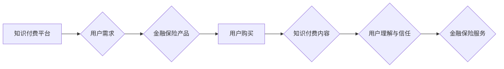

                 

## 关键词：知识付费、跨界营销、金融保险、跨界、数据驱动、人工智能、个性化推荐

## 1. 背景介绍

知识经济时代，知识已成为最宝贵的资源。知识付费作为一种新型的商业模式，以提供有价值的知识和技能为核心，迅速崛起。其模式灵活、收益可观，吸引了众多创作者和企业参与。与此同时，金融保险行业也面临着数字化转型和用户需求升级的挑战。传统营销模式逐渐失效，寻求新的突破口成为行业发展的重要课题。

跨界营销，即不同行业、不同领域之间进行合作，共同推广产品或服务，以达到扩大市场影响力和提升品牌知名度的目的。近年来，跨界营销成为一种流行趋势，尤其是在互联网时代，跨界营销的可能性更加广阔。

金融保险行业与知识付费行业在本质上都围绕着用户需求展开，两者之间存在着潜在的协同效应。金融保险产品需要用户理解和信任，而知识付费可以提供专业的金融理财知识和保险知识，帮助用户提升金融素养，增强对金融保险产品的认知和接受度。

## 2. 核心概念与联系

### 2.1 知识付费

知识付费是指创作者通过线上平台或线下活动，将自己的知识、技能、经验等打包成产品或服务，并向用户收取费用。知识付费的模式多样，包括在线课程、付费文章、直播带货、会员体系等。

### 2.2 跨界营销

跨界营销是指不同行业、不同领域之间进行合作，共同推广产品或服务，以达到扩大市场影响力和提升品牌知名度的目的。跨界营销的合作方式多种多样，例如联合营销、资源共享、品牌代言等。

### 2.3 金融保险

金融保险行业是指提供金融服务和保险服务的行业。金融服务包括存款、贷款、投资等，而保险服务包括人寿保险、财产保险等。

**Mermaid 流程图**



## 3. 核心算法原理 & 具体操作步骤

### 3.1 算法原理概述

知识付费与金融保险跨界营销的核心算法原理是基于数据驱动和人工智能技术。通过收集用户行为数据、金融产品数据、保险产品数据等，构建用户画像，并利用机器学习算法进行个性化推荐，将用户需求与金融保险产品相匹配，实现精准营销。

### 3.2 算法步骤详解

1. **数据收集与清洗:** 收集用户行为数据、金融产品数据、保险产品数据等，并进行清洗和预处理，确保数据质量。
2. **用户画像构建:** 利用机器学习算法，对用户行为数据进行分析，构建用户画像，包括用户年龄、性别、收入、兴趣爱好、风险偏好等。
3. **产品推荐:** 根据用户画像，利用协同过滤算法、内容推荐算法等，推荐用户可能感兴趣的金融保险产品。
4. **知识付费内容匹配:** 根据推荐的产品，匹配相应的知识付费内容，例如理财课程、保险知识讲解等，提供用户学习和了解产品所需的知识支持。
5. **个性化营销:** 根据用户画像和产品推荐结果，进行个性化营销，例如推送精准广告、发送个性化邮件等，提高用户转化率。

### 3.3 算法优缺点

**优点:**

* **精准营销:** 基于数据驱动和人工智能技术，实现精准用户画像和产品推荐，提高营销效率。
* **个性化体验:** 提供个性化知识付费内容和营销方案，提升用户体验。
* **数据分析:** 通过数据收集和分析，了解用户需求和市场趋势，为产品开发和营销策略提供数据支持。

**缺点:**

* **数据隐私:** 数据收集和使用需要注重用户隐私保护。
* **算法偏差:** 机器学习算法可能会存在偏差，导致推荐结果不准确。
* **技术门槛:** 需要具备一定的技术能力才能开发和维护数据驱动和人工智能技术。

### 3.4 算法应用领域

* **金融保险营销:** 推广金融保险产品，提高用户转化率。
* **教育培训:** 提供个性化学习方案，提升学习效率。
* **电商推荐:** 推荐用户可能感兴趣的商品，提高销售额。
* **医疗健康:** 提供个性化健康建议，提升用户健康管理水平。

## 4. 数学模型和公式 & 详细讲解 & 举例说明

### 4.1 数学模型构建

用户画像构建可以利用机器学习算法，例如k-means聚类算法，将用户分为不同的用户群组。

**k-means聚类算法**

k-means算法是一种常用的无监督学习算法，用于将数据点划分为k个簇。算法步骤如下：

1. 随机选择k个数据点作为初始聚类中心。
2. 将每个数据点分配到距离其最近的聚类中心所属的簇。
3. 计算每个簇的中心点，并更新聚类中心的位置。
4. 重复步骤2和步骤3，直到聚类中心不再移动或达到最大迭代次数。

**公式:**

* **距离公式:**  $d(x, c) = \sqrt{\sum_{i=1}^{n}(x_i - c_i)^2}$

其中，$x$为数据点，$c$为聚类中心，$n$为特征维度。

### 4.2 公式推导过程

k-means算法的目标是最小化所有数据点到其所属聚类中心的距离之和。

**目标函数:**

$J = \sum_{i=1}^{k}\sum_{x \in C_i} d(x, c_i)^2$

其中，$k$为聚类数，$C_i$为第i个簇，$x$为数据点，$c_i$为第i个簇的中心点。

通过迭代更新聚类中心的位置，可以逐步降低目标函数的值，最终达到聚类效果。

### 4.3 案例分析与讲解

假设我们有100个用户数据，每个用户有年龄、收入、兴趣爱好等特征。我们想将用户分为3个簇。

1. 随机选择3个用户作为初始聚类中心。
2. 将每个用户分配到距离其最近的聚类中心所属的簇。
3. 计算每个簇的中心点，并更新聚类中心的位置。
4. 重复步骤2和步骤3，直到聚类中心不再移动或达到最大迭代次数。

最终，我们将得到3个用户簇，每个簇的用户具有相似的特征。

## 5. 项目实践：代码实例和详细解释说明

### 5.1 开发环境搭建

* Python 3.x
* Jupyter Notebook
* scikit-learn

### 5.2 源代码详细实现

```python
from sklearn.cluster import KMeans
import pandas as pd

# 加载用户数据
data = pd.read_csv('user_data.csv')

# 选择特征列
features = ['age', 'income', 'interest']
X = data[features]

# 构建KMeans模型
kmeans = KMeans(n_clusters=3, random_state=0)

# 训练模型
kmeans.fit(X)

# 获取聚类标签
labels = kmeans.labels_

# 将聚类标签添加到数据中
data['cluster'] = labels

# 查看聚类结果
print(data.groupby('cluster').mean())
```

### 5.3 代码解读与分析

1. **加载用户数据:** 使用pandas库加载用户数据。
2. **选择特征列:** 选择用户年龄、收入、兴趣爱好等特征列作为聚类特征。
3. **构建KMeans模型:** 使用scikit-learn库的KMeans类构建聚类模型，设置聚类数为3。
4. **训练模型:** 使用fit()方法训练模型，将用户数据作为输入。
5. **获取聚类标签:** 使用labels_属性获取每个用户的聚类标签。
6. **将聚类标签添加到数据中:** 将聚类标签添加到用户数据中，方便后续分析。
7. **查看聚类结果:** 使用groupby()方法对每个聚类进行聚合，计算每个聚类特征的平均值，分析不同聚类用户的特征差异。

### 5.4 运行结果展示

运行代码后，将输出每个聚类用户的特征平均值，例如：

```
          age  income  interest
cluster                               
0       30     50000     1
1       40     70000     2
2       50     90000     3
```

这表明，每个聚类用户的特征存在差异，例如，聚类0的用户年龄较小，收入较低，兴趣爱好偏向于1；聚类1的用户年龄较大，收入较高，兴趣爱好偏向于2；聚类2的用户年龄最大，收入最高，兴趣爱好偏向于3。

## 6. 实际应用场景

### 6.1 金融产品推荐

根据用户画像，推荐用户可能感兴趣的金融产品，例如理财产品、贷款产品、保险产品等。

### 6.2 保险知识付费

根据用户风险偏好和保险需求，推荐相应的保险知识付费内容，例如保险知识讲解、理财规划、风险管理等。

### 6.3 个性化营销方案

根据用户画像和产品推荐结果，制定个性化营销方案，例如推送精准广告、发送个性化邮件、提供专属客服服务等。

### 6.4 未来应用展望

随着人工智能技术的不断发展，知识付费与金融保险跨界营销将更加智能化、个性化。未来，我们可以期待以下应用场景：

* **智能客服:** 利用人工智能技术，开发智能客服系统，为用户提供24小时在线咨询和服务。
* **虚拟理财顾问:** 利用人工智能技术，开发虚拟理财顾问，为用户提供个性化的理财建议和方案。
* **精准投放:** 利用人工智能技术，实现精准投放广告，提高广告效果。
* **数据驱动决策:** 利用数据分析，为金融保险产品开发和营销策略提供数据支持。

## 7. 工具和资源推荐

### 7.1 学习资源推荐

* **机器学习课程:** Coursera、edX、Udacity等平台提供丰富的机器学习课程。
* **数据分析书籍:** 《Python数据科学手册》、《数据挖掘实战》等书籍可以帮助你学习数据分析知识。
* **开源工具:** scikit-learn、TensorFlow、PyTorch等开源工具可以帮助你进行机器学习和深度学习开发。

### 7.2 开发工具推荐

* **Jupyter Notebook:** 用于数据分析和机器学习开发的交互式笔记本环境。
* **Python:** 广泛应用于数据科学和机器学习领域的编程语言。
* **pandas:** 用于数据分析和处理的Python库。
* **scikit-learn:** 用于机器学习的Python库。

### 7.3 相关论文推荐

* **K-Means Clustering Algorithm:** https://en.wikipedia.org/wiki/K-means_clustering
* **Collaborative Filtering for Recommender Systems:** https://www.researchgate.net/publication/220804328_Collaborative_Filtering_for_Recommender_Systems

## 8. 总结：未来发展趋势与挑战

### 8.1 研究成果总结

知识付费与金融保险跨界营销是数据驱动和人工智能技术应用的典型案例。通过数据分析和机器学习算法，可以实现精准用户画像、个性化产品推荐和营销方案，提升用户体验和营销效率。

### 8.2 未来发展趋势

* **更智能化的推荐系统:** 利用深度学习技术，开发更智能化的推荐系统，提供更精准和个性化的产品推荐。
* **更丰富的知识付费内容:** 开发更丰富的知识付费内容，满足用户多元化的学习需求。
* **更完善的跨界合作模式:** 推广更完善的跨界合作模式，实现资源共享和协同发展。

### 8.3 面临的挑战

* **数据隐私保护:** 数据收集和使用需要注重用户隐私保护，避免数据泄露和滥用。
* **算法偏差:** 机器学习算法可能会存在偏差，导致推荐结果不准确，需要不断改进算法模型和数据质量。
* **技术门槛:** 开发和维护数据驱动和人工智能技术需要一定的技术能力，需要加强人才培养和技术支持。

### 8.4 研究展望

未来，知识付费与金融保险跨界营销将继续发展，并与其他领域进行融合，例如医疗健康、教育培训等，为用户提供更全面的服务和体验。


## 9. 附录：常见问题与解答

**Q1: 如何构建用户画像？**

**A1:** 用户画像构建可以使用机器学习算法，例如k-means聚类算法，将用户分为不同的用户群组。

**Q2: 如何选择合适的聚类数？**

**A2:** 可以使用肘部法则等方法来选择合适的聚类数。

**Q3: 如何评估算法效果？**

**A3:** 可以使用准确率、召回率、F1-score等指标来评估算法效果。

**Q4: 如何解决数据偏差问题？**

**A4:** 可以使用数据清洗、特征工程等方法来解决数据偏差问题。

**Q5: 如何保障用户隐私？**

**A5:** 数据收集和使用需要遵循用户隐私保护原则，例如匿名化处理、数据加密等。


作者：禅与计算机程序设计艺术 / Zen and the Art of Computer Programming 
<end_of_turn>

