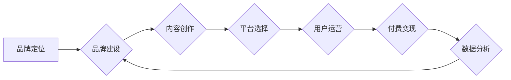

                 

## 知识付费赚钱的品牌品牌运营与品牌推广策略

> 关键词：知识付费、品牌运营、品牌推广、内容营销、社区运营、付费变现、用户增长

### 1. 背景介绍

知识经济时代，知识成为最宝贵的资源。知识付费作为一种新型的商业模式，在近年来迅速发展，成为众多创作者和企业关注的焦点。它打破了传统教育模式的局限，为创作者提供了新的盈利途径，也为用户提供了更便捷、更个性化的学习方式。

然而，知识付费市场竞争激烈，想要在众多平台和产品中脱颖而出，需要建立一个强大的品牌，并制定有效的品牌运营和推广策略。

### 2. 核心概念与联系

**2.1 知识付费的核心概念**

知识付费是指创作者将自己的知识、技能、经验等打包成产品或服务，通过线上平台向用户收取费用。

**2.2 品牌运营的核心概念**

品牌运营是指围绕品牌价值，通过一系列的策略和行动，提升品牌知名度、美誉度和用户粘性，最终实现品牌价值最大化。

**2.3 品牌推广的核心概念**

品牌推广是指通过各种营销活动，向目标用户传播品牌信息，提升品牌认知度和影响力，最终引导用户购买产品或服务。

**2.4 知识付费品牌运营与推广的联系**

知识付费品牌运营和推广是相互关联、相互促进的。

* **品牌运营为品牌推广提供基础：** 只有建立了一个有价值、有信誉的品牌，才能有效地吸引用户关注，并最终转化为付费用户。
* **品牌推广为品牌运营提供动力：** 通过有效的品牌推广，可以提升品牌知名度和影响力，吸引更多用户关注品牌，从而为品牌运营提供更多资源和支持。

**2.5 品牌运营与推广流程图**



### 3. 核心算法原理 & 具体操作步骤

**3.1 算法原理概述**

知识付费品牌运营和推广的核心算法原理是基于用户行为分析和数据驱动决策。通过收集用户数据，分析用户行为模式，可以精准地定位目标用户，制定有效的品牌运营和推广策略。

**3.2 算法步骤详解**

1. **数据收集:** 收集用户行为数据，包括用户注册信息、学习记录、付费行为、评论反馈等。
2. **数据分析:** 使用数据分析工具，对用户数据进行分析，挖掘用户行为模式，例如用户偏好课程类型、学习时间段、付费意愿等。
3. **用户画像:** 根据数据分析结果，构建用户画像，将用户细分到不同的群体，例如年龄、职业、兴趣爱好等。
4. **策略制定:** 根据用户画像，制定针对不同用户群体的品牌运营和推广策略，例如内容创作方向、推广渠道选择、营销活动设计等。
5. **效果评估:** 定期评估策略效果，根据数据反馈进行策略调整，不断优化品牌运营和推广策略。

**3.3 算法优缺点**

* **优点:** 数据驱动决策，能够精准定位目标用户，提高运营效率和推广效果。
* **缺点:** 需要收集大量用户数据，并具备一定的分析能力，才能有效地应用算法原理。

**3.4 算法应用领域**

* **知识付费平台:** 用于用户画像分析、内容推荐、付费转化等。
* **教育机构:** 用于学生行为分析、课程设计、招生推广等。
* **企业培训:** 用于员工培训需求分析、培训方案设计、培训效果评估等。

### 4. 数学模型和公式 & 详细讲解 & 举例说明

**4.1 数学模型构建**

知识付费品牌运营和推广可以构建一个数学模型，来预测用户付费意愿。

**用户付费意愿模型:**

$$
P = f(C, V, E, R)
$$

其中:

* $P$：用户付费意愿
* $C$：课程内容价值
* $V$：品牌价值
* $E$：用户体验
* $R$：推荐力度

**4.2 公式推导过程**

* **课程内容价值 (C):** 课程内容的质量、实用性、独特性等因素都会影响用户付费意愿。可以采用专家评分、用户评价等指标来量化课程内容价值。
* **品牌价值 (V):** 品牌的知名度、信誉度、用户口碑等因素都会影响用户付费意愿。可以采用品牌知名度指数、用户满意度调查等指标来量化品牌价值。
* **用户体验 (E):** 用户在学习过程中遇到的问题、平台的稳定性、客服的响应速度等因素都会影响用户付费意愿。可以采用用户反馈、学习时长、复购率等指标来量化用户体验。
* **推荐力度 (R):** 课程的推荐频率、推荐渠道、推荐方式等因素都会影响用户付费意愿。可以采用推荐次数、点击率、转化率等指标来量化推荐力度。

**4.3 案例分析与讲解**

假设一个知识付费平台推出了一门编程课程，该课程的内容价值较高，品牌价值也比较高，但用户体验较差，推荐力度较低。根据上述模型，我们可以预测该课程的付费意愿较低。

为了提高付费意愿，平台可以采取以下措施:

* **提升用户体验:** 优化平台界面，解决用户遇到的问题，提高客服响应速度等。
* **加强推荐力度:** 通过多种渠道进行课程推荐，例如社交媒体、搜索引擎、邮件营销等。
* **打造品牌价值:** 举办线下活动，邀请专家分享经验，提升品牌知名度和信誉度。

### 5. 项目实践：代码实例和详细解释说明

**5.1 开发环境搭建**

* 操作系统: Windows/macOS/Linux
* 编程语言: Python
* 开发工具: Jupyter Notebook/VS Code
* 数据分析工具: Pandas/Scikit-learn

**5.2 源代码详细实现**

```python
import pandas as pd
from sklearn.model_selection import train_test_split
from sklearn.linear_model import LogisticRegression

# 加载用户数据
data = pd.read_csv('user_data.csv')

# 提取特征变量和目标变量
X = data[['课程内容价值', '品牌价值', '用户体验', '推荐力度']]
y = data['付费意愿']

# 将数据划分为训练集和测试集
X_train, X_test, y_train, y_test = train_test_split(X, y, test_size=0.2, random_state=42)

# 训练逻辑回归模型
model = LogisticRegression()
model.fit(X_train, y_train)

# 预测测试集的用户付费意愿
y_pred = model.predict(X_test)

# 评估模型性能
from sklearn.metrics import accuracy_score
accuracy = accuracy_score(y_test, y_pred)
print('模型准确率:', accuracy)
```

**5.3 代码解读与分析**

* 该代码首先加载用户数据，然后提取特征变量和目标变量。
* 接着将数据划分为训练集和测试集，用于训练和评估模型。
* 训练逻辑回归模型，并使用测试集数据进行预测。
* 最后评估模型性能，例如准确率。

**5.4 运行结果展示**

运行结果会显示模型的准确率，例如 0.85，表示模型在预测用户付费意愿方面准确率为 85%。

### 6. 实际应用场景

**6.1 知识付费平台**

知识付费平台可以利用上述算法，分析用户行为数据，精准地推荐课程，提高用户付费意愿。

**6.2 教育机构**

教育机构可以利用上述算法，分析学生学习行为数据，制定个性化的学习方案，提高学习效果。

**6.3 企业培训**

企业培训可以利用上述算法，分析员工培训需求数据，设计更有效的培训方案，提升员工技能水平。

**6.4 未来应用展望**

随着人工智能技术的不断发展，知识付费品牌运营和推广的算法将会更加智能化、个性化。

* **更精准的用户画像:** 利用深度学习等算法，构建更精准的用户画像，更好地理解用户的需求和行为模式。
* **更个性化的内容推荐:** 利用推荐算法，为每个用户推荐最合适的课程内容，提高用户学习兴趣和付费意愿。
* **更有效的营销活动:** 利用数据分析和机器学习，设计更有效的营销活动，提升品牌知名度和影响力。

### 7. 工具和资源推荐

**7.1 学习资源推荐**

* **书籍:**
    * 《Python数据科学手册》
    * 《机器学习实战》
    * 《深度学习》
* **在线课程:**
    * Coursera
    * edX
    * Udemy

**7.2 开发工具推荐**

* **Python:**
    * Jupyter Notebook
    * VS Code
* **数据分析工具:**
    * Pandas
    * Scikit-learn
* **机器学习框架:**
    * TensorFlow
    * PyTorch

**7.3 相关论文推荐**

* **推荐系统:**
    * Collaborative Filtering for Implicit Feedback Datasets
    * Deep Learning Recommendation Algorithms
* **用户画像分析:**
    * User Profiling for Personalized Recommendations
    * Deep Learning for User Profiling

### 8. 总结：未来发展趋势与挑战

**8.1 研究成果总结**

知识付费品牌运营和推广的算法研究取得了显著成果，能够有效地分析用户行为数据，提升品牌运营和推广效率。

**8.2 未来发展趋势**

未来，知识付费品牌运营和推广的算法将会更加智能化、个性化，并与其他技术融合，例如大数据、云计算、区块链等。

**8.3 面临的挑战**

* **数据隐私保护:** 知识付费品牌运营和推广需要收集大量用户数据，如何保护用户隐私是一个重要的挑战。
* **算法公平性:** 算法模型可能会存在偏见，导致不公平的结果，需要不断改进算法模型，确保算法公平性。
* **用户信任:** 用户对算法模型的信任度需要不断提升，需要加强算法透明度和可解释性。

**8.4 研究展望**

未来研究方向包括:

* 开发更精准、更个性化的用户画像分析算法。
* 研究更有效的推荐算法，提高用户学习兴趣和付费意愿。
* 探索算法与其他技术的融合，例如大数据、云计算、区块链等，构建更智能、更全面的知识付费生态系统。

### 9. 附录：常见问题与解答

**9.1 如何收集用户数据？**

可以通过以下方式收集用户数据:

* 用户注册信息
* 学习记录
* 付费行为
* 评论反馈
* 网站行为数据

**9.2 如何保护用户隐私？**

* 采用匿名化技术，对用户数据进行脱敏处理。
* 明确用户数据使用范围和目的，并获得用户同意。
* 加强数据安全防护，防止数据泄露。

**9.3 如何评估算法模型的性能？**

可以使用以下指标评估算法模型的性能:

* 准确率
* 精度
* 召回率
* F1-score

**9.4 如何提高算法模型的准确率？**

* 提高数据质量，减少数据噪声。
* 尝试不同的算法模型，选择最适合的数据集的模型。
* 调整算法模型参数，优化模型性能。


作者：禅与计算机程序设计艺术 / Zen and the Art of Computer Programming 
<end_of_turn>

