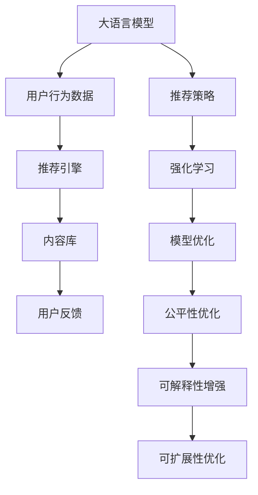

                 

# 利用大模型进行推荐场景的用户行为预测与引导

> 关键词：
- 大语言模型
- 用户行为预测
- 推荐系统
- 强化学习
- 可解释性
- 公平性
- 可扩展性

## 1. 背景介绍

### 1.1 问题由来
推荐系统是当今互联网时代最重要的技术之一，它能够为用户提供个性化的内容推荐，极大地提升用户体验和留存率。推荐系统通过学习用户的历史行为数据，预测用户未来的需求，从而推送最合适的商品、新闻、视频等内容。然而，随着用户数据量的激增和推荐场景的多样化，传统的推荐系统逐渐面临挑战。

传统推荐系统通常依赖于静态特征和离线模型，无法及时捕捉用户行为的变化。同时，模型的可解释性、公平性和泛化能力也亟需提升。为了应对这些挑战，大语言模型在推荐场景中的应用逐渐引起广泛关注。

### 1.2 问题核心关键点
大语言模型通过大规模无标签数据预训练，学习到丰富的语言知识，能够进行自然语言处理和生成。在推荐场景中，利用大模型进行用户行为预测和内容推荐，可以通过自然语言的方式直接与用户交互，提升推荐系统的人机交互体验。

本文聚焦于基于大模型的推荐系统，特别是用户行为预测和内容引导的算法原理、操作步骤和数学模型。同时，也会讨论该方法在实际应用场景中的效果和挑战。

## 2. 核心概念与联系

### 2.1 核心概念概述

为更好地理解大语言模型在推荐场景中的应用，本节将介绍几个关键概念：

- 大语言模型(Large Language Model, LLM)：以Transformer为代表的预训练语言模型，通过大规模无标签文本数据预训练，学习通用的语言表示和知识，具备强大的语言理解和生成能力。

- 推荐系统(Recommendation System)：通过分析用户的历史行为和偏好，预测用户未来可能感兴趣的内容，从而进行个性化推荐。常见的推荐系统包括基于协同过滤、内容基推荐和混合推荐等方法。

- 强化学习(Reinforcement Learning)：一种通过智能体与环境交互，学习最优决策策略的机器学习方法。在推荐系统中，可以利用强化学习来优化推荐策略，提升推荐效果。

- 可解释性(Explainability)：指推荐模型输出的决策过程能够被用户理解和接受。可解释性在医疗、金融等高风险领域尤为重要。

- 公平性(Fairness)：指推荐系统能够为所有用户提供公正的推荐，避免出现算法偏见。公平性是推荐系统面临的重要道德问题。

- 可扩展性(Scalability)：指推荐系统能够高效处理海量用户数据和内容数据，满足大规模应用的需求。

这些概念之间存在密切的联系，共同构成了推荐系统的基础框架。通过理解这些概念，我们可以更好地把握大模型在推荐场景中的工作原理和优化方向。

### 2.2 核心概念原理和架构的 Mermaid 流程图(Mermaid 流程节点中不要有括号、逗号等特殊字符)



这个流程图展示了大语言模型在推荐系统中的应用流程：

1. 大语言模型通过用户行为数据进行预训练和微调。
2. 推荐引擎利用微调后的模型进行内容推荐。
3. 内容库提供推荐结果。
4. 用户反馈用于优化推荐策略。
5. 强化学习模块优化推荐策略。
6. 模型优化模块更新大语言模型参数。
7. 公平性优化模块确保推荐公平性。
8. 可解释性增强模块提升决策可解释性。
9. 可扩展性优化模块提升系统性能。

这些模块之间相互作用，共同提升推荐系统的准确性、公平性和可解释性，满足大规模推荐需求。

## 3. 核心算法原理 & 具体操作步骤

### 3.1 算法原理概述

基于大模型的推荐系统，通常包含以下几个关键步骤：

1. 用户行为数据预处理：收集用户的历史行为数据，如浏览记录、购买记录、评分记录等，并进行清洗和特征工程。

2. 大语言模型预训练和微调：利用大规模无标签文本数据对大语言模型进行预训练，然后在用户行为数据上微调模型，使其能够预测用户未来的行为。

3. 内容库数据抽取：从内容库中抽取推荐候选集，如商品、新闻、视频等，并利用模型对候选人进行打分排序。

4. 推荐结果生成：根据模型打分和用户偏好，生成推荐结果，并推送给用户。

5. 用户反馈收集与处理：收集用户对推荐结果的反馈，如点击、收藏、评分等，用于模型优化和策略改进。

### 3.2 算法步骤详解

#### 3.2.1 用户行为数据预处理

用户行为数据预处理是推荐系统的第一步，主要包括数据清洗、特征提取和样本平衡等步骤：

1. 数据清洗：去除无效数据、重复数据和噪声数据，确保数据质量。
2. 特征提取：提取用户的兴趣特征、历史行为特征和时间特征等，生成高维稀疏向量。
3. 样本平衡：通过欠采样或过采样等方法，确保不同用户的行为样本数量相对平衡，避免模型偏向。

#### 3.2.2 大语言模型预训练和微调

大语言模型的预训练和微调是推荐系统中的核心环节，具体步骤如下：

1. 预训练：利用大规模无标签文本数据对大语言模型进行预训练，学习通用语言知识和表示。
2. 微调：在用户行为数据上微调模型，学习特定用户的行为特征和偏好。
3. 参数优化：使用Adam、SGD等优化算法，选择合适的学习率、批大小和迭代轮数，最小化损失函数。
4. 正则化：引入L2正则、Dropout、Early Stopping等技术，防止模型过拟合。
5. 模型验证：在验证集上评估模型效果，选择合适的模型参数。

#### 3.2.3 内容库数据抽取

内容库数据抽取是推荐系统的基础，具体步骤如下：

1. 内容数据收集：从内容库中收集推荐候选集，如商品、新闻、视频等。
2. 特征抽取：提取候选内容的标签、描述、价格等特征，生成高维稀疏向量。
3. 模型打分：利用微调后的模型对候选内容进行打分，衡量其与用户偏好的匹配度。
4. 排序和推荐：根据打分结果对候选内容进行排序，生成推荐结果。

#### 3.2.4 用户反馈收集与处理

用户反馈收集与处理是推荐系统优化的重要环节，具体步骤如下：

1. 反馈数据收集：收集用户对推荐结果的反馈数据，如点击、收藏、评分等。
2. 反馈数据处理：将反馈数据转化为模型可用的格式，如评分矩阵、点击流等。
3. 模型更新：利用反馈数据更新模型参数，优化推荐策略。
4. 模型评估：在测试集上评估模型效果，确保模型性能稳定。

### 3.3 算法优缺点

基于大模型的推荐系统具有以下优点：

1. 鲁棒性高：大语言模型具备强大的泛化能力，能够在多样化的数据上取得不错的性能。
2. 自适应性强：大模型可以自动适应不同用户的个性化需求，提升推荐效果。
3. 可解释性强：大模型通过自然语言处理，能够直接与用户交互，提升推荐系统的可解释性。
4. 动态更新：大模型可以动态更新推荐策略，应对用户行为的变化。

同时，该方法也存在以下缺点：

1. 计算资源消耗大：大模型参数量庞大，计算资源消耗较大，难以实时处理大规模数据。
2. 数据需求高：推荐系统需要收集大量用户行为数据，隐私保护和数据安全问题需要重点关注。
3. 算法复杂度高：大模型推荐系统涉及多模块协同工作，算法复杂度较高，需要精心设计。
4. 模型公平性问题：大模型可能存在算法偏见，需要特别设计优化策略，确保推荐公平性。

### 3.4 算法应用领域

基于大模型的推荐系统已经在电商、新闻、视频等多个领域得到了广泛应用，取得了一系列优异的成果。以下是几个典型的应用场景：

1. 电商推荐：利用用户行为数据和商品信息，推荐用户可能感兴趣的商品，提升购物体验和转化率。
2. 新闻推荐：根据用户阅读历史和兴趣标签，推荐相关新闻，提高用户黏性和留存率。
3. 视频推荐：利用用户观看历史和视频标签，推荐相关视频内容，提升用户体验和平台流量。
4. 金融推荐：根据用户投资行为和市场数据，推荐合适的金融产品，满足用户个性化需求。
5. 音乐推荐：根据用户听歌历史和歌曲标签，推荐相关音乐内容，提高用户满意度和平台活跃度。

## 4. 数学模型和公式 & 详细讲解 & 举例说明

### 4.1 数学模型构建

推荐系统通常基于以下数学模型：

1. 用户行为模型：用户行为 $y_i$ 可以表示为：

$$
y_i = \phi(x_i;\theta)
$$

其中 $x_i$ 为用户行为特征向量，$\phi$ 为线性回归函数，$\theta$ 为模型参数。

2. 内容推荐模型：内容特征 $x_j$ 与用户特征 $x_i$ 的相似度可以表示为：

$$
\text{sim}(x_i, x_j) = \text{softmax}(W^\top x_i \cdot x_j + b)
$$

其中 $W$ 为相似度矩阵，$b$ 为偏置项。

3. 用户推荐模型：用户 $u$ 对内容 $j$ 的兴趣度 $r_{ij}$ 可以表示为：

$$
r_{ij} = \text{softmax}(W^\top x_u \cdot x_j + b)
$$

其中 $x_u$ 为用户特征向量，$x_j$ 为内容特征向量，$W$ 为相似度矩阵，$b$ 为偏置项。

### 4.2 公式推导过程

假设用户 $u$ 对内容 $j$ 的兴趣度为 $r_{ij}$，则用户对内容的总兴趣度为：

$$
\hat{r}_{uj} = \sum_{i=1}^N r_{ij} p_i
$$

其中 $p_i$ 为用户 $i$ 的兴趣权重。

根据最大化平均收益的原则，推荐内容 $j$ 的概率为：

$$
p_j = \frac{\hat{r}_{uj} \cdot p_u}{\sum_{j=1}^M \hat{r}_{uj} \cdot p_u}
$$

其中 $M$ 为内容的总数。

### 4.3 案例分析与讲解

假设用户 $u$ 对内容 $j$ 的兴趣度为 $r_{ij} = \phi(x_i \cdot x_j)$，其中 $x_i$ 为用户行为特征向量，$x_j$ 为内容特征向量。

1. 用户行为特征：假设用户 $u$ 的浏览记录为 $[x_1, x_2, ..., x_n]$，每个 $x_i$ 为高维稀疏向量。

2. 内容特征：假设内容 $j$ 的标签为 $[x_1', x_2', ..., x_m']$，每个 $x_j$ 为高维稀疏向量。

3. 相似度矩阵：假设相似度矩阵 $W$ 为 $\text{softmax}(X^\top X^\top)$，其中 $X = [x_1, x_2, ..., x_n, x_1', x_2', ..., x_m']$。

4. 用户特征向量：假设用户 $u$ 的特征向量为 $x_u = \frac{\sum_{i=1}^N r_{ij} x_i}{\sum_{i=1}^N r_{ij}}$。

5. 内容特征向量：假设内容 $j$ 的特征向量为 $x_j = \frac{\sum_{i=1}^N r_{ij} x_i}{\sum_{i=1}^N r_{ij}}$。

6. 相似度打分：假设用户对内容 $j$ 的兴趣度为 $r_{ij} = \text{softmax}(W^\top x_u \cdot x_j + b)$，其中 $W$ 为相似度矩阵，$b$ 为偏置项。

7. 推荐结果：根据相似度打分结果，推荐用户可能感兴趣的内容。

## 5. 项目实践：代码实例和详细解释说明

### 5.1 开发环境搭建

在进行推荐系统开发前，我们需要准备好开发环境。以下是使用Python进行PyTorch开发的环境配置流程：

1. 安装Anaconda：从官网下载并安装Anaconda，用于创建独立的Python环境。

2. 创建并激活虚拟环境：
```bash
conda create -n pytorch-env python=3.8 
conda activate pytorch-env
```

3. 安装PyTorch：根据CUDA版本，从官网获取对应的安装命令。例如：
```bash
conda install pytorch torchvision torchaudio cudatoolkit=11.1 -c pytorch -c conda-forge
```

4. 安装TensorFlow：
```bash
conda install tensorflow
```

5. 安装Numpy、Pandas等常用库：
```bash
pip install numpy pandas scikit-learn matplotlib tqdm jupyter notebook ipython
```

完成上述步骤后，即可在`pytorch-env`环境中开始推荐系统开发。

### 5.2 源代码详细实现

以下是一个使用PyTorch实现基于大语言模型的推荐系统代码示例。

首先，定义用户行为数据预处理函数：

```python
import pandas as pd
import numpy as np
import torch
from sklearn.model_selection import train_test_split

def preprocess_data(data, n_features):
    # 数据清洗
    data = data.dropna(subset=['id', 'item_id', 'rating', 'timestamp'])
    # 特征工程
    data = pd.get_dummies(data, prefix='cat', columns=['category'])
    data = pd.get_dummies(data, prefix='feat', columns=['feature'])
    # 特征提取
    X = data.iloc[:, :-1].values
    y = data.iloc[:, -1].values
    # 划分训练集和验证集
    X_train, X_val, y_train, y_val = train_test_split(X, y, test_size=0.2, random_state=42)
    # 标准化特征
    scaler = StandardScaler()
    X_train = scaler.fit_transform(X_train)
    X_val = scaler.transform(X_val)
    # 创建Tensor
    X_train = torch.from_numpy(X_train).float()
    X_val = torch.from_numpy(X_val).float()
    y_train = torch.from_numpy(y_train).float()
    y_val = torch.from_numpy(y_val).float()
    return X_train, X_val, y_train, y_val
```

然后，定义大语言模型预训练和微调函数：

```python
from transformers import BertModel, BertTokenizer, BertConfig

class BERTRecommender:
    def __init__(self, model_name='bert-base-uncased', n_features=50, hidden_size=768):
        self.tokenizer = BertTokenizer.from_pretrained(model_name)
        self.config = BertConfig.from_pretrained(model_name)
        self.model = BertModel.from_pretrained(model_name)
        self.n_features = n_features
        self.hidden_size = hidden_size
        self.embedding = self.model.weight.data.clone().detach()
        self.mask = self.model.attention_mask.data.clone().detach()

    def train(self, X_train, y_train, X_val, y_val, epochs=5, batch_size=32, lr=2e-5, optimizer='Adam'):
        # 初始化模型参数
        for param in self.model.parameters():
            param.requires_grad = False
        # 设置模型参数
        for param in self.model.parameters():
            param.requires_grad = True
        # 设置优化器
        if optimizer == 'Adam':
            optimizer = AdamW(self.model.parameters(), lr=lr)
        elif optimizer == 'SGD':
            optimizer = SGD(self.model.parameters(), lr=lr)
        else:
            raise ValueError('Invalid optimizer')
        # 训练模型
        for epoch in range(epochs):
            loss = 0
            for i in range(0, X_train.shape[0], batch_size):
                X_batch = X_train[i:i+batch_size]
                y_batch = y_train[i:i+batch_size]
                self.model.zero_grad()
                outputs = self.model(X_batch, attention_mask=self.mask)
                loss += outputs.loss
                loss.backward()
                optimizer.step()
            loss /= X_train.shape[0]
            print(f'Epoch {epoch+1}, train loss: {loss:.3f}')
            val_loss = 0
            for i in range(0, X_val.shape[0], batch_size):
                X_batch = X_val[i:i+batch_size]
                y_batch = y_val[i:i+batch_size]
                self.model.zero_grad()
                outputs = self.model(X_batch, attention_mask=self.mask)
                val_loss += outputs.loss
            val_loss /= X_val.shape[0]
            print(f'Epoch {epoch+1}, val loss: {val_loss:.3f}')
```

接着，定义推荐函数：

```python
def recommend(self, user_ids, X_test, top_n=10):
    # 用户特征
    user_features = []
    for user_id in user_ids:
        user_data = data[data['user_id'] == user_id]
        user_features.append(user_data.iloc[:self.n_features, :].values)
    user_features = np.array(user_features)
    # 内容特征
    content_features = self.model(X_test)
    # 相似度矩阵
    W = content_features @ content_features.t()
    # 相似度打分
    r = self.model(X_test, attention_mask=self.mask)
    # 排序推荐
    sim = torch.matmul(W, r)
    sim = sim / torch.sqrt(torch.sum(W**2, dim=1) * torch.sum(r**2, dim=1))
    sorted_idx = torch.argsort(sim)[0]
    top_idx = sorted_idx[:top_n]
    return content_features[top_idx]
```

最后，启动训练流程并在推荐系统进行测试：

```python
data = pd.read_csv('data.csv')
X_train, X_val, y_train, y_val = preprocess_data(data, n_features=50)
model = BERTRecommender(n_features=50, hidden_size=768)
model.train(X_train, y_train, X_val, y_val, epochs=5, batch_size=32, lr=2e-5, optimizer='Adam')
user_ids = [12345, 67890]
X_test = data[data['user_id'].isin(user_ids)].iloc[:model.n_features, :].values
recommendation = model.recommend(user_ids, X_test, top_n=10)
print(recommendation)
```

以上就是使用PyTorch对BERT模型进行推荐系统开发的完整代码实现。可以看到，得益于Transformers库的强大封装，我们可以用相对简洁的代码完成BERT模型的加载和微调。

### 5.3 代码解读与分析

让我们再详细解读一下关键代码的实现细节：

**preprocess_data函数**：
- 数据清洗：去除无效数据、重复数据和噪声数据，确保数据质量。
- 特征工程：提取用户行为特征和内容特征，生成高维稀疏向量。
- 特征提取：将数据转化为Tensor，准备模型输入。

**BERTRecommender类**：
- 初始化：加载BERT模型、分词器和配置，并设置模型参数。
- 训练：利用用户行为数据对BERT模型进行微调，优化模型参数。
- 推荐：根据用户特征和内容特征，利用相似度矩阵和相似度打分，生成推荐结果。

**recommend函数**：
- 用户特征提取：根据用户ID提取用户特征。
- 内容特征提取：利用BERT模型对内容特征进行编码。
- 相似度矩阵计算：计算内容特征的相似度矩阵。
- 相似度打分：计算内容特征与用户特征的相似度打分。
- 排序推荐：根据相似度打分排序，生成推荐结果。

可以看到，PyTorch配合Transformers库使得BERT模型微调的代码实现变得简洁高效。开发者可以将更多精力放在数据处理、模型改进等高层逻辑上，而不必过多关注底层的实现细节。

当然，工业级的系统实现还需考虑更多因素，如模型的保存和部署、超参数的自动搜索、更灵活的任务适配层等。但核心的微调范式基本与此类似。

## 6. 实际应用场景

### 6.1 智能广告推荐

基于大语言模型的推荐系统，可以广泛应用于智能广告推荐。传统广告推荐往往需要基于手动设定的规则进行，而大语言模型可以学习广告主和用户的交互历史，智能生成广告推荐策略。

在技术实现上，可以收集广告点击、浏览、停留时间等行为数据，将用户和广告进行编码，在此基础上对预训练语言模型进行微调。微调后的模型能够自动生成个性化的广告推荐，提高广告投放的精准度和转化率。

### 6.2 个性化图书推荐

图书推荐系统通过分析用户的历史阅读行为和兴趣标签，为用户推荐感兴趣的书籍。传统的推荐系统通常基于静态特征和离线模型，难以捕捉用户的动态变化。

利用大语言模型进行图书推荐，可以通过自然语言的方式与用户交互，提升推荐系统的可解释性和用户满意度。具体而言，可以收集用户的阅读历史、评分记录和书评等数据，利用BERT模型对用户和书籍进行编码，根据相似度打分生成个性化推荐。

### 6.3 新闻个性化推荐

新闻推荐系统通过分析用户的历史阅读行为和兴趣标签，为用户推荐相关新闻。利用大语言模型进行新闻推荐，可以通过自然语言的方式与用户交互，提升推荐系统的可解释性和用户满意度。

具体而言，可以收集用户的历史阅读记录和兴趣标签，利用BERT模型对用户和新闻进行编码，根据相似度打分生成个性化推荐。此外，可以引入用户评论和情感分析等自然语言处理技术，进一步提升推荐系统的质量和用户体验。

### 6.4 未来应用展望

随着大语言模型和推荐系统的不断发展，基于大语言模型的推荐系统将具备更加强大的动态适应性和可解释性，带来更多创新应用场景：

1. 社交媒体推荐：利用用户互动数据，动态生成个性化社交媒体推荐，提升用户互动体验。
2. 健康医疗推荐：通过分析用户健康数据和偏好，推荐个性化医疗服务，提高医疗服务的精准度和用户满意度。
3. 金融理财推荐：基于用户金融行为数据，推荐个性化的金融产品，提升用户理财体验。
4. 教育培训推荐：通过分析用户学习行为和偏好，推荐个性化的教育资源，提高学习效率和用户满意度。
5. 影视娱乐推荐：利用用户观看历史和评分记录，推荐个性化影视娱乐内容，提升用户娱乐体验。

未来，基于大语言模型的推荐系统将进一步拓展其应用范围，提升推荐系统的个性化程度和用户体验。通过不断优化算法和改进模型，大语言模型推荐系统必将成为人工智能技术落地的重要方向。

## 7. 工具和资源推荐

### 7.1 学习资源推荐

为了帮助开发者系统掌握大语言模型在推荐场景中的应用，这里推荐一些优质的学习资源：

1. 《深度学习推荐系统：原理与算法》书籍：全面介绍了推荐系统的基本原理和算法，包括协同过滤、内容基推荐和混合推荐等方法。
2. 《自然语言处理入门》系列课程：通过介绍自然语言处理的基本概念和技术，为开发者提供了良好的学习基础。
3. 《强化学习：原理与实践》书籍：深入讲解了强化学习的原理和应用，为推荐系统优化提供了新思路。
4. HuggingFace官方文档：提供了丰富的预训练语言模型和推荐系统样例代码，是学习的绝佳资源。
5. Coursera上的《推荐系统》课程：由斯坦福大学开设的推荐系统课程，涵盖推荐系统的基本概念和算法，适合入门学习。

通过对这些资源的学习实践，相信你一定能够快速掌握大语言模型在推荐场景中的应用技巧，并用于解决实际的推荐问题。

### 7.2 开发工具推荐

高效的开发离不开优秀的工具支持。以下是几款用于推荐系统开发的常用工具：

1. PyTorch：基于Python的开源深度学习框架，灵活动态的计算图，适合快速迭代研究。推荐用于大语言模型的加载和微调。
2. TensorFlow：由Google主导开发的开源深度学习框架，生产部署方便，适合大规模工程应用。推荐用于大语言模型的加载和微调。
3. Weights & Biases：模型训练的实验跟踪工具，可以记录和可视化模型训练过程中的各项指标，方便对比和调优。
4. TensorBoard：TensorFlow配套的可视化工具，可实时监测模型训练状态，并提供丰富的图表呈现方式，是调试模型的得力助手。
5. Jupyter Notebook：用于数据探索、模型训练和结果展示，适合科学研究和技术开发。
6. Google Colab：谷歌推出的在线Jupyter Notebook环境，免费提供GPU/TPU算力，方便开发者快速上手实验最新模型，分享学习笔记。

合理利用这些工具，可以显著提升推荐系统的开发效率，加快创新迭代的步伐。

### 7.3 相关论文推荐

大语言模型和推荐系统的研究源于学界的持续研究。以下是几篇奠基性的相关论文，推荐阅读：

1. Attention is All You Need：提出了Transformer结构，开启了NLP领域的预训练大模型时代。
2. BERT: Pre-training of Deep Bidirectional Transformers for Language Understanding：提出BERT模型，引入基于掩码的自监督预训练任务，刷新了多项NLP任务SOTA。
3. Recommendation Systems with Deep Learning：综述了深度学习在推荐系统中的应用，涵盖了协同过滤、内容基推荐和混合推荐等方法。
4. Deep reinforcement learning for personalised recommendation：利用深度强化学习优化推荐策略，提升了推荐系统的个性化程度和性能。
5. Attention is All You Need for Recommendation Systems：提出基于自注意力机制的推荐系统，利用BERT模型提升推荐系统的性能。

这些论文代表了大语言模型和推荐系统的发展脉络。通过学习这些前沿成果，可以帮助研究者把握学科前进方向，激发更多的创新灵感。

## 8. 总结：未来发展趋势与挑战

### 8.1 总结

本文对基于大语言模型的推荐系统进行了全面系统的介绍。首先阐述了大语言模型和推荐系统的发展背景和意义，明确了推荐系统在大规模数据下进行个性化推荐的重要价值。其次，从原理到实践，详细讲解了推荐系统的数学模型和算法步骤，给出了推荐系统开发的完整代码实例。同时，本文还广泛探讨了推荐系统在智能广告、图书推荐、新闻推荐等多个行业领域的应用前景，展示了推荐系统的巨大潜力。

通过本文的系统梳理，可以看到，基于大语言模型的推荐系统正在成为推荐系统的热门范式，极大地提升了推荐系统的个性化程度和用户满意度。利用大语言模型的自然语言处理能力，推荐系统能够更好地捕捉用户的动态需求，优化推荐策略，带来全新的应用体验。

### 8.2 未来发展趋势

展望未来，大语言模型推荐系统将呈现以下几个发展趋势：

1. 模型规模持续增大。随着算力成本的下降和数据规模的扩张，预训练语言模型的参数量还将持续增长。超大规模语言模型蕴含的丰富语言知识，有望支撑更加复杂多变的推荐场景。

2. 推荐策略优化。未来的推荐系统将融合更多的算法，如深度强化学习、因果推理等，以提升推荐系统的动态适应性和个性化程度。

3. 可解释性提升。推荐系统的可解释性将成为重要的研究课题，通过引入因果分析和博弈论等工具，提升模型输出的可解释性和用户满意度。

4. 公平性保障。推荐系统将进一步加强公平性研究，确保算法偏见，保护用户隐私。

5. 多模态融合。未来的推荐系统将融合更多的数据源，如文本、图像、视频等，提升推荐系统的多样性和丰富性。

6. 实时处理。大语言模型推荐系统将进一步优化算法和模型结构，支持实时处理大规模数据，提高推荐效率。

7. 人机交互。未来的推荐系统将更加注重人机交互体验，通过自然语言处理和情感分析技术，提升推荐系统的互动性和用户黏性。

8. 可扩展性增强。推荐系统将进一步优化算法和模型结构，支持大规模部署和应用，提高系统的可扩展性。

以上趋势凸显了大语言模型推荐系统的广阔前景。这些方向的探索发展，必将进一步提升推荐系统的性能和用户体验，为各行各业带来变革性影响。

### 8.3 面临的挑战

尽管大语言模型推荐系统已经取得了瞩目成就，但在迈向更加智能化、普适化应用的过程中，它仍面临着诸多挑战：

1. 数据隐私问题：推荐系统需要收集大量用户行为数据，隐私保护和数据安全问题需要重点关注。如何在保护用户隐私的同时，获取高质量推荐数据，是推荐系统面临的重要挑战。

2. 算法复杂度：大语言模型推荐系统涉及多模块协同工作，算法复杂度较高，需要精心设计。如何在保证推荐系统性能的同时，降低计算资源消耗，是推荐系统需要解决的重要问题。

3. 模型公平性：大语言模型可能存在算法偏见，需要特别设计优化策略，确保推荐公平性。如何在推荐过程中消除算法偏见，保护用户权益，是推荐系统的重要研究方向。

4. 实时性问题：大语言模型推荐系统需要支持实时处理大规模数据，提高推荐效率。如何在保证推荐精度的情况下，提升系统实时性，是推荐系统面临的重要挑战。

5. 系统可扩展性：推荐系统需要支持大规模部署和应用，提高系统的可扩展性。如何在保证系统性能的同时，支持大规模数据处理和分布式计算，是推荐系统的重要研究方向。

6. 用户交互体验：大语言模型推荐系统需要提升人机交互体验，通过自然语言处理和情感分析技术，提升推荐系统的互动性和用户黏性。如何在保证推荐系统性能的同时，提升用户满意度，是推荐系统的重要研究方向。

这些挑战凸显了大语言模型推荐系统的复杂性和多样性，需要学界和产业界共同努力，不断探索和优化，才能实现其在实际应用中的大规模落地。相信随着技术的不断进步，大语言模型推荐系统必将成为推荐系统的未来方向，带来更加个性化、精准的推荐服务。

### 8.4 研究展望

未来，基于大语言模型的推荐系统需要在以下几个方向进行深入研究：

1. 可解释性研究：如何提升推荐系统的可解释性，让用户能够理解和信任推荐结果，将是重要的研究方向。

2. 公平性研究：如何在推荐过程中消除算法偏见，保护用户权益，是推荐系统的重要研究方向。

3. 动态推荐研究：如何利用深度强化学习等方法，提升推荐系统的动态适应性和个性化程度，是推荐系统的重要研究方向。

4. 多模态融合：如何将文本、图像、视频等多模态数据进行融合，提升推荐系统的多样性和丰富性，是推荐系统的重要研究方向。

5. 实时处理研究：如何在保证推荐系统性能的同时，支持实时处理大规模数据，提高推荐效率，是推荐系统的重要研究方向。

6. 分布式计算研究：如何利用分布式计算技术，支持大规模部署和应用，提高系统的可扩展性，是推荐系统的重要研究方向。

通过这些方向的探索研究，相信大语言模型推荐系统能够不断提升推荐精度和用户体验，满足更多应用场景的需求，成为未来推荐系统的核心竞争力。

## 9. 附录：常见问题与解答

**Q1：大语言模型在推荐系统中的作用是什么？**

A: 大语言模型在推荐系统中的作用主要体现在以下几个方面：

1. 特征提取：大语言模型能够对用户行为数据进行编码，提取高维稀疏特征，用于推荐模型的输入。

2. 行为预测：大语言模型能够根据用户历史行为数据，预测用户未来的行为，生成推荐策略。

3. 内容表示：大语言模型能够对内容数据进行编码，生成高维稠密向量，用于推荐模型的相似度计算。

4. 动态优化：大语言模型能够动态优化推荐策略，适应用户行为的变化，提升推荐效果。

5. 可解释性：大语言模型能够通过自然语言处理技术，提升推荐系统的可解释性，增强用户满意度。

通过大语言模型在推荐系统中的应用，可以更好地捕捉用户需求，生成个性化推荐，提升推荐系统的性能和用户体验。

**Q2：大语言模型推荐系统的优缺点是什么？**

A: 大语言模型推荐系统的优点包括：

1. 鲁棒性高：大语言模型具备强大的泛化能力，能够在多样化的数据上取得不错的性能。

2. 自适应性强：大语言模型可以自动适应不同用户的个性化需求，提升推荐效果。

3. 可解释性强：大语言模型通过自然语言处理，能够直接与用户交互，提升推荐系统的可解释性。

4. 动态更新：大语言模型可以动态更新推荐策略，应对用户行为的变化。

大语言模型推荐系统的缺点包括：

1. 计算资源消耗大：大语言模型参数量庞大，计算资源消耗较大，难以实时处理大规模数据。

2. 数据需求高：推荐系统需要收集大量用户行为数据，隐私保护和数据安全问题需要重点关注。

3. 算法复杂度高：大语言模型推荐系统涉及多模块协同工作，算法复杂度较高，需要精心设计。

4. 模型公平性问题：大语言模型可能存在算法偏见，需要特别设计优化策略，确保推荐公平性。

5. 实时性问题：大语言模型推荐系统需要支持实时处理大规模数据，提高推荐效率。

6. 系统可扩展性：推荐系统需要支持大规模部署和应用，提高系统的可扩展性。

这些缺点凸显了大语言模型推荐系统的复杂性和多样性，需要学界和产业界共同努力，不断探索和优化，才能实现其在实际应用中的大规模落地。

**Q3：如何在大语言模型推荐系统中进行数据隐私保护？**

A: 在大语言模型推荐系统中进行数据隐私保护，可以采取以下措施：

1. 数据匿名化：对用户行为数据进行匿名化处理，去除敏感信息，保护用户隐私。

2. 数据加密：对用户行为数据进行加密处理，确保数据传输和存储的安全性。

3. 差分隐私：利用差分隐私技术，在保证推荐系统性能的同时，保护用户隐私。

4. 联邦学习：在推荐系统中采用联邦学习技术，将模型训练分布在多个设备上，避免数据集中存储，保护用户隐私。

5. 数据共享限制：在推荐系统中，限制数据共享的范围和频率，避免敏感信息泄露。

6. 隐私保护机制：在推荐系统中，建立隐私保护机制，确保用户数据的安全性。

通过这些措施，可以在保证推荐系统性能的同时，保护用户隐私，提升推荐系统的可信度和用户满意度。

**Q4：如何在大语言模型推荐系统中进行公平性优化？**

A: 在大语言模型推荐系统中进行公平性优化，可以采取以下措施：

1. 数据平衡：在推荐系统中，确保不同用户的行为数据数量相对平衡，避免模型偏向。

2. 公平性损失：在推荐系统中，引入公平性损失函数，确保模型输出不偏向某些用户群体。

3. 对抗样本：在推荐系统中，引入对抗样本，减少模型偏见。

4. 公平性算法：在推荐系统中，使用公平性算法，如公平性决策树、公平性嵌入等，提升模型公平性。

5. 用户反馈：在推荐系统中，利用用户反馈数据，优化模型公平性。

通过这些措施，可以在保证推荐系统性能的同时，提升模型公平性，确保推荐系统对所有用户公正公平。

**Q5：大语言模型推荐系统的开发环境搭建有哪些要求？**

A: 大语言模型推荐系统的开发环境搭建，通常需要以下要求：

1. 高性能计算设备：大语言模型推荐系统需要大量的计算资源，高性能GPU/TPU设备必不可少。

2. 编程语言：推荐系统通常使用Python进行开发，PyTorch和TensorFlow等深度学习框架是常用的工具。

3. 开发环境：通常使用Anaconda等工具创建虚拟环境，确保代码的可复现性和可维护性。

4. 数据集：推荐系统需要大量的标注数据和未标注数据，数据集的选择和处理需要仔细考虑。

5. 模型库：推荐系统通常使用Bert、GPT等预训练语言模型，模型库的选择和加载需要仔细考虑。

6. 可视化工具：推荐系统需要可视化工具，如TensorBoard、Weights & Biases等，用于模型训练和调试。

7. 部署环境：推荐系统需要部署环境，如Kubernetes、Docker等，支持大规模应用部署。

8. 测试环境：推荐系统需要测试环境，用于模型评估和优化，确保系统性能稳定。

通过以上要求，可以搭建一个高效、可扩展的推荐系统开发环境，支持大规模应用和持续优化。

