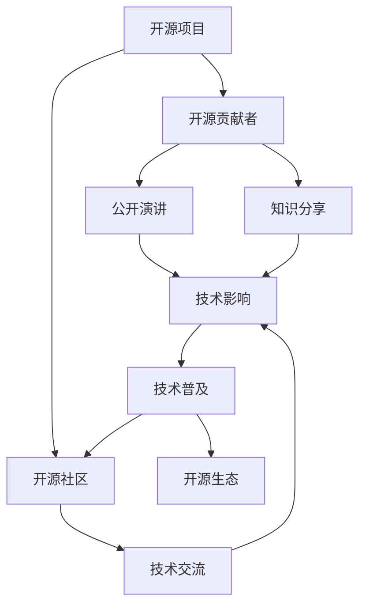

                 

## 1. 背景介绍

在人工智能领域，开源已经成为推动技术进步和普及的重要力量。越来越多的开发者和研究者选择通过开源方式共享代码、数据和模型，以实现技术的共同进步。公开演讲和知识分享作为开源生态的重要组成部分，不仅是展示研究成果和经验的绝佳平台，也是促进学术交流和技术交流的重要渠道。本文将深入探讨如何利用开源影响力进行公开演讲和知识分享，旨在帮助读者更好地理解这一重要实践，并利用其提升自身技术水平和行业影响力。

### 1.1 问题由来

在过去十年间，开源社区的迅猛发展，为技术创新和应用普及提供了强大动力。开源项目如Linux、Apache、TensorFlow等，已经成为全球软件开发和技术创新的基石。开源项目的成功，离不开全球技术社区的积极参与和贡献，更离不开那些乐于分享、勇于探索的开源贡献者。公开演讲和知识分享，正是这些开源贡献者展示其思想、技术和经验的重要手段。

### 1.2 问题核心关键点

开源影响力通过公开演讲和知识分享得以展现，其核心在于将技术知识转化为易于理解、易于传播的信息。这需要演讲者具备深厚的技术功底，同时具备良好的表达能力和互动技巧。利用开源影响力进行公开演讲和知识分享，不仅能够提升个人品牌和技术影响力，还能为开源项目和社区的持续发展注入新的活力。

## 2. 核心概念与联系

### 2.1 核心概念概述

- **开源 (Open Source)**：一种软件开发模式，鼓励开发者共享代码、文档、工具等资源，实现共同进步。开源项目通常是社区驱动，依赖于广泛的贡献者参与。

- **公开演讲 (Public Speaking)**：以口头形式向听众传递信息、分享经验、展示研究成果的过程。良好的公开演讲需要准备充分、逻辑清晰、互动良好。

- **知识分享 (Knowledge Sharing)**：通过各种方式（如演讲、博客、视频等）传播和交流技术知识和经验，促进技术交流和共同进步。

- **开源社区 (Open Source Community)**：由志同道合的开源贡献者组成的社区，共享资源、协作开发、交流思想。开源社区是技术创新的源泉，也是知识分享的平台。

- **技术影响 (Technical Influence)**：个人或团队在技术领域内的影响力和地位，通常体现在技术贡献、项目贡献、社区影响力等方面。

这些核心概念之间紧密联系，构成开源影响力进行公开演讲和知识分享的基础框架。开源社区的壮大和技术的普及，离不开技术贡献者积极的公开演讲和知识分享。

### 2.2 核心概念原理和架构的 Mermaid 流程图

这个流程图展示了开源影响力的传递路径：开源项目需要开源贡献者的积极参与，而开源贡献者通过公开演讲和知识分享，提升了技术影响力和社区影响力，进而推动开源生态的繁荣和技术普及。

## 3. 核心算法原理 & 具体操作步骤

### 3.1 算法原理概述

基于开源影响力的公开演讲和知识分享，其核心在于如何高效、准确地传达技术信息。这涉及到多个方面的内容，包括演讲稿撰写、演讲技巧、互动技巧等。本文将从算法原理和操作步骤两个层面，详细阐述如何进行有效的公开演讲和知识分享。

### 3.2 算法步骤详解

#### 步骤 1: 演讲稿撰写

- **目标定位**：明确演讲目标和受众，确定要传达的核心信息。
- **内容结构**：构建清晰的演讲结构，通常包括引言、主体、结论三个部分。
- **内容充实**：填充具体案例和数据，使得演讲内容丰富、有说服力。
- **语言表达**：使用通俗易懂、生动形象的语言，使技术内容易于理解。

#### 步骤 2: 演讲技巧训练

- **熟悉主题**：对演讲内容进行深入理解，确保能够流畅表达。
- **练习表达**：通过模拟演讲、录音回放等方式，不断改进表达方式。
- **互动技巧**：使用问答、小组讨论等方式，提升与听众的互动效果。

#### 步骤 3: 知识分享传播

- **多种形式**：利用博客、视频、社交媒体等多种形式，传播技术知识和经验。
- **利用平台**：选择合适的网络平台（如GitHub、Medium、Bilibili等），最大化传播效果。
- **持续更新**：保持内容的时效性和互动性，持续更新和完善。

### 3.3 算法优缺点

#### 优点

- **高效传播**：通过多种形式传播，可以快速覆盖大量受众。
- **互动性强**：公开演讲和知识分享能够直接与受众互动，提升传播效果。
- **多样性**：多种形式的知识分享，满足不同受众的需求。

#### 缺点

- **时间和精力投入**：准备和执行公开演讲和知识分享需要大量的时间和精力。
- **质量要求高**：无论是演讲还是知识分享，质量要求高，需要不断精进。

### 3.4 算法应用领域

开源影响力的公开演讲和知识分享，广泛适用于技术交流、社区建设、学术会议等多个领域。具体应用包括：

- **开源项目展示**：利用公开演讲和知识分享，展示开源项目的技术优势和应用案例。
- **技术培训和教育**：通过公开演讲和知识分享，传授技术知识和经验，提升社区成员的技术水平。
- **学术会议和研讨会**：在学术会议上展示研究成果，促进学术交流和技术创新。

## 4. 数学模型和公式 & 详细讲解 & 举例说明

### 4.1 数学模型构建

公开演讲和知识分享的数学模型可以简单表示为：

$$
\text{Effectiveness} = \text{Content Quality} \times \text{Presentation Skills} \times \text{Interactive Activities}
$$

其中，Content Quality指演讲稿的质量，Presentation Skills指演讲技巧，Interactive Activities指互动活动的效果。

### 4.2 公式推导过程

假设Content Quality为常数C，Presentation Skills为常数P，Interactive Activities为常数I，则公式可以简化为：

$$
\text{Effectiveness} = C \times P \times I
$$

通过公式可以看出，提高公开演讲和知识分享的效果，需要从内容、技巧和互动三个方面同时优化。

### 4.3 案例分析与讲解

以TensorFlow社区为例，社区通过定期的公开演讲和技术分享会，吸引了大量技术爱好者和贡献者参与。社区成员通过分享各自的研究成果、技术经验，提升了TensorFlow在NLP、计算机视觉等领域的广泛应用。同时，社区内部的知识分享也使得新成员能够快速上手TensorFlow，提高了社区的技术普及和影响力。

## 5. 项目实践：代码实例和详细解释说明

### 5.1 开发环境搭建

公开演讲和知识分享的核心不在于代码实现，而在于演讲技巧和知识表达。然而，良好的演讲和知识分享，也依赖于一些技术工具的支持，如Google幻灯片、Zoom、YouTube等。

### 5.2 源代码详细实现

对于公开演讲和知识分享，代码实现通常不需要。但在一些高级演讲和知识分享平台，如Medium、SlideShare等，可以通过编程实现内容自动生成和交互功能。以Medium为例，可以通过API接口，利用编程语言（如Python）实现文章的自动发布和更新。

### 5.3 代码解读与分析

公开演讲和知识分享的核心在于演讲技巧和内容表达，而非代码实现。在实际应用中，利用这些技术工具，可以实现高效、准确、全面的知识传播。但需要注意的是，技术工具的选择和使用，需要与演讲内容和受众相匹配，才能达到最佳效果。

### 5.4 运行结果展示

运行结果展示通常依赖于演讲和知识分享的反馈效果。可以通过问卷调查、互动评分等方式，评估公开演讲和知识分享的效果。例如，利用Google表单进行受众调查，了解受众对演讲内容的接受度和反馈意见。

## 6. 实际应用场景

### 6.1 开源项目展示

开源项目展示是利用开源影响力的重要场景之一。通过公开演讲和知识分享，展示开源项目的最新进展和应用案例，可以吸引更多开发者和贡献者加入项目，提升项目的知名度和影响力。

### 6.2 技术培训和教育

技术培训和教育是提升社区成员技术水平的重要途径。通过公开演讲和知识分享，传递技术知识和经验，能够有效提升社区成员的技术能力，促进社区的技术创新和应用普及。

### 6.3 学术会议和研讨会

学术会议和研讨会是展示研究成果、交流学术思想的重要平台。通过公开演讲和知识分享，能够提升论文和项目的知名度，促进学术交流和技术合作。

### 6.4 未来应用展望

未来，开源影响力的公开演讲和知识分享将进一步扩展到更多领域。例如，利用虚拟现实技术，进行远程演讲和互动，提升知识传播的覆盖面和互动效果。同时，基于人工智能的推荐系统，可以更精准地推荐技术内容和互动活动，提高知识分享的个性化和互动性。

## 7. 工具和资源推荐

### 7.1 学习资源推荐

- **开源社区资源**：如GitHub、Apache、TensorFlow等社区，提供丰富的开源项目和文档，学习开源贡献的最佳实践。
- **技术博客和文章**：Medium、博客园、CSDN等平台，提供了大量技术文章和案例，帮助学习者快速上手开源项目。
- **在线课程和视频**：Coursera、Udacity、Bilibili等平台，提供丰富的技术课程和视频，学习开源项目的实现细节。

### 7.2 开发工具推荐

- **公共演讲工具**：如Google幻灯片、Microsoft PowerPoint、Keynote等，用于准备和展示演讲内容。
- **互动工具**：如Zoom、Microsoft Teams、Slido等，提升演讲和知识分享的互动效果。
- **知识分享平台**：如Medium、博客园、CSDN等，提供内容发布和分享功能。

### 7.3 相关论文推荐

- **开源影响力研究**：如《Open Source Software: Social, Cultural, and Economic Foundations》，了解开源社区的运作机制和发展历程。
- **演讲技巧研究**：如《Mastering Public Speaking: A Self-Help Guide》，学习演讲技巧和知识传播的最佳实践。
- **技术交流研究**：如《Crossing the Chasm: Innovators, Early Adopters, and the Metamorphosis of Markets》，了解技术从技术极客到大众用户的跨越过程。

## 8. 总结：未来发展趋势与挑战

### 8.1 研究成果总结

开源影响力的公开演讲和知识分享，已经成为推动技术进步和普及的重要手段。通过不断的公开演讲和知识分享，开源社区不仅提升了自身的影响力，也推动了技术的快速发展和应用普及。

### 8.2 未来发展趋势

未来，开源影响力的公开演讲和知识分享将进一步普及和深化。例如，利用人工智能技术，实现内容自动生成和推荐，提升知识分享的效率和效果。同时，开源社区也将更加注重技术交流和文化建设，提升社区成员的参与感和归属感。

### 8.3 面临的挑战

尽管开源影响力的公开演讲和知识分享已经取得了显著成果，但在推广和普及过程中，仍面临诸多挑战：

- **时间与精力投入**：准备和执行公开演讲和知识分享需要大量的时间和精力。
- **受众反馈和互动**：如何提升演讲和知识分享的互动效果，吸引更多受众参与，是一个重要挑战。
- **内容质量和多样性**：如何提升演讲和知识分享的内容质量和多样性，满足不同受众的需求，是一个长期任务。

### 8.4 研究展望

未来，开源影响力的公开演讲和知识分享需要进一步探索和优化。例如：

- **利用AI技术**：利用人工智能技术，提升内容的自动生成和推荐能力，提高知识分享的效率和效果。
- **跨领域融合**：结合其他领域（如教育、文化、艺术等）的实践经验，推动开源影响力的普及和深化。
- **社区文化建设**：通过文化建设，提升社区成员的参与感和归属感，促进社区的持续发展。

总之，开源影响力的公开演讲和知识分享，已经成为推动技术进步和普及的重要手段。通过不断的实践和探索，相信这一手段将为技术社区和开源项目带来更多的创新和活力，推动技术进步，服务人类社会。

## 9. 附录：常见问题与解答

**Q1：公开演讲和知识分享的核心是什么？**

A: 公开演讲和知识分享的核心在于高效、准确地传达技术信息。这需要演讲者具备深厚的技术功底，同时具备良好的表达能力和互动技巧。

**Q2：如何提升公开演讲和知识分享的效果？**

A: 提升公开演讲和知识分享的效果，需要从内容、技巧和互动三个方面同时优化。具体措施包括：
- 深入理解演讲内容，确保能够流畅表达。
- 使用通俗易懂、生动形象的语言，使技术内容易于理解。
- 利用互动工具，提升与听众的互动效果。

**Q3：开源社区如何利用公开演讲和知识分享？**

A: 开源社区可以通过公开演讲和知识分享，展示开源项目的技术优势和应用案例，吸引更多开发者和贡献者加入项目，提升项目的知名度和影响力。同时，社区内部的知识分享也可以提高成员的技术水平，促进社区的技术创新和应用普及。

**Q4：如何克服公开演讲和知识分享面临的挑战？**

A: 公开演讲和知识分享面临的挑战包括时间与精力投入、受众反馈和互动、内容质量和多样性等方面。克服这些挑战的措施包括：
- 利用技术工具，提升内容生成和传播效率。
- 结合跨领域经验，提升内容质量和互动效果。
- 加强社区文化建设，提升社区成员的参与感和归属感。

总之，开源影响力的公开演讲和知识分享，已经成为推动技术进步和普及的重要手段。通过不断的实践和探索，相信这一手段将为技术社区和开源项目带来更多的创新和活力，推动技术进步，服务人类社会。

---

作者：禅与计算机程序设计艺术 / Zen and the Art of Computer Programming

