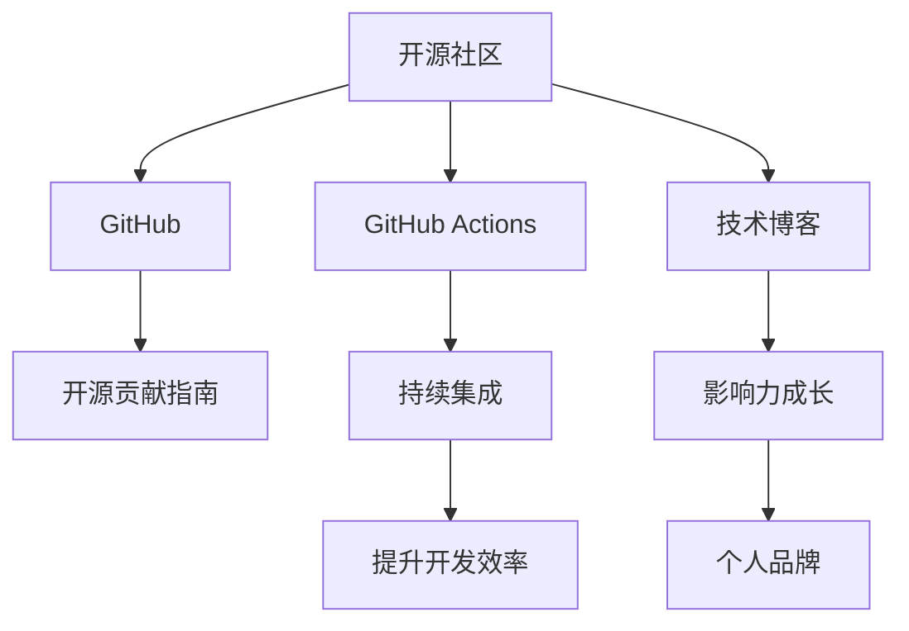

                 

# 利用开源贡献建立个人品牌和影响力

> 关键词：开源贡献, 个人品牌, 社区影响力, GitHub, 技术博客, 开源项目, 贡献指南, 影响力成长

## 1. 背景介绍

### 1.1 问题由来

在技术驱动的今天，开源社区成为了全球开发者获取知识、分享经验、实现创新的重要平台。贡献开源项目不仅可以帮助解决实际问题，还能够提升个人品牌和影响力。然而，如何有效地利用开源贡献提升自己的价值，是许多开发者面临的挑战。本文将深入探讨开源贡献对个人品牌和影响力的建立，提供具体的操作方法和案例分析，帮助开发者实现从默默无闻到引领社区的飞跃。

### 1.2 问题核心关键点

开源贡献的核心理念是通过共享知识、合作开发和持续创新，推动技术的进步和社区的发展。个人在开源社区中的影响力主要体现在以下几个方面：

- **贡献质量与数量**：高质量的代码和深入的文档可以提升个人在社区中的声誉。
- **项目选择与参与度**：选择有影响力的项目并积极参与，能够提高个人在社区中的可见度。
- **沟通与协作**：积极与社区成员沟通，贡献建设性的意见和建议，可以提升个人的领导力和协调能力。
- **影响力与激励**：通过教育和培训、演讲和写作等方式，分享知识和经验，激励更多开发者加入开源社区。

### 1.3 问题研究意义

通过深入分析开源贡献的策略和技巧，本文旨在：

1. **明确方向**：指导开发者如何选择和参与开源项目，提升贡献质量。
2. **提升效率**：提供实用的工具和资源，帮助开发者高效完成代码提交和文档撰写。
3. **扩大影响**：介绍如何在开源社区中建立和维护个人品牌，获得更大的影响力。

## 2. 核心概念与联系

### 2.1 核心概念概述

为更好地理解开源贡献如何建立个人品牌和影响力，本节将介绍几个关键概念：

- **开源社区**：基于开放源代码的软件开发平台，开发者可以通过协作和贡献推动技术进步。
- **GitHub**：全球最大的开源社区平台，提供了丰富的工具和资源，支持代码托管、版本控制和项目管理。
- **GitHub Actions**：GitHub提供的工作流自动化平台，支持持续集成和持续部署，提升开发效率。
- **技术博客**：开发者通过撰写技术博客，分享经验和见解，提升个人在社区中的影响力。
- **开源贡献指南**：详细的贡献流程和规范，帮助开发者高效贡献代码和文档。
- **影响力成长**：通过持续的贡献和学习，建立和维护个人品牌，获得更大影响力。

这些核心概念之间的逻辑关系可以通过以下Mermaid流程图来展示：



这个流程图展示的开源贡献关键概念及其之间的关系：

1. 开源社区通过GitHub等平台提供协作和贡献的环境。
2. GitHub Actions支持持续集成和持续部署，提升开发效率。
3. 技术博客是开发者分享经验和提升影响力的重要渠道。
4. 开源贡献指南帮助开发者高效贡献代码和文档。
5. 影响力成长通过持续的贡献和学习，建立和维护个人品牌。

## 3. 核心算法原理 & 具体操作步骤

### 3.1 算法原理概述

开源贡献的算法原理主要围绕以下几个方面展开：

- **版本控制**：利用Git等工具进行代码版本管理，确保贡献的代码可以被追踪和回溯。
- **持续集成**：通过GitHub Actions等平台，自动化执行测试和构建，确保贡献的代码质量。
- **文档撰写**：使用Markdown等工具编写和维护文档，提升代码的可读性和易用性。
- **社区互动**：积极参与社区讨论，贡献建设性意见，建立良好的人际关系。

### 3.2 算法步骤详解

开源贡献的具体步骤包括：

1. **选择项目**：选择感兴趣且具有影响力的开源项目。
2. **学习文档**：阅读项目的贡献指南和代码文档，理解项目需求和技术栈。
3. **分支开发**：在项目中创建分支进行开发，编写测试用例和文档。
4. **提交代码**：通过GitHub提交代码，并使用Pull Request（PR）进行代码审查。
5. **参与讨论**：在项目中参与讨论和问题解决，贡献建设性意见。
6. **持续学习**：通过阅读源码、参与社区活动等方式，不断提升自己的技术水平。

### 3.3 算法优缺点

开源贡献具有以下优点：

- **社区资源丰富**：利用社区资源可以快速提升技术能力，积累实践经验。
- **建立人脉网络**：积极参与社区讨论，可以结识众多同行和技术专家。
- **提升影响力**：高质量的贡献和活跃的社区参与，可以提升个人在技术社区中的影响力。

然而，开源贡献也存在一些缺点：

- **时间成本高**：高质量的贡献需要大量的时间和精力。
- **代码质量要求高**：提交的代码需要经过严格的审查和测试。
- **社区文化复杂**：不同社区有不同的文化和规范，需要适应和学习。

### 3.4 算法应用领域

开源贡献在以下几个领域得到了广泛应用：

- **软件开发**：通过贡献开源项目，提升编程能力和项目管理经验。
- **数据科学**：参与数据处理、分析和可视化项目，学习大数据技术和工具。
- **人工智能**：贡献机器学习模型和算法，提升模型构建和调优能力。
- **网络安全**：参与安全漏洞检测和修复，提升网络安全意识和实践能力。

## 4. 数学模型和公式 & 详细讲解 & 举例说明

### 4.1 数学模型构建

为了更好地理解开源贡献的算法原理，我们可以构建一个数学模型来描述代码提交和评论的交互过程。假设有一个开源项目 $P$，有 $N$ 名开发者 $D_1, D_2, ..., D_N$，每个开发者每周提交 $C_i$ 次代码，并对每次提交进行 $R_i$ 次评论。我们可以用以下公式来表示项目在 $T$ 周内的贡献：

$$
\text{总贡献} = \sum_{i=1}^{N} C_i + \sum_{i=1}^{N} R_i \times T
$$

其中，$C_i$ 表示第 $i$ 个开发者的代码提交次数，$R_i$ 表示每次提交的评论次数，$T$ 表示时间周数。

### 4.2 公式推导过程

通过对上述模型的推导，我们可以得出以下结论：

1. **代码提交次数**：开发者的代码提交次数直接影响项目的贡献。
2. **评论次数**：每次代码提交的评论次数也是贡献的重要组成部分。
3. **时间因素**：时间因素对贡献有放大作用，因为评论会随着时间积累。

### 4.3 案例分析与讲解

以GitHub上的TensorFlow项目为例，分析其贡献者对项目的贡献。假设某个贡献者 $D$ 在 $T$ 周内提交了 $C_D$ 次代码，并对每次提交进行了 $R_D$ 次评论。通过分析这些数据，可以得出 $D$ 对项目的贡献值。

## 5. 项目实践：代码实例和详细解释说明

### 5.1 开发环境搭建

在进行开源贡献实践前，我们需要准备好开发环境。以下是使用Git和GitHub进行开源贡献的环境配置流程：

1. 安装Git：从官网下载并安装Git，用于版本控制和代码提交。
2. 创建GitHub账号：在GitHub官网注册账号，创建个人仓库。
3. 安装GitHub Desktop：用于可视化提交代码和进行PR。
4. 配置环境变量：在本地环境配置GitHub账号，以便进行提交和评论。

### 5.2 源代码详细实现

以下是使用Python和GitHub对TensorFlow项目进行贡献的示例代码实现。

1. 克隆TensorFlow项目：

```bash
git clone https://github.com/tensorflow/tensorflow.git
cd tensorflow
```

2. 创建分支：

```bash
git checkout -b my-contrib
```

3. 编写代码和测试用例：

```python
# 在 my-contrib 分支中编写代码
import tensorflow as tf

# 测试代码
def test_contrib():
    pass
```

4. 提交代码：

```bash
git add .
git commit -m "Add new feature"
git push origin my-contrib
```

5. 创建PR：

```bash
gh pr create --title "Add new feature" --body "Implemented a new feature for TensorFlow"
```

6. 等待审查：

```bash
gh pr review --co-author
```

7. 合并代码：

```bash
gh pr merge my-contrib --allow-draft
```

### 5.3 代码解读与分析

让我们再详细解读一下关键代码的实现细节：

**代码提交过程**：
- 使用`git clone`克隆项目，使用`git checkout -b`创建分支。
- 编写代码和测试用例，并使用`git add .`将修改提交到暂存区。
- 使用`git commit -m`提交修改，并使用`git push origin`推送到GitHub。

**PR创建过程**：
- 使用`gh pr create`创建PR，并设置标题和描述。
- 使用`gh pr review`请求社区成员进行审查，并设置`--co-author`增加代码作者。
- 使用`gh pr merge`合并PR，并使用`--allow-draft`允许发布草稿版本。

通过以上步骤，我们可以在GitHub上高效地进行代码贡献和社区互动。

### 5.4 运行结果展示

在完成代码提交和PR后，GitHub会显示PR的状态和审查结果。以下是常见状态：

- **Open**：PR开放，等待社区审查。
- **Draft**：PR为草稿，允许开发者修改和删除。
- **Review Required**：需要进一步审查，开发者可以提交代码审查请求。
- **Merged**：PR被合并，代码已集成到主分支。

## 6. 实际应用场景

### 6.1 社区管理

作为社区管理者，利用开源贡献可以提升社区活跃度和项目质量。具体措施包括：

1. **组织活动**：组织开源项目的技术讨论会和代码贡献活动，吸引更多开发者参与。
2. **维护文档**：通过撰写和维护项目文档，提升项目易用性和可读性。
3. **社区治理**：参与社区决策和规范制定，提升社区治理水平。

### 6.2 企业开源

企业可以利用开源贡献提升品牌影响力和技术实力。具体措施包括：

1. **开源项目支持**：企业可以为开源项目提供技术支持和资金赞助，提升项目的影响力。
2. **员工贡献**：鼓励员工参与开源项目贡献，提升企业在技术社区中的声誉。
3. **开源资源**：将企业的技术资源和工具开源，分享给社区和开发者。

### 6.3 个人职业发展

开源贡献对个人职业发展具有重要意义。具体措施包括：

1. **提升技术能力**：通过参与开源项目，提升编程能力和项目管理经验。
2. **建立人脉网络**：结识社区成员和技术专家，扩大职业圈子。
3. **展示技术成果**：通过GitHub展示自己的技术成果和贡献，吸引雇主注意。

### 6.4 未来应用展望

随着开源社区的不断壮大，开源贡献将在以下几个领域得到更广泛的应用：

1. **跨领域协作**：开源项目将跨越多个技术领域，促进跨学科的合作。
2. **技术标准化**：开源项目将推动技术标准和规范的制定，提升技术一致性。
3. **开发者社区**：开源贡献将形成新的开发者社区，提供更好的学习和交流平台。
4. **开源生态**：开源项目将与其他开源生态（如云服务、硬件设备等）协同发展，形成完整的生态系统。

## 7. 工具和资源推荐

### 7.1 学习资源推荐

为了帮助开发者系统掌握开源贡献的理论基础和实践技巧，这里推荐一些优质的学习资源：

1. **《开源社区指南》**：介绍开源社区的基本概念、贡献流程和社区文化。
2. **《GitHub官方文档》**：详细的GitHub使用手册，包含代码提交、PR审查、项目管理等功能。
3. **《开源项目贡献指南》**：提供具体的代码贡献规范和社区互动技巧。
4. **《开源贡献最佳实践》**：总结了开源贡献中的常见问题和解决方案。
5. **《GitHub Learning Lab》**：GitHub提供的在线学习平台，涵盖Git、GitHub、PR审查等技能。

通过对这些资源的学习实践，相信你一定能够快速掌握开源贡献的精髓，并用于解决实际的社区问题。

### 7.2 开发工具推荐

高效的开发离不开优秀的工具支持。以下是几款用于开源贡献开发的常用工具：

1. **Git**：版本控制工具，支持代码的提交、分支管理、版本回溯等。
2. **GitHub**：代码托管平台，提供丰富的协作和版本控制功能。
3. **GitHub Actions**：自动化工作流平台，支持持续集成和持续部署。
4. **GitHub Desktop**：可视化界面，方便进行代码提交和PR操作。
5. **Jekyll**：用于生成静态网站和博客的工具，方便分享技术博客和文档。

合理利用这些工具，可以显著提升开源贡献的效率和质量。

### 7.3 相关论文推荐

开源贡献的研究始于学界的持续探索。以下是几篇奠基性的相关论文，推荐阅读：

1. **《The Art of Contributing to Open Source》**：介绍开源贡献的基本流程和最佳实践。
2. **《Open Source Software: A Guide for the New Contributor》**：针对新贡献者提供详细的贡献指南。
3. **《Contributing to Open Source: A Practical Guide》**：总结了开源贡献中的常见问题和解决方案。
4. **《Open Source Community Building: A Case Study》**：分享了社区管理的成功案例和经验。
5. **《The Impact of Open Source on Software Evolution》**：分析了开源贡献对软件进化的影响。

这些论文代表了大规模开源贡献研究的发展脉络。通过学习这些前沿成果，可以帮助研究者把握学科前进方向，激发更多的创新灵感。

## 8. 总结：未来发展趋势与挑战

### 8.1 总结

本文对开源贡献的建立个人品牌和影响力进行了全面系统的介绍。首先阐述了开源贡献的重要性和主要影响因素，明确了如何通过高质量的贡献和社区互动提升个人在开源社区中的声誉。其次，从原理到实践，详细讲解了开源贡献的数学模型和具体步骤，提供了详尽的代码实现和运行结果展示。同时，本文还广泛探讨了开源贡献在社区管理、企业开源和个人职业发展中的应用前景，展示了开源贡献的广阔前景。

通过对这些资源的学习实践，相信你一定能够快速掌握开源贡献的精髓，并用于解决实际的社区问题。

### 8.2 未来发展趋势

展望未来，开源贡献将呈现以下几个发展趋势：

1. **社区规模扩大**：随着技术的进步和应用的普及，开源社区的规模将不断扩大，带来更多的贡献机会。
2. **跨领域合作**：开源项目将跨越多个技术领域，促进跨学科的深度合作。
3. **技术标准化**：开源项目将推动技术标准和规范的制定，提升技术一致性和互操作性。
4. **开发者生态**：开源贡献将形成新的开发者生态，提供更好的学习和交流平台。
5. **企业参与**：企业将更加积极参与开源项目，提升其在技术社区中的影响力。
6. **技术透明度**：开源贡献将提升技术透明度和可信度，促进技术共享和合作。

### 8.3 面临的挑战

尽管开源贡献已经取得了显著成就，但在迈向更加智能化、普适化应用的过程中，它仍面临着诸多挑战：

1. **时间管理**：高质量的贡献需要大量的时间和精力，开发者需要合理安排时间。
2. **社区规范**：不同社区有不同的文化和规范，开发者需要适应和学习。
3. **技术门槛**：部分开源项目的技术门槛较高，开发者需要具备一定的技术背景。
4. **项目选择**：选择合适的项目需要充分调研和评估，找到与自身兴趣和技术能力相匹配的项目。
5. **社区互动**：社区互动需要技巧和经验，如何建立良好的人际关系和沟通渠道是关键。

### 8.4 研究展望

面对开源贡献面临的这些挑战，未来的研究需要在以下几个方面寻求新的突破：

1. **社区自动化**：开发自动化的工具和平台，减少开发者的时间和精力投入。
2. **社区规范化**：制定和推广开源社区的标准和规范，提升社区的规范化和可管理性。
3. **开发者培训**：提供系统的培训和教育，提升开发者的技术能力和社区互动技巧。
4. **项目评估**：建立开源项目的评估机制，帮助开发者选择和参与合适的项目。
5. **社区治理**：推动社区治理机制的完善，确保社区的健康发展和良性互动。

这些研究方向的探索，必将引领开源贡献技术迈向更高的台阶，为构建安全、可靠、可解释、可控的智能系统铺平道路。

## 9. 附录：常见问题与解答

**Q1：如何选择适合自己的开源项目进行贡献？**

A: 选择适合自己的开源项目需要考虑以下几个方面：

1. **项目影响力**：选择有影响力的项目，有助于提升个人在社区中的可见度。
2. **项目活跃度**：选择活跃的项目，可以获得更多的社区支持和反馈。
3. **技术栈熟悉度**：选择与自己技术栈相匹配的项目，可以减少学习成本。
4. **个人兴趣**：选择自己感兴趣的领域和项目，保持长期贡献的动力。
5. **社区文化和规范**：了解项目社区的文化和规范，确保自己适应和遵守。

**Q2：如何进行高质量的代码贡献？**

A: 进行高质量的代码贡献需要以下几个步骤：

1. **阅读文档**：详细阅读项目的贡献指南和代码文档，理解项目需求和技术栈。
2. **设计方案**：设计合理的方案，编写详细的测试用例和文档。
3. **代码提交**：使用`git add`、`git commit`和`git push`进行代码提交。
4. **审查反馈**：积极参与社区审查，接受反馈并进行修改。
5. **持续优化**：根据社区反馈持续优化代码和文档。

**Q3：如何在社区中建立和维护个人品牌？**

A: 在社区中建立和维护个人品牌需要以下几个步骤：

1. **贡献质量**：高质量的代码和详细的文档可以提升个人在社区中的声誉。
2. **社区互动**：积极参与社区讨论，贡献建设性意见，建立良好的人际关系。
3. **技术分享**：通过技术博客、演讲等方式分享知识和经验，提升个人影响力。
4. **持续学习**：不断提升自己的技术能力和社区互动技巧，保持持续进步。

通过这些方法，可以逐步建立和维护个人品牌，提升在社区中的影响力和权威性。

**Q4：如何处理开源贡献中的常见问题？**

A: 处理开源贡献中的常见问题需要以下几个步骤：

1. **了解规范**：详细阅读项目的贡献指南和社区规范，了解常见问题和解决方案。
2. **沟通解决**：积极与社区成员沟通，寻求帮助和反馈，共同解决问题。
3. **文档记录**：详细记录问题解决过程和结果，帮助未来处理类似问题。
4. **持续改进**：根据反馈持续改进自己的贡献方式和技巧。

通过这些方法，可以有效处理开源贡献中的常见问题，提升贡献质量和社区互动效果。

---

作者：禅与计算机程序设计艺术 / Zen and the Art of Computer Programming

