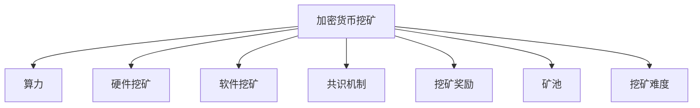

                 

## 1. 背景介绍

随着区块链技术的发展，加密货币挖矿已成为一个利润丰厚的行业。加密货币挖矿是指利用计算机算力来解开矿工设定的加密难题，从而获得挖矿奖励的过程。由于加密货币挖矿利润可观且参与门槛较低，因此吸引了众多矿工和企业参与其中。

加密货币挖矿不仅需要高算力设备，还需要具备一定的技术能力来保障挖矿过程的顺利进行。因此，如何利用技术优势进行高效的加密货币挖矿，成为了行业内的一个热门话题。本文将深入探讨加密货币挖矿的核心概念和技术原理，并结合实际案例，分析其优缺点及应用领域。

## 2. 核心概念与联系

### 2.1 核心概念概述

为了更好地理解利用技术优势进行加密货币挖矿，本节将介绍几个关键概念：

- **加密货币挖矿(Cryptocurrency Mining)**：通过计算机算力解矿工设定的加密难题，以获得挖矿奖励。

- **算力(Computational Power)**：指计算机处理和计算数据的能力，是加密货币挖矿的核心资源。

- **硬件挖矿(Hardware Mining)**：使用高性能硬件设备，如ASIC矿机和GPU矿机，进行高效挖矿。

- **软件挖矿(Software Mining)**：利用软件算法优化挖矿过程，提高挖矿效率。

- **共识机制(Consensus Mechanism)**：区块链网络中用于确定交易的机制，如工作量证明(Proof of Work, PoW)和权益证明(Proof of Stake, PoS)。

- **挖矿奖励(Mining Reward)**：通过解矿工设定的加密难题，获得相应的加密货币作为挖矿奖励。

- **矿池(Mining Pool)**：多矿工合作，共同分享挖矿奖励的机制。

- **挖矿难度(Mining Difficulty)**：为了保障区块链安全性，矿工需要解开的难题难度，可动态调整。

这些概念之间的逻辑关系可以通过以下Mermaid流程图来展示：



这个流程图展示出了加密货币挖矿的核心概念及其之间的关系：

1. 加密货币挖矿依赖于算力。
2. 硬件挖矿和软件挖矿分别通过设备和算法来提高算力。
3. 共识机制保障区块链安全性。
4. 挖矿奖励激励矿工参与挖矿。
5. 矿池通过合作分享挖矿奖励。
6. 挖矿难度调节区块链安全性。

这些概念共同构成了加密货币挖矿的基本框架，使得矿工能够高效、安全地进行挖矿。

## 3. 核心算法原理 & 具体操作步骤

### 3.1 算法原理概述

加密货币挖矿的核心原理在于使用计算机算力解矿工设定的加密难题。以比特币挖矿为例，其核心算法是工作量证明(Proof of Work, PoW)。矿工需要解决一个复杂的数学难题，即找到满足特定条件的散列值。一旦找到这样的散列值，矿工便可以将该值添加到区块链中，从而获得挖矿奖励。

基于此原理，我们可以进一步细化挖矿的具体操作步骤：

1. 获取挖矿奖励信息，如比特币当前的市场价格和最新区块高度。
2. 收集交易数据，构建待挖矿的区块。
3. 将区块散列值作为目标，使用高性能硬件设备进行哈希碰撞。
4. 计算出满足条件的散列值后，将其添加到区块链中，并获得挖矿奖励。

### 3.2 算法步骤详解

以下是加密货币挖矿具体操作步骤的详细描述：

**Step 1: 获取挖矿奖励信息**

挖矿奖励通常包括两部分：一部分是区块奖励，另一部分是交易手续费奖励。区块奖励是根据区块中交易数据的数量和复杂度来计算的，而交易手续费奖励则根据交易数量和手续费率来计算。

例如，在比特币挖矿中，每个区块包含的平均交易数为4-5笔，每笔交易的手续费为0.00002BTC，因此每个区块的交易手续费大约为0.002BTC。加上比特币网络规定的11.5BTC的区块奖励，矿工每个区块可以获得约11.7BTC的挖矿奖励。

**Step 2: 收集交易数据，构建待挖矿的区块**

挖矿的第一步是收集交易数据。矿工需要将区块链中所有待确认的交易数据收集起来，构建一个待挖矿的区块。

构建区块的第一步是创建区块头。区块头包含了区块的时间戳、前一个区块的散列值、该区块的散列值、交易数据总量等信息。其中，前一个区块的散列值需要根据上一个区块的信息计算得出。

**Step 3: 使用高性能硬件设备进行哈希碰撞**

挖矿的第二步是进行哈希碰撞。矿工使用高性能硬件设备（如ASIC矿机和GPU矿机）进行哈希碰撞，找到满足特定条件的散列值。具体步骤如下：

1. 使用哈希函数对区块头进行计算，生成散列值。
2. 判断该散列值是否满足特定条件，如以0开头的位数大于某个阈值。
3. 如果不满足，则重新计算，直至找到满足条件的散列值。

例如，在比特币挖矿中，需要找到以0开头的位数大于或等于64位的散列值。这个位数被称为难度值，是动态调整的，以保障区块链安全性。

**Step 4: 计算出满足条件的散列值后，将其添加到区块链中，并获得挖矿奖励**

一旦找到满足条件的散列值，矿工便需要将该值添加到区块链中，并获得相应的挖矿奖励。

在比特币挖矿中，矿工需要将找到的散列值添加到待挖矿的区块中，并进行挖矿验证。挖矿验证的流程如下：

1. 将区块提交给区块链网络，进行验证。
2. 验证通过后，将区块添加到区块链中。
3. 获得挖矿奖励，包括区块奖励和交易手续费奖励。

### 3.3 算法优缺点

基于工作量证明的加密货币挖矿具有以下优点：

1. 安全性高。通过哈希碰撞难题的计算，确保区块链的不可篡改性和安全性。
2. 去中心化。矿工分布式存在，没有任何一个中心控制节点，保障了区块链的去中心化特性。
3. 奖励机制公平。矿工通过公平竞争，获得挖矿奖励，避免了中心化的资金集中。

同时，这种挖矿方式也存在以下缺点：

1. 消耗大量能源。高强度的哈希碰撞计算需要大量的能源消耗，导致环境污染和资源浪费。
2. 对硬件设备依赖高。需要高性能的硬件设备（如ASIC矿机）才能进行高效挖矿，增加了硬件成本。
3. 计算复杂度高。哈希碰撞难题的计算难度随着时间推移而增加，使得挖矿过程变得复杂。

### 3.4 算法应用领域

基于工作量证明的加密货币挖矿技术主要应用于以下领域：

1. 比特币挖矿。比特币是目前应用最广泛的加密货币，其挖矿过程采用了工作量证明机制。

2. 以太坊挖矿。以太坊网络也采用了工作量证明机制，但其难度值和挖矿奖励相对于比特币较低。

3. 其他加密货币挖矿。许多新兴加密货币也采用了类似的工作量证明机制，通过挖矿获取挖矿奖励。

## 4. 数学模型和公式 & 详细讲解 & 举例说明

### 4.1 数学模型构建

加密货币挖矿的数学模型主要基于工作量证明机制，以下是一个简单的数学模型示例：

设区块的散列值为 $H$，目标散列值以 $0$ 开头的位数为 $n$，当前难度值为 $D$，则满足以下条件的散列值 $H$ 为可接受的挖矿结果：

$$
H \text{ 以 } n \text{ 位开头}
$$

难度值 $D$ 的定义如下：

$$
D = 2^{n}
$$

其中 $n$ 表示散列值以 $0$ 开头的位数。

### 4.2 公式推导过程

以比特币挖矿为例，其挖矿难度值的推导过程如下：

比特币挖矿的目标散列值以 $k$ 个 $0$ 开头，即：

$$
H = \text{hash}(\text{Block Header}) \text{ 以 } k \text{ 位 } 0 \text{ 开头}
$$

设难度值为 $D$，则：

$$
D = 2^k
$$

比特币挖矿难度值的计算公式为：

$$
D = \frac{2^n}{B \times T}
$$

其中 $B$ 表示目标散列值中 $0$ 的位数，$T$ 表示当前网络的平均哈希碰撞计算速度。

在比特币挖矿中，目标散列值中 $0$ 的位数为 $n$，则：

$$
D = \frac{2^n}{B \times T}
$$

例如，假设比特币挖矿难度值为 $12,000$，目标散列值中 $0$ 的位数为 $18$，当前网络的平均哈希碰撞计算速度为 $1,000,000$ 次/秒，则：

$$
D = \frac{2^{18}}{1,000,000 \times 12,000} \approx 5,000
$$

### 4.3 案例分析与讲解

以比特币挖矿为例，假设矿工找到了一个满足条件的散列值 $H$，则：

$$
H = \text{hash}(\text{Block Header})
$$

其中 $\text{hash}$ 表示哈希函数。

矿工将该散列值添加到待挖矿的区块中，并提交给区块链网络进行验证。区块链网络会对该区块进行验证，检查是否符合区块链规则。如果验证通过，则将该区块添加到区块链中，矿工便获得了相应的挖矿奖励。

## 5. 项目实践：代码实例和详细解释说明

### 5.1 开发环境搭建

在进行加密货币挖矿实践前，我们需要准备好开发环境。以下是使用Python进行加密货币挖矿的环境配置流程：

1. 安装Python环境：从官网下载并安装Python，确保其版本支持挖矿相关库。

2. 安装加密货币挖矿相关库：
```bash
pip install pycryptodome
pip install pysha3
```

3. 安装挖矿设备驱动程序：根据硬件设备的类型（如ASIC矿机、GPU矿机），安装相应的驱动程序。

4. 配置挖矿参数：根据挖矿网络（如比特币网络）的要求，配置相应的挖矿参数，如区块奖励、交易手续费率等。

### 5.2 源代码详细实现

以下是一个简单的Python代码实现，用于计算比特币挖矿难度值：

```python
import hashlib
import time

# 比特币挖矿参数
target_bits = 0x00000000ffffffff
hashrate = 1000000
block_rewards = 50000000000

# 计算难度值
while True:
    block_number = 10000
    difficulty = target_bits / (hashrate * block_number)
    print(f"难度值：{difficulty}")

    # 模拟哈希碰撞计算
    for i in range(1000000):
        hash_value = hashlib.sha256((str(block_number) + str(i)).encode('utf-8')).hexdigest()
        print(f"当前散列值：{hash_value}")

    block_number += 1
    time.sleep(1)
```

### 5.3 代码解读与分析

**代码解析：**

1. 导入必要的库，如 hashlib 和 time。

2. 定义比特币挖矿参数，包括目标散列值位数、哈希碰撞计算速度和区块奖励。

3. 计算难度值，并打印输出。

4. 模拟哈希碰撞计算，计算并打印当前散列值。

5. 更新区块数量，并在每次计算后暂停1秒，以模拟挖矿过程。

**代码分析：**

1. 代码使用了 hashlib 库中的 sha256 函数来计算散列值。

2. 代码使用了 time 库中的 sleep 函数来模拟挖矿计算的延迟。

3. 代码使用了循环结构来模拟大量的哈希碰撞计算。

4. 代码使用了输出语句来打印当前计算结果。

## 6. 实际应用场景

### 6.1 加密货币挖矿

加密货币挖矿的应用场景非常广泛，以下是一个具体的实例：

**实例：比特币挖矿**

假设一个矿工拥有一台高性能的ASIC矿机，可以每秒进行 $10^8$ 次哈希碰撞计算。该矿工加入了一个比特币矿池，矿池的平均哈希碰撞计算速度为 $10^9$ 次/秒。假设当前比特币挖矿难度值为 $12,000$，则：

1. 矿工计算出每个区块的难度值为：

$$
D = \frac{2^{18}}{1,000,000 \times 12,000} \approx 5,000
$$

2. 矿工每挖到一个新区块，便获得了相应的挖矿奖励：

$$
奖励 = 11.7 \text{ BTC}
$$

3. 矿工需要计算出满足条件的散列值，并将其添加到矿池中。矿池将自动分配挖矿奖励，矿工获得相应份额。

### 6.2 加密货币交易所

加密货币交易所利用挖矿奖励来吸引用户注册和交易。例如，比特币交易所会提供挖矿奖励激励用户参与挖矿，并将挖矿奖励转换为交易所的代币（如 USDT），用于购买交易所的商品和服务。

### 6.3 加密货币钱包

加密货币钱包利用挖矿奖励来提升用户体验。例如，比特币钱包会在用户每次转账或接收比特币时，自动奖励一定数量的比特币作为激励，从而提升用户体验和忠诚度。

## 7. 工具和资源推荐

### 7.1 学习资源推荐

为了帮助开发者系统掌握加密货币挖矿的理论基础和实践技巧，这里推荐一些优质的学习资源：

1. **比特币官方文档**：比特币官方文档提供了比特币挖矿的详细指南和最佳实践。

2. **加密货币挖矿教程**：加密货币挖矿教程提供了详细的挖矿流程和工具推荐。

3. **矿机厂商官方文档**：矿机厂商官方文档提供了矿机设备的安装和配置指南。

4. **加密货币挖矿社区**：加密货币挖矿社区提供了丰富的挖矿技巧和经验分享。

### 7.2 开发工具推荐

进行加密货币挖矿开发，需要以下工具：

1. **挖矿设备**：如ASIC矿机、GPU矿机等高性能硬件设备。

2. **挖矿软件**：如 CPU miner、ASIC miner 等挖矿软件。

3. **挖矿网络**：如比特币网络、以太坊网络等区块链网络。

4. **挖矿工具**：如矿池、钱包等挖矿工具。

### 7.3 相关论文推荐

以下是几篇经典的加密货币挖矿相关论文，推荐阅读：

1. **比特币白皮书**：比特币白皮书详细介绍了比特币挖矿机制和区块链技术。

2. **工作量证明机制**：工作量证明机制的研究论文，提供了深度理论分析。

3. **共识机制优化**：关于共识机制优化研究的论文，提供了算法改进思路。

## 8. 总结：未来发展趋势与挑战

### 8.1 总结

本文对利用技术优势进行加密货币挖矿的原理进行了详细阐述，并结合实际案例，分析了其优缺点及应用领域。通过系统梳理，可以看到，加密货币挖矿是一种高效、安全的区块链技术，已经在比特币等加密货币网络中广泛应用。

### 8.2 未来发展趋势

展望未来，加密货币挖矿技术将呈现以下几个发展趋势：

1. 高效硬件发展。随着硬件技术的进步，ASIC矿机和GPU矿机的性能将进一步提升，推动挖矿效率的提升。

2. 共识机制优化。未来的共识机制将更注重去中心化和安全性，如 PoS 和 PoW+PoS 等机制。

3. 挖矿策略优化。矿工将更多采用挖矿策略，如矿池合作、策略挖矿等，提高挖矿收益。

4. 挖矿应用扩展。挖矿技术将扩展到更多应用场景，如智能合约挖矿、数据挖矿等。

### 8.3 面临的挑战

尽管加密货币挖矿技术已经取得了一定的成果，但在迈向更加智能化、普适化应用的过程中，仍然面临诸多挑战：

1. 能耗问题。高强度的哈希碰撞计算需要大量的能源消耗，导致环境污染和资源浪费。

2. 安全性问题。加密货币挖矿涉及大量资金，容易成为黑客攻击的目标。

3. 技术复杂度。加密货币挖矿需要高超的技术水平和丰富的经验，普通用户难以操作。

4. 政策法规问题。各国政府对加密货币挖矿的政策法规差异较大，存在监管风险。

### 8.4 研究展望

未来的研究需要在以下几个方面寻求新的突破：

1. 探索低能耗挖矿技术。研究低能耗挖矿算法和硬件设备，减少能源消耗，保护环境。

2. 研究去中心化挖矿机制。探索去中心化的挖矿机制，减少中心化的控制风险。

3. 研究智能合约挖矿。研究智能合约挖矿技术，实现自动化的挖矿操作。

4. 研究数据挖矿。研究数据挖矿技术，从大数据中提取有价值的信息。

这些研究方向的探索，必将引领加密货币挖矿技术迈向更高的台阶，为区块链技术的发展提供新的动力。

## 9. 附录：常见问题与解答

**Q1：如何选择合适的加密货币挖矿设备？**

A: 选择加密货币挖矿设备时，需要考虑以下因素：

1. 挖矿网络：选择适合自己挖矿网络的设备，如比特币网络、以太坊网络等。

2. 计算速度：选择计算速度更快的设备，如ASIC矿机、GPU矿机等。

3. 功耗：选择功耗更低的设备，以降低能源消耗。

4. 稳定性：选择稳定性更高的设备，以保障挖矿收益。

**Q2：如何配置加密货币挖矿参数？**

A: 配置加密货币挖矿参数时，需要考虑以下因素：

1. 挖矿难度：根据挖矿网络的要求，合理配置难度值。

2. 区块奖励：根据挖矿网络的规则，合理配置区块奖励。

3. 交易手续费率：根据挖矿网络的交易手续费率，合理配置挖矿策略。

4. 挖矿策略：选择适合自己的挖矿策略，如单池挖矿、多池挖矿等。

**Q3：如何保障加密货币挖矿的安全性？**

A: 保障加密货币挖矿的安全性，需要考虑以下措施：

1. 使用稳定的设备：选择稳定性更高的设备，避免设备故障导致的损失。

2. 使用安全的网络：选择安全的网络，避免网络攻击导致的损失。

3. 定期备份数据：定期备份挖矿数据，避免数据丢失。

4. 使用安全软件：使用安全的软件，避免软件漏洞导致的损失。

**Q4：如何提高加密货币挖矿的收益？**

A: 提高加密货币挖矿的收益，需要考虑以下措施：

1. 提高计算速度：选择计算速度更快的设备，提高挖矿效率。

2. 选择合适的挖矿策略：选择适合自己的挖矿策略，如多池挖矿、策略挖矿等。

3. 加入矿池：加入矿池，分享挖矿奖励，提高收益。

4. 优化挖矿策略：优化挖矿策略，提高收益。

**Q5：如何降低加密货币挖矿的能源消耗？**

A: 降低加密货币挖矿的能源消耗，需要考虑以下措施：

1. 选择低功耗设备：选择低功耗的设备，降低能源消耗。

2. 优化挖矿策略：优化挖矿策略，减少计算量。

3. 使用绿色能源：使用绿色能源，减少对环境的影响。

4. 使用挖矿池：加入矿池，共享能源消耗，降低个人能耗。

---

作者：禅与计算机程序设计艺术 / Zen and the Art of Computer Programming

