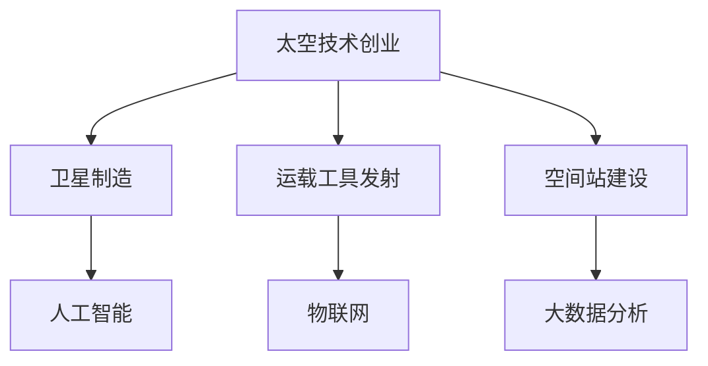

                 

## 1. 背景介绍

### 1.1 问题由来

太空技术创业，是近年来科技界和创业领域的一股热潮。通过运用先进的技术手段，这些创业公司旨在提供商业化太空服务，如卫星制造、运载工具发射、空间站建设等。这些服务不仅对军事、科研有重大意义，还对商业、娱乐等行业产生广泛影响。

随着人类对太空的探索兴趣日益浓厚，太空技术创业市场逐渐兴起。其技术背景包括卫星通信技术、遥感技术、人工智能、物联网、大数据分析等。本文将从技术角度分析太空技术创业的核心概念和原理，以期为创业者提供理论支持和实践指导。

### 1.2 问题核心关键点

太空技术创业的核心在于如何将技术优势转化为商业价值。技术研发需要高额投入，只有高效转化为实际应用，才能实现盈利和可持续发展。本文将详细分析太空技术创业中涉及的关键技术和策略。

## 2. 核心概念与联系

### 2.1 核心概念概述

为更好地理解太空技术创业，本节将介绍几个密切相关的核心概念：

- **太空技术创业**：以先进的太空技术为依托，提供商业化太空服务，如卫星制造、运载工具发射、空间站建设等。
- **卫星制造**：利用先进的材料科学、微电子技术等，制造高性能卫星，如通信卫星、遥感卫星等。
- **运载工具发射**：使用新型运载工具，如火箭、无人机、太空舱等，将卫星等载荷运送至预定轨道。
- **空间站建设**：建造和维护太空站，进行科学实验、太空旅游等活动。
- **人工智能在太空技术中的应用**：包括自动驾驶、异常检测、数据分析等，提升太空任务的执行效率和安全性。
- **物联网在太空技术中的应用**：实现卫星、地面设备、人员等的实时互联互通，提高管理效率。
- **大数据分析**：通过分析海量数据，提升决策准确性和运营效率，如太空天气预测、故障诊断等。

这些核心概念之间的逻辑关系可以通过以下Mermaid流程图来展示：



这个流程图展示了一系列相关概念及其之间的连接关系。

## 3. 核心算法原理 & 具体操作步骤

### 3.1 算法原理概述

太空技术创业的算法原理主要涉及系统工程和项目管理，以确保项目的顺利实施和技术的有效利用。

核心算法流程包括：

1. **需求分析**：明确创业公司的技术需求，如需要哪种卫星、采用何种发射方式等。
2. **技术评估**：评估现有技术的可行性，包括材料性能、系统可靠性等。
3. **方案设计**：设计满足需求的系统方案，包括技术路线、关键技术点等。
4. **技术验证**：通过模拟测试或小规模试验，验证方案的可行性。
5. **规模化生产**：根据验证结果，进行大规模生产或部署。

### 3.2 算法步骤详解

以下详细介绍太空技术创业的核心算法步骤：

**Step 1: 需求分析**
- 与客户沟通，了解其具体需求和预算。
- 分析市场需求，评估竞争环境和潜在客户群体。
- 明确卫星的功能、性能指标等要求。

**Step 2: 技术评估**
- 搜集现有技术资料，评估技术成熟度和性能。
- 进行技术可行性分析，评估技术风险和成本。
- 寻找合作伙伴，利用外部的技术资源。

**Step 3: 方案设计**
- 确定技术路线，选择合适的卫星类型、发射方式等。
- 设计系统架构，明确各模块的功能和接口。
- 选择关键技术和供应商，签订技术合同。

**Step 4: 技术验证**
- 进行模拟测试，验证技术方案的可行性。
- 进行小规模试验，积累实际经验。
- 根据测试结果调整方案，优化设计。

**Step 5: 规模化生产**
- 确定生产计划，进行大规模生产。
- 进行质量控制，确保产品质量符合标准。
- 建立售后服务体系，提供技术支持。

### 3.3 算法优缺点

太空技术创业的算法具有以下优点：

- 系统化：通过明确的需求分析和方案设计，确保技术应用的方向和效果。
- 高效性：通过技术评估和验证，减少技术风险和资源浪费。
- 可扩展性：可根据市场需求和技术发展，进行灵活调整和升级。

然而，该算法也存在一些缺点：

- 技术复杂度高：涉及多学科交叉，技术难度大。
- 时间周期长：从需求分析到生产部署，需要较长时间。
- 成本高：大规模生产和研发投入较大，资金需求高。

### 3.4 算法应用领域

太空技术创业的算法广泛应用于以下几个领域：

- **卫星制造**：如制造通信卫星、遥感卫星等，采用先进材料和制造工艺。
- **运载工具发射**：如火箭、无人机等，使用高效动力系统和制导系统。
- **空间站建设**：如国际空间站、天宫空间站等，采用模块化设计和自动化技术。
- **地球监测**：如遥感卫星监测气候变化、自然灾害等，使用高分辨率遥感技术和数据分析。
- **科学实验**：如在空间站进行微重力实验、生物实验等，使用先进实验设备和数据分析工具。

## 4. 数学模型和公式 & 详细讲解 & 举例说明

### 4.1 数学模型构建

太空技术创业的数学模型主要涉及系统工程和项目管理。以下是一个简化的模型：

$$
\begin{aligned}
\text{Total Cost} &= \text{Research and Development} + \text{Manufacturing} + \text{Launch Cost} + \text{Maintenance} \\
&= \text{R} + \text{M} + \text{L} + \text{C}
\end{aligned}
$$

其中：
- $\text{R}$ 表示研发成本。
- $\text{M}$ 表示制造和生产成本。
- $\text{L}$ 表示发射成本。
- $\text{C}$ 表示维护和运营成本。

### 4.2 公式推导过程

以发射成本为例，其公式推导如下：

$$
\text{Launch Cost} = \text{Fuel Cost} + \text{Labor Cost} + \text{Launch Vehicle Cost} + \text{Insurance}
$$

其中：
- $\text{Fuel Cost}$ 表示燃料成本。
- $\text{Labor Cost}$ 表示劳动力成本。
- $\text{Launch Vehicle Cost}$ 表示发射器成本。
- $\text{Insurance}$ 表示保险费用。

### 4.3 案例分析与讲解

以SpaceX的星链（Starlink）项目为例：

- **需求分析**：SpaceX的星链项目旨在提供全球互联网覆盖，需要大规模部署卫星。
- **技术评估**：SpaceX采用Falcon 9火箭进行发射，进行技术可行性评估。
- **方案设计**：设计模块化的卫星，进行自动化生产。
- **技术验证**：进行多次小规模试验，验证技术方案。
- **规模化生产**：进行大规模生产，实现全球部署。

SpaceX通过科学的项目管理和技术验证，降低了技术风险，提高了发射效率和成功率。

## 5. 项目实践：代码实例和详细解释说明

### 5.1 开发环境搭建

进行太空技术创业的项目实践，需要以下开发环境：

1. 安装Python：Python是开发太空技术创业项目的主要语言，建议使用最新版本的Python。
2. 安装相关的开发工具：如Jupyter Notebook、Git、Docker等。
3. 安装数据库：如MySQL、PostgreSQL等，用于存储项目数据。

### 5.2 源代码详细实现

以下是一个简化版本的太空技术创业项目代码实现，以星链项目为例：

```python
import numpy as np
from sympy import symbols, Eq, solve

# 定义符号
R, M, L, C = symbols('R M L C')

# 总成本公式
total_cost = R + M + L + C

# 燃料成本
fuel_cost = 100 * 1e6

# 劳动力成本
labor_cost = 50 * 1e6

# 发射器成本
launch_vehicle_cost = 200 * 1e6

# 保险费用
insurance = 30 * 1e6

# 计算总成本
launch_cost = fuel_cost + labor_cost + launch_vehicle_cost + insurance
total_cost_value = total_cost.subs({L: launch_cost})

# 输出结果
print("发射成本：", launch_cost)
print("总成本：", total_cost_value)
```

### 5.3 代码解读与分析

上述代码实现了一个简单的太空技术创业项目成本计算，主要步骤如下：

1. 定义符号：使用Sympy库定义变量，代表不同的成本项。
2. 总成本公式：构建总成本的数学表达式。
3. 具体成本：根据实际数据，计算各项成本的具体数值。
4. 代入计算：将具体成本代入总成本公式，计算出总成本。
5. 输出结果：打印出计算结果。

## 6. 实际应用场景

### 6.1 通信卫星部署

通信卫星是太空技术创业的重要应用场景之一。例如，SpaceX的星链项目通过部署大量低轨卫星，实现全球互联网覆盖。SpaceX的Falcon 9火箭提供低成本、高效的发射方式，显著降低了卫星部署成本。

### 6.2 地球监测与遥感

地球监测是太空技术创业的另一个重要应用场景。例如，NASA的陆地卫星（Landsat）项目，通过部署高分辨率遥感卫星，提供全球地球表面数据，用于环境监测、灾害预测等。

### 6.3 空间站维护与管理

空间站维护与管理是太空技术创业的重要应用场景。例如，SpaceX的星环项目（Starship），旨在提供低成本、高效的太空旅行服务，支持空间站人员的往返。

### 6.4 未来应用展望

未来太空技术创业将呈现以下几个发展趋势：

1. **商业化太空旅游**：太空旅游将成为商业化太空服务的重要组成部分，SpaceX、蓝色起源等公司正在积极探索太空旅游技术。
2. **太空资源开采**：利用太空技术进行小行星、月球等资源的开采，提供能源和材料。
3. **太空基础设施建设**：建设太空基础设施，如太空加油站、太空港等，支持未来的太空探索和商业化应用。
4. **太空科学实验**：在空间站等平台上进行更多的科学实验，推动太空科学的发展。

## 7. 工具和资源推荐

### 7.1 学习资源推荐

为了帮助开发者系统掌握太空技术创业的理论基础和实践技巧，这里推荐一些优质的学习资源：

1. **《太空技术创业指南》**：系统介绍太空技术创业的基本概念、技术和策略，适合初学者阅读。
2. **《星链项目》**：详细讲解SpaceX的星链项目技术实现和商业运营，是太空技术创业的优秀案例。
3. **NASA官网**：提供丰富的太空技术和科学资源，了解最新的太空探索进展。
4. **SpaceX官网**：提供SpaceX的技术和商业化运营信息，学习先进的太空技术创业经验。
5. **Coursera太空技术课程**：提供太空技术相关的在线课程，包括卫星制造、空间站建设、太空旅游等。

通过这些学习资源，相信你一定能够快速掌握太空技术创业的关键技术和策略，为成功创业打下坚实的基础。

### 7.2 开发工具推荐

高效的开发离不开优秀的工具支持。以下是几款用于太空技术创业开发的常用工具：

1. **Jupyter Notebook**：开源的交互式编程环境，支持Python、R等语言，适合数据处理和模型训练。
2. **Git**：版本控制系统，方便团队协作和代码管理。
3. **Docker**：容器化技术，实现应用的无缝部署和管理。
4. **MySQL**：开源关系型数据库，存储和管理项目数据。
5. **AWS**：亚马逊云服务，提供强大的云计算支持，支持数据存储、计算、分析等。

合理利用这些工具，可以显著提升太空技术创业的开发效率，加快创新迭代的步伐。

### 7.3 相关论文推荐

太空技术创业的研究源于学界的持续研究。以下是几篇奠基性的相关论文，推荐阅读：

1. **《星链项目的技术实现》**：介绍SpaceX的星链项目技术实现和运营策略。
2. **《太空旅游的商业化》**：探讨太空旅游的商业化模式和市场前景。
3. **《太空科学实验》**：介绍在空间站等平台进行的科学实验和研究成果。
4. **《太空资源开采技术》**：介绍小行星、月球等资源的开采技术和应用前景。
5. **《太空基础设施建设》**：介绍太空加油站、太空港等基础设施的建设方案和技术挑战。

这些论文代表了大空间技术创业的研究方向。通过学习这些前沿成果，可以帮助研究者把握学科前进方向，激发更多的创新灵感。

## 8. 总结：未来发展趋势与挑战

### 8.1 总结

本文对太空技术创业的算法原理和操作步骤进行了全面系统的介绍。首先阐述了太空技术创业的研究背景和意义，明确了太空技术创业在技术研发、市场应用等方面的重要性。其次，从原理到实践，详细讲解了太空技术创业的数学模型和核心算法步骤，给出了太空技术创业项目开发的完整代码实例。同时，本文还广泛探讨了太空技术创业在多个行业领域的应用前景，展示了太空技术创业的巨大潜力。此外，本文精选了太空技术创业的各类学习资源，力求为读者提供全方位的技术指引。

通过本文的系统梳理，可以看到，太空技术创业以先进技术为依托，通过科学的项目管理和技术验证，能够在多个领域实现商业化应用，带来巨大的经济效益和社会价值。未来，伴随技术的不断发展和应用场景的拓展，太空技术创业必将在更广阔的领域取得更大成功。

### 8.2 未来发展趋势

展望未来，太空技术创业将呈现以下几个发展趋势：

1. **商业化太空旅游**：太空旅游将成为商业化太空服务的重要组成部分，提供低成本、高效的太空旅行服务。
2. **太空资源开采**：利用太空技术进行小行星、月球等资源的开采，提供能源和材料。
3. **太空基础设施建设**：建设太空基础设施，如太空加油站、太空港等，支持未来的太空探索和商业化应用。
4. **太空科学实验**：在空间站等平台上进行更多的科学实验，推动太空科学的发展。
5. **商业化卫星制造和发射**：通过技术进步，降低卫星制造和发射成本，提供更多的商业化服务。

以上趋势凸显了太空技术创业技术的广阔前景。这些方向的探索发展，必将进一步推动太空技术创业的进步，为人类探索宇宙的梦想提供强有力的技术支持。

### 8.3 面临的挑战

尽管太空技术创业技术已经取得了瞩目成就，但在迈向更加智能化、普适化应用的过程中，它仍面临着诸多挑战：

1. **高成本**：太空技术创业需要高额投入，包括技术研发、设备采购、人员培训等。如何控制成本，提高经济效益，将是未来的一大难题。
2. **技术复杂性**：太空技术创业涉及多学科交叉，技术难度大，需要跨领域的知识储备和技术集成。如何整合各种技术资源，形成优势互补，还需进一步探索。
3. **市场竞争**：太空技术创业市场竞争激烈，需要不断创新，保持技术领先地位。如何制定合理的商业战略，扩大市场份额，也是亟待解决的问题。
4. **安全风险**：太空技术创业涉及高空、高风险任务，如火箭发射、空间站建设等，安全问题不容忽视。如何提高系统可靠性，降低事故风险，还需更多技术和管理手段的支持。
5. **法律法规**：太空技术创业涉及复杂的法律法规，如空间条约、商业合同等。如何合法合规运营，保障各方利益，还需深入研究。

### 8.4 研究展望

面对太空技术创业所面临的挑战，未来的研究需要在以下几个方面寻求新的突破：

1. **降低成本**：通过技术进步和创新，降低太空技术创业的高成本问题，提高经济效益。
2. **提升技术可靠性**：通过技术验证和测试，提高系统可靠性，降低事故风险。
3. **加强法律法规研究**：研究太空技术创业的法律合规性，制定合理的商业运营规则。
4. **推动技术集成和融合**：整合各种技术资源，形成优势互补，推动太空技术创业的发展。
5. **引入人工智能和物联网技术**：利用人工智能和物联网技术，提高太空任务的管理效率和智能化水平。

这些研究方向的探索，必将引领太空技术创业技术的进步，为人类探索宇宙的梦想提供强有力的技术支持。

## 9. 附录：常见问题与解答

**Q1: 太空技术创业的难点有哪些？**

A: 太空技术创业的主要难点包括：

1. **高成本**：太空技术创业需要高额投入，包括技术研发、设备采购、人员培训等。
2. **技术复杂性**：太空技术创业涉及多学科交叉，技术难度大，需要跨领域的知识储备和技术集成。
3. **市场竞争**：太空技术创业市场竞争激烈，需要不断创新，保持技术领先地位。
4. **安全风险**：太空技术创业涉及高空、高风险任务，如火箭发射、空间站建设等，安全问题不容忽视。
5. **法律法规**：太空技术创业涉及复杂的法律法规，如空间条约、商业合同等。

**Q2: 如何降低太空技术创业的成本？**

A: 降低太空技术创业的成本可以从以下几个方面入手：

1. **技术创新**：通过技术进步和创新，降低太空技术创业的高成本问题，提高经济效益。
2. **规模化生产**：采用规模化生产方式，降低单次生产成本，提高效率。
3. **降低发射成本**：采用低成本发射器，优化发射流程，降低发射成本。
4. **引入公私合作**：通过公私合作模式，共享资源和技术，降低成本。
5. **法律法规支持**：制定合理的法律法规，保障企业利益，降低法律风险和成本。

**Q3: 太空技术创业的主要挑战是什么？**

A: 太空技术创业的主要挑战包括：

1. **高成本**：太空技术创业需要高额投入，包括技术研发、设备采购、人员培训等。
2. **技术复杂性**：太空技术创业涉及多学科交叉，技术难度大，需要跨领域的知识储备和技术集成。
3. **市场竞争**：太空技术创业市场竞争激烈，需要不断创新，保持技术领先地位。
4. **安全风险**：太空技术创业涉及高空、高风险任务，如火箭发射、空间站建设等，安全问题不容忽视。
5. **法律法规**：太空技术创业涉及复杂的法律法规，如空间条约、商业合同等。

**Q4: 太空技术创业的未来发展趋势是什么？**

A: 太空技术创业的未来发展趋势包括：

1. **商业化太空旅游**：太空旅游将成为商业化太空服务的重要组成部分，提供低成本、高效的太空旅行服务。
2. **太空资源开采**：利用太空技术进行小行星、月球等资源的开采，提供能源和材料。
3. **太空基础设施建设**：建设太空基础设施，如太空加油站、太空港等，支持未来的太空探索和商业化应用。
4. **太空科学实验**：在空间站等平台上进行更多的科学实验，推动太空科学的发展。
5. **商业化卫星制造和发射**：通过技术进步，降低卫星制造和发射成本，提供更多的商业化服务。

**Q5: 如何应对太空技术创业中的安全风险？**

A: 应对太空技术创业中的安全风险可以从以下几个方面入手：

1. **技术验证和测试**：通过技术验证和测试，提高系统可靠性，降低事故风险。
2. **安全管理**：制定严格的安全管理制度，定期进行安全检查和培训。
3. **冗余设计**：采用冗余设计，提高系统的容错能力和可靠性。
4. **事故应对**：制定应急预案，提高事故应急处理能力。
5. **法律法规**：遵循相关法律法规，保障企业利益，降低法律风险。

**Q6: 太空技术创业中的法律法规有哪些？**

A: 太空技术创业中的法律法规主要包括：

1. **《外层空间条约》**：国际空间法的重要组成部分，规范各国在太空中的行为。
2. **《商业太空旅游法》**：规范商业太空旅游的法律框架，保障游客和运营商的权益。
3. **《太空资源开采法》**：规范太空资源开采的法律框架，保护太空资源的合理利用。
4. **《空间站建设法》**：规范空间站建设和运营的法律框架，保障空间站的安全和稳定。
5. **《商业合同法》**：规范商业合同的法律框架，保障合同双方的合法权益。

这些法律法规为太空技术创业提供了法律保障，确保企业在合法合规的框架下运营。

---

作者：禅与计算机程序设计艺术 / Zen and the Art of Computer Programming

