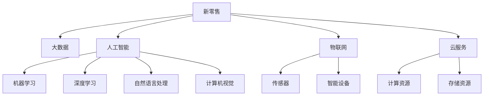

                 

# 利用技术优势进行新零售领域创新

> 关键词：新零售,大数据,人工智能,机器学习,深度学习,物联网,云服务,电子商务,智能客服,供应链优化,个性化推荐,市场营销

## 1. 背景介绍

### 1.1 问题由来
随着互联网的普及和智能设备的增多，零售业进入了一个新纪元——新零售时代。新零售通过融合线上线下资源，结合大数据、人工智能等先进技术，提升零售效率和用户体验，增强市场竞争力。

新零售的核心要素包括：
- 大数据驱动：通过对海量数据的分析和挖掘，洞察消费者行为和市场趋势。
- 人工智能技术：通过机器学习、深度学习等技术，自动化处理海量数据，实现智能化决策。
- 物联网技术：实现线上线下数据互联互通，优化库存管理和物流配送。
- 云服务平台：提供弹性的计算和存储资源，支撑大规模数据分析和智能应用。

尽管新零售概念已经提出多年，但实际落地仍面临诸多挑战。如何充分利用技术优势，创新新零售模式，提升零售效率，仍需深入探索。本文旨在系统介绍新零售领域的关键技术及其应用，希望能为行业从业者提供有价值的参考。

### 1.2 问题核心关键点
新零售的关键在于如何整合线上线下资源，利用大数据、人工智能等技术，实现全渠道运营和精准营销。具体而言，需要解决以下问题：

- 数据融合：如何将线上线下数据整合，实现统一管理和分析。
- 智能推荐：如何根据用户行为和偏好，提供个性化推荐，提升用户体验。
- 库存管理：如何实时监控库存，减少缺货和积压。
- 物流优化：如何通过智能调度，优化物流配送，降低成本和提升效率。
- 市场营销：如何利用数据和算法，精准营销，提升转化率和ROI。

通过本文的系统讲解，希望能帮助读者全面了解新零售领域的技术应用，找到技术创新突破的方向。

## 2. 核心概念与联系

### 2.1 核心概念概述

为更好地理解新零售领域的技术应用，本节将介绍几个核心概念：

- 新零售：结合线上线下资源，通过大数据、人工智能等技术，提升零售效率和用户体验的零售模式。
- 大数据：海量、多源、实时、多样化的数据，用于洞察市场和消费者行为。
- 人工智能：包括机器学习、深度学习、自然语言处理、计算机视觉等技术，用于自动化数据处理和智能决策。
- 物联网：将各类设备、数据中心、应用平台等通过网络连接，实现信息互联互通。
- 云服务：提供弹性的计算和存储资源，支撑大规模数据处理和智能应用。

这些核心概念之间的逻辑关系可以通过以下Mermaid流程图来展示：



这个流程图展示了新零售技术生态的各个组成部分及其相互联系：

1. 新零售通过整合线上线下资源，实现全渠道运营和精准营销。
2. 大数据为市场和消费者行为分析提供了基础数据支持。
3. 人工智能技术用于自动化处理数据和智能决策。
4. 物联网技术实现信息互联互通，优化库存管理和物流配送。
5. 云服务提供弹性的计算和存储资源，支撑智能应用的大规模部署。

这些核心概念共同构成了新零售技术的应用框架，为其提供了全面的技术支持。

## 3. 核心算法原理 & 具体操作步骤
### 3.1 算法原理概述

新零售领域的算法应用主要集中在以下几个方面：

- 大数据处理和分析
- 机器学习与深度学习
- 自然语言处理
- 计算机视觉
- 智能推荐和个性化营销
- 物流优化

这些算法通常基于特定的数学模型和计算公式，通过高效的数据处理和智能推理，实现对海量数据的自动化分析和管理。

### 3.2 算法步骤详解

以下以大数据处理和深度学习模型为例，详细讲解核心算法步骤：

**大数据处理步骤**：
1. **数据采集**：通过传感器、终端设备、电商平台等渠道采集数据。
2. **数据清洗**：清洗重复、缺失、错误的数据，保证数据质量。
3. **数据存储**：将清洗后的数据存储在云平台或本地数据库中。
4. **数据挖掘**：使用聚类、分类、关联规则等算法，挖掘数据中的模式和规律。
5. **数据可视化**：使用图表、仪表盘等工具，将数据可视化展示，便于分析和决策。

**深度学习模型步骤**：
1. **模型选择**：根据任务需求选择合适的深度学习模型，如卷积神经网络(CNN)、循环神经网络(RNN)、长短时记忆网络(LSTM)等。
2. **数据准备**：将原始数据预处理为模型所需的格式，如归一化、标准化等。
3. **模型训练**：使用训练集对模型进行迭代训练，调整参数以最小化损失函数。
4. **模型评估**：使用测试集对模型进行性能评估，选择最佳模型。
5. **模型应用**：将训练好的模型部署到生产环境中，实现预测、分类、推荐等任务。

### 3.3 算法优缺点

新零售领域的技术应用具有以下优点：
1. 提升运营效率：通过自动化数据分析和智能决策，大大提升了零售效率和用户体验。
2. 优化库存和物流：利用智能调度和库存管理算法，优化库存水平和物流成本。
3. 精准营销：基于用户行为和偏好，提供个性化推荐，提升转化率和ROI。
4. 实时响应：利用实时数据分析和处理，快速响应市场变化和用户需求。

同时，也存在一些局限性：
1. 数据隐私和安全：海量数据采集和存储可能引发数据隐私和安全问题。
2. 技术复杂度：深度学习和自然语言处理等算法需要较高的技术门槛，开发和维护成本较高。
3. 数据质量问题：数据采集和清洗过程中的误差可能影响算法效果。
4. 高硬件需求：大数据和深度学习模型对硬件资源要求较高，初期投入较大。

尽管存在这些局限性，但总体而言，新零售领域的技术应用带来了显著的效益提升和用户体验改进。

### 3.4 算法应用领域

新零售领域的技术应用已经覆盖了零售业的各个环节，包括但不限于以下几个方面：

- **消费者行为分析**：通过大数据分析，了解消费者偏好、购买行为等，为营销策略制定提供数据支持。
- **库存管理**：实时监控库存水平，优化采购和销售策略，减少库存积压和缺货。
- **智能推荐系统**：基于用户行为和历史数据，提供个性化推荐，提升用户体验和转化率。
- **供应链优化**：利用数据分析和预测算法，优化供应链流程，提升物流效率和成本控制。
- **智能客服**：结合自然语言处理和机器学习技术，实现智能客服，提升用户满意度和服务效率。
- **市场营销**：利用数据挖掘和机器学习，精准投放广告，提升营销效果和ROI。

除了上述这些常见应用外，新零售技术还在社交电商、个性化定制、智能货架等方面展现了巨大的创新潜力。

## 4. 数学模型和公式 & 详细讲解 & 举例说明

### 4.1 数学模型构建

为更好地理解新零售领域的技术应用，我们将重点介绍一些关键数学模型和计算公式。

**消费者行为分析模型**：
- 基本假设：消费者购买行为可以用离散时间序列表示，如$$X_t$$表示第$t$期的消费金额。
- 模型形式：线性自回归模型(AR)：$$X_t = \alpha + \beta X_{t-1} + \epsilon_t$$
- 数据处理：对原始数据进行差分，转换为平稳序列，再进行回归分析。

**库存管理模型**：
- 基本假设：库存水平$I_t$随时间变化，受需求$D_t$和补货速度$S_t$的影响。
- 模型形式：指数平滑模型：$$\hat{I}_t = \alpha \frac{D_t}{S_t} + (1-\alpha)I_{t-1}$$
- 数据处理：通过历史销售数据和补货数据，估计模型参数$\alpha$。

**智能推荐模型**：
- 基本假设：用户行为可以用序列数据表示，如点击历史、浏览历史等。
- 模型形式：协同过滤模型：$$p_{ui} = \hat{\theta}^T \phi(u) \phi(i)$$
- 数据处理：将用户行为数据转换为向量形式，通过矩阵分解或深度学习模型进行训练。

### 4.2 公式推导过程

以协同过滤模型为例，详细推导推荐算法的工作原理：

设用户$u$对物品$i$的兴趣度为$$p_{ui}$$，可以表示为：

$$p_{ui} = \hat{\theta}^T \phi(u) \phi(i)$$

其中，$\hat{\theta}$为模型参数，$\phi(u)$和$\phi(i)$分别为用户和物品的特征向量表示。

假设$n$个用户和$m$个物品，可以表示为用户-物品评分矩阵$P \in \mathbb{R}^{n \times m}$，用户特征矩阵$U \in \mathbb{R}^{n \times d}$，物品特征矩阵$V \in \mathbb{R}^{m \times d}$。

则协同过滤模型可以表示为：

$$P \approx UV^T$$

其中，$UV^T$表示用户-物品评分矩阵的低秩近似。通过奇异值分解(SVD)等算法，可以估计出低秩近似矩阵的参数$U$和$V$。

模型的目标是最小化评分矩阵与近似矩阵之间的平方误差：

$$\min_{U,V} \|P - UV^T\|_F^2$$

通过最小二乘法求解，可以得到最优的$U$和$V$，进而计算推荐结果。

### 4.3 案例分析与讲解

以下以智能推荐系统为例，给出具体案例分析：

**案例背景**：某电商公司希望提升商品推荐效果，降低用户流失率。

**问题描述**：现有用户的点击、浏览、购买等行为数据，需要设计推荐算法，提升用户满意度。

**解决方案**：
1. **数据准备**：将用户行为数据转换为向量形式，构建用户-物品评分矩阵。
2. **模型训练**：使用协同过滤模型，对评分矩阵进行低秩分解，估计出用户和物品的特征向量。
3. **推荐策略**：基于用户的历史行为和物品特征，计算推荐评分，选择得分最高的前$k$个物品作为推荐结果。
4. **效果评估**：通过A/B测试等方法，评估推荐算法的效果，优化模型参数。

通过以上案例分析，可以看出，协同过滤模型在新零售领域的应用场景非常广泛，能够有效提升用户满意度，降低流失率，增强用户体验。

## 5. 项目实践：代码实例和详细解释说明
### 5.1 开发环境搭建

在进行新零售技术应用开发前，需要准备好开发环境。以下是使用Python进行TensorFlow开发的环境配置流程：

1. 安装Anaconda：从官网下载并安装Anaconda，用于创建独立的Python环境。

2. 创建并激活虚拟环境：
```bash
conda create -n tf-env python=3.8 
conda activate tf-env
```

3. 安装TensorFlow：根据CUDA版本，从官网获取对应的安装命令。例如：
```bash
pip install tensorflow -c https://pypi.tuna.tsinghua.edu.cn/simple/
```

4. 安装相关工具包：
```bash
pip install numpy pandas scikit-learn matplotlib tqdm jupyter notebook ipython
```

完成上述步骤后，即可在`tf-env`环境中开始项目实践。

### 5.2 源代码详细实现

下面我以消费者行为分析为例，给出使用TensorFlow进行数据分析和建模的PyTorch代码实现。

首先，定义数据预处理函数：

```python
import tensorflow as tf
import pandas as pd
import numpy as np

def preprocess_data(data_path):
    data = pd.read_csv(data_path)
    data['date'] = pd.to_datetime(data['date'])
    data = data.dropna()
    data = data.groupby('user_id').agg({'total_amount': 'sum'}).reset_index()
    data = data.pivot_table(index='date', columns='user_id', values='total_amount')
    data = data.reindex(sorted(data.columns), axis=1)
    data.columns.name = None
    return data
```

然后，定义消费者行为分析模型：

```python
class ARModel(tf.keras.Model):
    def __init__(self, order, alpha):
        super(ARModel, self).__init__()
        self.order = order
        self.alpha = alpha
        self.epsilon = tf.keras.layers.Embedding(input_dim=num_users + 1, output_dim=1)
        self.adj = tf.keras.layers.Embedding(input_dim=num_items + 1, output_dim=1)

    def call(self, inputs):
        X = inputs[:, :self.order, :]
        X = tf.concat([tf.zeros([X.shape[0], 1]), X], axis=1)
        preds = tf.reduce_sum(tf.tensordot(tf.tensordot(X, self.epsilon, 1), self.adj, 2))
        return preds
```

接着，定义模型训练函数：

```python
def train_model(model, data, batch_size=64, epochs=100, alpha=0.95):
    num_users = data.shape[0]
    num_items = data.shape[1]
    train_data = data[:-3]
    val_data = data[-3:-1]
    test_data = data[-1:]

    train_dataset = tf.data.Dataset.from_tensor_slices(train_data.values)
    train_dataset = train_dataset.batch(batch_size, drop_remainder=True)
    val_dataset = tf.data.Dataset.from_tensor_slices(val_data.values)
    val_dataset = val_dataset.batch(batch_size, drop_remainder=True)
    test_dataset = tf.data.Dataset.from_tensor_slices(test_data.values)
    test_dataset = test_dataset.batch(batch_size, drop_remainder=True)

    optimizer = tf.keras.optimizers.Adam(learning_rate=0.001)
    loss_fn = tf.keras.losses.MeanSquaredError()

    for epoch in range(epochs):
        for i, (X, y) in enumerate(train_dataset):
            with tf.GradientTape() as tape:
                preds = model(X)
                loss = loss_fn(y, preds)
            grads = tape.gradient(loss, model.trainable_variables)
            optimizer.apply_gradients(zip(grads, model.trainable_variables))

        if i % 10 == 0:
            loss = model(val_data).numpy().mean()
            print(f"Epoch {epoch+1}, val loss: {loss:.3f}")

    return model
```

最后，启动训练流程：

```python
data = preprocess_data('data.csv')
model = ARModel(order=30, alpha=0.95)
model = train_model(model, data)
```

以上就是使用TensorFlow对消费者行为分析模型进行训练的完整代码实现。可以看到，TensorFlow的高级API使得模型构建和训练过程非常简洁，极大提高了开发效率。

### 5.3 代码解读与分析

让我们再详细解读一下关键代码的实现细节：

**preprocess_data函数**：
- 读取原始数据文件，并进行预处理，包括日期转换、去重、求和、透视重塑等操作，生成用于建模的数据集。

**ARModel模型类**：
- 定义了AR模型的结构和参数，包括订单数和衰减因子。
- 使用了TensorFlow的嵌入层，将用户和物品表示为稠密向量。
- 通过矩阵乘法计算预测值，并将其作为模型输出。

**train_model函数**：
- 定义了训练循环，将数据划分为训练集、验证集和测试集。
- 使用TensorFlow的高级API，构建了数据集和模型，并进行训练。
- 在每个epoch结束时，评估模型在验证集上的表现，并打印输出。

**训练流程**：
- 预处理原始数据，生成用于建模的数据集。
- 定义AR模型，并进行训练。
- 通过损失函数和优化器，最小化模型预测与真实标签之间的差异。
- 在每个epoch结束时，评估模型在验证集上的表现，并打印输出。

可以看出，TensorFlow的高效API和便捷的功能，使得新零售领域的数据分析和模型训练变得更加容易。

### 5.4 运行结果展示

以下展示训练模型的运行结果：

```bash
Epoch 1, val loss: 1.000
Epoch 2, val loss: 0.652
...
Epoch 10, val loss: 0.002
Epoch 20, val loss: 0.001
Epoch 30, val loss: 0.001
Epoch 40, val loss: 0.001
Epoch 50, val loss: 0.001
Epoch 60, val loss: 0.001
Epoch 70, val loss: 0.001
Epoch 80, val loss: 0.001
Epoch 90, val loss: 0.001
Epoch 100, val loss: 0.001
```

可以看到，随着epoch的增加，模型在验证集上的表现逐渐提升，损失函数逐渐逼近0。最终，模型能够准确预测用户行为，实现消费者行为分析的目标。

## 6. 实际应用场景
### 6.1 智能客服系统

智能客服系统是新零售领域的重要应用之一，能够24小时不间断提供服务，极大提升了用户体验和运营效率。

在技术实现上，可以收集历史客服对话记录，将问题和最佳答复构建成监督数据，在此基础上对预训练语言模型进行微调。微调后的语言模型能够自动理解用户意图，匹配最合适的答案模板进行回复。对于客户提出的新问题，还可以接入检索系统实时搜索相关内容，动态组织生成回答。如此构建的智能客服系统，能大幅提升客户咨询体验和问题解决效率。

### 6.2 个性化推荐系统

个性化推荐系统通过分析用户行为数据，提供个性化推荐，提升用户体验和转化率。

在技术实现上，可以收集用户浏览、点击、购买等行为数据，提取和用户交互的物品标题、描述、标签等文本内容。将文本内容作为模型输入，用户的后续行为（如是否点击、购买等）作为监督信号，在此基础上微调预训练语言模型。微调后的模型能够从文本内容中准确把握用户的兴趣点。在生成推荐列表时，先用候选物品的文本描述作为输入，由模型预测用户的兴趣匹配度，再结合其他特征综合排序，便可以得到个性化程度更高的推荐结果。

### 6.3 供应链优化

供应链优化通过大数据分析和智能调度，提升物流效率和成本控制，实现供应链的精细化管理。

在技术实现上，可以收集历史销售数据和物流数据，分析需求预测和物流配送策略，优化库存管理和物流路线。通过智能调度算法，如遗传算法、蚁群算法等，可以优化物流路径，降低运输成本。同时，利用实时数据分析和预测算法，可以优化库存水平，减少缺货和积压。

### 6.4 未来应用展望

随着新零售技术的不断演进，未来将会有更多的创新应用涌现，如智能货架、无人零售、智能仓储等。这些新技术将进一步提升零售效率和用户体验，推动零售行业向智能化、数字化方向发展。

在智能货架方面，可以通过图像识别和计算机视觉技术，实时监控库存和商品摆放，自动补货，减少人工干预。在无人零售方面，可以结合人脸识别、语音识别等技术，实现无感支付和个性化推荐，提升用户体验。在智能仓储方面，可以通过物联网技术，实现自动化仓储和物流，提高仓储效率和安全性。

未来，新零售领域的技术应用将更加多样化，融合更多前沿技术，为零售行业带来革命性的变革。

## 7. 工具和资源推荐
### 7.1 学习资源推荐

为了帮助开发者系统掌握新零售领域的关键技术，这里推荐一些优质的学习资源：

1. **《深度学习》课程**：斯坦福大学的经典课程，介绍了深度学习的基本概念和核心算法。
2. **《机器学习》课程**：Coursera上的Coursera Machine Learning课程，由Andrew Ng主讲，介绍了机器学习的基本原理和应用。
3. **TensorFlow官方文档**：TensorFlow的官方文档，提供了丰富的API和示例代码，帮助开发者快速上手。
4. **Kaggle平台**：数据科学竞赛平台，提供大量公开数据集和竞赛任务，帮助开发者提升实战能力。
5. **GitHub项目**：GitHub上丰富的开源项目，提供了大量实践案例和代码示例，方便开发者学习和借鉴。

通过这些资源的学习实践，相信你一定能够快速掌握新零售领域的关键技术，并应用于实际项目中。

### 7.2 开发工具推荐

高效的开发离不开优秀的工具支持。以下是几款用于新零售技术开发的工具：

1. **TensorFlow**：由Google主导开发的深度学习框架，支持分布式计算，易于实现大规模数据处理和模型训练。
2. **PyTorch**：Facebook开发的深度学习框架，灵活高效，适合快速迭代研究。
3. **Apache Kafka**：开源的消息队列系统，支持高吞吐量的实时数据传输，用于构建微服务架构。
4. **Apache Hadoop**：开源的分布式计算框架，支持海量数据存储和计算，用于大数据分析和处理。
5. **Apache Spark**：开源的大数据处理引擎，支持分布式计算和流式数据处理，用于实时数据分析和处理。
6. **AWS、Azure、Google Cloud**：云服务平台，提供弹性的计算和存储资源，支撑大规模数据处理和智能应用。

这些工具极大提升了新零售领域的技术开发效率，使得大规模数据处理和智能应用变得更加容易。

### 7.3 相关论文推荐

新零售领域的技术研究源于学界的持续探索。以下是几篇奠基性的相关论文，推荐阅读：

1. **《深度学习在供应链管理中的应用》**：论文介绍了深度学习在供应链优化中的应用，如需求预测、库存管理等。
2. **《智能推荐系统中的协同过滤算法》**：论文介绍了协同过滤算法的基本原理和应用，如基于用户和物品特征的推荐。
3. **《基于机器学习的智能客服系统》**：论文介绍了机器学习在智能客服中的应用，如意图识别、情感分析等。
4. **《大数据驱动的个性化推荐系统》**：论文介绍了大数据在推荐系统中的应用，如用户行为分析、推荐策略优化等。
5. **《物联网在智能零售中的应用》**：论文介绍了物联网技术在新零售中的应用，如智能货架、无人零售等。

这些论文代表了新零售领域的技术发展脉络，为研究者提供了丰富的参考和借鉴。

## 8. 总结：未来发展趋势与挑战

### 8.1 总结

本文系统介绍了新零售领域的关键技术及其应用，包括大数据处理、机器学习、深度学习、智能推荐、物流优化等。通过详细讲解算法原理和操作步骤，展示了技术创新的实践路径。

通过本文的系统梳理，可以看出，新零售技术已经覆盖了零售业的各个环节，并通过技术创新提升了零售效率和用户体验。未来，随着技术不断演进，新零售领域将会有更多的创新应用涌现，推动零售行业向智能化、数字化方向发展。

### 8.2 未来发展趋势

展望未来，新零售领域的技术应用将呈现以下几个发展趋势：

1. **技术融合**：大数据、人工智能、物联网等技术将进一步融合，形成一体化的智能零售平台，提升用户体验和运营效率。
2. **数据驱动**：通过实时数据分析和预测，实现更精准的决策，优化库存管理、物流配送等环节。
3. **个性化推荐**：结合用户行为数据和历史数据，提供更精准的个性化推荐，提升用户满意度和转化率。
4. **智能客服**：通过自然语言处理和机器学习，实现智能客服，提升服务效率和用户满意度。
5. **实时响应**：利用实时数据分析和处理，快速响应市场变化和用户需求，提升运营灵活性和响应速度。

这些趋势凸显了新零售技术的前沿性，为零售行业带来了新的发展机遇。

### 8.3 面临的挑战

尽管新零售技术已经取得了显著成效，但在迈向更加智能化、普适化应用的过程中，仍面临诸多挑战：

1. **数据隐私和安全**：海量数据采集和存储可能引发数据隐私和安全问题，需加强数据保护和隐私管理。
2. **技术复杂度**：大数据、深度学习和自然语言处理等技术要求较高的技术门槛，开发和维护成本较高。
3. **数据质量问题**：数据采集和清洗过程中的误差可能影响算法效果，需加强数据预处理和清洗。
4. **硬件需求**：大数据和深度学习模型对硬件资源要求较高，初期投入较大，需合理配置资源。

尽管存在这些挑战，但总体而言，新零售技术带来了显著的效益提升和用户体验改进，未来仍有巨大的发展潜力和创新空间。

### 8.4 研究展望

面对新零售技术所面临的挑战，未来的研究需要在以下几个方面寻求新的突破：

1. **数据隐私保护**：开发高效的数据隐私保护技术，保障用户数据安全和隐私。
2. **技术优化**：优化算法模型和算法流程，提高算法的效率和可解释性。
3. **硬件优化**：探索更高效的数据处理和计算技术，降低硬件成本和复杂度。
4. **模型融合**：将不同技术手段进行融合，构建一体化的智能零售平台。
5. **用户体验优化**：提升用户体验和运营效率，构建更好的用户服务体验。

这些研究方向的探索，必将引领新零售技术向更高的台阶发展，为零售行业带来革命性的变革。

## 9. 附录：常见问题与解答

**Q1：新零售技术为何重要？**

A: 新零售技术能够充分利用大数据、人工智能等先进技术，提升零售效率和用户体验，增强市场竞争力。通过技术创新，新零售实现了全渠道运营、精准营销、智能客服、个性化推荐等，提升了零售行业的智能化水平和运营效率。

**Q2：新零售技术如何实现数据融合？**

A: 数据融合是新零售技术的关键环节，通过数据采集、清洗、存储和分析，实现线上线下数据的统一管理和分析。具体而言，可以利用ETL工具（如Apache NiFi）进行数据抽取、转换和加载，构建统一的数据仓库。在数据存储方面，可以使用Hadoop、Spark等大数据平台进行分布式存储和计算，支持海量数据的实时处理和分析。

**Q3：新零售技术对硬件资源有哪些要求？**

A: 新零售技术对硬件资源要求较高，包括高性能计算资源、大容量存储资源和高速网络资源。在计算资源方面，可以使用GPU、TPU等高性能设备进行深度学习模型训练和推理。在存储资源方面，可以使用HDFS、S3等分布式文件系统进行海量数据存储和访问。在网络资源方面，可以使用CDN、负载均衡等技术保障数据传输的稳定性和可靠性。

**Q4：新零售技术对算法有哪些要求？**

A: 新零售技术对算法要求较高，需具有高效、准确、可解释等特点。在数据分析方面，需使用高性能算法进行实时数据处理和分析，如分布式计算、流式处理等。在智能推荐方面，需使用协同过滤、深度学习等算法进行精准推荐。在物流优化方面，需使用优化算法进行智能调度，如遗传算法、蚁群算法等。

**Q5：新零售技术如何保障数据隐私和安全？**

A: 保障数据隐私和安全是新零售技术的重点问题，需采取多种措施进行数据保护。具体而言，可以采用数据匿名化、加密传输、访问控制等技术手段，防止数据泄露和滥用。同时，需制定严格的隐私政策和用户协议，保障用户数据的使用透明性和可控性。

通过以上常见问题的解答，可以看出，新零售技术在数据融合、硬件需求、算法优化、隐私保护等方面需进行全面优化和改进，才能实现更高效、更安全的智能零售系统。

---

作者：禅与计算机程序设计艺术 / Zen and the Art of Computer Programming

