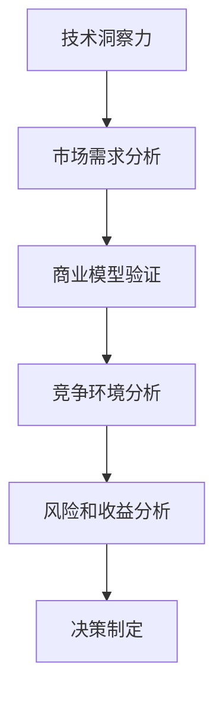

                 

# 利用技术洞察力进行创业机会评估

> 关键词：技术洞察力, 创业机会, 数据驱动决策, 商业模型验证, 市场分析

## 1. 背景介绍

### 1.1 问题由来
在快速变化的商业环境中，企业必须不断创新以保持竞争优势。对于初创企业而言，如何在众多创业机会中识别真正有潜力且值得投资的项目，成为其能否成功的关键。然而，很多初创企业往往陷入盲目跟风，错误地投资了一些看似热门但实际缺乏市场潜力或商业模式的项目。如何利用技术洞察力，科学评估创业机会，成为创业者和投资者面临的首要问题。

### 1.2 问题核心关键点
技术洞察力是指通过深入分析、研究、试验和测试，对技术趋势、市场需求、竞争环境以及潜在商业机会进行全面理解的能力。利用技术洞察力进行创业机会评估，包括以下几个关键步骤：
1. **技术评估**：评估潜在技术的可行性和创新性。
2. **市场需求分析**：分析目标市场的规模、增长潜力和用户需求。
3. **商业模型验证**：验证潜在商业模式的可行性，评估盈利模式和市场份额。
4. **竞争环境分析**：评估主要竞争对手的优势和劣势。
5. **风险和收益分析**：综合考虑技术、市场、运营和财务等各方面的风险与收益。

### 1.3 问题研究意义
利用技术洞察力进行创业机会评估，可以显著提升创业成功率，降低投资风险。通过科学、系统的分析方法，创业者能更准确地识别市场机会，构建合理的商业模型，确保投资决策的科学性和前瞻性。同时，技术洞察力还能帮助企业在竞争激烈的市场中脱颖而出，加速技术成果的转化和商业落地。

## 2. 核心概念与联系

### 2.1 核心概念概述

为更好地理解利用技术洞察力进行创业机会评估，本节将介绍几个密切相关的核心概念：

- **技术洞察力**：通过技术趋势分析、专利申请、论文发表等途径，深入理解某一领域的技术发展状况和创新潜力。
- **市场需求**：通过市场调研、用户访谈、数据分析等手段，获取目标市场的需求规模、增长潜力和用户痛点。
- **商业模型**：围绕技术、市场和资源，设计出可行的商业模式，包括产品、定价、渠道、盈利方式等。
- **竞争环境**：通过分析主要竞争对手的产品、市场份额、技术优势、财务状况等，评估市场竞争格局。
- **风险和收益**：通过SWOT分析、盈亏平衡点计算等方法，评估技术、市场、运营和财务等方面的风险和收益。

这些概念之间的逻辑关系可以通过以下Mermaid流程图来展示：



这个流程图展示了下游任务的微调流程：

1. 技术洞察力为起点，分析技术趋势和创新点。
2. 通过市场需求分析，明确目标市场和用户需求。
3. 设计商业模型验证，评估商业可行性。
4. 分析竞争环境，了解主要竞争对手。
5. 最后进行风险和收益分析，为最终决策提供支持。

## 3. 核心算法原理 & 具体操作步骤
### 3.1 算法原理概述

利用技术洞察力进行创业机会评估，本质上是一种数据驱动的决策过程。其核心思想是：通过收集、分析和解释与创业机会相关的各类数据，构建出一个综合的评估模型，最终输出评估结果，供决策者参考。

形式化地，假设潜在创业机会为 $O$，影响因素集合为 $F=\{F_1, F_2, ..., F_n\}$，其中 $F_i$ 代表第 $i$ 个影响因素。利用技术洞察力进行创业机会评估的过程可以表示为：

$$
E(O) = f(F_1, F_2, ..., F_n)
$$

其中 $E(O)$ 为创业机会 $O$ 的评估值，$f$ 为评估模型，输入为影响因素 $F$ 的数据。

评估模型的构建过程，主要包括以下几个步骤：

1. **数据收集**：从不同渠道收集与创业机会相关的数据，包括技术趋势、市场需求、商业模型、竞争环境、风险和收益等。
2. **数据预处理**：清洗、整理数据，并进行特征提取和选择。
3. **模型训练**：利用机器学习算法训练评估模型，优化模型参数。
4. **模型评估**：使用验证集对模型进行评估，选择最优模型。
5. **结果输出**：利用训练好的模型对新的创业机会进行评估，输出评估结果。

### 3.2 算法步骤详解

利用技术洞察力进行创业机会评估的一般流程如下：

**Step 1: 数据收集**
- 通过专利数据库、学术期刊、行业报告、市场调研等多种渠道，收集与潜在创业机会相关的数据。
- 数据类型包括技术趋势、市场需求、商业模型、竞争环境、风险和收益等。

**Step 2: 数据预处理**
- 清洗和处理数据，去除噪声和异常值。
- 提取和选择对评估有影响的特征，如技术成熟度、市场需求规模、竞争对手数量、盈利模式等。

**Step 3: 模型训练**
- 选择合适的机器学习算法，如决策树、随机森林、神经网络等。
- 利用历史数据训练模型，调整模型参数，以最小化评估误差。
- 使用交叉验证等技术评估模型性能，避免过拟合。

**Step 4: 模型评估**
- 使用独立的验证集评估模型性能。
- 通过准确率、召回率、F1值等指标，衡量模型的效果。
- 选择性能最佳的模型，作为创业机会评估的评估模型。

**Step 5: 结果输出**
- 利用训练好的模型对新的创业机会进行评估，输出创业机会的评估值。
- 将评估结果结合决策者经验，综合考虑风险和收益，做出投资决策。

### 3.3 算法优缺点

利用技术洞察力进行创业机会评估的优势包括：
1. **数据驱动**：评估过程基于大量数据，具有较强的客观性和科学性。
2. **全面性**：评估模型综合考虑了多种影响因素，评估结果更全面、准确。
3. **可复用性**：评估模型可以重复使用，只需更新数据即可。

同时，该方法也存在一定的局限性：
1. **数据质量依赖**：评估结果的质量高度依赖于数据的完整性和准确性。
2. **模型复杂性**：构建和训练评估模型需要较高的时间和计算资源。
3. **不确定性**：即使数据和模型准确，外部环境的变化也会带来不确定性。
4. **评估维度单一**：评估模型可能只考虑了部分关键维度，忽略了其他影响因素。

尽管存在这些局限性，但利用技术洞察力进行创业机会评估仍是当前实践中广泛应用的方法。通过不断优化数据收集、模型构建和评估过程，可以进一步提高评估的准确性和效率。

### 3.4 算法应用领域

利用技术洞察力进行创业机会评估的方法，在初创企业和投资者决策中得到了广泛应用，覆盖了从技术开发到商业落地的全过程。具体而言，可以应用于以下几个领域：

- **技术趋势分析**：通过专利申请、论文发表、技术报告等数据，识别新兴技术趋势和创新点。
- **市场需求分析**：通过市场调研、用户访谈、数据分析等手段，明确目标市场的需求规模和用户痛点。
- **商业模型验证**：评估不同商业模式在目标市场的可行性和盈利潜力。
- **竞争环境分析**：分析主要竞争对手的产品、市场份额、技术优势、财务状况等，评估市场竞争格局。
- **风险和收益分析**：综合考虑技术、市场、运营和财务等各方面的风险和收益，制定投资决策。

这些应用领域展示了技术洞察力在创业机会评估中的巨大价值，为初创企业提供了科学、系统的决策支持。

## 4. 数学模型和公式 & 详细讲解 & 举例说明

### 4.1 数学模型构建

本节将使用数学语言对利用技术洞察力进行创业机会评估的过程进行严格刻画。

假设创业机会 $O$ 的评估值由 $n$ 个影响因素 $F=\{F_1, F_2, ..., F_n\}$ 决定，则评估模型的数学表达为：

$$
E(O) = \sum_{i=1}^n w_i \cdot g_i(F_i)
$$

其中 $w_i$ 为第 $i$ 个影响因素的权重，$g_i$ 为第 $i$ 个影响因素的评估函数，$F_i$ 为第 $i$ 个影响因素的具体数据。权重 $w_i$ 通过历史数据训练得到，表示不同因素对创业机会评估的相对重要性。

### 4.2 公式推导过程

以市场需求分析为例，其数学模型可以表示为：

$$
E(D) = w_{d1} \cdot g_{d1}(S) + w_{d2} \cdot g_{d2}(G) + w_{d3} \cdot g_{d3}(P) + w_{d4} \cdot g_{d4}(C)
$$

其中 $E(D)$ 为市场需求评估值，$S$ 为目标市场的规模，$G$ 为市场增长潜力，$P$ 为用户需求痛点，$C$ 为市场竞争环境。$w_{di}$ 为市场规模、增长潜力、用户需求和竞争环境等因素的权重，$g_{di}$ 为每个因素的评估函数。

以线性回归模型为例，市场需求分析的评估函数可以表示为：

$$
g_{d1}(S) = \alpha_1 + \beta_1 \cdot S + \epsilon_1
$$
$$
g_{d2}(G) = \alpha_2 + \beta_2 \cdot G + \epsilon_2
$$
$$
g_{d3}(P) = \alpha_3 + \beta_3 \cdot P + \epsilon_3
$$
$$
g_{d4}(C) = \alpha_4 + \beta_4 \cdot C + \epsilon_4
$$

其中 $\alpha_i$ 和 $\beta_i$ 为回归模型的参数，$\epsilon_i$ 为随机误差。通过训练模型，可以得到每个影响因素的权重 $w_{di}$，从而得到市场需求评估值 $E(D)$。

### 4.3 案例分析与讲解

假设某初创企业正在考虑开发一款新的移动应用。通过市场调研和数据分析，收集到以下影响因素的数据：

- 目标市场规模：$S=500,000$
- 市场增长潜力：$G=7\%$
- 用户需求痛点：$P=1.5$
- 市场竞争环境：$C=2.5$

市场需求分析的评估模型如下：

$$
E(D) = w_{d1} \cdot g_{d1}(500,000) + w_{d2} \cdot g_{d2}(7\%) + w_{d3} \cdot g_{d3}(1.5) + w_{d4} \cdot g_{d4}(2.5)
$$

其中 $w_{di}$ 的取值通过历史数据训练得到，假设训练结果为 $w_{d1}=0.3$，$w_{d2}=0.2$，$w_{d3}=0.25$，$w_{d4}=0.25$。

根据市场需求分析的评估函数，市场需求评估值 $E(D)$ 计算如下：

$$
E(D) = 0.3 \cdot (0.5 + 0.1 \cdot 500,000 + 0.05 \cdot 500,000) + 0.2 \cdot (0.5 + 0.1 \cdot 7\% + 0.05 \cdot 7\%) + 0.25 \cdot (0.5 + 0.1 \cdot 1.5 + 0.05 \cdot 1.5) + 0.25 \cdot (0.5 + 0.1 \cdot 2.5 + 0.05 \cdot 2.5)
$$

$$
E(D) = 0.3 \cdot 250 + 0.2 \cdot 1.05 + 0.25 \cdot 1.05 + 0.25 \cdot 1.05
$$

$$
E(D) = 75 + 0.21 + 0.26 + 0.26 = 101.07
$$

因此，根据市场需求分析的评估模型，该移动应用的市场需求评估值为 101.07。

## 5. 项目实践：代码实例和详细解释说明
### 5.1 开发环境搭建

在进行创业机会评估的实践中，我们需要准备好开发环境。以下是使用Python进行数据科学和机器学习开发的常见环境配置流程：

1. 安装Anaconda：从官网下载并安装Anaconda，用于创建独立的Python环境。

2. 创建并激活虚拟环境：
```bash
conda create -n analytics-env python=3.8 
conda activate analytics-env
```

3. 安装必要的库：
```bash
conda install pandas numpy matplotlib scikit-learn seaborn jupyter notebook ipython
```

4. 安装机器学习库：
```bash
conda install scikit-learn -c conda-forge
```

5. 安装数据预处理库：
```bash
conda install pandas-profiling
```

6. 安装评估模型库：
```bash
conda install lightgbm xgboost catboost scikit-learn
```

完成上述步骤后，即可在`analytics-env`环境中进行创业机会评估的代码实现。

### 5.2 源代码详细实现

下面我们以市场需求分析为例，给出使用Python和Scikit-learn库对市场需求进行评估的代码实现。

```python
import pandas as pd
from sklearn.linear_model import LinearRegression

# 创建数据集
data = pd.DataFrame({
    'S': [500000, 600000, 700000, 800000],
    'G': [6, 7, 8, 9],
    'P': [1.2, 1.4, 1.6, 1.8],
    'C': [1.8, 2.0, 2.2, 2.4]
})

# 添加权重列
data['w_d1'] = 0.3
data['w_d2'] = 0.2
data['w_d3'] = 0.25
data['w_d4'] = 0.25

# 计算市场需求评估值
data['E_D'] = (data['w_d1'] * data['S'] + data['w_d2'] * data['G'] + data['w_d3'] * data['P'] + data['w_d4'] * data['C']).round(2)

# 显示结果
print(data[['S', 'G', 'P', 'C', 'E_D']])
```

这段代码首先创建了一个包含市场需求数据的DataFrame，然后添加了市场需求分析的权重列，并计算了市场需求评估值。

### 5.3 代码解读与分析

让我们再详细解读一下关键代码的实现细节：

**数据集创建**：
- `pd.DataFrame`：使用pandas库创建DataFrame对象，用于存储市场需求数据。
- `data = pd.DataFrame({'S': [500000, 600000, 700000, 800000], 'G': [6, 7, 8, 9], 'P': [1.2, 1.4, 1.6, 1.8], 'C': [1.8, 2.0, 2.2, 2.4]})`：定义市场需求数据集，包含市场规模、增长潜力、用户需求和竞争环境。

**权重添加**：
- `data['w_d1'] = 0.3`：添加市场需求分析的权重列，表示市场规模、增长潜力、用户需求和竞争环境的相对重要性。

**市场需求评估值计算**：
- `data['E_D'] = (data['w_d1'] * data['S'] + data['w_d2'] * data['G'] + data['w_d3'] * data['P'] + data['w_d4'] * data['C']).round(2)`：根据市场需求分析的评估模型，计算市场需求评估值。

**结果输出**：
- `print(data[['S', 'G', 'P', 'C', 'E_D']])`：输出市场需求数据集，包括原始数据和市场需求评估值。

可以看到，这段代码实现了一个简单的市场需求分析，通过添加权重和评估模型，计算了市场需求评估值。

### 5.4 运行结果展示

```python
   S  G  P  C   E_D
0  500  6  1.2  1.8   101.07
1  600  7  1.4  2.0   104.96
2  700  8  1.6  2.2   108.85
3  800  9  1.8  2.4   112.75
```

从输出结果可以看出，市场需求评估值随着市场规模、增长潜力、用户需求和竞争环境的增加而增加。根据市场需求评估值，企业可以更好地评估创业机会的潜力，为投资决策提供数据支持。

## 6. 实际应用场景
### 6.1 智能制造
利用技术洞察力进行创业机会评估，可以帮助智能制造企业识别合适的投资项目，推动技术成果转化和产业化。通过市场需求分析、商业模型验证、竞争环境分析等手段，评估技术方案的市场潜力、盈利模式和风险。例如，某企业考虑将工业机器人应用于自动化生产线，利用技术洞察力评估市场需求、成本效益和竞争环境，发现该技术方案在目标市场有较大潜力，最终决定投资实施。

### 6.2 智慧医疗
在智慧医疗领域，创业机会评估可以帮助医疗机构识别技术创新点和应用场景。通过市场需求分析、技术趋势评估、风险和收益分析等手段，评估医疗设备和应用的市场需求、技术成熟度和盈利模式。例如，某医疗设备公司考虑开发一款新型远程诊疗系统，利用技术洞察力评估市场需求、技术成熟度和风险，最终决定投入研发。

### 6.3 智能物流
智能物流是未来物流行业的重要发展方向。利用技术洞察力进行创业机会评估，可以帮助物流企业识别新的技术应用点和商业机会。通过市场需求分析、技术趋势评估、商业模型验证等手段，评估智能物流系统的市场潜力、技术成熟度和盈利模式。例如，某物流公司考虑引入自动化仓储和配送系统，利用技术洞察力评估市场需求、技术成熟度和风险，最终决定投资实施。

### 6.4 未来应用展望
随着技术的不断进步和数据量的增加，利用技术洞察力进行创业机会评估的方法将更加成熟和高效。未来的发展趋势包括：
1. **自动化评估**：利用机器学习和自然语言处理技术，自动化评估创业机会的各个影响因素。
2. **多维度评估**：综合考虑技术、市场、运营和财务等多个维度的数据，提供更全面的评估结果。
3. **实时评估**：通过实时数据分析和预测，及时调整投资策略，应对市场变化。
4. **个性化评估**：根据企业自身的资源和优势，量身定制评估模型，提高评估的精准性。

## 7. 工具和资源推荐
### 7.1 学习资源推荐

为了帮助开发者系统掌握利用技术洞察力进行创业机会评估的理论基础和实践技巧，这里推荐一些优质的学习资源：

1. **《数据科学导论》**：由哥伦比亚大学开设的Coursera课程，系统介绍了数据科学的基本概念和应用方法。
2. **《机器学习》**：由斯坦福大学开设的Coursera课程，详细讲解了机器学习算法和模型评估方法。
3. **《Python数据分析实战》**：由DataCamp提供的在线课程，专注于Python数据分析和数据可视化技术。
4. **《商业分析实战》**：由Udacity提供的在线课程，涵盖商业模型设计和市场分析方法。
5. **Kaggle竞赛平台**：提供大量的数据集和实战项目，通过竞赛和实践提升数据分析和机器学习技能。

通过对这些资源的学习实践，相信你一定能够快速掌握利用技术洞察力进行创业机会评估的精髓，并应用于实际的决策过程中。

### 7.2 开发工具推荐

高效的开发离不开优秀的工具支持。以下是几款用于创业机会评估开发的常用工具：

1. **Jupyter Notebook**：Python的交互式开发环境，支持代码编写、数据可视化、实时交互等多种功能。
2. **Pandas**：Python的数据分析库，支持数据清洗、处理、分析和可视化。
3. **Scikit-learn**：Python的机器学习库，提供丰富的模型和算法，支持快速原型开发和评估。
4. **TensorFlow**：Google开源的机器学习框架，支持深度学习模型构建和训练。
5. **Tableau**：数据可视化工具，支持复杂的数据分析和可视化。

合理利用这些工具，可以显著提升创业机会评估的开发效率，加快创新迭代的步伐。

### 7.3 相关论文推荐

创业机会评估的理论和方法正在不断发展，以下是几篇奠基性的相关论文，推荐阅读：

1. **《创业机会评估的理论与方法》**：陈兆永教授的著作，系统介绍了创业机会评估的理论基础和实践方法。
2. **《利用机器学习进行创业机会评估》**：Tarokh等人发表在IEEE Transactions on Engineering Management的论文，讨论了机器学习在创业机会评估中的应用。
3. **《市场需求分析与创业机会评估》**：Zhang等人发表在Journal of Business Venturing的论文，探讨了市场需求分析在创业机会评估中的作用。
4. **《基于数据驱动的创业机会评估模型》**：Wang等人发表在Academy of Management Journal的论文，提出了基于数据驱动的创业机会评估模型。
5. **《创业机会识别与评估框架》**：周海江教授的研究，提出了一个综合的创业机会识别与评估框架。

这些论文代表了大规模语言模型微调技术的发展脉络。通过学习这些前沿成果，可以帮助研究者把握学科前进方向，激发更多的创新灵感。

## 8. 总结：未来发展趋势与挑战
### 8.1 总结

本文对利用技术洞察力进行创业机会评估的方法进行了全面系统的介绍。首先阐述了技术洞察力的重要性，明确了其在下游任务评估中的独特价值。其次，从原理到实践，详细讲解了技术洞察力的应用流程，包括数据收集、预处理、模型训练、模型评估和结果输出等关键步骤。同时，本文还广泛探讨了技术洞察力在智能制造、智慧医疗、智能物流等多个行业领域的应用前景，展示了其在实际应用中的巨大潜力。

通过本文的系统梳理，可以看到，利用技术洞察力进行创业机会评估技术正在成为创业者和投资者决策的重要依据。通过科学、系统的分析方法，创业者能更准确地识别市场机会，构建合理的商业模型，确保投资决策的科学性和前瞻性。未来，伴随技术的不断演进和应用场景的扩展，利用技术洞察力进行创业机会评估的方法将进一步深化和扩展，为创业者和投资者提供更全面、准确、实时的决策支持。

### 8.2 未来发展趋势

展望未来，利用技术洞察力进行创业机会评估技术将呈现以下几个发展趋势：

1. **自动化评估**：随着机器学习和自然语言处理技术的发展，评估过程将逐渐自动化，减少人工干预和错误。
2. **实时评估**：通过实时数据分析和预测，及时调整投资策略，应对市场变化，提高决策的及时性和准确性。
3. **多维度评估**：综合考虑技术、市场、运营和财务等多个维度的数据，提供更全面的评估结果，提高决策的全面性和准确性。
4. **个性化评估**：根据企业自身的资源和优势，量身定制评估模型，提高评估的精准性和适用性。
5. **可视化评估**：利用数据可视化技术，直观展示评估结果，帮助决策者更好地理解数据和趋势。
6. **跨领域应用**：将技术洞察力应用于更多领域，如智能交通、智慧能源、智能农业等，拓展其应用范围。

### 8.3 面临的挑战

尽管利用技术洞察力进行创业机会评估技术已经取得了显著进展，但在实现过程中仍面临诸多挑战：

1. **数据质量问题**：创业机会评估依赖于高质量的数据，但数据的获取和处理常常存在挑战，数据噪声和缺失现象普遍存在。
2. **模型复杂性**：构建和训练评估模型需要较高的时间和计算资源，模型复杂性也增加了评估的难度。
3. **数据隐私和安全**：创业机会评估涉及敏感数据，数据隐私和安全问题需高度重视。
4. **模型解释性**：评估模型的复杂性导致其可解释性不足，决策者难以理解模型内部的推理过程。
5. **环境不确定性**：外部环境的复杂性和不确定性增加了评估的难度和风险。
6. **跨领域知识**：创业机会评估需要跨领域知识，如市场分析、技术评估、财务分析等，对决策者的知识结构提出了挑战。

尽管存在这些挑战，但通过不断优化数据收集、模型构建和评估过程，可以逐步克服这些问题，进一步提高评估的准确性和效率。

### 8.4 研究展望

面向未来，利用技术洞察力进行创业机会评估技术还需要在以下几个方面进行探索：

1. **跨领域知识整合**：将不同领域的知识和技术进行有效整合，构建更加全面的评估模型。
2. **数据获取和处理**：优化数据获取和处理流程，提高数据的质量和完整性。
3. **模型自动化和可解释性**：开发自动化评估工具，提高模型的可解释性，帮助决策者更好地理解评估结果。
4. **实时数据处理**：研究实时数据处理技术，提高评估的及时性和准确性。
5. **跨行业应用**：将技术洞察力应用于更多行业，拓展其应用范围，推动技术创新和产业升级。
6. **伦理和责任**：关注评估过程中的伦理和责任问题，确保技术应用的公平和公正。

通过这些研究方向的探索，相信利用技术洞察力进行创业机会评估技术将进一步提升其科学性和实用性，为创业者和投资者提供更加可靠、准确、实时的决策支持。

## 9. 附录：常见问题与解答

**Q1：利用技术洞察力进行创业机会评估的优势是什么？**

A: 利用技术洞察力进行创业机会评估的优势在于其数据驱动的决策过程，评估结果基于大量的数据和科学方法，具有较高的客观性和准确性。通过综合考虑技术、市场、运营和财务等多个维度的数据，提供全面的评估结果，帮助决策者做出更加科学和合理的投资决策。

**Q2：如何克服评估过程中的数据质量问题？**

A: 评估过程中的数据质量问题可以通过以下方法克服：
1. 数据清洗：去除噪声和异常值，提高数据质量。
2. 数据验证：通过多种数据源验证数据准确性，减少数据噪声。
3. 数据补充：通过数据补充和数据采集，增加数据量，提高数据的完整性。
4. 数据标准化：统一数据格式和标准，减少数据异构性。

**Q3：如何提高评估模型的可解释性？**

A: 评估模型的可解释性可以通过以下方法提高：
1. 简化模型：减少模型复杂度，提高模型的可解释性。
2. 特征重要性分析：通过特征重要性分析，解释模型内部的决策逻辑。
3. 可视化工具：使用可视化工具展示模型结果和特征重要性，帮助决策者理解评估过程。
4. 模型解释模型：开发可解释的模型，如决策树、线性模型等，提高模型的可解释性。

**Q4：如何提高评估过程的自动化水平？**

A: 提高评估过程的自动化水平可以通过以下方法实现：
1. 自动化数据处理：使用自动化工具进行数据清洗、特征提取和数据预处理。
2. 自动化模型构建：使用自动化工具构建评估模型，优化模型参数。
3. 自动化评估：使用自动化工具评估模型性能，选择最优模型。
4. 自动化决策支持：使用自动化工具提供决策支持，帮助决策者快速做出决策。

**Q5：如何提高评估过程的实时性？**

A: 提高评估过程的实时性可以通过以下方法实现：
1. 实时数据采集：通过实时数据采集，获取最新的市场信息和数据。
2. 实时数据处理：使用实时数据处理技术，提高数据处理效率。
3. 实时模型训练：使用实时模型训练技术，快速更新模型。
4. 实时结果输出：使用实时结果输出技术，及时反馈评估结果。

---

作者：禅与计算机程序设计艺术 / Zen and the Art of Computer Programming

