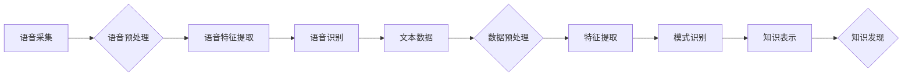

                 

## 知识发现引擎的语音识别技术集成

> 关键词：语音识别、知识发现引擎、自然语言处理、深度学习、Transformer模型、端到端训练、信息提取、知识图谱

## 1. 背景介绍

随着人工智能技术的飞速发展，语音识别技术已成为连接人类与机器的重要桥梁。它广泛应用于智能家居、语音助手、医疗诊断、教育培训等领域，为人们的生活带来了极大的便利。知识发现引擎作为一种能够从海量数据中挖掘有价值知识的系统，在数据分析、决策支持、市场洞察等方面发挥着越来越重要的作用。

将语音识别技术与知识发现引擎相结合，可以实现对语音数据的智能理解和知识提取，从而构建更智能、更具洞察力的知识体系。例如，我们可以利用语音识别技术将用户语音转换为文本，然后通过知识发现引擎对文本进行分析，提取关键信息、识别实体关系、构建知识图谱等，最终实现对用户需求的精准理解和个性化服务。

## 2. 核心概念与联系

### 2.1 语音识别技术

语音识别技术是指利用计算机识别和理解人类语音的过程。它主要包括以下几个步骤：

1. **语音采集:** 使用麦克风或其他设备采集用户的语音信号。
2. **语音预处理:** 对采集到的语音信号进行滤波、降噪、增强等处理，以提高语音信号的质量。
3. **语音特征提取:** 从预处理后的语音信号中提取特征，例如梅尔频率倒谱系数 (MFCC)、线性预测系数 (LPC) 等。
4. **语音识别:** 利用训练好的语音识别模型对提取的语音特征进行识别，将语音转换为文本。

### 2.2 知识发现引擎

知识发现引擎是一种能够从海量数据中挖掘有价值知识的系统。它通常包括以下几个模块：

1. **数据预处理:** 对输入数据进行清洗、转换、整合等处理，以使其适合知识发现算法的处理。
2. **特征提取:** 从数据中提取特征，例如文本关键词、时间序列趋势、关系网络等。
3. **模式识别:** 利用机器学习、数据挖掘等算法识别数据中的模式和规律。
4. **知识表示:** 将发现的知识以可理解的形式表示出来，例如知识图谱、规则表达式等。

### 2.3 语音识别与知识发现引擎的集成

将语音识别技术与知识发现引擎相结合，可以实现对语音数据的智能理解和知识提取。

**流程图:**



## 3. 核心算法原理 & 具体操作步骤

### 3.1 算法原理概述

语音识别与知识发现引擎的集成主要依赖于以下核心算法：

* **深度学习模型:** 用于语音识别，例如Transformer模型，能够学习语音信号的复杂特征，实现高精度语音识别。
* **自然语言处理 (NLP) 技术:** 用于对识别出的文本进行分析，例如词性标注、依存句法分析、命名实体识别等，提取关键信息和语义关系。
* **知识图谱构建算法:** 用于将提取的信息组织成知识图谱，例如基于规则的推理、基于机器学习的链接预测等，构建知识体系。

### 3.2 算法步骤详解

1. **语音采集和预处理:** 使用麦克风采集用户语音，并进行滤波、降噪、增强等预处理，提高语音信号质量。
2. **语音特征提取:** 使用深度学习模型提取语音信号的特征，例如MFCC、Mel-spectrogram等。
3. **语音识别:** 利用训练好的深度学习模型对提取的语音特征进行识别，将语音转换为文本。
4. **文本预处理:** 对识别出的文本进行清洗、分词、去停用词等预处理，去除噪声和冗余信息。
5. **自然语言理解:** 使用NLP技术对预处理后的文本进行分析，例如词性标注、依存句法分析、命名实体识别等，提取关键信息和语义关系。
6. **知识图谱构建:** 利用知识图谱构建算法将提取的信息组织成知识图谱，例如实体、关系、属性等。
7. **知识推理和查询:** 基于构建的知识图谱，可以进行知识推理和查询，例如回答用户问题、发现知识关联等。

### 3.3 算法优缺点

**优点:**

* **高精度语音识别:** 深度学习模型能够学习语音信号的复杂特征，实现高精度语音识别。
* **智能文本理解:** NLP技术能够对文本进行深入理解，提取关键信息和语义关系。
* **知识体系构建:** 知识图谱能够将信息组织成结构化的知识体系，方便知识存储、检索和推理。

**缺点:**

* **模型训练成本高:** 深度学习模型需要大量的训练数据和计算资源，训练成本较高。
* **数据依赖性强:** 算法性能受训练数据质量和数量的影响，数据质量和数量不足会导致算法性能下降。
* **知识图谱维护复杂:** 知识图谱需要不断更新和维护，以确保其准确性和完整性。

### 3.4 算法应用领域

* **智能客服:** 利用语音识别和知识发现引擎，构建智能客服系统，能够理解用户的语音问题，并提供准确的答案。
* **语音搜索:** 利用语音识别和知识发现引擎，实现语音搜索功能，用户可以通过语音搜索所需信息。
* **教育培训:** 利用语音识别和知识发现引擎，构建个性化教育培训系统，能够根据用户的学习情况提供个性化的学习内容和辅导。
* **医疗诊断:** 利用语音识别和知识发现引擎，辅助医生进行诊断，例如识别患者的症状、分析病历信息等。

## 4. 数学模型和公式 & 详细讲解 & 举例说明

### 4.1 数学模型构建

语音识别和知识发现引擎的集成涉及到多个数学模型，例如：

* **声学模型:** 用于将语音信号转换为特征向量，常用的模型包括隐马尔可夫模型 (HMM) 和深度神经网络 (DNN)。
* **语言模型:** 用于预测语音序列的概率，常用的模型包括n-gram模型和Transformer模型。
* **知识图谱模型:** 用于表示知识和关系，常用的模型包括RDF、OWL和知识图谱嵌入模型。

### 4.2 公式推导过程

由于篇幅限制，这里只列举一些常用的公式，并进行简要讲解：

* **HMM声学模型概率:**

$$P(O|Q) = \prod_{t=1}^{T} P(O_t|Q_t)$$

其中，$O$ 是观测序列，$Q$ 是隐藏状态序列，$O_t$ 是第t个时刻的观测值，$Q_t$ 是第t个时刻的隐藏状态。

* **Transformer模型注意力机制:**

$$Attention(Q,K,V) = softmax(\frac{QK^T}{\sqrt{d_k}})V$$

其中，$Q$, $K$, $V$ 分别是查询矩阵、键矩阵和值矩阵，$d_k$ 是键向量的维度。

### 4.3 案例分析与讲解

例如，在构建智能客服系统时，我们可以使用语音识别模型将用户的语音转换为文本，然后使用NLP技术提取用户的意图和实体信息，例如用户想要查询产品价格，实体信息为“产品名称”。

接着，我们可以利用知识图谱模型将提取的信息与知识库进行匹配，找到相关产品信息，并将其以文本形式返回给用户。

## 5. 项目实践：代码实例和详细解释说明

### 5.1 开发环境搭建

* **操作系统:** Ubuntu 20.04
* **编程语言:** Python 3.8
* **深度学习框架:** TensorFlow 2.x
* **NLP库:** spaCy, NLTK
* **知识图谱库:** RDFlib

### 5.2 源代码详细实现

由于篇幅限制，这里只提供部分代码示例，具体实现细节请参考相关开源项目和文档。

```python
# 语音识别代码示例 (使用TensorFlow)
import tensorflow as tf

# 加载预训练的语音识别模型
model = tf.keras.models.load_model('speech_recognition_model.h5')

# 对语音信号进行预处理
audio_signal = preprocess_audio(audio_data)

# 使用模型进行语音识别
recognized_text = model.predict(audio_signal)

# 文本处理代码示例 (使用spaCy)
import spacy

nlp = spacy.load("en_core_web_sm")

# 对识别出的文本进行分词和命名实体识别
doc = nlp(recognized_text)
for ent in doc.ents:
    print(ent.text, ent.label_)

# 知识图谱构建代码示例 (使用RDFlib)
from rdflib import Graph, Literal, URIRef

# 创建知识图谱
g = Graph()

# 添加实体和关系
g.add((URIRef('http://example.org/product/1'), 'rdfs:label', Literal('手机')))
g.add((URIRef('http://example.org/product/1'), 'hasPrice', Literal('1000')))

# 查询知识图谱
for s, p, o in g.triples((URIRef('http://example.org/product/1'), None, None)):
    print(f"{s} {p} {o}")
```

### 5.3 代码解读与分析

* 语音识别代码示例使用TensorFlow加载预训练的语音识别模型，对语音信号进行预处理，并使用模型进行语音识别。
* 文本处理代码示例使用spaCy对识别出的文本进行分词和命名实体识别，提取关键信息。
* 知识图谱构建代码示例使用RDFlib创建知识图谱，添加实体和关系，并进行知识查询。

### 5.4 运行结果展示

运行上述代码后，可以实现语音识别、文本处理和知识图谱构建的功能。例如，当用户说出“我想买一部手机”时，系统可以识别出用户的意图和实体信息，并从知识图谱中找到相关产品信息，例如“手机价格为1000元”。

## 6. 实际应用场景

### 6.1 智能客服

语音识别技术可以将用户语音转换为文本，NLP技术可以理解用户的意图和需求，知识发现引擎可以根据用户需求从知识库中找到相关信息，并以文本或语音形式返回给用户。

### 6.2 语音搜索

用户可以通过语音搜索引擎搜索所需信息，语音识别技术将语音转换为文本，NLP技术可以理解用户的搜索意图，知识发现引擎可以从知识库中找到相关信息并返回给用户。

### 6.3 个性化教育

语音识别技术可以识别学生的语音输入，NLP技术可以分析学生的学习情况和需求，知识发现引擎可以根据学生的学习情况提供个性化的学习内容和辅导。

### 6.4 医疗诊断辅助

语音识别技术可以识别患者的症状描述，NLP技术可以提取患者的病史信息，知识发现引擎可以根据患者的症状和病史信息从医学知识库中找到可能的诊断结果，辅助医生进行诊断。

### 6.4 未来应用展望

随着语音识别技术和知识发现引擎的不断发展，其应用场景将更加广泛，例如：

* **智慧城市:** 语音识别可以用于城市管理、交通指挥、公共服务等领域。
* **智能家居:** 语音识别可以用于控制家电、调节环境、提供生活信息等。
* **个性化娱乐:** 语音识别可以用于个性化推荐音乐、电影、书籍等娱乐内容。

## 7. 工具和资源推荐

### 7.1 学习资源推荐

* **书籍:**
    * 《深度学习》 - Ian Goodfellow, Yoshua Bengio, Aaron Courville
    * 《自然语言处理》 - Jurafsky, Martin
* **在线课程:**
    * Coursera: Deep Learning Specialization
    * edX: Natural Language Processing with Deep Learning

### 7.2 开发工具推荐

* **深度学习框架:** TensorFlow, PyTorch
* **NLP库:** spaCy, NLTK, Gensim
* **知识图谱库:** RDFlib, Neo4j

### 7.3 相关论文推荐

* **语音识别:**
    * "Attention Is All You Need" - Vaswani et al. (2017)
    * "End-to-End Speech Recognition with Deep Neural Networks" - Graves et al. (2013)
* **知识发现:**
    * "A Survey of Knowledge Discovery and Data Mining" - Fayyad et al. (1996)
    * "Knowledge Representation and Reasoning" - Brachman & Levesque (2004)

## 8. 总结：未来发展趋势与挑战

### 8.1 研究成果总结

语音识别技术和知识发现引擎的集成取得了显著进展，能够实现对语音数据的智能理解和知识提取，为构建更智能、更具洞察力的知识体系提供了新的途径。

### 8.2 未来发展趋势

* **更准确的语音识别:** 随着深度学习模型的不断发展，语音识别技术将更加准确，能够识别更复杂的语音信号，例如方言、口音等。
* **更智能的文本理解:** NLP技术将更加智能，能够更深入地理解文本语义，例如情感分析、意图识别等。
* **更丰富的知识图谱:** 知识图谱将更加丰富，包含更多类型的知识和关系，能够更好地支持知识推理和查询。
* **更广泛的应用场景:** 语音识别和知识发现引擎的集成将应用于更多领域，例如智慧城市、智能家居、个性化教育等。

### 8.3 面临的挑战

* **数据质量和数量:** 语音识别和知识发现引擎的性能受训练数据质量和数量的影响，需要不断收集和标注高质量的数据。
* **模型复杂性和训练成本:** 深度学习模型越来越复杂，训练成本越来越高，需要开发更有效的训练方法和硬件资源。
* **知识图谱维护和更新:** 知识图谱需要不断更新和维护，以确保其准确性和完整性，需要开发更有效的知识图谱管理工具。

### 8.4 研究展望

未来，我们将继续致力于语音识别和知识发现引擎的集成研究，探索更准确、更智能、更丰富的知识发现方法，并将其应用于更多领域，为人类社会带来更多价值。

## 9. 附录：常见问题与解答

**Q1: 语音识别技术和知识发现引擎的集成有什么优势？**

**A1:** 语音识别技术和知识发现引擎的集成能够实现对语音数据的智能理解和知识提取，将语音信息转化为可理解和利用的知识，为构建更智能、更具洞察力的知识体系提供了新的途径。

**Q2: 语音识别技术和知识发现引擎的集成有哪些应用场景？**

**A2:** 语音识别技术和知识发现引擎的集成应用场景广泛，例如智能客服、语音搜索、个性化教育、医疗诊断辅助等。

**Q3: 如何搭建语音识别和知识发现引擎的集成系统？**

**A3:** 搭建语音识别和知识发现引擎的集成系统需要以下步骤：

1. 选择合适的语音识别模型和NLP库。
2. 构建知识图谱模型和知识库。
3. 开发语音识别、文本处理和知识发现引擎的接口。
4. 将各个模块集成在一起，构建完整的系统。


作者：禅与计算机程序设计艺术 / Zen and the Art of Computer Programming<end_of_turn>

