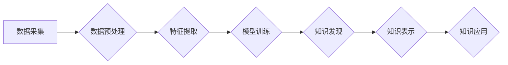

                 

## 知识发现引擎：助力企业创新的战略引擎

> 关键词：知识发现、数据挖掘、机器学习、人工智能、商业智能、创新驱动、企业战略

### 1. 背景介绍

在当今数据爆炸的时代，企业面临着海量数据的挑战。如何从海量数据中挖掘出有价值的知识，转化为企业创新和发展的新动能，成为企业亟需解决的关键问题。知识发现引擎 (Knowledge Discovery Engine，KDE) 正是应运而生以应对这一挑战的智能化工具。

KDE 是一种能够自动从海量数据中发现隐藏模式、趋势和关系的系统。它融合了数据挖掘、机器学习、人工智能等多种技术，能够帮助企业洞察数据背后的深层含义，为决策提供数据支撑，从而推动企业创新和发展。

### 2. 核心概念与联系

#### 2.1  知识发现

知识发现是指从数据中提取、识别和解释有价值的知识的过程。它是一个跨学科领域，涉及数据挖掘、人工智能、数据库、统计学等多个领域。

#### 2.2  数据挖掘

数据挖掘是指从大型数据库中发现隐藏的模式、趋势和关系的过程。它利用统计学、机器学习和数据库技术，从数据中提取有价值的信息。

#### 2.3  机器学习

机器学习是一种人工智能技术，它使计算机能够从数据中学习，并根据学习到的知识进行预测或决策。

#### 2.4  人工智能

人工智能是指模拟人类智能的计算机系统。它包括许多子领域，例如机器学习、自然语言处理、计算机视觉等。

**KDE 架构流程图**



### 3. 核心算法原理 & 具体操作步骤

#### 3.1  算法原理概述

KDE 的核心算法原理主要包括：

* **数据预处理:** 清洗、转换和格式化数据，使其适合模型训练。
* **特征提取:** 从原始数据中提取有价值的特征，用于模型训练和知识发现。
* **模型训练:** 利用机器学习算法，从训练数据中学习模型，以便对新数据进行预测或决策。
* **知识发现:** 利用训练好的模型，从数据中发现隐藏的模式、趋势和关系。
* **知识表示:** 将发现的知识以可理解的形式表示出来，例如规则、图表、网络等。
* **知识应用:** 将发现的知识应用到实际业务中，例如决策支持、预测分析、个性化推荐等。

#### 3.2  算法步骤详解

1. **数据采集:** 从各种数据源收集相关数据，例如数据库、文件、传感器等。
2. **数据预处理:** 对收集到的数据进行清洗、转换和格式化，例如删除重复数据、处理缺失值、归一化数据等。
3. **特征提取:** 利用数据分析和特征工程技术，从原始数据中提取有价值的特征，例如文本特征、图像特征、时间序列特征等。
4. **模型训练:** 选择合适的机器学习算法，例如决策树、支持向量机、神经网络等，对训练数据进行模型训练，学习数据背后的模式和关系。
5. **知识发现:** 利用训练好的模型，对新数据进行预测或决策，并从中发现隐藏的模式、趋势和关系。
6. **知识表示:** 将发现的知识以可理解的形式表示出来，例如规则、图表、网络等，以便于人类理解和应用。
7. **知识应用:** 将发现的知识应用到实际业务中，例如决策支持、预测分析、个性化推荐等。

#### 3.3  算法优缺点

**优点:**

* 自动化知识发现: KDE 可以自动从海量数据中发现隐藏的知识，减轻人工分析的负担。
* 提高决策效率: KDE 可以为决策提供数据支撑，提高决策的准确性和效率。
* 促进创新: KDE 可以帮助企业发现新的市场机会、产品需求和业务模式，促进创新发展。

**缺点:**

* 数据质量依赖: KDE 的结果质量取决于数据的质量，如果数据不准确或不完整，会导致结果偏差。
* 模型选择困难: 选择合适的机器学习算法对知识发现结果至关重要，需要根据具体业务场景进行选择。
* 知识解释性: 一些机器学习模型的决策过程难以解释，这可能会影响人们对知识的信任和应用。

#### 3.4  算法应用领域

KDE 的应用领域非常广泛，例如：

* **商业智能:** 分析客户行为、市场趋势和竞争对手信息，帮助企业制定更有效的商业策略。
* **金融科技:** 风险评估、欺诈检测、投资决策等。
* **医疗保健:** 疾病诊断、药物研发、个性化医疗等。
* **制造业:** 产品质量控制、设备故障预测、生产流程优化等。
* **教育:** 学生学习行为分析、个性化教学等。

### 4. 数学模型和公式 & 详细讲解 & 举例说明

#### 4.1  数学模型构建

KDE 中常用的数学模型包括：

* **距离度量:** 用于衡量数据点之间的相似度，例如欧氏距离、曼哈顿距离等。
* **概率分布:** 用于描述数据点的分布情况，例如正态分布、伯努利分布等。
* **决策树:** 用于分类和回归预测，通过一系列决策规则将数据点分类或预测目标值。
* **支持向量机:** 用于分类和回归预测，通过寻找最佳的分隔超平面将数据点分类或预测目标值。
* **神经网络:** 用于复杂模式识别和预测，通过多层神经元网络学习数据之间的关系。

#### 4.2  公式推导过程

例如，决策树算法中常用的信息增益公式：

$$
Gain(S,A) = Entropy(S) - \sum_{v \in V} \frac{|S_v|}{|S|} Entropy(S_v)
$$

其中：

* $S$ 是数据集
* $A$ 是特征
* $V$ 是特征 $A$ 的取值集合
* $S_v$ 是特征 $A$ 取值为 $v$ 的子集
* $Entropy(S)$ 是数据集 $S$ 的熵
* $Entropy(S_v)$ 是子集 $S_v$ 的熵

#### 4.3  案例分析与讲解

例如，在电商平台中，可以使用 KDE 分析用户购买行为，发现用户喜欢的商品类别、价格区间、品牌等信息，从而为用户推荐个性化商品，提高转化率。

### 5. 项目实践：代码实例和详细解释说明

#### 5.1  开发环境搭建

KDE 的开发环境通常包括：

* 操作系统: Linux, Windows, macOS
* 编程语言: Python, R, Java
* 数据处理工具: Pandas, NumPy, Spark
* 机器学习库: scikit-learn, TensorFlow, PyTorch
* 数据库: MySQL, PostgreSQL, MongoDB

#### 5.2  源代码详细实现

以下是一个简单的 Python 代码示例，使用 scikit-learn 库实现一个基于决策树的 KDE：

```python
from sklearn.tree import DecisionTreeClassifier
from sklearn.model_selection import train_test_split
from sklearn.metrics import accuracy_score

# 加载数据
data = ...

# 将数据分为训练集和测试集
X_train, X_test, y_train, y_test = train_test_split(data.drop('target', axis=1), data['target'], test_size=0.2)

# 创建决策树模型
model = DecisionTreeClassifier()

# 训练模型
model.fit(X_train, y_train)

# 对测试集进行预测
y_pred = model.predict(X_test)

# 计算模型准确率
accuracy = accuracy_score(y_test, y_pred)
print(f"模型准确率: {accuracy}")
```

#### 5.3  代码解读与分析

* 该代码首先加载数据，然后将数据分为训练集和测试集。
* 接着创建决策树模型，并使用训练集训练模型。
* 最后对测试集进行预测，并计算模型的准确率。

#### 5.4  运行结果展示

运行结果将显示模型的准确率，可以评估模型的性能。

### 6. 实际应用场景

#### 6.1  商业智能

KDE 可以帮助企业分析客户行为、市场趋势和竞争对手信息，从而制定更有效的商业策略。例如，可以分析客户购买历史、浏览记录和评价信息，发现客户的喜好和需求，从而进行精准营销和个性化推荐。

#### 6.2  金融科技

KDE 可以用于风险评估、欺诈检测、投资决策等。例如，可以分析客户的财务状况、交易记录和行为模式，识别潜在的风险客户，并采取相应的措施进行风险控制。

#### 6.3  医疗保健

KDE 可以用于疾病诊断、药物研发、个性化医疗等。例如，可以分析患者的病历、检查结果和基因信息，辅助医生进行疾病诊断，并制定个性化的治疗方案。

#### 6.4  未来应用展望

随着人工智能技术的不断发展，KDE 将在更多领域得到应用，例如：

* **智能制造:** 预测设备故障、优化生产流程、提高生产效率。
* **智慧城市:** 分析城市交通、环境、公共安全等数据，提高城市管理水平。
* **教育科技:** 个性化教学、学生学习行为分析、教育资源推荐。

### 7. 工具和资源推荐

#### 7.1  学习资源推荐

* **书籍:**
    * 《数据挖掘：概念与技术》
    * 《机器学习》
    * 《人工智能：现代方法》
* **在线课程:**
    * Coursera: 数据科学、机器学习
    * edX: 数据挖掘、人工智能
    * Udemy: 数据分析、机器学习

#### 7.2  开发工具推荐

* **编程语言:** Python, R
* **数据处理工具:** Pandas, NumPy, Spark
* **机器学习库:** scikit-learn, TensorFlow, PyTorch
* **数据库:** MySQL, PostgreSQL, MongoDB

#### 7.3  相关论文推荐

* 《Knowledge Discovery in Databases: Principles, Methods, and Applications》
* 《A Survey of Knowledge Discovery and Data Mining》
* 《Deep Learning for Knowledge Discovery》

### 8. 总结：未来发展趋势与挑战

#### 8.1  研究成果总结

KDE 已经取得了显著的成果，在商业智能、金融科技、医疗保健等领域得到了广泛应用。

#### 8.2  未来发展趋势

KDE 的未来发展趋势包括：

* **更强大的机器学习算法:** 随着人工智能技术的不断发展，新的机器学习算法将不断涌现，为 KDE 提供更强大的数据分析能力。
* **更丰富的知识表示形式:** KDE 将会支持更丰富的知识表示形式，例如知识图谱、逻辑推理等，以便更好地表达和应用发现的知识。
* **更智能的知识应用:** KDE 将会更加智能化，能够自动将发现的知识应用到实际业务中，例如自动生成报告、自动决策等。

#### 8.3  面临的挑战

KDE 还面临着一些挑战，例如：

* **数据质量问题:** KDE 的结果质量取决于数据的质量，如何保证数据准确性和完整性是一个重要的挑战。
* **模型解释性问题:** 一些机器学习模型的决策过程难以解释，这可能会影响人们对知识的信任和应用。
* **伦理问题:** KDE 的应用可能会涉及到隐私、公平、责任等伦理问题，需要谨慎考虑和解决。

#### 8.4  研究展望

未来，KDE 将会继续朝着更智能、更自动化、更可解释的方向发展，为企业提供更强大的数据分析和决策支持能力，推动企业创新和发展。

### 9. 附录：常见问题与解答

#### 9.1  Q1: KDE 和数据挖掘有什么区别？

**A1:** KDE 是数据挖掘的一种应用，它利用机器学习算法，从数据中发现隐藏的知识，并将其应用到实际业务中。数据挖掘是一个更广泛的概念，它包括各种数据分析技术，例如统计分析、模式识别等。

#### 9.2  Q2: 如何选择合适的 KDE 模型？

**A2:** 选择合适的 KDE 模型需要根据具体业务场景和数据特点进行选择。例如，如果需要进行分类预测，可以选择决策树、支持向量机等模型；如果需要进行回归预测，可以选择线性回归、神经网络等模型。

#### 9.3  Q3: KDE 的应用场景有哪些？

**A3:** KDE 的应用场景非常广泛，例如商业智能、金融科技、医疗保健、制造业、教育等。

#### 9.4  Q4: KDE 的未来发展趋势是什么？

**A4:** KDE 的未来发展趋势包括更强大的机器学习算法、更丰富的知识表示形式、更智能的知识应用等。


作者：禅与计算机程序设计艺术 / Zen and the Art of Computer Programming 
<end_of_turn>

