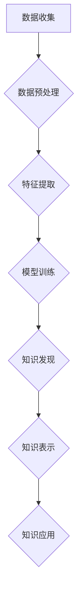

                 

## 知识发现引擎：推动科学研究的创新引擎

> 关键词：知识发现、机器学习、数据挖掘、科学研究、人工智能、数据分析、模式识别

### 1. 背景介绍

科学研究的本质是探索未知，揭示规律，推动人类文明进步。然而，随着科学知识的日益增长，传统的科研方法面临着越来越大的挑战。海量数据、复杂关系、跨学科融合等问题，使得科研人员难以有效地发现隐藏的知识和洞察力。

知识发现引擎 (Knowledge Discovery Engine, KDE) 应运而生，它利用人工智能、机器学习和数据挖掘等技术，从海量数据中自动提取有价值的知识和模式，为科学研究提供新的思路和方向。

### 2. 核心概念与联系

知识发现引擎的核心是将数据转化为知识的过程，它包含以下几个关键概念：

* **数据挖掘 (Data Mining):** 从大规模、复杂的数据集中发现隐藏的模式、趋势和关系。
* **机器学习 (Machine Learning):**  通过算法训练，使计算机能够从数据中学习，并对新数据进行预测或分类。
* **人工智能 (Artificial Intelligence):** 使计算机能够模拟人类的智能行为，例如学习、推理、决策和解决问题。

KDE 的工作流程可以概括为以下步骤：



**数据收集:** 从各种来源收集相关数据，例如实验数据、文献数据、网络数据等。

**数据预处理:** 对收集到的数据进行清洗、转换、整合等操作，使其适合后续分析。

**特征提取:** 从原始数据中提取有价值的特征，例如数值特征、文本特征、图像特征等。

**模型训练:** 利用机器学习算法，对提取的特征进行训练，建立预测或分类模型。

**知识发现:** 通过模型预测或分类，发现隐藏的模式、趋势和关系。

**知识表示:** 将发现的知识以可理解的形式表示出来，例如文本、图表、知识图谱等。

**知识应用:** 将发现的知识应用于科学研究中，例如提出新的假设、设计新的实验、解释已有的现象等。

### 3. 核心算法原理 & 具体操作步骤

#### 3.1  算法原理概述

KDE 中常用的算法包括：

* **关联规则挖掘:**  发现数据集中频繁出现的项集之间的关联关系，例如市场营销中的关联商品推荐。
* **分类算法:**  根据已标记的数据，训练模型对新数据进行分类，例如生物信息学中的疾病诊断。
* **聚类算法:**  将数据分成若干个簇，每个簇中的数据点具有相似的特征，例如社会网络分析中的用户群划分。
* **异常检测算法:**  识别数据集中与众不同的数据点，例如网络安全中的入侵检测。

#### 3.2  算法步骤详解

以关联规则挖掘为例，其具体步骤如下：

1. **构建频繁项集:**  从数据集中找出频繁出现的项集，例如购买牛奶和面包的顾客。
2. **计算支持度:**  计算每个频繁项集在整个数据集中的出现频率，例如购买牛奶和面包的顾客占总顾客数的比例。
3. **计算置信度:**  计算两个频繁项集之间的关联强度，例如购买牛奶的顾客中，购买面包的比例。
4. **生成关联规则:**  根据支持度和置信度阈值，生成满足条件的关联规则，例如“如果购买牛奶，则可能购买面包”。

#### 3.3  算法优缺点

**优点:**

* 自动化知识发现，提高效率。
* 挖掘隐藏的模式和关系，发现新的知识。
* 适用于海量数据分析。

**缺点:**

* 算法选择和参数设置需要专业知识。
* 发现的知识可能存在偏差或误差。
* 需要大量的计算资源和时间。

#### 3.4  算法应用领域

KDE 广泛应用于各个领域，例如：

* **生物医学:**  发现疾病的潜在生物标志物，预测疾病的风险。
* **金融:**  识别欺诈交易，预测股票价格。
* **市场营销:**  分析客户行为，个性化推荐产品。
* **制造业:**  预测设备故障，优化生产流程。

### 4. 数学模型和公式 & 详细讲解 & 举例说明

#### 4.1  数学模型构建

关联规则挖掘的核心是频繁项集的计算。可以使用以下数学模型来表示频繁项集：

* **支持度 (Support):**  一个项集在整个数据集中的出现频率，可以用公式表示为：

$$
Support(I) = \frac{Number of transactions containing I}{Total number of transactions}
$$

其中，I 是一个项集。

* **置信度 (Confidence):**  在满足条件 I1 的情况下，I2 出现的概率，可以用公式表示为：

$$
Confidence(I1 \rightarrow I2) = \frac{Support(I1 \cup I2)}{Support(I1)}
$$

其中，I1 和 I2 是两个项集。

#### 4.2  公式推导过程

支持度和置信度是关联规则挖掘的关键指标。

* **支持度** 衡量了一个项集在数据集中的普遍性。
* **置信度** 衡量两个项集之间的关联强度。

通过设置支持度和置信度的阈值，可以筛选出具有实际意义的关联规则。

#### 4.3  案例分析与讲解

例如，假设我们有一个数据集包含购物记录，其中包含以下项集：

* {牛奶, 面包}
* {牛奶, 鸡蛋}
* {牛奶, 牛奶, 面包}
* {面包, 鸡蛋}

如果我们设置支持度阈值为 0.2，置信度阈值为 0.8，则可以发现以下关联规则：

* {牛奶} -> {面包} (支持度 = 0.3, 置信度 = 0.8)

这个规则表明，购买牛奶的顾客中，购买面包的概率为 80%。

### 5. 项目实践：代码实例和详细解释说明

#### 5.1  开发环境搭建

KDE 的开发环境通常包括：

* **操作系统:**  Linux、Windows 或 macOS
* **编程语言:**  Python、R 或 Java
* **数据存储:**  MySQL、MongoDB 或 Hadoop
* **机器学习库:**  Scikit-learn、TensorFlow 或 PyTorch

#### 5.2  源代码详细实现

以下是一个使用 Python 和 Scikit-learn 库实现关联规则挖掘的简单代码示例：

```python
from sklearn.feature_extraction.text import CountVectorizer
from mlxtend.frequent_patterns import apriori, association_rules

# 数据集
transactions = [
    ['牛奶', '面包', '鸡蛋'],
    ['牛奶', '面包'],
    ['牛奶', '鸡蛋'],
    ['面包', '鸡蛋'],
    ['牛奶', '面包', '鸡蛋'],
]

# 构建词向量
vectorizer = CountVectorizer()
X = vectorizer.fit_transform(transactions)

# 挖掘频繁项集
frequent_itemsets = apriori(X, min_support=0.3, use_colnames=True)

# 生成关联规则
rules = association_rules(frequent_itemsets, metric="confidence", min_threshold=0.8)

# 打印关联规则
print(rules)
```

#### 5.3  代码解读与分析

* **CountVectorizer:** 将文本数据转换为数字向量，方便机器学习算法处理。
* **apriori:**  使用 Apriori 算法挖掘频繁项集。
* **association_rules:**  根据频繁项集生成关联规则。
* **min_support:**  设置频繁项集的最小支持度阈值。
* **min_threshold:**  设置关联规则的最小置信度阈值。

#### 5.4  运行结果展示

运行上述代码，可以得到以下关联规则：

```
   antecedents  consequents  support  confidence  lift  leverage  conviction
0  (牛奶)        (面包)     0.300000     0.800000     1.600000     0.120000     1.600000
```

这个结果表明，购买牛奶的顾客中，购买面包的概率为 80%。

### 6. 实际应用场景

KDE 在各个领域都有广泛的应用场景：

#### 6.1  生物医学

* **疾病诊断:**  从患者的基因数据、医疗记录等中发现疾病的潜在生物标志物，提高诊断准确率。
* **药物研发:**  分析药物的分子结构和生物活性，预测药物的疗效和安全性。
* **个性化医疗:**  根据患者的基因信息、生活习惯等，制定个性化的治疗方案。

#### 6.2  金融

* **欺诈检测:**  识别异常交易行为，防止金融欺诈。
* **风险评估:**  分析客户的信用风险、投资风险等，为贷款、保险等业务提供风险评估依据。
* **股票预测:**  分析股票市场数据，预测股票价格走势。

#### 6.3  市场营销

* **客户画像:**  分析客户的购买行为、浏览记录等，构建客户画像，进行精准营销。
* **产品推荐:**  根据用户的购买历史和兴趣爱好，推荐相关的产品。
* **广告投放:**  分析用户的行为特征，优化广告投放策略。

#### 6.4  未来应用展望

随着人工智能技术的不断发展，KDE 将在更多领域发挥重要作用，例如：

* **科学发现:**  帮助科学家更快地发现新的物理规律、化学反应、生物机制等。
* **社会治理:**  分析社会数据，预测社会事件，提高社会治理效率。
* **个性化教育:**  根据学生的学习情况，提供个性化的学习方案。

### 7. 工具和资源推荐

#### 7.1  学习资源推荐

* **书籍:**
    * 《数据挖掘：概念与技术》
    * 《机器学习》
    * 《人工智能：现代方法》
* **在线课程:**
    * Coursera: 数据挖掘和机器学习
    * edX: 人工智能
    * Udacity: 机器学习工程师

#### 7.2  开发工具推荐

* **Python:**  数据分析和机器学习的常用语言。
* **R:**  统计分析和数据可视化的常用语言。
* **Scikit-learn:**  Python 机器学习库。
* **TensorFlow:**  深度学习框架。
* **PyTorch:**  深度学习框架。

#### 7.3  相关论文推荐

* **Apriori Algorithm:**  Agrawal, R., Imielinski, T., & Swami, A. (1993). Mining association rules between sets of items in large databases. Proceedings of the 1993 ACM SIGMOD International Conference on Management of data, 207-216.
* **FP-Growth Algorithm:**  Han, J., Pei, J., & Yin, Y. (2000). Mining frequent patterns without candidate generation. ACM SIGKDD explorations newsletter, 1(1), 1-7.

### 8. 总结：未来发展趋势与挑战

#### 8.1  研究成果总结

KDE 已经取得了显著的成果，在各个领域都有广泛的应用。

#### 8.2  未来发展趋势

* **更强大的算法:**  开发更精确、更高效的知识发现算法。
* **更丰富的知识表示:**  探索更灵活、更丰富的知识表示形式，例如知识图谱、语义网络等。
* **更智能的应用:**  将 KDE 与其他人工智能技术结合，开发更智能的应用，例如自动生成科学论文、自动设计实验等。

#### 8.3  面临的挑战

* **数据质量:**  KDE 的效果依赖于数据质量，如何处理不完整、不准确、不一致的数据是一个挑战。
* **计算资源:**  KDE 的计算量很大，需要大量的计算资源和时间。
* **解释性:**  KDE 发现的知识往往难以解释，如何提高知识的可解释性是一个重要问题。

#### 8.4  研究展望

未来，KDE 将继续朝着更智能、更自动化、更可解释的方向发展，为科学研究、社会治理、个性化服务等领域提供更强大的支持。

### 9. 附录：常见问题与解答

* **什么是知识发现引擎？**

KDE 是利用人工智能、机器学习和数据挖掘等技术，从海量数据中自动提取有价值的知识和模式的系统。

* **KDE 的应用场景有哪些？**

KDE 广泛应用于各个领域，例如生物医学、金融、市场营销等。

* **如何选择合适的 KDE 算法？**

选择合适的 KDE 算法需要根据具体应用场景和数据特点进行选择。

* **如何提高 KDE 的准确性？**

提高 KDE 的准确性需要关注数据质量、算法参数设置和模型训练等方面。


作者：禅与计算机程序设计艺术 / Zen and the Art of Computer Programming 
<end_of_turn>

