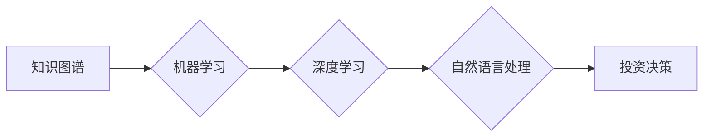

                 

## 知识型投资者的决策模式研究

> 关键词：知识图谱、投资决策、机器学习、深度学习、自然语言处理、风险评估、投资策略

## 1. 背景介绍

在当今数据爆炸的时代，信息获取和处理能力已成为投资决策的关键要素。传统投资决策模式往往依赖于经验、直觉和有限的历史数据，难以应对市场复杂性和不确定性。知识型投资者应善于利用海量数据和先进技术，构建知识体系，提升决策效率和准确性。

知识型投资决策的核心在于将投资领域相关知识进行结构化存储和推理，并结合机器学习和深度学习算法，实现智能化决策辅助。知识图谱作为一种新型的知识表示形式，能够有效地捕捉投资领域的多层次关系和复杂性，为知识型投资决策提供强大的支持。

## 2. 核心概念与联系

### 2.1 知识图谱

知识图谱是一种基于知识表示的数据库，它以实体和关系为基本单元，将知识以结构化的形式表示出来。在投资领域，知识图谱可以包含股票、基金、行业、公司、经济指标等实体，以及它们之间的关系，例如“公司A属于行业B”、“股票X涨幅超过行业平均值”等。

### 2.2 机器学习

机器学习是一种人工智能技术，它通过算法学习数据中的模式和规律，从而实现预测、分类、聚类等任务。在投资决策中，机器学习可以用于预测股票价格、识别投资机会、评估风险等。

### 2.3 深度学习

深度学习是机器学习的一个子领域，它利用多层神经网络模拟人类大脑的学习过程，能够处理更复杂的数据和任务。在投资领域，深度学习可以用于文本分析、图像识别、时间序列预测等，提升投资决策的智能化水平。

### 2.4 自然语言处理

自然语言处理 (NLP) 是一种人工智能技术，它能够理解和处理人类语言。在投资决策中，NLP可以用于分析新闻报道、财经评论、社交媒体数据等文本信息，提取投资相关的关键信息，辅助投资者做出更明智的决策。

**Mermaid 流程图**



## 3. 核心算法原理 & 具体操作步骤

### 3.1 算法原理概述

知识型投资决策算法通常基于以下核心原理：

* **知识表示与推理:** 利用知识图谱存储和表示投资领域知识，并通过规则引擎或逻辑推理算法进行知识推理，挖掘隐藏的投资线索。
* **数据挖掘与特征提取:** 从海量数据中挖掘投资相关的特征，例如股票价格、交易量、新闻 sentiment、社交媒体热度等，构建投资模型。
* **机器学习与预测:** 利用机器学习算法，例如回归、分类、聚类等，对投资数据进行建模和预测，辅助投资者做出决策。
* **风险评估与控制:** 通过统计分析、模拟建模等方法，评估投资风险，并制定相应的风险控制策略。

### 3.2 算法步骤详解

1. **知识图谱构建:** 收集投资领域相关数据，例如公司信息、财务报表、行业报告、新闻报道等，并将其转化为知识图谱的形式。
2. **数据预处理:** 对收集到的数据进行清洗、转换、标准化等预处理操作，确保数据质量和算法训练效果。
3. **特征工程:** 从预处理后的数据中提取投资相关的特征，例如股票价格、交易量、新闻 sentiment、社交媒体热度等，并进行特征选择和降维。
4. **模型训练:** 利用机器学习算法，例如回归、分类、聚类等，对特征数据进行建模和训练，构建投资预测模型。
5. **模型评估:** 对训练好的模型进行评估，例如使用准确率、召回率、F1-score等指标，评估模型的性能。
6. **投资决策:** 将模型预测结果与投资策略结合，进行投资决策，例如买入、卖出、持有等。
7. **风险管理:** 对投资组合进行风险评估，并制定相应的风险控制策略，例如分散投资、止损策略等。

### 3.3 算法优缺点

**优点:**

* **数据驱动:** 基于海量数据分析，提升决策的客观性和准确性。
* **智能化:** 利用机器学习和深度学习算法，实现智能化决策辅助。
* **效率提升:** 自动化决策流程，提高决策效率。

**缺点:**

* **数据依赖:** 算法性能依赖于数据质量和数量。
* **黑盒问题:** 一些深度学习算法难以解释，导致决策缺乏透明度。
* **市场变化:** 算法需要不断更新和调整，以适应不断变化的市场环境。

### 3.4 算法应用领域

* **股票投资:** 预测股票价格走势、识别投资机会、评估风险。
* **基金投资:** 选择合适的基金产品、优化基金组合、降低投资风险。
* **资产配置:** 根据投资者风险偏好和目标，制定合理的资产配置方案。
* **量化投资:** 利用算法进行自动化交易，实现更高效的投资管理。

## 4. 数学模型和公式 & 详细讲解 & 举例说明

### 4.1 数学模型构建

在知识型投资决策中，常用的数学模型包括：

* **回归模型:** 用于预测连续变量，例如股票价格。
* **分类模型:** 用于分类数据，例如判断股票是否上涨或下跌。
* **聚类模型:** 用于将数据分组，例如将股票按照行业进行分类。

### 4.2 公式推导过程

**线性回归模型:**

假设我们想要预测股票价格 $y$，并认为股票价格与以下特征相关：

* $x_1$: 股票的历史价格
* $x_2$: 股票的交易量
* $x_3$: 公司的盈利能力

我们可以使用线性回归模型进行预测：

$$y = \beta_0 + \beta_1x_1 + \beta_2x_2 + \beta_3x_3 + \epsilon$$

其中：

* $\beta_0$, $\beta_1$, $\beta_2$, $\beta_3$ 是模型参数，需要通过训练数据进行估计。
* $\epsilon$ 是误差项，代表预测值与实际值之间的偏差。

通过最小二乘法等方法，可以估计模型参数，得到最终的预测模型。

### 4.3 案例分析与讲解

假设我们想要预测某只股票的未来价格，并收集了以下数据：

* 股票的历史价格：$x_1 = [100, 110, 120, 130, 140]$
* 股票的交易量：$x_2 = [10000, 12000, 15000, 18000, 20000]$
* 公司的盈利能力：$x_3 = [10, 12, 15, 18, 20]$
* 股票的实际价格：$y = [110, 130, 145, 160, 175]$

我们可以使用线性回归模型对这些数据进行训练，得到预测模型。然后，我们可以输入新的特征数据，例如未来一周的股票价格、交易量和盈利能力，利用预测模型预测未来一周的股票价格。

## 5. 项目实践：代码实例和详细解释说明

### 5.1 开发环境搭建

* Python 3.x
* Jupyter Notebook
* pandas
* scikit-learn
* TensorFlow/PyTorch

### 5.2 源代码详细实现

```python
import pandas as pd
from sklearn.linear_model import LinearRegression

# 加载数据
data = pd.read_csv('stock_data.csv')

# 选择特征和目标变量
X = data[['历史价格', '交易量', '盈利能力']]
y = data['实际价格']

# 创建线性回归模型
model = LinearRegression()

# 训练模型
model.fit(X, y)

# 预测未来价格
future_data = pd.DataFrame({'历史价格': [150], '交易量': [25000], '盈利能力': [25]})
predicted_price = model.predict(future_data)

# 打印预测结果
print(f'预测价格: {predicted_price[0]}')
```

### 5.3 代码解读与分析

* 首先，我们使用 pandas 库加载股票数据。
* 然后，我们选择股票价格、交易量和盈利能力作为特征，以及实际价格作为目标变量。
* 接下来，我们创建线性回归模型，并使用训练数据进行模型训练。
* 最后，我们使用训练好的模型预测未来一周的股票价格。

### 5.4 运行结果展示

运行上述代码后，会输出预测的股票价格。

## 6. 实际应用场景

知识型投资决策已经应用于各个投资领域，例如：

* **量化投资:** 利用算法进行自动化交易，实现更高效的投资管理。
* **风险管理:** 通过统计分析和模拟建模，评估投资风险，并制定相应的风险控制策略。
* **个性化投资:** 根据投资者的风险偏好和目标，制定个性化的投资方案。

### 6.4 未来应用展望

随着人工智能技术的不断发展，知识型投资决策将更加智能化、自动化和个性化。未来，知识型投资决策可能应用于以下领域：

* **自动投资平台:** 基于人工智能算法，自动进行投资决策，为普通投资者提供便捷的投资服务。
* **智能投资顾问:** 利用自然语言处理技术，与投资者进行自然语言交互，提供个性化的投资建议。
* **区块链投资:** 利用区块链技术，构建更加透明、安全和高效的投资平台。

## 7. 工具和资源推荐

### 7.1 学习资源推荐

* **书籍:**
    * 《深度学习》
    * 《机器学习实战》
    * 《Python数据科学手册》
* **在线课程:**
    * Coursera
    * edX
    * Udacity

### 7.2 开发工具推荐

* **Python:** 
    * pandas
    * scikit-learn
    * TensorFlow/PyTorch
* **数据可视化工具:**
    * Matplotlib
    * Seaborn
    * Plotly

### 7.3 相关论文推荐

* **Knowledge Graph Embedding for Stock Market Prediction**
* **Deep Learning for Financial Time Series Forecasting**
* **Natural Language Processing for Financial Text Analysis**

## 8. 总结：未来发展趋势与挑战

### 8.1 研究成果总结

知识型投资决策已经取得了显著的成果，能够有效地提升投资决策的效率和准确性。

### 8.2 未来发展趋势

未来，知识型投资决策将朝着以下方向发展：

* **更加智能化:** 利用更先进的人工智能算法，实现更智能的投资决策。
* **更加个性化:** 根据投资者的风险偏好和目标，提供更加个性化的投资方案。
* **更加透明化:** 提高算法的解释性，增强投资决策的透明度。

### 8.3 面临的挑战

知识型投资决策也面临着一些挑战：

* **数据质量:** 算法性能依赖于数据质量，需要不断收集和清洗数据。
* **算法解释性:** 一些深度学习算法难以解释，导致决策缺乏透明度。
* **市场变化:** 算法需要不断更新和调整，以适应不断变化的市场环境。

### 8.4 研究展望

未来，我们需要继续研究以下问题：

* 如何提高算法的解释性，增强投资决策的透明度。
* 如何应对市场变化，使算法更加适应动态环境。
* 如何将知识型投资决策与其他金融技术结合，构建更加完善的金融生态系统。

## 9. 附录：常见问题与解答

**Q1: 知识型投资决策是否能够保证投资收益？**

**A1:** 知识型投资决策可以提高投资决策的效率和准确性，但不能保证投资收益。投资始终存在风险，任何投资决策都可能导致亏损。

**Q2: 知识型投资决策需要哪些技术技能？**

**A2:** 知识型投资决策需要掌握以下技术技能：

* 数据分析
* 机器学习
* 深度学习
* 自然语言处理

**Q3: 知识型投资决策的成本如何？**

**A3:** 知识型投资决策的成本取决于具体的应用场景和技术方案。一般来说，需要投入一定的资金和人力资源进行数据收集、模型训练和系统开发。

作者：禅与计算机程序设计艺术 / Zen and the Art of Computer Programming


<end_of_turn>

