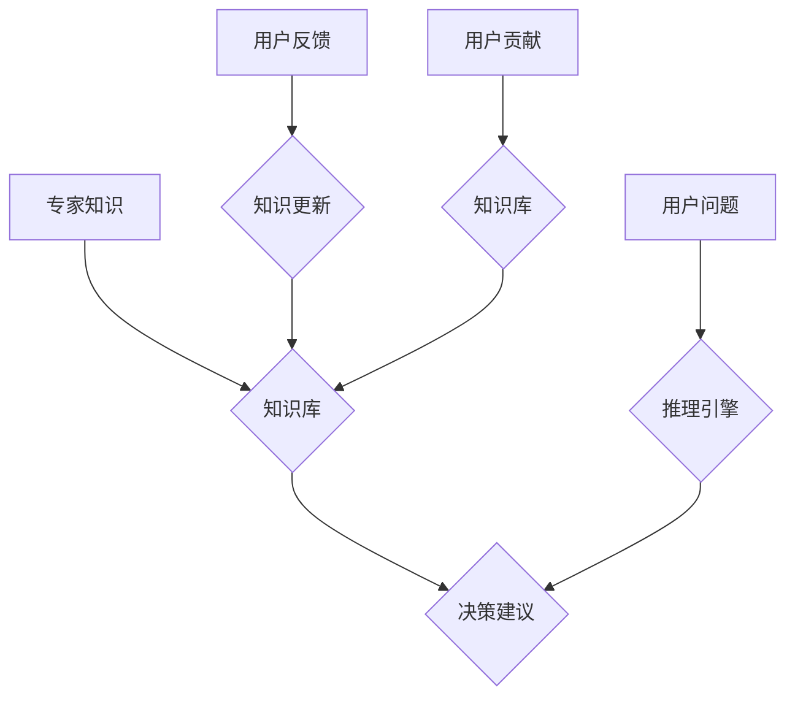

                 

## 知识的权威性：专家系统与群众智慧

> 关键词：专家系统、群众智慧、知识图谱、机器学习、深度学习、自然语言处理、人工智能、决策支持

## 1. 背景介绍

在信息爆炸的时代，人类面临着海量数据的挑战。如何从海量数据中提取有价值的知识，并将其转化为决策支持和智能应用，成为一个重要的研究课题。传统专家系统依靠人工构建的知识库，具有局限性，难以适应知识的动态变化和复杂性。而群众智慧，即通过众包和协同的方式获取和积累知识，展现出强大的潜力。本文将探讨专家系统和群众智慧的本质、联系和发展趋势，并分析它们在知识获取、决策支持和智能应用中的应用场景。

## 2. 核心概念与联系

**2.1 专家系统**

专家系统是一种利用人工智能技术，模拟人类专家决策过程的软件系统。它通常由知识库、推理引擎和用户接口三个主要部分组成：

* **知识库:** 存储专家领域内的知识和规则，通常由专家通过访谈、文档分析等方式获取并人工编码。
* **推理引擎:** 根据用户输入和知识库中的规则，进行逻辑推理和决策，并给出建议或解决方案。
* **用户接口:** 提供用户与专家系统交互的界面，方便用户输入问题和接收结果。

**2.2 群众智慧**

群众智慧是指通过网络平台和协同机制，汇集和整合来自众多个体用户的知识、经验和观点，从而产生超越单个用户的智慧。它利用网络的规模效应和用户多样性，可以有效地解决复杂问题和获取新的知识。

**2.3 专家系统与群众智慧的联系**

专家系统和群众智慧在知识获取和决策支持方面存在着互补性。专家系统可以提供结构化和可靠的知识，而群众智慧可以补充专家系统不足的知识和视角，形成更加全面的知识体系。

**2.4  Mermaid 流程图**



## 3. 核心算法原理 & 具体操作步骤

**3.1 算法原理概述**

专家系统和群众智慧的算法原理主要包括：

* **知识表示和推理:** 专家系统利用符号逻辑、规则网络等方法表示知识，并通过推理引擎进行逻辑推理和决策。
* **机器学习和深度学习:** 群众智慧可以利用机器学习和深度学习算法，从用户的行为数据、文本数据等中提取知识和模式。
* **自然语言处理:** 自然语言处理技术可以帮助专家系统和群众智慧系统理解和处理用户的自然语言输入，并生成自然语言输出。

**3.2 算法步骤详解**

**3.2.1 专家系统算法步骤**

1. **知识获取:** 通过访谈专家、分析文档等方式获取专家领域内的知识和规则。
2. **知识表示:** 将获取的知识和规则转化为专家系统可以理解的符号形式，例如规则网络、知识图谱等。
3. **推理引擎构建:** 根据知识表示形式，构建推理引擎，实现知识推理和决策功能。
4. **用户接口设计:** 设计用户友好的交互界面，方便用户与专家系统进行交互。
5. **系统测试和维护:** 对专家系统进行测试和维护，确保其准确性和可靠性。

**3.2.2 群众智慧算法步骤**

1. **数据收集:** 收集来自用户行为、文本、社交网络等方面的丰富数据。
2. **数据预处理:** 对收集到的数据进行清洗、转换和格式化，以便于后续分析。
3. **特征提取:** 利用机器学习和深度学习算法，从数据中提取有价值的特征，例如用户兴趣、行为模式、文本主题等。
4. **模型训练:** 利用训练数据，训练机器学习和深度学习模型，例如分类模型、聚类模型、推荐模型等。
5. **知识发现和推理:** 利用训练好的模型，进行知识发现和推理，例如识别用户需求、预测用户行为、生成知识图谱等。
6. **结果展示和反馈:** 将发现的知识和推理结果以可视化和易于理解的方式展示给用户，并收集用户反馈，用于模型改进和知识更新。

**3.3 算法优缺点**

**3.3.1 专家系统**

* **优点:** 能够提供结构化、可靠的知识和决策建议，适用于需要高准确性和可靠性的领域。
* **缺点:** 知识库的构建和维护成本高，难以适应知识的动态变化和复杂性。

**3.3.2 群众智慧**

* **优点:** 可以利用网络规模效应和用户多样性，获取更加全面的知识和视角，适应知识的动态变化和复杂性。
* **缺点:** 数据质量和可靠性难以保证，需要进行有效的过滤和处理。

**3.4 算法应用领域**

* **专家系统:** 医疗诊断、金融风险评估、法律咨询、工业控制等领域。
* **群众智慧:** 产品设计、市场调研、舆情分析、创新孵化等领域。

## 4. 数学模型和公式 & 详细讲解 & 举例说明

**4.1 数学模型构建**

专家系统和群众智慧的数学模型可以基于概率论、统计学、图论等数学基础。例如，专家系统可以利用贝叶斯网络模型表示知识和推理过程，而群众智慧可以利用聚类算法和推荐算法构建用户行为模型和知识图谱。

**4.2 公式推导过程**

**4.2.1 贝叶斯网络模型**

贝叶斯网络是一种概率图模型，用于表示随机变量之间的依赖关系。其核心公式是贝叶斯定理：

$$P(A|B) = \frac{P(B|A)P(A)}{P(B)}$$

其中：

* $P(A|B)$ 是在已知事件 B 发生的情况下，事件 A 发生的概率。
* $P(B|A)$ 是在已知事件 A 发生的情况下，事件 B 发生的概率。
* $P(A)$ 是事件 A 发生的概率。
* $P(B)$ 是事件 B 发生的概率。

**4.2.2 聚类算法**

聚类算法是一种无监督学习算法，用于将数据点划分为若干个簇。常用的聚类算法包括k-means算法和层次聚类算法。

**4.3 案例分析与讲解**

**4.3.1 专家系统案例**

在医疗诊断领域，专家系统可以利用贝叶斯网络模型，将患者的症状、病史、检查结果等信息作为输入，并根据专家知识库进行推理，给出可能的诊断结果和治疗方案。

**4.3.2 群众智慧案例**

在产品设计领域，可以通过收集用户反馈、评论和行为数据，利用聚类算法和推荐算法，分析用户需求和偏好，从而设计出更符合用户期望的产品。

## 5. 项目实践：代码实例和详细解释说明

**5.1 开发环境搭建**

* Python 3.x
* Jupyter Notebook
* scikit-learn
* TensorFlow/PyTorch

**5.2 源代码详细实现**

```python
# 导入必要的库
import pandas as pd
from sklearn.cluster import KMeans

# 加载数据
data = pd.read_csv('user_data.csv')

# 选择特征变量
features = ['age', 'gender', 'income', 'purchase_history']
X = data[features]

# 训练KMeans聚类模型
kmeans = KMeans(n_clusters=3, random_state=42)
kmeans.fit(X)

# 获取聚类结果
labels = kmeans.labels_
data['cluster'] = labels

# 分析聚类结果
print(data.groupby('cluster').mean())
```

**5.3 代码解读与分析**

* 该代码示例展示了如何使用KMeans算法进行用户聚类。
* 首先，导入必要的库，并加载用户数据。
* 然后，选择特征变量，并将其作为输入数据训练KMeans模型。
* 训练完成后，可以获取每个用户的聚类标签，并分析不同聚类群体的特征。

**5.4 运行结果展示**

运行结果将显示每个聚类群体的平均特征值，例如年龄、性别、收入等，可以帮助我们了解不同用户群体的特征和偏好。

## 6. 实际应用场景

**6.1 医疗诊断**

专家系统可以辅助医生进行疾病诊断，根据患者的症状、病史和检查结果，提供可能的诊断结果和治疗方案。

**6.2 金融风险评估**

专家系统可以帮助银行和金融机构评估客户的信用风险，根据客户的财务状况、信用记录等信息，判断客户是否具备贷款资格。

**6.3 市场营销**

群众智慧可以帮助企业了解用户的需求和偏好，通过收集用户反馈、评论和行为数据，进行市场调研和产品设计。

**6.4 未来应用展望**

随着人工智能技术的不断发展，专家系统和群众智慧将更加智能化、个性化和自动化。

## 7. 工具和资源推荐

**7.1 学习资源推荐**

* **书籍:**
    * 《人工智能：现代方法》
    * 《深度学习》
    * 《专家系统》
* **在线课程:**
    * Coursera
    * edX
    * Udacity

**7.2 开发工具推荐**

* **Python:** 
    * scikit-learn
    * TensorFlow
    * PyTorch
* **Java:** 
    * Drools
    * Jess

**7.3 相关论文推荐**

* **专家系统:**
    * "A Brief History of Expert Systems"
    * "Expert Systems: Principles and Applications"
* **群众智慧:**
    * "Wisdom of the Crowd"
    * "Collective Intelligence"

## 8. 总结：未来发展趋势与挑战

**8.1 研究成果总结**

专家系统和群众智慧在知识获取、决策支持和智能应用方面取得了显著成果，为解决复杂问题和提升人类智能提供了新的思路和方法。

**8.2 未来发展趋势**

* **融合发展:** 专家系统和群众智慧将更加融合，形成更加智能化和高效的知识获取和决策支持系统。
* **跨领域应用:** 专家系统和群众智慧将应用于更多领域，例如医疗、教育、金融、交通等。
* **个性化定制:** 专家系统和群众智慧将更加个性化，根据用户的需求和偏好提供定制化的知识和服务。

**8.3 面临的挑战**

* **知识表示和推理:** 如何更加有效地表示和推理复杂知识，是专家系统面临的挑战。
* **数据质量和可靠性:** 群众智慧依赖于数据的质量和可靠性，如何有效地过滤和处理数据，是其面临的挑战。
* **伦理和安全:** 专家系统和群众智慧的应用需要考虑伦理和安全问题，例如数据隐私、算法偏见等。

**8.4 研究展望**

未来，研究者将继续探索专家系统和群众智慧的融合发展，开发更加智能化、高效化和安全的知识获取和决策支持系统，为人类社会的发展做出更大的贡献。

## 9. 附录：常见问题与解答

**9.1 专家系统和机器学习有什么区别？**

专家系统基于人工构建的知识库，而机器学习算法通过数据训练，自动学习知识。

**9.2 群众智慧的应用场景有哪些？**

群众智慧可以应用于产品设计、市场调研、舆情分析、创新孵化等领域。

**9.3 如何评估专家系统和群众智慧的性能？**

专家系统的性能可以评估其准确率、可靠性和效率，而群众智慧的性能可以评估其预测准确率、覆盖范围和用户满意度。


作者：禅与计算机程序设计艺术 / Zen and the Art of Computer Programming 
<end_of_turn>

