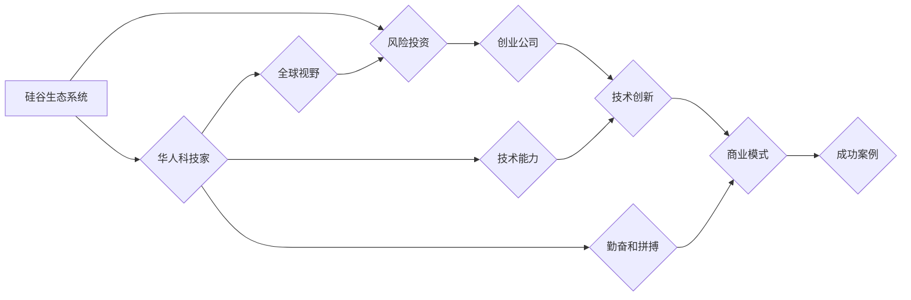

                 

## 硅谷创业家族传奇:华人科技富豪

> 关键词：硅谷，华人科技，创业家族，科技富豪，人工智能，软件架构，技术创新

## 1. 背景介绍

硅谷，作为全球科技创新的中心，孕育了无数科技巨头和富豪。其中，华人科技家在硅谷的崛起，不仅是个人奋斗的成功故事，更体现了中国科技力量的崛起和全球影响力。从早期创业者到如今的科技巨头，华人科技家们凭借着对技术的敏锐洞察、不懈的努力和独特的文化背景，在硅谷写下了属于自己的传奇。

近年来，越来越多的华人科技家族涌现，他们不仅在科技领域取得了巨大成功，也积极回馈社会，推动科技进步和人类福祉。本文将深入探讨华人科技家族的崛起之路，分析其背后的核心概念、技术创新和商业模式，并展望未来发展趋势。

## 2. 核心概念与联系

**2.1  硅谷生态系统**

硅谷的成功离不开其独特的生态系统，包括：

* **顶尖大学和科研机构:** 斯坦福大学、加州大学伯克利分校等高校为硅谷输送了大量优秀人才，并推动了前沿科技研究。
* **风险投资和创业文化:** 硅谷拥有成熟的风险投资体系和浓厚的创业文化，为科技创新提供了充足的资金和土壤。
* **产业集群和合作:** 硅谷聚集了众多科技公司和相关产业，形成了强大的产业集群效应，促进了技术交流和合作。

**2.2  华人科技家优势**

华人科技家在硅谷取得成功的关键因素包括：

* **技术能力:** 华人科技家普遍拥有扎实的技术背景和创新能力，能够快速掌握新技术并将其应用于实际问题。
* **勤奋和拼搏:** 华人文化强调勤奋和努力，华人科技家们通常具有强烈的责任感和使命感，愿意付出艰辛的努力去实现目标。
* **全球视野:** 许多华人科技家拥有海外留学经历，他们具备国际化视野和跨文化沟通能力，能够更好地融入硅谷生态系统。

**2.3  技术创新与商业模式**

华人科技家们在硅谷的成功离不开对技术的敏锐洞察和创新的商业模式。他们往往能够将新技术应用于实际问题，并将其转化为商业价值。例如，阿里巴巴的电商平台、腾讯的社交网络、百度搜索引擎等，都是华人科技家们利用技术创新创造的商业奇迹。

**Mermaid 流程图**



## 3. 核心算法原理 & 具体操作步骤

**3.1  算法原理概述**

本文将以深度学习算法为例，探讨其核心原理和具体操作步骤。深度学习是一种机器学习的子领域，它利用多层神经网络来模拟人类大脑的学习过程。深度学习算法能够从海量数据中自动提取特征，并进行复杂的模式识别和预测。

**3.2  算法步骤详解**

深度学习算法的具体操作步骤如下：

1. **数据预处理:** 收集和清洗数据，将其转换为深度学习模型可以理解的格式。
2. **网络结构设计:** 根据具体任务选择合适的网络结构，例如卷积神经网络、循环神经网络等。
3. **参数初始化:** 为网络中的参数赋予初始值。
4. **前向传播:** 将输入数据通过网络层层传递，最终得到输出结果。
5. **损失函数计算:** 计算模型输出结果与真实值的差异，即损失值。
6. **反向传播:** 根据损失值，调整网络参数，使模型输出结果更接近真实值。
7. **迭代训练:** 重复前向传播和反向传播的过程，直到模型达到预期的性能。

**3.3  算法优缺点**

**优点:**

* **高精度:** 深度学习算法能够从海量数据中自动提取特征，从而实现高精度的模式识别和预测。
* **自动化学习:** 深度学习算法能够自动学习数据中的模式，无需人工特征工程。
* **泛化能力强:** 深度学习模型能够泛化到新的数据，具有较强的应用推广能力。

**缺点:**

* **数据依赖:** 深度学习算法需要大量的训练数据才能达到较好的性能。
* **计算资源消耗大:** 深度学习模型训练需要大量的计算资源，训练时间较长。
* **可解释性差:** 深度学习模型的决策过程较为复杂，难以解释其背后的逻辑。

**3.4  算法应用领域**

深度学习算法广泛应用于各个领域，例如：

* **计算机视觉:** 图像识别、物体检测、图像分割等。
* **自然语言处理:** 文本分类、机器翻译、语音识别等。
* **推荐系统:** 商品推荐、内容推荐等。
* **医疗诊断:** 病情预测、疾病诊断等。

## 4. 数学模型和公式 & 详细讲解 & 举例说明

**4.1  数学模型构建**

深度学习模型的核心是神经网络，它由多个神经元组成的层级结构组成。每个神经元接收来自上一层的输入信号，并对其进行处理，输出到下一层。神经网络的学习过程本质上是调整神经元之间的连接权重，使得模型能够准确地映射输入到输出。

**4.2  公式推导过程**

深度学习模型的训练过程通常使用梯度下降算法。梯度下降算法的目标是找到一个最优的权重值，使得模型的损失函数最小化。损失函数衡量模型输出结果与真实值的差异。梯度下降算法通过计算损失函数的梯度，不断调整权重值，朝着损失函数最小化的方向前进。

**4.3  案例分析与讲解**

例如，在图像识别任务中，深度学习模型会将图像输入到卷积神经网络中。卷积神经网络通过卷积操作和池化操作来提取图像特征。然后，这些特征会被传递到全连接层，最终输出图像类别。

**数学公式:**

* 损失函数: $L(W,b) = \frac{1}{N} \sum_{i=1}^{N} \mathcal{L}(y_i, \hat{y}_i)$

* 梯度下降算法: $W = W - \alpha \frac{\partial L}{\partial W}$

其中:

* $W$ 和 $b$ 分别表示模型的权重和偏置。
* $N$ 表示训练样本的数量。
* $\mathcal{L}(y_i, \hat{y}_i)$ 表示第 $i$ 个样本的损失值。
* $y_i$ 表示第 $i$ 个样本的真实值。
* $\hat{y}_i$ 表示第 $i$ 个样本的预测值。
* $\alpha$ 表示学习率。

## 5. 项目实践：代码实例和详细解释说明

**5.1  开发环境搭建**

深度学习模型的开发通常使用 Python 语言和相关的深度学习框架，例如 TensorFlow、PyTorch 等。

**5.2  源代码详细实现**

以下是一个简单的深度学习模型的代码示例，使用 TensorFlow 框架实现图像分类任务：

```python
import tensorflow as tf

# 定义模型结构
model = tf.keras.models.Sequential([
    tf.keras.layers.Conv2D(32, (3, 3), activation='relu', input_shape=(28, 28, 1)),
    tf.keras.layers.MaxPooling2D((2, 2)),
    tf.keras.layers.Conv2D(64, (3, 3), activation='relu'),
    tf.keras.layers.MaxPooling2D((2, 2)),
    tf.keras.layers.Flatten(),
    tf.keras.layers.Dense(10, activation='softmax')
])

# 编译模型
model.compile(optimizer='adam',
              loss='sparse_categorical_crossentropy',
              metrics=['accuracy'])

# 训练模型
model.fit(x_train, y_train, epochs=5)

# 评估模型
loss, accuracy = model.evaluate(x_test, y_test)
print('Test loss:', loss)
print('Test accuracy:', accuracy)
```

**5.3  代码解读与分析**

这段代码定义了一个简单的卷积神经网络模型，用于图像分类任务。模型包含两个卷积层、两个池化层、一个全连接层和一个输出层。

* **Conv2D层:** 用于提取图像特征。
* **MaxPooling2D层:** 用于降维，减少计算量。
* **Flatten层:** 将多维特征转换为一维向量。
* **Dense层:** 全连接层，用于分类。

**5.4  运行结果展示**

训练完成后，模型可以用来预测新的图像类别。

## 6. 实际应用场景

深度学习算法在各个领域都有广泛的应用场景，例如：

* **医疗诊断:** 深度学习算法可以用于分析医学图像，辅助医生诊断疾病。
* **金融风险控制:** 深度学习算法可以用于识别金融欺诈和评估风险。
* **智能客服:** 深度学习算法可以用于构建智能聊天机器人，提供客户服务。

**6.4  未来应用展望**

随着深度学习算法的不断发展，其应用场景将更加广泛，例如：

* **个性化教育:** 深度学习算法可以根据学生的学习情况，提供个性化的学习方案。
* **自动驾驶:** 深度学习算法可以用于训练自动驾驶汽车，实现自动驾驶功能。
* **药物研发:** 深度学习算法可以用于加速药物研发，发现新的药物。

## 7. 工具和资源推荐

**7.1  学习资源推荐**

* **在线课程:** Coursera、edX、Udacity 等平台提供深度学习相关的在线课程。
* **书籍:** 《深度学习》、《神经网络与深度学习》等书籍。
* **博客和论坛:** TensorFlow、PyTorch 等深度学习框架的官方博客和论坛。

**7.2  开发工具推荐**

* **TensorFlow:** Google 开发的开源深度学习框架。
* **PyTorch:** Facebook 开发的开源深度学习框架。
* **Keras:** TensorFlow 上的深度学习 API，易于使用。

**7.3  相关论文推荐**

* **AlexNet:** 《ImageNet Classification with Deep Convolutional Neural Networks》
* **VGGNet:** 《Very Deep Convolutional Networks for Large-Scale Image Recognition》
* **ResNet:** 《Deep Residual Learning for Image Recognition》

## 8. 总结：未来发展趋势与挑战

**8.1  研究成果总结**

近年来，深度学习算法取得了显著的进展，在图像识别、自然语言处理等领域取得了突破性成果。

**8.2  未来发展趋势**

* **模型规模和复杂度提升:** 深度学习模型将继续朝着更大、更复杂的方向发展。
* **算法效率和可解释性提升:** 研究者将致力于提高深度学习算法的效率和可解释性。
* **跨模态学习:** 深度学习模型将能够处理多种模态数据，例如文本、图像、音频等。

**8.3  面临的挑战**

* **数据获取和隐私保护:** 深度学习算法需要大量的训练数据，如何获取高质量数据并保护用户隐私是一个挑战。
* **模型安全性和可控性:** 深度学习模型的决策过程较为复杂，如何保证模型的安全性和可控性是一个重要问题。
* **伦理和社会影响:** 深度学习算法的应用可能会带来伦理和社会问题，需要进行深入的思考和讨论。

**8.4  研究展望**

未来，深度学习算法将继续推动人工智能的发展，并应用于更多领域，为人类社会带来更多福祉。


## 9. 附录：常见问题与解答

**9.1  深度学习算法需要多少数据才能训练？**

深度学习算法对数据的依赖程度较高，一般来说，需要大量的训练数据才能达到较好的性能。

**9.2  深度学习算法的训练时间有多长？**

深度学习模型的训练时间取决于模型的复杂度、数据量和硬件资源等因素。

**9.3  如何评估深度学习模型的性能？**

常用的评估指标包括准确率、召回率、F1-score 等。

**9.4  如何防止深度学习模型过拟合？**

常用的方法包括正则化、数据增强、交叉验证等。


作者：禅与计算机程序设计艺术 / Zen and the Art of Computer Programming 
<end_of_turn>

