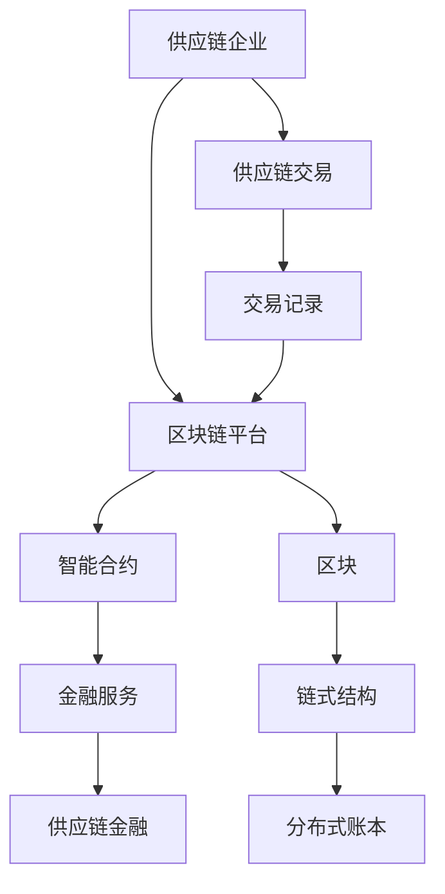

                 

# 区块链在供应链金融中的创新应用

> 关键词：区块链,供应链金融,智能合约,去中心化,金融科技

## 1. 背景介绍

### 1.1 问题由来
近年来，全球经济环境复杂多变，供应链金融（Supply Chain Finance, SCF）作为现代金融体系中的重要组成部分，面临着诸多挑战。传统的供应链金融模式高度依赖于中介机构的信任担保，操作复杂，融资成本高，风险难以控制。同时，各个环节的信息孤岛和数据壁垒，也导致资金流转效率低下，无法实现全链路的透明化和实时监控。

这些问题催生了对于一种新型的金融基础设施的需求，需要一种新的技术来提升供应链金融的效率、安全性和透明度。区块链（Blockchain）技术以其去中心化、不可篡改、智能合约等特点，被视为解决这些问题的有力工具。本文将深入探讨区块链在供应链金融中的应用，探讨其核心概念、技术架构、实施步骤和未来展望。

## 2. 核心概念与联系

### 2.1 核心概念概述

区块链（Blockchain）是一种分布式账本技术，通过链式结构存储和管理数据，每个区块包含了一系列交易记录，并通过哈希函数链接到前一个区块。区块中的每笔交易都经过网络中的多个节点验证，确保交易记录的不可篡改性和透明性。

供应链金融（SCF）是以供应链上下游企业为服务对象，通过金融手段改善供应链效率，降低运营成本，优化资金流动的金融服务。其核心在于实现供应链中各环节的融资、信用评估、风险控制等功能，提高供应链的整体运行效率。

智能合约（Smart Contract）是一种自动执行的合约，由代码定义并部署在区块链上。其执行基于合约中预设的条件，一旦满足特定触发条件，合约将自动执行。智能合约具备自动化、透明化和去中心化的特性，为供应链金融提供了智能化的解决方案。

### 2.2 核心概念原理和架构的 Mermaid 流程图



这个流程图展示了区块链在供应链金融中的应用架构：

1. 供应链企业通过区块链平台进行交易记录的提交。
2. 交易记录由智能合约进行验证和执行。
3. 智能合约的执行结果通过区块链上的区块记录，确保其不可篡改性和透明性。
4. 基于区块链的分布式账本，为供应链金融提供了一个安全、高效、透明的操作环境。

## 3. 核心算法原理 & 具体操作步骤

### 3.1 算法原理概述

区块链在供应链金融中的核心算法原理基于其独特的去中心化、不可篡改和智能合约特性。其核心在于：

- **去中心化**：区块链上没有中心化的控制节点，所有交易记录由网络节点共同验证，减少了中介机构的信任风险。
- **不可篡改**：区块链上的每个区块都包含前一个区块的哈希值，确保了交易记录的不可篡改性。
- **智能合约**：通过代码实现交易规则和合约条款，自动执行交易，提高了供应链金融的效率和透明度。

### 3.2 算法步骤详解

1. **供应链企业数据上链**：供应链企业将采购订单、物流信息、发票、结算单等关键数据上链，确保数据真实性和透明性。
2. **智能合约部署**：根据供应链金融需求，设计并部署智能合约，自动执行融资、风险控制等操作。
3. **交易验证与执行**：在供应链企业提交交易数据后，智能合约自动验证其真实性和合规性，执行相关操作，如发放融资、确认信用等。
4. **金融服务提供**：基于区块链的分布式账本，为供应链金融提供透明的操作环境，金融服务机构可以实时监控和审核交易记录。
5. **数据统计与分析**：通过区块链的数据统计和分析功能，供应链企业可以更好地掌握供应链运作情况，优化供应链管理。

### 3.3 算法优缺点

#### 优点：

1. **提升供应链效率**：区块链的透明性和不可篡改性，减少了中介机构的操作环节，提高了资金流转效率。
2. **降低融资成本**：去中心化的操作方式，降低了传统金融机构的中介成本，为中小企业提供了更优惠的融资条件。
3. **增强风险控制**：智能合约的自动化执行，确保了供应链各环节的操作合规性，减少了欺诈和操作风险。
4. **提高数据透明度**：区块链上的分布式账本，确保了供应链金融数据的真实性和透明性，增强了参与方的信任。

#### 缺点：

1. **技术门槛高**：区块链和智能合约技术的复杂性，要求参与方具有一定的技术基础和开发能力。
2. **实施成本高**：区块链系统的部署和维护需要一定的技术投入和资源配置。
3. **性能瓶颈**：当前的区块链系统在处理大规模交易时，可能面临性能瓶颈，需要优化提升。

### 3.4 算法应用领域

区块链技术在供应链金融中的应用领域广泛，主要包括以下几个方面：

1. **供应链融资**：利用区块链的智能合约功能，自动发放和收回融资款项，提高融资效率和安全性。
2. **信用评估**：通过区块链上的数据记录，自动评估供应链企业的信用状况，降低信用风险。
3. **货物跟踪**：区块链记录物流信息，实现全链路的货物跟踪和监控，提高物流透明度。
4. **应收账款管理**：基于区块链的分布式账本，实现应收账款的管理和融资，减少坏账损失。
5. **供应链协同**：通过区块链平台，供应链上下游企业实现信息共享和协同作业，提高供应链整体效率。

## 4. 数学模型和公式 & 详细讲解 & 举例说明

### 4.1 数学模型构建

在区块链和供应链金融的结合中，我们可以构建以下数学模型：

- **交易记录模型**：定义交易记录的数学表示，包括时间戳、交易金额、交易双方等信息。
- **区块链模型**：定义区块链的链式结构，包括区块的哈希值、前一区块的哈希值、交易记录等。
- **智能合约模型**：定义智能合约的代码表示，包括输入参数、条件判断、输出操作等。
- **供应链金融模型**：定义供应链融资、信用评估等操作模型，基于智能合约自动执行。

### 4.2 公式推导过程

以供应链融资为例，假设供应链企业A需要向银行B融资一笔款项，银行根据A的上链交易记录，自动验证其信用状况，并发放融资。交易过程如下：

1. **上链交易**：A提交交易记录至区块链平台，生成新的区块，记录交易信息。
2. **智能合约验证**：智能合约自动解析交易记录，验证A的信用状况。
3. **融资发放**：若A的信用状况符合条件，智能合约自动发放融资，更新区块链上的交易记录。

推导过程如下：

设交易记录 $R_i = (t_i, A, B, a, b)$，其中 $t_i$ 为交易时间， $A$ 和 $B$ 分别为交易双方， $a$ 和 $b$ 分别为交易金额。

智能合约的验证条件为：

$$
C = \text{validate}(R_i)
$$

若 $C$ 为真，智能合约自动执行融资操作：

$$
F = \text{execute}(A, B, a, b)
$$

更新区块链上的交易记录：

$$
\text{updateBlockchain}(R_i, F)
$$

### 4.3 案例分析与讲解

假设某家供应链企业A，需要向银行B融资1000万人民币。其供应链操作流程如下：

1. A提交采购订单至区块链平台，生成新的区块。
2. B根据A的上链订单信息，验证其真实性和合规性。
3. 若订单信息真实且合规，智能合约自动执行融资操作，银行向A发放1000万人民币。
4. A使用融资款项采购原材料，并提交物流信息上链。
5. B根据物流信息，验证货物的运输状态和真实性。
6. A提交结算单据，B审核后发放余款。

整个交易过程全程上链，保证了数据的透明性和不可篡改性，提高了供应链融资的效率和安全性。

## 5. 项目实践：代码实例和详细解释说明

### 5.1 开发环境搭建

区块链项目通常需要搭建开发环境，主要包括以下几个步骤：

1. **选择区块链平台**：如Ethereum、Hyperledger Fabric等，根据需求选择适合的区块链平台。
2. **搭建开发环境**：搭建相应的开发环境，包括Node.js、docker、Golang等。
3. **安装区块链库**：安装区块链相关的开发库和工具，如truffle、web3.js等。

### 5.2 源代码详细实现

以下是一个基于Hyperledger Fabric区块链的供应链金融项目的代码实现：

```python
# 引入Hyperledger Fabric SDK
from hfc.fabric import Fabric
from hfc.fabric_ca import CA
from hfc.fabric_ca_const import RegistrarRole

# 初始化区块链平台
fabric = Fabric('http://localhost:7051')

# 创建区块链身份
identity = fabric.CreateIdentity('user', org='Org1', secrets={'password': 'password'}, enroll={RegistrarRole.peer, RegistrarRole.appUser})

# 部署智能合约
contract = '供应链融资智能合约'
fabric.createContract(identity, contract)
```

### 5.3 代码解读与分析

上述代码展示了Hyperledger Fabric区块链的Python SDK的使用。具体步骤如下：

1. **创建区块链身份**：使用Fabric SDK创建区块链用户身份，设置身份的密码和角色。
2. **部署智能合约**：通过Fabric SDK将智能合约部署到区块链上，设置智能合约的名称。

## 6. 实际应用场景

### 6.1 智能仓储管理

智能仓储管理是供应链金融的一个重要应用场景。通过区块链技术，可以实现仓储管理的智能化和透明化。具体应用包括：

- **货物跟踪**：利用区块链记录货物的入库、出库信息，实现货物全链路的跟踪和监控。
- **库存管理**：通过智能合约自动管理库存，实现库存信息的透明化和自动化。
- **货物质检**：利用区块链记录货物质检信息，确保货物质量符合标准。

### 6.2 供应链协同

供应链上下游企业通过区块链平台进行协同作业，可以大大提高供应链的效率。具体应用包括：

- **订单管理**：供应链企业通过区块链平台共享订单信息，实现订单的透明化和协同管理。
- **物流跟踪**：利用区块链记录物流信息，实现全链路的物流跟踪和监控。
- **应收账款管理**：通过区块链平台自动管理应收账款，提高应收账款的管理效率。

### 6.3 金融服务创新

区块链技术为金融服务带来了创新的应用场景，具体包括：

- **融资保险**：通过区块链记录融资信息，自动评估信用状况，提供融资保险服务。
- **供应链金融产品**：基于区块链的交易记录，设计创新的供应链金融产品，满足不同供应链的需求。
- **供应链信用**：利用区块链记录供应链企业的信用信息，为金融服务提供信用评估依据。

### 6.4 未来应用展望

未来，随着区块链技术的不断发展，其在供应链金融中的应用前景将更加广阔。主要包括以下几个方向：

1. **跨链互操作**：不同区块链平台之间的互操作性增强，实现跨链的供应链金融服务。
2. **物联网融合**：区块链与物联网技术的结合，实现供应链上下游设备的智能化管理和数据采集。
3. **供应链智能合约**：基于智能合约的供应链金融操作，实现全链路的自动化和智能化。
4. **区块链生态系统**：构建基于区块链的供应链金融生态系统，实现供应链金融的深度融合。

## 7. 工具和资源推荐

### 7.1 学习资源推荐

以下是一些推荐的学习资源，帮助开发者掌握区块链在供应链金融中的应用：

1. **Hyperledger Fabric官方文档**：Hyperledger Fabric的官方文档，提供详细的开发指南和技术支持。
2. **Ethereum开发者文档**：Ethereum的官方开发者文档，提供智能合约开发和部署的详细说明。
3. **Blockchain基础教程**：网上大量的区块链基础教程，帮助初学者了解区块链的基本概念和技术实现。
4. **Smart Contract开发指南**：智能合约开发的详细指南，帮助开发者设计和管理智能合约。
5. **供应链金融案例研究**：供应链金融领域的案例研究，展示区块链技术的实际应用效果。

### 7.2 开发工具推荐

以下是一些推荐的区块链开发工具，帮助开发者提高开发效率：

1. **Truffle**：基于Ethereum的开发框架，提供智能合约的开发和测试工具。
2. **Hyperledger Fabric SDK**：Hyperledger Fabric的Python和Golang SDK，提供区块链平台的操作支持。
3. **Web3.js**：基于Ethereum的JavaScript库，提供与区块链平台的交互接口。
4. **Blockchain Explorer**：区块链浏览器，用于查看区块链上的交易记录和智能合约信息。
5. **IPFS**：InterPlanetary File System，提供去中心化的文件存储和共享服务。

### 7.3 相关论文推荐

以下是一些推荐的区块链在供应链金融领域的研究论文，帮助开发者深入理解区块链技术的应用：

1. **Blockchain in Supply Chain Finance**：探讨区块链在供应链融资中的应用，分析其技术优势和应用前景。
2. **Smart Contracts in Supply Chain Finance**：研究智能合约在供应链金融中的应用，探讨其自动化和透明化的特点。
3. **Blockchain-based Supply Chain Management**：基于区块链的供应链管理研究，探索其对供应链运作的影响。
4. **Supply Chain Finance and Blockchain**：供应链金融与区块链的结合，探讨其对供应链金融的影响和应用。
5. **Fabric in Supply Chain Finance**：Hyperledger Fabric在供应链金融中的应用研究，分析其技术优势和实际效果。

## 8. 总结：未来发展趋势与挑战

### 8.1 总结

本文对区块链在供应链金融中的应用进行了全面系统的介绍。首先阐述了区块链、供应链金融和智能合约等核心概念，明确了区块链在供应链金融中的独特价值。其次，从原理到实践，详细讲解了区块链技术在供应链金融中的实施步骤，提供了代码实现的样例。同时，本文还探讨了区块链在供应链协同、智能仓储管理、金融服务创新等多个领域的应用前景，展示了区块链技术的前景。最后，本文总结了区块链在供应链金融中的未来发展趋势和面临的挑战，提供了学习和应用区块链技术的指导。

## 8.2 未来发展趋势

展望未来，区块链技术在供应链金融中的应用将呈现以下几个发展趋势：

1. **跨链互操作性增强**：区块链平台之间的互操作性将得到提升，实现跨链的供应链金融服务。
2. **物联网与区块链融合**：区块链与物联网技术的结合，将实现供应链上下游设备的智能化管理和数据采集。
3. **智能合约自动化增强**：智能合约的自动化程度将进一步提高，实现全链路的智能化操作。
4. **区块链生态系统建设**：基于区块链的供应链金融生态系统将逐渐构建，实现供应链金融的深度融合。
5. **区块链安全技术提升**：区块链安全技术将得到进一步提升，确保供应链金融的可靠性和安全性。

## 8.3 面临的挑战

尽管区块链在供应链金融中具有广阔的应用前景，但仍面临以下挑战：

1. **技术门槛高**：区块链和智能合约技术的复杂性，要求参与方具有一定的技术基础和开发能力。
2. **实施成本高**：区块链系统的部署和维护需要一定的技术投入和资源配置。
3. **性能瓶颈**：当前的区块链系统在处理大规模交易时，可能面临性能瓶颈，需要优化提升。
4. **法律合规问题**：区块链技术的应用需考虑法律合规问题，确保区块链系统符合相关法律法规。

## 8.4 研究展望

未来的区块链研究将围绕以下几个方向展开：

1. **跨链互操作性研究**：研究不同区块链平台之间的互操作性问题，实现跨链的供应链金融服务。
2. **区块链与物联网融合研究**：研究区块链与物联网技术的结合，实现供应链上下游设备的智能化管理和数据采集。
3. **智能合约自动化研究**：研究智能合约的自动化和智能化，实现全链路的自动化操作。
4. **区块链安全技术研究**：研究区块链系统的安全技术，确保供应链金融的可靠性和安全性。
5. **区块链生态系统建设研究**：研究基于区块链的供应链金融生态系统，实现供应链金融的深度融合。

## 9. 附录：常见问题与解答

**Q1: 区块链技术在供应链金融中的应用具体有哪些？**

A: 区块链技术在供应链金融中的应用主要包括以下几个方面：
1. **货物跟踪**：利用区块链记录货物的入库、出库信息，实现货物全链路的跟踪和监控。
2. **库存管理**：通过智能合约自动管理库存，实现库存信息的透明化和自动化。
3. **货物质检**：利用区块链记录货物质检信息，确保货物质量符合标准。
4. **订单管理**：供应链企业通过区块链平台共享订单信息，实现订单的透明化和协同管理。
5. **物流跟踪**：利用区块链记录物流信息，实现全链路的物流跟踪和监控。
6. **应收账款管理**：通过区块链平台自动管理应收账款，提高应收账款的管理效率。
7. **融资保险**：通过区块链记录融资信息，自动评估信用状况，提供融资保险服务。
8. **供应链金融产品**：基于区块链的交易记录，设计创新的供应链金融产品，满足不同供应链的需求。
9. **供应链信用**：利用区块链记录供应链企业的信用信息，为金融服务提供信用评估依据。

**Q2: 区块链在供应链金融中的应用面临哪些挑战？**

A: 区块链在供应链金融中的应用面临以下挑战：
1. **技术门槛高**：区块链和智能合约技术的复杂性，要求参与方具有一定的技术基础和开发能力。
2. **实施成本高**：区块链系统的部署和维护需要一定的技术投入和资源配置。
3. **性能瓶颈**：当前的区块链系统在处理大规模交易时，可能面临性能瓶颈，需要优化提升。
4. **法律合规问题**：区块链技术的应用需考虑法律合规问题，确保区块链系统符合相关法律法规。

**Q3: 区块链技术在供应链金融中的应用未来有哪些发展方向？**

A: 区块链技术在供应链金融中的应用未来将有以下几个发展方向：
1. **跨链互操作性增强**：区块链平台之间的互操作性将得到提升，实现跨链的供应链金融服务。
2. **物联网与区块链融合**：区块链与物联网技术的结合，将实现供应链上下游设备的智能化管理和数据采集。
3. **智能合约自动化增强**：智能合约的自动化程度将进一步提高，实现全链路的智能化操作。
4. **区块链生态系统建设**：基于区块链的供应链金融生态系统将逐渐构建，实现供应链金融的深度融合。
5. **区块链安全技术提升**：区块链安全技术将得到进一步提升，确保供应链金融的可靠性和安全性。

**Q4: 如何克服区块链在供应链金融中面临的挑战？**

A: 克服区块链在供应链金融中面临的挑战，可以从以下几个方面入手：
1. **提高技术门槛**：通过技术培训和合作，降低区块链和智能合约技术的复杂性，提高参与方的技术水平。
2. **降低实施成本**：通过开源软件和云服务，降低区块链系统的部署和维护成本。
3. **优化性能瓶颈**：通过区块链技术的优化和升级，提高系统的处理能力和性能。
4. **法律合规研究**：研究区块链技术在供应链金融中的应用法律合规问题，确保区块链系统的合法合规。

**Q5: 区块链在供应链金融中的应用有哪些实际案例？**

A: 区块链在供应链金融中的应用有许多实际案例，包括：
1. **沃尔玛-IBM供应链区块链**：沃尔玛与IBM合作，利用区块链技术实现供应链溯源和食品质量管理。
2. **联合利华-IBM供应链区块链**：联合利华与IBM合作，利用区块链技术实现供应链可视化管理。
3. **中国民生银行-IBM区块链**：中国民生银行与IBM合作，利用区块链技术实现供应链金融服务的创新应用。
4. **盒马鲜生-IBM供应链区块链**：盒马鲜生与IBM合作，利用区块链技术实现生鲜供应链的溯源和管理。
5. **中粮集团-IBM区块链**：中粮集团与IBM合作，利用区块链技术实现供应链金融和物流管理。

以上是区块链在供应链金融中的创新应用的主要内容。区块链技术以其去中心化、不可篡改和智能合约等特点，正在逐步改变供应链金融的运作模式，带来新的机遇和挑战。通过不断的技术创新和实践探索，相信区块链将在供应链金融领域发挥更大的作用。

