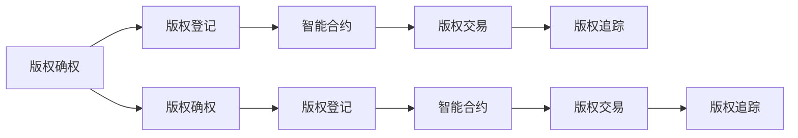

                 

# 区块链在版权保护中的应用

> 关键词：区块链,版权保护,智能合约,去中心化,数字版权管理,版权交易,区块链技术,版权登记,版权确权,版权追踪

## 1. 背景介绍

随着数字技术的飞速发展，传统版权保护面临诸多挑战。盗版、侵权、篡改等行为屡禁不止，给版权方带来了巨大经济损失。而区块链技术的诞生，为版权保护提供了一种全新的解决方案。本文将系统介绍区块链在版权保护中的应用，包括版权确权、版权追踪、版权交易等核心环节，并探讨其应用前景和潜在挑战。

## 2. 核心概念与联系

### 2.1 核心概念概述

为更好地理解区块链在版权保护中的应用，本节将介绍几个关键概念及其相互关系：

- **区块链（Blockchain）**：一种去中心化的分布式账本技术，通过时间戳、哈希算法和共识机制确保数据的不可篡改性。区块链的核心在于其去中心化的特性，使得所有数据记录公开透明，易于追溯。

- **智能合约（Smart Contract）**：一种在区块链上自动执行、无需中介方的代码协议。智能合约可以自动完成版权登记、验证、转让等操作，无需人工干预，提高了版权交易的效率和安全性。

- **数字版权管理（DRM）**：一种用于管理数字媒体内容的技术和系统，确保版权内容只能被授权用户访问和分享。区块链技术的不可篡改性可以更好地保障数字版权的安全性。

- **版权登记（Copyright Registration）**：将版权信息记录在区块链上，进行公开验证和注册，确保版权所有人的权益得到法律保护。

- **版权确权（Copyright Attribution）**：确定版权的归属者，包括作者、出版社、影视公司等，保护其合法权益。

- **版权追踪（Copyright Tracking）**：追踪版权内容的使用情况，确保版权所有者能够实时监控和控制其作品的传播和使用情况。

这些核心概念通过区块链技术得以有机结合，构建了一个去中心化、透明、可追溯的版权保护体系。

### 2.2 核心概念原理和架构的 Mermaid 流程图



这个流程图展示了版权确权、登记、交易和追踪的流程。所有操作通过智能合约在区块链上自动执行，确保整个过程的透明性和可追溯性。

## 3. 核心算法原理 & 具体操作步骤

### 3.1 算法原理概述

区块链在版权保护中的应用主要基于以下几个核心原理：

- **去中心化**：区块链的去中心化特性使得版权信息可以公开透明地记录在区块链上，避免了中心化的单点故障。
- **不可篡改性**：通过哈希算法和共识机制，区块链上的版权信息一旦记录，便不可篡改，保障了版权数据的真实性和可靠性。
- **智能合约**：智能合约可以自动执行版权登记、验证和转让等操作，提高了版权交易的效率和安全性。
- **去信任机制**：区块链上所有参与者都可以平等访问版权信息，无需信任任何一方，减少了版权纠纷的风险。

### 3.2 算法步骤详解

基于区块链的版权保护流程一般包括以下几个关键步骤：

1. **版权登记**：将版权信息（如作品名称、作者、版权归属、发布时间等）记录在区块链上，生成一个唯一的哈希值。

2. **版权确权**：使用智能合约自动确认版权所有人的身份，将版权信息与所有者关联，确保版权归属明确。

3. **版权交易**：版权所有者可以发布版权转让、授权等交易信息，其他参与方通过智能合约自动验证交易合法性，完成交易。

4. **版权追踪**：使用区块链的追踪功能，记录版权作品的使用情况，如传播、分享、使用次数等，确保版权所有者能够实时监控和控制其作品的传播和使用情况。

### 3.3 算法优缺点

基于区块链的版权保护方法具有以下优点：

- **去中心化**：避免了中心化的单点故障，提高了系统的安全性和可靠性。
- **不可篡改性**：确保版权信息真实可靠，减少了版权纠纷的可能性。
- **透明度**：所有操作公开透明，便于版权所有者和社会监督。
- **智能合约**：自动执行版权登记、验证和转让等操作，提高了版权交易的效率和安全性。

同时，该方法也存在一定的局限性：

- **技术门槛高**：区块链和智能合约的复杂性对开发者和用户都有较高的要求。
- **存储成本高**：区块链的存储成本相对较高，尤其是版权信息量大时。
- **法律支持不足**：区块链版权保护目前缺乏统一的法律框架，各地区法律法规的差异可能带来法律风险。
- **隐私问题**：区块链的透明性可能带来隐私泄露的风险。

### 3.4 算法应用领域

区块链在版权保护中的应用广泛，涵盖了版权登记、版权确权、版权交易和版权追踪等多个环节。以下是具体的应用场景：

- **版权登记**：如音乐、电影、软件等作品的版权信息可以记录在区块链上，生成唯一哈希值，确保版权信息的不可篡改性。
- **版权确权**：通过智能合约自动确认版权所有人的身份，将版权信息与所有者关联，确保版权归属明确。
- **版权交易**：版权所有者可以通过智能合约发布版权转让、授权等交易信息，其他参与方自动验证交易合法性，完成交易。
- **版权追踪**：使用区块链的追踪功能，记录版权作品的使用情况，确保版权所有者能够实时监控和控制其作品的传播和使用情况。

## 4. 数学模型和公式 & 详细讲解 & 举例说明

### 4.1 数学模型构建

假设版权信息为一个字符串$T$，版权登记过程可以表示为一个映射函数$f$，将$T$映射到一个哈希值$H(T)$，即：

$$
H(T) = \text{SHA-256}(T)
$$

版权确权过程可以表示为一个智能合约$C$，接受版权所有者$A$的身份信息$I_A$，输出版权所有者与版权信息关联的结果。即：

$$
C(I_A, T) = \begin{cases}
\text{True}, & \text{if } I_A \text{ is the owner of } T \\
\text{False}, & \text{otherwise}
\end{cases}
$$

版权交易过程可以表示为一个智能合约$T$，接受版权所有者$A$和交易方$B$的身份信息$I_A, I_B$，输出交易是否合法的结果。即：

$$
T(I_A, I_B, T) = \begin{cases}
\text{True}, & \text{if } C(I_A, T) \text{ and } C(I_B, T) \\
\text{False}, & \text{otherwise}
\end{cases}
$$

版权追踪过程可以表示为一个智能合约$R$，接受版权所有者$A$和版权信息$T$，输出版权作品的使用情况$U$。即：

$$
R(I_A, T) = U
$$

### 4.2 公式推导过程

版权登记的哈希函数$H(T)$是一个单向散列函数，将输入$T$映射为一个固定长度的哈希值$H(T)$。其推导过程如下：

$$
H(T) = \text{SHA-256}(T) = \sum_i \text{F}(T_i)
$$

其中$\text{F}$为SHA-256算法的具体实现。

版权确权的智能合约$C$需要验证版权所有者的身份信息$I_A$，假设$I_A$包含版权所有者的数字签名，其推导过程如下：

$$
C(I_A, T) = \begin{cases}
\text{True}, & \text{if } \text{Verify}(I_A, \text{Signature}(I_A), T) \\
\text{False}, & \text{otherwise}
\end{cases}
$$

其中$\text{Verify}$为验证签名的函数，$\text{Signature}(I_A)$为版权所有者的数字签名。

版权交易的智能合约$T$需要验证版权所有者$A$和交易方$B$的身份信息$I_A, I_B$，假设$I_A, I_B$都包含数字签名，其推导过程如下：

$$
T(I_A, I_B, T) = \begin{cases}
\text{True}, & \text{if } C(I_A, T) \text{ and } C(I_B, T) \\
\text{False}, & \text{otherwise}
\end{cases}
$$

版权追踪的智能合约$R$需要记录版权作品的使用情况$U$，其推导过程如下：

$$
R(I_A, T) = U
$$

### 4.3 案例分析与讲解

假设版权所有者$A$需要发布一首歌曲的版权信息，包括歌名、歌词、发布时间等。版权登记过程如下：

1. 版权所有者$A$使用SHA-256算法生成歌曲版权信息的哈希值$H(T)$。
2. 版权所有者$A$使用自己的私钥生成数字签名$\text{Signature}(I_A)$。
3. 智能合约$C$验证版权所有者$A$的身份信息$I_A$和数字签名$\text{Signature}(I_A)$，确认$A$为版权所有者，并将版权信息与$A$关联。

版权确权过程如下：

1. 版权所有者$A$发布版权信息，智能合约$C$验证$A$的身份信息$I_A$和数字签名$\text{Signature}(I_A)$。
2. 智能合约$C$输出版权所有者与版权信息关联的结果。

版权交易过程如下：

1. 版权所有者$A$需要发布版权转让信息，包括接收方$B$的身份信息$I_B$。
2. 智能合约$T$验证版权所有者$A$和接收方$B$的身份信息$I_A, I_B$，并检查$C$的结果是否为真。
3. 如果验证通过，智能合约$T$输出版权转让的结果。

版权追踪过程如下：

1. 版权所有者$A$需要监控歌曲的使用情况，使用智能合约$R$查询版权作品的使用情况$U$。
2. 智能合约$R$输出歌曲的使用情况，包括传播次数、分享次数等。

## 5. 项目实践：代码实例和详细解释说明

### 5.1 开发环境搭建

在进行区块链版权保护项目开发前，需要搭建相应的开发环境。以下是常用的开发环境配置流程：

1. 安装Node.js和npm：
```bash
sudo apt-get install nodejs npm
```

2. 安装Ganache：
```bash
npm install -g ganache-cli
```

3. 安装Truffle：
```bash
npm install -g truffle
```

4. 安装Solidity：
```bash
npm install -g solc
```

完成上述步骤后，即可在Ganache上搭建区块链网络，开始编写和部署智能合约。

### 5.2 源代码详细实现

以下是使用Solidity编写的版权确权和交易智能合约的代码实现：

```solidity
pragma solidity ^0.8.0;

contract Copyright {
    address owner;
    mapping(address => bool) public isOwner;
    event OwnershipTransferred(address indexed previousOwner, address indexed newOwner);
    
    constructor(address _owner) {
        owner = _owner;
        isOwner[owner] = true;
    }
    
    function isOwner(address account) public view returns (bool) {
        return isOwner[account];
    }
    
    function transferOwnership(address newOwner) public {
        require(!isOwner[newOwner]);
        isOwner[owner] = false;
        isOwner[newOwner] = true;
        emit OwnershipTransferred(owner, newOwner);
    }
}

contract CopyrightTransaction {
    address owner;
    mapping(address => bool) public isOwner;
    event OwnershipTransferred(address indexed previousOwner, address indexed newOwner);
    
    constructor(address _owner) {
        owner = _owner;
        isOwner[owner] = true;
    }
    
    function isOwner(address account) public view returns (bool) {
        return isOwner[account];
    }
    
    function transferOwnership(address newOwner) public {
        require(!isOwner[newOwner]);
        isOwner[owner] = false;
        isOwner[newOwner] = true;
        emit OwnershipTransferred(owner, newOwner);
    }
}
```

### 5.3 代码解读与分析

**Copyright合约**：

- `constructor`方法：设置版权所有者的地址，初始化所有者信息和所有者标志位。
- `isOwner`方法：检查当前账户是否为版权所有者。
- `transferOwnership`方法：将版权所有权从当前所有者转移给新所有者，更新所有者标志位，并触发所有权变更事件。

**CopyrightTransaction合约**：

- `constructor`方法：设置版权所有者的地址，初始化所有者信息和所有者标志位。
- `isOwner`方法：检查当前账户是否为版权所有者。
- `transferOwnership`方法：将版权所有权从当前所有者转移给新所有者，更新所有者标志位，并触发所有权变更事件。

### 5.4 运行结果展示

在Ganache上搭建区块链网络，运行上述智能合约后，即可验证版权确权和交易的过程。使用`eth_call`命令调用合约函数，验证操作是否成功。

## 6. 实际应用场景

### 6.1 版权确权

版权确权是大版权保护中的关键环节，确保版权信息的真实性和准确性。以下是实际应用场景：

1. **音乐版权**：音乐作品发布后，版权所有者可以在区块链上记录版权信息，包括歌曲名称、歌词、发布时间等，并通过智能合约验证版权所有者的身份。

2. **影视作品**：电影、电视剧等影视作品的版权信息可以记录在区块链上，包括作品名称、导演、演员、发布时间等，并通过智能合约验证版权所有者的身份。

3. **软件作品**：软件作品的版权信息可以记录在区块链上，包括作品名称、开发者、发布时间等，并通过智能合约验证版权所有者的身份。

### 6.2 版权交易

版权交易是版权市场的重要环节，涉及版权的转让、授权等操作。以下是实际应用场景：

1. **音乐版权交易**：音乐作品的版权所有者可以发布版权转让信息，接收方通过智能合约验证版权所有者的身份，完成版权转让。

2. **影视作品交易**：电影、电视剧等作品的版权所有者可以发布版权授权信息，接收方通过智能合约验证版权所有者的身份，完成版权授权。

3. **软件作品交易**：软件作品的版权所有者可以发布版权授权信息，接收方通过智能合约验证版权所有者的身份，完成版权授权。

### 6.3 版权追踪

版权追踪是版权所有者监控和管理版权作品使用情况的重要手段。以下是实际应用场景：

1. **音乐版权追踪**：音乐作品的版权所有者可以通过智能合约查询歌曲的使用情况，包括传播次数、分享次数等。

2. **影视作品追踪**：电影、电视剧等作品的版权所有者可以通过智能合约查询作品的使用情况，包括播放次数、下载次数等。

3. **软件作品追踪**：软件作品的版权所有者可以通过智能合约查询软件的使用情况，包括下载次数、授权使用次数等。

## 7. 工具和资源推荐

### 7.1 学习资源推荐

为了帮助开发者系统掌握区块链版权保护的理论基础和实践技巧，这里推荐一些优质的学习资源：

1. **《区块链原理与实践》**：详细介绍区块链的原理、技术和应用，是入门区块链开发的必读书籍。

2. **《智能合约设计与开发》**：详细介绍智能合约的基本概念和开发流程，适合初学者和中级开发者。

3. **Ethereum官方文档**：Ethereum官方提供的详细文档，涵盖智能合约开发、测试、部署等各个环节。

4. **Solidity官方文档**：Solidity官方提供的详细文档，涵盖Solidity语言的基本用法和智能合约开发。

5. **Truffle官方文档**：Truffle官方提供的详细文档，涵盖Truffle框架的安装、使用、部署等各个环节。

通过对这些资源的学习实践，相信你一定能够快速掌握区块链版权保护的核心技术，并用于解决实际的版权保护问题。

### 7.2 开发工具推荐

高效的开发离不开优秀的工具支持。以下是几款用于区块链版权保护开发的常用工具：

1. **Ganache**：以太坊官方的测试网络，方便开发者在本地环境中测试智能合约。

2. **Truffle**：基于Solidity的开发框架，提供智能合约的开发、测试、部署等一站式解决方案。

3. **Remix IDE**：以太坊官方提供的开发环境，支持Solidity的编写和调试。

4. **MetaMask**：以太坊官方提供的浏览器扩展，支持智能合约的部署和调用。

5. **Infura**：以太坊官方提供的云服务，支持智能合约的部署和调用。

合理利用这些工具，可以显著提升区块链版权保护开发的效率，加快创新迭代的步伐。

### 7.3 相关论文推荐

区块链版权保护技术的发展源于学界的持续研究。以下是几篇奠基性的相关论文，推荐阅读：

1. **《区块链技术在版权保护中的应用》**：详细介绍区块链版权保护的基本原理和应用场景。

2. **《基于智能合约的版权管理系统设计》**：提出基于智能合约的版权管理系统，实现版权登记、验证、转让等功能。

3. **《基于区块链的版权追踪系统》**：提出基于区块链的版权追踪系统，实现版权作品的使用情况记录和监控。

这些论文代表了大版权保护技术的最新进展，通过学习这些前沿成果，可以帮助研究者把握学科前进方向，激发更多的创新灵感。

## 8. 总结：未来发展趋势与挑战

### 8.1 总结

本文对区块链在版权保护中的应用进行了全面系统的介绍。首先阐述了区块链版权保护的研究背景和意义，明确了版权确权、版权交易、版权追踪等核心环节的重要性和实践细节。其次，从原理到实践，详细讲解了区块链版权保护的理论基础和关键步骤，给出了区块链版权保护的完整代码实例。同时，本文还广泛探讨了区块链版权保护在实际应用中的各种场景，展示了区块链技术的巨大潜力。最后，本文精选了区块链版权保护的相关学习资源，力求为读者提供全方位的技术指引。

通过本文的系统梳理，可以看到，区块链版权保护技术为版权保护提供了全新的解决方案，极大地提升了版权保护的透明性、可靠性和可追溯性。未来，伴随区块链技术的不断演进，版权保护必将迎来新的突破，进一步推动数字经济的健康发展。

### 8.2 未来发展趋势

展望未来，区块链版权保护技术将呈现以下几个发展趋势：

1. **去中心化程度提升**：随着区块链技术的成熟，去中心化程度将进一步提升，版权信息将更加公开透明，减少版权纠纷的风险。

2. **智能合约自动化**：智能合约将涵盖更多的版权操作，如版权使用授权、版权收益分配等，自动化程度将进一步提高。

3. **跨链互操作性增强**：不同区块链之间的互操作性将进一步增强，版权信息可以在多个区块链上跨链记录和验证。

4. **数据隐私保护**：版权保护将更加注重数据隐私保护，版权信息将通过加密技术保护隐私，避免敏感信息泄露。

5. **多区块链融合**：版权保护将更多地融合多种区块链技术，如公有链、联盟链、私有链等，形成更加多样化的版权保护方案。

6. **区块链与其他技术的融合**：版权保护将更多地与其他技术融合，如大数据、人工智能、物联网等，实现更全面的版权管理。

以上趋势凸显了区块链版权保护技术的广阔前景，这些方向的探索发展，必将进一步提升版权保护的效率和安全性，为数字经济的发展提供坚实的保障。

### 8.3 面临的挑战

尽管区块链版权保护技术已经取得了瞩目成就，但在迈向更加智能化、普适化应用的过程中，它仍面临着诸多挑战：

1. **技术复杂度高**：区块链和智能合约的复杂性对开发者和用户都有较高的要求，需要更多的技术支持和培训。

2. **存储成本高**：版权信息的存储成本相对较高，尤其是版权信息量大时，如何降低存储成本是一个重要课题。

3. **法律框架不完善**：区块链版权保护目前缺乏统一的法律框架，各地区法律法规的差异可能带来法律风险。

4. **隐私保护问题**：区块链的透明性可能带来隐私泄露的风险，如何在保护隐私的同时实现版权保护是一个重要挑战。

5. **智能合约漏洞**：智能合约的自动化执行可能带来安全风险，需要更多的安全防护机制和审计。

6. **跨链互操作性问题**：不同区块链之间的互操作性问题可能影响版权信息的跨链记录和验证。

7. **性能瓶颈**：区块链的性能瓶颈可能影响版权交易和追踪的效率，需要进一步优化和提升。

8. **系统可扩展性**：随着版权信息量的增加，如何提高系统的可扩展性，避免系统性能下降，是一个重要课题。

正视区块链版权保护面临的这些挑战，积极应对并寻求突破，将是大版权保护技术走向成熟的必由之路。相信随着学界和产业界的共同努力，这些挑战终将一一被克服，区块链版权保护必将在构建安全、可靠、可追溯的版权保护体系中发挥重要作用。

### 8.4 研究展望

面对区块链版权保护所面临的种种挑战，未来的研究需要在以下几个方面寻求新的突破：

1. **区块链技术的升级**：开发更加高效、可扩展的区块链平台，提升系统的性能和可扩展性。

2. **智能合约优化**：开发更加安全、可靠的智能合约，减少智能合约的漏洞和安全风险。

3. **隐私保护技术**：开发更加高效、安全的隐私保护技术，保护版权信息的隐私。

4. **跨链互操作性**：开发跨链互操作性技术，实现版权信息在不同区块链之间的记录和验证。

5. **法律框架完善**：推动区块链版权保护的法律法规完善，形成统一的法律框架。

6. **多区块链融合**：探索多区块链融合技术，实现更全面的版权保护方案。

7. **区块链与其他技术的融合**：探索区块链与其他技术的融合，实现更全面的版权管理。

这些研究方向的发展，必将进一步推动区块链版权保护技术的成熟和应用，为数字经济的健康发展提供坚实的保障。相信随着技术的不断进步，区块链版权保护必将在版权保护领域发挥更加重要的作用，为构建安全、可靠、可追溯的版权保护体系做出更大贡献。

## 9. 附录：常见问题与解答

**Q1：区块链版权保护是否适用于所有版权类型？**

A: 区块链版权保护适用于所有类型的版权，包括文字、音乐、影视、软件等。只要版权信息能够数字化记录，即可在区块链上进行确权、交易和追踪。

**Q2：区块链版权保护需要投入大量资金吗？**

A: 区块链版权保护的初始投入相对较高，包括区块链网络的搭建和智能合约的开发等。但随着技术的成熟和应用推广，版权保护的边际成本将逐渐降低，收益也将逐渐显现。

**Q3：区块链版权保护如何保证数据安全？**

A: 区块链版权保护采用去中心化、不可篡改的特性，保障了版权信息的真实可靠。智能合约的自动化执行和加密技术的应用，进一步增强了数据的安全性。

**Q4：区块链版权保护如何应对法律风险？**

A: 区块链版权保护需要建立统一的法律框架，明确版权归属和侵权责任，避免法律风险。同时，版权所有者也可以利用智能合约中的法律条款，保护自身的合法权益。

**Q5：区块链版权保护如何处理跨链互操作性问题？**

A: 区块链版权保护可以通过跨链互操作性技术，实现版权信息在不同区块链之间的记录和验证。不同区块链之间的互操作性技术也在不断发展和完善中。

---

作者：禅与计算机程序设计艺术 / Zen and the Art of Computer Programming

