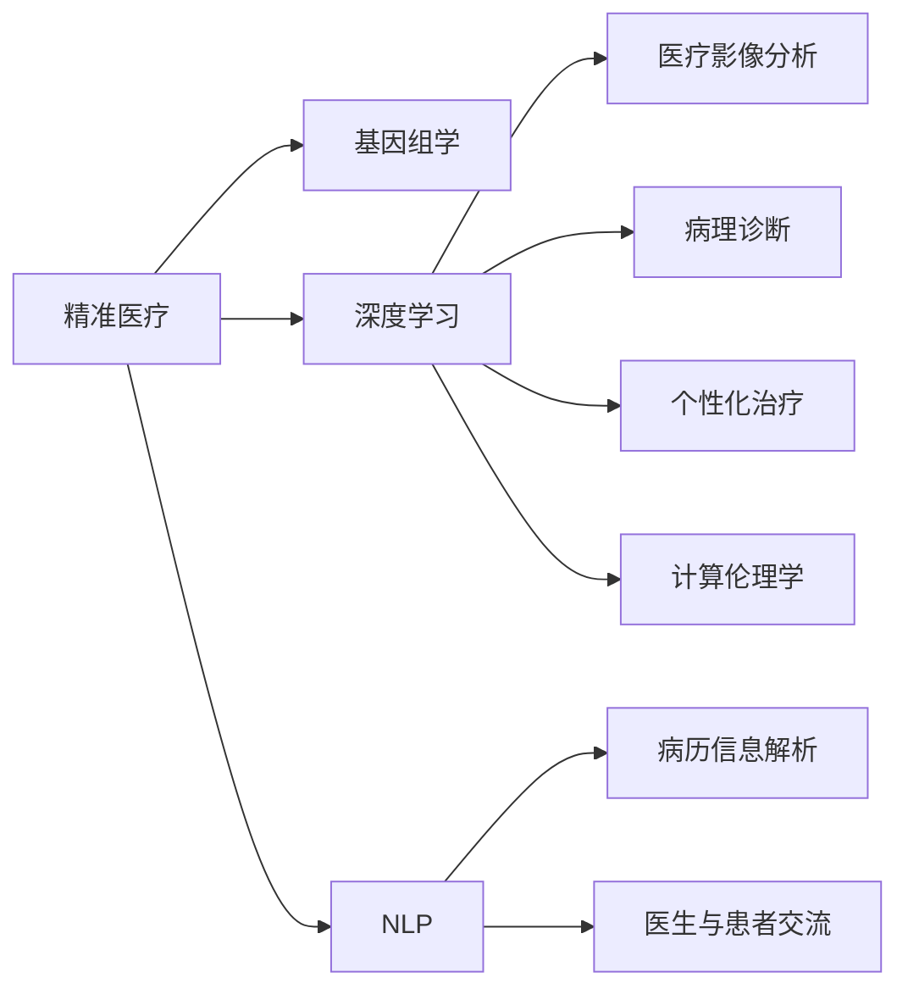

                 

# 医疗保健的未来：人类计算助力精准医疗

## 1. 背景介绍

近年来，人工智能(AI)技术在医疗领域的应用取得了突破性进展，正在逐步改变传统的医疗保健模式。以往，医生依赖经验与临床数据进行诊断和治疗，但随着数据量的指数级增长和计算能力的飞速提升，AI技术正在崭露头角，成为精准医疗的重要助力。

人工智能在医疗领域的应用主要分为三大方向：医疗影像分析、病理诊断、基因组学和个性化治疗。这其中，人工智能在基因组学和个性化治疗领域的应用尤为引人注目，因为它涉及到将人类计算应用于更微观、更深层次的医疗信息，这与计算机程序设计艺术的精微和复杂性有着异曲同工之妙。

## 2. 核心概念与联系

### 2.1 核心概念概述

为了深入理解人工智能在精准医疗中的应用，我们先来探讨几个核心概念：

- **精准医疗**：基于患者的遗传信息、环境因素和个体特征，量身定制的治疗方案，旨在提高诊疗效果，降低医疗成本，减少治疗副作用。精准医疗是未来医疗发展的重要方向。

- **基因组学**：研究生物体的基因组结构、功能及其与健康、疾病的关系，通过基因测序和数据分析，揭示生命本源，为疾病预防和治疗提供科学依据。

- **深度学习**：基于神经网络的机器学习算法，通过多层次、非线性处理，实现对复杂数据的高效分析和建模。深度学习在图像识别、语音识别、自然语言处理等领域展现了强大的能力。

- **自然语言处理(NLP)**：使计算机能够理解、处理和生成人类语言，广泛应用于医疗记录的解析、病历信息的提取和分析、医生与患者之间的交流等场景。

- **计算伦理学**：在人工智能应用中，如何确保技术的安全、公正、透明，确保患者权益，避免伦理问题，是伴随技术发展必须面对的重要课题。

这些核心概念共同构成了精准医疗的技术基础和伦理要求，是推动医疗技术进步的重要因素。

### 2.2 核心概念原理和架构的 Mermaid 流程图



以上流程图展示了各个核心概念之间的联系：

1. 精准医疗通过基因组学、深度学习、NLP等技术手段，提供了全面的数据分析和决策支持。
2. 深度学习在医疗影像分析和病理诊断中发挥了重要作用，提升了诊疗的准确性和效率。
3. 个性化治疗结合深度学习和基因组学，为患者提供量身定制的治疗方案。
4. 病历信息解析和医生与患者交流则依赖NLP技术，提升了医疗信息的提取和理解能力。
5. 计算伦理学则是确保这些技术应用中的安全性和公正性的重要保障。

## 3. 核心算法原理 & 具体操作步骤

### 3.1 算法原理概述

人工智能在医疗保健中的主要应用原理基于深度学习和机器学习算法，特别是针对医疗影像、基因组学数据和大规模医疗记录的非结构化数据分析。深度学习模型，如卷积神经网络(CNN)、循环神经网络(RNN)、变压器(Transformer)等，因其在处理复杂模式识别和大规模数据上的优势，在医疗领域得到了广泛应用。

深度学习模型通过大规模训练，学习到疾病与症状之间的复杂映射关系，以及基因序列与疾病发生概率的关联性。这些模型通常使用反向传播算法进行训练，通过梯度下降等方式不断优化模型参数，以提高预测准确性和泛化能力。

### 3.2 算法步骤详解

以下是一个典型的基于深度学习的医疗保健应用流程：

**Step 1: 数据收集与预处理**
- 收集医疗影像、基因组学数据、电子病历等结构化和非结构化数据。
- 清洗数据，处理缺失值，去除噪声，标准化数据格式。

**Step 2: 模型构建与训练**
- 选择合适的深度学习模型，如卷积神经网络(CNN)用于图像识别，循环神经网络(RNN)用于时间序列分析，Transformer用于自然语言处理。
- 对模型进行训练，使用标注数据进行监督学习，优化模型参数。

**Step 3: 模型评估与验证**
- 在验证集上评估模型性能，使用准确率、召回率、F1分数等指标衡量模型的效果。
- 调整模型超参数，如学习率、批大小、迭代次数等，以获得最优性能。

**Step 4: 模型部署与应用**
- 将训练好的模型部署到生产环境，使用户或应用程序能够实时调用。
- 定期更新模型，使用最新的数据进行再训练，以提升模型效果。

**Step 5: 监控与维护**
- 实时监控模型的预测结果，评估模型性能。
- 及时修复模型错误，更新模型版本，保持模型的高效性和准确性。

### 3.3 算法优缺点

基于深度学习的医疗保健应用，具有以下优点：

- 准确性高：深度学习模型通过大规模数据训练，能够实现较高的预测准确性，减少误诊风险。
- 高效性：深度学习模型能够处理大规模数据，实时提供分析结果，提高了诊疗效率。
- 可解释性：深度学习模型的预测结果可以通过特征重要性、激活图等方式进行可视化，增强了医疗决策的可解释性。

同时，也存在以下缺点：

- 数据需求高：深度学习模型需要大量的标注数据进行训练，医疗领域的数据获取和标注成本较高。
- 模型复杂：深度学习模型结构复杂，训练和部署成本较高，需要专业知识和资源支持。
- 泛化能力差：深度学习模型容易过拟合，尤其在数据量不足的情况下，需要更多的正则化技术和数据增强手段。
- 可解释性不足：深度学习模型通常被视为"黑盒"，难以理解其内部工作机制，这对医疗决策的透明性和公正性提出了挑战。

### 3.4 算法应用领域

基于深度学习的医疗保健技术已经在多个领域得到了应用，如：

- 医疗影像分析：使用卷积神经网络对医学影像进行病灶检测、疾病分类等。
- 病理诊断：利用卷积神经网络进行肿瘤、炎症等疾病的病理图像分析。
- 基因组学：通过深度学习模型进行基因序列的特征提取和关联性分析。
- 电子病历分析：使用NLP技术解析医疗记录，提取关键信息。
- 个性化治疗：结合基因组学数据和深度学习模型，为患者提供个性化治疗方案。

这些技术已经在多个临床试验中展示了其潜力和有效性，推动了精准医疗的发展。

## 4. 数学模型和公式 & 详细讲解 & 举例说明

### 4.1 数学模型构建

基于深度学习的医疗保健应用通常使用以下数学模型：

- **卷积神经网络(CNN)**：用于处理医疗影像数据，提取局部特征。
- **循环神经网络(RNN)**：用于处理时间序列数据，如病人病情变化。
- **变压器(Transformer)**：用于处理自然语言数据，如病历记录。

### 4.2 公式推导过程

以卷积神经网络为例，其核心公式如下：

$$
h(x) = \sigma(\sum_i w_i f(x) + b)
$$

其中，$h(x)$表示卷积层输出，$\sigma$表示激活函数，$w_i$表示卷积核权重，$b$表示偏置项，$f(x)$表示输入特征映射。

通过多层卷积和池化操作，CNN可以自动学习到图像中的特征，并提取高层次的抽象表示。

### 4.3 案例分析与讲解

假设我们有一个基于CNN的医疗影像分类任务，其中输入是一张大小为$256\times256$的医学影像，输出是疾病分类标签。我们采用LeNet-5作为网络结构，其中包含两个卷积层和两个池化层，最后连接两个全连接层进行分类。

**Step 1: 数据预处理**
- 对输入的医学影像进行归一化处理，使其符合网络输入要求。
- 将影像数据转换为张量形式，并进行归一化处理。

**Step 2: 模型构建**
- 定义LeNet-5网络结构，使用PyTorch框架进行模型定义。
- 设置损失函数为交叉熵损失，优化器为AdamW。

**Step 3: 训练与验证**
- 将训练集和验证集划分为 mini-batch，进行前向传播和反向传播。
- 使用验证集评估模型性能，根据验证集准确率调整学习率。

**Step 4: 测试与部署**
- 在测试集上评估模型性能，输出预测结果。
- 部署模型，供实际应用调用。

## 5. 项目实践：代码实例和详细解释说明

### 5.1 开发环境搭建

在进行医疗保健项目的开发时，我们需要准备以下开发环境：

1. **安装Python**：确保开发环境中有Python 3.7以上版本。

2. **安装深度学习框架**：安装TensorFlow或PyTorch，这些框架提供了强大的深度学习能力。

3. **安装数据处理库**：安装Pandas、NumPy等库，用于数据处理和分析。

4. **安装模型库**：安装Keras、TensorFlow等深度学习模型库，用于模型构建和训练。

5. **安装可视化工具**：安装Matplotlib、Seaborn等可视化库，用于模型效果的可视化。

### 5.2 源代码详细实现

以下是一个简单的医疗影像分类模型的PyTorch实现：

```python
import torch
import torch.nn as nn
import torch.optim as optim
from torchvision import datasets, transforms

# 定义卷积神经网络模型
class CNNModel(nn.Module):
    def __init__(self):
        super(CNNModel, self).__init__()
        self.conv1 = nn.Conv2d(1, 32, 3)
        self.conv2 = nn.Conv2d(32, 64, 3)
        self.pool = nn.MaxPool2d(2, 2)
        self.fc1 = nn.Linear(64 * 12 * 12, 512)
        self.fc2 = nn.Linear(512, 10)

    def forward(self, x):
        x = self.pool(nn.functional.relu(self.conv1(x)))
        x = self.pool(nn.functional.relu(self.conv2(x)))
        x = x.view(-1, 64 * 12 * 12)
        x = nn.functional.relu(self.fc1(x))
        x = self.fc2(x)
        return x

# 加载数据集
train_data = datasets.CIFAR10(root='./data', train=True, download=True, transform=transforms.ToTensor())
test_data = datasets.CIFAR10(root='./data', train=False, download=True, transform=transforms.ToTensor())

# 定义模型、损失函数和优化器
model = CNNModel()
criterion = nn.CrossEntropyLoss()
optimizer = optim.Adam(model.parameters(), lr=0.001)

# 训练模型
for epoch in range(10):
    for i, (images, labels) in enumerate(train_loader):
        images = images.to(device)
        labels = labels.to(device)
        optimizer.zero_grad()
        outputs = model(images)
        loss = criterion(outputs, labels)
        loss.backward()
        optimizer.step()
```

### 5.3 代码解读与分析

上述代码实现了简单的卷积神经网络模型，使用交叉熵损失进行训练。其中，`CNNModel`类定义了网络结构，包括两个卷积层、两个池化层和两个全连接层。`train_loader`是训练集的数据迭代器，用于读取并处理数据。

在训练过程中，我们通过前向传播计算模型的输出，使用交叉熵损失计算预测与真实标签的差距，并使用AdamW优化器更新模型参数。

### 5.4 运行结果展示

训练结束后，我们可以使用测试集评估模型的性能，并输出预测结果。以下是一个简单的预测函数：

```python
def predict(image):
    image = image.to(device)
    with torch.no_grad():
        outputs = model(image)
        _, predicted = torch.max(outputs.data, 1)
        return predicted.item()
```

我们可以使用以下代码生成预测结果：

```python
predictions = []
for i, image in enumerate(test_images):
    predictions.append(predict(image))
```

## 6. 实际应用场景

### 6.1 医疗影像分析

医疗影像分析是深度学习在医疗领域的重要应用之一。通过训练深度学习模型，可以自动识别影像中的病变区域，并进行分类。这对于放射科医生来说，可以大幅提高诊疗效率，减少误诊率。

例如，使用卷积神经网络(CNN)对肺部CT影像进行分类，可以识别出肺癌、肺结节等病变区域，并自动生成报告。这对于早期肺癌的筛查和诊断具有重要意义。

### 6.2 病理诊断

病理诊断是精准医疗的重要环节，通过深度学习模型可以自动分析病理图像，提供精准的诊断结果。这可以减少病理医生的工作量，提高诊断的准确性和一致性。

例如，使用卷积神经网络对显微镜下切片进行肿瘤分类，可以自动识别出肿瘤的类型和分级，并为医生提供决策支持。

### 6.3 基因组学

基因组学是精准医疗的基础，通过深度学习模型可以分析基因序列，发现与疾病相关的基因突变和基因表达模式。这为个性化治疗提供了科学依据。

例如，使用循环神经网络(RNN)对基因序列进行时间序列分析，可以发现某些基因突变与疾病的关联性，并预测疾病发生概率。

### 6.4 电子病历分析

电子病历记录了大量病人的医疗信息，通过NLP技术可以自动解析和提取关键信息，为医生提供快速、准确的诊断支持。

例如，使用Transformer模型对病历记录进行实体识别和事件提取，可以自动生成病人的诊断和治疗记录，减少医生的工作量。

## 7. 工具和资源推荐

### 7.1 学习资源推荐

为了帮助开发者系统掌握人工智能在精准医疗中的应用，这里推荐一些优质的学习资源：

1. **《深度学习在医疗影像中的应用》**：介绍深度学习在医疗影像分析中的应用，包括算法原理、模型实现和实战案例。

2. **《基因组学与深度学习》**：深入浅出地讲解基因组学和深度学习的基本概念和应用，涵盖基因序列分析和个性化治疗等前沿技术。

3. **《自然语言处理在医疗中的应用》**：讲解NLP在医疗信息提取、病历分析、医生与患者交流等场景中的应用，提供实用的代码实现。

4. **Coursera《医疗数据分析与机器学习》**：斯坦福大学的在线课程，涵盖了医疗数据处理、机器学习模型的训练和应用等核心内容。

5. **Kaggle医疗数据集**：提供了丰富的医疗数据集，包括影像、基因组学、病历等，适合进行深度学习和NLP实战练习。

### 7.2 开发工具推荐

以下是几款用于医疗保健项目开发的常用工具：

1. **TensorFlow**：由Google开发的深度学习框架，生产部署方便，适合大规模工程应用。

2. **PyTorch**：由Facebook开发的深度学习框架，灵活高效，适合快速迭代研究。

3. **Keras**：基于TensorFlow和Theano的高级深度学习库，简单易用，适合初学者。

4. **TensorBoard**：TensorFlow配套的可视化工具，可实时监测模型训练状态，提供丰富的图表呈现方式。

5. **Weights & Biases**：模型训练的实验跟踪工具，可以记录和可视化模型训练过程中的各项指标，方便对比和调优。

6. **Jupyter Notebook**：交互式的Python开发环境，支持代码编写、数据可视化、模型训练等全流程开发。

### 7.3 相关论文推荐

以下是几篇奠基性的相关论文，推荐阅读：

1. **《Deep Residual Learning for Image Recognition》**：提出深度残差网络，在图像分类任务中取得了最佳性能。

2. **《Natural Language Processing with Transformers》**：Transformer原论文，展示了Transformer在自然语言处理中的强大能力。

3. **《Interpretable Deep Learning for Clinical Practice》**：介绍深度学习在临床实践中的应用，强调了模型的可解释性和透明性。

4. **《A Survey on Deep Learning for Medical Imaging Analysis》**：总结了深度学习在医疗影像分析中的应用，提供了丰富的案例和实践经验。

5. **《Generative Adversarial Nets》**：介绍生成对抗网络在医学图像生成中的应用，展示了深度学习在医疗领域的创新潜力。

这些论文代表了深度学习在医疗领域的研究前沿，值得深入学习。

## 8. 总结：未来发展趋势与挑战

### 8.1 研究成果总结

人工智能在医疗保健中的应用已经取得了显著成果，主要体现在以下几个方面：

1. **诊断效率的提升**：深度学习模型能够自动分析医疗影像和病理图像，大幅提升诊断效率和准确性。

2. **个性化治疗的实现**：基因组学和深度学习模型结合，提供了个性化治疗方案，提高了治疗效果。

3. **医疗数据的整合与分析**：NLP技术能够自动解析和提取医疗信息，为医生提供决策支持。

4. **预测模型的构建**：深度学习模型能够预测疾病发生概率，辅助医生进行早期筛查和预防。

### 8.2 未来发展趋势

面向未来，人工智能在医疗保健中的应用将呈现以下几个发展趋势：

1. **多模态融合**：将医疗影像、基因组学、电子病历等多模态数据进行融合，构建更为全面和深入的诊断模型。

2. **实时监控与预测**：通过实时监控和预测模型，实现对病人病情的动态跟踪和管理。

3. **自适应与个性化**：深度学习模型能够根据病人个体特征进行自适应调整，提供更加个性化的治疗方案。

4. **联邦学习**：通过联邦学习技术，在保护患者隐私的同时，实现多中心数据的共享与协作。

5. **算力与数据扩展**：随着算力的提升和数据的积累，深度学习模型将能够处理更大规模和更复杂的数据，提升诊疗效果。

### 8.3 面临的挑战

尽管人工智能在医疗保健中的应用已经取得了重要进展，但仍面临诸多挑战：

1. **数据隐私与安全**：医疗数据的敏感性要求在数据处理和存储过程中必须严格保障隐私与安全。

2. **数据标注成本**：深度学习模型的训练需要大量高质量标注数据，医疗数据的获取和标注成本较高。

3. **模型解释性不足**：深度学习模型通常被视为"黑盒"，难以理解其内部工作机制，对医疗决策的透明性和公正性提出了挑战。

4. **模型泛化能力差**：深度学习模型容易过拟合，尤其在数据量不足的情况下，需要更多的正则化技术和数据增强手段。

5. **伦理与法律问题**：人工智能在医疗中的应用涉及到伦理和法律问题，需要建立相应的规范和标准。

### 8.4 研究展望

未来，人工智能在医疗保健中的应用需要在以下几个方面进一步研究：

1. **数据隐私保护**：开发新的隐私保护技术，如差分隐私、联邦学习等，保护患者隐私。

2. **数据标注自动化**：研究自动标注技术，如主动学习、半监督学习等，减少人工标注的成本和时间。

3. **模型解释性提升**：开发可解释性强的深度学习模型，如LIME、SHAP等，提高模型的透明性和可信度。

4. **多模态数据融合**：研究多模态数据融合方法，提升模型的诊断能力和预测精度。

5. **伦理与安全**：建立人工智能应用的伦理与安全规范，确保技术应用的公正性和透明性。

6. **跨领域应用**：将人工智能技术应用于更多医疗场景，如心理健康、公共卫生等，提升社会治理能力。

## 9. 附录：常见问题与解答

**Q1：如何评估人工智能在医疗保健中的效果？**

A: 评估人工智能在医疗保健中的效果通常使用以下指标：

1. **准确率**：模型预测结果与真实标签之间的匹配度，反映了模型的预测能力。
2. **召回率**：模型正确预测的正样本占所有正样本的比例，反映了模型的覆盖能力。
3. **F1分数**：综合考虑准确率和召回率，反映了模型的综合性能。
4. **ROC曲线**：以假正率（False Positive Rate）为横轴，真正率（True Positive Rate）为纵轴绘制的曲线，反映了模型的分类能力。

**Q2：人工智能在医疗保健中的应用有哪些风险？**

A: 人工智能在医疗保健中的应用也存在以下风险：

1. **误诊风险**：深度学习模型虽然准确性高，但在复杂病例和罕见病中仍可能出现误诊。
2. **伦理风险**：人工智能在医疗中的应用涉及到隐私、公正和透明等伦理问题，需要建立相应的规范和标准。
3. **法律风险**：人工智能在医疗中的应用需要遵守相关法律法规，确保技术应用的合法性和合规性。

**Q3：人工智能在医疗保健中的应用前景如何？**

A: 人工智能在医疗保健中的应用前景广阔，主要体现在以下几个方面：

1. **提高诊疗效率**：深度学习模型能够自动分析医疗影像和病理图像，大幅提升诊断效率和准确性。
2. **个性化治疗**：基因组学和深度学习模型结合，提供了个性化治疗方案，提高了治疗效果。
3. **预测与预防**：深度学习模型能够预测疾病发生概率，辅助医生进行早期筛查和预防。

**Q4：人工智能在医疗保健中的应用需要哪些资源？**

A: 人工智能在医疗保健中的应用需要以下资源：

1. **高质量数据**：深度学习模型的训练需要大量高质量标注数据，医疗数据的获取和标注成本较高。
2. **高性能计算资源**：深度学习模型的训练和推理需要高性能计算资源，如GPU、TPU等。
3. **技术人才**：需要具备深度学习、数据科学和医疗领域知识的跨学科人才。
4. **伦理规范**：需要建立人工智能应用的伦理与安全规范，确保技术应用的公正性和透明性。

**Q5：如何构建人工智能在医疗保健中的应用系统？**

A: 构建人工智能在医疗保健中的应用系统需要以下步骤：

1. **数据收集与预处理**：收集医疗影像、基因组学数据、电子病历等结构化和非结构化数据，进行清洗和标准化处理。
2. **模型构建与训练**：选择合适的深度学习模型，使用标注数据进行监督学习，优化模型参数。
3. **模型评估与验证**：在验证集上评估模型性能，根据验证集准确率调整学习率。
4. **模型部署与应用**：将训练好的模型部署到生产环境，使用户或应用程序能够实时调用。
5. **监控与维护**：实时监控模型的预测结果，评估模型性能，定期更新模型，保持模型的高效性和准确性。

---

作者：禅与计算机程序设计艺术 / Zen and the Art of Computer Programming

