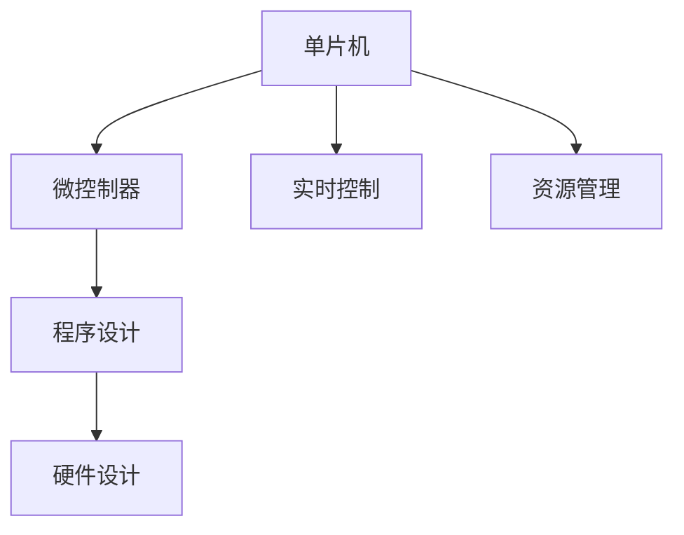

                 

# 单片机编程：嵌入式系统的基础

> 关键词：单片机,嵌入式系统,程序设计,微控制器,应用开发,硬件设计

## 1. 背景介绍

### 1.1 问题由来

嵌入式系统是计算机科学和电子工程中交叉的重要领域，它的应用范围非常广泛，从家用电器到工业控制，再到汽车、航空航天等领域，几乎无处不在。而单片机作为嵌入式系统中的核心组件，其编程技术对于实现这些应用至关重要。单片机的编程涉及到硬件设计、软件编程和系统集成等多个方面，是一种综合性很强的技术。

### 1.2 问题核心关键点

单片机编程的核心在于掌握硬件和软件之间的关系。硬件设计决定了单片机的功能特性，而软件编程则决定了如何利用这些特性实现所需的功能。因此，理解和掌握单片机的工作原理和编程方法，是实现复杂嵌入式系统的关键。此外，单片机编程还涉及到系统集成、实时控制和资源管理等挑战，需要综合应用多种技术手段，才能高效地实现目标系统。

### 1.3 问题研究意义

掌握单片机编程技术，对于从事嵌入式系统开发的专业人士来说，是必要的技术储备。它不仅能够帮助工程师实现各种复杂的嵌入式应用，还能提升系统的可靠性和性能。单片机编程技术的学习和应用，能够促进计算机科学与电子工程的深度融合，推动电子产业的创新和发展。

## 2. 核心概念与联系

### 2.1 核心概念概述

为了更好地理解单片机编程，我们先来介绍几个关键概念：

- **单片机**：单片机是一种集成电路芯片，它包含CPU、存储器、I/O接口等基本组件，能够在一块芯片上实现数据的处理和存储，以及与外部设备进行通信等功能。
- **微控制器**：微控制器是单片机的高级形式，通常具有更强的处理能力和更丰富的I/O接口，能够实现更复杂的功能。
- **程序设计**：程序设计是利用某种编程语言编写程序的过程，包括数据结构、算法和软件工程等方面的知识。
- **硬件设计**：硬件设计涉及到电路原理图、PCB设计、元件选型等，是实现单片机系统功能的基础。
- **实时控制**：嵌入式系统中的实时控制，要求软件能够快速响应用户请求，并对外部环境的变化做出及时反应。
- **资源管理**：单片机编程过程中，需要对有限的资源（如内存、寄存器等）进行合理分配和管理，以优化系统的性能和效率。

这些核心概念构成了单片机编程的基础，理解它们之间的关系，对于掌握单片机编程技术至关重要。

### 2.2 核心概念原理和架构的 Mermaid 流程图



这个流程图展示了单片机编程过程中涉及的主要概念和它们之间的联系。单片机是整个系统的核心，它通过微控制器实现更复杂的功能，而程序设计则是实现这些功能的手段，硬件设计为程序设计提供了基础，实时控制和资源管理则是优化程序设计效果的保障。

## 3. 核心算法原理 & 具体操作步骤

### 3.1 算法原理概述

单片机编程的算法原理主要包括程序设计和硬件设计两部分。程序设计是指利用某种编程语言（如C、C++等）编写程序，实现所需的功能。硬件设计则涉及到电路原理图、PCB设计、元件选型等，为程序设计提供物理基础。

单片机编程通常包括以下步骤：

1. **需求分析**：明确系统需要实现的功能和性能要求。
2. **硬件设计**：选择合适的单片机和外围电路，设计电路原理图和PCB，选择合适的外围元件。
3. **软件设计**：编写程序，实现系统的功能和性能要求。
4. **系统集成**：将硬件和软件结合起来，进行系统测试和调试。
5. **优化和维护**：根据测试结果，优化程序和硬件设计，并进行系统维护。

### 3.2 算法步骤详解

下面将详细讲解单片机编程的具体操作步骤：

#### 步骤1：需求分析

需求分析是单片机编程的第一步，也是最关键的一步。在这一步骤中，需要明确系统的功能需求、性能要求、资源限制等关键信息。需求分析的目的是为后续的硬件设计和软件设计提供指导，确保系统的设计和开发能够满足实际应用的需求。

#### 步骤2：硬件设计

硬件设计包括电路原理图设计、PCB设计和元件选型等。在这一步骤中，需要根据需求分析的结果，选择合适的单片机和外围电路，设计电路原理图和PCB，选择合适的外围元件。硬件设计的目的是为程序设计提供物理基础，确保系统能够稳定可靠地运行。

#### 步骤3：软件设计

软件设计是利用某种编程语言编写程序，实现所需的功能和性能要求。在这一步骤中，需要选择合适的编程语言和开发环境，编写程序代码，并进行调试和测试。软件设计的目的是实现系统的功能和性能要求，确保程序能够稳定可靠地运行。

#### 步骤4：系统集成

系统集成是将硬件和软件结合起来，进行系统测试和调试的过程。在这一步骤中，需要将硬件和软件结合起来，进行系统测试和调试，确保系统能够稳定可靠地运行。系统集成的目的是确保系统的整体性能和可靠性。

#### 步骤5：优化和维护

优化和维护是单片机编程的最后一个步骤。在这一步骤中，需要对程序和硬件设计进行优化，并进行系统维护。优化和维护的目的是提高系统的性能和可靠性，确保系统能够稳定可靠地运行。

### 3.3 算法优缺点

单片机编程的优点在于其灵活性高，可以根据实际需求进行定制开发。同时，单片机编程技术对于嵌入式系统开发具有重要意义，能够实现复杂的功能和性能要求。

然而，单片机编程也存在一些缺点。首先，单片机编程需要综合应用硬件设计和软件设计等多方面的知识，难度较大。其次，单片机编程通常需要较多的时间进行测试和调试，开发周期较长。最后，单片机编程对工程师的要求较高，需要具备较强的逻辑思维能力和实际经验。

### 3.4 算法应用领域

单片机编程的应用领域非常广泛，涵盖家用电器、工业控制、汽车电子、航空航天等多个领域。在这些领域中，单片机编程技术的应用能够提升系统的性能和可靠性，实现复杂的功能和性能要求，推动技术的发展和进步。

## 4. 数学模型和公式 & 详细讲解 & 举例说明

### 4.1 数学模型构建

单片机编程的数学模型主要涉及信号处理、控制系统、数字信号处理等领域。这里，我们以控制系统为例，构建一个简化的数学模型。

设单片机控制的对象为一个线性时不变系统，其状态方程为：

$$ x_{k+1} = A x_k + B u_k $$

其中，$x_k$ 表示系统的状态向量，$u_k$ 表示系统的输入向量，$A$ 和 $B$ 是系统的状态矩阵和输入矩阵。系统的输出方程为：

$$ y_k = C x_k + D u_k $$

其中，$y_k$ 表示系统的输出向量，$C$ 和 $D$ 是系统的输出矩阵和输入矩阵。

### 4.2 公式推导过程

对于一个线性时不变系统，我们可以通过解状态方程和输出方程，得到系统的状态转移矩阵和输出矩阵。设系统的传递函数为 $G(z)$，则：

$$ G(z) = \frac{Y(z)}{U(z)} $$

其中，$Y(z)$ 和 $U(z)$ 分别表示系统的输出和输入的拉普拉斯变换。

通过解状态方程和输出方程，可以得到系统的传递函数，进而实现对系统的控制。

### 4.3 案例分析与讲解

这里以一个简单的控制系统为例，说明单片机编程中数学模型的应用。

设有一个电水壶，其温度变化过程可以用线性时不变系统来描述。设系统的状态向量 $x_k$ 表示水壶的温度 $T_k$，输入向量 $u_k$ 表示加热器的加热功率 $P_k$。系统的状态方程和输出方程分别为：

$$ x_{k+1} = 0.9 x_k + 0.1 P_k $$
$$ y_k = 0.8 x_k + 0.2 P_k $$

设系统的传递函数为 $G(z)$，则：

$$ G(z) = \frac{Y(z)}{U(z)} = \frac{0.8z+0.2}{0.9z+0.1} $$

通过解这个数学模型，我们可以得到系统的控制策略，进而实现对电水壶温度的精确控制。

## 5. 项目实践：代码实例和详细解释说明

### 5.1 开发环境搭建

单片机编程的开发环境包括硬件平台、开发工具和开发板等。常用的硬件平台包括AVR、ARM、MSP430等，常用的开发工具包括Keil、IAR、GCC等，常用的开发板包括Arduino、STM32、MSP430等。这里以STM32为例，介绍开发环境的搭建过程。

1. 安装STM32开发工具链，包括编译器、调试器和库文件等。
2. 连接开发板到计算机，打开STM32开发工具，进行程序下载和调试。
3. 搭建调试环境，连接串口调试程序，查看程序运行结果。

### 5.2 源代码详细实现

单片机编程的源代码实现需要根据具体需求进行设计。这里以一个简单的电水壶温度控制系统为例，说明源代码的实现过程。

```c
#include <stdint.h>
#include <stm32f103xx.h>

#define heater_power 0x5a // 加热器加热功率

int main(void)
{
    // 初始化GPIO
    RCC->AHB1ENR |= RCC_AHB1ENR_GPIOAEN;
    GPIOA->MODER &= ~GPIO_MODER_MODE0;
    GPIOA->MODER |= GPIO_MODER_MODE1;
    GPIOA->OTYPER &= ~GPIO_OTYPER_OT_0;
    GPIOA->OSPEEDR &= ~GPIO_OSPEEDR_OSPEED0;
    GPIOA->OSPEEDR |= GPIO_OSPEEDR_OSPEED1;
    GPIOA->PUPDR &= ~GPIO_PUPDR_PUPD0;
    GPIOA->PUPDR |= GPIO_PUPDR_PUPD1;
    
    // 初始化TIM器
    RCC->APB1ENR |= RCC_APB1ENR_TIM2EN;
    RCC->AHB1ENR |= RCC_AHB1ENR_TIM2EN;
    TIM2->CCMR1 |= TIM_CCMR1_OC1PE;
    TIM2->CCER &= ~TIM_CCER_CC1E;
    TIM2->CCER |= TIM_CCER_CC1P;
    TIM2->CCR1 = heater_power;
    TIM2->ARR = 50000;
    TIM2->CR1 |= TIM_CR1_ARPE;
    TIM2->CR1 |= TIM_CR1_CEN;
    
    // 初始化UART
    RCC->AHB1ENR |= RCC_AHB1ENR_UART1EN;
    RCC->APB2ENR |= RCC_APB2ENR_UART1EN;
    UART1->BRR = 72; // 设置波特率
    UART1->CR1 |= UART_CR1_RE;
    UART1->CR1 |= UART_CR1_TE;
    UART1->CR1 |= UART_CR1_RXNEIE;
    UART1->CR2 |= UART_CR2_TXIE;
    
    while (1) {
        // 读取温度传感器数据
        uint16_t temp = ADC1->ADC1CR1 |= ADC1_ADC1CR1_ADON;
        while (ADC1->ADC1SR & ADC1_ADC1SR_EOC);
        temp = ADC1->ADC1CR2 |= ADC1_ADC1CR2_SWSTART;
        while (ADC1->ADC1SR & ADC1_ADC1SR_EOC);
        temp = ADC1->ADC1DR;
        
        // 控制加热器功率
        uint16_t duty_cycle = (temp - 70) * 100 / 100;
        TIM2->CCR1 = duty_cycle;
        
        // 发送温度数据
        uint16_t data = 'T' + temp / 10;
        UART1->DR = data;
    }
}
```

这段代码实现了电水壶温度控制系统的硬件初始化、定时器初始化、UART初始化以及温度采集和控制功能。具体来说，它包括了如下步骤：

1. 初始化GPIO端口，设置输入输出模式和上拉/下拉电阻。
2. 初始化TIM2定时器，设置定时器周期和比较值，实现加热器功率的控制。
3. 初始化UART串口，设置波特率和通信方式，实现温度数据的发送。
4. 在主循环中，读取温度传感器数据，计算加热器功率，控制加热器工作，发送温度数据。

### 5.3 代码解读与分析

这段代码的实现过程如下：

1. 初始化GPIO端口，设置输入输出模式和上拉/下拉电阻。这步操作是为了实现对输入和输出的控制。
2. 初始化TIM2定时器，设置定时器周期和比较值，实现加热器功率的控制。定时器的作用是实现精确控制，通过控制定时器周期和比较值，可以实现对加热器功率的精确控制。
3. 初始化UART串口，设置波特率和通信方式，实现温度数据的发送。串口的作用是实现数据的通信，通过串口可以实时读取温度数据，实现远程监控。
4. 在主循环中，读取温度传感器数据，计算加热器功率，控制加热器工作，发送温度数据。这一步是实现温度控制的核心，通过读取温度传感器数据，计算加热器功率，控制加热器工作，实现对电水壶温度的精确控制。

## 6. 实际应用场景

### 6.1 智能家居

智能家居是单片机编程的一个重要应用领域。通过单片机编程技术，可以实现家庭设备的自动化控制，提高家庭生活的智能化水平。例如，可以利用单片机编程技术实现智能门锁、智能灯光、智能窗帘等功能，提升家庭安全性、舒适性和便捷性。

### 6.2 工业控制

工业控制是单片机编程的另一个重要应用领域。通过单片机编程技术，可以实现工业设备的自动化控制，提高生产效率和产品质量。例如，可以利用单片机编程技术实现工厂的生产线自动化、机器人控制、质量检测等功能，提升工业生产的管理水平和效益。

### 6.3 汽车电子

汽车电子是单片机编程的重要应用领域之一。通过单片机编程技术，可以实现汽车的控制和监控功能，提高汽车的智能化水平。例如，可以利用单片机编程技术实现汽车的自动驾驶、智能导航、自动泊车等功能，提升汽车的驾驶体验和安全性能。

### 6.4 未来应用展望

随着单片机编程技术的不断发展，未来的应用场景将更加广泛。例如，在物联网领域，单片机编程技术可以实现智能穿戴设备、智能家居、智慧城市等功能，提升人们的生活质量和社会管理水平。在自动驾驶领域，单片机编程技术可以实现自动驾驶系统的控制和监控功能，提升汽车的安全性和舒适性。在医疗领域，单片机编程技术可以实现医疗设备的自动化控制和监控功能，提高医疗服务的效率和质量。

## 7. 工具和资源推荐

### 7.1 学习资源推荐

为了帮助学习者掌握单片机编程技术，这里推荐一些优质的学习资源：

1. 《嵌入式系统设计与应用》书籍：这是一本经典嵌入式系统设计的教材，涵盖单片机、微控制器、嵌入式系统等方面的知识，适合初学者入门。
2. 《单片机编程与开发》课程：这是一门面向初学者的单片机编程课程，讲解了单片机编程的基本概念和编程方法，适合初学者入门。
3. 《单片机原理与应用》书籍：这是一本介绍单片机原理和应用的教材，涵盖单片机的硬件设计、软件编程和系统集成等方面的知识，适合进阶学习者。
4. 《嵌入式系统设计与开发》课程：这是一门面向中级学习者的嵌入式系统设计课程，讲解了嵌入式系统的硬件设计、软件编程和系统集成等方面的知识，适合进阶学习者。
5. 《单片机编程与开发实战》书籍：这是一本介绍单片机编程实战的教材，涵盖单片机编程的实践技巧和实际案例，适合中级学习者进阶学习。

通过这些学习资源的学习实践，相信你一定能够掌握单片机编程的核心技术和应用方法，实现复杂的嵌入式应用。

### 7.2 开发工具推荐

单片机编程的开发工具推荐使用Keil、IAR、GCC等主流工具。这些工具支持多种单片机和开发板，能够满足开发者的多样化需求。

1. Keil：Keil是单片机编程的主流工具之一，支持多种单片机和开发板，支持实时调试和分析，是单片机编程的首选工具。
2. IAR：IAR是另一款流行的单片机编程工具，支持多种单片机和开发板，支持实时调试和分析，是单片机编程的备选工具。
3. GCC：GCC是一款开源的编译器，支持多种单片机和开发板，支持跨平台编译和调试，是单片机编程的常用工具。

### 7.3 相关论文推荐

单片机编程的研究涉及硬件设计、软件编程、系统集成等多个方面，以下是几篇相关的经典论文，推荐阅读：

1. "An Introduction to Microcontrollers" by Meade, Douglas L. (2003)：介绍了单片机和微控制器的基本概念和应用方法，是单片机编程的基础教材。
2. "The Art of Electronics" by Horowitz, Paul and Hill, Winfield（1989）：介绍了电子学的基本原理和应用方法，涵盖了单片机编程涉及的硬件设计和电路原理。
3. "Design of Embedded Systems" by Brown, Adrian and Jones, Tony (2012)：介绍了嵌入式系统的设计和开发方法，涵盖了单片机编程涉及的软件设计和系统集成。
4. "Programming the MSP430 Microcontroller" by Hill, Winfield（2005）：介绍了MSP430单片机的编程方法，适合初学者入门。
5. "The C Programming Language" by Kernighan, Brian W. and Ritchie, Dennis M.（1988）：介绍了C语言的编程方法和应用技巧，适合中级学习者进阶学习。

## 8. 总结：未来发展趋势与挑战

### 8.1 研究成果总结

单片机编程技术的发展已经取得了显著成果，应用范围涵盖了家用电器、工业控制、汽车电子等多个领域。其核心技术包括硬件设计、软件编程和系统集成等，已经成为嵌入式系统开发的重要基础。

### 8.2 未来发展趋势

单片机编程技术的未来发展趋势将更加注重智能化和多功能化。随着物联网技术的发展，单片机编程技术将与物联网技术深度融合，实现智能穿戴设备、智能家居、智慧城市等功能。在自动驾驶领域，单片机编程技术将实现自动驾驶系统的控制和监控功能，提升汽车的安全性和舒适性。在医疗领域，单片机编程技术将实现医疗设备的自动化控制和监控功能，提高医疗服务的效率和质量。

### 8.3 面临的挑战

单片机编程技术在未来的发展过程中仍面临一些挑战，主要包括：

1. 硬件设计和电路原理的复杂性：单片机编程需要综合应用硬件设计和电路原理等知识，难度较大。
2. 软件编程和系统集成的复杂性：单片机编程需要综合应用软件编程和系统集成等知识，难度较大。
3. 实时性和资源限制：单片机编程需要实现实时控制和资源管理等优化，难度较大。
4. 技术更新的快速性：单片机编程需要不断更新技术知识，难度较大。
5. 应用场景的多样性：单片机编程需要应对多样化的应用场景，难度较大。

### 8.4 研究展望

未来的单片机编程技术研究将聚焦于以下几个方向：

1. 智能化单片机编程：未来的单片机编程技术将注重智能化应用，实现智能穿戴设备、智能家居、智慧城市等功能。
2. 多功能化单片机编程：未来的单片机编程技术将注重多功能化应用，实现自动驾驶、医疗设备等功能。
3. 实时化单片机编程：未来的单片机编程技术将注重实时控制，提高系统的响应速度和稳定性。
4. 资源优化单片机编程：未来的单片机编程技术将注重资源优化，提高系统的资源利用效率。
5. 多样性单片机编程：未来的单片机编程技术将注重多样性应用，应对多样化的应用场景。

总之，单片机编程技术在未来将发挥越来越重要的作用，推动嵌入式系统的发展和进步。面对未来的挑战，单片机编程技术需要不断创新和突破，才能实现更好的应用效果和性能提升。

## 9. 附录：常见问题与解答

**Q1：单片机编程的难点在哪里？**

A: 单片机编程的难点主要在于综合应用硬件设计和软件编程等知识。硬件设计需要理解电路原理和PCB设计，软件编程需要理解程序设计和高性能调试，系统集成需要理解软件设计和资源管理等知识。因此，单片机编程需要综合应用多个领域的知识，难度较大。

**Q2：单片机编程有哪些应用领域？**

A: 单片机编程的应用领域非常广泛，涵盖家用电器、工业控制、汽车电子等多个领域。在智能家居领域，单片机编程可以实现智能门锁、智能灯光、智能窗帘等功能，提升家庭安全性、舒适性和便捷性。在工业控制领域，单片机编程可以实现工厂的生产线自动化、机器人控制、质量检测等功能，提升工业生产的管理水平和效益。在汽车电子领域，单片机编程可以实现汽车的自动驾驶、智能导航、自动泊车等功能，提升汽车的驾驶体验和安全性能。

**Q3：单片机编程需要掌握哪些基本知识？**

A: 单片机编程需要掌握以下基本知识：

1. 单片机硬件设计：理解电路原理和PCB设计，掌握单片机芯片的选型和外围电路设计。
2. 单片机软件编程：掌握程序设计语言（如C、C++等），理解数据结构、算法和软件工程等知识。
3. 单片机系统集成：理解软件设计和资源管理等知识，掌握系统集成的方法和技巧。
4. 实时控制和资源管理：理解实时控制和资源管理等知识，掌握优化程序和硬件设计的方法和技巧。

**Q4：单片机编程需要哪些开发工具？**

A: 单片机编程需要以下开发工具：

1. 单片机编程环境：如Keil、IAR、GCC等，支持多种单片机和开发板，支持实时调试和分析。
2. 硬件开发板：如Arduino、STM32、MSP430等，支持单片机的调试和测试。
3. 通信工具：如串口调试工具、网络通信工具等，支持单片机和上位机之间的通信。
4. 编程工具：如文本编辑器、IDE等，支持单片机编程语言的开发和调试。

**Q5：单片机编程在未来的发展趋势是什么？**

A: 单片机编程在未来的发展趋势将更加注重智能化、多功能化和实时化。随着物联网技术的发展，单片机编程技术将与物联网技术深度融合，实现智能穿戴设备、智能家居、智慧城市等功能。在自动驾驶领域，单片机编程技术将实现自动驾驶系统的控制和监控功能，提升汽车的安全性和舒适性。在医疗领域，单片机编程技术将实现医疗设备的自动化控制和监控功能，提高医疗服务的效率和质量。

---

作者：禅与计算机程序设计艺术 / Zen and the Art of Computer Programming

