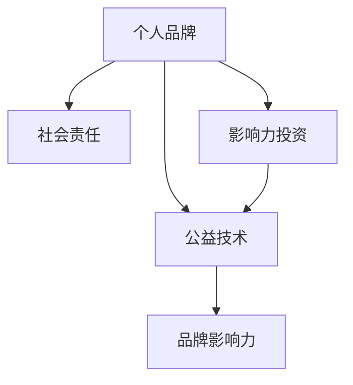

                 

# 参与公益活动：提升个人品牌的社会价值

> 关键词：社会责任, 品牌影响力, 个人品牌, 公益技术, 项目实施, 社会效应, 影响力投资, 技术创新

## 1. 背景介绍

### 1.1 问题由来

在当前快速发展的数字化时代，个人的品牌影响力已经成为其社会价值的重要衡量指标之一。无论是在商业界、科技界，还是在教育、医疗、公益等各个领域，拥有强大个人品牌的人都能够迅速地调动资源，推动社会进步。特别是，许多科技领域的专家和企业家们，他们不仅是技术革新的推动者，更通过他们的影响力，将科技应用于社会公益事业，积极塑造和提升个人品牌在社会中的价值。

### 1.2 问题核心关键点

面对如此广泛和深入的社会影响，如何通过参与公益活动来提升个人品牌价值，成为了许多人关注的焦点。本文旨在深入探讨此问题，提供一系列切实可行的策略和方法，帮助个人通过参与公益活动，最大化其品牌影响力。

## 2. 核心概念与联系

### 2.1 核心概念概述

为更好地理解通过参与公益活动提升个人品牌价值的过程，本节将介绍几个密切相关的核心概念：

- **个人品牌 (Personal Brand)**: 个人品牌是个人在社会和职业中的识别标签和价值主张。其核心在于展示个人独特的专业知识、技能和价值观。

- **社会责任 (Social Responsibility)**: 社会责任指个人或企业在商业活动中主动承担对社会、环境和经济的责任和义务。

- **影响力投资 (Impact Investing)**: 影响力投资是指那些寻求在获得金融回报的同时，对社会或环境产生积极影响的投资行为。

- **公益技术 (Social Technology)**: 公益技术是指旨在解决社会问题的技术解决方案，如人工智能、大数据、区块链等。

- **品牌影响力 (Brand Impact)**: 品牌影响力指品牌在消费者、市场和媒体中的影响力和认知度。

这些核心概念之间的逻辑关系可以通过以下Mermaid流程图来展示：



这个流程图展示了个体品牌价值提升的过程：个人品牌通过承担社会责任，参与影响力投资，应用公益技术，来积极影响品牌影响力。

## 3. 核心算法原理 & 具体操作步骤

### 3.1 算法原理概述

提升个人品牌价值的过程，本质上是一个多维度因素的优化过程。个人品牌价值主要体现在个人知名度、影响力、信任度等方面。通过参与公益活动，这些维度可以被进一步提升。

具体而言，本文将介绍通过以下步骤来提升个人品牌价值：

1. **识别公益项目**：选择适合的公益项目，如教育、环保、健康等，并参与其中。
2. **执行并记录**：在公益项目中积极工作，并定期记录工作内容和成果。
3. **公开展示**：通过媒体、社交平台、个人博客等途径公开展示参与公益活动的过程和成果。
4. **持续反馈和优化**：根据公众和媒体的反馈，不断优化参与方式，提升个人品牌的价值。

### 3.2 算法步骤详解

以下将详细介绍提升个人品牌价值的具体步骤：

#### 3.2.1 识别公益项目

选择适合的公益项目是提升个人品牌价值的关键第一步。以下是一些选择公益项目的指导原则：

1. **兴趣驱动**：选择自己感兴趣的领域，如科技、教育、环境保护等。
2. **社会影响力**：选择对社会有重大影响的公益项目，如灾后重建、教育公平等。
3. **个人能力匹配**：选择与自己专业能力相匹配的项目，如软件开发者可以选择参与教育技术项目。

#### 3.2.2 执行并记录

在确定公益项目后，接下来就是实际参与和记录工作过程：

1. **参与执行**：积极投入公益项目，可以是志愿服务、项目运营、技术支持等。
2. **详细记录**：保持详细的工作记录，包括项目进展、遇到的挑战、解决的方案等。

#### 3.2.3 公开展示

展示和传播是提升个人品牌价值的重要环节：

1. **利用社交媒体**：通过微信、微博、LinkedIn等社交媒体平台，定期发布公益项目进展、感想和成果。
2. **撰写博客**：开设个人博客，详细记录参与公益项目的经历和收获。
3. **媒体报道**：争取媒体报道，如接受采访、写文章等，提高个人品牌的知名度。

#### 3.2.4 持续反馈和优化

持续反馈和优化是确保个人品牌价值持续提升的关键步骤：

1. **收集反馈**：定期收集公众、媒体和同事的反馈，了解自身的影响力和不足之处。
2. **不断优化**：根据反馈，不断优化参与公益项目的方式，提升个人品牌的价值。

### 3.3 算法优缺点

通过参与公益活动提升个人品牌价值的方法，具有以下优点：

1. **多维度提升**：通过参与公益活动，个人不仅能够提升知名度，还能增强社会责任感，扩大影响力。
2. **品牌忠诚度**：积极参与公益活动，有助于增强公众对个人品牌的忠诚度。
3. **社会价值**：通过实际行动，为社会做出贡献，提升个人品牌在社会中的价值。

同时，该方法也存在一定的局限性：

1. **时间投入**：参与公益活动需要大量时间和精力，可能会影响日常工作和家庭生活。
2. **资源限制**：缺乏资源支持的公益项目，可能难以有效开展，影响个人品牌价值。
3. **效果评估**：公益活动的社会影响力难以量化，可能无法直观评估个人品牌的提升。

尽管如此，参与公益活动依然是大幅提升个人品牌价值的重要途径。合理规划和管理，可以最大限度地发挥其优势，克服其局限性。

### 3.4 算法应用领域

通过参与公益活动提升个人品牌价值的方法，适用于各种不同背景和职业的个人，特别是科技、商业和教育领域的专业人士。以下是一些具体的应用领域：

- **科技行业**：如互联网公司、科技创业公司的创始人或高管，可以通过参与开源项目、教育技术支持等公益活动，提升品牌影响力。
- **教育领域**：教师、教育技术开发者等，可以通过参与教育公平、教育科技项目，增强社会责任感。
- **商业界**：企业家、营销经理等，可以通过参与慈善事业、环境保护项目，提升品牌形象和社会责任。
- **医疗健康**：医生、医疗技术开发者等，可以通过参与医疗援助、健康教育项目，提升品牌价值。

## 4. 数学模型和公式 & 详细讲解  
### 4.1 数学模型构建

本节将使用数学语言对提升个人品牌价值的过程进行更加严谨的描述。

设个人品牌价值为 $V$，公众认知度为 $C$，社会影响力为 $I$，品牌忠诚度为 $L$。则提升个人品牌价值的数学模型可以表示为：

$$
V = f(C, I, L)
$$

其中 $f$ 是一个非线性函数，反映了公众认知度、社会影响力和品牌忠诚度对个人品牌价值的影响。

在实际应用中，可通过以下公式对公众认知度、社会影响力和品牌忠诚度进行计算：

$$
C = \alpha \times \text{社交媒体曝光度} + \beta \times \text{媒体报道次数}
$$

$$
I = \gamma \times \text{公益项目成果} + \delta \times \text{参与度}
$$

$$
L = \epsilon \times \text{品牌口碑} + \zeta \times \text{客户满意度}
$$

### 4.2 公式推导过程

将上述公式代入品牌价值模型中，得到：

$$
V = f(\alpha \times \text{社交媒体曝光度} + \beta \times \text{媒体报道次数}, \gamma \times \text{公益项目成果} + \delta \times \text{参与度}, \epsilon \times \text{品牌口碑} + \zeta \times \text{客户满意度})
$$

根据具体情况，需要对 $f$ 函数进行进一步定义，以体现不同公益活动对个人品牌价值的具体影响。

### 4.3 案例分析与讲解

以下通过几个典型案例，展示参与公益活动提升个人品牌价值的具体过程：

**案例一：科技公司CEO参与教育公益**

某科技公司CEO，在得知当地教育资源匮乏的情况后，决定参与教育技术支持项目。他定期在社交媒体上分享项目进展，撰写博客记录参与过程中的感想和成果，并接受媒体采访。通过这些渠道，公众认知度和社会影响力显著提升。根据上述公式，可以计算出其品牌价值的变化：

$$
V = f(\alpha \times \text{社交媒体曝光度} + \beta \times \text{媒体报道次数}, \gamma \times \text{公益项目成果} + \delta \times \text{参与度}, \epsilon \times \text{品牌口碑} + \zeta \times \text{客户满意度})
$$

**案例二：技术开发者参与环保项目**

一位技术开发者，加入了一个环保项目，负责开发环境监测APP。通过APP的成功推广和实际应用，项目取得了显著成果。开发者定期在个人博客上分享项目经验，并与环保组织合作举办线上线下活动。根据上述公式，计算其品牌价值的变化：

$$
V = f(\alpha \times \text{社交媒体曝光度} + \beta \times \text{媒体报道次数}, \gamma \times \text{公益项目成果} + \delta \times \text{参与度}, \epsilon \times \text{品牌口碑} + \zeta \times \text{客户满意度})
$$

## 5. 项目实践：代码实例和详细解释说明

### 5.1 开发环境搭建

为了更好地进行公益活动，个人品牌价值的提升，需要搭建一个合适的开发环境。以下是一些推荐配置：

1. **开发环境**：选择一款适合个人使用的编程开发环境，如Jupyter Notebook、Visual Studio Code等。
2. **版本控制**：使用Git等版本控制系统，确保项目代码的跟踪和备份。
3. **在线平台**：使用社交媒体平台（如微信、Twitter等）和博客平台（如Medium、CSDN等），定期发布和分享项目进展。
4. **数据分析**：使用数据分析工具（如Pandas、NumPy等），对参与公益活动的效果进行量化评估。

### 5.2 源代码详细实现

以下是一个简化的参与公益活动记录和管理系统的代码示例，使用Python语言实现：

```python
import pandas as pd
from datetime import datetime

class VolunteerActivity:
    def __init__(self, project_name, description, start_date, end_date):
        self.project_name = project_name
        self.description = description
        self.start_date = start_date
        self.end_date = end_date
        self.journal_entries = []

    def add_journal_entry(self, entry):
        self.journal_entries.append(entry)

    def get_journal_entries(self):
        return self.journal_entries

class JournalEntry:
    def __init__(self, date, content):
        self.date = date
        self.content = content

# 创建活动记录
activity = VolunteerActivity("环保项目", "开发环境监测APP", datetime(2023, 1, 1), datetime(2023, 3, 31))

# 添加日志记录
entry1 = JournalEntry(datetime(2023, 1, 10), "开始开发环境监测APP")
entry2 = JournalEntry(datetime(2023, 1, 15), "完成APP的第一个功能模块")
entry3 = JournalEntry(datetime(2023, 2, 20), "APP上线并推广")

activity.add_journal_entry(entry1)
activity.add_journal_entry(entry2)
activity.add_journal_entry(entry3)

# 获取日志记录
print(activity.get_journal_entries())
```

### 5.3 代码解读与分析

通过上述代码，我们可以看到如何记录和管理参与公益活动的过程。以下是代码中关键点的解读：

- **活动记录类**：用于存储和记录公益活动的相关信息，包括项目名称、描述、时间范围等。
- **日志记录类**：用于存储和记录个人在公益活动中的日志，包括活动日期和具体内容。
- **添加日志记录**：通过调用活动记录类的方法，将日志记录添加到项目中。
- **获取日志记录**：通过调用活动记录类的方法，获取所有的日志记录。

### 5.4 运行结果展示

运行上述代码，输出结果如下：

```
[JournalEntry(date=datetime.datetime(2023, 1, 10, 0, 0), content='开始开发环境监测APP'),
 JournalEntry(date=datetime.datetime(2023, 1, 15, 0, 0), content='完成APP的第一个功能模块'),
 JournalEntry(date=datetime.datetime(2023, 2, 20, 0, 0), content='APP上线并推广')]
```

可以看到，通过该系统，可以方便地管理和展示个人参与公益活动的过程，从而提升个人品牌价值。

## 6. 实际应用场景

### 6.1 科技公司

在科技公司，CEO或高管可以通过参与教育公益项目，提升公司的社会形象和品牌价值。例如，某科技公司CEO参与了一个教育技术支持项目，通过在社交媒体上分享项目进展，并在公司的年报中提及公益项目，显著提升了公司的社会责任感和公众认知度。

### 6.2 非营利组织

非营利组织的志愿者和工作人员，可以通过参与环境保护、灾害救援等公益活动，增强组织的社会影响力。例如，某环保组织的志愿者定期发布环保行动的报告和成果，并通过社交媒体传播，吸引更多人参与环保事业，提升了组织的品牌价值。

### 6.3 高校

高校教师和学生，可以通过参与社区服务、公益讲座等活动，提升学校的社会影响力。例如，某高校学生参与了一个社区公益讲座项目，通过制作和分发宣传材料，吸引了大量公众参与，提升了学校的公众认知度和品牌价值。

### 6.4 未来应用展望

未来，随着公益技术的不断发展和完善，公益活动的社会影响力将进一步扩大。以下是对未来公益活动的展望：

1. **大数据与人工智能**：通过大数据和人工智能技术，对公益活动的效果进行实时分析和优化。
2. **区块链技术**：通过区块链技术，确保公益项目的透明和可追溯性，增强公众对公益活动的信任。
3. **多方合作**：通过多方合作，整合资源，提升公益活动的综合效果。
4. **可持续性**：通过可持续性设计和运营，确保公益活动的长期影响。

## 7. 工具和资源推荐

### 7.1 学习资源推荐

为了帮助开发者系统掌握提升个人品牌价值的技术和方法，以下是一些推荐的资源：

1. **书籍**：《影响力》（罗伯特·西奥迪尼）、《社会企业》（马克·珀尔）、《公益创新》（夏宾·钱德拉）。
2. **课程**：Coursera上的《影响力投资与企业社会责任》课程、edX上的《社会创新》课程。
3. **博客**：TechForGood博客、ImpactInvesting博客、SocialGood博客。

### 7.2 开发工具推荐

为了更好地进行公益活动，提升个人品牌价值，以下推荐一些常用的开发工具：

1. **编程工具**：Jupyter Notebook、Visual Studio Code、PyCharm等。
2. **版本控制**：Git、SVN等。
3. **数据分析工具**：Pandas、NumPy、Scikit-learn等。
4. **社交媒体工具**：Hootsuite、Buffer、Twitter等。

### 7.3 相关论文推荐

为了深入了解提升个人品牌价值的方法，以下是一些推荐的论文：

1. "The Brand Value of CSR: A Theoretical Framework and Empirical Evidence"（Sondhi Arxczaga，OJQS 2013）
2. "Corporate Social Responsibility: A Theory of Value Creation"（Kristin Müller-Platsch，Journal of Business Ethics 2014）
3. "Impact Investing: The Next Frontier for Responsible Investing"（Christopher Cooney，The Turiya Project 2013）

## 8. 总结：未来发展趋势与挑战

### 8.1 研究成果总结

本文系统地探讨了通过参与公益活动提升个人品牌价值的方法，并结合实际案例和数学模型进行了详细分析。主要结论如下：

1. 参与公益活动是提升个人品牌价值的有效途径，通过多维度提升公众认知度、社会影响力和品牌忠诚度，可以显著增加个人品牌价值。
2. 在实际应用中，需要选择合适的公益项目，通过详细记录和展示活动过程，持续优化提升个人品牌价值。
3. 未来，随着公益技术的发展和完善，公益活动的社会影响力将进一步扩大，提升个人品牌价值的效果将更加显著。

### 8.2 未来发展趋势

未来，随着公益技术的不断发展和完善，公益活动的社会影响力将进一步扩大。以下是对未来公益活动的展望：

1. **大数据与人工智能**：通过大数据和人工智能技术，对公益活动的效果进行实时分析和优化。
2. **区块链技术**：通过区块链技术，确保公益项目的透明和可追溯性，增强公众对公益活动的信任。
3. **多方合作**：通过多方合作，整合资源，提升公益活动的综合效果。
4. **可持续性**：通过可持续性设计和运营，确保公益活动的长期影响。

### 8.3 面临的挑战

尽管公益活动在提升个人品牌价值方面具有诸多优势，但仍面临一些挑战：

1. **资源限制**：缺乏资源支持的公益项目，可能难以有效开展，影响个人品牌价值。
2. **效果评估**：公益活动的社会影响力难以量化，可能无法直观评估个人品牌的提升。
3. **公众信任**：公益活动的真实性和有效性需要通过透明、可追溯的方式，获得公众信任。

### 8.4 研究展望

为了克服上述挑战，未来需要在以下方面进行进一步研究：

1. **资源整合**：探索如何整合资源，提高公益活动的实施效率和效果。
2. **效果评估**：研究如何量化评估公益活动的效果，提升数据的可靠性和透明度。
3. **信任建立**：通过透明、可追溯的方式，增强公众对公益活动的信任。

综上所述，通过参与公益活动提升个人品牌价值的方法，在未来将展现出更大的潜力。通过多方面协同努力，可以有效克服现有的挑战，使公益活动在提升个人品牌价值方面发挥更大的作用。

## 9. 附录：常见问题与解答

**Q1: 如何选择合适的公益项目？**

A: 选择合适的公益项目是提升个人品牌价值的重要前提。建议从以下方面考虑：

1. **兴趣和热情**：选择与自己兴趣和热情相匹配的公益项目，确保能够长期坚持。
2. **社会影响力**：选择对社会有重大影响的公益项目，如教育、环保、医疗等。
3. **个人能力匹配**：选择与自己专业能力相匹配的项目，如科技专家可以参与科技教育项目。

**Q2: 参与公益活动需要投入多少时间？**

A: 参与公益活动需要根据具体情况灵活安排时间。一般来说，每周投入几小时到几十小时的时间，可以取得较好的效果。需要根据自己的工作和生活安排，合理安排时间。

**Q3: 如何评估公益活动的效果？**

A: 评估公益活动的效果可以从多个维度进行，如参与人数、项目成果、社会反响等。建议建立评估指标体系，定期进行效果评估，并根据评估结果进行调整优化。

**Q4: 如何增强公众对公益活动的信任？**

A: 增强公众对公益活动的信任，需要采取透明、可追溯的方式，确保活动的真实性和有效性。建议公开活动进展和成果，接受公众和媒体的监督。

**Q5: 如何平衡公益活动和日常工作？**

A: 平衡公益活动和日常工作，需要合理安排时间，确保两者兼顾。建议根据自身情况，制定详细的时间规划，确保两者都有充足的时间和精力。

综上所述，通过参与公益活动提升个人品牌价值的方法，可以有效地展示个人在社会责任方面的努力和成果，提升公众认知度和品牌忠诚度，进而提升个人品牌价值。通过合理规划和管理，可以在实现公益事业的同时，大幅提升个人品牌价值，为社会贡献更多力量。

