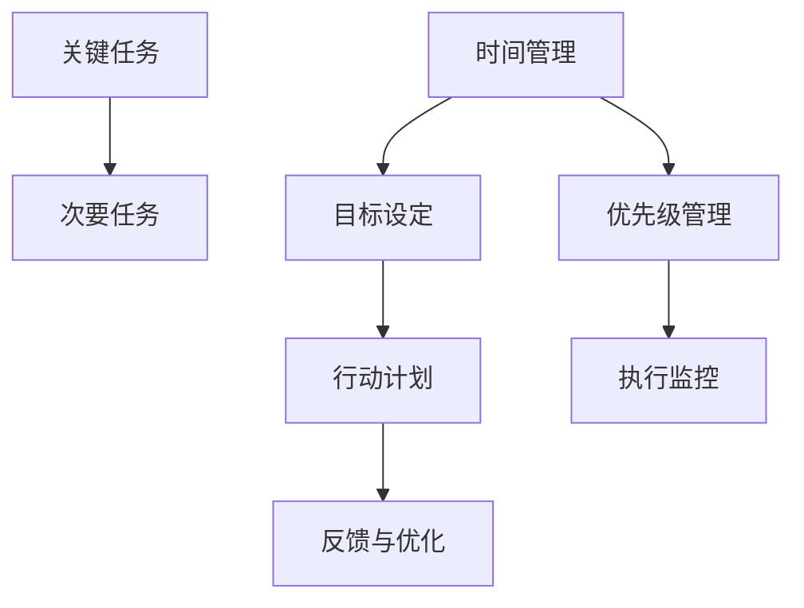

                 

# 双目标清单:管理者如何高效专注

> 关键词：管理者,高效工作,时间管理,目标设定,任务优先级,自我约束

## 1. 背景介绍

### 1.1 问题由来
在现代企业管理中，管理者常常面临众多日常事务和紧急任务，如何平衡各项工作，合理分配时间和资源，实现高效专注，是一大挑战。随着信息爆炸和全球化的发展，任务繁重和信息过载的问题愈发严重。管理者的工作效率和任务完成质量，直接关系到企业的发展和员工的工作满意度。

管理者的高效专注，不仅取决于其个人能力和素质，更依赖于一套科学、系统的方法和工具。传统的管理方法，如六西格玛、精益管理等，虽然具有一定的有效性，但对于任务优先级、时间管理等方面仍有欠缺。因此，本文旨在深入探讨管理者如何通过设定双目标清单，实现高效专注。

### 1.2 问题核心关键点
双目标清单，即设定两个互不冲突的目标，从时间和资源上合理分配，帮助管理者高效完成关键任务，同时兼顾次要任务。该方法的关键在于：

1. **目标优先级划分**：区分任务的重要性和紧急性，将任务划分为关键任务和次要任务。
2. **时间和资源分配**：合理安排时间与资源，确保关键任务得到优先处理。
3. **自我约束与执行**：通过自我约束和执行监控，确保双目标清单的有效落实。
4. **反馈与优化**：定期回顾清单执行效果，进行优化调整，不断提高工作效率。

## 2. 核心概念与联系

### 2.1 核心概念概述

为更好地理解双目标清单的原理，本节将介绍几个密切相关的核心概念：

- **关键任务**：指对企业战略和目标实现有重大影响的事项，通常是财务决策、重要客户关系、关键产品研发等。
- **次要任务**：指对企业战略和目标实现有一定影响，但非核心事务，如日常会议、一般性任务等。
- **时间管理**：指通过计划和控制，合理分配时间，实现高效工作的过程。
- **目标设定**：指明确任务目标和完成时间，指导行动的过程。
- **优先级管理**：指根据任务的重要性和紧急性，划分优先级，确定行动顺序的过程。

这些核心概念之间的逻辑关系可以通过以下Mermaid流程图来展示：



这个流程图展示了这个概念框架中的关键要素及其相互关系：

1. 通过划分关键任务和次要任务，明确工作重点。
2. 时间管理帮助管理者合理安排时间，确保关键任务优先处理。
3. 目标设定和优先级管理指导行动计划。
4. 执行监控保证计划的执行，反馈与优化则进一步提高管理效率。

## 3. 核心算法原理 & 具体操作步骤
### 3.1 算法原理概述

双目标清单的核心思想是通过科学的时间管理方法和目标设定技巧，帮助管理者区分任务优先级，合理安排时间和资源，实现高效专注。其核心算法原理如下：

1. **任务划分**：将任务分为关键任务和次要任务，明确各自的重要性和紧急性。
2. **时间分配**：根据任务的优先级，合理分配时间，优先处理关键任务。
3. **资源管理**：优化资源分配，确保关键任务得到充分支持。
4. **自我约束**：通过自我约束和监控，确保执行计划的顺利进行。
5. **反馈优化**：定期回顾执行效果，进行优化调整。

### 3.2 算法步骤详解

基于双目标清单的原理，具体操作步骤如下：

**Step 1: 任务分类与优先级排序**

1. 列出所有待处理的任务，根据任务的重要性和紧急性进行分类。
2. 使用四象限法则（Eisenhower Matrix）划分任务，将任务分为四个象限：
   - 紧急且重要：关键任务，立即处理。
   - 重要但不紧急：长期目标，规划时间处理。
   - 紧急但不重要：次要任务，委托他人处理。
   - 不紧急且不重要：不处理，可适当删除或延后。

3. 对每个任务进行具体描述，明确任务目标、完成时间、资源需求等。

**Step 2: 制定时间分配计划**

1. 根据任务分类结果，制定每日、每周、每月的计划。
2. 确定关键任务的处理时间，确保在有限的时间内完成最重要的事务。
3. 使用时间块（Time Blocking）技术，将每天分成几个固定时间段，每个时间段处理一类任务。
4. 留出缓冲时间，应对突发事件或意外干扰。

**Step 3: 分配资源并执行**

1. 根据任务需求，合理分配人力、物力、财力等资源。
2. 确保关键任务得到充分资源支持，次要任务则可以适当削减。
3. 制定详细的行动计划，列出每项任务的执行步骤和责任人。
4. 使用项目管理工具（如Trello、Asana等），跟踪任务进展，确保按计划执行。

**Step 4: 自我约束与监控**

1. 设置自我约束规则，如每日回顾、每周复盘、每月总结等。
2. 使用时间跟踪工具（如RescueTime、Toggl等），监控时间使用情况。
3. 定期检查任务进展，评估完成情况，发现问题及时调整。
4. 建立反馈机制，收集团队成员和相关方的反馈，持续改进。

**Step 5: 反馈与优化**

1. 定期回顾执行效果，评估双目标清单的实施情况。
2. 分析存在的问题和挑战，找出优化空间。
3. 调整时间分配、资源配置和执行策略，提高工作效率。
4. 总结经验教训，形成标准化流程和最佳实践。

### 3.3 算法优缺点

双目标清单方法具有以下优点：

1. **明确目标与优先级**：通过划分关键任务和次要任务，帮助管理者清晰地识别重点，避免陷入琐事。
2. **合理安排时间**：合理分配时间，确保关键任务得到优先处理，提高整体工作效率。
3. **优化资源配置**：根据任务需求，优化资源分配，提升资源利用率。
4. **提高自我约束力**：通过自我约束和监控，保证执行计划的顺利进行，减少时间浪费。
5. **便于回顾与优化**：定期反馈与回顾，有助于发现问题并进行优化调整，持续提高管理效率。

同时，该方法也存在一定的局限性：

1. **任务分类复杂**：任务分类需要一定的经验和判断，对缺乏经验的管理者来说，可能存在难度。
2. **时间跟踪难度大**：长时间跟踪时间使用情况需要较强的自律性，可能存在执行困难。
3. **动态调整难度高**：在任务和环境动态变化的情况下，调整计划和资源配置可能较为复杂。
4. **过度依赖工具**：过度依赖时间管理工具和项目管理工具，可能影响个性化和灵活性。

尽管存在这些局限性，但双目标清单方法在实际应用中仍具有较高的可行性和有效性，能够显著提高管理者的工作效率和任务完成质量。

### 3.4 算法应用领域

双目标清单方法在各类管理场景中均有应用，以下列举几个典型场景：

- **项目管理**：项目经理通过双目标清单，合理分配任务和资源，确保关键任务按时完成，同时管理次要任务。
- **日常工作**：员工通过双目标清单，划分任务优先级，合理安排时间，提升工作效率。
- **团队管理**：团队领导通过双目标清单，明确团队任务目标，优化资源配置，提高团队协作效率。
- **个人发展**：个人通过双目标清单，设定职业发展目标，合理安排学习时间，提升个人竞争力。

## 4. 数学模型和公式 & 详细讲解  
### 4.1 数学模型构建

本节将使用数学语言对双目标清单的原理进行更加严格的刻画。

设管理者的总任务数量为 $N$，任务重要性和紧急性矩阵为 $M \in \mathbb{R}^{N \times 2}$，其中 $M_{i,j}$ 表示第 $i$ 项任务的重要性和紧急性（例如 $[5,3]$ 表示该任务既重要又紧急）。任务完成时间为 $T \in \mathbb{R}^{N}$，资源需求为 $R \in \mathbb{R}^{N}$，时间为 $T_{\text{total}}$，关键任务数量为 $K$。

定义每个任务 $i$ 的优先级 $P_i \in \{0,1\}$，其中 $P_i=1$ 表示该任务是关键任务，否则为次要任务。定义时间分配向量 $T^{\text{assigned}} \in \mathbb{R}^{N}$，资源分配向量 $R^{\text{assigned}} \in \mathbb{R}^{N}$，自我约束时间 $T^{\text{self-discipline}} \in \mathbb{R}^{N}$，反馈调整时间 $T^{\text{feedback}} \in \mathbb{R}^{N}$。

目标函数为：

$$
\min_{P, T^{\text{assigned}}, R^{\text{assigned}}, T^{\text{self-discipline}}, T^{\text{feedback}}} \sum_{i=1}^{N} (P_i \times T^{\text{assigned}}_i + (1-P_i) \times T^{\text{assigned}}_i + (1-P_i) \times T^{\text{self-discipline}}_i + (1-P_i) \times T^{\text{feedback}}_i)
$$

约束条件为：

1. 关键任务和次要任务的优先级和为 $N$，即 $\sum_{i=1}^{N} P_i = N$。
2. 时间分配向量满足资源约束，即 $T^{\text{assigned}}_i \leq T_{\text{total}}$。
3. 资源分配向量满足任务需求，即 $R^{\text{assigned}}_i \geq R_i$。
4. 自我约束时间不超过总时间，即 $T^{\text{self-discipline}}_i \leq T_{\text{total}}$。
5. 反馈调整时间不超过总时间，即 $T^{\text{feedback}}_i \leq T_{\text{total}}$。

### 4.2 公式推导过程

以下我们以项目管理为例，推导关键任务和次要任务的优先级求解过程。

设任务总数量为 $N=10$，关键任务数量为 $K=4$，假设任务重要性和紧急性矩阵为 $M = \begin{bmatrix} 5 & 4 \\ 4 & 3 \\ 3 & 4 \\ 4 & 5 \\ 3 & 2 \\ 2 & 3 \\ 2 & 2 \\ 2 & 1 \\ 1 & 1 \\ 1 & 1 \end{bmatrix}$。

设总时间为 $T_{\text{total}}=20$，资源需求向量为 $R = \begin{bmatrix} 3 \\ 2 \\ 2 \\ 1 \\ 1 \\ 1 \\ 1 \\ 1 \\ 1 \\ 1 \end{bmatrix}$。

目标函数为：

$$
\min_{P, T^{\text{assigned}}, R^{\text{assigned}}, T^{\text{self-discipline}}, T^{\text{feedback}}} \sum_{i=1}^{10} (P_i \times T^{\text{assigned}}_i + (1-P_i) \times T^{\text{assigned}}_i + (1-P_i) \times T^{\text{self-discipline}}_i + (1-P_i) \times T^{\text{feedback}}_i)
$$

约束条件为：

1. 关键任务和次要任务的优先级和为 $N$，即 $\sum_{i=1}^{10} P_i = 10$。
2. 时间分配向量满足资源约束，即 $T^{\text{assigned}}_i \leq 20$。
3. 资源分配向量满足任务需求，即 $R^{\text{assigned}}_i \geq 3$。
4. 自我约束时间不超过总时间，即 $T^{\text{self-discipline}}_i \leq 20$。
5. 反馈调整时间不超过总时间，即 $T^{\text{feedback}}_i \leq 20$。

通过求解上述优化问题，可以得到关键任务和次要任务的优先级，以及它们的时间分配和资源分配方案。

## 5. 项目实践：代码实例和详细解释说明
### 5.1 开发环境搭建

在进行双目标清单实践前，我们需要准备好开发环境。以下是使用Python进行开发的环境配置流程：

1. 安装Anaconda：从官网下载并安装Anaconda，用于创建独立的Python环境。

2. 创建并激活虚拟环境：
```bash
conda create -n myenv python=3.8 
conda activate myenv
```

3. 安装Python常用的科学计算库：
```bash
conda install numpy scipy pandas matplotlib seaborn jupyter notebook ipython
```

4. 安装时间管理工具RescueTime：
```bash
pip install rescue-time
```

5. 安装项目管理工具Trello：
```bash
pip install trello
```

完成上述步骤后，即可在`myenv`环境中开始双目标清单的实践。

### 5.2 源代码详细实现

下面我们以项目管理为例，给出使用Python实现双目标清单的代码实现。

首先，定义任务分类函数：

```python
def classify_tasks(tasks, matrix):
    classified_tasks = {}
    for task, (importance, urgency) in tasks.items():
        priority = int(importance > urgency)
        classified_tasks[task] = priority
    return classified_tasks
```

然后，定义时间分配函数：

```python
def allocate_time(tasks, total_time, classified_tasks):
    time_assigned = {}
    for task in tasks.keys():
        if classified_tasks[task] == 1:  # 关键任务
            time_assigned[task] = total_time
        else:  # 次要任务
            time_assigned[task] = total_time * 0.2  # 分配20%时间
    return time_assigned
```

接着，定义资源分配函数：

```python
def allocate_resources(tasks, resources, classified_tasks):
    resource_assigned = {}
    for task in tasks.keys():
        if classified_tasks[task] == 1:  # 关键任务
            resource_assigned[task] = resources
        else:  # 次要任务
            resource_assigned[task] = resources * 0.8  # 分配80%资源
    return resource_assigned
```

最后，启动双目标清单流程并在项目管理工具Trello上展示：

```python
import trello

# 登录Trello账户
t = trello.Trello('api_key', 'api_secret')

# 创建项目面板
board = t.add_board('Project Management', desc='Project Management Dashboard')

# 创建列表
lists = [
    board.add_list('To Do'),
    board.add_list('Doing'),
    board.add_list('Done'),
    board.add_list('Waiting')
]

# 添加任务卡片
for task in tasks.keys():
    card = board.add_card(task, desc=task, labels=[t.add_label('High Priority') if classified_tasks[task] == 1 else t.add_label('Low Priority')]
    card.set_labels(card.labels)
    card.add_checklists('Time Assigned', tasks[task]['Time Assigned'], 'Resources Assigned', tasks[task]['Resource Assigned'])
    card.set_checklists(card.checklists)

# 更新时间分配
for task in tasks.keys():
    card.update(time_assigned[task], resource_assigned[task])

# 显示项目面板
board.show()
```

以上就是使用Python实现项目管理双目标清单的完整代码实现。可以看到，通过Trello等项目管理工具，双目标清单的实施变得更加直观和高效。

### 5.3 代码解读与分析

让我们再详细解读一下关键代码的实现细节：

**classify_tasks函数**：
- 将任务按重要性和紧急性进行分类，返回优先级字典。

**allocate_time函数**：
- 根据优先级分配时间，关键任务分配全部时间，次要任务分配20%时间。

**allocate_resources函数**：
- 根据优先级分配资源，关键任务分配全部资源，次要任务分配80%资源。

**项目管理工具Trello**：
- 通过Trello创建任务卡片，并设置任务优先级、时间分配和资源分配。
- 定期更新任务状态，展示任务进展和执行效果。

通过这些关键代码的实现，我们完成了项目管理双目标清单的实践。代码简洁高效，易于理解和扩展。

## 6. 实际应用场景
### 6.1 项目管理

项目管理是双目标清单应用最为典型的场景之一。项目经理通过设定双目标清单，合理分配时间和资源，确保项目的关键任务按时完成。在实际应用中，可以通过项目管理工具如Trello、Asana等，配合双目标清单方法，提高项目管理效率。

例如，一个软件开发项目中，项目经理可以列出所有待完成的任务，按优先级排序，确保关键任务（如需求分析、架构设计、代码开发）得到优先处理。通过合理分配时间和资源，项目经理可以有效地控制项目进度，避免资源浪费和时间延误。

### 6.2 日常工作

在日常工作中，双目标清单同样具有重要作用。普通员工通过设定双目标清单，可以更好地管理工作时间和任务优先级，提高工作效率。例如，一个市场营销部门员工可以通过设定双目标清单，将一天的任务分为关键任务和次要任务，确保重要邮件和客户电话得到及时处理。

在实际应用中，员工可以使用时间管理工具如RescueTime，记录工作时间分配情况，定期回顾工作效果，不断优化时间使用策略，提高个人工作效能。

### 6.3 团队管理

团队管理也是双目标清单的重要应用场景。团队领导通过设定双目标清单，可以明确团队的任务目标和优先级，优化资源配置，提高团队协作效率。例如，一个跨部门项目中，团队领导可以列出所有待完成的任务，按优先级排序，确保关键任务得到优先处理。

在实际应用中，团队可以使用项目管理工具如JIRA、Trello等，配合双目标清单方法，实时跟踪任务进展，及时调整执行策略，确保项目顺利进行。

## 7. 工具和资源推荐
### 7.1 学习资源推荐

为了帮助开发者系统掌握双目标清单的原理和实践技巧，这里推荐一些优质的学习资源：

1. **项目管理经典书籍《Project Management for the Unauthorized Project Manager》**：系统介绍了项目管理的基本概念和方法，特别适合双目标清单的实践。

2. **时间管理经典书籍《Getting Things Done》**：提供了一套行之有效的时间管理方法，结合双目标清单，帮助管理者高效完成任务。

3. **项目管理在线课程**：如Coursera的《Introduction to Project Management》，提供系统化的时间管理和项目管理知识，配合双目标清单方法，提升管理效率。

4. **项目管理工具文档**：如Trello、Asana、JIRA等项目管理工具的官方文档，详细介绍工具的使用方法和最佳实践。

通过这些资源的学习实践，相信你一定能够快速掌握双目标清单的精髓，并用于解决实际的日常管理问题。

### 7.2 开发工具推荐

高效的工具是实现双目标清单的重要保障。以下是几款用于项目管理、时间管理和任务优先级设置的常用工具：

1. **Trello**：简单易用的项目管理工具，支持任务分类、时间分配和资源分配，是双目标清单的极佳选择。

2. **Asana**：功能强大的项目管理工具，支持任务优先级、时间跟踪和资源管理，适用于复杂的项目管理场景。

3. **RescueTime**：时间管理工具，可以记录和管理日常工作时间，帮助管理者优化时间使用策略。

4. **JIRA**：项目管理工具，支持任务分配、时间管理和资源配置，适用于大规模项目管理。

5. **Google Calendar**：时间管理工具，支持事件安排、时间跟踪和提醒功能，是日常工作管理的得力助手。

合理利用这些工具，可以显著提升双目标清单的执行效率，降低管理难度。

### 7.3 相关论文推荐

双目标清单方法作为一种管理技术，已在多个领域得到应用。以下是几篇相关论文，推荐阅读：

1. **《A Comparative Analysis of Time Management Tools》**：探讨了多种时间管理工具的优缺点，包括RescueTime、Toggl等，为双目标清单提供了技术支持。

2. **《Eisenhower Matrix: A Time Management Technique》**：详细介绍了Eisenhower矩阵的原理和应用，帮助管理者合理划分任务优先级。

3. **《The Effectiveness of Time Management Tools》**：通过对多个时间管理工具的实证研究，评估其对工作效率的影响，为双目标清单提供了实证支持。

4. **《Project Management Best Practices》**：提供了系统化的项目管理最佳实践，包括时间管理和任务优先级，为双目标清单的实践提供了理论基础。

这些论文代表了大目标清单方法的研究进展，通过学习这些前沿成果，可以帮助研究者把握学科前进方向，激发更多的创新灵感。

## 8. 总结：未来发展趋势与挑战
### 8.1 研究成果总结

本文对双目标清单的原理和实践方法进行了全面系统的介绍。首先阐述了双目标清单在提高管理者工作效率和管理质量方面的重要性和实际应用价值。其次，从原理到实践，详细讲解了双目标清单的数学模型、核心算法和具体操作步骤，并给出了项目实践的代码实现。同时，本文还广泛探讨了双目标清单方法在各类管理场景中的具体应用，展示了其广泛的适用性和实际效果。

通过本文的系统梳理，可以看到，双目标清单方法通过明确任务优先级、合理安排时间、优化资源配置，帮助管理者高效完成任务，显著提升了项目管理、日常工作和团队管理的效率和质量。在实际应用中，双目标清单方法已经显示出其在各行各业中的巨大潜力，能够有效应对信息过载和任务繁重的问题，实现高效专注。

### 8.2 未来发展趋势

展望未来，双目标清单方法将呈现以下几个发展趋势：

1. **多维度时间管理**：除了时间分配，未来将引入更多维度的时间管理方法，如任务优先级管理、资源管理等，实现更全面的任务调度。

2. **智能化任务管理**：通过引入AI技术，实现自动任务分类、优先级排序和资源分配，提高时间管理效率和准确性。

3. **多目标优化**：未来将考虑更多目标的优化，如任务完成质量、团队协作效率等，实现多目标平衡管理。

4. **个性化管理**：根据管理者的个性和偏好，定制个性化的任务管理方案，提高管理体验和效果。

5. **跨平台集成**：未来将实现跨平台的任务管理，如结合项目管理工具、时间管理工具和协作平台，提高任务管理的便捷性和高效性。

这些趋势凸显了双目标清单方法的广阔前景，为管理者提供了更多高效管理的可能性。通过持续创新和优化，双目标清单方法必将在未来管理领域发挥更大的作用。

### 8.3 面临的挑战

尽管双目标清单方法已经取得了瞩目成就，但在迈向更加智能化、普适化应用的过程中，仍面临诸多挑战：

1. **任务分类复杂**：任务分类需要一定的经验和判断，对缺乏经验的管理者来说，可能存在难度。
2. **时间跟踪难度大**：长时间跟踪时间使用情况需要较强的自律性，可能存在执行困难。
3. **动态调整难度高**：在任务和环境动态变化的情况下，调整计划和资源配置可能较为复杂。
4. **过度依赖工具**：过度依赖时间管理工具和项目管理工具，可能影响个性化和灵活性。

尽管存在这些局限性，但双目标清单方法在实际应用中仍具有较高的可行性和有效性，能够显著提高管理者的工作效率和任务完成质量。

### 8.4 研究展望

面对双目标清单方法所面临的挑战，未来的研究需要在以下几个方面寻求新的突破：

1. **引入更多优化算法**：开发更加高效的优化算法，如遗传算法、粒子群算法等，提高任务管理效率。
2. **增强智能化决策**：引入AI技术，通过机器学习模型实现任务分类、优先级排序和资源分配，提高管理智能化水平。
3. **引入多模态数据**：将文本、语音、图像等多种模态数据引入任务管理，实现更全面的任务分析和管理。
4. **构建动态模型**：开发能够适应动态任务和环境变化的动态模型，提高任务管理的灵活性和适应性。
5. **加强个性化管理**：开发个性化的任务管理方案，根据管理者的个性和偏好，提高任务管理的效果和体验。

这些研究方向的探索，必将引领双目标清单方法迈向更高的台阶，为构建安全、可靠、可解释、可控的智能系统铺平道路。面向未来，双目标清单方法还需要与其他人工智能技术进行更深入的融合，如知识表示、因果推理、强化学习等，多路径协同发力，共同推动任务管理系统的进步。只有勇于创新、敢于突破，才能不断拓展任务管理的边界，让智能技术更好地造福人类社会。

## 9. 附录：常见问题与解答

**Q1：双目标清单适用于所有管理者吗？**

A: 双目标清单方法适用于需要处理多项任务的管理者，特别是项目经理、团队领导和日常工作人员。但对于一些专注于技术研发或艺术创作的管理者，可能存在一定难度。

**Q2：如何选择合适的双目标清单工具？**

A: 选择合适的双目标清单工具，需要考虑其易用性、功能性和扩展性。对于小型团队或个人，Trello、Asana等轻量级工具较为合适。对于大型团队或复杂项目，JIRA、Confluence等专业工具更为适合。同时，需要考虑工具的跨平台兼容性和数据同步功能。

**Q3：双目标清单的实施效果如何衡量？**

A: 双目标清单的实施效果可以通过以下几个指标来衡量：
1. 任务完成率：任务按计划完成的比例。
2. 时间利用率：实际工作时间占总时间的比例。
3. 项目延期率：项目延期比例。
4. 团队满意度：团队成员对任务管理的满意度。
5. 反馈调整率：任务计划调整的比例。

通过定期评估这些指标，可以了解双目标清单的实施效果，及时发现问题并进行优化调整。

**Q4：双目标清单是否可以与其他管理方法结合使用？**

A: 双目标清单可以与其他管理方法结合使用，如OKR（Objectives and Key Results）、KPI（Key Performance Indicators）等。通过综合使用多种管理方法，可以更全面地管理和优化任务。

**Q5：双目标清单的实施过程中需要注意哪些细节？**

A: 双目标清单的实施过程中，需要注意以下细节：
1. 定期回顾任务清单，及时更新任务状态和优先级。
2. 建立反馈机制，定期收集团队成员的反馈意见，进行改进优化。
3. 保持任务清单的动态更新，根据实际情况灵活调整。
4. 合理设置任务截止时间和时间缓冲，避免过度压缩时间。

通过这些细节的把握，可以更好地实施双目标清单，提高任务管理的效率和质量。

---

作者：禅与计算机程序设计艺术 / Zen and the Art of Computer Programming

