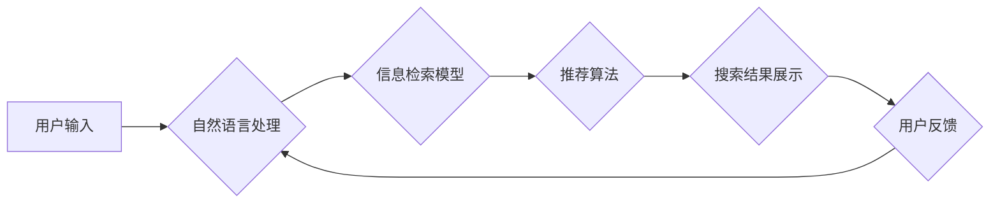

                 

## 移动端AI电商搜索的特殊考量

> 关键词：移动端搜索、电商搜索、AI算法、深度学习、自然语言处理、用户体验、资源约束、离线处理

## 1. 背景介绍

移动互联网的蓬勃发展催生了移动电商的快速崛起。用户通过手机进行商品搜索、浏览、购买已成为一种普遍的消费模式。然而，与传统的电商搜索相比，移动端搜索面临着诸多独特挑战。

**1.1 移动端搜索的特点**

* **屏幕尺寸限制:** 移动设备屏幕尺寸相对较小，信息展示空间有限，搜索结果页需要更加简洁明了。
* **网络环境不稳定:** 移动网络连接往往不稳定，搜索请求可能出现延迟或中断，需要考虑网络环境下的搜索策略。
* **用户行为差异:** 移动用户搜索习惯与桌面用户存在差异，例如更倾向于语音搜索、图片搜索等。
* **资源约束:** 移动设备资源有限，搜索算法需要兼顾效率和准确性，避免造成性能瓶颈。

**1.2 AI在电商搜索中的应用**

人工智能技术为电商搜索带来了革命性的变革，能够提升搜索结果的精准度、相关性和用户体验。

* **自然语言处理 (NLP):**  理解用户搜索意图，识别关键词和长尾关键词，处理用户自然语言输入。
* **深度学习:**  从海量商品数据中学习用户偏好和商品特征，实现个性化推荐和精准匹配。
* **推荐系统:**  根据用户历史行为、浏览记录和商品属性，推荐相关商品，提高用户转化率。

## 2. 核心概念与联系

移动端AI电商搜索的核心概念包括：

* **搜索引擎:**  负责处理用户搜索请求，检索相关商品信息并返回搜索结果。
* **信息检索模型:**  用于评估商品与用户搜索意图的匹配度，决定商品在搜索结果中的排序。
* **推荐算法:**  根据用户行为和商品特征，推荐相关商品，提升用户体验。
* **用户模型:**  构建用户画像，理解用户的搜索偏好、购买习惯和兴趣爱好。

**2.1  移动端AI电商搜索架构**



## 3. 核心算法原理 & 具体操作步骤

### 3.1  算法原理概述

移动端AI电商搜索算法通常基于深度学习和自然语言处理技术，旨在实现以下目标：

* **理解用户搜索意图:**  识别关键词、长尾关键词、用户意图等信息，准确理解用户需求。
* **商品特征提取:**  从商品描述、属性、评论等数据中提取商品特征，构建商品向量表示。
* **搜索结果排序:**  根据商品特征和用户搜索意图的匹配度，对搜索结果进行排序，呈现最相关和用户感兴趣的商品。
* **个性化推荐:**  根据用户历史行为、浏览记录和兴趣爱好，推荐个性化商品，提升用户体验。

### 3.2  算法步骤详解

1. **数据预处理:**  清洗和格式化用户搜索数据和商品数据，构建训练数据集。
2. **词向量化:**  使用Word2Vec、GloVe等词嵌入模型，将关键词和商品描述转换为向量表示，捕捉词语之间的语义关系。
3. **用户模型构建:**  使用协同过滤、深度学习等算法，构建用户画像，理解用户的搜索偏好和购买习惯。
4. **商品特征提取:**  使用文本挖掘、机器学习等技术，从商品描述、属性、评论等数据中提取商品特征，构建商品向量表示。
5. **信息检索模型训练:**  使用深度学习模型，例如BERT、Transformer等，训练信息检索模型，学习商品与用户搜索意图的匹配度。
6. **搜索结果排序:**  根据信息检索模型的输出结果，对搜索结果进行排序，呈现最相关和用户感兴趣的商品。
7. **个性化推荐:**  根据用户模型和商品特征，推荐个性化商品，提升用户体验。

### 3.3  算法优缺点

**优点:**

* **精准度提升:**  深度学习和自然语言处理技术能够更准确地理解用户搜索意图，提升搜索结果的精准度。
* **个性化推荐:**  用户模型能够根据用户行为和兴趣爱好，提供个性化商品推荐，提升用户体验。
* **自动学习:**  算法能够自动学习用户偏好和商品特征，无需人工干预，不断优化搜索结果。

**缺点:**

* **数据依赖:**  深度学习算法需要海量数据进行训练，数据质量直接影响算法性能。
* **计算资源消耗:**  训练深度学习模型需要大量的计算资源，对移动设备的资源约束较大。
* **可解释性差:**  深度学习模型的决策过程较为复杂，难以解释其背后的逻辑，导致算法的可解释性差。

### 3.4  算法应用领域

移动端AI电商搜索算法广泛应用于以下领域:

* **电商平台搜索:**  帮助用户快速找到所需商品，提升用户购物体验。
* **社交电商搜索:**  帮助用户在社交平台上搜索商品，方便用户购买。
* **本地生活搜索:**  帮助用户搜索附近的商家和服务，方便用户生活。
* **旅游搜索:**  帮助用户搜索旅游目的地、酒店、机票等信息，方便用户出行。

## 4. 数学模型和公式 & 详细讲解 & 举例说明

### 4.1  数学模型构建

移动端AI电商搜索算法通常使用以下数学模型:

* **余弦相似度:**  用于衡量商品向量和用户搜索意图向量的相似度。

$$
\text{cosine similarity}(u, v) = \frac{u \cdot v}{||u|| ||v||}
$$

其中，u和v分别为商品向量和用户搜索意图向量，u·v表示向量点积，||u||和||v||分别表示向量的模长。

* **BM25算法:**  一种常用的信息检索模型，用于计算文档和查询之间的相关性。

$$
\text{BM25}(q, d) = \sum_{i=1}^{n} \frac{(k_1 + 1) * t f_{i, d}}{(k_1 * (1 - b) + t f_{i, d})} * \log_2 \frac{N}{d f_{i, d}}
$$

其中，q表示查询，d表示文档，tf表示词频，df表示文档频率，N表示文档总数，k1和b为BM25算法的参数。

### 4.2  公式推导过程

余弦相似度的公式推导过程如下:

1. 两个向量u和v的点积表示为u·v。
2. 向量的模长表示为||u||和||v||。
3. 将点积除以两个向量的模长乘积，得到余弦相似度。

### 4.3  案例分析与讲解

假设用户搜索关键词"手机壳"，商品库中有一款商品描述为"新款手机壳，保护手机免刮伤"。

* 使用词向量化模型将"手机壳"和商品描述转换为向量表示。
* 计算两个向量的余弦相似度，例如为0.8，表示商品与用户搜索意图的匹配度较高。
* 根据余弦相似度和BM25算法的评分，将商品排序，并将相关商品展示给用户。

## 5. 项目实践：代码实例和详细解释说明

### 5.1  开发环境搭建

* 操作系统: Android Studio
* 编程语言: Java
* 框架: Retrofit, Gson

### 5.2  源代码详细实现

```java
// 搜索接口
public interface SearchService {
    @GET("search")
    Call<SearchResponse> search(@Query("keyword") String keyword);
}

// 搜索响应类
public class SearchResponse {
    public List<Product> products;
}

// 商品类
public class Product {
    public String name;
    public String description;
    public double price;
}

// 搜索请求类
public class SearchRequest {
    public String keyword;
}

// 搜索请求示例
SearchRequest searchRequest = new SearchRequest();
searchRequest.keyword = "手机壳";

// 创建Retrofit实例
Retrofit retrofit = new Retrofit.Builder()
        .baseUrl("https://api.example.com")
        .addConverterFactory(GsonConverterFactory.create())
        .build();

// 创建SearchService实例
SearchService searchService = retrofit.create(SearchService.class);

// 发送搜索请求
Call<SearchResponse> call = searchService.search(searchRequest.keyword);
call.enqueue(new Callback<SearchResponse>() {
    @Override
    public void onResponse(Call<SearchResponse> call, Response<SearchResponse> response) {
        if (response.isSuccessful()) {
            List<Product> products = response.body().products;
            // 处理搜索结果
        } else {
            // 处理错误
        }
    }

    @Override
    public void onFailure(Call<SearchResponse> call, Throwable t) {
        // 处理网络错误
    }
});
```

### 5.3  代码解读与分析

* 代码首先定义了搜索接口、搜索响应类和商品类，用于描述搜索请求和响应数据结构。
* 然后创建Retrofit实例，并使用GsonConverterFactory将JSON数据转换为Java对象。
* 创建SearchService实例，并发送搜索请求。
* 使用enqueue方法异步处理搜索结果，并根据响应状态码处理成功和失败情况。

### 5.4  运行结果展示

运行代码后，将返回包含搜索结果的JSON数据，可以解析JSON数据，并将商品信息展示给用户。

## 6. 实际应用场景

### 6.1  电商平台搜索

移动端AI电商搜索算法广泛应用于各大电商平台，例如淘宝、京东、拼多多等，帮助用户快速找到所需商品，提升用户购物体验。

### 6.2  社交电商搜索

社交电商平台，例如微信小程序、抖音电商等，也利用AI搜索算法，帮助用户在社交平台上搜索商品，方便用户购买。

### 6.3  本地生活搜索

本地生活服务平台，例如美团、大众点评等，利用AI搜索算法，帮助用户搜索附近的商家和服务，方便用户生活。

### 6.4  未来应用展望

随着人工智能技术的不断发展，移动端AI电商搜索将更加智能化、个性化和精准化。

* **多模态搜索:**  支持图片、语音、视频等多种搜索方式，提升用户搜索体验。
* **场景化搜索:**  根据用户场景，提供个性化商品推荐，例如旅行、节日、生日等。
* **实时搜索:**  实时更新商品信息和用户行为，提供更准确的搜索结果。

## 7. 工具和资源推荐

### 7.1  学习资源推荐

* **深度学习书籍:**  《深度学习》
* **自然语言处理书籍:**  《自然语言处理》
* **在线课程:**  Coursera、edX、Udacity等平台提供深度学习和自然语言处理课程。

### 7.2  开发工具推荐

* **Android Studio:**  Android开发IDE
* **Retrofit:**  网络请求框架
* **Gson:**  JSON解析库

### 7.3  相关论文推荐

* **BERT:**  BERT: Pre-training of Deep Bidirectional Transformers for Language Understanding
* **Transformer:**  Attention Is All You Need

## 8. 总结：未来发展趋势与挑战

### 8.1  研究成果总结

移动端AI电商搜索算法取得了显著的成果，提升了搜索结果的精准度、相关性和用户体验。

### 8.2  未来发展趋势

未来，移动端AI电商搜索将朝着以下方向发展:

* **多模态搜索:**  支持多种搜索方式，例如图片、语音、视频等。
* **场景化搜索:**  根据用户场景，提供个性化商品推荐。
* **实时搜索:**  实时更新商品信息和用户行为，提供更准确的搜索结果。

### 8.3  面临的挑战

移动端AI电商搜索也面临着一些挑战:

* **数据隐私:**  收集和使用用户数据需要考虑隐私安全问题。
* **算法公平性:**  算法需要避免歧视和偏见，确保公平性。
* **解释性:**  深度学习模型的决策过程较为复杂，难以解释，需要提高算法的可解释性。

### 8.4  研究展望

未来，需要进一步研究以下问题:

* 如何设计更有效的多模态搜索算法?
* 如何构建更精准的场景化推荐模型?
* 如何提高深度学习模型的解释性?


## 9. 附录：常见问题与解答

**1. 如何提高移动端搜索的效率?**

* 采用离线处理技术，预处理数据，减少网络请求。
* 使用轻量级模型，降低模型大小和计算资源消耗。
* 优化算法，提高搜索速度。

**2. 如何解决移动端搜索的网络环境问题?**

* 使用缓存机制，存储常用数据，减少网络请求。
* 使用断网重连机制，处理网络中断情况。
* 采用渐进式加载技术，逐步加载搜索结果，提升用户体验。


作者：禅与计算机程序设计艺术 / Zen and the Art of Computer Programming 
<end_of_turn>

