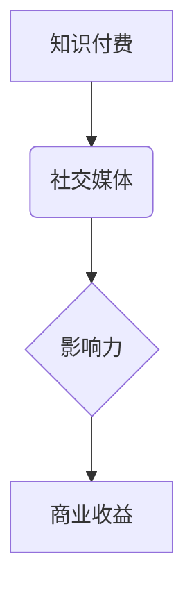

                 

## 程序员如何利用社交媒体扩大知识付费影响力

> 关键词：知识付费、程序员、社交媒体、影响力、内容营销、社区建设、品牌建设

## 1. 背景介绍

在当今数字化时代，知识付费已成为一种蓬勃发展的商业模式。程序员作为技术领域的重要力量，拥有丰富的专业知识和经验，具备成为知识付费领域的佼佼者潜力。然而，如何有效地利用社交媒体扩大知识付费影响力，并最终转化为商业收益，是许多程序员面临的挑战。

随着社交媒体平台的日益普及，程序员可以通过多种方式与潜在用户建立联系，分享专业知识，并最终促成付费交易。本文将深入探讨程序员如何利用社交媒体扩大知识付费影响力，并提供具体的策略和建议。

## 2. 核心概念与联系

### 2.1 知识付费

知识付费是指通过付费的方式获取知识、技能或服务的商业模式。它涵盖了各种形式的内容，例如在线课程、电子书、付费博客、咨询服务等。

### 2.2 社交媒体

社交媒体是指基于互联网，用户可以创建、分享和交互的内容平台。常见的社交媒体平台包括微博、微信、知乎、GitHub、Stack Overflow 等。

### 2.3 影响力

影响力是指在特定领域或群体中，个人或品牌能够对他人观点、行为或决策产生影响的能力。

**核心概念关系图:**



## 3. 核心算法原理 & 具体操作步骤

### 3.1 算法原理概述

扩大知识付费影响力本质上是一个内容营销和社区建设的过程。

* **内容营销:** 通过创作高质量、有价值的内容吸引目标用户，建立信任关系，并最终促成付费交易。
* **社区建设:** 构建一个活跃的社区，让用户可以互相交流、学习和分享，从而增强用户粘性和忠诚度。

### 3.2 算法步骤详解

1. **确定目标用户:** 首先要明确自己的目标用户是谁，他们的兴趣、需求和痛点是什么。
2. **创作优质内容:** 根据目标用户的需求，创作高质量、有价值的内容，例如技术博客文章、视频教程、在线课程等。
3. **选择合适的社交媒体平台:** 根据目标用户的特点，选择合适的社交媒体平台进行内容发布和推广。
4. **建立个人品牌:** 通过持续发布优质内容，积极参与社区讨论，建立个人品牌形象，提升用户信任度。
5. **推广和引流:** 利用社交媒体平台的推广工具，例如付费广告、KOL 合作等，扩大内容的传播范围。
6. **转化为付费用户:** 通过引导用户访问付费内容页面，提供优惠活动等方式，最终转化为付费用户。

### 3.3 算法优缺点

**优点:**

* 成本相对较低
* 覆盖面广
* 互动性强

**缺点:**

* 需要持续投入时间和精力
* 竞争激烈
* 难以精准定位目标用户

### 3.4 算法应用领域

* 技术博客
* 在线课程平台
* 软件开发工具
* 技术咨询服务

## 4. 数学模型和公式 & 详细讲解 & 举例说明

### 4.1 数学模型构建

我们可以用一个简单的数学模型来描述知识付费的影响力增长过程：

```latex
I(t) = I_0 * e^{kt}
```

其中：

* $I(t)$ 表示在时间 $t$ 时刻的影响力
* $I_0$ 表示初始影响力
* $k$ 表示影响力增长率
* $t$ 表示时间

### 4.2 公式推导过程

该模型基于指数增长规律，假设影响力增长率 $k$ 是一个常数。

### 4.3 案例分析与讲解

假设一个程序员在社交媒体平台上发布了一篇技术博客文章，初始影响力为 100 人。如果该文章质量较高，能够吸引用户分享和讨论，那么影响力增长率 $k$ 可能为 0.1，这意味着每天影响力会增长 10%。

根据公式，我们可以计算出该文章在 10 天后的影响力：

```latex
I(10) = 100 * e^{0.1 * 10} \approx 271.83 人
```

可见，通过持续创作优质内容，积极参与社区互动，程序员可以有效地扩大知识付费影响力。

## 5. 项目实践：代码实例和详细解释说明

### 5.1 开发环境搭建

* 操作系统：Windows/macOS/Linux
* 代码编辑器：VS Code/Sublime Text/Atom
* 编程语言：Python/JavaScript

### 5.2 源代码详细实现

以下是一个使用 Python 语言实现的简单社交媒体内容发布脚本示例：

```python
import requests

def publish_content(platform, content):
  """
  发布内容到指定社交媒体平台

  Args:
    platform: 社交媒体平台名称，例如 "微博"、"微信"、"知乎"
    content: 要发布的内容

  Returns:
    发布结果
  """
  if platform == "微博":
    # 使用微博 API 发布内容
    # ...
  elif platform == "微信":
    # 使用微信 API 发布内容
    # ...
  elif platform == "知乎":
    # 使用知乎 API 发布内容
    # ...
  else:
    return "不支持的平台"

# 示例用法
content = "今天学习了新的 Python 技巧，感觉很不错！"
publish_content("微博", content)
```

### 5.3 代码解读与分析

该脚本定义了一个 `publish_content` 函数，用于根据指定的平台名称发布内容。

* 函数参数 `platform` 指定要发布内容的社交媒体平台。
* 函数参数 `content` 指定要发布的内容。
* 函数内部根据不同的平台名称，调用相应的 API 发布内容。

### 5.4 运行结果展示

运行该脚本后，将根据指定的平台名称，将内容发布到相应的社交媒体平台。

## 6. 实际应用场景

### 6.1 技术博客

程序员可以通过技术博客分享自己的编程经验、学习心得和项目案例，吸引读者关注，并最终转化为付费用户。

### 6.2 在线课程平台

程序员可以利用自己的专业知识，录制在线课程，教授编程语言、框架、工具等知识，并通过在线课程平台进行销售。

### 6.3 软件开发工具

程序员可以开发自己的软件开发工具，并通过社交媒体平台进行推广，吸引用户付费使用。

### 6.4 未来应用展望

随着人工智能、大数据等技术的不断发展，知识付费领域将迎来更大的发展机遇。程序员可以利用这些技术，开发更智能、更个性化的知识付费产品，满足用户日益增长的需求。

## 7. 工具和资源推荐

### 7.1 学习资源推荐

* **书籍:** 《程序员的自我修养》、《代码的艺术》
* **网站:** CSDN、知乎、Stack Overflow
* **课程:** Coursera、Udemy、edX

### 7.2 开发工具推荐

* **代码编辑器:** VS Code、Sublime Text、Atom
* **版本控制系统:** Git
* **社交媒体管理工具:** Hootsuite、Buffer

### 7.3 相关论文推荐

* **社交媒体营销:** "The Impact of Social Media Marketing on Brand Awareness and Customer Engagement"
* **知识付费:** "The Rise of Knowledge Sharing and the Future of Education"

## 8. 总结：未来发展趋势与挑战

### 8.1 研究成果总结

本文探讨了程序员如何利用社交媒体扩大知识付费影响力，并提出了具体的策略和建议。

### 8.2 未来发展趋势

* **个性化内容:** 知识付费产品将更加注重个性化，根据用户的需求和学习习惯提供定制化的内容。
* **互动式学习:** 知识付费将更加注重互动，例如直播课程、在线答疑、社区讨论等，提高用户参与度和学习效果。
* **人工智能应用:** 人工智能将被广泛应用于知识付费领域，例如内容推荐、智能答疑、个性化学习路径等。

### 8.3 面临的挑战

* **内容质量:** 知识付费市场竞争激烈，需要不断创作高质量、有价值的内容，才能吸引用户关注。
* **用户信任:** 用户对知识付费产品的信任度仍然较低，需要通过持续的优质服务和口碑传播，建立用户信任。
* **商业模式创新:** 知识付费的商业模式还需要不断创新，探索新的盈利模式，才能实现可持续发展。

### 8.4 研究展望

未来，我们将继续关注知识付费领域的最新发展趋势，并深入研究如何利用社交媒体、人工智能等技术，帮助程序员更好地扩大知识付费影响力，实现商业成功。

## 9. 附录：常见问题与解答

### 9.1 如何提高内容的吸引力？

* 使用简洁明了的语言，避免使用过于专业的术语。
* 添加图片、视频、图表等多媒体元素，增强内容的可读性和趣味性。
* 结合自身经验和案例，让内容更加生动和实用。

### 9.2 如何建立个人品牌？

* 坚持创作优质内容，展现自己的专业能力和价值观。
* 积极参与社区讨论，与用户互动交流，建立信任关系。
* 利用社交媒体平台推广自己的内容和品牌，扩大影响力。

### 9.3 如何转化为付费用户？

* 提供免费试用或优惠活动，吸引用户体验付费内容。
* 针对不同用户群体，提供不同类型的付费内容，满足多样化需求。
* 建立良好的用户服务体系，及时解决用户问题，提升用户满意度。


作者：禅与计算机程序设计艺术 / Zen and the Art of Computer Programming 
<end_of_turn>

