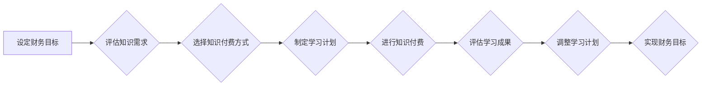

                 

## 程序员如何进行知识付费的财务规划

> 关键词：知识付费、程序员、财务规划、投资理财、税务规划、风险管理、长期收益

## 1. 背景介绍

随着互联网的蓬勃发展和科技行业的快速迭代，程序员的需求量持续增长，也使得程序员的知识付费市场日益火热。从在线课程、书籍、博客到线下培训，各种形式的知识付费内容层出不穷，为程序员提供了丰富的学习资源。然而，对于许多程序员来说，如何合理规划知识付费的支出，将学习收益最大化，并将其转化为长期的财务回报，仍然是一个值得思考的问题。

本篇文章将从程序员的知识付费现状、核心概念、算法原理、数学模型、项目实践、实际应用场景、工具资源推荐、未来发展趋势等多个方面进行深入探讨，帮助程序员建立科学合理的知识付费财务规划体系。

## 2. 核心概念与联系

**2.1 知识付费的核心概念**

知识付费是指通过提供有价值的知识和技能，向用户收取费用的一种商业模式。对于程序员而言，知识付费主要体现在以下几个方面：

* **在线课程:** 提供编程语言、框架、算法、设计模式等方面的线上课程，通过视频、文档、练习题等形式进行教学。
* **书籍:** 出版编程相关的书籍，涵盖基础知识、进阶技巧、实战案例等内容。
* **博客:** 通过博客文章分享编程经验、技术 insights、项目案例等，吸引读者并提供付费订阅服务。
* **线下培训:** 组织线下培训班，邀请行业专家进行授课，提供面对面交流和实践操作的机会。

**2.2 知识付费与财务规划的联系**

知识付费与财务规划之间的联系在于，知识付费可以帮助程序员提升技能、增加收入，从而实现财务目标。

* **提升技能:** 通过学习新的技术和知识，程序员可以提高自身竞争力，获得更高的薪资待遇。
* **增加收入:** 程序员可以通过知识付费平台分享自己的经验和技能，获得额外收入。
* **投资理财:** 程序员可以通过学习理财知识，合理规划自己的财务，实现财富增值。

**2.3 知识付费财务规划流程图**



## 3. 核心算法原理 & 具体操作步骤

**3.1 算法原理概述**

知识付费财务规划的核心算法原理是基于目标设定、资源分配、风险管理和收益评估的动态优化模型。

* **目标设定:** 程序员需要明确自己的财务目标，例如提高收入、积累财富、实现财务自由等。
* **资源分配:** 程序员需要根据自己的收入、支出、风险承受能力等因素，合理分配知识付费的预算。
* **风险管理:** 程序员需要了解知识付费的风险，例如课程质量、平台信誉、市场变化等，并采取相应的风险管理措施。
* **收益评估:** 程序员需要定期评估知识付费的收益，例如技能提升、收入增长、财富积累等，并根据评估结果调整学习计划。

**3.2 算法步骤详解**

1. **设定财务目标:** 程序员需要明确自己的财务目标，并将其分解为具体的、可衡量的、可实现的、相关的和有时间限制的目标。
2. **评估知识需求:** 程序员需要根据自己的职业发展规划、市场需求和个人兴趣，评估自己需要学习的知识和技能。
3. **选择知识付费方式:** 程序员可以根据自己的学习习惯、预算和时间安排，选择适合自己的知识付费方式，例如在线课程、书籍、博客等。
4. **制定学习计划:** 程序员需要制定详细的学习计划，包括学习内容、学习时间、学习方法等，并将其分解为具体的学习任务。
5. **进行知识付费:** 程序员需要选择合适的知识付费平台，并支付相应的费用。
6. **评估学习成果:** 程序员需要定期评估自己的学习成果，例如掌握了哪些知识和技能、是否提升了工作效率、是否获得了更高的薪资待遇等。
7. **调整学习计划:** 根据学习成果的评估结果，程序员需要调整自己的学习计划，例如增加学习时间、更换学习方式、选择新的学习内容等。

**3.3 算法优缺点**

* **优点:** 
    * 能够帮助程序员制定科学合理的知识付费计划，最大化学习收益。
    * 能够帮助程序员根据自身情况调整学习计划，提高学习效率。
    * 能够帮助程序员评估知识付费的风险，降低投资损失。
* **缺点:** 
    * 需要程序员投入一定的精力和时间进行规划和评估。
    * 算法模型的准确性取决于输入数据的质量和算法参数的设置。

**3.4 算法应用领域**

* **个人知识付费财务规划:** 程序员可以利用该算法模型，制定自己的知识付费计划，实现财务目标。
* **教育机构知识付费产品开发:** 教育机构可以利用该算法模型，开发更符合用户需求的知识付费产品。
* **知识付费平台运营:** 知识付费平台可以利用该算法模型，优化平台运营策略，提高用户粘性和转化率。

## 4. 数学模型和公式 & 详细讲解 & 举例说明

**4.1 数学模型构建**

知识付费财务规划的数学模型可以构建为一个动态优化模型，其目标是最大化知识付费的长期收益，同时考虑风险和成本因素。

**4.2 公式推导过程**

* **收益函数:**  $R(t) = f(S(t), I(t), C(t))$
    * $R(t)$:  t时刻的知识付费收益
    * $S(t)$:  t时刻掌握的知识技能水平
    * $I(t)$:  t时刻的收入水平
    * $C(t)$:  t时刻的知识付费成本
* **风险函数:** $V(t) = g(S(t), I(t), C(t))$
    * $V(t)$:  t时刻的知识付费风险
* **成本函数:** $K(t) = h(S(t), I(t), C(t))$
    * $K(t)$:  t时刻的知识付费成本

**4.3 案例分析与讲解**

假设程序员A想要学习人工智能技术，并将其应用到工作中，从而提高收入。

* **收益函数:**  A学习人工智能技术后，可以获得更高的薪资待遇，因此 $R(t)$ 与 $S(t)$ 正相关。
* **风险函数:**  A学习人工智能技术需要投入时间和金钱，存在学习效果不佳、市场需求变化等风险，因此 $V(t)$ 与 $C(t)$ 正相关。
* **成本函数:**  A学习人工智能技术需要购买课程、参加培训等，因此 $K(t)$ 与 $C(t)$ 正相关。

程序员A需要根据自己的风险承受能力、时间安排和预算，选择合适的学习方式和学习内容，最大化知识付费的收益，同时控制风险和成本。

## 5. 项目实践：代码实例和详细解释说明

**5.1 开发环境搭建**

* 操作系统: Windows/macOS/Linux
* 编程语言: Python
* 开发工具: Jupyter Notebook/VS Code

**5.2 源代码详细实现**

```python
# 知识付费财务规划模型
class KnowledgePay:
    def __init__(self, target_income, risk_tolerance, budget):
        self.target_income = target_income
        self.risk_tolerance = risk_tolerance
        self.budget = budget
        self.current_income = 0
        self.skills = {}

    def evaluate_skills(self, skill_name, skill_level):
        # 评估技能水平对收入的影响
        # ...

    def choose_learning_path(self):
        # 根据目标收入、风险承受能力和预算，选择合适的学习路径
        # ...

    def calculate_return_on_investment(self):
        # 计算知识付费的投资回报率
        # ...

    def optimize_learning_plan(self):
        # 动态优化学习计划，最大化收益，控制风险和成本
        # ...

# 实例化知识付费对象
planner = KnowledgePay(target_income=100000, risk_tolerance=0.5, budget=5000)

# ...
```

**5.3 代码解读与分析**

* `KnowledgePay` 类代表一个知识付费财务规划模型，包含目标收入、风险承受能力、预算等属性。
* `evaluate_skills` 方法评估技能水平对收入的影响。
* `choose_learning_path` 方法根据目标收入、风险承受能力和预算，选择合适的学习路径。
* `calculate_return_on_investment` 方法计算知识付费的投资回报率。
* `optimize_learning_plan` 方法动态优化学习计划，最大化收益，控制风险和成本。

**5.4 运行结果展示**

运行代码后，程序将根据输入的参数，输出一个优化后的学习计划，包括学习内容、学习时间、学习方式等。

## 6. 实际应用场景

**6.1 程序员个人知识付费**

程序员可以利用知识付费财务规划模型，制定自己的学习计划，选择合适的学习方式，并评估学习成果，从而实现职业发展目标。

**6.2 教育机构知识付费产品开发**

教育机构可以利用知识付费财务规划模型，开发更符合用户需求的知识付费产品，例如针对不同职业方向、不同技能水平的课程，以及个性化的学习方案。

**6.3 知识付费平台运营**

知识付费平台可以利用知识付费财务规划模型，优化平台运营策略，例如推荐更合适的学习资源，提供更个性化的学习体验，并提高用户粘性和转化率。

**6.4 未来应用展望**

随着人工智能技术的不断发展，知识付费财务规划模型将更加智能化、个性化，能够更好地帮助程序员实现财务目标。

## 7. 工具和资源推荐

**7.1 学习资源推荐**

* **在线课程平台:** Coursera, Udemy, edX, Udacity
* **编程书籍:** 《Python编程从入门到实践》、《算法导论》、《设计模式》
* **技术博客:** Hacker News, Stack Overflow, Medium

**7.2 开发工具推荐**

* **代码编辑器:** VS Code, Sublime Text, Atom
* **版本控制系统:** Git, GitHub
* **项目管理工具:** Trello, Jira

**7.3 相关论文推荐**

* **知识付费市场研究:** 《知识付费市场发展趋势分析》
* **知识付费财务规划模型:** 《基于机器学习的知识付费财务规划模型》

## 8. 总结：未来发展趋势与挑战

**8.1 研究成果总结**

本篇文章探讨了程序员知识付费的财务规划，从核心概念、算法原理、数学模型、项目实践等多个方面进行了深入分析。

**8.2 未来发展趋势**

* **个性化定制:** 知识付费平台将更加注重用户个性化需求，提供定制化的学习方案。
* **人工智能驱动:** 人工智能技术将被应用于知识付费平台的运营，例如智能推荐、个性化学习路径规划等。
* **元宇宙融合:** 元宇宙技术将与知识付费相结合，提供更加沉浸式的学习体验。

**8.3 面临的挑战**

* **知识质量控制:** 知识付费市场存在知识质量参差不齐的问题，需要加强知识质量监管。
* **用户隐私保护:** 知识付费平台需要加强用户隐私保护，避免数据泄露和滥用。
* **知识付费模式创新:** 需要不断探索新的知识付费模式，满足用户多样化的需求。

**8.4 研究展望**

未来，我们将继续研究知识付费财务规划模型，探索更智能、更个性化的知识付费解决方案，帮助程序员实现财务自由。

## 9. 附录：常见问题与解答

**9.1 如何选择合适的知识付费平台？**

选择知识付费平台时，需要考虑平台的信誉、课程质量、用户评价、价格等因素。

**9.2 如何评估知识付费的收益？**

评估知识付费的收益需要考虑技能提升、收入增长、财富积累等因素。

**9.3 如何控制知识付费的风险？**

控制知识付费的风险需要选择信誉良好的平台、评估课程质量、合理分配预算等。


作者：禅与计算机程序设计艺术 / Zen and the Art of Computer Programming 
<end_of_turn>

