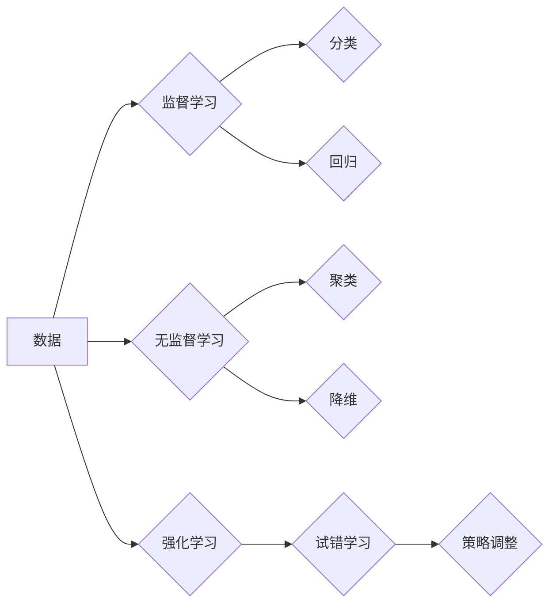

                 

## 第三章：机器学习算法和技术

> 关键词：机器学习、监督学习、无监督学习、深度学习、神经网络、算法原理、数学模型、项目实践、应用场景

### 1. 背景介绍

机器学习作为人工智能领域的核心技术之一，近年来发展迅速，并在各个领域取得了令人瞩目的成就。从语音识别、图像识别到自然语言处理、推荐系统，机器学习算法无处不在，深刻地改变着我们的生活方式。

机器学习的核心思想是通过算法学习数据中的模式和规律，从而能够对新的数据进行预测或分类。与传统编程方法不同，机器学习算法不需要明确的程序指令，而是通过大量的训练数据来学习和改进。

随着数据量的爆炸式增长和计算能力的提升，机器学习技术正迎来前所未有的发展机遇。

### 2. 核心概念与联系

机器学习可以分为监督学习、无监督学习和强化学习三大类。

**监督学习**

* **定义:**  利用标记数据训练模型，预测输出结果。
* **特点:** 需要明确的输入输出对，模型学习数据的映射关系。
* **应用场景:** 分类、回归、预测等。

**无监督学习**

* **定义:**  利用未标记数据训练模型，发现数据的内在结构和规律。
* **特点:** 不需要明确的输入输出对，模型学习数据的相似性、聚类等特征。
* **应用场景:** 聚类、降维、异常检测等。

**强化学习**

* **定义:**  通过试错学习，在环境中采取行动以获得最大奖励。
* **特点:** 模型通过与环境交互学习，不断调整策略以获得最佳结果。
* **应用场景:** 游戏、机器人控制、自动驾驶等。

**Mermaid 流程图**



### 3. 核心算法原理 & 具体操作步骤

#### 3.1  算法原理概述

本节将详细介绍监督学习中的**线性回归**算法原理。

线性回归是一种用于预测连续数值的监督学习算法。其核心思想是找到一条直线或超平面，使得预测值与真实值之间的误差最小化。

#### 3.2  算法步骤详解

1. **数据准备:** 收集并预处理训练数据，将特征和目标变量进行编码和转换。
2. **模型初始化:**  随机初始化模型参数，例如直线的斜率和截距。
3. **损失函数计算:**  使用损失函数衡量预测值与真实值之间的误差，例如均方误差。
4. **梯度下降优化:**  使用梯度下降算法更新模型参数，使得损失函数最小化。
5. **模型评估:**  使用测试数据评估模型的性能，例如计算均方根误差 (RMSE)。
6. **模型调参:**  根据评估结果调整模型参数，例如学习率和正则化参数，以提高模型性能。

#### 3.3  算法优缺点

**优点:**

* 算法简单易懂，易于实现。
* 计算效率高，适合处理大规模数据。
* 可解释性强，可以直观地理解模型的决策边界。

**缺点:**

* 只能处理线性关系的数据。
* 对异常值敏感，容易受到噪声的影响。
* 无法处理高维数据。

#### 3.4  算法应用领域

线性回归广泛应用于以下领域:

* 房价预测
* 股票价格预测
* 销售预测
* 医疗诊断
* 自然语言处理

### 4. 数学模型和公式 & 详细讲解 & 举例说明

#### 4.1  数学模型构建

线性回归模型可以表示为：

$$y = w_0 + w_1x_1 + w_2x_2 + ... + w_nx_n + \epsilon$$

其中：

* $y$ 是目标变量
* $x_1, x_2, ..., x_n$ 是特征变量
* $w_0, w_1, w_2, ..., w_n$ 是模型参数
* $\epsilon$ 是误差项

#### 4.2  公式推导过程

目标是找到最优的模型参数，使得损失函数最小化。常用的损失函数是均方误差 (MSE)：

$$MSE = \frac{1}{n}\sum_{i=1}^{n}(y_i - \hat{y}_i)^2$$

其中：

* $n$ 是样本数量
* $y_i$ 是第 $i$ 个样本的真实值
* $\hat{y}_i$ 是第 $i$ 个样本的预测值

使用梯度下降算法更新模型参数：

$$w_j = w_j - \alpha \frac{\partial MSE}{\partial w_j}$$

其中：

* $\alpha$ 是学习率

#### 4.3  案例分析与讲解

假设我们想要预测房屋价格，特征变量包括房屋面积、房间数量、地理位置等。

我们可以使用线性回归模型训练一个预测模型，输入房屋特征，输出预测价格。

通过训练数据，模型会学习到房屋价格与特征变量之间的关系，并找到最优的模型参数。

### 5. 项目实践：代码实例和详细解释说明

#### 5.1  开发环境搭建

本项目使用 Python 语言和 Scikit-learn 库进行开发。

需要安装 Python 和 Scikit-learn 库。

#### 5.2  源代码详细实现

```python
import pandas as pd
from sklearn.linear_model import LinearRegression
from sklearn.model_selection import train_test_split
from sklearn.metrics import mean_squared_error

# 加载数据
data = pd.read_csv('house_price.csv')

# 选择特征和目标变量
X = data[['area', 'rooms', 'location']]
y = data['price']

# 将数据分成训练集和测试集
X_train, X_test, y_train, y_test = train_test_split(X, y, test_size=0.2, random_state=42)

# 创建线性回归模型
model = LinearRegression()

# 训练模型
model.fit(X_train, y_train)

# 预测测试集数据
y_pred = model.predict(X_test)

# 计算均方根误差
rmse = mean_squared_error(y_test, y_pred, squared=False)

# 打印结果
print('均方根误差:', rmse)
```

#### 5.3  代码解读与分析

1. 导入必要的库。
2. 加载数据，选择特征和目标变量。
3. 将数据分成训练集和测试集。
4. 创建线性回归模型。
5. 训练模型，使用训练数据学习模型参数。
6. 使用训练好的模型预测测试集数据。
7. 计算模型性能，例如均方根误差。

#### 5.4  运行结果展示

运行代码后，会输出模型的均方根误差值。

### 6. 实际应用场景

#### 6.1  金融领域

* 股票价格预测
* 贷款风险评估
* 欺诈检测

#### 6.2  医疗领域

* 疾病诊断
* 药物研发
* 患者风险预测

#### 6.3  电商领域

* 商品推荐
* 销售预测
* 客户画像

#### 6.4  未来应用展望

随着机器学习技术的不断发展，其应用场景将更加广泛，例如：

* 自动驾驶
* 人工智能助手
* 个性化教育

### 7. 工具和资源推荐

#### 7.1  学习资源推荐

* **书籍:**
    * 《机器学习》 - 周志华
    * 《深入理解机器学习》 -  李航
* **在线课程:**
    * Coursera: Machine Learning by Andrew Ng
    * edX: Artificial Intelligence by Columbia University

#### 7.2  开发工具推荐

* **Python:** 
    * Scikit-learn
    * TensorFlow
    * PyTorch

* **其他工具:**
    * Jupyter Notebook
    * Git

#### 7.3  相关论文推荐

* **《机器学习》** - 周志华
* **《深入理解机器学习》** - 李航

### 8. 总结：未来发展趋势与挑战

#### 8.1  研究成果总结

机器学习算法取得了显著的成果，在各个领域取得了广泛应用。

#### 8.2  未来发展趋势

* **深度学习:** 深度神经网络在图像识别、自然语言处理等领域取得了突破性进展。
* **迁移学习:** 利用已训练好的模型，快速适应新的任务和数据。
* **联邦学习:** 在不共享原始数据的情况下，训练模型。

#### 8.3  面临的挑战

* **数据质量:** 机器学习算法对数据质量要求很高，数据噪声和偏差会影响模型性能。
* **模型解释性:** 许多深度学习模型难以解释，其决策过程难以理解。
* **伦理问题:** 机器学习算法可能存在偏见和歧视，需要关注其伦理问题。

#### 8.4  研究展望

未来机器学习研究将更加注重：

* **可解释性:** 开发更可解释的机器学习模型。
* **鲁棒性:** 提高机器学习模型对噪声和异常值鲁棒性。
* **公平性:** 确保机器学习算法公平公正。

### 9. 附录：常见问题与解答

#### 9.1  Q1: 什么是机器学习？

**A1:** 机器学习是一种人工智能技术，通过算法学习数据中的模式和规律，从而能够对新的数据进行预测或分类。

#### 9.2  Q2: 机器学习有哪些类型？

**A2:** 机器学习主要分为监督学习、无监督学习和强化学习三大类。

#### 9.3  Q3: 线性回归算法有什么特点？

**A3:** 线性回归算法简单易懂，计算效率高，可解释性强，但只能处理线性关系的数据。


作者：禅与计算机程序设计艺术 / Zen and the Art of Computer Programming 
<end_of_turn>

