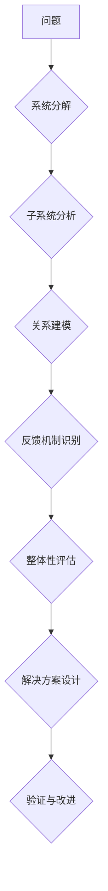

                 

## 系统思考与问题解决能力

> 关键词：系统思考、问题解决、复杂系统、算法、模型、实践、应用场景

## 1. 背景介绍

在当今科技日新月异的时代，面对日益复杂的系统和问题，单纯的局部思考已经无法满足需求。系统思考是一种全新的思维方式，它强调理解系统整体结构、相互作用和反馈机制，从而有效解决复杂问题。对于IT领域而言，系统思考尤为重要，因为它能够帮助我们构建更健壮、高效、可持续的软件系统和解决方案。

传统的编程思维往往局限于代码的局部实现，而忽略了系统整体的运作和潜在问题。随着软件系统规模和复杂度的不断增加，这种局部思考模式面临着越来越大的挑战。系统思考则提供了一种更全面的视角，帮助我们从宏观层面理解系统，识别关键要素和潜在风险，从而设计更合理的解决方案。

## 2. 核心概念与联系

系统思考的核心概念包括：

* **系统：** 由相互关联的子系统和元素组成，这些元素之间存在着相互作用和反馈关系。
* **边界：** 系统与外部环境的分界线，定义了系统所包含的要素和与外部环境的交互方式。
* **反馈机制：** 系统内部或外部的信号，导致系统状态发生变化，并影响未来的行为。
* **循环因果关系：** 系统中各个要素之间存在着相互影响、相互制约的循环因果关系，而非简单的线性关系。
* **整体性：** 系统的整体特性不能仅仅通过子系统的简单叠加来理解，而是由子系统之间的相互作用和整体结构决定的。

**Mermaid 流程图：**



## 3. 核心算法原理 & 具体操作步骤

系统思考的核心算法并非单一的算法，而是基于系统分析和建模的思维过程。

### 3.1  算法原理概述

系统思考的算法原理主要包括：

* **系统分解：** 将复杂问题分解成更小的、可管理的子系统，以便更深入地分析和理解。
* **子系统分析：** 对每个子系统进行深入分析，识别其功能、结构、边界和与其他子系统的交互关系。
* **关系建模：** 建立系统中各个子系统之间的关系模型，包括数据流、控制流和逻辑关系。
* **反馈机制识别：** 识别系统内部和外部的反馈机制，分析其对系统行为的影响。
* **整体性评估：** 从整体角度评估系统结构和功能，识别潜在的风险和问题。

### 3.2  算法步骤详解

系统思考的算法步骤可以概括为以下几个阶段：

1. **问题定义：** 明确问题目标和范围，并将其分解成更小的子问题。
2. **系统建模：** 使用图表、流程图等工具，构建系统结构和功能的模型。
3. **数据收集：** 收集有关系统运行的数据，包括输入、输出、状态和行为等信息。
4. **分析与评估：** 分析系统模型和数据，识别关键要素、反馈机制和潜在问题。
5. **解决方案设计：** 基于系统分析结果，设计合理的解决方案，并评估其可行性和有效性。
6. **验证与改进：** 通过测试和迭代，验证解决方案的有效性，并根据实际情况进行改进。

### 3.3  算法优缺点

**优点：**

* **全面的视角：** 能够从整体角度理解系统，识别潜在问题和风险。
* **有效的解决复杂问题：** 能够帮助我们分解复杂问题，并设计更合理的解决方案。
* **促进协作：** 系统思考的思维方式能够促进团队成员之间的协作和沟通。

**缺点：**

* **需要时间和精力：** 系统思考需要花费较多的时间和精力进行分析和建模。
* **需要专业知识：** 系统思考的应用需要一定的专业知识和经验。
* **难以量化：** 系统思考的成果难以量化，评估其有效性也较为困难。

### 3.4  算法应用领域

系统思考的应用领域非常广泛，包括：

* **软件开发：** 设计更健壮、高效、可持续的软件系统。
* **项目管理：** 更好地管理复杂项目，识别潜在风险并制定应对措施。
* **业务流程优化：** 优化业务流程，提高效率和效益。
* **决策支持：** 提供更全面的决策依据，帮助企业做出更明智的决策。

## 4. 数学模型和公式 & 详细讲解 & 举例说明

系统思考中常用的数学模型和公式主要用于描述系统行为和反馈机制。

### 4.1  数学模型构建

常见的系统数学模型包括：

* **差分方程：** 描述系统状态随时间的变化规律。
* **微分方程：** 描述系统状态变化率随时间和状态的变化规律。
* **状态转移图：** 描述系统状态之间的转换关系。
* **网络模型：** 描述系统中各个要素之间的相互连接关系。

### 4.2  公式推导过程

例如，我们可以使用差分方程来描述一个简单的系统，其中系统状态 $x(t)$ 随时间 $t$ 的变化规律由以下公式决定：

$$
\frac{dx(t)}{dt} = f(x(t), u(t))
$$

其中，$f(x(t), u(t))$ 是系统函数，描述了系统状态和输入 $u(t)$ 对系统状态变化率的影响。

### 4.3  案例分析与讲解

例如，我们可以使用微分方程来描述一个温度控制系统，其中系统状态 $T(t)$ 是温度，输入 $u(t)$ 是加热功率，系统函数 $f(T(t), u(t))$ 描述了温度变化率与温度和加热功率的关系。

## 5. 项目实践：代码实例和详细解释说明

为了更好地理解系统思考的应用，我们可以通过一个实际项目来进行实践。

### 5.1  开发环境搭建

我们可以使用 Python 语言和相关库来实现一个简单的系统模拟项目。

### 5.2  源代码详细实现

```python
import numpy as np
import matplotlib.pyplot as plt

# 系统函数
def system_function(T, u):
    return k * (T_setpoint - T) + u

# 参数设置
k = 0.1  # 控制系数
T_setpoint = 25  # 设置温度
T0 = 20  # 初始温度
dt = 0.1  # 时间步长
t_end = 10  # 模拟时间

# 时间序列
t = np.arange(0, t_end, dt)

# 初始化温度
T = np.zeros_like(t)
T[0] = T0

# 模拟系统
for i in range(1, len(t)):
    u = 10  # 输入加热功率
    T[i] = T[i - 1] + dt * system_function(T[i - 1], u)

# 绘制温度曲线
plt.plot(t, T)
plt.xlabel("时间 (s)")
plt.ylabel("温度 (°C)")
plt.title("温度控制系统模拟")
plt.show()
```

### 5.3  代码解读与分析

这段代码模拟了一个简单的温度控制系统，其中温度随时间变化的规律由差分方程描述。

* `system_function()` 函数描述了温度变化率与温度和加热功率的关系。
* `k` 是控制系数，决定了系统响应速度。
* `T_setpoint` 是设置温度，系统试图将温度保持在该值附近。
* `T0` 是初始温度。
* `dt` 是时间步长，决定了模拟的精度。
* `t_end` 是模拟时间。

### 5.4  运行结果展示

运行这段代码后，会生成一个温度随时间的曲线图，展示了系统如何根据输入加热功率和控制系数，将温度稳定在设置温度附近。

## 6. 实际应用场景

系统思考在实际应用场景中具有广泛的应用价值。

### 6.1  软件开发

在软件开发中，系统思考可以帮助我们：

* **设计更健壮的软件系统：** 通过识别系统中的潜在风险和问题，我们可以设计更健壮、更可靠的软件系统。
* **提高软件开发效率：** 通过分解复杂问题，我们可以更有效地管理软件开发项目，提高开发效率。
* **促进团队协作：** 系统思考的思维方式能够促进团队成员之间的协作和沟通，提高团队效率。

### 6.2  项目管理

在项目管理中，系统思考可以帮助我们：

* **更好地管理复杂项目：** 通过识别项目中的关键要素和风险，我们可以制定更有效的项目计划和风险应对措施。
* **提高项目成功率：** 通过系统思考，我们可以更全面地评估项目风险，并采取措施降低风险，从而提高项目成功率。
* **促进项目团队协作：** 系统思考的思维方式能够促进项目团队成员之间的协作和沟通，提高团队效率。

### 6.3  业务流程优化

在业务流程优化中，系统思考可以帮助我们：

* **识别业务流程中的瓶颈：** 通过分析业务流程的各个环节，我们可以识别流程中的瓶颈，并制定改进措施。
* **提高业务流程效率：** 通过优化业务流程，我们可以提高效率，降低成本，提高客户满意度。
* **促进业务创新：** 系统思考的思维方式能够帮助我们从更全面的角度看待业务，从而促进业务创新。

### 6.4  未来应用展望

随着科技的不断发展，系统思考在未来将有更广泛的应用场景。例如，在人工智能、物联网、大数据等领域，系统思考将帮助我们更好地理解和应对复杂系统带来的挑战。

## 7. 工具和资源推荐

### 7.1  学习资源推荐

* **书籍：**
    * 《系统思考》 - Peter Senge
    * 《第五项修炼》 - Jim Collins
    * 《复杂系统》 - Melanie Mitchell
* **在线课程：**
    * Coursera: Systems Thinking
    * edX: Systems Thinking for Complex Problems
    * MIT OpenCourseWare: Introduction to Systems Thinking

### 7.2  开发工具推荐

* **UML工具：**
    * Lucidchart
    * Draw.io
    * Enterprise Architect
* **流程建模工具：**
    * BPMN.io
    * Signavio
    * Camunda Modeler

### 7.3  相关论文推荐

* **The Fifth Discipline: The Art and Practice of the Learning Organization** - Peter Senge
* **Thinking in Systems: A Primer** - Donella Meadows
* **Complexity: A Guided Tour** - Melanie Mitchell

## 8. 总结：未来发展趋势与挑战

### 8.1  研究成果总结

系统思考已经取得了显著的成果，并在多个领域得到了广泛应用。它为我们理解和解决复杂问题提供了新的视角和方法。

### 8.2  未来发展趋势

未来，系统思考的研究将朝着以下几个方向发展：

* **更加深入的理论研究：** 探索系统思考的更深层次理论基础，并将其应用于更复杂的问题领域。
* **更加智能化的工具开发：** 开发更加智能化的系统思考工具，能够自动识别系统结构和反馈机制，并提供更有效的解决方案。
* **更加广泛的应用场景：** 将系统思考应用于更多领域，例如人工智能、物联网、大数据等，帮助我们更好地应对复杂系统带来的挑战。

### 8.3  面临的挑战

系统思考也面临着一些挑战：

* **缺乏量化指标：** 系统思考的成果难以量化，评估其有效性也较为困难。
* **需要专业知识：** 系统思考的应用需要一定的专业知识和经验，这对于普通用户来说可能是一个门槛。
* **难以推广应用：** 将系统思考的理念推广到各个领域和组织中仍然面临着挑战。

### 8.4  研究展望

尽管面临着挑战，但系统思考仍然是一个非常重要的研究方向。未来，我们将继续努力，克服这些挑战，推动系统思考的发展，使其更好地服务于人类社会。

## 9. 附录：常见问题与解答

### 9.1  什么是系统思考？

系统思考是一种全新的思维方式，它强调理解系统整体结构、相互作用和反馈机制，从而有效解决复杂问题。

### 9.2  系统思考有什么用？

系统思考可以帮助我们：

* **设计更健壮的系统：** 通过识别系统中的潜在风险和问题，我们可以设计更健壮、更可靠的系统。
* **提高系统效率：** 通过优化系统结构和流程，我们可以提高系统效率，降低成本。
* **促进团队协作：** 系统思考的思维方式能够促进团队成员之间的协作和沟通，提高团队效率。

### 9.3  如何学习系统思考？

您可以通过以下方式学习系统思考：

* 阅读相关书籍和论文。
* 参加在线课程和线下培训。
* 参与实践项目，将系统思考的理念应用到实际工作中。

作者：禅与计算机程序设计艺术 / Zen and the Art of Computer Programming


<end_of_turn>

