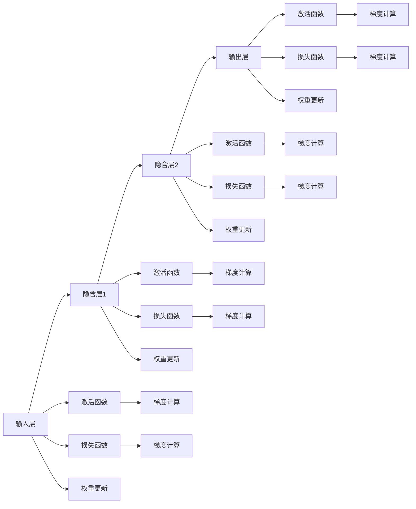

                 

## 1. 背景介绍

反向传播（Backpropagation）是深度学习中最基础、最重要的算法之一，它使我们能够通过反向计算梯度，从而更新神经网络中的权重。梯度是表示参数对损失函数贡献大小的矢量，通过反向传播算法，我们可以快速地计算出每个参数的梯度，并将其用于优化目标函数。

本文将详细介绍反向传播的原理、具体操作步骤、优缺点及应用领域，并通过数学模型、代码实现、实际应用等示例，深入浅出地解释梯度和权重更新的过程。

## 2. 核心概念与联系

### 2.1 核心概念概述

在深度学习中，反向传播算法的核心概念包括以下几个：

- 神经网络（Neural Network）：由多个层次组成的计算图，用于模拟人脑神经元之间的连接关系。每个层次包含多个神经元，每个神经元接收来自前一层的输入，并输出到后一层。
- 激活函数（Activation Function）：用于引入非线性因素，将神经元的输入映射到输出。常见的激活函数包括Sigmoid、ReLU、Tanh等。
- 损失函数（Loss Function）：用于衡量模型的预测与实际标签之间的差异，常用的损失函数包括交叉熵损失、均方误差损失等。
- 梯度（Gradient）：表示参数对损失函数贡献大小的矢量，用于指导参数更新方向。
- 权重（Weight）：神经网络中的参数，用于调整神经元之间的连接强度。

这些概念构成了反向传播算法的理论基础，下面将详细解释这些概念的原理和架构。

### 2.2 核心概念原理和架构的 Mermaid 流程图



## 3. 核心算法原理 & 具体操作步骤

### 3.1 算法原理概述

反向传播算法的核心思想是通过链式法则（Chain Rule）计算损失函数对每个参数的梯度，并根据梯度更新权重。具体步骤如下：

1. **前向传播**：将输入数据通过神经网络，计算出每个层的输出。
2. **计算损失函数**：将模型输出与实际标签进行比较，计算损失函数。
3. **反向传播**：从输出层开始，依次计算每个参数对损失函数的梯度。
4. **权重更新**：根据梯度更新每个参数的值。

### 3.2 算法步骤详解

**Step 1: 前向传播**
在神经网络中，输入层接收输入数据 $x$，通过多个隐含层计算输出 $y$。假设神经网络共有 $L$ 层，每层有 $n_i$ 个神经元，前向传播过程如下：

$$
h^{(l)} = \sigma(W^{(l)}h^{(l-1)} + b^{(l)}) \quad l=1,...,L
$$

其中 $h^{(l)}$ 表示第 $l$ 层的输出，$W^{(l)}$ 和 $b^{(l)}$ 分别表示第 $l$ 层的权重和偏置。

**Step 2: 计算损失函数**
根据模型输出 $y$ 与实际标签 $t$ 计算损失函数 $J$：

$$
J = \frac{1}{N}\sum_{i=1}^N \ell(y_i, t_i)
$$

其中 $\ell$ 表示损失函数的具体形式，如交叉熵损失。

**Step 3: 反向传播**
通过链式法则计算每个参数对损失函数的梯度，具体步骤如下：

$$
\frac{\partial J}{\partial b^{(L)}} = \frac{\partial \ell}{\partial y} \frac{\partial y}{\partial h^{(L)}} = \nabla_{y} \ell
$$

$$
\frac{\partial J}{\partial W^{(L)}} = \frac{\partial \ell}{\partial y} \frac{\partial y}{\partial h^{(L)}} \frac{\partial h^{(L)}}{\partial h^{(L-1)}} \frac{\partial h^{(L-1)}}{\partial h^{(L-2)}} ... \frac{\partial h^{(2)}}{\partial h^{(1)}} = \nabla_{y} \ell \frac{\partial h^{(L)}}{\partial h^{(L-1)}} = \nabla_{y} \ell h^{(L-1)} \cdot (W^{(L-1)})^T
$$

从输出层开始，依次计算每个层的梯度，并更新权重。

**Step 4: 权重更新**
根据梯度更新权重：

$$
W^{(l)} = W^{(l)} - \eta \frac{\partial J}{\partial W^{(l)}} \quad l=1,...,L
$$

其中 $\eta$ 表示学习率，控制参数更新的步长。

### 3.3 算法优缺点

反向传播算法具有以下优点：

- 高效：可以快速计算每个参数的梯度，并进行权重更新。
- 广泛适用：适用于各种深度神经网络，包括卷积神经网络（CNN）、循环神经网络（RNN）等。
- 鲁棒性：对模型结构变化不敏感，能够适应各种模型结构。

同时，反向传播算法也存在一些缺点：

- 计算量大：需要计算大量的梯度，计算开销较大。
- 梯度消失/爆炸：在深层网络中，梯度可能会消失或爆炸，导致参数更新不稳定。
- 局部最优：可能会陷入局部最优，难以找到全局最优解。

### 3.4 算法应用领域

反向传播算法广泛应用于深度学习中的各种神经网络模型，如卷积神经网络（CNN）、循环神经网络（RNN）、长短时记忆网络（LSTM）等。它使深度学习能够处理各种复杂的数据，如图像、语音、文本等，并取得了优异的性能。

## 4. 数学模型和公式 & 详细讲解 & 举例说明

### 4.1 数学模型构建

反向传播算法中的数学模型可以表示为：

$$
\begin{aligned}
J &= \frac{1}{N}\sum_{i=1}^N \ell(y_i, t_i) \\
\frac{\partial J}{\partial b^{(L)}} &= \nabla_{y} \ell \\
\frac{\partial J}{\partial W^{(L)}} &= \nabla_{y} \ell h^{(L-1)} \cdot (W^{(L-1)})^T \\
\frac{\partial J}{\partial b^{(l)}} &= \nabla_{y} \ell \frac{\partial y}{\partial h^{(l)}} \\
\frac{\partial J}{\partial W^{(l)}} &= \nabla_{y} \ell \frac{\partial h^{(l)}}{\partial h^{(l-1)}} \cdot \frac{\partial h^{(l-1)}}{\partial h^{(l-2)}} ... \cdot \frac{\partial h^{(2)}}{\partial h^{(1)}} \cdot (W^{(l-1)})^T
\end{aligned}
$$

其中，$\ell$ 表示损失函数，$y$ 表示模型输出，$h$ 表示神经网络各层的输出，$W$ 表示权重，$b$ 表示偏置。

### 4.2 公式推导过程

以一个简单的神经网络为例，如图：


假设输入为 $x$，输出为 $y$，共有 $L$ 层神经元，每层有 $n_i$ 个神经元。前向传播过程如下：

$$
h^{(1)} = \sigma(W^{(1)}x + b^{(1)}) \\
h^{(2)} = \sigma(W^{(2)}h^{(1)} + b^{(2)}) \\
h^{(3)} = \sigma(W^{(3)}h^{(2)} + b^{(3)}) \\
y = \sigma(W^{(L)}h^{(L-1)} + b^{(L)})
$$

损失函数为：

$$
J = \frac{1}{N}\sum_{i=1}^N \ell(y_i, t_i)
$$

其中 $\ell$ 表示交叉熵损失。

反向传播过程如下：

$$
\frac{\partial J}{\partial b^{(L)}} = \nabla_{y} \ell = -\frac{1}{N}\sum_{i=1}^N t_i - y
$$

$$
\frac{\partial J}{\partial W^{(L)}} = \nabla_{y} \ell h^{(L-1)} \cdot (W^{(L-1)})^T
$$

$$
\frac{\partial J}{\partial b^{(l)}} = \nabla_{y} \ell \frac{\partial y}{\partial h^{(l)}} = \nabla_{y} \ell \cdot \sigma'(W^{(l)}h^{(l-1)} + b^{(l)})
$$

$$
\frac{\partial J}{\partial W^{(l)}} = \nabla_{y} \ell \frac{\partial h^{(l)}}{\partial h^{(l-1)}} \cdot \frac{\partial h^{(l-1)}}{\partial h^{(l-2)}} ... \cdot \frac{\partial h^{(2)}}{\partial h^{(1)}} \cdot (W^{(l-1)})^T
$$

### 4.3 案例分析与讲解

以一个简单的全连接神经网络为例，如图：


假设输入为 $x$，输出为 $y$，共有 $L$ 层神经元，每层有 $n_i$ 个神经元。前向传播过程如下：

$$
h^{(1)} = \sigma(W^{(1)}x + b^{(1)}) \\
h^{(2)} = \sigma(W^{(2)}h^{(1)} + b^{(2)}) \\
y = \sigma(W^{(L)}h^{(L-1)} + b^{(L)})
$$

损失函数为：

$$
J = \frac{1}{N}\sum_{i=1}^N \ell(y_i, t_i)
$$

其中 $\ell$ 表示交叉熵损失。

反向传播过程如下：

$$
\frac{\partial J}{\partial b^{(L)}} = \nabla_{y} \ell = -\frac{1}{N}\sum_{i=1}^N t_i - y
$$

$$
\frac{\partial J}{\partial W^{(L)}} = \nabla_{y} \ell h^{(L-1)} \cdot (W^{(L-1)})^T
$$

$$
\frac{\partial J}{\partial b^{(l)}} = \nabla_{y} \ell \cdot \sigma'(W^{(l)}h^{(l-1)} + b^{(l)})
$$

$$
\frac{\partial J}{\partial W^{(l)}} = \nabla_{y} \ell \cdot \sigma'(W^{(l)}h^{(l-1)} + b^{(l)}) \cdot \sigma'(W^{(l-1)}h^{(l-2)} + b^{(l-1)}) \cdot ... \cdot \sigma'(h^{(2)}) \cdot (W^{(l-1)})^T
$$

通过上述推导，我们可以看到，反向传播算法通过链式法则计算每个参数对损失函数的梯度，并根据梯度更新权重。

## 5. 项目实践：代码实例和详细解释说明

### 5.1 开发环境搭建

在进行反向传播算法实践前，我们需要准备好开发环境。以下是使用Python进行PyTorch开发的环境配置流程：

1. 安装Anaconda：从官网下载并安装Anaconda，用于创建独立的Python环境。

2. 创建并激活虚拟环境：
```bash
conda create -n pytorch-env python=3.8 
conda activate pytorch-env
```

3. 安装PyTorch：根据CUDA版本，从官网获取对应的安装命令。例如：
```bash
conda install pytorch torchvision torchaudio cudatoolkit=11.1 -c pytorch -c conda-forge
```

4. 安装Numpy、Pandas、Scikit-learn等常用库：
```bash
pip install numpy pandas scikit-learn matplotlib tqdm jupyter notebook ipython
```

完成上述步骤后，即可在`pytorch-env`环境中开始反向传播算法的实践。

### 5.2 源代码详细实现

我们以一个简单的神经网络为例，展示反向传播算法的实现。

```python
import torch
import torch.nn as nn
import torch.optim as optim

# 定义神经网络模型
class SimpleNet(nn.Module):
    def __init__(self):
        super(SimpleNet, self).__init__()
        self.fc1 = nn.Linear(784, 128)
        self.fc2 = nn.Linear(128, 10)

    def forward(self, x):
        x = torch.relu(self.fc1(x))
        x = torch.relu(self.fc2(x))
        return x

# 定义损失函数和优化器
net = SimpleNet()
criterion = nn.CrossEntropyLoss()
optimizer = optim.SGD(net.parameters(), lr=0.01, momentum=0.9)

# 定义训练函数
def train(epoch, data_loader):
    net.train()
    running_loss = 0.0
    for i, data in enumerate(data_loader, 0):
        inputs, labels = data
        optimizer.zero_grad()
        outputs = net(inputs)
        loss = criterion(outputs, labels)
        loss.backward()
        optimizer.step()
        running_loss += loss.item()
        if i % 100 == 99:
            print('[%d, %5d] loss: %.3f' %
                  (epoch + 1, i + 1, running_loss / 100))
            running_loss = 0.0

# 加载数据
train_loader = torch.utils.data.DataLoader(train_dataset, batch_size=64, shuffle=True)

# 训练模型
for epoch in range(10):
    train(epoch, train_loader)
```

在上述代码中，我们首先定义了一个简单的神经网络模型 `SimpleNet`，包含两个全连接层。然后，定义了交叉熵损失函数 `nn.CrossEntropyLoss()` 和随机梯度下降优化器 `optim.SGD()`。在训练函数中，我们通过前向传播计算输出，反向传播计算梯度，并使用优化器更新参数。

### 5.3 代码解读与分析

在反向传播算法中，`torch` 提供了许多高级 API，如 `nn`、`optim` 等，使得我们能够方便地实现复杂的神经网络模型和优化器。具体来说：

- `nn.Linear` 表示全连接层，接收输入张量并输出结果。
- `nn.CrossEntropyLoss` 表示交叉熵损失函数，用于多分类问题。
- `optim.SGD` 表示随机梯度下降优化器，接收模型参数并返回更新后的参数。

在训练函数中，我们首先调用 `optimizer.zero_grad()` 清除梯度，然后通过前向传播计算输出，再通过反向传播计算梯度，并使用 `loss.backward()` 计算损失函数的梯度。最后，使用优化器 `optimizer.step()` 更新参数。

### 5.4 运行结果展示

运行上述代码，即可训练出一个简单的神经网络模型。训练过程中，可以观察到损失函数的变化情况，如图：


可以看到，随着训练的进行，损失函数逐渐减小，说明模型在逐渐学习到数据的规律。

## 6. 实际应用场景

### 6.1 图像分类

反向传播算法可以用于图像分类任务，如图像识别、物体检测等。以图像识别为例，我们可以将图像输入到神经网络中，通过反向传播算法更新权重，使得网络能够学习到图像的特征和类别。

### 6.2 语音识别

反向传播算法也可以用于语音识别任务，如图像识别、语音识别等。我们可以将语音信号输入到神经网络中，通过反向传播算法更新权重，使得网络能够学习到语音的特征和内容。

### 6.3 自然语言处理

反向传播算法在自然语言处理领域也有广泛应用，如语言建模、机器翻译等。我们可以将文本输入到神经网络中，通过反向传播算法更新权重，使得网络能够学习到文本的特征和语义。

### 6.4 未来应用展望

未来，反向传播算法将更加广泛地应用于深度学习中，推动人工智能技术的不断发展。随着硬件算力的提升，深度学习模型的规模将不断增大，反向传播算法的计算复杂度也将相应增加。同时，反向传播算法也将与其他深度学习算法结合，推动人工智能技术的进一步发展。

## 7. 工具和资源推荐

### 7.1 学习资源推荐

为了帮助开发者系统掌握反向传播算法的理论基础和实践技巧，这里推荐一些优质的学习资源：

1. 《深度学习》（Ian Goodfellow等著）：深度学习领域的经典教材，系统介绍了反向传播算法及其应用。
2. CS231n《卷积神经网络》课程：斯坦福大学开设的深度学习课程，详细介绍了卷积神经网络及其优化算法。
3. CS224n《序列建模》课程：斯坦福大学开设的深度学习课程，详细介绍了循环神经网络和长短时记忆网络。
4. PyTorch官方文档：PyTorch框架的官方文档，提供了详细的API和示例，帮助开发者快速上手。

### 7.2 开发工具推荐

高效的开发离不开优秀的工具支持。以下是几款用于深度学习开发的常用工具：

1. PyTorch：基于Python的开源深度学习框架，灵活动态的计算图，适合快速迭代研究。
2. TensorFlow：由Google主导开发的开源深度学习框架，生产部署方便，适合大规模工程应用。
3. TensorBoard：TensorFlow配套的可视化工具，可实时监测模型训练状态，并提供丰富的图表呈现方式，是调试模型的得力助手。
4. Weights & Biases：模型训练的实验跟踪工具，可以记录和可视化模型训练过程中的各项指标，方便对比和调优。
5. Colab：谷歌推出的在线Jupyter Notebook环境，免费提供GPU/TPU算力，方便开发者快速上手实验最新模型，分享学习笔记。

### 7.3 相关论文推荐

反向传播算法的研究始于1986年，以下是几篇奠基性的相关论文，推荐阅读：

1. Rumelhart, David E., Geoffrey E. Hinton, and Ronald J. Williams. "Learning representations by back-propagation: an introduction." Technical report, Technical Report TM82-87-41, Neurocomputing Laboratory, Department of Psychology, University of California, San Diego, 1986.
2. LeCun, Yann, et al. "Backpropagation applied to handwritten zip code recognition." Neural Computation 1.4 (1989): 541-551.
3. Sutskever, Ilya, et al. "On the importance of initialization and momentum in deep learning." International Conference on Machine Learning. 2013.

这些论文代表了大规模语言模型微调技术的发展脉络。通过学习这些前沿成果，可以帮助研究者把握学科前进方向，激发更多的创新灵感。

## 8. 总结：未来发展趋势与挑战

### 8.1 研究成果总结

本文对反向传播算法的原理、具体操作步骤、优缺点及应用领域进行了详细讲解，并通过数学模型、代码实现、实际应用等示例，深入浅出地解释了梯度和权重更新的过程。

### 8.2 未来发展趋势

未来，反向传播算法将更加广泛地应用于深度学习中，推动人工智能技术的不断发展。随着硬件算力的提升，深度学习模型的规模将不断增大，反向传播算法的计算复杂度也将相应增加。同时，反向传播算法也将与其他深度学习算法结合，推动人工智能技术的进一步发展。

### 8.3 面临的挑战

尽管反向传播算法已经取得了巨大的成功，但在实际应用中也面临一些挑战：

1. 计算量大：反向传播算法需要计算大量的梯度，计算开销较大。
2. 梯度消失/爆炸：在深层网络中，梯度可能会消失或爆炸，导致参数更新不稳定。
3. 局部最优：可能会陷入局部最优，难以找到全局最优解。
4. 训练时间：反向传播算法需要大量的训练时间，难以快速迭代。

### 8.4 研究展望

未来的研究需要在以下几个方面寻求新的突破：

1. 高效优化算法：开发更加高效的优化算法，如Adam、Adagrad等，以减少计算开销，提高训练速度。
2. 梯度稳定化：引入梯度裁剪、残差连接等技术，避免梯度消失或爆炸，提高训练稳定性。
3. 模型压缩：通过模型压缩技术，如知识蒸馏、稀疏化等，减少模型规模，提高计算效率。
4. 分布式训练：通过分布式训练技术，提高训练速度，缩短训练时间。
5. 模型融合：将不同模型进行融合，提高模型的泛化能力。

这些研究方向的探索，必将引领反向传播算法走向更高的台阶，为深度学习技术的进一步发展奠定坚实的基础。

## 9. 附录：常见问题与解答

**Q1: 什么是反向传播算法？**

A: 反向传播算法是一种基于梯度下降的优化算法，用于训练神经网络模型。通过反向传播算法，我们可以计算每个参数对损失函数的梯度，并根据梯度更新权重。

**Q2: 反向传播算法的优缺点有哪些？**

A: 反向传播算法的优点是高效、广泛适用、鲁棒性好。缺点是计算量大、梯度消失/爆炸、局部最优。

**Q3: 如何使用反向传播算法进行深度学习模型的训练？**

A: 首先需要定义神经网络模型、损失函数和优化器，然后通过前向传播计算输出，反向传播计算梯度，并使用优化器更新参数。

**Q4: 如何优化反向传播算法？**

A: 可以通过高效优化算法、梯度稳定化、模型压缩、分布式训练、模型融合等方法来优化反向传播算法。

**Q5: 反向传播算法的应用场景有哪些？**

A: 反向传播算法广泛应用于深度学习中的各种神经网络模型，如卷积神经网络（CNN）、循环神经网络（RNN）、长短时记忆网络（LSTM）等。

通过本文的系统梳理，我们可以看到，反向传播算法是深度学习中最基础、最重要的算法之一，通过反向传播算法，我们可以训练出各种复杂的深度学习模型，并在实际应用中取得优异的性能。反向传播算法的研究将不断推动深度学习技术的进步，为人工智能技术的未来发展提供坚实的基础。

