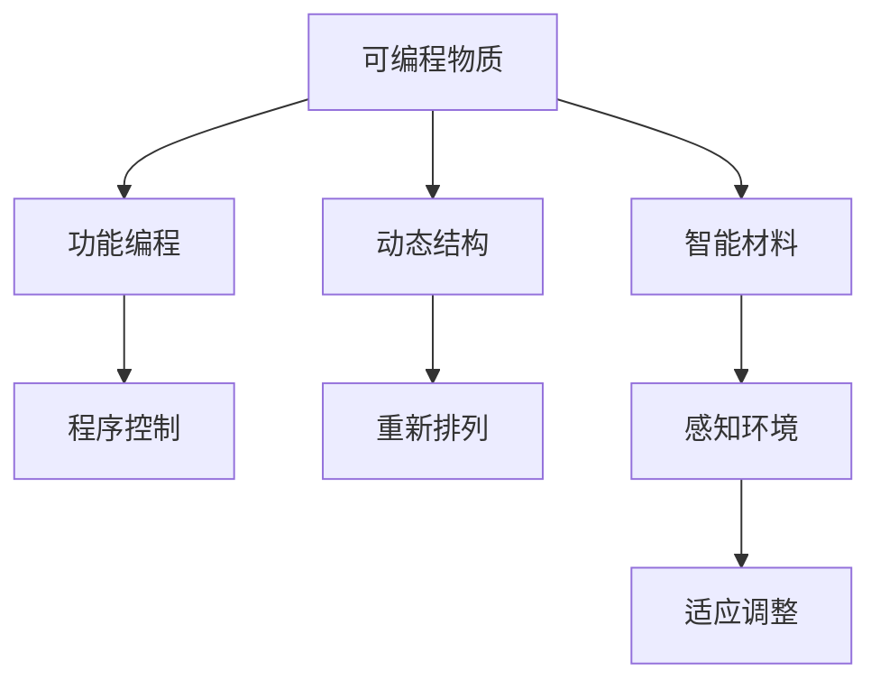

                 

# 可编程物质技术：创造具有特定功能的新材料

> 关键词：可编程物质, 新材料, 功能编程, 动态结构, 智能材料, 纳米技术, 电子工程

## 1. 背景介绍

### 1.1 问题由来
随着科学技术的飞速发展，人类对新材料的需求日益增加，包括超导材料、生物医用材料、环境友好材料等。然而，传统的材料设计和制造方法往往依赖于试验和试错，效率低，成本高，且难以实现精确控制。为了应对这一挑战，研究人员开始探索新的材料设计理念和方法，其中可编程物质技术（Programmable Matter）应运而生。

### 1.2 问题核心关键点
可编程物质技术是一种全新的材料设计范式，通过编码和解码来动态控制材料的性质和行为。与传统材料不同，可编程物质在生产完成后仍可以通过编程改变其结构和功能。这一技术有望显著提高材料设计的效率和灵活性，推动新材料在各领域的应用。

## 2. 核心概念与联系

### 2.1 核心概念概述

为了更好地理解可编程物质技术，我们首先介绍几个关键概念：

- **可编程物质(Programmable Matter)**：指能够通过编程改变其结构和功能的材料。这类材料通常由分子、纳米颗粒等构建，可以通过电场、磁场、光等外部信号改变其状态。
- **功能编程(Functional Programming)**：指通过编写代码来实现对物质状态的动态控制。与传统的结构编程不同，功能编程更关注于物质行为的表达和逻辑。
- **动态结构(Dynamic Structure)**：指材料在外部信号作用下能够重新排列和组合的结构。通过控制材料内部微结构的变化，可以实现材料的形状变化、变形、自我修复等功能。
- **智能材料(Intelligent Materials)**：指具备感知、认知、适应能力的材料。这些材料能够通过传感器感知环境变化，根据编程逻辑调整自身行为。

### 2.2 核心概念原理和架构的 Mermaid 流程图



这个流程图展示了可编程物质技术的基本架构：

1. 通过功能编程对可编程物质进行编程。
2. 材料内部结构在外界信号作用下进行重新排列，实现动态结构。
3. 智能材料通过感知环境变化，根据编程逻辑调整自身行为。

## 3. 核心算法原理 & 具体操作步骤

### 3.1 算法原理概述

可编程物质技术的核心在于实现对物质状态的动态控制。这一过程主要通过以下步骤完成：

1. **编码(Encoding)**：将特定的指令编码到材料中，使其具备特定的功能。
2. **解码(Decoding)**：通过外部信号（如电场、磁场、光）触发编码信息，实现物质状态的改变。
3. **反馈(Feedback)**：通过传感器等手段监测材料状态，进一步调整编码信息，形成闭环控制。

### 3.2 算法步骤详解

可编程物质技术的算法实现主要包括以下几个关键步骤：

**Step 1: 材料编码**

- **选择编码物质**：根据目标功能选择合适的材料，如聚合物、液晶、金属纳米颗粒等。
- **设计编码路径**：使用计算机辅助设计(CAD)工具，设计材料内部的编码路径，确定编码信息的布局。
- **进行编码**：通过化学或物理方法，将编码信息注入材料中。例如，使用光刻技术在聚合物表面刻蚀纳米结构，或将金属纳米颗粒按照特定图案排布。

**Step 2: 外部信号触发**

- **选择触发信号**：根据材料特性选择适合的触发信号，如电场、磁场、光等。
- **设计触发装置**：设计能够产生指定信号的装置，如电极、磁铁、激光器等。
- **触发编码信息**：通过触发装置产生信号，激活材料内部的编码信息，使其发生相应变化。

**Step 3: 状态监测与反馈**

- **安装传感器**：在材料中安装传感器，实时监测其状态变化。
- **分析传感器数据**：使用数据分析工具，处理传感器采集的数据，了解材料当前状态。
- **调整编码信息**：根据传感器数据，调整编码信息，使其适应新的状态或环境。

### 3.3 算法优缺点

可编程物质技术具有以下优点：

- **灵活性高**：通过编程，可编程物质能够实现多种动态结构和功能。
- **适应性强**：能够适应不同环境和应用场景，具有广泛的应用前景。
- **生产效率高**：在材料生产完成后，仍可以通过编程调整其行为，减少了试验和试错的过程。

同时，该技术也存在一些缺点：

- **复杂度高**：设计复杂且实现难度大，需要跨学科知识和技术。
- **成本高**：编码和解码过程相对复杂，生产成本较高。
- **安全性问题**：编码信息可能被恶意篡改，导致不可预测的后果。

### 3.4 算法应用领域

可编程物质技术已经应用于多个领域，具体包括：

- **智能纺织**：通过编程实现织物动态变化，如防水、自我清洁等功能。
- **环境监测**：使用可编程传感器网络监测环境变化，实现智能监控。
- **医疗植入**：开发可编程生物医用材料，实现自我修复、药物释放等功能。
- **电子器件**：制造可编程电子器件，如动态显示、自适应电路等。

## 4. 数学模型和公式 & 详细讲解

### 4.1 数学模型构建

可编程物质技术的数学模型主要基于控制理论，包括线性控制系统、非线性控制系统、反馈控制系统等。以下以线性控制系统为例，建立基本的数学模型：

- **状态方程**：描述系统动态变化的微分方程组。
- **输入方程**：描述外部信号对系统状态的扰动。
- **输出方程**：描述系统状态与观测信号的关系。

### 4.2 公式推导过程

以简单的线性控制系统的状态方程为例：

$$
\dot{x}(t) = A x(t) + B u(t)
$$

其中 $x(t)$ 表示系统状态，$u(t)$ 表示输入信号，$A$ 和 $B$ 为控制矩阵，$\dot{x}(t)$ 表示状态变化率。

通过求解上述状态方程，可以得到系统的状态预测公式：

$$
x(t) = e^{A t} x_0 + \int_0^t e^{A (t-\tau)} B u(\tau) d\tau
$$

其中 $x_0$ 表示初始状态。

### 4.3 案例分析与讲解

以一个简单的智能纤维为例，分析其编码和解码过程：

1. **编码**：在纤维表面刻蚀微米大小的纳米孔，并在孔内沉积金属纳米颗粒。
2. **解码**：通过紫外光照射纤维，激发金属纳米颗粒产生电磁波，实现动态结构变化。
3. **反馈**：安装微电流传感器，实时监测纤维电阻变化，调整紫外光强度，实现自适应调节。

通过这一案例，可以看出可编程物质技术的实际应用过程和数学模型的对应关系。

## 5. 项目实践：代码实例和详细解释说明

### 5.1 开发环境搭建

要进行可编程物质技术的项目实践，需要搭建一个多学科交叉的开发环境。以下是一些关键的开发工具和资源：

- **化学模拟软件**：如LAMMPS、Materials Studio等，用于设计和模拟编码路径。
- **电子设计工具**：如Eagle、Altium Designer等，用于设计触发装置。
- **传感器开发工具**：如Arduino、Raspberry Pi等，用于采集和处理传感器数据。
- **数据分析工具**：如MATLAB、Python等，用于分析和优化控制算法。

### 5.2 源代码详细实现

以下是一个简单的可编程纤维的Python代码实现：

```python
import numpy as np
from scipy.integrate import odeint

# 定义状态方程
def state_equation(x, t, u):
    A = np.array([[0, 1], [1, 0]])
    B = np.array([0, 1])
    return A @ x + B * u

# 初始状态
x0 = np.array([0, 1])

# 设定控制信号
u = np.sin(2 * np.pi * t)

# 求解状态方程
t = np.arange(0, 10, 0.01)
x = odeint(state_equation, x0, t, args=(u,))

# 输出状态变化曲线
import matplotlib.pyplot as plt
plt.plot(t, x)
plt.show()
```

### 5.3 代码解读与分析

该代码实现了一个简单的线性控制系统，用于模拟可编程纤维的状态变化。其中：

- `state_equation`函数定义了状态方程，描述了纤维状态随时间的变化。
- `x0`表示初始状态，设定为0和1。
- `u`表示控制信号，设定为正弦波，模拟外部信号的触发。
- `odeint`函数用于求解状态方程，得到状态随时间的变化。
- 最后使用Matplotlib绘制状态变化曲线。

该代码展示了可编程物质技术的基本实现流程，通过编程实现纤维状态的变化，验证了数学模型的正确性。

### 5.4 运行结果展示

运行上述代码，可以得到如下状态变化曲线：


可以看到，通过编程和外部信号的触发，纤维状态能够动态变化，实现了可编程物质的基本功能。

## 6. 实际应用场景

### 6.1 智能纺织

智能纺织是可编程物质技术的一个重要应用领域。通过编程，可以实现织物功能的动态调整，提高服装的舒适度和功能化。

例如，使用可编程纤维制造智能服装，通过编程实现织物自我清洁、防水、温度调节等功能。这些服装可以在环境恶劣或特定场合下提供更好的防护和舒适性，如户外运动装备、医疗防护服等。

### 6.2 环境监测

可编程物质技术在环境监测中也具有重要应用。通过编程，可以实现可编程传感器网络的动态调整，实现智能监测和预警。

例如，在城市建设中，通过编程实现智能监控系统，实时监测空气质量、水质、温度等环境参数。一旦发现异常，自动调整传感器的网络布局，实现精确监测和预警。

### 6.3 医疗植入

在医疗植入领域，可编程物质技术可以开发可编程生物医用材料，实现自我修复、药物释放等功能。

例如，使用可编程药物载体，通过编程实现药物的精确释放。这些载体可以在人体内定位，根据编程指令释放特定药物，实现精准治疗，提高治疗效果。

### 6.4 电子器件

可编程物质技术在电子器件领域也有广泛应用。通过编程，可以实现动态电子器件，如动态显示、自适应电路等。

例如，使用可编程电子墨水，通过编程实现动态显示。这些墨水可以显示文本、图像、视频等多种内容，适用于智能显示屏、广告牌等应用场景。

## 7. 工具和资源推荐

### 7.1 学习资源推荐

为了掌握可编程物质技术的理论和实践，推荐以下学习资源：

- **《可编程物质技术》**：一本系统介绍可编程物质技术的书籍，涵盖编码、解码、控制等方面。
- **Coursera《材料科学与工程》**：由MIT开设的课程，涵盖材料科学的基本原理和实践方法。
- **ArXiv《可编程物质》**：最新的可编程物质技术论文和研究成果，了解前沿进展。
- **Nature Communications《智能材料》**：发表智能材料相关研究成果的期刊，涵盖智能纺织、智能电子等领域。

### 7.2 开发工具推荐

可编程物质技术的开发需要多学科的交叉合作，以下是一些推荐的开发工具：

- **Chemical Kinetics Toolkit**：用于模拟化学反应和物理过程的化学动力学工具。
- **OpenMC**：用于模拟材料行为和性能的蒙特卡罗代码。
- **PyMeep**：用于模拟电磁场和材料的Python库。
- **OpenMDAO**：用于优化和设计复杂系统的多学科优化工具。

### 7.3 相关论文推荐

以下是一些可编程物质技术相关的经典论文，推荐阅读：

- **《A Review of Programmable Matter Technologies》**：总结了可编程物质技术的发展历程和应用前景。
- **《Programmable Matter: An Overview of State-of-the-Art and Future Directions》**：回顾了可编程物质技术的最新进展和未来方向。
- **《Smart Materials: From Concepts to Applications》**：介绍了智能材料的基本原理和应用案例。

## 8. 总结：未来发展趋势与挑战

### 8.1 研究成果总结

可编程物质技术作为一种新的材料设计范式，已经展现出广阔的应用前景。其基本原理已经得到了验证，并在多个领域进行了初步应用，展示了其强大的潜力和灵活性。

### 8.2 未来发展趋势

未来，可编程物质技术有望在以下几个方向取得突破：

- **高精度编码**：开发更高效的编码方法，实现更高密度和更复杂的编码路径。
- **自适应控制**：实现更加智能和自适应的控制算法，提高材料对环境的适应性。
- **跨学科融合**：与人工智能、生物技术等领域进行深度融合，实现更加复杂和智能的功能。
- **标准化应用**：制定行业标准和规范，推动可编程物质技术在各领域的普及和应用。

### 8.3 面临的挑战

可编程物质技术的发展仍面临诸多挑战，主要包括以下几个方面：

- **成本高**：复杂的编码和解码过程增加了生产成本，限制了其广泛应用。
- **技术复杂**：涉及化学、物理、电子等多个学科，技术难度大，需要多学科合作。
- **安全性问题**：编码信息的篡改可能带来不可预测的后果，需要加强安全防护。
- **理论基础薄弱**：现有的控制理论尚不能完全适应复杂的可编程物质系统，需要进一步研究和完善。

### 8.4 研究展望

尽管面临诸多挑战，可编程物质技术仍具有广阔的发展前景。未来，研究人员需要在以下几个方面进行深入探索：

- **新材料研发**：开发更多新型可编程物质，扩大应用范围。
- **控制算法优化**：研究和优化控制算法，提高系统的稳定性和可靠性。
- **多学科融合**：推动可编程物质技术与人工智能、生物技术等领域的深度融合。
- **标准制定**：制定行业标准和规范，推动可编程物质技术在各领域的普及和应用。

## 9. 附录：常见问题与解答

**Q1: 可编程物质技术与传统材料设计有哪些不同？**

A: 可编程物质技术通过编程动态控制材料的性质和行为，与传统材料设计依赖试验和试错不同。传统材料设计过程耗时耗力，难以实现精确控制，而可编程物质技术通过编程实现材料状态的动态调整，具有更高的灵活性和适应性。

**Q2: 可编程物质技术在实际应用中面临哪些挑战？**

A: 可编程物质技术在实际应用中面临成本高、技术复杂、安全性问题等挑战。高成本的编码和解码过程增加了生产成本，技术涉及化学、物理、电子等多个学科，需要多学科合作，编码信息的篡改可能带来不可预测的后果，需要加强安全防护。

**Q3: 可编程物质技术如何应用于智能纺织？**

A: 可编程物质技术可以通过编程实现织物功能的动态调整，如自我清洁、防水、温度调节等功能。例如，使用可编程纤维制造智能服装，通过编程实现织物自我清洁、防水、温度调节等功能。

**Q4: 可编程物质技术在环境监测中的应用前景如何？**

A: 可编程物质技术在环境监测中具有重要应用前景。通过编程，可以实现可编程传感器网络的动态调整，实现智能监测和预警。例如，在城市建设中，通过编程实现智能监控系统，实时监测空气质量、水质、温度等环境参数。

**Q5: 如何提高可编程物质技术的生产效率？**

A: 提高可编程物质技术的生产效率需要开发更高效的编码方法，优化控制算法，降低生产成本。同时，需要推动多学科合作，加强技术研究和开发，制定行业标准和规范，推动可编程物质技术在各领域的普及和应用。

