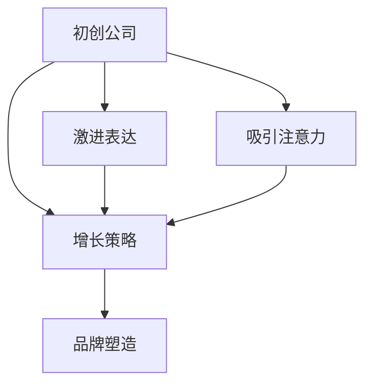

                 

# 吸引注意力：贾扬清的策略，激进表达有利于初创公司

> 关键词：初创公司, 吸引注意力, 激进表达, 增长策略, 贾扬清, 策略, 硅谷, 增长引擎

## 1. 背景介绍

### 1.1 问题由来

在硅谷这片创业的沃土上，无数初创公司在竞争激烈的科技行业中脱颖而出，走向辉煌。但是，大多数初创公司也面临着市场竞争的巨大压力，难以在众多公司中吸引用户的注意力。如何在这场信息过载的竞赛中取得优势，成为许多初创公司的必修课。

贾扬清，作为OpenAI的CTO，对创业有着深刻的理解，他提出了一套独特的策略，能够帮助初创公司吸引用户的注意力，激进表达有利于公司的发展。本文将深入探讨贾扬清的策略，分析其在初创公司中的应用和优势。

### 1.2 问题核心关键点

贾扬清提出的策略主要包括以下几个关键点：

1. **激进表达**：通过大胆、独特的表达方式，吸引用户的注意力。
2. **长期增长**：以长期增长为目标，而不是追求短期的快速收益。
3. **用户参与**：通过互动和参与，增强用户粘性。
4. **品牌塑造**：构建独特的品牌形象，形成差异化竞争优势。

## 2. 核心概念与联系

### 2.1 核心概念概述

要深入理解贾扬清的策略，首先需要了解以下几个核心概念：

1. **初创公司**：指成立时间较短、规模较小的科技企业，通常处于市场竞争的早期阶段。
2. **吸引注意力**：通过创意、独特性等方式吸引用户的注意力，提高品牌知名度和用户参与度。
3. **激进表达**：大胆、创新、甚至可能引起争议的表达方式，旨在突出品牌特色，吸引用户关注。
4. **增长策略**：制定和实施一系列策略，以实现企业的长期增长目标。
5. **品牌塑造**：构建和维护一个具有独特价值主张和明确市场定位的品牌形象。

### 2.2 核心概念原理和架构的 Mermaid 流程图



这个流程图展示了初创公司、吸引注意力、激进表达、增长策略和品牌塑造之间的逻辑关系。

- **初创公司**通过**激进表达**和**增长策略**来吸引用户的注意力，并塑造独特的**品牌形象**。
- **吸引注意力**是实现**增长策略**和**品牌塑造**的第一步，帮助初创公司在市场中脱颖而出。
- **激进表达**和**增长策略**相互作用，共同促进企业的长期发展。

## 3. 核心算法原理 & 具体操作步骤

### 3.1 算法原理概述

贾扬清提出的策略基于以下几个关键算法原理：

1. **信息论**：通过传递信息来吸引用户注意力，信息越独特，越容易被注意到。
2. **行为经济学**：利用人类行为的心理学原理，设计能够引发用户情感共鸣和参与的策略。
3. **数据科学**：利用数据分析和机器学习，优化表达方式和增长策略，提高效率和效果。

### 3.2 算法步骤详解

以下详细讲解贾扬清策略的实现步骤：

**Step 1: 确定核心价值主张**

- **明确目标市场**：确定目标用户群体，了解他们的需求和痛点。
- **提炼核心价值**：提炼出公司产品或服务的核心价值，作为吸引用户的基础。

**Step 2: 设计激进表达**

- **创意表达**：设计独特的表达方式，如搞笑、讽刺、夸张等，吸引用户的注意。
- **故事叙述**：通过引人入胜的故事，传递公司的核心价值，增加用户的共鸣。

**Step 3: 实施增长策略**

- **社交媒体推广**：利用社交媒体平台，发布引人注目的内容，增加曝光率。
- **社区参与**：建立用户社区，促进用户之间的交流和互动。

**Step 4: 塑造品牌形象**

- **视觉设计**：设计独特的视觉元素，如LOGO、配色等，建立品牌识别度。
- **内容营销**：通过高质量的内容，传递品牌价值，增强品牌认知。

**Step 5: 持续优化**

- **数据分析**：利用数据分析工具，监测用户行为和反馈，优化策略。
- **迭代改进**：根据用户反馈和市场变化，不断调整和改进策略。

### 3.3 算法优缺点

**优点**：

1. **创新性强**：通过大胆、独特的表达方式，打破市场常规，吸引用户的注意。
2. **用户参与度高**：激进表达和社区参与策略，增强用户的粘性，促进长期增长。
3. **品牌形象鲜明**：通过独特的品牌塑造，形成差异化竞争优势。

**缺点**：

1. **争议性高**：过于激进或争议性的表达方式，可能会引起负面反响，影响品牌形象。
2. **风险高**：过于创新的策略，可能在初期不受欢迎，甚至导致失败。
3. **需要持续优化**：需要不断监测用户反馈和市场变化，进行迭代改进，成本较高。

### 3.4 算法应用领域

贾扬清的策略不仅适用于初创公司，也广泛应用于各种商业领域，如：

1. **科技公司**：通过技术创新和激进表达，吸引用户关注，构建品牌形象。
2. **社交媒体平台**：通过独特的内容和互动方式，增加用户粘性，提升活跃度。
3. **广告行业**：设计有创意的广告内容，提高曝光率和点击率。
4. **市场营销**：通过故事叙述和社区参与，提高用户参与度，实现长期增长。

## 4. 数学模型和公式 & 详细讲解 & 举例说明

### 4.1 数学模型构建

贾扬清的策略可以通过数学模型进行量化和分析。以下是一个简单的数学模型构建过程：

设初创公司通过激进表达吸引到的用户数为 $U$，品牌认知度为 $C$，长期增长率为 $G$，则模型的构建如下：

$$
U = f(E)
$$

其中 $E$ 表示激进表达的质量和创新程度，$f$ 为映射函数。

品牌认知度 $C$ 可以表示为：

$$
C = g(U)
$$

长期增长率 $G$ 可以表示为：

$$
G = h(C)
$$

其中 $g$ 和 $h$ 为映射函数。

### 4.2 公式推导过程

为了更好地理解这些公式，我们进行以下推导：

设激进表达的质量和创新程度 $E$ 为一个连续变量，映射函数 $f$ 为单调递增函数，则有：

$$
U = f(E) = E^a
$$

其中 $a$ 为常数，表示激进表达与用户吸引力的关系。

品牌认知度 $C$ 与用户吸引力和互动密切相关，可以表示为：

$$
C = g(U) = kU^b
$$

其中 $k$ 和 $b$ 为常数，表示用户吸引力与品牌认知度的关系。

长期增长率 $G$ 与品牌认知度密切相关，可以表示为：

$$
G = h(C) = C^c
$$

其中 $c$ 为常数，表示品牌认知度与长期增长的关系。

将这些公式结合，可以得到一个综合的数学模型：

$$
G = (kU^b)^c = k^c U^{bc}
$$

### 4.3 案例分析与讲解

以OpenAI为例，分析其如何通过激进表达和增长策略吸引用户注意力，塑造品牌形象。

- **激进表达**：OpenAI的GPT模型通过创新、独特的表达方式，如深度学习、自监督预训练等，吸引了大量用户的关注。
- **增长策略**：通过发布高质量的研究论文、开源社区的建设、参与AI伦理讨论等方式，增加了品牌曝光度，建立了深厚的用户基础。
- **品牌形象**：OpenAI通过独特的视觉设计、高质量的内容营销，形成了鲜明的技术导向品牌形象。

## 5. 项目实践：代码实例和详细解释说明

### 5.1 开发环境搭建

贾扬清的策略主要依赖于创意和数据分析，因此无需复杂的开发环境。主要工具包括：

- **数据处理工具**：Python、R等语言，用于数据分析和处理。
- **可视化工具**：Tableau、Power BI等，用于数据可视化。
- **社交媒体管理工具**：Hootsuite、Buffer等，用于社交媒体发布和监测。

### 5.2 源代码详细实现

以下是一个简单的Python代码示例，用于分析社交媒体平台上的用户参与度：

```python
import pandas as pd
import matplotlib.pyplot as plt

# 读取数据
data = pd.read_csv('social_media_data.csv')

# 计算参与度
participation_rate = data['interaction'] / data['total_users']

# 绘制图表
plt.bar(data['time'], participation_rate)
plt.xlabel('Time')
plt.ylabel('Participation Rate')
plt.title('User Participation Over Time')
plt.show()
```

### 5.3 代码解读与分析

这段代码使用Pandas和Matplotlib库，对社交媒体平台上的用户参与度进行分析。通过读取数据，计算每个时间段的参与率，并使用Matplotlib绘制图表。

## 6. 实际应用场景

### 6.1 初创公司的具体应用

**案例1: SpaceX**

SpaceX通过大胆、独特的表达方式，吸引了大量关注。例如，公司经常发布火箭发射和任务进展的动态，通过视觉震撼的视频和图片，吸引用户关注。此外，公司还通过社交媒体平台发布最新的研发进展和技术突破，增强了品牌认知度。

**案例2: Airbnb**

Airbnb通过社区参与策略，增强用户粘性。公司鼓励用户分享自己的旅行体验和房东故事，建立了一个庞大的用户社区。通过用户之间的互动和分享，增加了用户参与度和品牌认知度，推动了公司的长期增长。

### 6.2 未来应用展望

未来的初创公司可以通过以下方式进一步应用贾扬清的策略：

- **利用AI生成内容**：通过自然语言处理和生成模型，自动生成高质量的营销内容和广告素材。
- **跨平台协作**：在不同社交媒体平台和线下渠道上进行协同营销，增加品牌曝光度和用户参与度。
- **用户数据驱动**：利用大数据和机器学习技术，优化表达方式和增长策略，提高效率和效果。

## 7. 工具和资源推荐

### 7.1 学习资源推荐

为了帮助初创公司系统掌握贾扬清的策略，以下是一些优质的学习资源：

1. **《创新者的窘境》**：克莱顿·克里斯滕森所著，探讨了企业在面对颠覆性技术时的困境和机遇。
2. **《硅谷钢铁是怎样炼成的》**：彼得·蒂尔所著，详细介绍了硅谷创业者的思维方式和成功经验。
3. **《影响力》**：罗伯特·西奥迪尼所著，研究了如何通过心理学原理，影响用户行为和决策。
4. **Coursera的“数据科学基础”课程**：由约翰·霍普金斯大学开设，涵盖数据分析、统计学、机器学习等基本概念和工具。
5. **Udacity的“AI初创公司课程”**：由谷歌和Coursera联合开设，聚焦于AI技术在初创公司中的应用。

通过学习这些资源，初创公司可以更好地理解和应用贾扬清的策略，提升品牌知名度和用户参与度。

### 7.2 开发工具推荐

以下是几款用于贾扬清策略实践的常用工具：

1. **Jupyter Notebook**：用于数据分析和模型开发的开源平台，支持Python、R等语言。
2. **Tableau**：数据可视化的领先工具，支持多种数据源，易于使用。
3. **Hootsuite**：社交媒体管理工具，支持多平台发布和监测。
4. **Google Analytics**：网站流量和用户行为分析工具，提供详细的用户数据报告。

合理利用这些工具，可以显著提升初创公司贾扬清策略的实践效果，实现品牌塑造和长期增长。

### 7.3 相关论文推荐

贾扬清的策略基于一系列的研究和实践，以下是几篇奠基性的相关论文：

1. **“The Impact of Viral Marketing on Brand Equity: A Quantitative Study”**：由加州大学伯克利分校的研究者发表，探讨了病毒营销对品牌认知度的影响。
2. **“Understanding the Mechanism of Word-of-Mouth Marketing”**：由麻省理工学院的研究者发表，研究了口碑传播的机制和影响因素。
3. **“Brand Equity: The Need for a Conceptual Framework”**：由达特茅斯大学的研究者发表，提出了品牌认知度的概念框架。
4. **“Influence Maximization in Social Networks”**：由斯坦福大学的研究者发表，研究了社交网络中的影响力最大化问题。
5. **“The Role of Social Media in Customer Experience”**：由麦肯锡公司发表的报告，探讨了社交媒体对客户体验的影响。

这些论文代表了大语言模型微调技术的发展脉络。通过学习这些前沿成果，可以帮助初创公司更好地理解和应用贾扬清的策略，提升品牌知名度和用户参与度。

## 8. 总结：未来发展趋势与挑战

### 8.1 总结

本文对贾扬清的策略进行了全面系统的介绍。首先阐述了策略的核心概念和背景，明确了激进表达在初创公司中的应用和优势。其次，从原理到实践，详细讲解了策略的数学模型和操作步骤，给出了具体的代码实现示例。同时，本文还探讨了策略在初创公司中的应用场景，并推荐了相关的学习资源和工具。

通过本文的系统梳理，可以看到，贾扬清的策略为初创公司在吸引用户注意力、塑造品牌形象、实现长期增长等方面提供了有力的支持。相信在未来的创业实践中，这些策略将发挥更大的作用，帮助更多初创公司走向成功。

### 8.2 未来发展趋势

展望未来，初创公司可以通过以下几个趋势进一步提升贾扬清的策略效果：

1. **人工智能技术的应用**：利用AI生成内容、用户行为分析等技术，优化表达方式和增长策略。
2. **跨平台协作**：在不同社交媒体平台和线下渠道上进行协同营销，增加品牌曝光度和用户参与度。
3. **数据驱动的决策**：利用大数据和机器学习技术，优化决策过程，提高效率和效果。
4. **持续迭代优化**：通过用户反馈和市场变化，不断调整和改进策略，保持品牌的持续增长。

### 8.3 面临的挑战

尽管贾扬清的策略在初创公司中取得了显著成效，但在实际操作中，仍然面临以下挑战：

1. **创意的可持续性**：需要不断创造新的创意表达，保持用户的新鲜感和兴趣。
2. **用户数据的隐私**：在获取用户数据和进行数据分析时，需要遵守数据隐私和伦理规范。
3. **成本控制**：创意和策略的实施可能需要较高的成本，初创公司需要合理控制成本。

### 8.4 研究展望

未来的研究可以在以下几个方向寻求新的突破：

1. **创意生成算法**：开发基于人工智能的创意生成算法，自动生成高质量的营销内容和广告素材。
2. **数据隐私保护**：研究隐私保护技术，确保在获取和分析用户数据时，遵循隐私保护规范。
3. **跨平台协同**：研究跨平台协同方法，提高社交媒体和线下渠道的整合效果。
4. **用户参与度提升**：研究如何通过用户行为分析，提升用户参与度和忠诚度。

## 9. 附录：常见问题与解答

**Q1: 初创公司如何制定贾扬清的激进表达策略？**

A: 初创公司可以通过以下步骤制定激进表达策略：

1. **市场调研**：了解目标市场和用户需求，确定核心价值主张。
2. **创意头脑风暴**：组织团队进行创意头脑风暴，生成各种大胆、独特的表达方式。
3. **测试反馈**：在部分用户中进行测试，收集反馈，不断优化表达方式。

**Q2: 如何平衡激进表达和品牌形象？**

A: 平衡激进表达和品牌形象，可以从以下几个方面入手：

1. **目标受众定位**：明确目标受众，了解他们的接受程度和偏好。
2. **品牌价值观的传递**：在表达方式中融入品牌价值观，传递正面信息。
3. **多渠道传播**：在不同渠道上进行多层次、多维度的传播，提升品牌认知度。

**Q3: 如何通过数据驱动优化贾扬清的策略？**

A: 通过数据驱动优化贾扬清的策略，主要包括以下步骤：

1. **数据收集**：通过社交媒体、网站流量等渠道，收集用户行为和反馈数据。
2. **数据分析**：利用数据分析工具，如Tableau、Google Analytics等，进行数据可视化和分析。
3. **模型优化**：通过机器学习模型，如回归模型、分类模型等，优化表达方式和增长策略。

**Q4: 如何在初创公司中实施贾扬清的策略？**

A: 在初创公司中实施贾扬清的策略，可以按照以下步骤：

1. **团队培训**：对团队进行培训，提高对策略的理解和执行能力。
2. **资源配置**：合理配置资源，如人力、资金等，确保策略的实施。
3. **持续监测**：定期监测策略效果，进行反馈和优化。

总之，初创公司需要综合考虑创意表达、品牌形象、数据驱动和持续优化等因素，才能实现贾扬清策略的最佳效果，在竞争激烈的市场中脱颖而出。

---

作者：禅与计算机程序设计艺术 / Zen and the Art of Computer Programming

