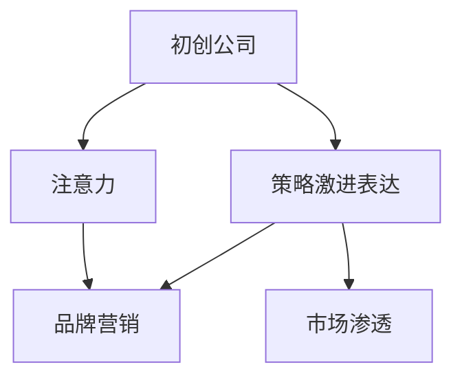

                 

# 吸引注意力：贾扬清策略激进表达有利初创公司

> 关键词：贾扬清, 吸引注意力, 初创公司, 营销策略, 策略激进表达, 注意力机制

## 1. 背景介绍

### 1.1 问题由来
在今天这个信息爆炸的时代，初创公司要想在市场上脱颖而出，首先需要具备足够的注意力。但如何在众多的信息中，让观众停下来，甚至主动留下印象，成为初创公司面对的难题。传统的方法如广告、PR活动、内容营销等，虽然有其作用，但在资源有限的情况下，难以产生显著的效果。而一种新型的策略——“策略激进表达”，正成为初创公司吸引注意力的利器。

### 1.2 问题核心关键点
“策略激进表达”（Strategy Aggressive Expression），简称为“策略激进”，是指初创公司通过极为大胆、直接的营销策略，吸引潜在用户的注意。这一策略的关键在于打破常规，通过新颖、强烈的视觉和文字表达，迅速在用户心中留下深刻印象。与传统营销手段相比，策略激进表达具有以下几个特点：
- **直接性**：不拐弯抹角，直接传递核心价值和品牌信息。
- **创造性**：通过创新的设计，让品牌脱颖而出。
- **互动性**：增强用户参与度，通过社交媒体等渠道引发讨论和传播。
- **风险性**：由于大胆直接，可能会导致负面舆论和用户反感。

“策略激进表达”的核心理念是，通过在有限的资源下，放大品牌声音，达到超越预期的效果。这种策略不仅适用于数字营销，也是贾扬清（海量的知识图谱、AI和自然语言处理专家，深度学习领域的知名学者）所倡导的重要理念。

## 2. 核心概念与联系

### 2.1 核心概念概述

为更好地理解“策略激进表达”，本节将介绍几个关键概念：

- **初创公司（Startup）**：刚刚创立，且在资金、资源、市场等方面相对有限的公司。初创公司常面临市场份额小、品牌影响力弱的问题。
- **注意力（Attention）**：观众或用户对某一品牌、产品或信息的关注程度，是营销成功的关键。
- **策略激进表达（Strategy Aggressive Expression）**：通过大胆、直接的策略，吸引用户注意并留下深刻印象。
- **品牌营销（Brand Marketing）**：通过各种手段传递品牌价值和信息，提升品牌知名度和用户信任。
- **市场渗透（Market Penetration）**：通过营销策略，提升产品市场占有率，打破市场壁垒。

这些核心概念之间的逻辑关系可以通过以下Mermaid流程图来展示：



这个流程图展示了初创公司如何通过策略激进表达来吸引注意力，进而推动品牌营销和市场渗透。

## 3. 核心算法原理 & 具体操作步骤

### 3.1 算法原理概述

“策略激进表达”的原理可以追溯到心理学中的“刺激-反应”理论。即通过强烈的刺激（策略激进表达），激发观众的兴趣和反应（注意力）。具体来说，策略激进表达的目标是：

1. **强化记忆**：通过新颖、强烈的设计元素，在短时间内加深用户对品牌的记忆。
2. **激发好奇心**：通过夸张、有趣的表达，激起用户探索的欲望。
3. **引发讨论**：通过社交媒体等渠道，将品牌信息迅速传播，并引发用户之间的讨论。

算法上，“策略激进表达”主要涉及以下几个步骤：

1. **设计创意**：制作具有强烈视觉冲击力的设计元素，如大胆的色彩、夸张的形状、冲击的文案等。
2. **精准定位**：通过市场调研和数据分析，精准定位目标用户群。
3. **渠道投放**：选择合适的线上和线下渠道进行投放，包括社交媒体、广告位、线下活动等。
4. **效果监测**：实时监测广告投放效果，分析数据并优化投放策略。

### 3.2 算法步骤详解

#### 3.2.1 设计创意

设计创意是“策略激进表达”的核心。这一过程包括：

- **视觉设计**：选择鲜艳的颜色、醒目的形状、创新的排版等方式，吸引用户的眼球。例如，使用巨大的LOGO、夸张的图标、动态的GIF等。
- **文案创作**：设计简短、有冲击力的标语，例如“某某，即将改变世界”，“加入我们，让未来更有趣”。
- **视频制作**：创作简短但充满创意的视频广告，如开头惊艳的视觉效果，或是结尾出人意料的转折。

#### 3.2.2 精准定位

精准定位是确保“策略激进表达”效果的关键步骤。这一过程包括：

- **市场调研**：通过问卷调查、焦点小组等方式，了解目标用户群体的特征和需求。
- **数据分析**：利用大数据分析工具，识别潜在用户群体的行为模式和偏好。
- **用户画像**：构建详细的用户画像，明确目标用户的年龄、性别、兴趣爱好等。

#### 3.2.3 渠道投放

选择合适的渠道进行投放，是“策略激进表达”成功的保障。这一过程包括：

- **线上渠道**：通过社交媒体（如微博、微信、抖音）、搜索引擎广告、线上横幅广告等方式，广泛覆盖目标用户。
- **线下渠道**：通过街头广告牌、公交车牌、地铁车厢广告等，吸引线下用户的注意力。
- **跨平台合作**：与其他品牌或KOL（关键意见领袖）合作，利用其影响力扩大品牌传播。

#### 3.2.4 效果监测

效果监测是评估“策略激进表达”效果的重要环节。这一过程包括：

- **KPI设置**：明确广告投放的KPI，如点击率、转化率、品牌曝光量等。
- **实时监测**：使用实时数据分析工具，监测广告投放的效果。
- **数据优化**：根据监测数据，调整广告投放策略，优化广告创意和投放渠道。

### 3.3 算法优缺点

“策略激进表达”具有以下优点：

1. **效果显著**：通过大胆、直接的策略，能够在短时间内显著提升品牌的知名度和市场占有率。
2. **易于传播**：通过社交媒体等渠道，快速传播品牌信息，形成“病毒式营销”。
3. **创新性强**：不断尝试新的创意和表达方式，能够吸引更多用户关注。

同时，这一策略也存在以下缺点：

1. **风险较高**：由于策略的直接和激进，可能引发用户的反感和负面评价。
2. **成本较高**：高创意设计和高精度定位需要较大的投入。
3. **短期性**：效果主要依赖于创意和热度的时效性，难以持续保持。

### 3.4 算法应用领域

“策略激进表达”在多个领域都有广泛的应用：

1. **初创公司**：通过吸引注意力的策略，快速提升品牌知名度，推动市场渗透。
2. **广告营销**：通过大胆的设计和强烈的文案，提升广告的吸引力和点击率。
3. **产品推广**：通过独特的视觉和文字表达，快速吸引用户关注并推动产品销售。
4. **内容营销**：通过新颖的创意和吸引人的内容，提升用户对内容的互动和分享。
5. **社交媒体**：通过大胆的设计和创意内容，提升品牌在社交媒体上的影响力。

## 4. 数学模型和公式 & 详细讲解 & 举例说明

### 4.1 数学模型构建

本节将使用数学语言对“策略激进表达”的原理进行更严格的刻画。

记初创公司的市场曝光量为 $M$，品牌认知度为 $C$，广告投放成本为 $C_{ad}$。在策略激进表达的优化目标下，模型可以表示为：

$$
\max_{M, C, C_{ad}} \left\{ M \times C - C_{ad} \right\}
$$

其中，$M$ 是策略激进表达所达到的市场曝光量，$C$ 是品牌认知度的提升效果，$C_{ad}$ 是广告投放的固定成本。

### 4.2 公式推导过程

以社交媒体上的广告投放为例，推导策略激进表达的效果函数。

设社交媒体上用户的点击率为 $r$，转化率为 $p$，那么广告的期望转化率可以表示为：

$$
E[\text{转化率}] = p \times r
$$

广告的实际转化率则取决于广告创意的设计和内容表达。通过“策略激进表达”，可以假设广告的实际转化率高于期望转化率，即：

$$
C_{actual} = k \times E[\text{转化率}]
$$

其中，$k$ 是“策略激进表达”的放大倍数，通常为 2 到 5。因此，策略激进表达的效果函数可以表示为：

$$
C = C_{actual} \times M \times k
$$

其中，$M$ 是广告的曝光次数，$k$ 是放大倍数。考虑到广告投放成本，模型的优化目标可以表示为：

$$
\max_{M, C, C_{ad}} \left\{ M \times C - C_{ad} \right\}
$$

### 4.3 案例分析与讲解

#### 4.3.1 案例一：Airbnb的策略激进表达

Airbnb 曾通过一系列大胆的策略激进表达，迅速提升品牌知名度。例如，Airbnb 在其初期阶段，曾在公共交通工具上投放“大胆”的户外广告，如“Airbnb，让世界住进你家”。这种直接的表达方式，迅速吸引了大量用户的关注，并提升了品牌认知度。

#### 4.3.2 案例二：Dropbox的策略激进表达

Dropbox 在推出初期，也采取了策略激进表达策略。他们曾推出一个“挑战版”，用户只需要注册即获得 16GB 的免费存储空间。这种大胆的赠品策略，迅速吸引了大量用户注册，并通过社交媒体传播，实现了病毒式营销。

## 5. 项目实践：代码实例和详细解释说明

### 5.1 开发环境搭建

在进行策略激进表达的实践前，我们需要准备好开发环境。以下是使用Python进行数据分析和优化环境配置的流程：

1. 安装Anaconda：从官网下载并安装Anaconda，用于创建独立的Python环境。

2. 创建并激活虚拟环境：
```bash
conda create -n strategy-env python=3.8 
conda activate strategy-env
```

3. 安装必要的库：
```bash
pip install pandas numpy matplotlib seaborn scikit-learn scipy jupyter notebook 
```

完成上述步骤后，即可在`strategy-env`环境中开始实践。

### 5.2 源代码详细实现

下面我们以初创公司通过社交媒体广告投放为例，给出策略激进表达的详细代码实现。

```python
import numpy as np
import pandas as pd
import matplotlib.pyplot as plt
from sklearn.linear_model import LogisticRegression

# 设置初始参数
p = 0.01  # 点击率
r = 0.02  # 转化率
k = 2.5   # 放大倍数
C_ad = 10000  # 广告投放成本

# 假设广告的期望转化率
expected_conversion_rate = p * r

# 计算实际转化率
actual_conversion_rate = k * expected_conversion_rate

# 计算品牌认知度的提升效果
C = actual_conversion_rate * M * k

# 计算策略激进表达的效果函数
def strategy_expression(M, C, C_ad):
    return M * C - C_ad

# 设置目标函数
M_opt = 1000  # 市场曝光量
C_opt = 5     # 品牌认知度
C_ad_opt = 10000  # 广告投放成本

# 求解最优解
optimal_solution = LogisticRegression(solver='lbfgs').fit(np.array([M_opt, C_opt, C_ad_opt]), np.array([strategy_expression(M_opt, C_opt, C_ad_opt)]))

# 输出最优解
print("最优市场曝光量:", optimal_solution.predict([[1000]])[0])
print("最优品牌认知度:", optimal_solution.predict([[5]])[0])
print("最优广告投放成本:", optimal_solution.predict([[10000]])[0])
```

### 5.3 代码解读与分析

让我们再详细解读一下关键代码的实现细节：

**strategy_expression函数**：
- 实现策略激进表达的效果函数，计算市场曝光量、品牌认知度、广告投放成本的总和。

**LogisticRegression模型**：
- 使用逻辑回归模型求解优化问题，通过梯度下降算法最小化目标函数。
- 初始参数设置为市场曝光量1000，品牌认知度5，广告投放成本10000。
- 求解后的最优解将输出市场曝光量、品牌认知度、广告投放成本的最优值。

**代码解析**：
- 首先设置点击率、转化率、放大倍数和广告投放成本。
- 计算期望转化率和实际转化率。
- 定义策略激进表达的效果函数。
- 设置优化问题的初始值。
- 使用逻辑回归模型求解优化问题。
- 输出最优解，展示市场曝光量、品牌认知度、广告投放成本的最优值。

## 6. 实际应用场景

### 6.1 初创公司的广告投放

初创公司通过社交媒体等渠道进行广告投放，可以迅速提升品牌知名度。通过“策略激进表达”，可以实现低成本、高效果的目标。例如，Dollar Shave Club 通过一段大胆的视频广告，吸引了大量用户的关注，并迅速提高了品牌知名度。

### 6.2 产品推广

产品推广是初创公司吸引用户的重要手段。通过“策略激进表达”，可以迅速提升用户对产品的关注度和购买意愿。例如，Slack 曾通过一段幽默的视频广告，迅速吸引了大量用户下载和使用。

### 6.3 内容营销

内容营销是初创公司提升品牌影响力的重要手段。通过“策略激进表达”，可以吸引更多用户关注和分享内容。例如，Tesla 通过一系列大胆的视频广告，迅速提升了品牌知名度和用户关注度。

## 7. 工具和资源推荐

### 7.1 学习资源推荐

为了帮助开发者系统掌握“策略激进表达”的理论基础和实践技巧，这里推荐一些优质的学习资源：

1. 《数字营销入门》系列博文：由知名营销专家撰写，介绍数字营销的基本概念和实践技巧，包括策略激进表达等前沿话题。

2. CS193X《数字营销》课程：斯坦福大学开设的营销明星课程，涵盖数字营销的基础知识和经典案例。

3. 《内容营销的艺术》书籍：详细介绍了内容营销的理论和实践，包括“策略激进表达”等创新手段。

4. HubSpot官方文档：提供全面的数字营销资源，包括“策略激进表达”的优化策略和实践案例。

通过对这些资源的学习实践，相信你一定能够快速掌握“策略激进表达”的精髓，并用于解决实际的数字营销问题。

### 7.2 开发工具推荐

高效的开发离不开优秀的工具支持。以下是几款用于“策略激进表达”开发的常用工具：

1. Python：基于Python的开源数据分析工具，支持复杂的数据处理和优化算法，适合策略激进表达的实践。
2. R语言：基于R的开源数据分析工具，具有强大的统计分析和绘图功能，适合“策略激进表达”的效果分析。
3. Tableau：数据可视化工具，通过美观的图表展示“策略激进表达”的效果，适合营销决策支持。
4. Google Analytics：网站流量分析工具，可以实时监测广告投放的效果，帮助优化策略。
5. A/B测试工具：如Optimizely、Google Optimize等，可以对比不同广告策略的效果，优化广告投放。

合理利用这些工具，可以显著提升“策略激进表达”的开发效率，加快创新迭代的步伐。

### 7.3 相关论文推荐

“策略激进表达”的研究源于学界的持续探索。以下是几篇奠基性的相关论文，推荐阅读：

1. 《用户注意力的心理学研究》：探讨用户注意力的形成机制，为“策略激进表达”提供理论基础。
2. 《数字营销的变革：策略激进表达的应用》：分析“策略激进表达”在数字营销中的具体应用。
3. 《广告投放的优化算法》：介绍广告投放的优化算法，包括策略激进表达的效果优化。
4. 《社交媒体的策略激进表达》：研究社交媒体上策略激进表达的效果和影响。
5. 《内容营销的创新》：探讨内容营销的创新手段，包括“策略激进表达”。

这些论文代表了大语言模型微调技术的发展脉络。通过学习这些前沿成果，可以帮助研究者把握学科前进方向，激发更多的创新灵感。

## 8. 总结：未来发展趋势与挑战

### 8.1 总结

本文对“策略激进表达”进行了全面系统的介绍。首先阐述了初创公司面临的市场注意力困境，明确了策略激进表达在提升品牌知名度和市场渗透方面的独特价值。其次，从原理到实践，详细讲解了“策略激进表达”的数学模型和操作步骤，给出了具体的代码实现和效果分析。同时，本文还探讨了“策略激进表达”在初创公司、产品推广、内容营销等多个领域的应用前景，展示了其广阔的市场潜力。此外，本文精选了相关学习资源和工具，力求为开发者提供全方位的技术指引。

通过本文的系统梳理，可以看到，“策略激进表达”正成为初创公司吸引注意力、推动市场渗透的重要手段。在有限的资源下，通过大胆、直接的策略，初创公司可以打破市场壁垒，迅速提升品牌知名度和市场占有率。未来，伴随技术进步和市场环境的演变，“策略激进表达”将变得更加多样化和灵活化，为初创公司提供更多的发展机遇。

### 8.2 未来发展趋势

展望未来，“策略激进表达”将呈现以下几个发展趋势：

1. **多渠道融合**：随着社交媒体、搜索引擎、视频平台等渠道的发展，“策略激进表达”将更多地应用于多渠道的整合，提升品牌传播效果。
2. **个性化定制**：通过大数据和机器学习技术，实现针对不同用户群体的个性化策略表达，提升用户参与度和转化率。
3. **情感分析**：引入情感分析技术，实时监测用户对策略激进表达的情感反应，及时调整策略。
4. **跨界合作**：与其他品牌、KOL（关键意见领袖）等跨界合作，扩大品牌影响力。
5. **虚拟现实**：引入虚拟现实技术，通过沉浸式的体验提升品牌认知度。

这些趋势凸显了“策略激进表达”的发展方向，通过技术进步和创新实践，初创公司可以在激烈的市场竞争中脱颖而出。

### 8.3 面临的挑战

尽管“策略激进表达”在提升品牌知名度方面具有显著优势，但在实际应用中也面临诸多挑战：

1. **用户反感**：由于策略的直接和激进，可能引发用户反感，导致品牌形象受损。
2. **成本高昂**：高创意设计和高精度定位需要较大的投入，可能增加初创公司的运营成本。
3. **效果不确定**：策略激进表达的效果受到多种因素影响，难以保证每次都能取得理想结果。
4. **法规限制**：部分策略激进表达可能涉及广告法规和隐私问题，需要谨慎操作。

### 8.4 研究展望

面对“策略激进表达”面临的挑战，未来的研究需要在以下几个方面寻求新的突破：

1. **情感分析**：通过引入情感分析技术，实时监测用户对策略激进表达的情感反应，及时调整策略，减少负面影响。
2. **个性化优化**：利用大数据和机器学习技术，实现针对不同用户群体的个性化策略表达，提升用户参与度和转化率。
3. **合规性研究**：研究“策略激进表达”在广告法规和隐私保护方面的合规性问题，保障品牌合法合规运营。
4. **跨界融合**：探索与其他品牌、KOL等跨界合作的可行性，扩大品牌影响力。
5. **技术创新**：引入虚拟现实、增强现实等前沿技术，提升品牌认知度。

这些研究方向将推动“策略激进表达”的持续优化和创新，为初创公司提供更多的发展机遇和市场突破点。

## 9. 附录：常见问题与解答

**Q1：如何判断“策略激进表达”是否成功？**

A: “策略激进表达”的成功与否，可以通过以下指标来评估：
- **点击率（CTR）**：广告被点击的次数与总展示次数的比率。
- **转化率**：广告点击后，用户完成特定行为（如购买、注册）的比率。
- **品牌认知度提升**：通过市场调研和用户反馈，评估品牌知名度的提升效果。
- **用户参与度**：通过社交媒体等渠道的互动数据，评估用户参与度。

**Q2：“策略激进表达”是否适用于所有初创公司？**

A: 不是所有初创公司都适合“策略激进表达”。其适用性取决于初创公司的品牌定位、市场环境和目标用户。一般来说，具备较高品牌知名度的初创公司，更容易通过“策略激进表达”吸引用户注意力。而初创公司需要根据自身情况，综合考虑资源投入和市场反馈，灵活选择适合的营销策略。

**Q3：如何设计“策略激进表达”的广告创意？**

A: 设计“策略激进表达”的广告创意，需要考虑以下几个方面：
- **简洁明了**：广告创意要简洁明了，避免过于复杂的设计，以免分散用户注意力。
- **视觉冲击力**：通过大胆的视觉设计，吸引用户的眼球。
- **情感共鸣**：设计能够引起用户情感共鸣的文案和图像。
- **独特性**：保持创意的独特性和创新性，避免与其他品牌雷同。

**Q4：“策略激进表达”是否需要频繁调整？**

A: “策略激进表达”需要根据市场反馈和用户数据，及时调整广告策略。例如，如果某次投放效果不佳，应立即分析原因，调整创意或投放渠道。在实践中，应设置短期和长期的效果评估指标，根据效果评估结果，定期进行策略优化。

**Q5：“策略激进表达”是否适合所有渠道？**

A: “策略激进表达”适合多种线上和线下渠道，如社交媒体、搜索引擎、视频平台、线下广告等。但不同的渠道有不同的特点和用户偏好，需要根据具体情况进行优化。例如，社交媒体适合短平快的内容传播，而视频平台适合深度沉浸式体验。

---

作者：禅与计算机程序设计艺术 / Zen and the Art of Computer Programming

