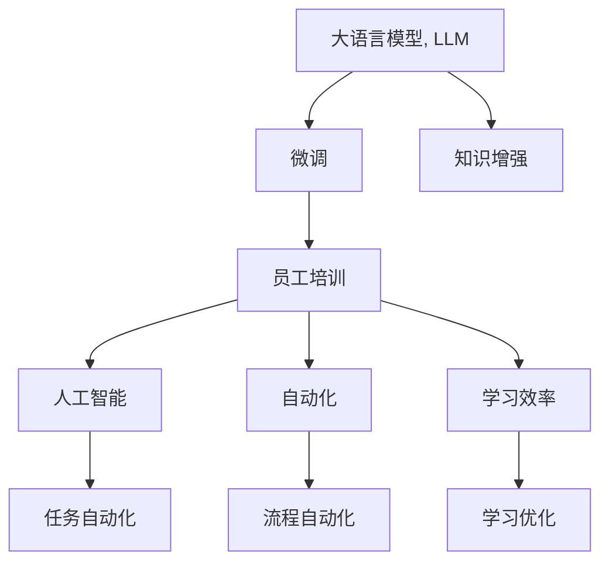
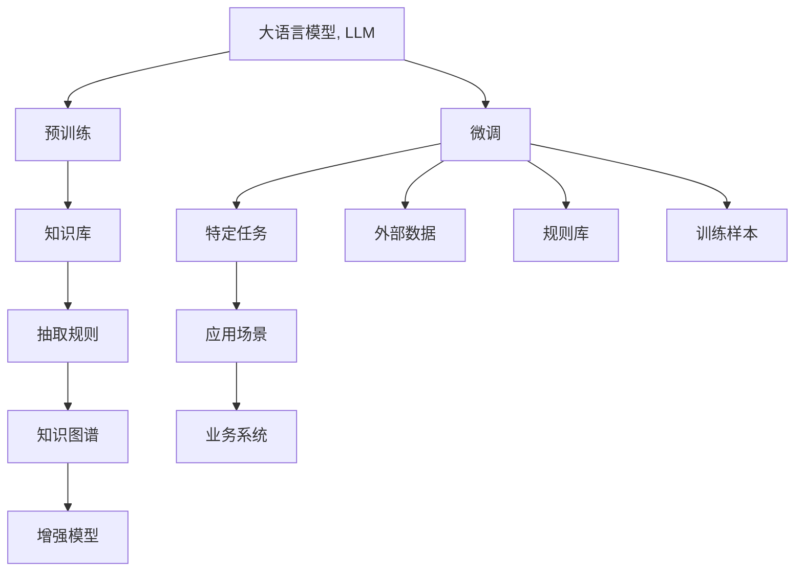

                 

# 员工培训：LLM 增强的学习计划

> 关键词：
1. 大语言模型(Large Language Model, LLM)
2. 微调(Fine-tuning)
3. 知识增强(Knowledge Enrichment)
4. 员工培训(Training Program)
5. 人工智能(Artificial Intelligence)
6. 自动化(Automation)
7. 学习效率(Learning Efficiency)

## 1. 背景介绍

### 1.1 问题由来

在全球化信息化快速发展的今天，企业在招聘和培养员工方面面临着诸多挑战。尤其是技术岗位，不仅需要高水平的编程和算法能力，还需要掌握最新的科技趋势和前沿技术。大语言模型（LLM）和微调（Fine-tuning）技术的崛起，为技术培训提供了新的方向和工具。

大语言模型，如GPT、BERT等，通过在大规模无标签文本数据上进行自监督学习，已经展示了强大的语言理解和生成能力。微调则是一种利用已有的大语言模型，针对特定任务进行有监督训练，进一步提升模型在该任务上的性能的技术。然而，尽管大语言模型和微调技术在学术界和工业界已取得广泛应用，但在企业内部的技术培训中，如何合理利用这些技术来提升员工的实际工作能力，仍是一个待解决的课题。

### 1.2 问题核心关键点

在企业员工培训中引入大语言模型和微调技术，可以将员工的知识体系和技能提升到一个新的水平，具体关键点如下：

1. **能力扩展**：通过微调技术，员工可以快速掌握和应用新任务或新领域的知识，提升技术水平。
2. **知识共享**：大语言模型能够抽取和整合企业内外部的知识和经验，促进知识共享和复用。
3. **个性化学习**：根据员工的职业路径和学习历史，微调模型可以提供个性化的学习计划和指导，提高学习效率。
4. **自动化评估**：通过微调技术，员工的学习成果可以自动化的进行评估和反馈，提升培训效果。
5. **灵活性**：微调技术可以根据员工的学习进度和兴趣，灵活调整培训内容和难度，适应不同学习者的需求。

### 1.3 问题研究意义

在企业培训中引入大语言模型和微调技术，具有以下重要意义：

1. **提升技术水平**：大语言模型和微调技术的应用，能够帮助员工掌握前沿技术，提升他们的技术能力和岗位竞争力。
2. **加速知识迭代**：利用大语言模型和微调技术，可以加速企业内部的知识迭代和更新，保持技术领先。
3. **提高工作效率**：通过智能化的培训和学习，员工可以更快地适应岗位需求，提高工作效率。
4. **优化培训体验**：个性化的学习路径和实时的反馈机制，可以提升员工的培训体验，激发学习动力。
5. **支持企业发展**：企业可以利用大语言模型和微调技术，构建更加智能化、高效化的培训体系，支持企业的长期发展。

## 2. 核心概念与联系

### 2.1 核心概念概述

在企业员工培训中引入大语言模型和微调技术，需要理解和掌握以下核心概念：

1. **大语言模型(Large Language Model, LLM)**：一种通过在大规模无标签文本数据上进行自监督学习，获得强大语言理解和生成能力的人工智能模型。常见的模型包括GPT、BERT等。

2. **微调(Fine-tuning)**：一种利用已有的大语言模型，针对特定任务进行有监督训练，进一步提升模型在该任务上的性能的技术。通常只需要调整顶层分类器或解码器，并以较小的学习率更新全部或部分的模型参数。

3. **知识增强(Knowledge Enrichment)**：在微调过程中，通过加入外部知识库、规则库等，引导模型学习更准确、全面的知识。

4. **员工培训(Training Program)**：通过有组织的课程、实践和评估，提升员工的技术水平和能力的过程。

5. **人工智能(Artificial Intelligence)**：一种通过模拟人类智能行为和决策过程，实现任务自动化和智能化的技术。

6. **自动化(Automation)**：通过程序化、算法化手段，自动化完成某些任务，提高效率和准确性。

7. **学习效率(Learning Efficiency)**：通过合理的方法和工具，提升学习过程中的效率和效果。

这些核心概念之间的联系可以通过以下Mermaid流程图来展示：



### 2.2 核心概念原理和架构的 Mermaid 流程图



### 2.3 核心概念间的联系

在大语言模型和微调技术的基础上，通过加入知识库、规则库等外部数据，增强模型的知识和推理能力，从而应用于企业员工培训中。通过微调技术，员工可以快速掌握新任务，并自动化完成培训任务，显著提高学习效率。同时，通过自动化和个性化学习路径，员工能够更加高效地提升技术水平，支持企业的长期发展。

## 3. 核心算法原理 & 具体操作步骤

### 3.1 算法原理概述

基于大语言模型和微调技术的员工培训，其核心原理是通过有组织的课程、实践和评估，利用大语言模型和微调技术，提升员工的技术水平和能力。具体的步骤包括：

1. **知识库和规则库**：选择合适的知识库和规则库，包括企业的内部文档、外部数据、技术标准等，用于增强模型的知识。
2. **预训练模型**：选择合适的预训练模型，如GPT、BERT等，作为初始化参数。
3. **微调模型**：在特定任务上，通过有监督训练，微调预训练模型，提升模型在该任务上的性能。
4. **个性化学习路径**：根据员工的学习历史和职业路径，设计个性化的学习路径和内容。
5. **自动化评估**：利用微调后的模型，自动化的评估员工的学习成果，提供实时的反馈和指导。

### 3.2 算法步骤详解

1. **选择合适的预训练模型**：根据企业的需求，选择合适的预训练模型。例如，对于自然语言处理任务，可以使用BERT、GPT等模型。

2. **添加任务适配层**：根据培训任务，在预训练模型的顶层设计合适的输出层和损失函数。例如，对于分类任务，可以使用线性分类器和交叉熵损失函数。

3. **设置微调超参数**：选择合适的优化算法及其参数，如AdamW、SGD等，设置学习率、批大小、迭代轮数等。

4. **执行梯度训练**：将培训数据分批次输入模型，前向传播计算损失函数。反向传播计算参数梯度，根据设定的优化算法和学习率更新模型参数。

5. **周期性评估**：在每个epoch结束时，周期性地在验证集上评估模型性能，根据性能指标决定是否触发Early Stopping。

6. **测试和部署**：在测试集上评估微调后模型，对比微调前后的效果，并集成到企业内部的学习管理系统。

### 3.3 算法优缺点

#### 3.3.1 优点

1. **快速提升能力**：通过微调技术，员工可以快速掌握新任务或新领域的知识，提升技术水平。
2. **提高学习效率**：通过自动化的学习路径和评估，员工可以更加高效地学习和提升。
3. **促进知识共享**：大语言模型可以抽取和整合企业内外部的知识和经验，促进知识共享和复用。

#### 3.3.2 缺点

1. **依赖数据质量**：微调的效果很大程度上取决于标注数据的质量和数量，获取高质量标注数据的成本较高。
2. **迁移能力有限**：当目标任务与预训练数据的分布差异较大时，微调的性能提升有限。
3. **可解释性不足**：微调模型的决策过程通常缺乏可解释性，难以对其推理逻辑进行分析和调试。

### 3.4 算法应用领域

大语言模型和微调技术在员工培训中的应用广泛，涵盖以下领域：

1. **技术培训**：通过微调技术，员工可以快速掌握新技能，如编程语言、算法、数据结构等。
2. **业务培训**：利用大语言模型和微调技术，提升员工的业务能力，如市场分析、客户服务、项目管理等。
3. **安全培训**：通过微调技术，提高员工的安全意识和技能，如网络安全、数据隐私等。
4. **项目管理培训**：利用大语言模型和微调技术，提升员工的项目管理能力，如项目管理工具、团队协作等。
5. **知识共享和复用**：通过大语言模型，抽取和整合企业的内部知识库，促进知识共享和复用。

## 4. 数学模型和公式 & 详细讲解

### 4.1 数学模型构建

假设预训练语言模型为 $M_{\theta}$，其中 $\theta$ 为预训练得到的模型参数。在企业员工培训中，假设培训任务为分类任务，训练集为 $D=\{(x_i, y_i)\}_{i=1}^N, x_i \in \mathcal{X}, y_i \in \{0,1\}$，其中 $\mathcal{X}$ 为输入空间，$y_i$ 为分类标签。

定义模型 $M_{\theta}$ 在输入 $x$ 上的损失函数为 $\ell(M_{\theta}(x),y)$，则在数据集 $D$ 上的经验风险为：

$$
\mathcal{L}(\theta) = \frac{1}{N} \sum_{i=1}^N \ell(M_{\theta}(x_i),y_i)
$$

微调的优化目标是最小化经验风险，即找到最优参数：

$$
\theta^* = \mathop{\arg\min}_{\theta} \mathcal{L}(\theta)
$$

在实践中，我们通常使用基于梯度的优化算法（如SGD、Adam等）来近似求解上述最优化问题。设 $\eta$ 为学习率，$\lambda$ 为正则化系数，则参数的更新公式为：

$$
\theta \leftarrow \theta - \eta \nabla_{\theta}\mathcal{L}(\theta) - \eta\lambda\theta
$$

其中 $\nabla_{\theta}\mathcal{L}(\theta)$ 为损失函数对参数 $\theta$ 的梯度，可通过反向传播算法高效计算。

### 4.2 公式推导过程

以二分类任务为例，推导交叉熵损失函数及其梯度的计算公式。

假设模型 $M_{\theta}$ 在输入 $x$ 上的输出为 $\hat{y}=M_{\theta}(x) \in [0,1]$，表示样本属于正类的概率。真实标签 $y \in \{0,1\}$。则二分类交叉熵损失函数定义为：

$$
\ell(M_{\theta}(x),y) = -[y\log \hat{y} + (1-y)\log (1-\hat{y})]
$$

将其代入经验风险公式，得：

$$
\mathcal{L}(\theta) = -\frac{1}{N}\sum_{i=1}^N [y_i\log M_{\theta}(x_i)+(1-y_i)\log(1-M_{\theta}(x_i))]
$$

根据链式法则，损失函数对参数 $\theta_k$ 的梯度为：

$$
\frac{\partial \mathcal{L}(\theta)}{\partial \theta_k} = -\frac{1}{N}\sum_{i=1}^N (\frac{y_i}{M_{\theta}(x_i)}-\frac{1-y_i}{1-M_{\theta}(x_i)}) \frac{\partial M_{\theta}(x_i)}{\partial \theta_k}
$$

其中 $\frac{\partial M_{\theta}(x_i)}{\partial \theta_k}$ 可进一步递归展开，利用自动微分技术完成计算。

### 4.3 案例分析与讲解

以编程语言培训为例，假设模型需要学习Java语言的基本语法和常用库函数。训练数据集包含大量的Java代码片段和注释，标注标签为Java关键字、函数名、变量名等。

1. **预训练模型**：选择GPT-3作为预训练模型，使用大规模的Java代码语料进行预训练。
2. **任务适配层**：在预训练模型的顶层添加一个线性分类器，用于分类Java关键字和函数名。
3. **微调超参数**：设置学习率为1e-5，批大小为32，迭代轮数为10。
4. **梯度训练**：将训练数据分批次输入模型，前向传播计算损失函数。反向传播计算参数梯度，根据AdamW优化算法更新模型参数。
5. **评估和部署**：在验证集上周期性评估模型性能，并在测试集上测试模型效果，集成到企业内部的培训系统。

## 5. 项目实践：代码实例和详细解释说明

### 5.1 开发环境搭建

在进行培训计划开发前，需要准备好开发环境。以下是使用Python进行PyTorch开发的环境配置流程：

1. 安装Anaconda：从官网下载并安装Anaconda，用于创建独立的Python环境。

2. 创建并激活虚拟环境：
```bash
conda create -n pytorch-env python=3.8 
conda activate pytorch-env
```

3. 安装PyTorch：根据CUDA版本，从官网获取对应的安装命令。例如：
```bash
conda install pytorch torchvision torchaudio cudatoolkit=11.1 -c pytorch -c conda-forge
```

4. 安装Transformers库：
```bash
pip install transformers
```

5. 安装各类工具包：
```bash
pip install numpy pandas scikit-learn matplotlib tqdm jupyter notebook ipython
```

完成上述步骤后，即可在`pytorch-env`环境中开始培训计划实践。

### 5.2 源代码详细实现

下面以Java编程语言培训为例，给出使用Transformers库对GPT-3模型进行微调的PyTorch代码实现。

首先，定义Java编程语言识别（Java Programming Language Recognition）的数据处理函数：

```python
from transformers import GPT3Tokenizer, GPT3ForTokenClassification
from torch.utils.data import Dataset
import torch

class JavaProgramDataset(Dataset):
    def __init__(self, texts, tags, tokenizer, max_len=128):
        self.texts = texts
        self.tags = tags
        self.tokenizer = tokenizer
        self.max_len = max_len
        
    def __len__(self):
        return len(self.texts)
    
    def __getitem__(self, item):
        text = self.texts[item]
        tags = self.tags[item]
        
        encoding = self.tokenizer(text, return_tensors='pt', max_length=self.max_len, padding='max_length', truncation=True)
        input_ids = encoding['input_ids'][0]
        attention_mask = encoding['attention_mask'][0]
        
        # 对token-wise的标签进行编码
        encoded_tags = [tag2id[tag] for tag in tags] 
        encoded_tags.extend([tag2id['O']] * (self.max_len - len(encoded_tags)))
        labels = torch.tensor(encoded_tags, dtype=torch.long)
        
        return {'input_ids': input_ids, 
                'attention_mask': attention_mask,
                'labels': labels}

# 标签与id的映射
tag2id = {'O': 0, 'JavaKeyword': 1, 'JavaFunction': 2, 'JavaVariable': 3}
id2tag = {v: k for k, v in tag2id.items()}

# 创建dataset
tokenizer = GPT3Tokenizer.from_pretrained('gpt3')

train_dataset = JavaProgramDataset(train_texts, train_tags, tokenizer)
dev_dataset = JavaProgramDataset(dev_texts, dev_tags, tokenizer)
test_dataset = JavaProgramDataset(test_texts, test_tags, tokenizer)
```

然后，定义模型和优化器：

```python
from transformers import GPT3ForTokenClassification, AdamW

model = GPT3ForTokenClassification.from_pretrained('gpt3', num_labels=len(tag2id))

optimizer = AdamW(model.parameters(), lr=1e-5)
```

接着，定义训练和评估函数：

```python
from torch.utils.data import DataLoader
from tqdm import tqdm
from sklearn.metrics import classification_report

device = torch.device('cuda') if torch.cuda.is_available() else torch.device('cpu')
model.to(device)

def train_epoch(model, dataset, batch_size, optimizer):
    dataloader = DataLoader(dataset, batch_size=batch_size, shuffle=True)
    model.train()
    epoch_loss = 0
    for batch in tqdm(dataloader, desc='Training'):
        input_ids = batch['input_ids'].to(device)
        attention_mask = batch['attention_mask'].to(device)
        labels = batch['labels'].to(device)
        model.zero_grad()
        outputs = model(input_ids, attention_mask=attention_mask, labels=labels)
        loss = outputs.loss
        epoch_loss += loss.item()
        loss.backward()
        optimizer.step()
    return epoch_loss / len(dataloader)

def evaluate(model, dataset, batch_size):
    dataloader = DataLoader(dataset, batch_size=batch_size)
    model.eval()
    preds, labels = [], []
    with torch.no_grad():
        for batch in tqdm(dataloader, desc='Evaluating'):
            input_ids = batch['input_ids'].to(device)
            attention_mask = batch['attention_mask'].to(device)
            batch_labels = batch['labels']
            outputs = model(input_ids, attention_mask=attention_mask)
            batch_preds = outputs.logits.argmax(dim=2).to('cpu').tolist()
            batch_labels = batch_labels.to('cpu').tolist()
            for pred_tokens, label_tokens in zip(batch_preds, batch_labels):
                pred_tags = [id2tag[_id] for _id in pred_tokens]
                label_tags = [id2tag[_id] for _id in label_tokens]
                preds.append(pred_tags[:len(label_tags)])
                labels.append(label_tags)
                
    print(classification_report(labels, preds))
```

最后，启动训练流程并在测试集上评估：

```python
epochs = 5
batch_size = 16

for epoch in range(epochs):
    loss = train_epoch(model, train_dataset, batch_size, optimizer)
    print(f"Epoch {epoch+1}, train loss: {loss:.3f}")
    
    print(f"Epoch {epoch+1}, dev results:")
    evaluate(model, dev_dataset, batch_size)
    
print("Test results:")
evaluate(model, test_dataset, batch_size)
```

以上就是使用PyTorch对GPT-3进行Java编程语言识别培训的完整代码实现。可以看到，得益于Transformers库的强大封装，我们可以用相对简洁的代码完成模型的加载和微调。

### 5.3 代码解读与分析

让我们再详细解读一下关键代码的实现细节：

**JavaProgramDataset类**：
- `__init__`方法：初始化文本、标签、分词器等关键组件。
- `__len__`方法：返回数据集的样本数量。
- `__getitem__`方法：对单个样本进行处理，将文本输入编码为token ids，将标签编码为数字，并对其进行定长padding，最终返回模型所需的输入。

**tag2id和id2tag字典**：
- 定义了标签与数字id之间的映射关系，用于将token-wise的预测结果解码回真实的标签。

**训练和评估函数**：
- 使用PyTorch的DataLoader对数据集进行批次化加载，供模型训练和推理使用。
- 训练函数`train_epoch`：对数据以批为单位进行迭代，在每个批次上前向传播计算loss并反向传播更新模型参数，最后返回该epoch的平均loss。
- 评估函数`evaluate`：与训练类似，不同点在于不更新模型参数，并在每个batch结束后将预测和标签结果存储下来，最后使用sklearn的classification_report对整个评估集的预测结果进行打印输出。

**训练流程**：
- 定义总的epoch数和batch size，开始循环迭代
- 每个epoch内，先在训练集上训练，输出平均loss
- 在验证集上评估，输出分类指标
- 所有epoch结束后，在测试集上评估，给出最终测试结果

可以看到，PyTorch配合Transformers库使得GPT-3培训的代码实现变得简洁高效。开发者可以将更多精力放在数据处理、模型改进等高层逻辑上，而不必过多关注底层的实现细节。

当然，工业级的系统实现还需考虑更多因素，如模型的保存和部署、超参数的自动搜索、更灵活的任务适配层等。但核心的微调范式基本与此类似。

## 6. 实际应用场景

### 6.1 智能客服系统

基于大语言模型和微调技术的智能客服系统，可以广泛应用于企业客户服务领域。传统客服往往需要配备大量人力，高峰期响应缓慢，且一致性和专业性难以保证。而使用微调后的对话模型，可以7x24小时不间断服务，快速响应客户咨询，用自然流畅的语言解答各类常见问题。

在技术实现上，可以收集企业内部的历史客服对话记录，将问题和最佳答复构建成监督数据，在此基础上对预训练对话模型进行微调。微调后的对话模型能够自动理解用户意图，匹配最合适的答案模板进行回复。对于客户提出的新问题，还可以接入检索系统实时搜索相关内容，动态组织生成回答。如此构建的智能客服系统，能大幅提升客户咨询体验和问题解决效率。

### 6.2 金融舆情监测

金融机构需要实时监测市场舆论动向，以便及时应对负面信息传播，规避金融风险。传统的人工监测方式成本高、效率低，难以应对网络时代海量信息爆发的挑战。基于大语言模型微调的文本分类和情感分析技术，为金融舆情监测提供了新的解决方案。

具体而言，可以收集金融领域相关的新闻、报道、评论等文本数据，并对其进行主题标注和情感标注。在此基础上对预训练语言模型进行微调，使其能够自动判断文本属于何种主题，情感倾向是正面、中性还是负面。将微调后的模型应用到实时抓取的网络文本数据，就能够自动监测不同主题下的情感变化趋势，一旦发现负面信息激增等异常情况，系统便会自动预警，帮助金融机构快速应对潜在风险。

### 6.3 个性化推荐系统

当前的推荐系统往往只依赖用户的历史行为数据进行物品推荐，无法深入理解用户的真实兴趣偏好。基于大语言模型微调技术，个性化推荐系统可以更好地挖掘用户行为背后的语义信息，从而提供更精准、多样的推荐内容。

在实践中，可以收集用户浏览、点击、评论、分享等行为数据，提取和用户交互的物品标题、描述、标签等文本内容。将文本内容作为模型输入，用户的后续行为（如是否点击、购买等）作为监督信号，在此基础上微调预训练语言模型。微调后的模型能够从文本内容中准确把握用户的兴趣点。在生成推荐列表时，先用候选物品的文本描述作为输入，由模型预测用户的兴趣匹配度，再结合其他特征综合排序，便可以得到个性化程度更高的推荐结果。

### 6.4 未来应用展望

随着大语言模型微调技术的发展，基于微调范式将在更多领域得到应用，为传统行业带来变革性影响。

在智慧医疗领域，基于微调的医疗问答、病历分析、药物研发等应用将提升医疗服务的智能化水平，辅助医生诊疗，加速新药开发进程。

在智能教育领域，微调技术可应用于作业批改、学情分析、知识推荐等方面，因材施教，促进教育公平，提高教学质量。

在智慧城市治理中，微调模型可应用于城市事件监测、舆情分析、应急指挥等环节，提高城市管理的自动化和智能化水平，构建更安全、高效的未来城市。

此外，在企业生产、社会治理、文娱传媒等众多领域，基于大模型微调的人工智能应用也将不断涌现，为经济社会发展注入新的动力。相信随着技术的日益成熟，微调方法将成为人工智能落地应用的重要范式，推动人工智能技术在垂直行业的规模化落地。

## 7. 工具和资源推荐

### 7.1 学习资源推荐

为了帮助开发者系统掌握大语言模型微调的理论基础和实践技巧，这里推荐一些优质的学习资源：

1. 《Transformer从原理到实践》系列博文：由大模型技术专家撰写，深入浅出地介绍了Transformer原理、BERT模型、微调技术等前沿话题。

2. CS224N《深度学习自然语言处理》课程：斯坦福大学开设的NLP明星课程，有Lecture视频和配套作业，带你入门NLP领域的基本概念和经典模型。

3. 《Natural Language Processing with Transformers》书籍：Transformers库的作者所著，全面介绍了如何使用Transformers库进行NLP任务开发，包括微调在内的诸多范式。

4. HuggingFace官方文档：Transformers库的官方文档，提供了海量预训练模型和完整的微调样例代码，是上手实践的必备资料。

5. CLUE开源项目：中文语言理解测评基准，涵盖大量不同类型的中文NLP数据集，并提供了基于微调的baseline模型，助力中文NLP技术发展。

通过对这些资源的学习实践，相信你一定能够快速掌握大语言模型微调的精髓，并用于解决实际的NLP问题。
###  7.2 开发工具推荐

高效的开发离不开优秀的工具支持。以下是几款用于大语言模型微调开发的常用工具：

1. PyTorch：基于Python的开源深度学习框架，灵活动态的计算图，适合快速迭代研究。大部分预训练语言模型都有PyTorch版本的实现。

2. TensorFlow：由Google主导开发的开源深度学习框架，生产部署方便，适合大规模工程应用。同样有丰富的预训练语言模型资源。

3. Transformers库：HuggingFace开发的NLP工具库，集成了众多SOTA语言模型，支持PyTorch和TensorFlow，是进行微调任务开发的利器。

4. Weights & Biases：模型训练的实验跟踪工具，可以记录和可视化模型训练过程中的各项指标，方便对比和调优。与主流深度学习框架无缝集成。

5. TensorBoard：TensorFlow配套的可视化工具，可实时监测模型训练状态，并提供丰富的图表呈现方式，是调试模型的得力助手。

6. Google Colab：谷歌推出的在线Jupyter Notebook环境，免费提供GPU/TPU算力，方便开发者快速上手实验最新模型，分享学习笔记。

合理利用这些工具，可以显著提升大语言模型微调任务的开发效率，加快创新迭代的步伐。

### 7.3 相关论文推荐

大语言模型和微调技术的发展源于学界的持续研究。以下是几篇奠基性的相关论文，推荐阅读：

1. Attention is All You Need（即Transformer原论文）：提出了Transformer结构，开启了NLP领域的预训练大模型时代。

2. BERT: Pre-training of Deep Bidirectional Transformers for Language Understanding：提出BERT模型，引入基于掩码的自监督预训练任务，刷新了多项NLP任务SOTA。

3. Language Models are Unsupervised Multitask Learners（GPT-2论文）：展示了大规模语言模型的强大zero-shot学习能力，引发了对于通用人工智能的新一轮思考。

4. Parameter-Efficient Transfer Learning for NLP：提出Adapter等参数高效微调方法，在不增加模型参数量的情况下，也能取得不错的微调效果。

5. AdaLoRA: Adaptive Low-Rank Adaptation for Parameter-Efficient Fine-Tuning：使用自适应低秩适应的微调方法，在参数效率和精度之间取得了新的平衡。

这些论文代表了大语言模型微调技术的发展脉络。通过学习这些前沿成果，可以帮助研究者把握学科前进方向，激发更多的创新灵感。

## 8. 总结：未来发展趋势与挑战

### 8.1 总结

本文对基于大语言模型和微调技术的员工培训方法进行了全面系统的介绍。首先阐述了微调技术在企业培训中的潜在价值，明确了其在能力提升、知识共享、个性化学习等方面的关键作用。其次，从原理到实践，详细讲解了微调算法的数学模型和关键步骤，给出了微调任务开发的完整代码实例。同时，本文还广泛探讨了微调方法在智能客服、金融舆情、个性化推荐等多个行业领域的应用前景，展示了微调范式的巨大潜力。此外，本文精选了微调技术的各类学习资源，力求为读者提供全方位的技术指引。

通过本文的系统梳理，可以看到，基于大语言模型的微调方法正在成为企业培训的重要手段，极大地拓展了员工的知识体系和技能水平。未来，伴随微调方法的不断演进，员工培训将变得更加智能化、高效化，助力企业持续创新和成长。

### 8.2 未来发展趋势

展望未来，大语言模型和微调技术在员工培训中的应用将呈现以下几个发展趋势：

1. **数据驱动**：随着企业内部数据的不断积累，微调模型将更加依赖数据驱动，逐步实现从规则驱动到数据驱动的转变。
2. **知识图谱**：结合知识图谱技术，利用图结构增强模型的推理能力，实现更精准的知识抽取和推理。
3. **自动化评估**：引入自动化评估技术，实时监测员工的学习进度和效果，提供个性化的指导和反馈。
4. **多模态学习**：结合视觉、语音等多模态数据，提升员工对复杂任务的理解和处理能力。
5. **跨领域应用**：将微调技术应用于更多领域，如法律、金融、医疗等，实现跨领域的知识共享和复用。
6. **智能化设计**：结合AI设计思维，设计和优化培训课程和内容，提升培训效果。

以上趋势凸显了大语言模型微调技术在企业培训中的广阔前景。这些方向的探索发展，必将进一步提升员工的知识体系和技能水平，推动企业持续创新和成长。

### 8.3 面临的挑战

尽管大语言模型微调技术已经取得了瞩目成就，但在迈向更加智能化、普适化应用的过程中，它仍面临着诸多挑战：

1. **数据质量**：微调的效果很大程度上取决于标注数据的质量和数量，获取高质量标注数据的成本较高。
2. **知识泛化**：微调模型往往难以泛化到未曾见过的新数据和新场景，需要更多的数据和算法优化。
3. **个性化不足**：微调模型难以完全满足每个员工的学习需求，需要更多的个性化设计。
4. **安全性问题**：微调模型可能学习到有害信息，需要加强安全性和伦理道德的约束。
5. **资源消耗**：微调模型和微调过程可能带来较高的资源消耗，需要优化算法和模型结构。

### 8.4 研究展望

面对大语言模型微调技术所面临的种种挑战，未来的研究需要在以下几个方面寻求新的突破：

1. **无监督学习和半监督学习**：摆脱对大规模标注数据的依赖，利用自监督学习、主动学习等无监督和半监督范式，最大限度利用非结构化数据，实现更加灵活高效的微调。
2. **参数高效微调**：开发更加参数高效的微调方法，在固定大部分预训练参数的同时，只更新极少量的任务相关参数。
3. **多模态融合**：结合视觉、语音等多模态数据，提升员工对复杂任务的理解和处理能力。
4. **知识图谱与微调结合**：将符号化的先验知识，如知识图谱、逻辑规则等，与神经网络模型进行巧妙融合，引导微调过程学习更准确、合理的语言模型。
5. **智能评估系统**：引入自动化评估技术，实时监测员工的学习进度和效果，提供个性化的指导和反馈。
6. **伦理和安全约束**：在模型训练目标中引入伦理导向的评估指标，过滤和惩罚有偏见、有害的输出倾向。

这些研究方向将进一步推动大语言模型微调技术在企业培训中的应用，为企业的持续创新和成长提供有力支持。

## 9. 附录：常见问题与解答

**Q1：大语言模型微调是否适用于所有NLP任务？**

A: 大语言模型微调在大多数NLP任务上都能取得不错的效果，特别是对于数据量较小的任务。但对于一些特定领域的任务，如医学、法律等，仅仅依靠通用语料预训练的模型可能难以很好地适应。此时需要在特定领域语料上进一步预训练，再进行微调，才能获得理想效果。

**Q2：微调过程中如何选择合适的学习率？**

A: 微调的学习率一般要比预训练时小1-2个数量级，如果使用过大的学习率，容易破坏预训练权重，导致过拟合。一般建议从1e-5开始调参，逐步减小学习率，直至收敛。也可以使用warmup策略，在开始阶段使用较小的学习率，再逐渐过渡到预设值。需要注意的是，不同的优化器(如AdamW、Adafactor等)以及不同的学习率调度策略，可能需要设置不同的学习率阈值。

**Q3：采用大语言模型微调时会面临哪些资源瓶颈？**

A: 目前主流的预训练大模型动辄以亿计的参数规模，对算力、内存、存储都提出了很高的要求。GPU/TPU等高性能设备是必不可少的，但即便如此，超大批次的训练和推理也可能遇到显存不足的问题。因此需要采用一些资源优化技术，如梯度积累、混合精度训练、模型并行等，来突破硬件瓶颈。同时，模型的存储和读取也可能占用大量时间和空间，需要采用模型压缩、稀疏化存储等方法进行优化。

**Q4：如何缓解微调过程中的过拟合问题？**

A: 过拟合是微调面临的主要挑战，尤其是在标注数据不足的情况下。常见的缓解策略包括：
1. 数据增强：通过回译、近义替换等方式扩充训练集
2. 正则化：使用L2正则、Dropout、Early Stopping等避免过拟合
3. 对抗训练：引入对抗样本，提高模型鲁棒性
4. 参数高效微调：只调整少量参数(如Adapter、Prefix等)，减小过拟合风险
5. 多模型集成：训练多个微调模型，取平均输出，抑制过拟合

这些策略往往需要根据具体任务和数据特点进行灵活组合。只有在数据、模型、训练、推理等各环节进行全面优化，才能最大限度地发挥大模型微调的威力。

**Q5：微调模型在落地部署时需要注意哪些问题？**

A: 将微调模型转化为实际应用，还需要考虑以下因素：
1. 模型裁剪：去除不必要的层和参数，减小模型尺寸，加快推理速度
2. 量化加速：将浮点模型转为定点模型，压缩存储空间，提高计算效率
3. 服务化封装：将模型封装为标准化服务接口，便于集成调用
4. 弹性伸缩：根据请求流量动态调整资源配置，平衡服务质量和成本
5. 监控告警：实时采集系统指标，设置异常告警阈值，确保服务稳定性
6. 安全防护：采用访问鉴权、数据脱敏等措施，保障数据和模型安全

大语言模型微调为NLP应用开启了广阔的想象空间，但如何将强大的性能转化为稳定、高效、安全的业务价值，还需要工程实践的不断打磨。唯有从数据、算法、工程、业务等多个维度协同发力，才能真正实现人工智能技术在垂直行业的规模化落地。总之，微调需要开发者根据具体任务，不断迭代和优化模型、数据和算法，方能得到理想的效果。

---

作者：禅与计算机程序设计艺术 / Zen and the Art of Computer Programming

