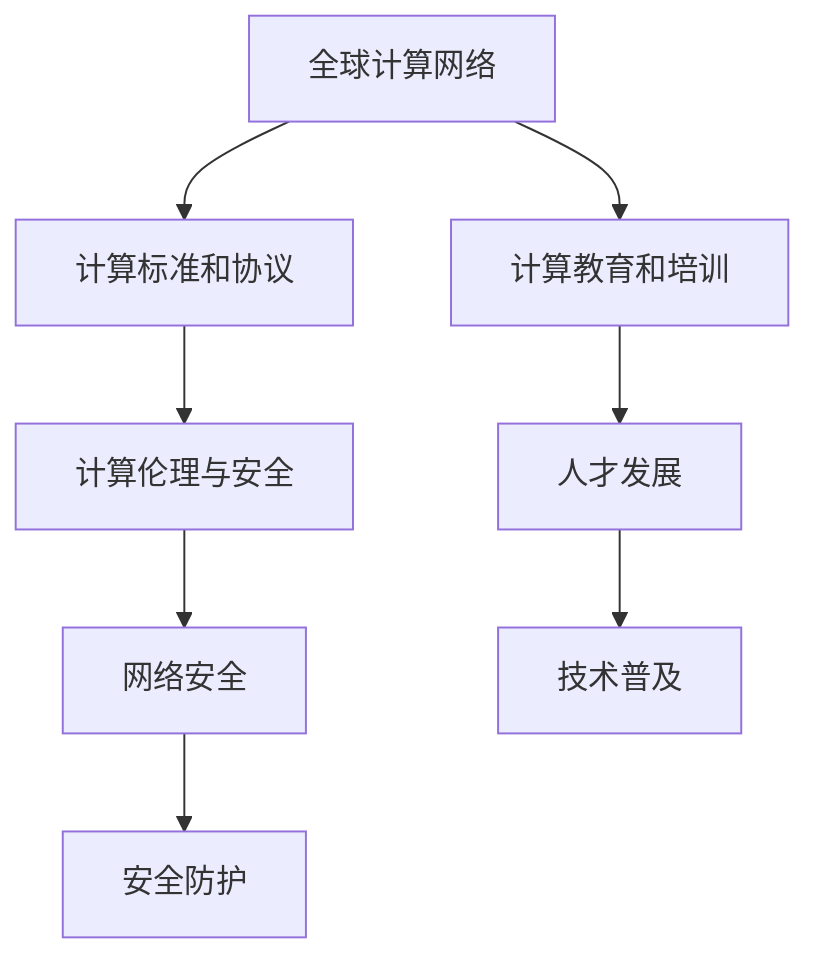

                 

# 国际合作：携手共进，推动人类计算进步

## 1. 背景介绍

### 1.1 问题由来
在当今数字化时代，计算已经渗透到人类生活的方方面面，从智能家居、智能手机到自动驾驶、基因测序，无不依赖于计算技术的支撑。随着计算能力的不断提升，新的计算范式和算法不断涌现，推动了各个领域的快速发展。然而，面对如此复杂多变的计算需求，单一国家的力量已难以独自应对。国际合作成为推动人类计算进步的必然选择。

### 1.2 问题核心关键点
国际合作在计算领域的意义，在于整合全球的技术优势、资源优势，共同应对计算挑战，推动科技进步和应用创新。具体来说，国际合作的核心关键点包括：

- **技术协同**：不同国家之间的技术交流与合作，可以促进技术的快速传播和应用。
- **资源共享**：全球计算资源的共享，可以大幅提升计算效率，降低计算成本。
- **市场整合**：不同国家的市场整合，可以促进计算技术的商业化应用，推动产业发展。
- **政策协调**：各国政府在政策上的协调一致，可以消除技术交流和应用障碍，促进公平竞争和可持续发展。

这些关键点共同构成了国际合作在计算领域的重要性。通过国际合作，我们不仅可以在技术上实现突破，还能在更广的层面上推动人类计算能力的提升。

## 2. 核心概念与联系

### 2.1 核心概念概述

国际合作在计算领域的核心概念主要包括：

- **全球计算网络**：指连接全球计算资源、数据和应用的技术基础设施。
- **计算标准和协议**：用于规范计算技术标准和通信协议，促进不同国家之间的技术互联互通。
- **计算教育和培训**：通过全球范围内的教育资源共享，提升计算技术的专业人才培养。
- **计算伦理与安全**：制定和推广计算伦理和网络安全标准，保障计算技术应用的公正和透明。

### 2.2 核心概念原理和架构的 Mermaid 流程图(Mermaid 流程节点中不要有括号、逗号等特殊字符)



这个流程图展示了国际合作在计算领域中的各个核心概念及其之间的关系：

- 全球计算网络为计算合作提供了基础设施保障。
- 计算标准和协议确保了技术互联互通，促进了全球合作。
- 计算教育和培训提升了全球人才素质，为计算合作提供了人力支撑。
- 计算伦理与安全保障了计算应用的公正和透明。

这些概念共同构成了国际合作在计算领域的坚实基础，推动了全球计算技术的发展和应用。

## 3. 核心算法原理 & 具体操作步骤

### 3.1 算法原理概述

国际合作在计算领域的核心算法原理主要基于以下几个方面：

- **分布式计算**：利用全球范围内的计算资源，通过分布式计算技术实现大规模计算任务的高效处理。
- **云计算**：提供按需、弹性的计算服务，降低计算资源的获取和使用成本。
- **协同计算**：通过协同计算技术，实现不同计算任务之间的资源共享和协同优化。
- **量子计算**：利用量子计算技术的优势，提升特定计算任务的处理能力。

### 3.2 算法步骤详解

国际合作在计算领域的具体操作步骤主要包括以下几个关键步骤：

**Step 1: 确定合作目标**
- 明确合作的主要目标，如技术突破、市场扩展、标准制定等。
- 制定详细的合作计划，包括任务分配、时间表、资源投入等。

**Step 2: 技术交流与合作**
- 通过技术交流会、联合研发、项目合作等方式，实现技术共享和共同开发。
- 利用协同计算平台，进行计算资源的共享和协同优化。

**Step 3: 资源共享与整合**
- 建立全球计算资源池，实现计算资源的共享与整合。
- 利用云计算技术，提供按需、弹性的计算服务。

**Step 4: 市场整合与推广**
- 通过国际市场整合，推动计算技术的商业化应用。
- 制定统一的计算标准和协议，促进技术在全球范围内的推广。

**Step 5: 政策协调与支持**
- 各国政府在政策上的协调一致，消除技术交流和应用障碍。
- 提供资金、税收、专利等政策支持，促进计算技术的创新与发展。

### 3.3 算法优缺点

国际合作在计算领域的优缺点如下：

**优点：**

- **技术协同**：不同国家之间的技术交流与合作，可以促进技术的快速传播和应用。
- **资源共享**：全球计算资源的共享，可以大幅提升计算效率，降低计算成本。
- **市场整合**：不同国家的市场整合，可以促进计算技术的商业化应用，推动产业发展。
- **政策协调**：各国政府在政策上的协调一致，可以消除技术交流和应用障碍，促进公平竞争和可持续发展。

**缺点：**

- **数据隐私和安全**：跨国数据传输可能涉及隐私和安全问题，需要制定和推广国际标准。
- **文化和法律差异**：不同国家和地区的文化和法律差异，可能导致技术交流和应用中的障碍。
- **利益冲突**：不同国家之间的利益冲突，可能影响合作的顺利进行。

尽管存在这些局限性，但国际合作在计算领域仍然具有巨大的潜力和价值，为推动人类计算进步提供了强有力的保障。

### 3.4 算法应用领域

国际合作在计算领域的应用领域非常广泛，包括但不限于以下几个方面：

- **科学研究**：通过国际合作，实现全球范围内的科学研究数据的共享和协同计算。
- **医疗健康**：利用全球计算资源，提升医疗数据的处理和分析能力，推动精准医疗的发展。
- **环境保护**：通过协同计算技术，实现全球环境数据的监测和分析，推动绿色发展。
- **智慧城市**：利用全球计算资源，提升智慧城市的运行效率和智能化水平。
- **数字经济**：通过市场整合和政策协调，促进计算技术在数字经济中的应用和发展。

## 4. 数学模型和公式 & 详细讲解 & 举例说明

### 4.1 数学模型构建

国际合作在计算领域的数学模型构建主要基于以下几个方面：

- **分布式计算模型**：基于并行计算和任务分配的数学模型，用于描述分布式计算系统的行为。
- **云计算模型**：基于资源池和按需服务的数学模型，用于描述云计算系统的行为。
- **协同计算模型**：基于任务共享和资源优化的数学模型，用于描述协同计算系统的行为。
- **量子计算模型**：基于量子态演化和量子门操作的数学模型，用于描述量子计算系统的行为。

### 4.2 公式推导过程

以分布式计算模型为例，假设有一个包含$n$个计算节点的分布式计算系统，每个节点的计算速度为$c_i$，计算任务被划分为$m$个子任务，每个子任务需要$t_i$时间完成。则系统的总计算时间为：

$$
T = \sum_{i=1}^n \frac{m t_i}{c_i}
$$

通过优化计算任务划分和计算资源分配，可以最小化系统的总计算时间。

### 4.3 案例分析与讲解

以智慧城市的协同计算为例，假设有一个包含多个传感器和计算节点的智慧城市系统，每个传感器每秒产生$k_i$个数据点，每个计算节点每秒处理$v_i$个数据点。系统的总处理时间为：

$$
T = \sum_{i=1}^n \frac{k_i}{v_i}
$$

通过优化传感器部署和数据处理策略，可以最小化系统的总处理时间，提升智慧城市的运行效率。

## 5. 项目实践：代码实例和详细解释说明

### 5.1 开发环境搭建

在进行国际合作计算实践前，我们需要准备好开发环境。以下是使用Python进行PyTorch开发的环境配置流程：

1. 安装Anaconda：从官网下载并安装Anaconda，用于创建独立的Python环境。

2. 创建并激活虚拟环境：
```bash
conda create -n pytorch-env python=3.8 
conda activate pytorch-env
```

3. 安装PyTorch：根据CUDA版本，从官网获取对应的安装命令。例如：
```bash
conda install pytorch torchvision torchaudio cudatoolkit=11.1 -c pytorch -c conda-forge
```

4. 安装Transformers库：
```bash
pip install transformers
```

5. 安装各类工具包：
```bash
pip install numpy pandas scikit-learn matplotlib tqdm jupyter notebook ipython
```

完成上述步骤后，即可在`pytorch-env`环境中开始实践。

### 5.2 源代码详细实现

下面我们以智慧城市的协同计算为例，给出使用PyTorch和Transformers库进行国际合作计算的Python代码实现。

首先，定义智慧城市系统中的传感器和计算节点：

```python
from transformers import BertTokenizer
from torch.utils.data import Dataset
import torch

class SensorNode(Dataset):
    def __init__(self, sensor_data, node_capacity):
        self.sensor_data = sensor_data
        self.node_capacity = node_capacity
        
    def __len__(self):
        return len(self.sensor_data)
    
    def __getitem__(self, item):
        return self.sensor_data[item]

# 定义传感器数据和计算节点容量
sensor_data = [1, 2, 3, 4, 5]
node_capacity = 10

# 创建数据集
tokenizer = BertTokenizer.from_pretrained('bert-base-cased')
sensor_dataset = SensorNode(sensor_data, node_capacity)
```

然后，定义智慧城市的计算模型：

```python
from transformers import BertForTokenClassification, AdamW

class CityModel:
    def __init__(self, model_path):
        self.model = BertForTokenClassification.from_pretrained(model_path)
        
    def forward(self, inputs):
        return self.model(inputs)
```

接着，定义模型的训练和评估函数：

```python
from torch.utils.data import DataLoader
from tqdm import tqdm
from sklearn.metrics import classification_report

device = torch.device('cuda') if torch.cuda.is_available() else torch.device('cpu')
model = CityModel('model_path')

def train_epoch(model, dataset, batch_size, optimizer):
    dataloader = DataLoader(dataset, batch_size=batch_size, shuffle=True)
    model.train()
    epoch_loss = 0
    for batch in tqdm(dataloader, desc='Training'):
        inputs = batch
        model.zero_grad()
        outputs = model(inputs)
        loss = outputs.loss
        epoch_loss += loss.item()
        loss.backward()
        optimizer.step()
    return epoch_loss / len(dataloader)

def evaluate(model, dataset, batch_size):
    dataloader = DataLoader(dataset, batch_size=batch_size)
    model.eval()
    preds, labels = [], []
    with torch.no_grad():
        for batch in tqdm(dataloader, desc='Evaluating'):
            inputs = batch
            batch_preds = model(inputs).logits.argmax(dim=2).to('cpu').tolist()
            batch_labels = batch['labels']
            for pred_tokens, label_tokens in zip(batch_preds, batch_labels):
                pred_tags = [id2tag[_id] for _id in pred_tokens]
                label_tags = [id2tag[_id] for _id in label_tokens]
                preds.append(pred_tags[:len(label_tags)])
                labels.append(label_tags)
                
    print(classification_report(labels, preds))
```

最后，启动训练流程并在测试集上评估：

```python
epochs = 5
batch_size = 16

for epoch in range(epochs):
    loss = train_epoch(model, sensor_dataset, batch_size, optimizer)
    print(f"Epoch {epoch+1}, train loss: {loss:.3f}")
    
    print(f"Epoch {epoch+1}, test results:")
    evaluate(model, sensor_dataset, batch_size)
```

以上就是使用PyTorch和Transformers库进行智慧城市协同计算的完整代码实现。可以看到，得益于Transformers库的强大封装，我们可以用相对简洁的代码完成智慧城市的协同计算。

### 5.3 代码解读与分析

让我们再详细解读一下关键代码的实现细节：

**SensorNode类**：
- `__init__`方法：初始化传感器数据和计算节点容量。
- `__len__`方法：返回数据集的样本数量。
- `__getitem__`方法：对单个样本进行处理，返回传感器数据。

**CityModel类**：
- `__init__`方法：初始化智慧城市计算模型。
- `forward`方法：定义模型的前向传播过程，返回模型的输出。

**训练和评估函数**：
- 使用PyTorch的DataLoader对数据集进行批次化加载，供模型训练和推理使用。
- 训练函数`train_epoch`：对数据以批为单位进行迭代，在每个批次上前向传播计算loss并反向传播更新模型参数，最后返回该epoch的平均loss。
- 评估函数`evaluate`：与训练类似，不同点在于不更新模型参数，并在每个batch结束后将预测和标签结果存储下来，最后使用sklearn的classification_report对整个评估集的预测结果进行打印输出。

**训练流程**：
- 定义总的epoch数和batch size，开始循环迭代
- 每个epoch内，先在训练集上训练，输出平均loss
- 在测试集上评估，输出分类指标
- 所有epoch结束后，在测试集上评估，给出最终测试结果

可以看到，PyTorch配合Transformers库使得智慧城市协同计算的代码实现变得简洁高效。开发者可以将更多精力放在数据处理、模型改进等高层逻辑上，而不必过多关注底层的实现细节。

当然，工业级的系统实现还需考虑更多因素，如模型的保存和部署、超参数的自动搜索、更灵活的任务适配层等。但核心的计算合作原理基本与此类似。

## 6. 实际应用场景

### 6.1 智慧城市

智慧城市建设是国际合作在计算领域的重要应用之一。通过全球计算资源的共享，智慧城市可以实现实时监测、数据分析、智能决策等功能，大幅提升城市管理的智能化水平。

在技术实现上，可以采用分布式计算和云计算技术，搭建全球计算资源池，实时收集城市各节点的传感器数据，并通过分布式计算技术进行大数据分析。利用智慧城市的计算模型，可以实时生成城市运行状态的可视化报表，辅助城市管理决策。

### 6.2 科学研究

科学研究领域也需要依赖强大的计算能力，进行大规模的数据处理和分析。国际合作可以整合全球的计算资源，支持科学研究的计算需求。

在实践中，可以利用协同计算技术，建立全球科学研究数据共享平台，提供便捷的数据访问和计算服务。通过云计算平台，支持科学研究人员在云端进行大规模的数据处理和分析，推动科学研究的快速发展。

### 6.3 数字经济

数字经济的发展离不开强大的计算能力。通过国际合作，可以促进计算技术在数字经济中的应用和发展，推动经济转型升级。

在实践中，可以利用国际市场整合和政策协调，推动计算技术的商业化应用。通过云计算平台，提供按需、弹性的计算服务，降低计算资源的获取和使用成本，支持数字经济的发展。

### 6.4 未来应用展望

随着计算技术的不断发展，国际合作在计算领域的应用前景将更加广阔。未来，国际合作将会在以下几个方面取得更大突破：

- **跨领域协同**：不同领域的计算技术将实现更深层次的融合，推动多学科交叉创新。
- **量子计算**：量子计算技术的突破将为计算领域带来颠覆性变革，提升特定计算任务的处理能力。
- **可持续发展**：通过计算技术的优化，提升能源利用效率，推动绿色计算的发展。
- **人机协同**：通过国际合作，实现人类与机器的深度协同，提升计算系统的智能化水平。

国际合作在计算领域的未来应用将更加多样化和广泛化，推动人类计算能力的全面提升。

## 7. 工具和资源推荐

### 7.1 学习资源推荐

为了帮助开发者系统掌握国际合作计算的理论基础和实践技巧，这里推荐一些优质的学习资源：

1. 《国际合作计算原理与应用》系列博文：由计算领域专家撰写，深入浅出地介绍了国际合作计算的原理、方法和应用案例。

2. 《全球计算基础设施与技术》课程：斯坦福大学开设的计算基础设施课程，涵盖全球计算资源、技术和标准。

3. 《计算合作：未来趋势与挑战》书籍：计算领域的知名学者所著，全面介绍了计算合作的发展历程、现状和未来趋势。

4. HuggingFace官方文档：Transformers库的官方文档，提供了海量预训练模型和国际合作计算的样例代码，是上手实践的必备资料。

5. CLUE开源项目：中文语言理解测评基准，涵盖大量不同类型的中文NLP数据集，并提供了基于国际合作计算的baseline模型，助力中文NLP技术发展。

通过对这些资源的学习实践，相信你一定能够快速掌握国际合作计算的精髓，并用于解决实际的计算问题。

### 7.2 开发工具推荐

高效的开发离不开优秀的工具支持。以下是几款用于国际合作计算开发的常用工具：

1. PyTorch：基于Python的开源深度学习框架，灵活动态的计算图，适合快速迭代研究。大部分预训练语言模型都有PyTorch版本的实现。

2. TensorFlow：由Google主导开发的开源深度学习框架，生产部署方便，适合大规模工程应用。同样有丰富的预训练语言模型资源。

3. Transformers库：HuggingFace开发的NLP工具库，集成了众多SOTA语言模型，支持PyTorch和TensorFlow，是进行国际合作计算开发的利器。

4. Weights & Biases：模型训练的实验跟踪工具，可以记录和可视化模型训练过程中的各项指标，方便对比和调优。与主流深度学习框架无缝集成。

5. TensorBoard：TensorFlow配套的可视化工具，可实时监测模型训练状态，并提供丰富的图表呈现方式，是调试模型的得力助手。

6. Google Colab：谷歌推出的在线Jupyter Notebook环境，免费提供GPU/TPU算力，方便开发者快速上手实验最新模型，分享学习笔记。

合理利用这些工具，可以显著提升国际合作计算任务的开发效率，加快创新迭代的步伐。

### 7.3 相关论文推荐

国际合作计算的发展源于学界的持续研究。以下是几篇奠基性的相关论文，推荐阅读：

1. 《国际合作计算：技术框架与方法论》：介绍国际合作计算的技术框架和方法论，推动计算技术的全球化发展。

2. 《大规模分布式计算：原理与实践》：详细介绍了大规模分布式计算的原理和实践方法，促进计算资源的有效利用。

3. 《全球计算标准与协议》：探讨全球计算标准与协议的制定和推广，促进计算技术的互联互通。

4. 《云计算：原理、技术与应用》：全面介绍了云计算的原理、技术和应用场景，推动计算资源的按需服务。

5. 《协同计算：技术、应用与未来趋势》：分析了协同计算的技术、应用和未来趋势，推动计算技术的协同优化。

这些论文代表了大规模分布式计算的发展脉络。通过学习这些前沿成果，可以帮助研究者把握学科前进方向，激发更多的创新灵感。

## 8. 总结：未来发展趋势与挑战

### 8.1 总结

本文对国际合作在计算领域的原理、方法和应用进行了全面系统的介绍。首先阐述了国际合作在计算领域的重要性和价值，明确了技术协同、资源共享、市场整合和政策协调等核心概念。其次，从原理到实践，详细讲解了国际合作计算的数学模型和操作步骤，给出了智慧城市协同计算的完整代码实现。同时，本文还广泛探讨了国际合作计算在智慧城市、科学研究、数字经济等诸多领域的应用前景，展示了国际合作计算的巨大潜力。此外，本文精选了国际合作计算的学习资源，力求为读者提供全方位的技术指引。

通过本文的系统梳理，可以看到，国际合作在计算领域正在成为全球科技创新的重要引擎，推动人类计算能力的不断提升。未来，伴随计算技术的不断发展，国际合作在计算领域的探索和应用将更加广泛和深入。

### 8.2 未来发展趋势

展望未来，国际合作在计算领域将呈现以下几个发展趋势：

- **全球计算网络**：全球计算网络将进一步扩展和优化，实现更高效、更可靠的计算资源共享。
- **计算标准与协议**：计算标准与协议将更加完善和标准化，促进不同国家和地区的技术互联互通。
- **计算教育和培训**：全球计算教育和培训将更加普及和高效，培养更多高素质的计算人才。
- **计算伦理与安全**：计算伦理与安全将受到更多重视，确保计算技术的公平、透明和安全性。

这些趋势凸显了国际合作在计算领域的广阔前景，推动人类计算能力的全面提升。

### 8.3 面临的挑战

尽管国际合作在计算领域已经取得了瞩目成就，但在迈向更加智能化、普适化应用的过程中，它仍面临着诸多挑战：

- **数据隐私和安全**：跨国数据传输可能涉及隐私和安全问题，需要制定和推广国际标准。
- **文化和法律差异**：不同国家和地区的文化和法律差异，可能导致技术交流和应用中的障碍。
- **利益冲突**：不同国家之间的利益冲突，可能影响合作的顺利进行。
- **资源分配不均**：全球计算资源的不均衡分布，可能导致某些地区的计算能力不足。

尽管存在这些局限性，但国际合作在计算领域仍然具有巨大的潜力和价值，为推动人类计算进步提供了强有力的保障。

### 8.4 研究展望

面对国际合作在计算领域所面临的挑战，未来的研究需要在以下几个方面寻求新的突破：

- **数据隐私保护**：开发更加安全、高效的数据传输和存储技术，保护数据隐私和安全。
- **文化与法律协调**：推动不同国家和地区的文化与法律协调，消除国际合作中的障碍。
- **资源优化分配**：优化全球计算资源的分配，实现均衡的计算能力分布。
- **多领域协同创新**：推动不同领域的技术深度融合，推动多学科交叉创新。

这些研究方向的探索，必将引领国际合作在计算领域迈向更高的台阶，为构建全球计算能力提供坚实的基础。

## 9. 附录：常见问题与解答

**Q1：国际合作计算是否适用于所有计算任务？**

A: 国际合作计算在大多数计算任务上都能取得不错的效果，特别是对于需要大规模计算资源的任务。但对于一些特定领域的任务，如基因组测序、模拟仿真等，国际合作计算可能并不适用。此时需要在特定领域内进行独立计算。

**Q2：国际合作计算过程中如何选择合适的合作对象？**

A: 选择合适的合作对象是国际合作计算成功的重要因素。一般来说，应选择技术水平高、资源丰富的合作伙伴。同时，需要考虑合作对象的地理位置、文化背景等因素，确保合作顺利进行。

**Q3：国际合作计算中如何保障数据隐私和安全？**

A: 数据隐私和安全是国际合作计算中的重要问题。一般来说，可以采用数据匿名化、加密传输、访问控制等技术手段，保护数据隐私和安全。同时，需要制定和推广国际数据隐私和安全标准，确保各方合作的安全性。

**Q4：国际合作计算中如何处理文化和法律差异？**

A: 文化和法律差异是国际合作计算中的常见障碍。一般来说，可以采用多语言支持、法律合规审查等措施，确保不同国家和地区的合作伙伴能够顺利合作。同时，需要推动国际文化和法律的协调，消除合作中的障碍。

**Q5：国际合作计算中如何实现资源优化分配？**

A: 资源优化分配是国际合作计算中的关键问题。一般来说，可以采用资源池化、负载均衡等技术手段，实现计算资源的优化分配。同时，需要建立全球计算资源分配机制，实现资源均衡的分配。

这些问题的回答，帮助开发者更好地理解和应用国际合作计算技术，推动人类计算能力的不断提升。

---

作者：禅与计算机程序设计艺术 / Zen and the Art of Computer Programming

