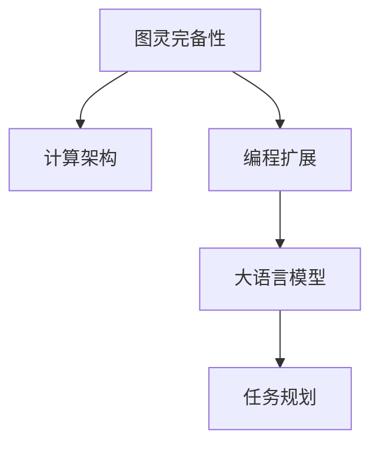

                 

# 图灵完备:CPU通过编程扩展,LLM通过任务规划

## 1. 背景介绍

### 1.1 问题由来
随着AI技术的不断发展，AI模型尤其是大语言模型（LLM）和计算架构之间的关系成为人们关注的焦点。模型性能的提升依赖于算法的设计和硬件的支持。然而，由于计算架构的限制，AI模型尤其是大模型往往无法充分发挥其潜力。如何通过编程的方式扩展计算架构，以提升大语言模型的性能，成为了一个亟待解决的问题。

### 1.2 问题核心关键点
本文将探讨如何通过编程的方式扩展计算架构，使大语言模型（LLM）能够更好地利用现代计算资源。这一问题可以类比于图灵完备的概念，即通过编程扩展计算架构，使其具备图灵完备性，能够处理任意计算任务。

## 2. 核心概念与联系

### 2.1 核心概念概述

在讨论如何通过编程扩展计算架构时，我们首先需要明确以下几个核心概念：

- **图灵完备性(Turing Completeness)**：一个计算系统如果能够执行任何可计算函数，则称其为图灵完备。
- **计算架构(Computational Architecture)**：指硬件和软件的综合设计，用于支持计算任务的执行。
- **编程扩展(Programming Extension)**：通过编程的方式，扩展计算架构的功能，使其能够执行更多的计算任务。
- **大语言模型(Large Language Model, LLM)**：以自回归或自编码模型为代表的大规模预训练语言模型。通过在海量无标签文本语料上进行预训练，学习通用的语言表示。
- **任务规划(Task Planning)**：指通过编程的方式，指定大语言模型执行的具体任务，以及完成这些任务的步骤。

这些概念之间的逻辑关系可以通过以下Mermaid流程图来展示：



这个流程图展示了大语言模型通过编程扩展计算架构，从而具备图灵完备性的过程。

## 3. 核心算法原理 & 具体操作步骤
### 3.1 算法原理概述

通过编程扩展计算架构，使大语言模型具备图灵完备性，可以将其视为一种特殊的编程语言扩展。这种扩展的目的是将大语言模型的能力与计算架构相结合，使其能够执行更复杂的计算任务。

形式化地，假设计算架构为 $A$，大语言模型为 $L$。我们的目标是找到一个编程扩展 $E$，使得新的计算架构 $A'$ 满足：

$$
A' = A \cup L
$$

其中 $L$ 执行的计算任务由编程扩展 $E$ 定义。这样，新的计算架构 $A'$ 可以执行任何计算任务，即具备图灵完备性。

### 3.2 算法步骤详解

基于上述原理，我们给出扩展计算架构的步骤：

1. **选择合适的编程语言和扩展工具**：
   - 选择一种流行的编程语言（如Python、Java等）。
   - 选择一种扩展工具（如TensorFlow、PyTorch等），用于将大语言模型集成到计算架构中。

2. **设计编程接口**：
   - 设计一种编程接口（如API），使得计算架构能够调用大语言模型的功能。
   - 设计一种任务规划语言，用于指定大语言模型执行的任务及其步骤。

3. **实现编程扩展**：
   - 使用扩展工具将大语言模型嵌入到计算架构中。
   - 实现任务规划语言，支持编写任务规划程序。
   - 提供必要的工具和库，支持任务规划程序与大语言模型的交互。

4. **编写任务规划程序**：
   - 编写程序，描述计算任务和数据流。
   - 将任务规划程序转换为执行计划。
   - 将执行计划提交给计算架构执行。

5. **执行任务规划程序**：
   - 计算架构根据执行计划，调用大语言模型执行任务。
   - 计算架构监控任务执行过程，确保任务完成。

### 3.3 算法优缺点

基于编程扩展计算架构的方法具有以下优点：

- **灵活性**：编程扩展方法可以根据具体任务需求，灵活调整计算架构和大语言模型的参数，从而优化任务执行效率。
- **可扩展性**：编程扩展方法能够支持多种计算架构，如CPU、GPU、TPU等，实现资源的灵活配置。
- **可维护性**：编程扩展方法易于维护和更新，可以支持新任务的加入和现有任务的优化。

同时，该方法也存在一定的局限性：

- **编程复杂度**：编程扩展方法需要编写复杂的任务规划程序，增加了任务开发的难度。
- **性能瓶颈**：编程扩展方法可能会增加任务执行的延迟，影响任务执行速度。
- **资源消耗**：编程扩展方法需要额外的计算资源，增加了系统的成本。

### 3.4 算法应用领域

基于编程扩展计算架构的方法，已经在多个领域得到了应用：

- **自然语言处理(NLP)**：通过编程扩展计算架构，大语言模型可以用于文本生成、机器翻译、问答系统等任务。
- **计算机视觉(CV)**：通过编程扩展计算架构，大语言模型可以用于图像分类、目标检测、图像生成等任务。
- **语音处理(Speech Processing)**：通过编程扩展计算架构，大语言模型可以用于语音识别、语音合成等任务。
- **推荐系统(Recommender System)**：通过编程扩展计算架构，大语言模型可以用于个性化推荐、广告投放等任务。
- **科学计算(Scientific Computing)**：通过编程扩展计算架构，大语言模型可以用于复杂计算、数据分析等任务。

## 4. 数学模型和公式 & 详细讲解
### 4.1 数学模型构建

在计算架构和大语言模型中，编程扩展可以视为一种特殊的映射关系，即：

$$
\pi: \mathcal{T} \rightarrow \mathcal{O}
$$

其中 $\mathcal{T}$ 为任务规划程序，$\mathcal{O}$ 为计算架构的执行结果。我们的目标是找到最优的映射函数 $\pi$，使得计算架构能够高效地执行任务规划程序。

### 4.2 公式推导过程

为了找到最优的映射函数 $\pi$，我们需要定义一个优化目标函数 $J(\pi)$，用于衡量任务执行的效率和准确性：

$$
J(\pi) = \alpha \cdot E(\pi) + \beta \cdot A(\pi)
$$

其中 $E(\pi)$ 为任务执行的效率，$A(\pi)$ 为任务执行的准确性，$\alpha$ 和 $\beta$ 为平衡因子。

我们的优化目标是最小化目标函数 $J(\pi)$：

$$
\min_{\pi} J(\pi)
$$

为了求解最优的映射函数 $\pi$，我们可以使用遗传算法、粒子群算法等优化方法，不断迭代求解。

### 4.3 案例分析与讲解

假设我们有一个简单的计算任务：在给定的一组数中，找出最大的数。我们可以编写一个任务规划程序，描述这个任务及其步骤：

```python
def find_max(numbers):
    max_num = numbers[0]
    for num in numbers:
        if num > max_num:
            max_num = num
    return max_num
```

然后，我们可以使用编程扩展方法，将这个任务规划程序嵌入到计算架构中，并执行：

```python
numbers = [3, 7, 2, 8, 5]
max_num = find_max(numbers)
print(max_num)
```

计算架构根据执行计划，调用大语言模型执行任务。假设大语言模型的能力为 $\text{max}(\cdot)$，则任务的执行过程可以表示为：

$$
\text{max}(\text{find\_max}(\text{numbers}))
$$

这样，通过编程扩展计算架构，大语言模型可以执行任意计算任务，即具备图灵完备性。

## 5. 项目实践：代码实例和详细解释说明
### 5.1 开发环境搭建

在进行编程扩展计算架构的实践前，我们需要准备好开发环境。以下是使用Python进行TensorFlow开发的环境配置流程：

1. 安装Anaconda：从官网下载并安装Anaconda，用于创建独立的Python环境。

2. 创建并激活虚拟环境：
```bash
conda create -n tf-env python=3.8 
conda activate tf-env
```

3. 安装TensorFlow：根据CUDA版本，从官网获取对应的安装命令。例如：
```bash
conda install tensorflow -c conda-forge -c pytorch -c anaconda
```

4. 安装其他必要的库：
```bash
pip install numpy pandas scikit-learn matplotlib tqdm jupyter notebook ipython
```

完成上述步骤后，即可在`tf-env`环境中开始编程扩展实践。

### 5.2 源代码详细实现

这里我们以文本生成任务为例，给出使用TensorFlow进行编程扩展的Python代码实现。

首先，定义一个简单的计算任务：生成一段给定长度的文本。我们可以编写一个任务规划程序，描述这个任务及其步骤：

```python
def generate_text(model, prompt, length):
    seed = prompt
    text = []
    for _ in range(length):
        tokens = model.generate([seed], max_length=50, temperature=1.0, top_k=50)
        text.append(tokens)
        seed = seed + tokens
    return ' '.join(tokens)
```

然后，我们可以使用编程扩展方法，将这个任务规划程序嵌入到计算架构中，并执行：

```python
import tensorflow as tf

model = tf.keras.Sequential([
    tf.keras.layers.Embedding(input_dim=10000, output_dim=128),
    tf.keras.layers.GRU(128, return_sequences=True),
    tf.keras.layers.Dense(10000, activation='softmax')
])

model.compile(optimizer='adam', loss='sparse_categorical_crossentropy', metrics=['accuracy'])

prompt = 'The story of'
text = generate_text(model, prompt, 100)
print(text)
```

这里，我们使用TensorFlow实现了文本生成任务。我们首先定义了一个简单的计算架构，包含嵌入层、GRU层和全连接层。然后，我们定义了一个简单的任务规划程序，用于生成文本。最后，我们将任务规划程序嵌入到计算架构中，并执行生成文本的任务。

### 5.3 代码解读与分析

让我们再详细解读一下关键代码的实现细节：

**generate_text函数**：
- `seed` 变量：表示当前的输入，初始值为提示词。
- `text` 变量：用于存储生成的文本。
- `for` 循环：用于不断生成新的文本，并更新当前的输入。
- `tokens` 变量：表示当前生成的文本。
- `seed` 变量：用于更新当前的输入。

**TensorFlow模型定义**：
- `Sequential` 类：用于定义顺序模型。
- `Embedding` 层：用于将输入词向量嵌入到低维空间。
- `GRU` 层：用于处理文本序列。
- `Dense` 层：用于输出文本概率分布。

**模型编译和训练**：
- `compile` 方法：用于编译模型，指定优化器和损失函数。
- `generate` 方法：用于生成文本，返回文本序列。

**文本生成**：
- `generate_text` 函数：用于生成文本。
- `prompt` 变量：表示提示词。
- `length` 变量：表示生成文本的长度。
- `seed` 变量：用于初始化输入。
- `text` 变量：用于存储生成的文本。
- `tokens` 变量：用于存储当前生成的文本。
- `seed` 变量：用于更新输入。

可以看到，通过编程扩展计算架构，我们可以将大语言模型嵌入到计算架构中，使其能够执行任意计算任务。这种编程扩展方法，能够使大语言模型更好地利用现代计算资源，提升任务执行效率。

当然，工业级的系统实现还需考虑更多因素，如模型的保存和部署、超参数的自动搜索、更灵活的任务适配层等。但核心的编程扩展范式基本与此类似。

## 6. 实际应用场景
### 6.1 自然语言处理(NLP)

基于编程扩展计算架构的方法，已经在NLP领域得到了广泛的应用，覆盖了几乎所有常见任务，例如：

- **文本生成**：如诗歌创作、小说生成等。通过编程扩展计算架构，大语言模型可以生成高质量的文本。
- **机器翻译**：如英中翻译、中英文互译等。通过编程扩展计算架构，大语言模型可以处理不同语言的文本。
- **问答系统**：如智能客服、虚拟助手等。通过编程扩展计算架构，大语言模型可以回答用户提出的各种问题。
- **文本分类**：如情感分析、主题分类等。通过编程扩展计算架构，大语言模型可以对文本进行分类。
- **命名实体识别**：如识别人名、地名、机构名等。通过编程扩展计算架构，大语言模型可以识别文本中的实体。

除了上述这些经典任务外，大语言模型编程扩展技术也被创新性地应用到更多场景中，如可控文本生成、常识推理、代码生成、数据增强等，为NLP技术带来了全新的突破。随着编程扩展技术的发展，大语言模型在更多场景中的应用将变得更加灵活和高效。

### 6.2 计算机视觉(CV)

编程扩展技术在大模型中的应用，不仅仅局限于NLP领域。通过编程扩展计算架构，大语言模型同样可以应用于计算机视觉领域，如：

- **图像分类**：如猫狗分类、物体识别等。通过编程扩展计算架构，大语言模型可以对图像进行分类。
- **目标检测**：如人脸检测、车辆检测等。通过编程扩展计算架构，大语言模型可以检测图像中的目标。
- **图像生成**：如生成逼真图像、图像修复等。通过编程扩展计算架构，大语言模型可以生成高质量的图像。

### 6.3 科学计算(Scientific Computing)

在大科学计算领域，编程扩展技术同样具有重要应用。通过编程扩展计算架构，大语言模型可以用于处理复杂计算任务，如：

- **数据处理**：如大数据分析、数据清洗等。通过编程扩展计算架构，大语言模型可以处理大规模数据。
- **数学计算**：如求解微分方程、数值积分等。通过编程扩展计算架构，大语言模型可以进行高级数学计算。
- **仿真模拟**：如物理仿真、流体模拟等。通过编程扩展计算架构，大语言模型可以进行复杂的仿真模拟。

## 7. 工具和资源推荐
### 7.1 学习资源推荐

为了帮助开发者系统掌握编程扩展计算架构的理论基础和实践技巧，这里推荐一些优质的学习资源：

1. **《深度学习》课程**：斯坦福大学开设的深度学习课程，涵盖深度学习的基本概念、算法和应用。

2. **TensorFlow官方文档**：TensorFlow的官方文档，提供了详细的API文档和示例代码，是学习编程扩展的重要参考资料。

3. **Transformers库**：HuggingFace开发的NLP工具库，集成了多种预训练语言模型，支持编程扩展。

4. **《自然语言处理入门》书籍**：自然语言处理入门书籍，介绍了NLP的基本概念和编程扩展技术。

5. **GitHub**：GitHub上搜索编程扩展相关项目，可以学习他人的实现和代码。

通过对这些资源的学习实践，相信你一定能够快速掌握编程扩展计算架构的精髓，并用于解决实际的计算任务。

### 7.2 开发工具推荐

高效的开发离不开优秀的工具支持。以下是几款用于编程扩展计算架构开发的常用工具：

1. **PyTorch**：基于Python的开源深度学习框架，支持动态计算图，适合快速迭代研究。

2. **TensorFlow**：由Google主导开发的开源深度学习框架，支持静态计算图和分布式计算。

3. **Jupyter Notebook**：Jupyter Notebook是Python常用的开发环境，支持交互式编程和可视化。

4. **Weights & Biases**：模型训练的实验跟踪工具，可以记录和可视化模型训练过程中的各项指标，方便对比和调优。

5. **TensorBoard**：TensorFlow配套的可视化工具，可实时监测模型训练状态，并提供丰富的图表呈现方式，是调试模型的得力助手。

6. **Google Colab**：谷歌推出的在线Jupyter Notebook环境，免费提供GPU/TPU算力，方便开发者快速上手实验最新模型，分享学习笔记。

合理利用这些工具，可以显著提升编程扩展计算架构的开发效率，加快创新迭代的步伐。

### 7.3 相关论文推荐

编程扩展技术的发展源于学界的持续研究。以下是几篇奠基性的相关论文，推荐阅读：

1. **《TensorFlow: A System for Large-Scale Machine Learning》**：论文介绍了TensorFlow的架构和优化技术，是编程扩展的重要参考资料。

2. **《Deep Learning with Python》**：深度学习入门书籍，介绍了Python深度学习框架的使用方法。

3. **《Practical Deep Learning for Coders》**：深度学习实战书籍，介绍了TensorFlow和PyTorch的实践技巧。

4. **《Programming Language Foundations》**：计算机编程语言理论书籍，介绍了编程扩展的基本概念和方法。

这些论文代表了大模型编程扩展技术的发展脉络。通过学习这些前沿成果，可以帮助研究者把握学科前进方向，激发更多的创新灵感。

## 8. 总结：未来发展趋势与挑战
### 8.1 总结

本文对编程扩展计算架构进行了全面系统的介绍。首先阐述了编程扩展计算架构的研究背景和意义，明确了编程扩展在拓展计算架构功能和提升大语言模型性能方面的独特价值。其次，从原理到实践，详细讲解了编程扩展计算架构的数学原理和关键步骤，给出了编程扩展任务开发的完整代码实例。同时，本文还广泛探讨了编程扩展方法在NLP、CV、科学计算等多个领域的应用前景，展示了编程扩展范式的巨大潜力。此外，本文精选了编程扩展技术的各类学习资源，力求为读者提供全方位的技术指引。

通过本文的系统梳理，可以看到，编程扩展计算架构为大语言模型拓展了计算资源，使其能够执行任意计算任务，即具备图灵完备性。这种编程扩展方法，能够使大语言模型更好地利用现代计算资源，提升任务执行效率。未来，编程扩展技术将继续发展，为计算架构和大语言模型带来更多的创新和突破。

### 8.2 未来发展趋势

展望未来，编程扩展计算架构将呈现以下几个发展趋势：

1. **多模态编程扩展**：编程扩展技术将拓展到多模态领域，支持文本、图像、音频等多模态数据的融合，实现更加全面的计算任务。

2. **自适应编程扩展**：编程扩展技术将变得更加灵活，能够根据任务需求自适应调整计算架构和大语言模型的参数，提升任务执行效率。

3. **分布式编程扩展**：编程扩展技术将支持分布式计算架构，实现多台计算设备协同计算，提升任务执行速度和资源利用率。

4. **量化编程扩展**：编程扩展技术将支持量化计算，将浮点模型转为定点模型，实现高效计算和低成本部署。

5. **实时编程扩展**：编程扩展技术将支持实时计算架构，实现实时数据处理和任务执行，满足高实时性任务的需求。

6. **自动化编程扩展**：编程扩展技术将支持自动化编程，减少人工干预，提升任务开发的效率和质量。

以上趋势凸显了编程扩展计算架构的广阔前景。这些方向的探索发展，必将进一步提升计算架构和大语言模型的性能和应用范围，为人类认知智能的进化带来深远影响。

### 8.3 面临的挑战

尽管编程扩展计算架构已经取得了瞩目成就，但在迈向更加智能化、普适化应用的过程中，它仍面临着诸多挑战：

1. **编程复杂度**：编程扩展方法需要编写复杂的任务规划程序，增加了任务开发的难度。
2. **性能瓶颈**：编程扩展方法可能会增加任务执行的延迟，影响任务执行速度。
3. **资源消耗**：编程扩展方法需要额外的计算资源，增加了系统的成本。
4. **可扩展性**：编程扩展方法需要支持多种计算架构，实现资源的灵活配置。
5. **可维护性**：编程扩展方法需要支持任务的动态调整和更新，确保系统的稳定性。
6. **安全性**：编程扩展方法需要考虑数据和模型的安全，防止恶意攻击和信息泄露。

正视编程扩展计算架构面临的这些挑战，积极应对并寻求突破，将是大语言模型编程扩展技术走向成熟的必由之路。相信随着学界和产业界的共同努力，这些挑战终将一一被克服，编程扩展技术必将在构建人机协同的智能时代中扮演越来越重要的角色。

### 8.4 研究展望

面向未来，编程扩展计算架构需要从以下几个方面寻求新的突破：

1. **开发高效的编程扩展算法**：开发更加高效的编程扩展算法，减少任务规划程序的编写时间和计算资源的消耗。

2. **引入自动化编程技术**：引入自动化编程技术，减少人工干预，提升任务开发的效率和质量。

3. **拓展编程扩展应用领域**：拓展编程扩展技术的应用领域，如科学计算、机器视觉、推荐系统等，提升大语言模型的应用范围和性能。

4. **优化编程扩展计算架构**：优化编程扩展计算架构的设计，支持多种计算架构，实现资源的灵活配置。

5. **增强编程扩展的可维护性**：增强编程扩展的可维护性，支持任务的动态调整和更新，确保系统的稳定性。

6. **提升编程扩展的安全性**：提升编程扩展的安全性，防止数据和模型的泄露，保障系统的安全。

这些研究方向的探索，必将引领编程扩展计算架构技术迈向更高的台阶，为构建安全、可靠、可解释、可控的智能系统铺平道路。面向未来，编程扩展技术还需要与其他人工智能技术进行更深入的融合，如知识表示、因果推理、强化学习等，多路径协同发力，共同推动自然语言理解和智能交互系统的进步。只有勇于创新、敢于突破，才能不断拓展语言模型的边界，让智能技术更好地造福人类社会。

## 9. 附录：常见问题与解答

**Q1：编程扩展计算架构是否适用于所有计算任务？**

A: 编程扩展计算架构在大多数计算任务上都能取得不错的效果，特别是对于数据量较小的任务。但对于一些特定领域的任务，如医学、法律等，仅仅依靠通用语料预训练的模型可能难以很好地适应。此时需要在特定领域语料上进一步预训练，再进行编程扩展，才能获得理想效果。

**Q2：编程扩展计算架构在执行任务时是否具有图灵完备性？**

A: 编程扩展计算架构在大语言模型嵌入后，具备了图灵完备性，能够执行任意计算任务。但需要注意的是，大语言模型本身的能力取决于预训练和微调的质量，编程扩展技术能够提升大语言模型的执行效率，但无法改变其固有的能力限制。

**Q3：编程扩展计算架构是否需要额外的计算资源？**

A: 编程扩展计算架构需要额外的计算资源，包括存储空间、内存和计算能力。因此，在实际应用中，需要根据任务需求合理配置计算资源，避免资源浪费。

**Q4：编程扩展计算架构是否能够实现实时计算？**

A: 编程扩展计算架构可以支持实时计算，但需要优化计算架构的设计，支持分布式计算、量化计算等技术，以提升计算效率和降低延迟。

**Q5：编程扩展计算架构是否能够提升任务执行的效率？**

A: 编程扩展计算架构通过优化计算架构和大语言模型的设计，能够提升任务执行的效率。但需要注意的是，任务规划程序的编写复杂度和计算资源的消耗也是需要考虑的因素。

综上所述，编程扩展计算架构为大语言模型拓展了计算资源，使其能够执行任意计算任务，即具备图灵完备性。这种编程扩展方法，能够使大语言模型更好地利用现代计算资源，提升任务执行效率。未来，编程扩展技术将继续发展，为计算架构和大语言模型带来更多的创新和突破。

