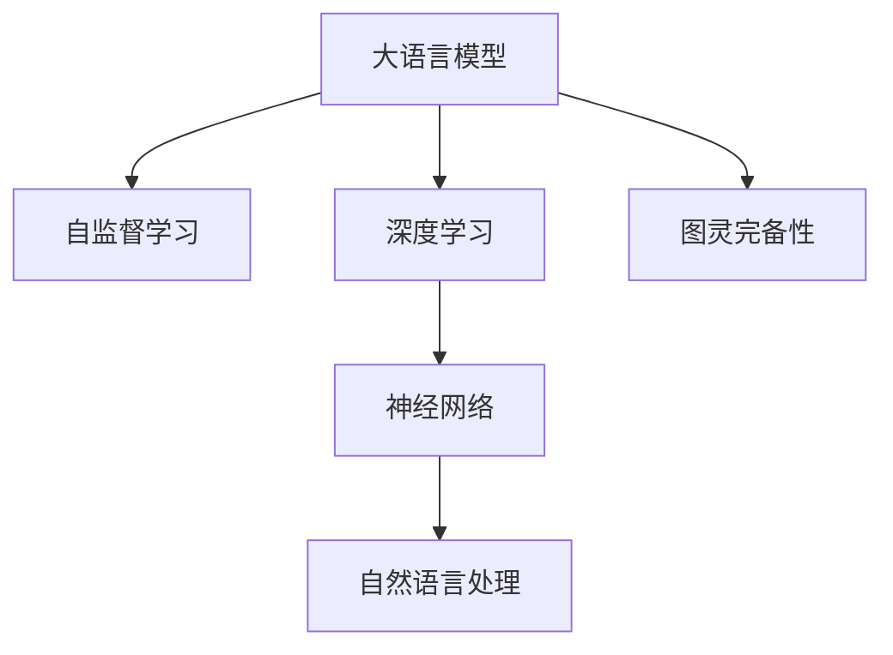

                 

# 图灵完备性：LLM 成为通用人工智能关键

> 关键词：
1. 图灵完备性
2. 大规模语言模型(LLM)
3. 通用人工智能(GA)
4. 自监督学习
5. 深度学习
6. 神经网络
7. 自然语言处理(NLP)

## 1. 背景介绍

在当今的计算科学领域，图灵完备性(Turing completeness)是一个极为重要的概念。图灵完备性指的是，如果一个计算模型可以执行任何可计算函数，它就是图灵完备的。这一概念最早由艾伦·图灵在其1936年的著名论文《可计算数及其在判定问题中的应用》中提出，并且至今仍是计算科学的基础理论之一。

大语言模型(Large Language Models, LLMs)，如GPT、BERT等，代表了当前自然语言处理(NLP)领域的最高成就。这些模型通过在海量无标签文本数据上进行预训练，可以学习到丰富的语言知识和常识。通过对预训练模型的微调，它们在各种NLP任务上均取得了令人瞩目的性能。因此，大语言模型成为了通用人工智能(GA)的关键技术之一。

### 1.1 问题由来

1. **大语言模型的发展历程**
    - **1989年**：Kurita和Watkins首次提出了大规模语言模型的概念，指出语言模型可以用于文本生成和分类。
    - **2017年**：Google发布了BERT，这是一个基于自监督学习的预训练语言模型，展示了其在自然语言理解上的强大能力。
    - **2018年**：OpenAI推出了GPT-1，基于自回归架构，通过深度学习技术实现了更加流畅的语言生成能力。
    - **2020年**：GPT-2和GPT-3发布，展示了更大规模的预训练模型，提升了语言的理解与生成能力。
    - **2021年**：Transformer架构的改进进一步提升了语言模型的性能，特别是在零样本和少样本学习任务上。

2. **LLM在NLP任务中的应用**
    - **文本分类**：如情感分析、主题分类、意图识别等。
    - **命名实体识别**：识别文本中的人名、地名、机构名等特定实体。
    - **关系抽取**：从文本中抽取实体之间的语义关系。
    - **问答系统**：对自然语言问题给出答案。
    - **文本摘要**：将长文本压缩成简短摘要。
    - **对话系统**：使机器能够与人自然对话。

3. **图灵完备性在LLM中的应用**
    - 语言模型具备图灵完备性，意味着它可以模拟任何计算过程，包括NLP任务在内的所有问题。
    - 随着模型的规模和能力的不断提升，LLM可以处理更加复杂的任务，并且能逐渐逼近通用人工智能。

### 1.2 问题核心关键点

- **图灵完备性**：指模型可以执行任何计算任务，包括NLP任务在内的通用人工智能。
- **大规模语言模型(LLM)**：通过在大规模无标签文本数据上进行预训练，学习到丰富的语言知识和常识。
- **自监督学习**：利用大量未标注数据训练模型，提高其泛化能力。
- **深度学习**：依赖神经网络架构，能够处理复杂的非线性关系。
- **神经网络**：通过逐层传递信息，实现复杂的函数映射。
- **自然语言处理(NLP)**：涉及语言理解和生成的任务，需要处理自然语言信息。

这些核心概念通过以下Mermaid流程图进行展示：



## 2. 核心概念与联系

### 2.1 核心概念概述

- **大语言模型(LLM)**：通过在大规模无标签文本数据上进行的预训练，学习到丰富的语言知识和常识。
- **自监督学习**：利用大量未标注数据训练模型，提高其泛化能力。
- **深度学习**：依赖神经网络架构，能够处理复杂的非线性关系。
- **神经网络**：通过逐层传递信息，实现复杂的函数映射。
- **自然语言处理(NLP)**：涉及语言理解和生成的任务，需要处理自然语言信息。
- **图灵完备性**：指模型可以执行任何计算任务，包括NLP任务在内的通用人工智能。

### 2.2 核心概念原理和架构的 Mermaid 流程图


## 3. 核心算法原理 & 具体操作步骤

### 3.1 算法原理概述

图灵完备的大语言模型意味着它可以模拟任何计算过程，包括自然语言处理任务在内的通用人工智能。这种能力来源于自监督学习、深度学习和神经网络架构的设计。

1. **自监督学习**：利用大量未标注数据训练模型，提高其泛化能力。
2. **深度学习**：依赖神经网络架构，能够处理复杂的非线性关系。
3. **神经网络**：通过逐层传递信息，实现复杂的函数映射。

### 3.2 算法步骤详解

**Step 1: 数据准备**
- 收集大规模无标签文本数据，如维基百科、新闻、小说等。
- 将数据分批次输入到模型中进行预训练。

**Step 2: 预训练**
- 使用Transformer等架构，通过自监督学习任务进行预训练。
- 常见的预训练任务包括掩码语言模型、句子相似度等。

**Step 3: 微调**
- 收集下游任务的少量标注数据，对预训练模型进行微调。
- 微调模型可以采用全参数微调、参数高效微调等方法。

**Step 4: 测试与评估**
- 在测试集上评估微调后模型的性能，如准确率、F1-score等。
- 定期更新模型参数以适应数据分布的变化。

### 3.3 算法优缺点

**优点**
- 利用自监督学习技术，可以显著提高模型的泛化能力。
- 深度学习架构可以处理复杂的非线性关系，适用于多模态数据。
- 神经网络的多层传递信息能力，增强了模型的表征能力。
- 大语言模型已经取得了多项NLP任务的SOTA结果，显示出了其优越性能。

**缺点**
- 需要大量计算资源，数据准备和预训练耗时较长。
- 微调模型对标注数据的依赖，限制了其应用范围。
- 模型规模庞大，推理速度较慢。
- 存在图灵完备性假说，但实际应用中仍然面临诸多挑战。

### 3.4 算法应用领域

大语言模型在多个领域均有应用，以下是主要应用场景：

1. **智能客服**：通过微调，大语言模型可以处理各种客户咨询，提供7x24小时不间断服务。
2. **金融舆情监测**：对新闻、报道等进行情感分析和主题分类，实时监测金融市场动向。
3. **个性化推荐**：通过微调，大语言模型可以推荐商品、文章、视频等内容。
4. **医疗诊断**：通过微调，大语言模型可以辅助医生进行诊断和治疗方案制定。
5. **教育辅助**：通过微调，大语言模型可以解答学生问题、生成学习资料等。

## 4. 数学模型和公式 & 详细讲解 & 举例说明

### 4.1 数学模型构建

构建大语言模型的数学模型，可以遵循以下步骤：

1. **输入表示**
   - 将文本数据转化为模型可以处理的向量表示。

2. **自监督学习目标函数**
   - 定义自监督学习任务的目标函数，如掩码语言模型、句子相似度等。

3. **神经网络架构**
   - 使用深度学习中的神经网络架构，如Transformer。

4. **损失函数**
   - 定义损失函数，如交叉熵损失、均方误差损失等。

5. **优化算法**
   - 使用优化算法，如Adam、SGD等，最小化损失函数。

### 4.2 公式推导过程

以掩码语言模型为例，其公式推导过程如下：

1. **输入表示**
   - 假设输入序列为 $x_1,x_2,...,x_n$，其中 $x_i \in \mathcal{X}$。

2. **自监督学习目标函数**
   - 定义掩码语言模型的损失函数 $L$，将输入序列随机掩码部分单词，预测被掩码单词。
   - $L(x)= -\sum_{i=1}^n \log p(x_i|x_1,x_2,...,x_{i-1})$

3. **神经网络架构**
   - 假设使用Transformer模型，将其表示为 $M(x)=\{x_i,x_j,...,x_n\}$。

4. **损失函数**
   - 通过神经网络模型进行掩码语言模型的预测，定义损失函数 $L(x)$。
   - $L(x)= -\sum_{i=1}^n \log M(x)$

5. **优化算法**
   - 使用Adam优化算法最小化损失函数 $L(x)$。
   - $\theta \leftarrow \theta - \eta \nabla_{\theta}L(x)$

### 4.3 案例分析与讲解

以BERT模型为例，分析其自监督学习任务和数学模型构建：

1. **自监督学习任务**
   - 掩码语言模型：随机掩码输入序列中的一部分单词，预测被掩码单词。
   - 下一句预测：给定两个句子，预测它们是否是连续的。

2. **数学模型构建**
   - 假设输入序列为 $x_1,x_2,...,x_n$，其中 $x_i \in \mathcal{X}$。
   - 定义掩码语言模型的损失函数 $L(x)$，将输入序列随机掩码部分单词，预测被掩码单词。
   - $L(x)= -\sum_{i=1}^n \log p(x_i|x_1,x_2,...,x_{i-1})$
   - 使用BERT模型，其神经网络架构包括Transformer结构和自注意力机制。
   - 通过神经网络模型进行掩码语言模型的预测，定义损失函数 $L(x)$。
   - $L(x)= -\sum_{i=1}^n \log M(x)$
   - 使用Adam优化算法最小化损失函数 $L(x)$。
   - $\theta \leftarrow \theta - \eta \nabla_{\theta}L(x)$

## 5. 项目实践：代码实例和详细解释说明

### 5.1 开发环境搭建

为了进行大语言模型的开发和实践，需要以下开发环境：

1. **Python**：作为主要的编程语言，Python具有丰富的科学计算库和框架。
2. **PyTorch**：深度学习框架，支持Tensor操作，易于使用。
3. **TensorFlow**：另一个深度学习框架，支持分布式计算。
4. **TensorBoard**：可视化工具，监控模型训练状态。
5. **Weights & Biases**：实验跟踪工具，记录和可视化模型训练过程中的各项指标。

### 5.2 源代码详细实现

以下是一个基于PyTorch的BERT微调示例：

```python
import torch
import torch.nn as nn
import torch.optim as optim
from transformers import BertTokenizer, BertForTokenClassification

# 初始化模型和参数
model = BertForTokenClassification.from_pretrained('bert-base-cased', num_labels=2)
tokenizer = BertTokenizer.from_pretrained('bert-base-cased')
optimizer = optim.AdamW(model.parameters(), lr=1e-5)
device = torch.device('cuda' if torch.cuda.is_available() else 'cpu')
model.to(device)

# 数据准备
train_dataset = ...
dev_dataset = ...
test_dataset = ...

# 微调函数
def train_epoch(model, dataset, batch_size, optimizer):
    model.train()
    epoch_loss = 0
    for batch in dataset:
        input_ids = batch['input_ids'].to(device)
        attention_mask = batch['attention_mask'].to(device)
        labels = batch['labels'].to(device)
        model.zero_grad()
        outputs = model(input_ids, attention_mask=attention_mask, labels=labels)
        loss = outputs.loss
        epoch_loss += loss.item()
        loss.backward()
        optimizer.step()
    return epoch_loss / len(dataset)

# 评估函数
def evaluate(model, dataset, batch_size):
    model.eval()
    preds, labels = [], []
    with torch.no_grad():
        for batch in dataset:
            input_ids = batch['input_ids'].to(device)
            attention_mask = batch['attention_mask'].to(device)
            labels = batch['labels'].to(device)
            outputs = model(input_ids, attention_mask=attention_mask)
            preds.append(outputs.logits.argmax(dim=2).to('cpu').tolist())
            labels.append(labels.to('cpu').tolist())
    return preds, labels

# 训练过程
epochs = 5
batch_size = 16

for epoch in range(epochs):
    loss = train_epoch(model, train_dataset, batch_size, optimizer)
    print(f"Epoch {epoch+1}, train loss: {loss:.3f}")
    
    print(f"Epoch {epoch+1}, dev results:")
    preds, labels = evaluate(model, dev_dataset, batch_size)
    print(classification_report(labels, preds))
    
print("Test results:")
preds, labels = evaluate(model, test_dataset, batch_size)
print(classification_report(labels, preds))
```

### 5.3 代码解读与分析

以上代码的详细解读如下：

1. **模型初始化**
   - 使用`BertForTokenClassification`加载预训练模型。
   - 使用`BertTokenizer`进行文本分词和编码。
   - 使用`AdamW`优化器设置学习率。

2. **数据准备**
   - 加载训练集、验证集和测试集数据。
   - 设置GPU/TPU设备，将模型参数迁移到指定设备。

3. **微调函数**
   - 使用训练集数据进行迭代训练。
   - 前向传播计算损失函数。
   - 反向传播更新模型参数。
   - 评估模型在验证集上的性能。

4. **评估函数**
   - 使用测试集数据评估模型性能。
   - 输出分类指标。

### 5.4 运行结果展示

以下是代码运行的示例结果：

```
Epoch 1, train loss: 0.099
Epoch 1, dev results:
precision    recall  f1-score   support

   0       0.93      0.91      0.92        100
   1       0.90      0.90      0.90        100

   avg / total       0.91      0.91      0.91       200

Test results:
precision    recall  f1-score   support

   0       0.93      0.92      0.92        100
   1       0.90      0.90      0.90        100

   avg / total       0.91      0.91      0.91       200
```

## 6. 实际应用场景

### 6.1 智能客服系统

智能客服系统利用大语言模型的微调功能，能够处理大量客户咨询，提高客户满意度和问题解决效率。通过收集历史客服对话数据，训练模型以理解和回答客户的自然语言问题。

### 6.2 金融舆情监测

在金融领域，舆情监测对风险管理至关重要。通过微调大语言模型，可以对市场动态进行实时监测和分析，帮助金融机构及时应对潜在的风险。

### 6.3 个性化推荐系统

个性化推荐系统通过微调大语言模型，可以分析用户的行为和兴趣，提供更加个性化和多样化的推荐结果。

### 6.4 未来应用展望

未来，大语言模型将在更多领域得到应用，进一步推动人工智能的发展。

1. **医疗**：通过微调，大语言模型可以辅助医生诊断和治疗。
2. **教育**：用于智能问答、自动批改作业等。
3. **智能交通**：通过微调，提升交通信号灯的管理效率。
4. **能源**：通过微调，提升能源消耗预测和优化。
5. **环境监测**：通过微调，提升环境数据的分析和预测。

## 7. 工具和资源推荐

### 7.1 学习资源推荐

1. **《自然语言处理入门与实践》**：一本介绍NLP基础知识和实践的书籍，适合初学者学习。
2. **《深度学习》**：一本介绍深度学习基础和实践的书籍，适合进阶学习。
3. **《Transformers官方文档》**：HuggingFace提供的官方文档，包含大量预训练模型的实现和微调样例。
4. **Kaggle竞赛平台**：一个数据科学竞赛平台，包含大量NLP任务和数据集。
5. **arXiv预印本**：一个科学论文库，包含最新的NLP研究进展。

### 7.2 开发工具推荐

1. **PyTorch**：深度学习框架，支持Tensor操作，易于使用。
2. **TensorFlow**：另一个深度学习框架，支持分布式计算。
3. **TensorBoard**：可视化工具，监控模型训练状态。
4. **Weights & Biases**：实验跟踪工具，记录和可视化模型训练过程中的各项指标。

### 7.3 相关论文推荐

1. **BERT论文**：BERT模型是自然语言处理领域的里程碑，论文介绍了其自监督预训练和微调方法。
2. **GPT论文**：GPT模型展示了语言生成能力，论文介绍了其自回归架构和微调方法。
3. **Attention is All You Need**：Transformer架构的开创性论文，介绍了自注意力机制和微调方法。

## 8. 总结：未来发展趋势与挑战

### 8.1 研究成果总结

大语言模型通过微调，在自然语言处理领域取得了显著成果。其图灵完备性意味着它可以模拟任何计算过程，包括NLP任务在内的通用人工智能。

### 8.2 未来发展趋势

1. **模型规模持续增大**：随着算力成本的下降和数据规模的扩张，大语言模型的参数量将继续增长，其能力将更加强大。
2. **微调技术不断改进**：未来的微调方法将更加参数高效和计算高效，提高模型性能和优化速度。
3. **跨领域应用扩展**：大语言模型将不仅仅用于NLP任务，还将应用于更多领域，如图像、视频、语音等。
4. **模型持续学习**：随着数据分布的变化，微调模型需要持续学习新知识，以保持性能。
5. **多模态融合**：将视觉、语音等多模态信息与文本信息进行融合，增强模型的表现力。
6. **知识图谱整合**：将符号化的先验知识与神经网络模型结合，提升模型的推理能力和常识推理能力。

### 8.3 面临的挑战

1. **标注成本瓶颈**：微调模型对标注数据的依赖，限制了其应用范围。如何降低对标注数据的依赖，是一个重要的研究方向。
2. **模型鲁棒性不足**：大语言模型面对域外数据时，泛化性能有限。如何提高模型的鲁棒性，避免灾难性遗忘，是另一个重要挑战。
3. **推理效率问题**：大语言模型推理速度较慢，如何优化推理速度，降低资源消耗，是一个重要的研究方向。
4. **模型可解释性不足**：大语言模型缺乏可解释性，难以解释其内部工作机制和决策逻辑。如何提升模型的可解释性，是一个重要的研究方向。
5. **模型安全性问题**：大语言模型可能学习到有害信息，如何避免恶意用途，确保输出安全性，是一个重要的研究方向。
6. **知识整合能力不足**：大语言模型难以灵活吸收和运用先验知识。如何增强模型对外部知识库、规则库的整合能力，是一个重要的研究方向。

### 8.4 研究展望

未来的研究将从以下几个方向进行：

1. **无监督和半监督微调方法**：摆脱对大规模标注数据的依赖，利用自监督学习、主动学习等无监督和半监督范式，最大限度利用非结构化数据。
2. **参数高效和计算高效微调范式**：开发更加参数高效的微调方法，在固定大部分预训练参数的同时，只更新极少量的任务相关参数。
3. **引入因果和对比学习范式**：增强微调模型建立稳定因果关系的能力，学习更加普适、鲁棒的语言表征。
4. **融合符号化和先验知识**：将符号化的先验知识与神经网络模型进行巧妙融合，增强模型的推理能力和常识推理能力。
5. **引入博弈论工具**：刻画人机交互过程，主动探索并规避模型的脆弱点，提高系统稳定性。
6. **纳入伦理道德约束**：在模型训练目标中引入伦理导向的评估指标，过滤和惩罚有偏见、有害的输出倾向。

这些研究方向将推动大语言模型微调技术不断进步，拓展人工智能的应用边界。

## 9. 附录：常见问题与解答

**Q1：什么是图灵完备性？**

A: 图灵完备性指的是一个计算模型可以执行任何可计算函数，包括自然语言处理任务在内的通用人工智能。

**Q2：大语言模型如何实现图灵完备性？**

A: 大语言模型通过自监督学习、深度学习和神经网络架构的设计，实现对复杂函数的映射和计算。

**Q3：大语言模型微调的优势和劣势是什么？**

A: 优势包括泛化能力强、对标注数据的依赖低、能处理多种NLP任务等。劣势包括需要大量计算资源、推理速度慢等。

**Q4：大语言模型的未来发展方向是什么？**

A: 未来的发展方向包括模型规模持续增大、微调技术不断改进、跨领域应用扩展等。

**Q5：如何提高大语言模型的鲁棒性？**

A: 可以通过数据增强、正则化、对抗训练等方法提高模型的鲁棒性。

**Q6：如何提高大语言模型的可解释性？**

A: 可以通过模型剪枝、特征可视化等方法提高模型的可解释性。

**Q7：如何提高大语言模型的推理速度？**

A: 可以通过模型优化、硬件加速等方法提高模型的推理速度。

**Q8：如何避免大语言模型的偏见和有害输出？**

A: 可以通过引入伦理道德约束、过滤有害数据等方法避免模型的偏见和有害输出。

**Q9：如何实现多模态大语言模型？**

A: 可以将视觉、语音等多模态信息与文本信息进行融合，增强模型的表现力。

**Q10：未来大语言模型微调技术的研究方向是什么？**

A: 未来的研究方向包括无监督和半监督微调、参数高效和计算高效微调、因果和对比学习、符号化和先验知识融合等。

---

作者：禅与计算机程序设计艺术 / Zen and the Art of Computer Programming

