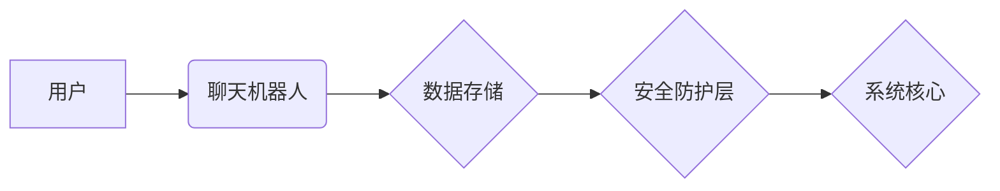

                 

## 聊天机器人网络安全：保护数据和系统

> 关键词：聊天机器人、网络安全、数据隐私、系统安全、恶意攻击、对抗训练、自然语言处理、机器学习

## 1. 背景介绍

聊天机器人作为一种新型的人机交互技术，在各个领域得到了广泛应用，例如客服服务、教育培训、娱乐休闲等。其能够模拟人类对话，提供快速、便捷的服务，极大地提高了用户体验。然而，随着聊天机器人的普及，其网络安全问题也日益凸显。

聊天机器人通常需要处理大量用户数据，包括个人信息、聊天内容等敏感信息。这些数据一旦泄露，将可能导致用户隐私泄露、身份盗窃等严重后果。此外，恶意攻击者也可能利用聊天机器人的漏洞进行攻击，例如注入恶意代码、传播病毒等，从而损害聊天机器人的正常运行，甚至攻击整个系统。

因此，保障聊天机器人的网络安全，保护用户数据和系统安全，是当前亟待解决的重要问题。

## 2. 核心概念与联系

### 2.1 聊天机器人网络安全

聊天机器人网络安全是指保护聊天机器人系统免受各种网络攻击和数据泄露的措施。它涵盖了以下几个方面：

* **数据安全:** 保护用户数据免受未授权访问、泄露和篡改。
* **系统安全:** 保护聊天机器人系统免受恶意攻击和破坏。
* **隐私保护:** 确保用户隐私不被侵犯，合法合规地使用用户数据。

### 2.2 相关技术

* **自然语言处理 (NLP):** 聊天机器人依赖于NLP技术来理解和生成人类语言。
* **机器学习 (ML):** 聊天机器人通常使用ML算法来学习用户行为模式，提供更精准的回复。
* **深度学习 (DL):** DL算法可以帮助聊天机器人更好地理解上下文信息，生成更自然流畅的对话。
* **安全加固:** 通过代码审查、漏洞扫描等手段，增强聊天机器人系统的安全性。
* **身份验证和授权:** 使用身份验证和授权机制，确保只有授权用户才能访问聊天机器人系统。
* **加密技术:** 使用加密技术保护用户数据在传输和存储过程中不被窃取。

### 2.3 架构图



## 3. 核心算法原理 & 具体操作步骤

### 3.1 算法原理概述

聊天机器人通常使用基于规则的系统或机器学习算法来进行对话。

* **基于规则的系统:** 聊天机器人根据预先定义的规则和知识库来生成回复。这种方法简单易实现，但缺乏灵活性，难以处理复杂对话场景。
* **机器学习算法:** 聊天机器人通过训练数据学习用户行为模式，并根据学习到的知识生成回复。这种方法能够处理更复杂的对话场景，但需要大量的训练数据和计算资源。

### 3.2 算法步骤详解

**基于规则的系统:**

1. 用户输入文本。
2. 系统解析用户输入，识别关键词和意图。
3. 根据规则和知识库，选择合适的回复模板。
4. 系统生成回复文本，并发送给用户。

**机器学习算法:**

1. 收集大量用户对话数据。
2. 对数据进行预处理，例如分词、词性标注等。
3. 使用机器学习算法训练聊天机器人模型，例如循环神经网络 (RNN) 或 Transformer。
4. 聊天机器人模型能够根据用户输入预测最合适的回复。
5. 系统生成回复文本，并发送给用户。

### 3.3 算法优缺点

**基于规则的系统:**

* **优点:** 简单易实现，部署成本低。
* **缺点:** 缺乏灵活性，难以处理复杂对话场景。

**机器学习算法:**

* **优点:** 能够处理更复杂的对话场景，回复更自然流畅。
* **缺点:** 需要大量的训练数据和计算资源，训练时间长。

### 3.4 算法应用领域

* **客服服务:** 自动回复用户常见问题，提高客服效率。
* **教育培训:** 提供个性化学习辅导，帮助学生提高学习效果。
* **娱乐休闲:** 提供聊天娱乐服务，例如玩游戏、讲故事等。

## 4. 数学模型和公式 & 详细讲解 & 举例说明

### 4.1 数学模型构建

聊天机器人的核心是语言模型，它通过统计语言的概率分布来预测下一个词。常用的语言模型包括：

* **n-gram模型:** 统计n个连续词的联合概率。
* **隐马尔可夫模型 (HMM):** 使用状态转移概率和观测概率来建模语言序列。
* **循环神经网络 (RNN):** 使用循环结构来捕捉语言序列中的长距离依赖关系。

### 4.2 公式推导过程

**n-gram模型:**

假设我们要预测下一个词为w，给定前n-1个词为w1, w2, ..., wn-1，则n-gram模型的概率公式为：

$$P(w|w1, w2, ..., wn-1) = \frac{C(w1, w2, ..., wn)}{C(w1, w2, ..., wn-1)}$$

其中，C(w1, w2, ..., wn)表示词序列(w1, w2, ..., wn)出现的次数，C(w1, w2, ..., wn-1)表示词序列(w1, w2, ..., wn-1)出现的次数。

**RNN模型:**

RNN模型使用隐藏状态来捕捉语言序列中的上下文信息。隐藏状态的更新公式为：

$$h_t = f(W_{xh}x_t + W_{hh}h_{t-1} + b_h)$$

其中，$x_t$是当前词的输入向量，$h_t$是当前隐藏状态向量，$W_{xh}$和$W_{hh}$是权重矩阵，$b_h$是偏置项，$f$是激活函数。

### 4.3 案例分析与讲解

**n-gram模型:**

假设我们有一个训练语料库，其中包含以下句子：

"The cat sat on the mat."

我们可以使用n-gram模型来预测下一个词为"the"的概率。

* 2-gram模型: P("the" | "the") = C("the the") / C("the")
* 3-gram模型: P("the" | "on the") = C("on the the") / C("on the")

**RNN模型:**

RNN模型可以学习更复杂的语言模式，例如长距离依赖关系。例如，在句子"The cat chased the mouse that ran away"中，"ran away"与"chased"之间存在长距离依赖关系。RNN模型能够捕捉到这种依赖关系，从而更好地预测下一个词。

## 5. 项目实践：代码实例和详细解释说明

### 5.1 开发环境搭建

* Python 3.x
* TensorFlow 或 PyTorch
* NLTK 或 spaCy

### 5.2 源代码详细实现

```python
# 使用 TensorFlow 实现简单的 RNN 聊天机器人

import tensorflow as tf

# 定义模型
model = tf.keras.Sequential([
    tf.keras.layers.Embedding(input_dim=vocab_size, output_dim=embedding_dim),
    tf.keras.layers.LSTM(units=128),
    tf.keras.layers.Dense(units=vocab_size, activation='softmax')
])

# 编译模型
model.compile(loss='sparse_categorical_crossentropy', optimizer='adam')

# 训练模型
model.fit(x_train, y_train, epochs=10)

# 生成回复
def generate_response(input_text):
    # 将输入文本转换为词向量
    input_vector = encoder.encode(input_text)
    # 使用模型预测下一个词
    predicted_index = model.predict(input_vector)
    # 将预测的词索引转换为词
    predicted_word = decoder.decode(predicted_index)
    return predicted_word
```

### 5.3 代码解读与分析

* **Embedding层:** 将词转换为稠密的向量表示。
* **LSTM层:** 使用循环结构来捕捉语言序列中的上下文信息。
* **Dense层:** 将隐藏状态映射到词的概率分布。
* **训练过程:** 使用训练数据训练模型，优化模型参数。
* **生成回复:** 将用户输入转换为词向量，使用模型预测下一个词，并将其转换为文本回复。

### 5.4 运行结果展示

运行代码后，聊天机器人能够根据用户输入生成相应的回复。例如，如果用户输入"你好", 聊天机器人可能会回复"你好，请问有什么可以帮您吗?"。

## 6. 实际应用场景

### 6.1 客服服务

聊天机器人可以自动回复用户常见问题，例如订单查询、退换货流程等，从而提高客服效率，节省人工成本。

### 6.2 教育培训

聊天机器人可以提供个性化学习辅导，例如解答学生疑问、提供练习题等，帮助学生提高学习效果。

### 6.3 娱乐休闲

聊天机器人可以提供聊天娱乐服务，例如玩游戏、讲故事等，为用户提供休闲娱乐体验。

### 6.4 未来应用展望

随着人工智能技术的不断发展，聊天机器人的应用场景将更加广泛，例如：

* **医疗保健:** 聊天机器人可以帮助医生诊断疾病、提供医疗建议等。
* **金融服务:** 聊天机器人可以帮助用户办理银行业务、理财规划等。
* **智能家居:** 聊天机器人可以控制智能家居设备，例如灯光、空调等。

## 7. 工具和资源推荐

### 7.1 学习资源推荐

* **书籍:**
    * "Speech and Language Processing" by Jurafsky and Martin
    * "Deep Learning" by Goodfellow, Bengio, and Courville
* **在线课程:**
    * Coursera: Natural Language Processing Specialization
    * edX: Artificial Intelligence
* **博客和论坛:**
    * Towards Data Science
    * Reddit: r/MachineLearning

### 7.2 开发工具推荐

* **TensorFlow:** 开源深度学习框架
* **PyTorch:** 开源深度学习框架
* **NLTK:** 自然语言处理工具包
* **spaCy:** 自然语言处理工具包

### 7.3 相关论文推荐

* "Attention Is All You Need" by Vaswani et al.
* "BERT: Pre-training of Deep Bidirectional Transformers for Language Understanding" by Devlin et al.
* "GPT-3: Language Models are Few-Shot Learners" by Brown et al.

## 8. 总结：未来发展趋势与挑战

### 8.1 研究成果总结

近年来，聊天机器人技术取得了显著进展，例如：

* **模型性能提升:** 深度学习算法的应用使得聊天机器人的对话能力大幅提升。
* **应用场景拓展:** 聊天机器人的应用场景不断拓展，覆盖了多个领域。
* **开源工具发展:** 越来越多的开源工具和资源支持聊天机器人开发。

### 8.2 未来发展趋势

* **更自然流畅的对话:** 未来聊天机器人将更加注重对话的自然流畅度，能够更好地理解和回应用户的意图。
* **更个性化的服务:** 聊天机器人将能够根据用户的个性化需求提供定制化的服务。
* **多模态交互:** 聊天机器人将支持多种模态交互，例如文本、语音、图像等。

### 8.3 面临的挑战

* **数据安全和隐私保护:** 聊天机器人需要处理大量用户数据，因此数据安全和隐私保护是一个重要的挑战。
* **恶意攻击和滥用:** 聊天机器人可能被恶意攻击者利用进行攻击，或者被滥用进行传播虚假信息等。
* **伦理问题:** 聊天机器人的发展也带来了伦理问题，例如算法偏见、责任归属等。

### 8.4 研究展望

未来研究将重点关注以下几个方面:

* **开发更安全可靠的聊天机器人系统:** 提高聊天机器人的抗攻击能力，保护用户数据安全。
* **解决聊天机器人的伦理问题:** 制定相关规范和标准，引导聊天机器人的健康发展。
* **探索聊天机器人的新应用场景:** 将聊天机器人应用于更多领域，为人类社会带来更多价值。

## 9. 附录：常见问题与解答

### 9.1 如何保护聊天机器人的数据安全？

* 使用加密技术保护用户数据在传输和存储过程中不被窃取。
* 采用身份验证和授权机制，确保只有授权用户才能访问聊天机器人系统。
* 定期进行安全评估和漏洞扫描，及时修复安全漏洞。

### 9.2 如何防止聊天机器人被恶意攻击？

* 使用安全加固技术，增强聊天机器人系统的安全性。
* 采用对抗训练方法，提高聊天机器人的抗攻击能力。
* 监控聊天机器人的运行状态，及时发现和应对异常情况。

### 9.3 如何解决聊天机器人的算法偏见问题？

* 使用更加多样化的训练数据，减少算法偏见。
* 开发算法公平性评估指标，监测算法是否存在偏见。
* 采用算法调优方法，减轻算法偏见的影响。


作者：禅与计算机程序设计艺术 / Zen and the Art of Computer Programming<end_of_turn>

