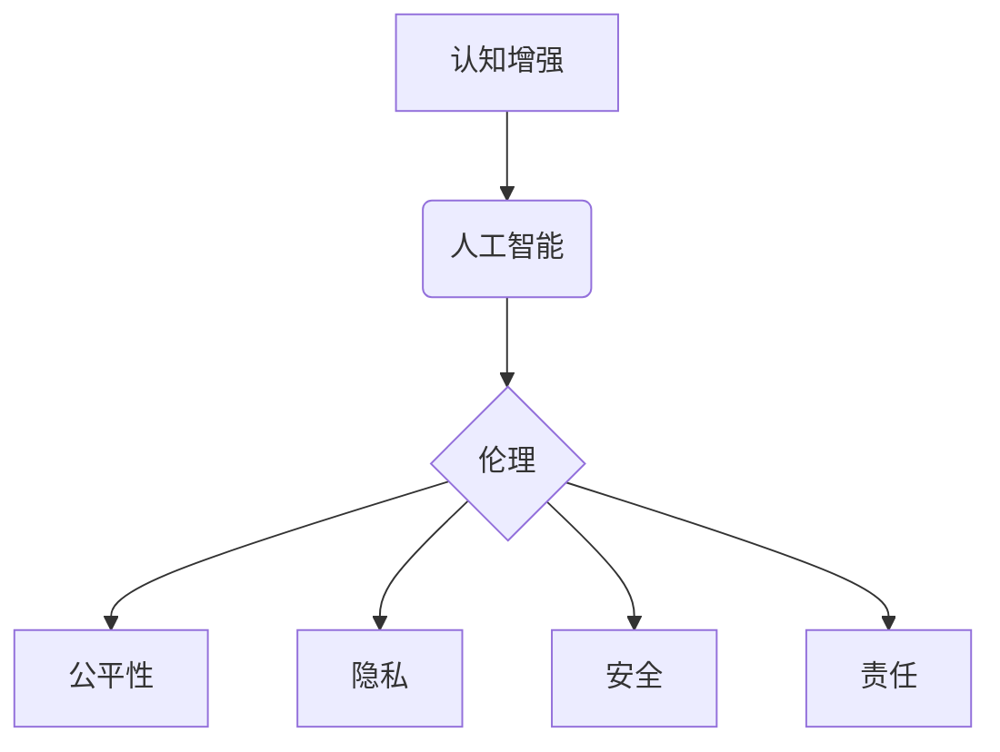

                 

## 认知增强与伦理：人类能力提升的边界

> 关键词：认知增强、人工智能、伦理、人类能力、边界、神经网络、深度学习、可解释性、公平性、隐私

## 1. 背景介绍

人类文明的发展历程，始终伴随着对自身能力的不断提升。从使用工具到发明文字，从农业革命到工业革命，每一次进步都标志着人类认知和行动能力的飞跃。如今，人工智能（AI）的兴起，为我们提供了一个前所未有的机会，让我们能够进一步拓展认知边界，增强人类能力。

认知增强，是指通过技术手段，提升人类的认知功能，例如记忆力、注意力、学习能力、创造力等。AI技术，特别是深度学习，在图像识别、自然语言处理、决策分析等领域取得了突破性进展，为认知增强提供了强大的工具。

然而，认知增强技术的发展也引发了广泛的伦理讨论。如何确保这些技术被安全、公平、负责任地应用？如何避免技术带来的潜在风险？这些问题迫切需要我们认真思考和探讨。

## 2. 核心概念与联系

### 2.1 认知增强

认知增强是指利用技术手段提升人类认知能力的范畴，包括但不限于：

* **记忆增强:** 帮助人们更好地记忆信息，例如通过脑机接口技术记录和回忆记忆。
* **注意力增强:** 提高人们对特定信息或任务的关注度，例如通过脑电波反馈训练增强注意力。
* **学习能力增强:** 帮助人们更快、更有效地学习新知识和技能，例如通过个性化学习平台和AI辅导系统。
* **创造力增强:** 帮助人们产生更具创新性的想法和解决方案，例如通过AI辅助创意工具和协作平台。

### 2.2 人工智能

人工智能是指模拟人类智能行为的计算机系统。深度学习是人工智能领域的重要分支，通过多层神经网络学习复杂数据模式，实现对图像、语音、文本等数据的理解和处理。

### 2.3 伦理

伦理是指关于什么是对的和什么是错的道德规范和原则。在认知增强技术发展过程中，需要考虑以下伦理问题：

* **公平性:** 认知增强技术是否会加剧社会不平等？
* **隐私:** 认知增强技术是否会侵犯人们的隐私？
* **安全:** 认知增强技术是否会带来安全风险？
* **责任:** 认知增强技术带来的后果谁来承担责任？

**核心概念与联系流程图**



## 3. 核心算法原理 & 具体操作步骤

### 3.1 算法原理概述

深度学习算法是认知增强技术的核心，其原理是通过多层神经网络模拟人类大脑的学习过程。

神经网络由多个节点（神经元）组成，每个节点连接着其他节点，并具有权重。通过训练数据，神经网络不断调整节点之间的权重，最终能够学习到数据的复杂模式。

### 3.2 算法步骤详解

1. **数据准备:** 收集和预处理训练数据，例如文本、图像、音频等。
2. **网络结构设计:** 根据任务需求设计神经网络的结构，包括层数、节点数量、激活函数等。
3. **参数初始化:** 为神经网络中的每个连接赋予初始权重。
4. **前向传播:** 将输入数据通过神经网络传递，计算输出结果。
5. **反向传播:** 计算输出结果与目标值的误差，并根据误差调整神经网络的权重。
6. **迭代训练:** 重复前向传播和反向传播的过程，直到模型性能达到预期水平。

### 3.3 算法优缺点

**优点:**

* 能够学习复杂数据模式，实现高精度识别和预测。
* 具有强大的泛化能力，能够应用于多种任务。

**缺点:**

* 训练数据量大，计算资源消耗高。
* 模型解释性差，难以理解模型的决策过程。

### 3.4 算法应用领域

* **图像识别:** 人脸识别、物体检测、图像分类等。
* **自然语言处理:** 语义理解、机器翻译、文本生成等。
* **语音识别:** 语音转文本、语音助手等。
* **医疗诊断:** 病理图像分析、疾病预测等。

## 4. 数学模型和公式 & 详细讲解 & 举例说明

### 4.1 数学模型构建

深度学习模型的核心是神经网络，其数学模型可以表示为一系列的线性变换和非线性激活函数。

**线性变换:**

$$
y = Wx + b
$$

其中，$x$ 是输入向量，$W$ 是权重矩阵，$b$ 是偏置向量，$y$ 是线性变换后的输出向量。

**非线性激活函数:**

$$
f(y)
$$

激活函数的作用是引入非线性，使神经网络能够学习复杂数据模式。常见的激活函数包括 sigmoid 函数、ReLU 函数等。

### 4.2 公式推导过程

深度学习模型的训练过程是通过优化损失函数来实现的。损失函数衡量模型预测结果与真实值的差异。常用的损失函数包括均方误差（MSE）、交叉熵损失等。

**均方误差 (MSE):**

$$
L = \frac{1}{N} \sum_{i=1}^{N} (y_i - \hat{y}_i)^2
$$

其中，$N$ 是样本数量，$y_i$ 是真实值，$\hat{y}_i$ 是模型预测值。

通过反向传播算法，计算损失函数对模型参数的梯度，并使用梯度下降算法更新模型参数，最终使损失函数最小化。

### 4.3 案例分析与讲解

例如，在图像分类任务中，深度学习模型可以学习图像特征，并将其映射到不同的类别。训练过程中，模型会不断调整权重，使预测结果与真实类别之间的差异最小化。

## 5. 项目实践：代码实例和详细解释说明

### 5.1 开发环境搭建

* Python 3.x
* TensorFlow 或 PyTorch 深度学习框架
* Jupyter Notebook 或 VS Code 开发环境

### 5.2 源代码详细实现

```python
import tensorflow as tf

# 定义模型结构
model = tf.keras.models.Sequential([
    tf.keras.layers.Conv2D(32, (3, 3), activation='relu', input_shape=(28, 28, 1)),
    tf.keras.layers.MaxPooling2D((2, 2)),
    tf.keras.layers.Conv2D(64, (3, 3), activation='relu'),
    tf.keras.layers.MaxPooling2D((2, 2)),
    tf.keras.layers.Flatten(),
    tf.keras.layers.Dense(10, activation='softmax')
])

# 编译模型
model.compile(optimizer='adam',
              loss='sparse_categorical_crossentropy',
              metrics=['accuracy'])

# 加载 MNIST 数据集
(x_train, y_train), (x_test, y_test) = tf.keras.datasets.mnist.load_data()

# 数据预处理
x_train = x_train.astype('float32') / 255.0
x_test = x_test.astype('float32') / 255.0
x_train = x_train.reshape((x_train.shape[0], 28, 28, 1))
x_test = x_test.reshape((x_test.shape[0], 28, 28, 1))

# 训练模型
model.fit(x_train, y_train, epochs=5)

# 评估模型
loss, accuracy = model.evaluate(x_test, y_test)
print('Test loss:', loss)
print('Test accuracy:', accuracy)
```

### 5.3 代码解读与分析

这段代码实现了 MNIST 手写数字识别任务的深度学习模型训练。

* 首先，定义了模型结构，包括卷积层、池化层和全连接层。
* 然后，编译了模型，指定了优化器、损失函数和评价指标。
* 接着，加载了 MNIST 数据集，并对数据进行了预处理。
* 最后，训练了模型，并评估了模型性能。

### 5.4 运行结果展示

训练完成后，模型能够识别手写数字，并输出识别结果的准确率。

## 6. 实际应用场景

### 6.1 教育领域

* 个性化学习：根据学生的学习进度和能力，提供个性化的学习内容和教学方式。
* 智能辅导：利用 AI 辅助学生完成作业、解答问题，提高学习效率。
* 在线考试：利用 AI 进行自动批改和评分，提高考试效率和公平性。

### 6.2 医疗领域

* 疾病诊断：利用 AI 分析病理图像、患者数据，辅助医生进行疾病诊断。
* 药物研发：利用 AI 筛选潜在药物候选，加速药物研发过程。
* 个性化治疗：根据患者的基因信息和病史，制定个性化的治疗方案。

### 6.3 商业领域

* 客户服务：利用 AI 构建智能客服系统，提供 24 小时不间断的客户服务。
* 市场营销：利用 AI 分析客户数据，精准推送广告和营销信息。
* 供应链管理：利用 AI 优化物流配送、库存管理，提高供应链效率。

### 6.4 未来应用展望

随着 AI 技术的不断发展，认知增强技术将在更多领域得到应用，例如：

* **增强现实 (AR) 和虚拟现实 (VR):** 利用 AI 增强现实和虚拟现实体验，例如提供更逼真的虚拟环境和更智能的交互方式。
* **脑机接口:** 利用 AI 连接人类大脑和计算机，实现脑电波控制、信息传输等功能。
* **人类基因编辑:** 利用 AI 辅助基因编辑技术，治疗遗传疾病、增强人类能力。

## 7. 工具和资源推荐

### 7.1 学习资源推荐

* **在线课程:** Coursera、edX、Udacity 等平台提供深度学习相关的在线课程。
* **书籍:** 《深度学习》、《神经网络与深度学习》等书籍。
* **博客和论坛:** TensorFlow、PyTorch 等框架的官方博客和论坛。

### 7.2 开发工具推荐

* **TensorFlow:** Google 开发的开源深度学习框架。
* **PyTorch:** Facebook 开发的开源深度学习框架。
* **Keras:** TensorFlow 上的深度学习 API，易于使用。

### 7.3 相关论文推荐

* **《ImageNet Classification with Deep Convolutional Neural Networks》:** AlexNet 模型的论文。
* **《Deep Residual Learning for Image Recognition》:** ResNet 模型的论文。
* **《Attention Is All You Need》:** Transformer 模型的论文。

## 8. 总结：未来发展趋势与挑战

### 8.1 研究成果总结

近年来，深度学习技术取得了显著进展，在图像识别、自然语言处理等领域取得了突破性成果。认知增强技术也取得了重要进展，例如记忆增强、注意力增强等。

### 8.2 未来发展趋势

* **模型规模和能力提升:** 深度学习模型将继续朝着更大、更复杂的方向发展，能够学习更复杂的数据模式，实现更强大的认知功能。
* **可解释性增强:** 研究人员将致力于提高深度学习模型的可解释性，使模型的决策过程更加透明，更容易被理解。
* **边缘计算和嵌入式系统:** 认知增强技术将应用于更多边缘计算和嵌入式系统，实现更广泛的场景应用。

### 8.3 面临的挑战

* **数据隐私和安全:** 认知增强技术需要大量的数据进行训练，如何保护数据隐私和安全是一个重要的挑战。
* **算法偏见和公平性:** 深度学习模型可能存在算法偏见，导致不公平的结果。如何确保算法公平性是一个重要的研究方向。
* **伦理和社会影响:** 认知增强技术可能对社会产生深远的影响，需要认真思考其伦理和社会影响。

### 8.4 研究展望

未来，认知增强技术将继续发展，为人类带来更多福祉。我们需要加强对该领域的伦理和社会影响的思考，确保技术被安全、公平、负责任地应用。

## 9. 附录：常见问题与解答

**Q1: 认知增强技术是否会取代人类？**

A1: 认知增强技术旨在增强人类能力，而不是取代人类。AI 仍然无法完全模拟人类的创造力、情感和社会智慧。

**Q2: 认知增强技术对教育有什么影响？**

A2: 认知增强技术可以个性化学习，提高学习效率，但同时也需要关注教育公平性和教师的角色转变。

**Q3: 认知增强技术有哪些伦理风险？**

A3: 认知增强技术可能带来数据隐私泄露、算法偏见、社会不平等等风险，需要加强伦理规范和监管。


作者：禅与计算机程序设计艺术 / Zen and the Art of Computer Programming 
<end_of_turn>

