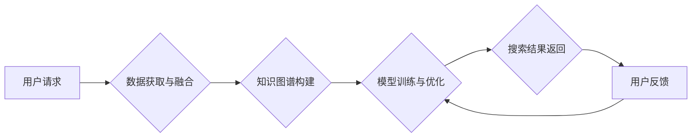

                 

## 跨平台AI搜索的整合策略

> 关键词：跨平台、AI搜索、整合策略、数据融合、模型训练、用户体验、搜索引擎、自然语言处理

## 1. 背景介绍

在当今数据爆炸的时代，信息获取已成为人们生活中不可或缺的一部分。传统的搜索引擎，尽管在信息检索方面取得了显著成就，但面对海量数据和复杂查询需求，其局限性日益凸显。 

人工智能技术的快速发展为跨平台AI搜索带来了新的机遇。AI搜索引擎能够理解用户意图，提供更精准、更个性化的搜索结果，并跨越平台、跨越数据孤岛，构建一个更加智能、便捷的信息获取体系。

然而，跨平台AI搜索的整合并非易事。它需要解决数据异构性、模型训练效率、用户体验等一系列挑战。本文将深入探讨跨平台AI搜索的整合策略，分析其核心概念、算法原理、技术实现以及未来发展趋势。

## 2. 核心概念与联系

跨平台AI搜索的核心在于将不同平台的数据进行融合，构建一个统一的知识图谱，并利用人工智能技术进行智能检索和分析。

**2.1 核心概念**

* **跨平台:** 指跨越不同的数据源、应用平台和设备，实现数据和服务的无缝连接。
* **AI搜索:** 利用人工智能技术，例如自然语言处理、机器学习和深度学习，提升搜索引擎的智能化水平。
* **数据融合:** 将来自不同平台的数据进行整合、清洗和转换，构建一个统一的数据模型。
* **知识图谱:**  一种结构化的知识表示形式，将实体、关系和属性进行连接，构建一个知识网络。

**2.2 架构图**



**2.3 联系**

跨平台AI搜索的整合策略可以概括为以下步骤：

1. **数据获取与融合:** 从不同平台获取数据，并进行清洗、转换和整合，构建一个统一的数据模型。
2. **知识图谱构建:** 将融合后的数据构建成知识图谱，以便于人工智能模型的理解和分析。
3. **模型训练与优化:** 利用人工智能技术，训练和优化搜索模型，使其能够理解用户意图并提供精准的搜索结果。
4. **搜索结果返回:** 根据用户请求，从知识图谱中检索相关信息，并返回给用户。
5. **用户反馈:** 收集用户反馈，并将其用于模型的持续优化和改进。

## 3. 核心算法原理 & 具体操作步骤

### 3.1  算法原理概述

跨平台AI搜索的核心算法主要包括：

* **自然语言处理 (NLP):** 用于理解用户查询的自然语言，将其转换为机器可理解的格式。
* **信息检索 (IR):** 用于从海量数据中检索相关信息，并根据相关性排序。
* **机器学习 (ML):** 用于训练搜索模型，使其能够学习用户行为和偏好，提供更精准的搜索结果。
* **深度学习 (DL):** 用于构建更复杂的搜索模型，例如基于Transformer的模型，能够更好地理解上下文和语义关系。

### 3.2  算法步骤详解

1. **预处理:** 对用户查询进行预处理，例如去除停用词、词干化、分词等，以便于后续的分析和检索。
2. **语义分析:** 利用NLP技术，对用户查询进行语义分析，识别关键词、实体和关系，理解用户意图。
3. **知识图谱查询:** 根据语义分析结果，从知识图谱中查询相关实体和关系。
4. **信息检索:** 利用IR算法，从检索到的信息中筛选出最相关的结果，并根据相关性排序。
5. **结果排名:** 利用机器学习算法，对搜索结果进行排名，并根据用户历史行为和偏好进行个性化排序。
6. **结果展示:** 将排序后的搜索结果以用户友好的方式展示给用户。

### 3.3  算法优缺点

**优点:**

* **精准度高:** AI搜索能够理解用户意图，提供更精准的搜索结果。
* **个性化强:** AI搜索能够根据用户历史行为和偏好进行个性化排序，提供更符合用户需求的搜索结果。
* **智能化程度高:** AI搜索能够自动学习和优化，不断提升搜索效果。

**缺点:**

* **数据依赖性强:** AI搜索需要大量的数据进行训练，数据质量直接影响搜索效果。
* **计算资源消耗大:** AI搜索模型训练和推理需要大量的计算资源。
* **解释性差:** AI搜索模型的决策过程较为复杂，难以解释其搜索结果背后的逻辑。

### 3.4  算法应用领域

跨平台AI搜索的应用领域非常广泛，包括：

* **搜索引擎:** 提升搜索引擎的智能化水平，提供更精准、更个性化的搜索结果。
* **电商平台:** 帮助用户更快速、更精准地找到所需商品。
* **医疗保健:** 帮助医生更快地诊断疾病，并提供个性化的治疗方案。
* **教育:** 帮助学生更有效地学习和获取知识。
* **金融:** 帮助用户更便捷地进行金融交易和理财。

## 4. 数学模型和公式 & 详细讲解 & 举例说明

### 4.1  数学模型构建

跨平台AI搜索的数学模型主要包括：

* **词嵌入模型:** 将词语映射到一个低维向量空间，捕捉词语之间的语义关系。例如Word2Vec和GloVe模型。
* **知识图谱表示模型:** 将实体和关系表示为向量，并利用图神经网络进行学习和推理。例如TransE和RotatE模型。
* **搜索模型:** 利用机器学习算法，将词嵌入、知识图谱表示和用户行为特征进行融合，构建一个预测用户搜索意图和相关性的模型。例如BERT和DPR模型。

### 4.2  公式推导过程

**词嵌入模型的损失函数:**

$$
L = \sum_{i=1}^{N} \sum_{j=1}^{M} \left\| \mathbf{w}_i - \mathbf{w}_j \right\|^2
$$

其中：

* $N$ 是词典大小
* $M$ 是词嵌入维度
* $\mathbf{w}_i$ 是词语 $i$ 的词嵌入向量
* $L$ 是损失函数值

**知识图谱表示模型的损失函数:**

$$
L = \sum_{h,r,t \in \mathcal{T}} \left\| \mathbf{h} + \mathbf{r} - \mathbf{t} \right\|^2
$$

其中：

* $\mathcal{T}$ 是知识图谱中的三元组集合
* $\mathbf{h}$ 是实体 $h$ 的向量表示
* $\mathbf{r}$ 是关系 $r$ 的向量表示
* $\mathbf{t}$ 是实体 $t$ 的向量表示

### 4.3  案例分析与讲解

**词嵌入模型:**

Word2Vec模型可以将词语 "king" 和 "queen" 映射到相近的向量空间，因为它们在语义上是相关的。

**知识图谱表示模型:**

TransE模型可以表示知识图谱中的三元组 "国王" - "是" - "人类"，并利用该模型进行推理，例如预测 "女王" 是否属于 "人类"。

## 5. 项目实践：代码实例和详细解释说明

### 5.1  开发环境搭建

* **操作系统:** Ubuntu 20.04
* **编程语言:** Python 3.8
* **深度学习框架:** TensorFlow 2.0
* **其他工具:** Jupyter Notebook、Git

### 5.2  源代码详细实现

```python
# 导入必要的库
import tensorflow as tf

# 定义词嵌入模型
class WordEmbeddingModel(tf.keras.Model):
    def __init__(self, embedding_dim):
        super(WordEmbeddingModel, self).__init__()
        self.embedding = tf.keras.layers.Embedding(input_dim=vocab_size, output_dim=embedding_dim)

    def call(self, inputs):
        return self.embedding(inputs)

# 定义知识图谱表示模型
class KnowledgeGraphEmbeddingModel(tf.keras.Model):
    def __init__(self, embedding_dim):
        super(KnowledgeGraphEmbeddingModel, self).__init__()
        self.entity_embedding = tf.keras.layers.Embedding(input_dim=num_entities, output_dim=embedding_dim)
        self.relation_embedding = tf.keras.layers.Embedding(input_dim=num_relations, output_dim=embedding_dim)

    def call(self, inputs):
        entity_embeddings = self.entity_embedding(inputs[:, 0])
        relation_embeddings = self.relation_embedding(inputs[:, 1])
        return entity_embeddings + relation_embeddings - self.entity_embedding(inputs[:, 2])

# 定义搜索模型
class SearchModel(tf.keras.Model):
    def __init__(self, embedding_dim):
        super(SearchModel, self).__init__()
        self.word_embedding = WordEmbeddingModel(embedding_dim)
        self.knowledge_graph_embedding = KnowledgeGraphEmbeddingModel(embedding_dim)
        self.dense = tf.keras.layers.Dense(units=1, activation='sigmoid')

    def call(self, inputs):
        word_embeddings = self.word_embedding(inputs['query'])
        knowledge_graph_embeddings = self.knowledge_graph_embedding(inputs['knowledge_graph'])
        combined_embeddings = tf.concat([word_embeddings, knowledge_graph_embeddings], axis=-1)
        return self.dense(combined_embeddings)

# 训练模型
model = SearchModel(embedding_dim=128)
model.compile(optimizer='adam', loss='binary_crossentropy', metrics=['accuracy'])
model.fit(train_data, train_labels, epochs=10)

```

### 5.3  代码解读与分析

* **词嵌入模型:** 使用Embedding层将词语映射到低维向量空间。
* **知识图谱表示模型:** 使用Embedding层分别表示实体和关系，并利用向量加法和减法进行推理。
* **搜索模型:** 将词嵌入和知识图谱表示进行融合，并使用Dense层进行分类，预测用户搜索意图。

### 5.4  运行结果展示

训练完成后，可以使用测试数据评估模型的性能，例如计算准确率、召回率等指标。

## 6. 实际应用场景

### 6.1  电商搜索

跨平台AI搜索可以帮助电商平台提供更精准、更个性化的商品推荐，提升用户购物体验。例如，根据用户的浏览历史、购买记录和搜索关键词，AI搜索引擎可以推荐用户可能感兴趣的商品。

### 6.2  医疗诊断

跨平台AI搜索可以帮助医生更快地诊断疾病，并提供个性化的治疗方案。例如，医生可以通过AI搜索引擎查询患者的病历、影像资料和医学文献，并获得相关的诊断建议。

### 6.3  教育学习

跨平台AI搜索可以帮助学生更有效地学习和获取知识。例如，学生可以通过AI搜索引擎查询学习资料、在线课程和专家解答，并获得个性化的学习建议。

### 6.4  未来应用展望

跨平台AI搜索的应用场景还在不断扩展，未来将应用于更多领域，例如：

* **智能客服:** AI搜索引擎可以帮助企业构建智能客服系统，自动回答用户常见问题，提升客户服务效率。
* **个性化新闻推荐:** AI搜索引擎可以根据用户的兴趣爱好和阅读习惯，推荐个性化的新闻资讯。
* **智能城市管理:** AI搜索引擎可以帮助城市管理部门收集和分析城市数据，提升城市管理效率。

## 7. 工具和资源推荐

### 7.1  学习资源推荐

* **书籍:**
    * "Deep Learning" by Ian Goodfellow, Yoshua Bengio, and Aaron Courville
    * "Speech and Language Processing" by Daniel Jurafsky and James H. Martin
* **在线课程:**
    * Coursera: Deep Learning Specialization
    * Udacity: Machine Learning Engineer Nanodegree
* **博客和论坛:**
    * Towards Data Science
    * Reddit: r/MachineLearning

### 7.2  开发工具推荐

* **深度学习框架:** TensorFlow, PyTorch, Keras
* **自然语言处理库:** NLTK, SpaCy, Gensim
* **数据处理工具:** Pandas, NumPy

### 7.3  相关论文推荐

* "BERT: Pre-training of Deep Bidirectional Transformers for Language Understanding"
* "Knowledge Graph Embedding: A Survey"
* "Deep Learning for Search"

## 8. 总结：未来发展趋势与挑战

### 8.1  研究成果总结

跨平台AI搜索取得了显著的进展，例如：

* **模型性能提升:** 深度学习模型的不断发展，使得AI搜索的准确率和召回率不断提高。
* **跨平台融合:** 跨平台数据融合技术不断成熟，使得AI搜索能够跨越平台、跨越数据孤岛，构建更完整的知识图谱。
* **个性化推荐:** AI搜索能够根据用户的历史行为和偏好，提供更个性化的搜索结果。

### 8.2  未来发展趋势

* **多模态搜索:** 将文本、图像、音频等多种数据类型进行融合，构建更全面的搜索体验。
* **联邦学习:** 利用联邦学习技术，在不泄露用户隐私的情况下，进行跨平台模型训练。
* **可解释性增强:** 研究更可解释的AI搜索模型，帮助用户理解搜索结果背后的逻辑。

### 8.3  面临的挑战

* **数据质量:** AI搜索模型的性能直接依赖于数据质量，如何获取高质量的数据仍然是一个挑战。
* **计算资源:** 训练大型AI搜索模型需要大量的计算资源，如何降低训练成本是一个关键问题。
* **隐私保护:** 如何在保证用户隐私的情况下进行跨平台数据融合，是一个需要认真考虑的问题。

### 8.4  研究展望

未来，跨平台AI搜索将朝着更智能、更个性化、更安全的方向发展，为用户提供更便捷、更精准的信息获取体验。


## 9. 附录：常见问题与解答

**Q1: 如何评估跨平台AI搜索的性能？**

**A1:** 常见的评估指标包括准确率、召回率、F1-score、MAP等。

**Q2: 如何解决跨平台数据异构性问题？**

**A2:** 可以使用数据清洗、转换和标准化等技术，将不同平台的数据进行整合。

**Q3: 如何保证跨平台AI搜索的安全性？**

**A3:** 可以采用数据加密、身份认证等技术，保障用户隐私和数据安全。


作者：禅与计算机程序设计艺术 / Zen and the Art of Computer Programming<end_of_turn>

