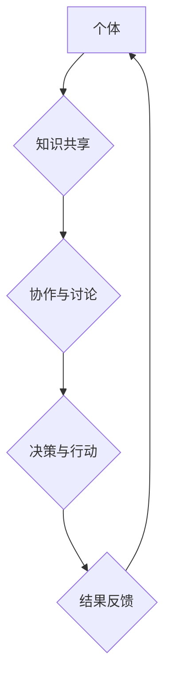

                 

## 集体智慧：开拓解决复杂问题的创新思路

> 关键词：集体智慧、协同进化、复杂系统、人工智能、机器学习、算法优化、分布式计算、创新思维

## 1. 背景介绍

在当今科技日新月异的时代，面对日益复杂的社会问题和技术挑战，单一的个人智慧已难以应对。解决这些问题往往需要整合来自不同领域、不同背景的知识和经验，并通过协同合作，激发出更强大的创新力。集体智慧，即通过群体协作来获得超越个体智慧的智能，正成为解决复杂问题的关键。

从人类历史上看，集体智慧一直是推动社会进步的重要力量。从古代的农业文明到现代的互联网时代，人类社会的发展都离不开群体智慧的积累和传承。而随着人工智能、机器学习等技术的快速发展，集体智慧的概念得到了更深入的理解和应用。

## 2. 核心概念与联系

**2.1 集体智慧的定义**

集体智慧是指一群个体通过协作、交流和分享知识、经验和观点，从而产生超越个体智慧的智能和创造力。它强调群体成员之间的相互作用和协同，以及群体内部信息传递和知识整合的效率。

**2.2 集体智慧的特征**

* **多样性:** 集体智慧源于不同个体背景、知识和经验的多样性。
* **协作:** 集体智慧的形成需要个体之间的有效协作和沟通。
* **自组织:** 集体智慧往往能够自发地组织和协调，形成新的知识和解决方案。
* **进化:** 集体智慧是一个不断演进的过程，通过反馈和迭代，不断提升自身的智能水平。

**2.3 集体智慧与复杂系统的联系**

复杂系统是指由大量相互关联的个体组成，其整体行为难以通过简单地分析个体行为来预测的系统。集体智慧可以看作是一种解决复杂系统问题的有效方法。

通过将个体视为系统中的节点，并通过算法和模型模拟个体之间的相互作用，我们可以更好地理解复杂系统的行为模式，并找到解决复杂问题的最佳方案。

**Mermaid 流程图**



## 3. 核心算法原理 & 具体操作步骤

**3.1 算法原理概述**

集体智慧算法通常基于以下几个核心原理：

* **分布式计算:** 将问题分解成多个子问题，并由不同的个体或节点分别处理，最终将结果汇总。
* **自适应学习:** 通过对数据和反馈的分析，不断调整算法参数和策略，提高算法的效率和准确性。
* **群体决策:** 通过投票、排序或其他机制，将个体意见整合到群体决策中。

**3.2 算法步骤详解**

1. **问题分解:** 将复杂问题分解成多个子问题，每个子问题可以由单个个体或节点处理。
2. **数据分配:** 将相关数据分配给不同的个体或节点，以便他们进行独立处理。
3. **个体处理:** 每个个体或节点根据其所接收的数据和算法规则，进行独立的计算和分析。
4. **结果汇总:** 将各个个体或节点处理的结果汇总，并进行整合和分析。
5. **反馈机制:** 将最终结果反馈给个体或节点，以便他们根据反馈进行调整和优化。

**3.3 算法优缺点**

**优点:**

* **并行处理:** 可以利用多核处理器和分布式计算资源，提高计算效率。
* **鲁棒性:** 集体智慧算法通常具有较强的鲁棒性，即使个别节点出现故障，也能保证整体系统的正常运行。
* **自适应性:** 可以根据数据和反馈不断调整算法参数，提高算法的适应性和准确性。

**缺点:**

* **通信开销:** 集体智慧算法需要频繁的通信和数据交换，这可能会增加通信开销。
* **协调难度:** 需要设计有效的协调机制，确保各个个体或节点能够有效地协作和沟通。
* **算法复杂度:** 一些集体智慧算法的复杂度较高，需要强大的计算能力和算法设计能力。

**3.4 算法应用领域**

* **人工智能:** 机器学习、深度学习、自然语言处理等领域。
* **科学研究:** 药物研发、材料科学、气候模型等领域。
* **金融市场:** 预测股票价格、风险管理等领域。
* **社会网络:** 推荐系统、舆情分析等领域。

## 4. 数学模型和公式 & 详细讲解 & 举例说明

**4.1 数学模型构建**

集体智慧算法通常可以建模为一个复杂网络，其中每个节点代表一个个体，边代表个体之间的相互作用。

我们可以使用图论和网络分析的工具来描述和分析这个网络结构，并研究网络拓扑结构对集体智慧的影响。

**4.2 公式推导过程**

例如，我们可以使用以下公式来描述个体之间的信息传播过程：

$$
P(t+1) = \alpha P(t) + (1-\alpha) \sum_{i=1}^{N} w_{ij} P_i(t)
$$

其中：

* $P(t)$ 表示某个节点在时间 $t$ 的信息状态。
* $P_i(t)$ 表示节点 $i$ 在时间 $t$ 的信息状态。
* $w_{ij}$ 表示节点 $i$ 和节点 $j$ 之间的连接权重。
* $\alpha$ 表示节点的记忆系数。

这个公式表明，节点 $j$ 的信息状态在下一时间步 $t+1$ 的更新取决于其当前信息状态 $P(t)$ 和其邻居节点的信息状态 $P_i(t)$ 的加权平均值。

**4.3 案例分析与讲解**

例如，在社交网络中，我们可以使用这个模型来模拟用户观点的传播过程。

每个用户可以看作是一个节点，用户之间的关注关系可以看作是网络的边。

通过分析用户之间的信息传播路径和权重，我们可以了解不同观点在网络中的传播趋势和影响力。

## 5. 项目实践：代码实例和详细解释说明

**5.1 开发环境搭建**

* 操作系统: Ubuntu 20.04 LTS
* 编程语言: Python 3.8
* 软件包: numpy, pandas, matplotlib, networkx

**5.2 源代码详细实现**

```python
import networkx as nx
import numpy as np

# 创建一个随机图
G = nx.erdos_renyi_graph(100, 0.05)

# 生成节点信息
node_info = np.random.rand(G.number_of_nodes())

# 信息传播算法
alpha = 0.8
for t in range(100):
    for node in G.nodes():
        neighbors = G.neighbors(node)
        new_info = alpha * node_info[node] + (1 - alpha) * np.mean([node_info[neighbor] for neighbor in neighbors])
        node_info[node] = new_info

# 可视化结果
nx.draw(G, with_labels=True)
plt.show()
```

**5.3 代码解读与分析**

* 使用 `networkx` 库创建了一个随机图，模拟个体之间的关系。
* 使用 `numpy` 库生成随机的节点信息，代表每个个体的初始状态。
* 信息传播算法模拟了节点之间信息传递的过程，其中 `alpha` 参数控制了节点对自身信息的记忆程度。
* 最后使用 `matplotlib` 库可视化了节点信息的变化趋势。

**5.4 运行结果展示**

运行代码后，可以观察到节点信息随着时间推移逐渐趋于稳定，这表明信息在网络中已经达到了一种平衡状态。

## 6. 实际应用场景

**6.1 医疗诊断**

集体智慧算法可以将多个医生、患者数据和医学文献进行整合，辅助医生进行更准确的诊断和治疗方案制定。

**6.2 新药研发**

通过分析大量药物数据和临床试验结果，集体智慧算法可以帮助科学家更快地发现新的药物候选物。

**6.3 金融风险管理**

集体智慧算法可以分析市场数据和交易行为，识别潜在的金融风险，并帮助金融机构制定更有效的风险管理策略。

**6.4 智能交通**

集体智慧算法可以协调交通信号灯、车辆行驶路线和道路拥堵情况，优化交通流量，减少交通拥堵。

**6.4 未来应用展望**

随着人工智能和机器学习技术的不断发展，集体智慧算法将在更多领域得到应用，例如：

* 个性化教育
* 智能制造
* 可持续发展

## 7. 工具和资源推荐

**7.1 学习资源推荐**

* 书籍：《集体智慧：开拓解决复杂问题的创新思路》
* 课程：Coursera 上的《人工智能》课程
* 网站：MIT 媒体实验室的 Collective Intelligence 网站

**7.2 开发工具推荐**

* Python
* NetworkX
* Scikit-learn
* TensorFlow

**7.3 相关论文推荐**

* "Collective Intelligence" by Pierre Lévy
* "The Wisdom of Crowds" by James Surowiecki
* "Emergence" by Steven Johnson

## 8. 总结：未来发展趋势与挑战

**8.1 研究成果总结**

集体智慧算法已经取得了一定的成果，并在多个领域得到了应用。

但是，集体智慧算法仍然面临着一些挑战，例如：

* 如何设计更有效的算法和模型
* 如何解决数据隐私和安全问题
* 如何确保集体智慧算法的公平性和可解释性

**8.2 未来发展趋势**

未来，集体智慧算法的发展趋势包括：

* 更智能的算法设计
* 更广泛的应用场景
* 更强的可解释性和透明度

**8.3 面临的挑战**

* 数据获取和处理
* 算法复杂度和效率
* 伦理和社会影响

**8.4 研究展望**

未来研究将重点关注以下几个方面：

* 基于深度学习的集体智慧算法
* 集体智慧算法在复杂系统中的应用
* 集体智慧算法的伦理和社会影响

## 9. 附录：常见问题与解答

**9.1 集体智慧算法与人工智能的关系是什么？**

集体智慧算法是一种人工智能技术，它利用群体智慧来解决复杂问题。

**9.2 集体智慧算法的应用场景有哪些？**

集体智慧算法的应用场景非常广泛，例如：医疗诊断、新药研发、金融风险管理、智能交通等。

**9.3 集体智慧算法有哪些优势？**

集体智慧算法具有并行处理能力、鲁棒性和自适应性等优势。

**9.4 集体智慧算法有哪些挑战？**

集体智慧算法面临着数据获取和处理、算法复杂度和效率、伦理和社会影响等挑战。


作者：禅与计算机程序设计艺术 / Zen and the Art of Computer Programming 
<end_of_turn>

