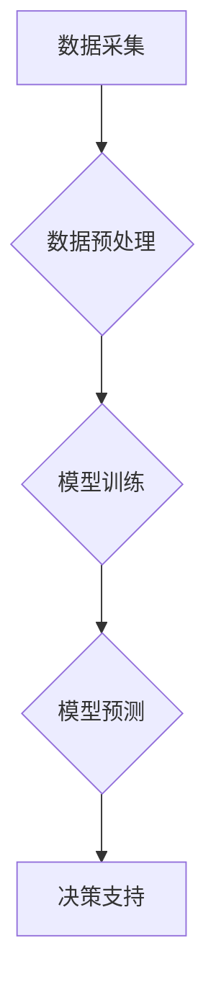

                 

## AIGC推动智慧农业升级

> 关键词：AIGC, 智慧农业, 机器学习, 深度学习, 计算机视觉, 自然语言处理, 数据分析

## 1. 背景介绍

农业，作为人类文明的基石，一直以来都面临着诸多挑战，例如资源短缺、气候变化、病虫害爆发等。传统农业模式的生产效率低下、成本高昂，难以满足日益增长的粮食需求。而随着人工智能（AI）技术的快速发展，特别是生成式人工智能（AIGC）的兴起，为农业发展带来了新的机遇。

AIGC是指能够生成新内容的AI模型，例如文本、图像、音频、视频等。它利用深度学习等算法，从海量数据中学习模式和规律，并生成具有创造性的新内容。AIGC技术在农业领域有着广泛的应用前景，能够帮助农民提高生产效率、降低生产成本、提升产品质量，最终实现农业的可持续发展。

## 2. 核心概念与联系

### 2.1 智慧农业

智慧农业是指利用现代信息技术和智能化手段，对农业生产进行全过程的智能化管理和控制，实现农业生产的精准化、高效化、可持续化发展。

### 2.2 AIGC在智慧农业中的应用

AIGC技术可以应用于智慧农业的各个环节，例如：

* **田间管理:** 利用无人机、传感器等设备采集田间数据，结合AIGC模型进行分析，实现精准播种、施肥、灌溉等操作，提高资源利用效率。
* **病虫害监测:** 利用计算机视觉技术识别病虫害，结合AIGC模型预测病虫害发生风险，及时采取防治措施，减少农作物损失。
* **产量预测:** 利用历史数据和天气预报等信息，结合AIGC模型预测农作物产量，帮助农民制定合理的生产计划。
* **农产品质量检测:** 利用计算机视觉技术对农产品进行质量检测，结合AIGC模型识别农产品品质等级，提高农产品质量。
* **农业信息服务:** 利用自然语言处理技术，为农民提供个性化的农业信息服务，例如天气预报、市场行情、技术指导等。

**Mermaid 流程图**



## 3. 核心算法原理 & 具体操作步骤

### 3.1 算法原理概述

AIGC在智慧农业中的应用主要依赖于以下核心算法：

* **深度学习:** 深度学习是机器学习的一种，它利用多层神经网络来学习数据中的复杂模式和规律。在智慧农业中，深度学习算法可以用于图像识别、自然语言处理、时间序列预测等任务。
* **计算机视觉:** 计算机视觉是让计算机“看”世界的一种技术，它利用图像和视频数据来识别物体、场景和行为。在智慧农业中，计算机视觉技术可以用于病虫害监测、农作物生长阶段识别、产量预测等任务。
* **自然语言处理:** 自然语言处理是让计算机“理解”和“生成”人类语言的一种技术，它可以用于文本分类、情感分析、机器翻译等任务。在智慧农业中，自然语言处理技术可以用于农业信息服务、农产品质量检测等任务。

### 3.2 算法步骤详解

以病虫害监测为例，AIGC技术在智慧农业中的应用步骤如下：

1. **数据采集:** 利用无人机、传感器等设备采集田间图像数据。
2. **数据预处理:** 对采集到的图像数据进行预处理，例如图像裁剪、增强、归一化等操作。
3. **模型训练:** 利用深度学习算法，训练一个病虫害识别模型。训练数据包括已标注的病虫害图像和正常图像。
4. **模型预测:** 将采集到的新图像数据输入到训练好的模型中，模型会输出病虫害的种类和发生程度。
5. **决策支持:** 根据模型的预测结果，为农民提供决策支持，例如建议采取相应的防治措施。

### 3.3 算法优缺点

**优点:**

* **自动化程度高:** AIGC技术可以自动化完成许多农业生产环节，例如病虫害监测、产量预测等，提高生产效率。
* **精准度高:** AIGC模型可以根据海量数据进行分析，实现精准的决策支持，提高生产效益。
* **可持续性强:** AIGC技术可以帮助农民节约资源、减少农药使用，实现农业的可持续发展。

**缺点:**

* **数据依赖性强:** AIGC模型的性能取决于训练数据的质量和数量，缺乏高质量数据的限制会影响模型的准确性。
* **算法复杂度高:** AIGC算法的训练和部署需要强大的计算能力和专业技术人员。
* **伦理风险:** AIGC技术在农业领域的应用也存在一些伦理风险，例如数据隐私、算法偏见等问题需要得到重视。

### 3.4 算法应用领域

AIGC技术在智慧农业领域的应用领域非常广泛，例如：

* **精准农业:** 通过AIGC技术实现精准播种、施肥、灌溉等操作，提高资源利用效率。
* **病虫害防控:** 利用AIGC技术识别病虫害，预测病虫害发生风险，及时采取防治措施。
* **产量预测:** 利用AIGC技术预测农作物产量，帮助农民制定合理的生产计划。
* **农产品质量检测:** 利用AIGC技术对农产品进行质量检测，提高农产品质量。
* **农业信息服务:** 利用AIGC技术为农民提供个性化的农业信息服务。

## 4. 数学模型和公式 & 详细讲解 & 举例说明

### 4.1 数学模型构建

在AIGC驱动的智慧农业中，常用的数学模型包括：

* **回归模型:** 用于预测连续变量，例如农作物产量、病虫害发生程度等。
* **分类模型:** 用于分类离散变量，例如病虫害种类、农作物生长阶段等。
* **时间序列模型:** 用于预测时间序列数据，例如天气预报、市场行情等。

### 4.2 公式推导过程

以线性回归模型为例，其目标是找到一条直线，使得预测值与实际值之间的误差最小。

**公式:**

$$y = mx + c$$

其中：

* $y$ 是预测值
* $x$ 是输入特征
* $m$ 是斜率
* $c$ 是截距

**推导过程:**

线性回归模型的目标函数是均方误差，即预测值与实际值之间的平方差之和。

$$MSE = \frac{1}{n} \sum_{i=1}^{n} (y_i - \hat{y}_i)^2$$

其中：

* $n$ 是样本数量
* $y_i$ 是第 $i$ 个样本的实际值
* $\hat{y}_i$ 是第 $i$ 个样本的预测值

通过最小化均方误差，可以求解出最佳的斜率 $m$ 和截距 $c$。

### 4.3 案例分析与讲解

假设我们想要预测小麦的产量，输入特征包括土壤肥力、降雨量、温度等。我们可以利用线性回归模型，根据历史数据训练模型，并预测未来小麦的产量。

**举例说明:**

根据历史数据，我们发现小麦产量与土壤肥力呈正相关，与降雨量呈正相关，与温度呈负相关。我们可以构建一个线性回归模型，并将这些关系式纳入模型中。

$$Yield = 0.5 * SoilFertility + 0.2 * Rainfall - 0.1 * Temperature + c$$

其中：

* $Yield$ 是小麦产量
* $SoilFertility$ 是土壤肥力
* $Rainfall$ 是降雨量
* $Temperature$ 是温度
* $c$ 是截距

通过训练模型，我们可以得到最佳的 $c$ 值，并利用这个模型预测未来小麦的产量。

## 5. 项目实践：代码实例和详细解释说明

### 5.1 开发环境搭建

为了实现AIGC驱动的智慧农业应用，我们需要搭建一个合适的开发环境。

* **硬件:** 需要一台性能强大的计算机，配备足够的CPU、内存和GPU资源。
* **软件:** 需要安装Python编程语言、深度学习框架（例如TensorFlow、PyTorch）以及其他必要的软件包。

### 5.2 源代码详细实现

以病虫害监测为例，我们可以使用TensorFlow框架实现一个病虫害识别模型。

```python
import tensorflow as tf

# 定义模型结构
model = tf.keras.models.Sequential([
    tf.keras.layers.Conv2D(32, (3, 3), activation='relu', input_shape=(224, 224, 3)),
    tf.keras.layers.MaxPooling2D((2, 2)),
    tf.keras.layers.Conv2D(64, (3, 3), activation='relu'),
    tf.keras.layers.MaxPooling2D((2, 2)),
    tf.keras.layers.Flatten(),
    tf.keras.layers.Dense(10, activation='softmax')
])

# 编译模型
model.compile(optimizer='adam',
              loss='categorical_crossentropy',
              metrics=['accuracy'])

# 训练模型
model.fit(train_data, train_labels, epochs=10)

# 评估模型
loss, accuracy = model.evaluate(test_data, test_labels)
print('Loss:', loss)
print('Accuracy:', accuracy)
```

### 5.3 代码解读与分析

* **模型结构:** 我们定义了一个卷积神经网络模型，它包含多个卷积层、池化层和全连接层。卷积层用于提取图像特征，池化层用于降低特征维度，全连接层用于分类。
* **模型编译:** 我们使用Adam优化器、交叉熵损失函数和准确率作为评估指标来编译模型。
* **模型训练:** 我们使用训练数据训练模型，训练过程会迭代地更新模型参数，使其能够更好地预测病虫害种类。
* **模型评估:** 我们使用测试数据评估模型的性能，并打印出损失值和准确率。

### 5.4 运行结果展示

训练完成后，我们可以将模型应用于新的图像数据，预测病虫害种类。

## 6. 实际应用场景

### 6.1 病虫害监测与防控

AIGC技术可以帮助农民实时监测田间病虫害情况，并根据预测结果采取相应的防治措施。例如，利用无人机搭载摄像头采集田间图像，结合AIGC模型识别病虫害种类和发生程度，并及时提醒农民进行防治。

### 6.2 产量预测与管理

AIGC技术可以根据历史数据和天气预报等信息，预测农作物产量，帮助农民制定合理的生产计划。例如，利用AIGC模型预测小麦产量，并根据预测结果调整播种面积、施肥量等。

### 6.3 农产品质量检测

AIGC技术可以帮助检测农产品的质量，例如识别农产品是否有瑕疵、是否符合标准等。例如，利用计算机视觉技术对苹果进行质量检测，识别苹果是否有虫眼、是否有腐烂等问题。

### 6.4 未来应用展望

AIGC技术在智慧农业领域的应用前景广阔，未来可能应用于以下领域：

* **精准施肥:** 根据土壤肥力、作物需求等信息，精准施肥，提高肥料利用率，减少环境污染。
* **智能灌溉:** 根据土壤湿度、天气预报等信息，智能控制灌溉，提高水资源利用效率。
* **自动收获:** 利用机器人技术和AIGC技术，实现自动收获，提高生产效率。
* **农业风险管理:** 利用AIGC技术分析农业风险因素，帮助农民制定风险管理方案。

## 7. 工具和资源推荐

### 7.1 学习资源推荐

* **书籍:**
    * 深度学习
    * 计算机视觉
    * 自然语言处理
* **在线课程:**
    * Coursera
    * edX
    * Udacity
* **开源项目:**
    * TensorFlow
    * PyTorch
    * OpenCV

### 7.2 开发工具推荐

* **编程语言:** Python
* **深度学习框架:** TensorFlow, PyTorch
* **计算机视觉库:** OpenCV
* **自然语言处理库:** NLTK, SpaCy

### 7.3 相关论文推荐

* **A Survey of Deep Learning for Agriculture**
* **Computer Vision for Precision Agriculture: A Review**
* **Natural Language Processing for Agriculture: A Review**

## 8. 总结：未来发展趋势与挑战

### 8.1 研究成果总结

AIGC技术在智慧农业领域的应用取得了显著成果，例如病虫害监测、产量预测、农产品质量检测等方面取得了突破。

### 8.2 未来发展趋势

未来AIGC技术在智慧农业领域的应用将更加广泛和深入，例如：

* **更精准的农业生产:** 利用更先进的AIGC算法，实现更精准的农业生产，例如精准施肥、精准灌溉、精准病虫害防控等。
* **更智能的农业管理:** 利用AIGC技术实现农业生产的自动化和智能化管理，例如自动收获、智能决策支持等。
* **更可持续的农业发展:** 利用AIGC技术提高资源利用效率，减少环境污染，实现农业的可持续发展。

### 8.3 面临的挑战

AIGC技术在智慧农业领域的应用也面临一些挑战，例如：

* **数据质量问题:** AIGC模型的性能取决于训练数据的质量和数量，缺乏高质量数据的限制会影响模型的准确性。
* **算法复杂度问题:** AIGC算法的训练和部署需要强大的计算能力和专业技术人员。
* **伦理风险问题:** AIGC技术在农业领域的应用也存在一些伦理风险，例如数据隐私、算法偏见等问题需要得到重视。

### 8.4 研究展望

未来，我们需要继续加强对AIGC技术的研发，解决其面临的挑战，并将其应用于更多农业领域，推动智慧农业的发展。


## 9. 附录：常见问题与解答

**Q1: AIGC技术在智慧农业中的应用有哪些？**

**A1:** AIGC技术在智慧农业中的应用非常广泛，例如病虫害监测、产量预测、农产品质量检测、精准施肥、智能灌溉等。

**Q2: AIGC技术有哪些优势？**

**A2:** AIGC技术的优势包括自动化程度高、精准度高、可持续性强等。

**Q3: AIGC技术有哪些挑战？**

**A3:** AIGC技术的挑战包括数据质量问题、算法复杂度问题、伦理风险问题等。

**Q4: 如何学习AIGC技术？**

**A4:** 可以通过学习相关书籍、在线课程、开源项目等方式学习AIGC技术。

**Q5: 如何应用AIGC技术到农业生产中？**

**A5:** 可以通过与专业的AIGC技术公司合作，或者自己搭建AIGC应用平台，将AIGC技术应用到农业生产中。


作者：禅与计算机程序设计艺术 / Zen and the Art of Computer Programming 
<end_of_turn>

